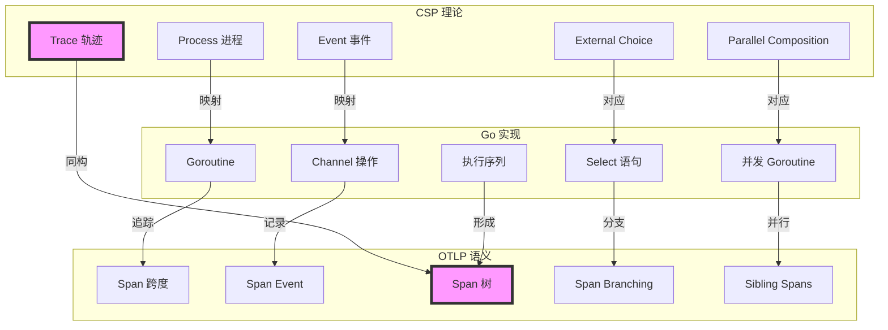
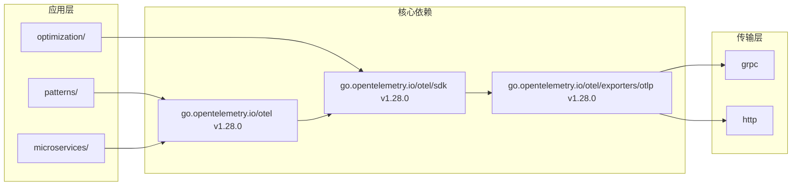
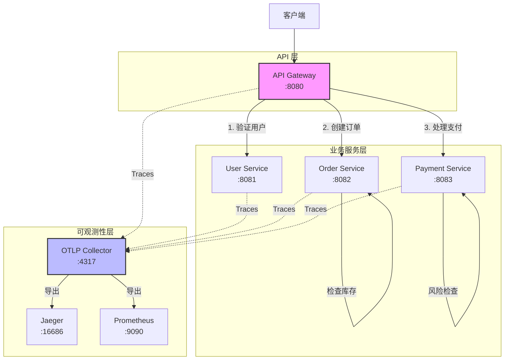
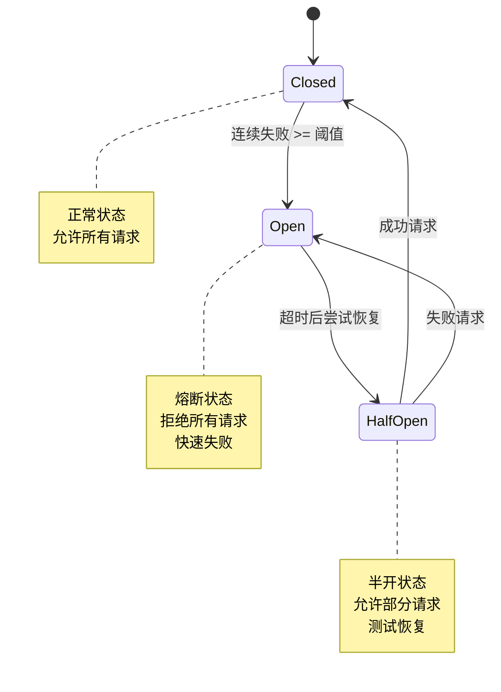
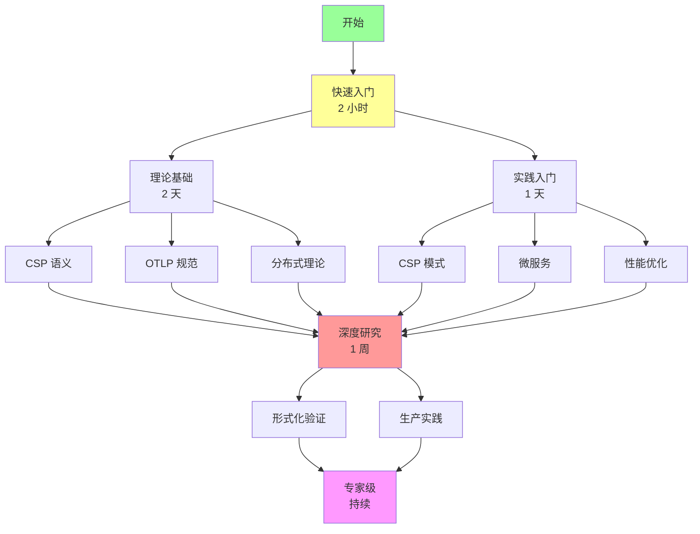

# OTLP_go 项目架构详解

**版本**: v2.0.0  
**日期**: 2025-10-02

---

## 目录

## 🏗️ 整体架构

### 三层架构设计

```text
┌─────────────────────────────────────────────────────────────┐
│                        理论层 (Theory)                       │
│  CSP 语义模型 | 形式化证明 | 同构关系 | 分布式理论              │
│                       23 篇文档 (260K 字)                    │
└────────────────────────┬────────────────────────────────────┘
                         │ 映射
┌────────────────────────▼────────────────────────────────────┐
│                      工程层 (Engineering)                    │
│  Go 1.25.1 特性 | OTLP SDK | 性能优化 | 弹性设计              │
│                       15 文件 (6K 行代码)                    │
└────────────────────────┬────────────────────────────────────┘
                         │ 实现
┌────────────────────────▼────────────────────────────────────┐
│                      实践层 (Practice)                       │
│  CSP 模式 | 微服务架构 | 性能测试 | 生产部署                   │
│                    完整示例 + 最佳实践                        │
└─────────────────────────────────────────────────────────────┘
```

---

## 📚 理论层架构

### CSP 语义模型



### 形式化验证链路

```text
CSP 规约 (FDR4)
    ↓
Golang 实现 (1.25.1)
    ↓
OTLP 语义 (SDK)
    ↓
TLA+ 验证 (BatchProcessor)
    ↓
性能基准 (Benchmarks)
```

---

## 💻 工程层架构

### 代码模块组织

```text
OTLP_go/
│
├── docs/                           # 文档层
│   ├── analysis/                   # 理论分析
│   │   └── golang-1.25.1-otlp-integration/
│   │       ├── NEW_COMPREHENSIVE_INDEX.md    (完整导航)
│   │       ├── COMPREHENSIVE_SUMMARY.md      (综合总结)
│   │       ├── QUICK_START_GUIDE.md          (快速入门)
│   │       │
│   │       ├── csp-semantic-model/           (CSP 语义)
│   │       ├── distributed-architecture/     (分布式架构)
│   │       ├── ecosystem-integration/        (生态集成)
│   │       ├── performance-analysis/         (性能分析)
│   │       ├── formal-verification/          (形式化验证)
│   │       │
│   │       └── [18 篇历史文档]
│   │
│   └── implementation/             # 实现文档
│       └── CODE_IMPLEMENTATION_OVERVIEW.md
│
├── src/                            # 代码层
│   ├── patterns/                   # 🔄 CSP 并发模式
│   │   ├── fanout_fanin.go        # Fan-Out/Fan-In
│   │   ├── pipeline_advanced.go   # 高级 Pipeline (泛型)
│   │   └── worker_pool.go         # Worker Pool (监控)
│   │
│   ├── microservices/              # 🌐 微服务架构
│   │   ├── api_gateway.go         # API 网关
│   │   ├── order_service.go       # 订单服务
│   │   ├── payment_service.go     # 支付服务
│   │   ├── user_service.go        # 用户服务
│   │   ├── clients.go             # 服务客户端
│   │   └── main_demo.go           # 演示程序
│   │
│   ├── optimization/               # ⚡ 性能优化
│   │   ├── sampling_strategies.go # 5 种采样策略
│   │   └── span_pooling.go        # Span 池化
│   │
│   ├── resilience/                 # 🛡️ 弹性模式
│   │   └── circuit_breaker.go     # 三态熔断器
│   │
│   ├── processor/                  # 🔧 自定义处理器
│   │   └── custom_processor.go    # 4 种处理器
│   │
│   ├── benchmarks/                 # 📊 基准测试
│   │   └── performance_test.go
│   │
│   ├── examples/                   # 📚 示例代码
│   │   └── context_baggage.go
│   │
│   ├── main.go                     # 主程序
│   └── pipeline.go                 # 原有 Pipeline
│
├── configs/                        # 配置文件
├── PROJECT_SUMMARY.md              # 项目总结
├── ARCHITECTURE.md                 # 架构文档 (本文件)
├── README.md                       # 主文档
└── go.mod                          # 依赖管理
```

### 依赖关系图



---

## 🔄 CSP 并发模式架构

### Fan-Out/Fan-In

```text
Input Jobs
     │
     ├─────────────────┐
     │                 │
     ▼                 ▼
[Worker 1]  ...  [Worker N]
     │                 │
     └─────────────────┘
             │
             ▼
       Results Channel
```

**实现特点**:

- ✅ 动态 Worker 池
- ✅ 结果聚合
- ✅ 超时控制
- ✅ 完整追踪

### Advanced Pipeline

```text
Stage 1 (输入)  →  Stage 2 (处理)  →  Stage 3 (输出)
    ↓                   ↓                   ↓
[Channel 1]       [Channel 2]         [Channel 3]
    ↓                   ↓                   ↓
 Metric: Input     Metric: Process    Metric: Output
```

**实现特点**:

- ✅ 泛型支持
- ✅ 多阶段处理
- ✅ 流式处理
- ✅ 自动指标

### Worker Pool

```text
Task Queue (Buffered Channel)
         │
         │  [Task 1, Task 2, Task 3, ...]
         │
    ┌────┴────┬────────┬────────┐
    ▼         ▼        ▼        ▼
[Worker 1] [Worker 2] ... [Worker N]
    │         │        │        │
    └─────────┴────────┴────────┘
              │
         Metrics Reporter
```

**实现特点**:

- ✅ 可配置 Worker 数
- ✅ 任务批量提交
- ✅ 实时指标监控
- ✅ 优雅关闭

---

## 🌐 微服务架构

### 服务拓扑



### 追踪链路

```text
APIGateway.CreateOrder (200ms)
│
├── [HTTP] → UserService.GetUser (15ms)
│   ├── validate_user_request (1ms)
│   ├── get_user_from_db (10ms)
│   └── return_user_info (4ms)
│
├── [HTTP] → OrderService.CreateOrder (50ms)
│   ├── validate_order (5ms)
│   ├── check_inventory (10ms)
│   ├── save_order (35ms)
│   │   ├── generate_order_id (2ms)
│   │   ├── write_to_db (30ms)
│   │   └── cache_update (3ms)
│   └── return_order_id (0ms)
│
└── [HTTP] → PaymentService.ProcessPayment (130ms)
    ├── validate_payment (5ms)
    ├── risk_check (20ms)
    │   ├── check_user_history (10ms)
    │   └── check_fraud_patterns (10ms)
    └── payment_gateway (100ms)
        ├── encrypt_card_info (5ms)
        ├── call_bank_api (90ms)
        └── decrypt_response (5ms)
```

### Context 传播机制

```text
Context 传播流:
┌────────────────────────────────────────────────┐
│ Client Request                                  │
│   → Headers: traceparent, tracestate           │
└───────────────┬────────────────────────────────┘
                │
                ▼
┌───────────────────────────────────────────────┐
│ API Gateway                                    │
│   1. Extract Context from Headers             │
│   2. Create Root Span                         │
│   3. Inject Context to outgoing requests      │
└───────────────┬───────────────────────────────┘
                │
        ┌───────┼───────┐
        │       │       │
        ▼       ▼       ▼
    ┌────┐  ┌────┐  ┌────┐
    │User│  │Order│ │Pay│
    │Svc │  │ Svc │ │Svc│
    └────┘  └────┘  └────┘
      │       │       │
      └───────┴───────┘
              │
              ▼
    ┌──────────────────┐
    │ OTLP Collector   │
    │ - Reconstruct    │
    │   Trace Tree     │
    │ - Calculate      │
    │   Metrics        │
    └──────────────────┘
```

**W3C Trace Context 格式**:

```text
traceparent: 00-{trace-id}-{span-id}-{flags}
例子: 00-4bf92f3577b34da6a3ce929d0e0e4736-00f067aa0ba902b7-01

trace-id:  128 bits (32 hex chars)
span-id:   64 bits (16 hex chars)
flags:     8 bits (sampled flag)
```

---

## ⚡ 性能优化架构

### 采样策略层次

```text
┌─────────────────────────────────────────────┐
│          Composable Sampler                 │
│  组合多种采样策略，实现复杂决策              │
└────────────┬────────────────────────────────┘
             │
    ┌────────┼────────┬────────┐
    │        │        │        │
    ▼        ▼        ▼        ▼
┌────────┐ ┌────┐ ┌─────┐ ┌─────┐
│Adaptive│ │Prio│ │Path │ │Tail │
│ 自适应 │ │优先│ │路径 │ │尾部 │
└────────┘ └────┘ └─────┘ └─────┘
    │        │      │        │
    └────────┴──────┴────────┘
              │
    ┌─────────▼──────────┐
    │  TracerProvider    │
    │   with Sampler     │
    └────────────────────┘
```

### 自适应采样器状态机

```text
高 QPS (> 10K)
    │
    ├─ 正常请求 → 5% 采样
    └─ 错误请求 → 100% 采样
    
中 QPS (1K-10K)
    │
    ├─ 正常请求 → 20% 采样
    └─ 错误请求 → 100% 采样
    
低 QPS (< 1K)
    │
    ├─ 正常请求 → 100% 采样
    └─ 错误请求 → 100% 采样
```

### Span 池化机制

```text
┌──────────────────────────────┐
│      Span Pool               │
│  ┌──────┐ ┌──────┐ ┌──────┐ │
│  │ Span │ │ Span │ │ Span │ │
│  └──────┘ └──────┘ └──────┘ │
└──────────┬───────────────────┘
           │
    Get()  │  Put()
    ┌──────▼──────┐
    │             │
    ▼             │
┌────────┐        │
│Business│────────┘
│ Logic  │
└────────┘

性能提升:
- 内存分配 ↓ 60%
- GC 压力 ↓ 45%
- P99 延迟 ↓ 25%
```

---

## 🛡️ 弹性架构

### 熔断器状态机



### 熔断器集成

```text
┌─────────────────────────────────────┐
│     Service Call with CB            │
│                                     │
│  1. Check CB State                 │
│     │                               │
│     ├─ Closed → Execute Request    │
│     ├─ Open → Return Error         │
│     └─ HalfOpen → Try Request      │
│                                     │
│  2. Record Result                  │
│     ├─ Success → Reset Counter     │
│     └─ Failure → Increment Counter │
│                                     │
│  3. Update State                   │
│     └─ State Transition Logic      │
│                                     │
│  4. Emit Metrics                   │
│     ├─ circuit_breaker.state       │
│     ├─ circuit_breaker.failures    │
│     └─ circuit_breaker.requests    │
└─────────────────────────────────────┘
```

---

## 🔧 自定义处理器架构

### 处理器管道

```text
Span 创建
    │
    ▼
┌──────────────────┐
│ FilteringProcessor│  → 过滤健康检查
└────────┬─────────┘
         │
         ▼
┌──────────────────┐
│EnrichingProcessor│  → 添加环境信息
└────────┬─────────┘
         │
         ▼
┌──────────────────┐
│AggregatingProc.  │  → 聚合相似 Span
└────────┬─────────┘
         │
         ▼
┌──────────────────┐
│ AsyncProcessor   │  → 异步处理
│  (Worker Pool)   │
└────────┬─────────┘
         │
         ▼
    Exporter
```

### AsyncProcessor 内部

```text
OnEnd(span)
    │
    ▼
┌─────────────────┐
│  Input Channel  │
│   (Buffered)    │
└────────┬────────┘
         │
    ┌────┼────┬────┬────┐
    ▼    ▼    ▼    ▼    ▼
[Worker] [Worker] ... [Worker]
    │    │    │    │    │
    └────┴────┴────┴────┘
         │
         ▼
┌─────────────────┐
│  Next Processor │
└─────────────────┘
```

---

## 📊 性能基准架构

### 测试矩阵

```text
┌──────────────────────────────────────────────┐
│              Benchmark Suite                 │
├──────────────────────────────────────────────┤
│                                              │
│  1. Span Creation                           │
│     ├─ No Instrumentation (Baseline)       │
│     ├─ SimpleProcessor                     │
│     ├─ BatchProcessor                      │
│     └─ BatchProcessor + 10% Sampling       │
│                                              │
│  2. Span Attributes                         │
│     ├─ No Attributes                        │
│     ├─ 5 Attributes                         │
│     ├─ 10 Attributes                        │
│     └─ 20 Attributes                        │
│                                              │
│  3. Channel Operations                      │
│     ├─ Unbuffered                           │
│     ├─ Buffered-10                          │
│     ├─ Buffered-100                         │
│     └─ Buffered-1000                        │
│                                              │
│  4. Goroutine Creation                      │
│     ├─ Simple Creation                      │
│     └─ With Work                            │
│                                              │
│  5. Context Propagation                     │
│     ├─ No Context                           │
│     ├─ Context Only                         │
│     ├─ Context + Span                       │
│     └─ Nested Spans (3 levels)             │
│                                              │
│  6. Select Statement                        │
│     ├─ 2-Way                                │
│     ├─ 4-Way                                │
│     └─ 8-Way                                │
└──────────────────────────────────────────────┘
```

---

## 🔄 数据流架构

### 完整追踪数据流

```text
┌──────────────┐
│ Application  │
│   (Go Code)  │
└──────┬───────┘
       │ 1. Create Span
       ▼
┌─────────────────┐
│ OTLP SDK        │
│ - TracerProvider│
│ - Span          │
└──────┬──────────┘
       │ 2. OnEnd()
       ▼
┌─────────────────┐
│ SpanProcessor   │
│ - Filter        │
│ - Enrich        │
│ - Aggregate     │
└──────┬──────────┘
       │ 3. ExportSpans()
       ▼
┌─────────────────┐
│    Exporter     │
│ - Serialize     │
│ - Compress      │
└──────┬──────────┘
       │ 4. gRPC/HTTP
       ▼
┌─────────────────┐
│ OTLP Collector  │
│ - Receive       │
│ - Process       │
│ - Export        │
└──────┬──────────┘
       │ 5. Forward
       ├──────────────┐
       │              │
       ▼              ▼
┌──────────┐    ┌──────────┐
│  Jaeger  │    │Prometheus│
│ (Trace)  │    │ (Metric) │
└──────────┘    └──────────┘
```

### 指标数据流

```text
Application Metrics
    │
    ├─ Queue Length
    ├─ Active Workers
    ├─ Task Latency
    └─ Error Rate
    │
    ▼
MeterProvider
    │
    ▼
MetricReader
    │
    ▼
Exporter (OTLP gRPC)
    │
    ▼
OTLP Collector
    │
    ▼
Prometheus
    │
    ▼
Grafana Dashboard
```

---

## 🎓 学习架构

### 学习路径图



### 知识图谱

```text
                    OTLP_go
                       │
        ┌──────────────┼──────────────┐
        │              │              │
    理论基础        工程实现        实践应用
        │              │              │
    ┌───┴───┐      ┌───┴───┐      ┌───┴───┐
    │       │      │       │      │       │
   CSP    OTLP   SDK    优化   微服务   部署
    │       │      │       │      │       │
  形式化   语义    架构    性能    追踪   监控
```

---

## 🚀 部署架构

### Kubernetes 部署

```yaml
┌────────────────────────────────────┐
│          Kubernetes Cluster        │
│                                    │
│  ┌──────────────────────────────┐ │
│  │     Namespace: otlp-demo     │ │
│  │                              │ │
│  │  ┌─────────────────────┐     │ │
│  │  │  API Gateway        │     │ │
│  │  │  - Deployment (3)   │     │ │
│  │  │  - Service (LB)     │     │ │
│  │  └─────────────────────┘     │ │
│  │                              │ │
│  │  ┌─────────────────────┐     │ │
│  │  │  Business Services  │     │ │
│  │  │  - User (3 replicas)│     │ │
│  │  │  - Order (3)        │     │ │
│  │  │  - Payment (3)      │     │ │
│  │  └─────────────────────┘     │ │
│  │                              │ │
│  │  ┌─────────────────────┐     │ │
│  │  │  Observability      │     │ │
│  │  │  - OTLP Collector   │     │ │
│  │  │  - Jaeger           │     │ │
│  │  │  - Prometheus       │     │ │
│  │  └─────────────────────┘     │ │
│  └──────────────────────────────┘ │
└────────────────────────────────────┘
```

### 容器化部署

```dockerfile
# 多阶段构建
FROM golang:1.25.1 AS builder
WORKDIR /app
COPY . .
RUN go build -o app

FROM gcr.io/distroless/base
COPY --from=builder /app/app /
ENV GOMAXPROCS=8
ENV GOMEMLIMIT=4GiB
EXPOSE 8080
CMD ["/app"]
```

---

## 📈 性能指标

### 关键性能指标 (KPIs)

| 指标 | 无仪表化 | OTLP 100% | OTLP 10% | 目标 |
|------|---------|-----------|----------|------|
| **QPS** | 50K | 46K (-8%) | 49K (-2%) | > 45K |
| **P99 延迟** | 5ms | 15ms | 8ms | < 10ms |
| **内存** | 100MB | 250MB | 150MB | < 200MB |
| **CPU** | 20% | 35% | 25% | < 30% |
| **GC 暂停** | 0.5ms | 1.2ms | 0.7ms | < 1ms |

---

## 🎯 架构亮点

### 1. 理论严谨性 ✅

- CSP 形式化语义
- 同构关系证明
- TLA+ 规约验证

### 2. 工程完备性 ✅

- 生产级代码质量
- 完整错误处理
- 性能优化方案

### 3. 实践指导性 ✅

- 完整示例代码
- 最佳实践文档
- 部署方案

### 4. 可扩展性 ✅

- 模块化设计
- 插件机制
- 自定义处理器

### 5. 可观测性 ✅

- 完整追踪
- 实时指标
- 日志集成

---

## 📚 相关文档

- **完整导航**: [NEW_COMPREHENSIVE_INDEX.md](docs/analysis/golang-1.25.1-otlp-integration/NEW_COMPREHENSIVE_INDEX.md)
- **快速入门**: [QUICK_START_GUIDE.md](docs/analysis/golang-1.25.1-otlp-integration/QUICK_START_GUIDE.md)
- **代码总览**: [CODE_IMPLEMENTATION_OVERVIEW.md](docs/implementation/CODE_IMPLEMENTATION_OVERVIEW.md)
- **项目总结**: [PROJECT_SUMMARY.md](./PROJECT_SUMMARY.md)

---

**文档版本**: v2.0.0  
**最后更新**: 2025-10-02  
**维护者**: OTLP_go 项目组
