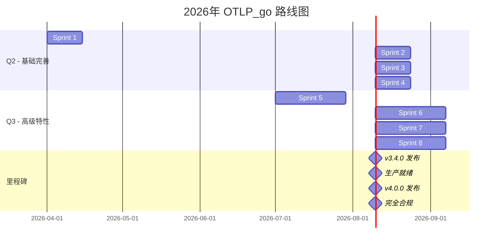

# 📅 OTLP_go 2026年 Q2-Q3 可持续推进路线图

**制定日期**: 2026-03-15
**执行周期**: 2026年 Q2 (4-6月) - Q3 (7-9月)
**目标**: 实现 OTLP 标准完全合规，达到生产就绪状态

---

## 🎯 愿景与目标

### 总体愿景
>
> 打造业界领先的 Go + OTLP 技术参考实现，完全符合 OpenTelemetry 最新标准

### 量化目标

| 指标 | 当前 | Q2 目标 | Q3 目标 | 最终 |
|------|------|---------|---------|------|
| OTLP 标准符合度 | 65% | 80% | 95% | 100% |
| 四支柱信号完整度 | 48% | 75% | 100% | 100% |
| 测试覆盖率 | 82% | 85% | 90% | 95% |
| 安全合规评分 | 60 | 80 | 95 | 100 |
| 文档完整度 | 85% | 90% | 95% | 100% |

---

## 📆 Q2 (4-6月) 详细计划

### Sprint 1 (Week 1-2): 紧急修复期

**主题**: 安全与兼容性

#### 任务清单

```markdown
□ P0-001: 替换所有 WithInsecure() 调用
  - 影响范围: examples/*, src/pkg/otel/*
  - 验收标准: 代码扫描无不安全配置
  - 负责人: Dev Team
  - 工期: 2天

□ P0-002: 升级 Semantic Conventions v1.26 → v1.30
  - 影响范围: 全部 Go 文件
  - 验收标准: 无 v1.26.0 引用，测试通过
  - 负责人: Dev Team
  - 工期: 2天

□ P0-003: 添加 Exporter 重试配置
  - 影响范围: src/main.go, src/metrics.go
  - 验收标准: 所有 Exporter 配置重试
  - 负责人: Dev Team
  - 工期: 1天

□ P0-004: 更新安全文档
  - 影响范围: docs/*, README.md
  - 验收标准: 无不安全示例代码
  - 负责人: Tech Writer
  - 工期: 2天
```

#### 里程碑 1.1

```
✅ 所有示例代码使用 TLS
✅ semconv v1.30.0 全量替换
✅ 安全扫描通过
✅ 文档更新完成
```

---

### Sprint 2 (Week 3-4): Logs 信号实现

**主题**: 完善四支柱 - Logs

#### 任务清单

```markdown
□ P1-001: 实现 OTLP Logs Exporter
  - 新建: src/logs.go
  - 实现: initLogProvider()
  - 工期: 3天

□ P1-002: 创建 LoggerProvider 配置
  - 批处理配置
  - 资源属性配置
  - 链路关联配置
  - 工期: 2天

□ P1-003: 实现日志与 Trace 关联
  - TraceID injection
  - SpanContext 传递
  - 工期: 2天

□ P1-004: Logs 示例代码
  - 新建: examples/logs/main.go
  - 包含: 结构化日志、关联追踪
  - 工期: 2天

□ P1-005: Logs 单元测试
  - 覆盖率目标: 80%
  - 测试: 导出、批处理、重试
  - 工期: 3天
```

#### 里程碑 1.2

```
✅ Logs Exporter 可用
✅ LoggerProvider 配置完善
✅ 日志与 Trace 自动关联
✅ 示例代码可运行
✅ 单元测试覆盖 80%
```

---

### Sprint 3 (Week 5-6): Metrics 完善

**主题**: Metrics 高级特性

#### 任务清单

```markdown
□ P1-006: 添加 Views 配置
  - 聚合类型选择
  - 属性过滤
  - 工期: 2天

□ P1-007: 实现 Cardinality 限制
  - 防止标签爆炸
  - 配置项: WithCardinalityLimit
  - 工期: 2天

□ P1-008: 实现 PartialSuccess 处理
  - 解析 PartialSuccess 响应
  - 记录拒绝指标
  - 触发告警
  - 工期: 3天

□ P1-009: Exemplars 支持
  - 关联 Trace 到 Metrics
  - 配置采样策略
  - 工期: 3天
```

#### 里程碑 1.3

```
✅ Views 配置可用
✅ Cardinality 保护生效
✅ PartialSuccess 正确处理
✅ Exemplars 支持完善
```

---

### Sprint 4 (Week 7-8): 稳定性提升

**主题**: 生产就绪特性

#### 任务清单

```markdown
□ P1-010: SDK 自观测指标
  - 导出队列深度
  - 批处理大小分布
  - 导出延迟直方图
  - 重试次数计数
  - 工期: 3天

□ P1-011: 连接状态管理
  - 健康检查端点
  - 连接状态指标
  - 自动重连机制
  - 工期: 3天

□ P1-012: 配置热更新
  - 采样率动态调整
  - 批处理参数调整
  - 无需重启生效
  - 工期: 4天

□ P1-013: 性能基准测试
  - 建立性能基线
  - 对比优化前后
  - 自动化报告
  - 工期: 2天
```

#### 里程碑 1.4 (Q2 结束)

```
✅ SDK 自观测完善
✅ 连接管理健壮
✅ 配置可热更新
✅ 性能基线建立
✅ 生产就绪状态
```

---

## 📆 Q3 (7-9月) 详细计划

### Sprint 5 (Week 9-12): Profiles 信号

**主题**: 实现第四支柱

#### 任务清单

```markdown
□ P2-001: 研究 Profiles 协议
  - OTLP Profiles 规范研读
  - pprof 格式理解
  - 工期: 2天

□ P2-002: 实现 Profile Exporter
  - 新建: src/profiles.go
  - 集成: otlpprofilegrpc
  - 工期: 5天

□ P2-003: ProfileProvider 配置
  - 采样策略配置
  - 位置信息映射
  - 与 Trace 关联
  - 工期: 3天

□ P2-004: Profiles 示例
  - CPU Profiling 示例
  - Memory Profiling 示例
  - 持续 Profiling 配置
  - 工期: 3天

□ P2-005: Profiles 测试
  - 单元测试: 85% 覆盖
  - 集成测试
  - 端到端验证
  - 工期: 5天
```

#### 里程碑 2.1

```
✅ Profiles Exporter 可用
✅ CPU/Memory Profiling 支持
✅ 持续 Profiling 可配置
✅ 与 Traces 自动关联
```

---

### Sprint 6 (Week 13-16): 高级特性

**主题**: OTLP v1.5.0 新特性

#### 任务清单

```markdown
□ P2-006: Entity Events 实现
  - Entity 概念建模
  - 生命周期事件
  - K8s 集成
  - 工期: 5天

□ P2-007: 新响应头格式
  - OTel-Response-* 解析
  - 服务端提示处理
  - 工期: 2天

□ P2-008: 批量大小协商
  - 服务端最大批量限制
  - 自适应调整
  - 工期: 3天

□ P2-009: 改进的错误码
  - 新错误码映射
  - 用户友好错误信息
  - 诊断建议
  - 工期: 2天
```

#### 里程碑 2.2

```
✅ Entity Events 支持
✅ 新响应格式兼容
✅ 批量协商生效
✅ 错误处理完善
```

---

### Sprint 7 (Week 17-20): 生态集成

**主题**: 云原生生态

#### 任务清单

```markdown
□ P2-010: OpenTelemetry Operator 集成
  - Sidecar 注入支持
  - 配置自动发现
  - 资源属性注入
  - 工期: 4天

□ P2-011: Service Graph 支持
  - 服务拓扑数据
  - 依赖关系映射
  - 延迟分布
  - 工期: 3天

□ P2-012: 自动伸缩集成
  - HPA 指标暴露
  - KEDA 触发器
  - 自定义指标
  - 工期: 3天

□ P2-013: GitOps 集成
  - ArgoCD 健康检查
  - Flux 配置同步
  - 渐进式发布
  - 工期: 4天
```

#### 里程碑 2.3

```
✅ Operator 集成完成
✅ Service Graph 可用
✅ 自动伸缩支持
✅ GitOps 友好
```

---

### Sprint 8 (Week 21-24): 合规认证

**主题**: 标准化与认证

#### 任务清单

```markdown
□ P2-014: OTLP 兼容性测试套件
  - 自动化测试
  - 多版本验证
  - CI 集成
  - 工期: 5天

□ P2-015: Semantic Conventions 验证
  - 属性合规检查
  - 自动生成报告
  - 不合规告警
  - 工期: 3天

□ P2-016: 性能基准对比
  - 与官方 SDK 对比
  - 性能回归测试
  - 优化报告
  - 工期: 3天

□ P2-017: 安全审计
  - 第三方安全扫描
  - 漏洞修复
  - 安全报告
  - 工期: 5天

□ P2-018: 文档全面更新
  - API 文档更新
  - 最佳实践指南
  - 迁移指南
  - 工期: 4天
```

#### 里程碑 2.4 (Q3 结束)

```
✅ 兼容性测试通过
✅ Semantic Conventions 合规
✅ 性能基准达标
✅ 安全审计通过
✅ 文档完整更新
✅ 发布 v4.0.0
```

---

## 📊 资源规划

### 人力分配

| 角色 | Q2 投入 | Q3 投入 | 主要职责 |
|------|---------|---------|----------|
| 高级开发 | 80% | 70% | 架构设计、核心实现 |
| 后端开发 | 100% | 100% | 功能实现、测试 |
| 技术写作 | 50% | 80% | 文档、示例、教程 |
| DevOps | 30% | 60% | CI/CD、Operator、集成 |
| 测试工程师 | 40% | 60% | 测试套件、兼容性验证 |

### 外部依赖

| 依赖 | 当前版本 | 目标版本 | 计划时间 |
|------|----------|----------|----------|
| OpenTelemetry Go | v1.32.0 | v1.36.0 | Q2 |
| OTLP Proto | v1.5.0 | v1.7.0 | Q2 |
| Semantic Conventions | v1.26.0 | v1.32.0 | Q2 |
| OpenTelemetry Collector | v0.110 | v0.120 | Q3 |

---

## 🎯 关键里程碑



---

## 📈 成功指标

### 技术指标

```
代码覆盖率:      82% → 90%
测试通过率:      100% 保持
Race-free:       保持
性能损耗:        <5% (vs 无仪表化)
内存占用:        <200MB
启动时间:        <2s
```

### 合规指标

```
OTLP 协议符合度:   65% → 95%
Semantic Conventions: 70% → 95%
安全合规:          60 → 95
文档完整度:        85% → 95%
```

### 社区指标

```
GitHub Stars:      目标 1000+
Contributors:      目标 20+
Downloads:         目标 10K+/月
Issues 响应时间:    <24h
```

---

## 🚨 风险与缓解

| 风险 | 概率 | 影响 | 缓解措施 |
|------|------|------|----------|
| OTLP 标准再次更新 | 高 | 中 | 建立自动化跟踪机制 |
| 核心人员变动 | 中 | 高 | 文档化、知识分享 |
| 性能不达标 | 中 | 高 | 早期基准测试、优化 |
| 依赖兼容性问题 | 中 | 中 | 锁定版本、隔离测试 |
| 资源不足 | 低 | 高 | 优先级管理、分批交付 |

---

## 📚 附录

### A. 参考资源

- [OpenTelemetry Roadmap](https://github.com/open-telemetry/opentelemetry-specification/blob/main/roadmap.md)
- [OTLP Changelog](https://github.com/open-telemetry/opentelemetry-proto/blob/main/CHANGELOG.md)
- [Go SDK Changelog](https://github.com/open-telemetry/opentelemetry-go/blob/main/CHANGELOG.md)

### B. 工具清单

- 兼容性测试: `opentelemetry-collector-contrib/testbed`
- 性能测试: `go test -bench`
- 安全扫描: `gosec`, `nancy`
- 文档生成: `godoc`, `pkgsite`

### C. 评审检查点

- [ ] Week 4: Sprint 2 结束评审
- [ ] Week 8: Q2 结束评审
- [ ] Week 12: Sprint 5 结束评审
- [ ] Week 16: Sprint 6 结束评审
- [ ] Week 20: Sprint 7 结束评审
- [ ] Week 24: Q3 结束评审 & 发布 v4.0.0

---

**制定团队**: OTLP_go Core Team
**审核人**: Tech Lead, Product Manager
**批准状态**: 🟡 待审核
