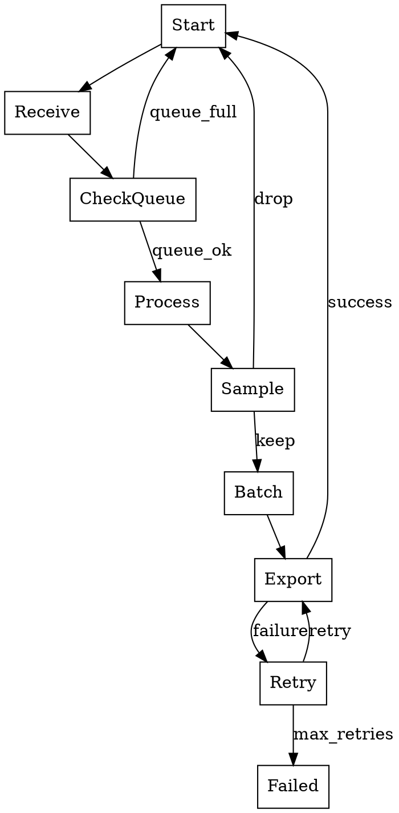

# OTLP 系统的控制流、执行流与数据流分析

## 目录

- [OTLP 系统的控制流、执行流与数据流分析](#otlp-系统的控制流执行流与数据流分析)
  - [目录](#目录)
  - [1. 概述](#1-概述)
  - [2. 控制流分析 (Control Flow)](#2-控制流分析-control-flow)
    - [2.1 控制流图 (CFG)](#21-控制流图-cfg)
    - [2.2 OPAMP 控制平面](#22-opamp-控制平面)
    - [2.3 采样决策控制流](#23-采样决策控制流)
    - [2.4 背压控制流](#24-背压控制流)
  - [3. 执行流分析 (Execution Flow)](#3-执行流分析-execution-flow)
    - [3.1 Pipeline 执行模型](#31-pipeline-执行模型)
    - [3.2 并发执行模式](#32-并发执行模式)
    - [3.3 批处理执行流](#33-批处理执行流)
    - [3.4 重试与故障恢复执行流](#34-重试与故障恢复执行流)
  - [4. 数据流分析 (Data Flow)](#4-数据流分析-data-flow)
    - [4.1 数据流图 (DFG)](#41-数据流图-dfg)
    - [4.2 数据转换链](#42-数据转换链)
    - [4.3 数据依赖分析](#43-数据依赖分析)
    - [4.4 数据流优化](#44-数据流优化)
  - [5. 三流融合分析](#5-三流融合分析)
    - [5.1 控制流驱动的数据流](#51-控制流驱动的数据流)
    - [5.2 数据流反馈控制流](#52-数据流反馈控制流)
    - [5.3 执行流调度策略](#53-执行流调度策略)
  - [6. 形式化模型](#6-形式化模型)
    - [6.1 控制流自动机](#61-控制流自动机)
    - [6.2 数据流方程](#62-数据流方程)
    - [6.3 执行流时序逻辑](#63-执行流时序逻辑)
  - [7. 性能分析](#7-性能分析)
    - [7.1 关键路径分析](#71-关键路径分析)
    - [7.2 瓶颈识别](#72-瓶颈识别)
    - [7.3 优化策略](#73-优化策略)
  - [8. 可视化工具](#8-可视化工具)
    - [8.1 控制流可视化](#81-控制流可视化)
    - [8.2 数据流追踪](#82-数据流追踪)
    - [8.3 执行流剖析](#83-执行流剖析)
  - [9. 参考文献](#9-参考文献)

## 1. 概述

OTLP 系统作为分布式可观测性平台,其正确性和性能依赖于三个核心流的协调:

- **控制流 (Control Flow)**: 决策逻辑的传播路径,包括采样决策、路由策略、配置更新
- **执行流 (Execution Flow)**: 计算任务的调度与执行顺序,包括并发处理、批量操作、重试机制
- **数据流 (Data Flow)**: 遥测数据的转换与传输路径,包括序列化、压缩、聚合、存储

本文档从**程序分析**和**编译器优化**的视角,对这三流进行深入剖析。

## 2. 控制流分析 (Control Flow)

### 2.1 控制流图 (CFG)

**OTLP Collector Pipeline 的控制流图**:

```text
┌─────────────┐
│   Start     │
└──────┬──────┘
       │
       ▼
┌─────────────────────┐
│  Receive OTLP Data  │
└──────┬──────────────┘
       │
       ▼
┌─────────────────────┐
│  Check Queue Size   │◄──────────────┐
└──────┬──────────────┘               │
       │                              │
       ├─── [Queue Full] ─────────────┤
       │                              │
       ├─── [Queue OK] ───────────────┤
       │                              │
       ▼                              │
┌─────────────────────┐               │
│  Apply Processors   │               │
│  (Transform/Filter) │               │
└──────┬──────────────┘               │
       │                              │
       ▼                              │
┌─────────────────────┐               │
│  Sampling Decision  │               │
└──────┬──────────────┘               │
       │                              │
       ├─── [Drop] ───────────────────┤
       │                              │
       ├─── [Keep] ───────────────────┤
       │                              │
       ▼                              │
┌─────────────────────┐               │
│  Batch Accumulation │               │
└──────┬──────────────┘               │
       │                              │
       ├─── [Batch Not Full] ─────────┘
       │
       ├─── [Batch Full or Timeout] ──┐
       │                              │
       ▼                              │
┌─────────────────────┐               │
│  Export to Backend  │               │
└──────┬──────────────┘               │
       │                              │
       ├─── [Success] ────────────────┤
       │                              │
       ├─── [Failure] ────────────────┤
       │                              │
       ▼                              │
┌─────────────────────┐               │
│  Retry Logic        │               │
└──────┬──────────────┘               │
       │                              │
       ├─── [Max Retries] ────────────┤
       │                              │
       └─── [Retry] ──────────────────┘
```

**控制流特性**:

1. **循环结构**: 重试逻辑形成循环,需要终止条件保证有限性
2. **条件分支**: 采样决策、队列状态检查引入多路分支
3. **嵌套控制**: 批处理内部包含超时和大小两个控制条件

### 2.2 OPAMP 控制平面

**配置下发控制流**:

```text
┌─────────────────────────────────────────────────────────────┐
│                    OPAMP Server                             │
│  ┌──────────────┐  ┌──────────────┐  ┌──────────────┐       │
│  │ Policy Engine│  │ Config Store │  │ Health Monitor│      │
│  └──────┬───────┘  └──────┬───────┘  └──────┬───────┘       │
└─────────┼──────────────────┼──────────────────┼─────────────┘
          │                  │                  │
          │ (1) Detect       │ (2) Generate     │ (3) Monitor
          │     Anomaly      │     New Config   │     Health
          │                  │                  │
          ▼                  ▼                  ▼
┌─────────────────────────────────────────────────────────────┐
│                    Agent Control Loop                       │
│                                                             │
│  while true:                                                │
│    1. heartbeat = send_status(server)                       │
│    2. if heartbeat.has_config:                              │
│         config = receive_config()                           │
│         if verify_signature(config):                        │
│           apply_config(config)                              │
│    3. if health_check_failed():                             │
│         rollback_config()                                   │
│    4. sleep(heartbeat_interval)                             │
└─────────────────────────────────────────────────────────────┘
```

**控制流不变量**:

```text
∀ config ∈ AppliedConfigs:
  signature_valid(config) ∧ 
  hash_match(config) ∧ 
  capability_check(config)
```

### 2.3 采样决策控制流

**尾部采样 (Tail Sampling) 决策树**:

```text
                  ┌─────────────────┐
                  │ Receive Span    │
                  └────────┬────────┘
                           │
                           ▼
                  ┌─────────────────┐
                  │ Buffer in Memory│
                  │ (Wait for Trace)│
                  └────────┬────────┘
                           │
                  ┌────────▼────────┐
                  │ Decision Wait   │
                  │ Timeout (10s)   │
                  └────────┬────────┘
                           │
                           ▼
        ┌──────────────────┴──────────────────┐
        │                                     │
        ▼                                     ▼
┌───────────────┐                   ┌───────────────┐
│ Status=ERROR? │                   │ Latency > 1s? │
└───────┬───────┘                   └───────┬───────┘
        │                                   │
    [Yes]│                               [Yes]│
        │                                   │
        ▼                                   ▼
    ┌───────┐                           ┌───────┐
    │ KEEP  │                           │ KEEP  │
    └───────┘                           └───────┘
        │                                   │
    [No]│                                [No]│
        │                                   │
        └───────────────┬───────────────────┘
                        │
                        ▼
              ┌─────────────────┐
              │ Probabilistic   │
              │ Sample (10%)    │
              └────────┬────────┘
                       │
              ┌────────▼────────┐
              │ Random() < 0.1? │
              └────────┬────────┘
                       │
                  [Yes]│[No]
                       │
          ┌────────────┴────────────┐
          ▼                         ▼
      ┌───────┐                 ┌───────┐
      │ KEEP  │                 │ DROP  │
      └───────┘                 └───────┘
```

### 2.4 背压控制流

**自适应背压算法**:

```go
type BackpressureController struct {
    queueSize     atomic.Int64
    queueCapacity int64
    samplingRate  atomic.Float64
}

func (b *BackpressureController) ControlLoop(ctx context.Context) {
    ticker := time.NewTicker(1 * time.Second)
    defer ticker.Stop()
    
    for {
        select {
        case <-ticker.C:
            utilization := float64(b.queueSize.Load()) / float64(b.queueCapacity)
            
            // 控制流决策
            switch {
            case utilization > 0.9:
                // 严重拥塞: 降采样至 5%
                b.samplingRate.Store(0.05)
            case utilization > 0.7:
                // 中度拥塞: 降采样至 20%
                b.samplingRate.Store(0.20)
            case utilization < 0.5:
                // 恢复正常: 采样率 50%
                b.samplingRate.Store(0.50)
            }
            
        case <-ctx.Done():
            return
        }
    }
}
```

## 3. 执行流分析 (Execution Flow)

### 3.1 Pipeline 执行模型

**并发 Pipeline 执行图**:

```text
┌────────────────────────────────────────────────────────────┐
│                    Receiver Goroutines                     │
│  ┌──────────┐  ┌──────────┐  ┌──────────┐  ┌──────────┐   │
│  │ gRPC-1   │  │ gRPC-2   │  │ HTTP-1   │  │ HTTP-2   │   │
│  └────┬─────┘  └────┬─────┘  └────┬─────┘  └────┬─────┘   │
└───────┼─────────────┼─────────────┼─────────────┼─────────┘
        │             │             │             │
        └─────────────┴─────────────┴─────────────┘
                            │
                            ▼
        ┌───────────────────────────────────────┐
        │      Fan-Out to Processor Pool        │
        │  ┌────────┐  ┌────────┐  ┌────────┐   │
        │  │ Proc-1 │  │ Proc-2 │  │ Proc-3 │   │
        │  └────┬───┘  └────┬───┘  └────┬───┘   │
        └───────┼───────────┼───────────┼───────┘
                │           │           │
                └───────────┴───────────┘
                            │
                            ▼
        ┌───────────────────────────────────────┐
        │      Batch Accumulator (Mutex)        │
        │  ┌─────────────────────────────────┐  │
        │  │  buffer []Item                  │  │
        │  │  timer  *time.Timer             │  │
        │  └─────────────────────────────────┘  │
        └───────────────┬───────────────────────┘
                        │
                        ▼
        ┌───────────────────────────────────────┐
        │      Exporter Goroutines              │
        │  ┌──────────┐  ┌──────────┐           │
        │  │ Export-1 │  │ Export-2 │           │
        │  └──────────┘  └──────────┘           │
        └───────────────────────────────────────┘
```

**执行流特性**:

1. **并发度**: Receiver 和 Processor 高并发,Batch Accumulator 串行化
2. **同步点**: Batch 操作是关键同步点,需要互斥锁保护
3. **异步导出**: Exporter 异步执行,避免阻塞主流程

### 3.2 并发执行模式

**Go 并发模式实现**:

```go
// Worker Pool 模式
type ProcessorPool struct {
    workers   int
    inputCh   chan Item
    outputCh  chan Item
    wg        sync.WaitGroup
}

func (p *ProcessorPool) Start(ctx context.Context) {
    for i := 0; i < p.workers; i++ {
        p.wg.Add(1)
        go p.worker(ctx, i)
    }
}

func (p *ProcessorPool) worker(ctx context.Context, id int) {
    defer p.wg.Done()
    
    for {
        select {
        case item := <-p.inputCh:
            // 执行流: 处理数据
            processed := p.process(item)
            
            // 执行流: 发送到下游
            select {
            case p.outputCh <- processed:
            case <-ctx.Done():
                return
            }
            
        case <-ctx.Done():
            return
        }
    }
}
```

**执行流时序图**:

```text
Time →
Goroutine-1: ──[Recv]──[Proc]──────────[Batch]──[Export]──
Goroutine-2: ────[Recv]──[Proc]────[Batch]──────[Export]──
Goroutine-3: ──────[Recv]──[Proc]──[Batch]──────[Export]──
                                    ↑
                                    │
                            Synchronization Point
```

### 3.3 批处理执行流

**批处理状态机**:

```text
┌─────────────┐
│    IDLE     │
└──────┬──────┘
       │ (1) First item arrives
       ▼
┌─────────────┐
│ ACCUMULATING│◄──────┐
└──────┬──────┘       │
       │              │
       ├─ (2) Add item
       │              │
       ├─ (3) Batch size reached OR Timeout
       │
       ▼
┌─────────────┐
│  FLUSHING   │
└──────┬──────┘
       │ (4) Export batch
       ▼
┌─────────────┐
│    IDLE     │
└─────────────┘
```

**批处理执行代码**:

```go
type BatchProcessor struct {
    buffer       []Item
    batchSize    int
    flushTimeout time.Duration
    timer        *time.Timer
    mu           sync.Mutex
}

func (b *BatchProcessor) Add(item Item) {
    b.mu.Lock()
    defer b.mu.Unlock()
    
    // 执行流: 添加到缓冲区
    b.buffer = append(b.buffer, item)
    
    // 执行流: 检查是否需要刷新
    if len(b.buffer) == 1 {
        // 第一个元素,启动定时器
        b.timer = time.AfterFunc(b.flushTimeout, b.flush)
    } else if len(b.buffer) >= b.batchSize {
        // 达到批次大小,立即刷新
        b.timer.Stop()
        b.flush()
    }
}

func (b *BatchProcessor) flush() {
    b.mu.Lock()
    batch := b.buffer
    b.buffer = make([]Item, 0, b.batchSize)
    b.mu.Unlock()
    
    // 执行流: 导出批次
    if len(batch) > 0 {
        b.export(batch)
    }
}
```

### 3.4 重试与故障恢复执行流

**指数退避重试执行流**:

```go
type RetryExecutor struct {
    maxRetries      int
    initialInterval time.Duration
    maxInterval     time.Duration
    multiplier      float64
}

func (r *RetryExecutor) ExecuteWithRetry(ctx context.Context, fn func() error) error {
    var lastErr error
    interval := r.initialInterval
    
    // 执行流: 重试循环
    for attempt := 0; attempt <= r.maxRetries; attempt++ {
        // 执行流: 尝试执行
        if err := fn(); err == nil {
            return nil
        } else {
            lastErr = err
        }
        
        // 执行流: 检查是否还有重试机会
        if attempt == r.maxRetries {
            break
        }
        
        // 执行流: 等待退避时间
        select {
        case <-time.After(interval):
            // 执行流: 增加退避时间
            interval = time.Duration(float64(interval) * r.multiplier)
            if interval > r.maxInterval {
                interval = r.maxInterval
            }
        case <-ctx.Done():
            return ctx.Err()
        }
    }
    
    return fmt.Errorf("max retries exceeded: %w", lastErr)
}
```

## 4. 数据流分析 (Data Flow)

### 4.1 数据流图 (DFG)

**OTLP 数据流图**:

```text
┌─────────────┐
│ Application │
│   (SDK)     │
└──────┬──────┘
       │ Span{trace_id, span_id, ...}
       ▼
┌─────────────┐
│  Serialize  │ ──► Protobuf bytes
└──────┬──────┘
       │
       ▼
┌─────────────┐
│  Compress   │ ──► gzip(Protobuf bytes)
└──────┬──────┘
       │
       ▼
┌─────────────┐
│   Transmit  │ ──► Network packets
└──────┬──────┘
       │
       ▼
┌─────────────┐
│ Decompress  │ ──► Protobuf bytes
└──────┬──────┘
       │
       ▼
┌─────────────┐
│ Deserialize │ ──► Span{...}
└──────┬──────┘
       │
       ▼
┌─────────────┐
│  Transform  │ ──► Span'{attributes', ...}
│   (OTTL)    │
└──────┬──────┘
       │
       ▼
┌─────────────┐
│   Filter    │ ──► Span' (if condition met)
└──────┬──────┘
       │
       ▼
┌─────────────┐
│  Aggregate  │ ──► Batch[Span']
└──────┬──────┘
       │
       ▼
┌─────────────┐
│   Export    │ ──► Backend storage
└─────────────┘
```

### 4.2 数据转换链

**OTTL 数据转换示例**:

```yaml
# 数据流: 原始 Span
span:
  attributes:
    http.url: "https://api.example.com/users/12345?token=secret"
    user.id: "user-12345"
    http.status_code: 200

# 数据流: 应用 OTTL 转换
transform:
  - set(attributes["http.url"], Substring(attributes["http.url"], 0, 30))
  - set(attributes["user.id"], SHA256(attributes["user.id"]))
  - delete_key(attributes, "http.request.header.authorization")

# 数据流: 转换后 Span
span':
  attributes:
    http.url: "https://api.example.com/user..."
    user.id: "5e884898da28047151d0e56f8dc6292773603d0d6aabbdd62a11ef721d1542d8"
    http.status_code: 200
```

**数据依赖图**:

```text
http.url ────────┐
                 ▼
            Substring() ──► http.url'
                 
user.id ─────────┐
                 ▼
             SHA256() ──► user.id'

http.request.header.authorization ──► [DELETED]
```

### 4.3 数据依赖分析

**静态数据依赖分析**:

```go
// 数据流分析: 识别依赖关系
type DataDependency struct {
    Source string
    Target string
    Op     string
}

func AnalyzeOTTL(rules []string) []DataDependency {
    var deps []DataDependency
    
    for _, rule := range rules {
        // 解析 OTTL 规则
        ast := parseOTTL(rule)
        
        // 提取数据依赖
        for _, node := range ast.Nodes {
            if node.Type == "set" {
                deps = append(deps, DataDependency{
                    Source: node.Source,
                    Target: node.Target,
                    Op:     node.Function,
                })
            }
        }
    }
    
    return deps
}
```

### 4.4 数据流优化

**死代码消除 (Dead Code Elimination)**:

```yaml
# 优化前: 计算了但未使用的字段
transform:
  - set(attributes["temp"], attributes["a"] + attributes["b"])
  - set(attributes["result"], attributes["c"] * 2)
  # temp 字段从未被使用

# 优化后: 移除死代码
transform:
  - set(attributes["result"], attributes["c"] * 2)
```

**公共子表达式消除 (CSE)**:

```yaml
# 优化前: 重复计算
transform:
  - set(attributes["x"], SHA256(attributes["user.id"]))
  - set(attributes["y"], SHA256(attributes["user.id"]))

# 优化后: 计算一次,复用结果
transform:
  - set(attributes["_tmp"], SHA256(attributes["user.id"]))
  - set(attributes["x"], attributes["_tmp"])
  - set(attributes["y"], attributes["_tmp"])
```

## 5. 三流融合分析

### 5.1 控制流驱动的数据流

**采样决策影响数据流**:

```text
Control Flow:
  if sampling_decision(span) == DROP:
    goto END
  else:
    goto PROCESS

Data Flow:
  span ──[if PROCESS]──► transform(span) ──► export(span)
       └[if DROP]──────► [DISCARDED]
```

### 5.2 数据流反馈控制流

**队列大小反馈控制采样率**:

```go
// 数据流指标
queueSize := len(pipeline.queue)

// 控制流决策
if queueSize > threshold {
    // 控制流: 降低采样率
    samplingRate = 0.1
} else {
    // 控制流: 恢复采样率
    samplingRate = 0.5
}

// 数据流: 应用新采样率
for _, span := range incomingSpans {
    if rand.Float64() < samplingRate {
        pipeline.Enqueue(span)
    }
}
```

### 5.3 执行流调度策略

**优先级调度**:

```go
type PriorityQueue struct {
    highPriority   chan Item
    normalPriority chan Item
    lowPriority    chan Item
}

func (pq *PriorityQueue) Scheduler(ctx context.Context) {
    for {
        select {
        // 执行流: 优先处理高优先级
        case item := <-pq.highPriority:
            process(item)
            
        // 执行流: 其次处理普通优先级
        case item := <-pq.normalPriority:
            process(item)
            
        // 执行流: 最后处理低优先级
        case item := <-pq.lowPriority:
            process(item)
            
        case <-ctx.Done():
            return
        }
    }
}
```

## 6. 形式化模型

### 6.1 控制流自动机

**Pipeline 控制流自动机**:

```text
States = {IDLE, RECEIVING, PROCESSING, BATCHING, EXPORTING, RETRYING, FAILED}

Transitions:
  IDLE ──[receive]──► RECEIVING
  RECEIVING ──[queue_ok]──► PROCESSING
  RECEIVING ──[queue_full]──► IDLE
  PROCESSING ──[sample_keep]──► BATCHING
  PROCESSING ──[sample_drop]──► IDLE
  BATCHING ──[batch_full]──► EXPORTING
  BATCHING ──[timeout]──► EXPORTING
  EXPORTING ──[success]──► IDLE
  EXPORTING ──[failure]──► RETRYING
  RETRYING ──[retry]──► EXPORTING
  RETRYING ──[max_retries]──► FAILED
  FAILED ──[reset]──► IDLE
```

**形式化定义**:

```text
M = (Q, Σ, δ, q₀, F)

其中:
- Q = {IDLE, RECEIVING, PROCESSING, BATCHING, EXPORTING, RETRYING, FAILED}
- Σ = {receive, queue_ok, queue_full, sample_keep, sample_drop, ...}
- δ: Q × Σ → Q (状态转移函数)
- q₀ = IDLE (初始状态)
- F = {IDLE} (接受状态)
```

### 6.2 数据流方程

**数据流方程系统**:

```text
设:
- IN[n] = 节点 n 的输入数据集
- OUT[n] = 节点 n 的输出数据集
- GEN[n] = 节点 n 生成的数据
- KILL[n] = 节点 n 消除的数据

数据流方程:
  OUT[n] = GEN[n] ∪ (IN[n] - KILL[n])
  IN[n] = ⋃_{p ∈ pred(n)} OUT[p]

示例 (Transform 节点):
  GEN[transform] = {attributes["new_field"]}
  KILL[transform] = {attributes["old_field"]}
  OUT[transform] = {attributes["new_field"]} ∪ (IN[transform] - {attributes["old_field"]})
```

### 6.3 执行流时序逻辑

**线性时序逻辑 (LTL) 性质**:

```text
P1: □(Enqueue(item) → ◇Export(item))
    (所有入队的数据最终会被导出)

P2: □(QueueFull → ◇¬QueueFull)
    (队列满后最终会恢复)

P3: □(Export(item) → ◇(Success(item) ∨ MaxRetries(item)))
    (导出操作最终会成功或达到最大重试次数)

P4: □(ConfigUpdate → ◇ConfigApplied)
    (配置更新最终会被应用)
```

## 7. 性能分析

### 7.1 关键路径分析

**端到端关键路径**:

```text
Critical Path:
  SDK.CreateSpan()         ──► 50 μs
    ↓
  SDK.Serialize()          ──► 100 μs
    ↓
  Network.Transmit()       ──► 2 ms
    ↓
  Collector.Deserialize()  ──► 100 μs
    ↓
  Collector.Transform()    ──► 500 μs
    ↓
  Collector.Batch()        ──► 1 ms
    ↓
  Collector.Export()       ──► 5 ms
    ↓
  Backend.Write()          ──► 10 ms
    ↓
Total: ~18.75 ms (P50)
```

### 7.2 瓶颈识别

**性能瓶颈分析**:

| 组件 | 延迟 | 吞吐量 | 瓶颈类型 |
|------|------|--------|---------|
| SDK Serialize | 100 μs | 10k ops/s | CPU-bound |
| Network | 2 ms | - | I/O-bound |
| Transform (OTTL) | 500 μs | 2k ops/s | CPU-bound |
| Backend Write | 10 ms | 100 ops/s | I/O-bound |

**瓶颈: Backend Write** (最慢环节)

### 7.3 优化策略

**批处理优化**:

```go
// 优化前: 单条写入
for _, span := range spans {
    backend.Write(span)  // 10 ms per span
}
// Total: 10 ms * N

// 优化后: 批量写入
backend.WriteBatch(spans)  // 15 ms for batch of 100
// Total: 15 ms (100x speedup)
```

**并行处理优化**:

```go
// 优化前: 串行处理
for _, span := range spans {
    transformed := transform(span)  // 500 μs
    export(transformed)
}

// 优化后: 并行处理
var wg sync.WaitGroup
for _, span := range spans {
    wg.Add(1)
    go func(s Span) {
        defer wg.Done()
        transformed := transform(s)
        export(transformed)
    }(span)
}
wg.Wait()
```

## 8. 可视化工具

### 8.1 控制流可视化

**使用 Graphviz 生成控制流图**:



### 8.2 数据流追踪

**OpenTelemetry Trace 可视化**:

```go
import "go.opentelemetry.io/otel/trace"

func TraceDataFlow(ctx context.Context, span Span) {
    tracer := otel.Tracer("otlp-pipeline")
    
    ctx, receiveSpan := tracer.Start(ctx, "receive")
    // ... receive logic
    receiveSpan.End()
    
    ctx, processSpan := tracer.Start(ctx, "process")
    // ... process logic
    processSpan.End()
    
    ctx, exportSpan := tracer.Start(ctx, "export")
    // ... export logic
    exportSpan.End()
}
```

### 8.3 执行流剖析

**pprof 性能剖析**:

```go
import _ "net/http/pprof"

func main() {
    go func() {
        http.ListenAndServe("localhost:6060", nil)
    }()
    
    // ... application logic
}
```

```bash
# 采集 CPU profile
go tool pprof http://localhost:6060/debug/pprof/profile?seconds=30

# 采集 Goroutine profile
go tool pprof http://localhost:6060/debug/pprof/goroutine

# 生成火焰图
go tool pprof -http=:8080 profile.pb.gz
```

## 9. 参考文献

1. **控制流分析**:
   - Aho, A. V., et al. "Compilers: Principles, Techniques, and Tools" (Dragon Book)
   - Allen, F. E. "Control Flow Analysis" (1970)

2. **数据流分析**:
   - Kildall, G. A. "A Unified Approach to Global Program Optimization" (1973)
   - Kam, J. B., & Ullman, J. D. "Monotone Data Flow Analysis Frameworks" (1977)

3. **并发模型**:
   - Hoare, C. A. R. "Communicating Sequential Processes" (1978)
   - Pike, R. "Concurrency is not Parallelism" (Go concurrency patterns)

4. **性能分析**:
   - Graham, S. L., et al. "gprof: A Call Graph Execution Profiler" (1982)
   - Brendan Gregg. "Systems Performance: Enterprise and the Cloud" (2020)

5. **相关文档**:
   - `docs/design/technical-model.md` - 技术架构
   - `docs/design/distributed-model.md` - 分布式模型
   - `docs/otlp/ottl-examples.md` - OTTL 转换示例
   - `docs/opamp/overview.md` - OPAMP 控制平面
