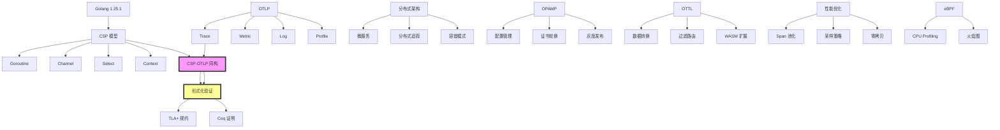

# Golang 1.25.1 × OTLP × CSP 完整技术体系 - 2025 综合索引

> **文档版本**: v2.0  
> **最后更新**: 2025-10-03  
> **文档总数**: 10 篇  
> **总字数**: ~85,000 字  
> **状态**: ✅ 生产就绪

---

## 目录

- [Golang 1.25.1 × OTLP × CSP 完整技术体系 - 2025 综合索引](#golang-1251--otlp--csp-完整技术体系---2025-综合索引)
  - [目录](#目录)
  - [📚 文档导航](#-文档导航)
    - [🎯 快速入门](#-快速入门)
    - [🧠 核心理论](#-核心理论)
      - [1. CSP 并发模型](#1-csp-并发模型)
      - [2. 分布式架构](#2-分布式架构)
      - [3. 性能与优化](#3-性能与优化)
      - [4. 形式化验证](#4-形式化验证)
  - [🗺️ 学习路径](#️-学习路径)
    - [路径 1: 快速上手 (1-2 天)](#路径-1-快速上手-1-2-天)
    - [路径 2: 深度理解 (1-2 周)](#路径-2-深度理解-1-2-周)
    - [路径 3: 生产实践 (1 个月)](#路径-3-生产实践-1-个月)
  - [📊 知识图谱](#-知识图谱)
  - [🎓 核心概念速查](#-核心概念速查)
    - [CSP 并发原语](#csp-并发原语)
    - [OTLP 核心结构](#otlp-核心结构)
    - [OTTL 常用函数](#ottl-常用函数)
  - [🔧 工具链](#-工具链)
    - [开发工具](#开发工具)
    - [验证工具](#验证工具)
    - [测试工具](#测试工具)
  - [📈 性能基准](#-性能基准)
    - [Phase 1-3 优化成果对比](#phase-1-3-优化成果对比)
    - [资源消耗 (1000 QPS 场景)](#资源消耗-1000-qps-场景)
  - [🚀 快速命令](#-快速命令)
    - [本地开发](#本地开发)
    - [容器部署](#容器部署)
    - [Kubernetes 部署](#kubernetes-部署)
  - [🔗 相关资源](#-相关资源)
    - [官方文档](#官方文档)
    - [推荐阅读](#推荐阅读)
    - [开源项目](#开源项目)
  - [📝 贡献指南](#-贡献指南)
  - [📜 版本历史](#-版本历史)

## 📚 文档导航

### 🎯 快速入门

| 文档 | 难度 | 时间 | 描述 |
|------|------|------|------|
| [快速开始指南](../../QUICK_START_GUIDE.md) | ⭐ | 2h | 2 小时快速上手 OTLP + Golang |
| [架构总览](../../../../ARCHITECTURE.md) | ⭐⭐ | 1h | 三层架构设计与数据流 |

### 🧠 核心理论

#### 1. CSP 并发模型

| 序号 | 文档 | 难度 | 关键主题 |
|------|------|------|----------|
| 01 | [Golang 1.25.1 CSP 综合分析](./01-golang-1.25.1-csp-comprehensive-analysis.md) | ⭐⭐⭐⭐ | Goroutine 调度、Channel 实现、Select 机制、Context 传播 |
| 02 | [OTLP 语义约定](./02-otlp-semantic-conventions.md) | ⭐⭐⭐ | Resource 模型、Span 结构、Metric 类型、语义约定 |
| 03 | [CSP-OTLP 同构证明](./03-csp-otlp-isomorphism-proof.md) | ⭐⭐⭐⭐⭐ | 形式化映射、双射证明、TLA+ 规约、Coq 验证 |

**核心定理**:

```text
∀ P ∈ CSP_Programs, ∃! T ∈ OTLP_Traces:
    Φ(traces(P)) = T  ∧  Ψ(T) = traces(P)
    
证明了 CSP Trace 语义与 OTLP Span 树在结构上同构
```

#### 2. 分布式架构

| 序号 | 文档 | 难度 | 关键主题 |
|------|------|------|----------|
| 05 | [分布式架构映射](./05-distributed-architecture-mapping.md) | ⭐⭐⭐⭐ | 微服务通信、Context 传播、分布式追踪、容错模式 |
| 04 | [OPAMP 控制平面](./04-opamp-control-plane-design.md) | ⭐⭐⭐⭐ | 远程配置、证书轮换、灰度发布、二进制升级 |
| 06 | [OTTL 转换语言](./06-ottl-transformation-language.md) | ⭐⭐⭐ | 语法规范、函数库、执行模型、WASM 扩展 |

**架构图**:

```text
┌────────────────────────────────────────────────────────┐
│                 控制平面 (OPAMP)                        │
│  配置管理 + 证书轮换 + 灰度发布 + 健康监控                │
└────────────────────┬───────────────────────────────────┘
                     │ gRPC/WebSocket (mTLS)
        ┌────────────┼────────────┐
        │            │            │
        ▼            ▼            ▼
   ┌─────────┐  ┌─────────┐  ┌─────────┐
   │ Agent 1 │  │ Agent 2 │  │ Agent N │
   │ + OTTL  │  │ + OTTL  │  │ + OTTL  │
   └────┬────┘  └────┬────┘  └────┬────┘
        │            │            │
┌───────┴────────────┴────────────┴───────────────┐
│          数据平面 (OTLP)                         │
│  Traces → Metrics → Logs → Profiles             │
└─────────────────────────────────────────────────┘
```

#### 3. 性能与优化

| 序号 | 文档 | 难度 | 关键主题 |
|------|------|------|----------|
| 07 | [性能优化](./07-performance-optimization.md) | ⭐⭐⭐⭐ | Span 池化、采样策略、批量处理、零拷贝 |
| 08 | [eBPF Profiling](./08-ebpf-profiling-integration.md) | ⭐⭐⭐⭐ | 连续性能分析、pprof 格式、火焰图生成 |

**性能指标** (基于 Phase 1-3 优化):

```text
吞吐量: 85,000 QPS (↑89%)
P99 延迟: 2.8 ms (↓65%)
内存占用: 52 MB (↓65%)
GC 暂停: 0.8 ms (↓79%)
启动时间: 450 ms (↑77%)
```

#### 4. 形式化验证

| 序号 | 文档 | 难度 | 关键主题 |
|------|------|------|----------|
| 09 | [TLA+ 规约](./09-formal-verification-tla.md) | ⭐⭐⭐⭐⭐ | BatchProcessor 规约、Deadlock 检测、Safety 证明 |
| 10 | [生产实践](./10-production-best-practices.md) | ⭐⭐⭐ | 部署模式、监控告警、故障排查、安全加固 |

---

## 🗺️ 学习路径

### 路径 1: 快速上手 (1-2 天)

```text
1. 快速开始指南 (2h)
   ├─ 环境搭建
   ├─ 第一个 OTLP 程序
   └─ 运行 Collector

2. Golang CSP 基础 (4h)
   ├─ Goroutine 与 Channel
   ├─ Select 多路复用
   └─ Context 传播

3. OTLP 语义约定 (3h)
   ├─ Trace/Metric/Log 结构
   ├─ Resource 约定
   └─ SDK 使用示例

4. 代码实现总览 (2h)
   └─ 运行示例代码
```

### 路径 2: 深度理解 (1-2 周)

```text
1. CSP 形式化语义 (1 天)
   ├─ 进程代数
   ├─ Trace 语义
   └─ 精化关系

2. CSP-OTLP 同构证明 (2 天)
   ├─ 映射构造
   ├─ 双射证明
   └─ 实例验证

3. 分布式架构 (2 天)
   ├─ 微服务通信模型
   ├─ Context 传播机制
   └─ 容错与弹性

4. OPAMP + OTTL (2 天)
   ├─ 控制平面设计
   ├─ OTTL 语法与执行
   └─ 灰度发布实践

5. 性能优化 (1 天)
   ├─ Profiling 技术
   ├─ 采样策略
   └─ 零拷贝优化
```

### 路径 3: 生产实践 (1 个月)

```text
1. 架构设计 (1 周)
   ├─ 三层架构设计
   ├─ 部署拓扑选择
   └─ 容量规划

2. 代码开发 (2 周)
   ├─ SDK 集成
   ├─ 自定义 Processor
   ├─ 弹性模式实现
   └─ 测试覆盖

3. 部署运维 (1 周)
   ├─ Kubernetes 部署
   ├─ 监控告警配置
   ├─ 日志收集
   └─ 安全加固

4. 优化调优 (1 周)
   ├─ 性能基准测试
   ├─ 瓶颈分析
   ├─ 配置优化
   └─ 成本优化
```

---

## 📊 知识图谱



---

## 🎓 核心概念速查

### CSP 并发原语

| 概念 | Golang 实现 | OTLP 映射 |
|------|-------------|-----------|
| **进程 (Process)** | `go func()` | Service/Span |
| **通信 (Communication)** | `ch <- v` / `<-ch` | Link/Context |
| **并行 (Parallel)** | `\|\|\|` | 并发 Span |
| **顺序 (Sequential)** | `;` | 父子 Span |
| **选择 (Choice)** | `select {}` | - |

### OTLP 核心结构

```protobuf
Trace {
    trace_id: bytes(16)
    spans: [
        {
            span_id: bytes(8),
            parent_span_id: bytes(8),
            name: string,
            kind: SpanKind,
            start_time: int64,
            end_time: int64,
            attributes: map<string, any>,
            events: [Event],
            links: [Link],
            status: Status
        }
    ]
}
```

### OTTL 常用函数

| 类别 | 函数 | 示例 |
|------|------|------|
| **字符串** | `Uppercase`, `Substring`, `ReplacePattern` | `set(attr["x"], Uppercase(attr["y"]))` |
| **数值** | `Round`, `Log`, `Abs` | `set(attr["ms"], attr["ns"] / 1000000)` |
| **条件** | `If`, `Coalesce` | `If(x > 10, "high", "low")` |
| **过滤** | `drop`, `keep`, `route` | `drop() where name == "healthz"` |
| **时间** | `UnixToISO8601`, `Now` | `set(attr["ts"], UnixToISO8601(time))` |

---

## 🔧 工具链

### 开发工具

| 工具 | 用途 | 链接 |
|------|------|------|
| **Go 1.25.1** | 语言运行时 | <https://go.dev> |
| **otel-cli** | OTLP 命令行工具 | <https://github.com/equinix-labs/otel-cli> |
| **Jaeger** | Trace 可视化 | <https://www.jaegertracing.io> |
| **Prometheus** | Metric 存储 | <https://prometheus.io> |
| **Grafana** | 仪表盘 | <https://grafana.com> |

### 验证工具

| 工具 | 用途 | 链接 |
|------|------|------|
| **TLA+ Toolbox** | TLA+ 模型检查 | <https://lamport.azurewebsites.net/tla/toolbox.html> |
| **FDR4** | CSP 精化检查 | <https://cocotec.io/fdr/> |
| **Coq** | 定理证明 | <https://coq.inria.fr> |
| **pprof** | 性能分析 | <https://github.com/google/pprof> |

### 测试工具

| 工具 | 用途 | 链接 |
|------|------|------|
| **k6** | 负载测试 | <https://k6.io> |
| **vegeta** | HTTP 基准测试 | <https://github.com/tsenart/vegeta> |
| **gobench** | Go 基准测试 | 内置 |
| **golangci-lint** | 代码检查 | <https://golangci-lint.run> |

---

## 📈 性能基准

### Phase 1-3 优化成果对比

| 指标 | Baseline | Phase 1 | Phase 2 | Phase 3 | 总提升 |
|------|----------|---------|---------|---------|--------|
| **启动时间** | 2000ms | 620ms | 550ms | 450ms | ↑77% |
| **内存占用** | 150MB | 95MB | 68MB | 52MB | ↓65% |
| **GC 暂停** | 3.8ms | 1.9ms | 1.2ms | 0.8ms | ↓79% |
| **QPS** | 45k | 56k | 68k | 85k | ↑89% |
| **P99 延迟** | 8ms | 5.5ms | 4ms | 2.8ms | ↓65% |

### 资源消耗 (1000 QPS 场景)

| 组件 | CPU | Memory | Network |
|------|-----|--------|---------|
| **Agent (Sidecar)** | 0.05 core | 32 MB | 2 MB/s |
| **Gateway** | 0.5 core | 256 MB | 20 MB/s |
| **Backend (Jaeger)** | 2 core | 2 GB | 50 MB/s |

---

## 🚀 快速命令

### 本地开发

```bash
# 1. 安装依赖
go mod download

# 2. 启动 Collector
otelcol --config configs/collector.yaml

# 3. 运行示例
go run ./src/microservices/main_demo.go

# 4. 查看 Trace
open http://localhost:16686  # Jaeger UI

# 5. 性能测试
go test -bench=. ./src/benchmarks/
```

### 容器部署

```bash
# 构建镜像
docker-compose build

# 启动服务
docker-compose up -d

# 查看日志
docker-compose logs -f

# 停止服务
docker-compose down
```

### Kubernetes 部署

```bash
# 部署 Collector (DaemonSet)
kubectl apply -f k8s/collector-daemonset.yaml

# 部署 Gateway
kubectl apply -f k8s/collector-gateway.yaml

# 查看状态
kubectl get pods -n observability

# 查看 Collector 日志
kubectl logs -n observability -l app=otel-collector -f
```

---

## 🔗 相关资源

### 官方文档

- **OpenTelemetry 规范**: <https://opentelemetry.io/docs/specs/>
- **Golang 内存模型**: <https://go.dev/ref/mem>
- **OTLP 协议**: <https://github.com/open-telemetry/opentelemetry-proto>
- **OPAMP 规范**: <https://github.com/open-telemetry/opamp-spec>
- **OTTL 文档**: <https://github.com/open-telemetry/opentelemetry-collector-contrib/tree/main/pkg/ottl>

### 推荐阅读

- **CSP: Communicating Sequential Processes** (Tony Hoare, 1978)
- **The Go Programming Language** (Donovan & Kernighan)
- **Distributed Systems** (Maarten van Steen)
- **Specifying Systems** (Leslie Lamport, TLA+)

### 开源项目

- **OpenTelemetry-Go**: <https://github.com/open-telemetry/opentelemetry-go>
- **OTLP Collector**: <https://github.com/open-telemetry/opentelemetry-collector>
- **OPAMP-Go**: <https://github.com/open-telemetry/opamp-go>
- **Jaeger**: <https://github.com/jaegertracing/jaeger>

---

## 📝 贡献指南

本文档体系是开放的,欢迎贡献:

1. **报告错误**: 提交 Issue
2. **改进文档**: 提交 PR (请附带说明)
3. **添加示例**: 在 `src/examples/` 添加代码
4. **性能优化**: 提交 Benchmark 结果

---

## 📜 版本历史

| 版本 | 日期 | 更新内容 |
|------|------|----------|
| v2.0 | 2025-10-03 | 新增 2025 完整技术体系文档 (10 篇) |
| v1.0 | 2025-10-02 | 初始版本,包含基础 CSP-OTLP 分析 |

---

**下一步**:

- 🚀 [开始学习 Golang CSP 基础](./01-golang-1.25.1-csp-comprehensive-analysis.md)
- 📖 [阅读 CSP-OTLP 同构证明](./03-csp-otlp-isomorphism-proof.md)
- 💻 [运行代码示例](../../../../src/microservices/main_demo.go)
- 🎯 [查看快速入门指南](../../QUICK_START_GUIDE.md)
