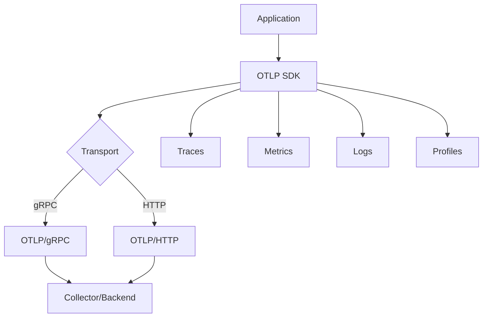

# OTLP 协议规范

> **文档版本**: v1.0  
> **最后更新**: 2025-10-04  
> **OTLP 版本**: v1.3.0  
> **关联文档**: [14-OTLP 语义约定 2025](./14-otlp-semantic-conventions-2025.md)

---

## 目录

- [OTLP 协议规范](#otlp-协议规范)
  - [目录](#目录)
  - [1. 概述](#1-概述)
    - [1.1 OTLP 简介](#11-otlp-简介)
    - [1.2 设计目标](#12-设计目标)
    - [1.3 协议特性](#13-协议特性)
  - [2. 协议架构](#2-协议架构)
    - [2.1 整体架构](#21-整体架构)
    - [2.2 传输层](#22-传输层)
    - [2.3 编码格式](#23-编码格式)
  - [3. 数据模型](#3-数据模型)
    - [3.1 四支柱模型](#31-四支柱模型)
    - [3.2 Resource 模型](#32-resource-模型)
    - [3.3 InstrumentationScope 模型](#33-instrumentationscope-模型)
  - [4. Traces 规范](#4-traces-规范)
    - [4.1 Span 数据结构](#41-span-数据结构)
    - [4.2 SpanKind 语义](#42-spankind-语义)
    - [4.3 Span Links](#43-span-links)
    - [4.4 Span Events](#44-span-events)
    - [4.5 Status 模型](#45-status-模型)
  - [5. Metrics 规范](#5-metrics-规范)
    - [5.1 Metric 数据结构](#51-metric-数据结构)
    - [5.2 指标类型](#52-指标类型)
    - [5.3 Exemplars](#53-exemplars)
    - [5.4 聚合语义](#54-聚合语义)
  - [6. Logs 规范](#6-logs-规范)
    - [6.1 LogRecord 数据结构](#61-logrecord-数据结构)
    - [6.2 严重性级别](#62-严重性级别)
    - [6.3 Body 格式](#63-body-格式)
  - [7. Profiles 规范](#7-profiles-规范)
    - [7.1 Profile 数据结构](#71-profile-数据结构)
    - [7.2 pprof 格式](#72-pprof-格式)
    - [7.3 采样策略](#73-采样策略)
  - [8. 传输协议](#8-传输协议)
    - [8.1 gRPC 传输](#81-grpc-传输)
    - [8.2 HTTP 传输](#82-http-传输)
    - [8.3 压缩与编码](#83-压缩与编码)
  - [9. Context 传播](#9-context-传播)
    - [9.1 W3C Trace Context](#91-w3c-trace-context)
    - [9.2 W3C Baggage](#92-w3c-baggage)
    - [9.3 跨服务传播](#93-跨服务传播)
  - [10. 错误处理](#10-错误处理)
    - [10.1 错误码](#101-错误码)
    - [10.2 重试策略](#102-重试策略)
    - [10.3 降级机制](#103-降级机制)
  - [11. 性能优化](#11-性能优化)
    - [11.1 批量处理](#111-批量处理)
    - [11.2 压缩策略](#112-压缩策略)
    - [11.3 连接复用](#113-连接复用)
  - [12. 安全性](#12-安全性)
    - [12.1 认证](#121-认证)
    - [12.2 加密](#122-加密)
    - [12.3 授权](#123-授权)
  - [13. 参考文献](#13-参考文献)

---

## 1. 概述

### 1.1 OTLP 简介

**OpenTelemetry Protocol (OTLP)** 是 OpenTelemetry 项目定义的标准遥测数据传输协议，用于在应用程序、库、SDK 和后端系统之间传输可观测性数据。

**核心特性**:

- 统一的数据格式
- 多种传输方式（gRPC、HTTP）
- 支持四种信号类型（Traces、Metrics、Logs、Profiles）
- 高效的二进制编码（Protocol Buffers）
- 跨语言、跨平台支持

### 1.2 设计目标

1. **统一性**: 提供统一的数据模型和传输协议
2. **高效性**: 优化网络传输和数据编码
3. **可扩展性**: 支持未来的信号类型和功能扩展
4. **互操作性**: 确保不同实现之间的兼容性
5. **向后兼容**: 保持协议版本的向后兼容性

### 1.3 协议特性

| 特性 | 说明 |
|-----|------|
| **传输层** | gRPC (HTTP/2) 和 HTTP/1.1 |
| **编码格式** | Protocol Buffers (二进制) 和 JSON |
| **压缩** | gzip、zstd |
| **认证** | Bearer Token、mTLS、API Key |
| **重试** | 指数退避 |
| **批量处理** | 支持批量发送 |

---

## 2. 协议架构

### 2.1 整体架构



### 2.2 传输层

**gRPC 传输**:

- 基于 HTTP/2
- 双向流支持
- 自动重连
- 负载均衡

**HTTP 传输**:

- 基于 HTTP/1.1 或 HTTP/2
- RESTful 风格
- 更广泛的兼容性
- 易于调试

### 2.3 编码格式

**Protocol Buffers**:

```protobuf
message ExportTraceServiceRequest {
  repeated ResourceSpans resource_spans = 1;
}

message ResourceSpans {
  opentelemetry.proto.resource.v1.Resource resource = 1;
  repeated ScopeSpans scope_spans = 2;
  string schema_url = 3;
}
```

**JSON** (HTTP 传输):

```json
{
  "resourceSpans": [{
    "resource": {
      "attributes": [
        {"key": "service.name", "value": {"stringValue": "my-service"}}
      ]
    },
    "scopeSpans": [...]
  }]
}
```

---

## 3. 数据模型

### 3.1 四支柱模型

```text
OTLP 数据模型
├── Traces (分布式追踪)
│   ├── Span
│   ├── SpanKind
│   ├── SpanLinks
│   └── SpanEvents
│
├── Metrics (指标监控)
│   ├── Counter
│   ├── UpDownCounter
│   ├── Gauge
│   ├── Histogram
│   └── ExponentialHistogram
│
├── Logs (日志记录)
│   ├── LogRecord
│   ├── SeverityNumber
│   └── Body
│
└── Profiles (性能剖析)
    ├── Profile
    ├── Sample
    └── Location
```

### 3.2 Resource 模型

**Resource** 表示产生遥测数据的实体（如服务、主机、容器）。

```protobuf
message Resource {
  repeated opentelemetry.proto.common.v1.KeyValue attributes = 1;
  uint32 dropped_attributes_count = 2;
}
```

**标准属性**:

```go
resource.NewWithAttributes(
    semconv.SchemaURL,
    semconv.ServiceName("my-service"),
    semconv.ServiceVersion("1.0.0"),
    semconv.ServiceInstanceID("instance-123"),
    semconv.DeploymentEnvironment("production"),
)
```

### 3.3 InstrumentationScope 模型

**InstrumentationScope** 表示生成遥测数据的库或模块。

```protobuf
message InstrumentationScope {
  string name = 1;
  string version = 2;
  repeated opentelemetry.proto.common.v1.KeyValue attributes = 3;
  uint32 dropped_attributes_count = 4;
}
```

---

## 4. Traces 规范

### 4.1 Span 数据结构

```protobuf
message Span {
  bytes trace_id = 1;                    // 16 字节
  bytes span_id = 2;                     // 8 字节
  string trace_state = 3;                // W3C TraceState
  bytes parent_span_id = 4;              // 8 字节
  string name = 5;                       // Span 名称
  SpanKind kind = 6;                     // Span 类型
  fixed64 start_time_unix_nano = 7;     // 开始时间
  fixed64 end_time_unix_nano = 8;       // 结束时间
  repeated KeyValue attributes = 9;      // 属性
  uint32 dropped_attributes_count = 10;
  repeated Event events = 11;            // 事件
  uint32 dropped_events_count = 12;
  repeated Link links = 13;              // 链接
  uint32 dropped_links_count = 14;
  Status status = 15;                    // 状态
}
```

**Golang 示例**:

```go
ctx, span := tracer.Start(ctx, "operation-name",
    trace.WithSpanKind(trace.SpanKindServer),
    trace.WithAttributes(
        attribute.String("http.method", "GET"),
        attribute.String("http.url", "/api/users"),
    ),
)
defer span.End()
```

### 4.2 SpanKind 语义

| SpanKind | 说明 | 使用场景 |
|----------|------|---------|
| `INTERNAL` | 内部操作 | 函数调用、内部逻辑 |
| `SERVER` | 服务端处理 | HTTP 服务器、gRPC 服务器 |
| `CLIENT` | 客户端请求 | HTTP 客户端、数据库客户端 |
| `PRODUCER` | 消息生产者 | 消息队列生产者 |
| `CONSUMER` | 消息消费者 | 消息队列消费者 |

### 4.3 Span Links

**Span Links** 用于关联不同 Trace 中的 Span。

```protobuf
message Link {
  bytes trace_id = 1;
  bytes span_id = 2;
  string trace_state = 3;
  repeated KeyValue attributes = 4;
  uint32 dropped_attributes_count = 5;
}
```

**使用场景**:

- 批处理作业关联多个请求
- 异步处理关联原始请求
- 扇出/扇入模式

### 4.4 Span Events

**Span Events** 记录 Span 生命周期中的事件。

```protobuf
message Event {
  fixed64 time_unix_nano = 1;
  string name = 2;
  repeated KeyValue attributes = 3;
  uint32 dropped_attributes_count = 4;
}
```

**Golang 示例**:

```go
span.AddEvent("cache-miss",
    trace.WithAttributes(
        attribute.String("cache.key", "user:123"),
    ),
)
```

### 4.5 Status 模型

```protobuf
message Status {
  string message = 2;
  StatusCode code = 3;
}

enum StatusCode {
  STATUS_CODE_UNSET = 0;
  STATUS_CODE_OK = 1;
  STATUS_CODE_ERROR = 2;
}
```

---

## 5. Metrics 规范

### 5.1 Metric 数据结构

```protobuf
message Metric {
  string name = 1;
  string description = 2;
  string unit = 3;
  oneof data {
    Gauge gauge = 5;
    Sum sum = 7;
    Histogram histogram = 9;
    ExponentialHistogram exponential_histogram = 10;
    Summary summary = 11;
  }
}
```

### 5.2 指标类型

**Counter (Sum with is_monotonic=true)**:

```go
counter, _ := meter.Int64Counter(
    "requests.count",
    metric.WithDescription("Total number of requests"),
)
counter.Add(ctx, 1, metric.WithAttributes(
    attribute.String("http.method", "GET"),
))
```

**UpDownCounter (Sum with is_monotonic=false)**:

```go
upDownCounter, _ := meter.Int64UpDownCounter(
    "active.connections",
    metric.WithDescription("Number of active connections"),
)
upDownCounter.Add(ctx, 1)  // 连接建立
upDownCounter.Add(ctx, -1) // 连接关闭
```

**Gauge**:

```go
gauge, _ := meter.Float64ObservableGauge(
    "cpu.usage",
    metric.WithDescription("CPU usage percentage"),
)
```

**Histogram**:

```go
histogram, _ := meter.Float64Histogram(
    "request.duration",
    metric.WithDescription("Request duration in milliseconds"),
    metric.WithUnit("ms"),
)
histogram.Record(ctx, 123.45)
```

**ExponentialHistogram**:

- 更高效的存储
- 自动调整桶边界
- 适合大范围数据

### 5.3 Exemplars

**Exemplars** 将指标与追踪关联。

```protobuf
message Exemplar {
  repeated KeyValue filtered_attributes = 7;
  fixed64 time_unix_nano = 2;
  oneof value {
    double as_double = 3;
    sfixed64 as_int = 6;
  }
  bytes span_id = 4;
  bytes trace_id = 5;
}
```

### 5.4 聚合语义

| 聚合类型 | 说明 | 适用指标 |
|---------|------|---------|
| **Delta** | 增量值 | Counter |
| **Cumulative** | 累积值 | Counter, Histogram |
| **Gauge** | 瞬时值 | Gauge |

---

## 6. Logs 规范

### 6.1 LogRecord 数据结构

```protobuf
message LogRecord {
  fixed64 time_unix_nano = 1;
  fixed64 observed_time_unix_nano = 11;
  SeverityNumber severity_number = 2;
  string severity_text = 3;
  opentelemetry.proto.common.v1.AnyValue body = 5;
  repeated opentelemetry.proto.common.v1.KeyValue attributes = 6;
  uint32 dropped_attributes_count = 7;
  uint32 flags = 8;
  bytes trace_id = 9;
  bytes span_id = 10;
}
```

### 6.2 严重性级别

| SeverityNumber | SeverityText | 说明 |
|---------------|--------------|------|
| 1-4 | TRACE | 详细调试信息 |
| 5-8 | DEBUG | 调试信息 |
| 9-12 | INFO | 一般信息 |
| 13-16 | WARN | 警告信息 |
| 17-20 | ERROR | 错误信息 |
| 21-24 | FATAL | 致命错误 |

### 6.3 Body 格式

```go
logger.LogAttrs(ctx, slog.LevelInfo, "User logged in",
    slog.String("user.id", "123"),
    slog.String("user.name", "Alice"),
)
```

---

## 7. Profiles 规范

### 7.1 Profile 数据结构

```protobuf
message Profile {
  repeated Sample sample = 1;
  repeated Location location = 2;
  repeated Function function = 3;
  repeated ValueType sample_type = 4;
  int64 time_nanos = 5;
  int64 duration_nanos = 6;
  ValueType period_type = 7;
  int64 period = 8;
}
```

### 7.2 pprof 格式

OTLP Profiles 使用 pprof 格式，与 Golang 原生 pprof 兼容。

**采集示例**:

```go
import _ "net/http/pprof"

http.ListenAndServe(":6060", nil)
```

### 7.3 采样策略

- **CPU Profiling**: 100Hz 采样率
- **Memory Profiling**: 每 512KB 分配采样一次
- **Goroutine Profiling**: 全量采集

---

## 8. 传输协议

### 8.1 gRPC 传输

**端点**:

```text
Traces:  /opentelemetry.proto.collector.trace.v1.TraceService/Export
Metrics: /opentelemetry.proto.collector.metrics.v1.MetricsService/Export
Logs:    /opentelemetry.proto.collector.logs.v1.LogsService/Export
```

**Golang 客户端**:

```go
exporter, err := otlptracegrpc.New(ctx,
    otlptracegrpc.WithEndpoint("localhost:4317"),
    otlptracegrpc.WithInsecure(),
)
```

### 8.2 HTTP 传输

**端点**:

```text
Traces:  POST /v1/traces
Metrics: POST /v1/metrics
Logs:    POST /v1/logs
```

**Golang 客户端**:

```go
exporter, err := otlptracehttp.New(ctx,
    otlptracehttp.WithEndpoint("localhost:4318"),
    otlptracehttp.WithInsecure(),
)
```

### 8.3 压缩与编码

**支持的压缩算法**:

- gzip (默认)
- zstd (更高压缩率)

**Golang 示例**:

```go
exporter, err := otlptracegrpc.New(ctx,
    otlptracegrpc.WithCompressor("gzip"),
)
```

---

## 9. Context 传播

### 9.1 W3C Trace Context

**HTTP Headers**:

```text
traceparent: 00-{trace-id}-{span-id}-{flags}
tracestate: vendor1=value1,vendor2=value2
```

**Golang 示例**:

```go
import "go.opentelemetry.io/contrib/propagators/w3c"

propagator := propagation.NewCompositeTextMapPropagator(
    propagation.TraceContext{},
    propagation.Baggage{},
)
otel.SetTextMapPropagator(propagator)
```

### 9.2 W3C Baggage

**HTTP Header**:

```text
baggage: key1=value1,key2=value2
```

**Golang 示例**:

```go
bag, _ := baggage.Parse("user.id=123,session.id=abc")
ctx = baggage.ContextWithBaggage(ctx, bag)
```

### 9.3 跨服务传播

```go
// 客户端
client := http.Client{
    Transport: otelhttp.NewTransport(http.DefaultTransport),
}

// 服务端
handler := otelhttp.NewHandler(http.HandlerFunc(myHandler), "my-service")
```

---

## 10. 错误处理

### 10.1 错误码

| 错误码 | 说明 | 处理方式 |
|-------|------|---------|
| `OK` | 成功 | 无需处理 |
| `CANCELLED` | 取消 | 停止重试 |
| `INVALID_ARGUMENT` | 无效参数 | 修复数据 |
| `DEADLINE_EXCEEDED` | 超时 | 重试 |
| `UNAVAILABLE` | 服务不可用 | 重试 |
| `RESOURCE_EXHAUSTED` | 资源耗尽 | 降级 |

### 10.2 重试策略

**指数退避**:

```go
retryConfig := configretry.NewDefaultBackOffConfig()
retryConfig.InitialInterval = 1 * time.Second
retryConfig.MaxInterval = 30 * time.Second
retryConfig.MaxElapsedTime = 5 * time.Minute
```

### 10.3 降级机制

1. **采样率降级**: 降低采样率减少数据量
2. **批量大小调整**: 增大批量减少请求次数
3. **本地缓存**: 临时存储数据
4. **丢弃策略**: 丢弃低优先级数据

---

## 11. 性能优化

### 11.1 批量处理

```go
tp := trace.NewTracerProvider(
    trace.WithBatcher(exporter,
        trace.WithMaxExportBatchSize(512),
        trace.WithBatchTimeout(5 * time.Second),
    ),
)
```

### 11.2 压缩策略

**压缩效果对比**:

```text
原始数据: 1MB
gzip:     200KB (压缩率 80%)
zstd:     150KB (压缩率 85%)
```

### 11.3 连接复用

- 使用 HTTP/2 多路复用
- 保持长连接
- 连接池管理

---

## 12. 安全性

### 12.1 认证

**Bearer Token**:

```go
exporter, err := otlptracegrpc.New(ctx,
    otlptracegrpc.WithHeaders(map[string]string{
        "Authorization": "Bearer " + token,
    }),
)
```

**API Key**:

```go
exporter, err := otlptracehttp.New(ctx,
    otlptracehttp.WithHeaders(map[string]string{
        "X-API-Key": apiKey,
    }),
)
```

### 12.2 加密

**TLS/mTLS**:

```go
creds, err := credentials.NewClientTLSFromFile("cert.pem", "")
exporter, err := otlptracegrpc.New(ctx,
    otlptracegrpc.WithTLSCredentials(creds),
)
```

### 12.3 授权

- RBAC (Role-Based Access Control)
- 租户隔离
- 数据脱敏

---

## 13. 参考文献

- [OTLP Specification](https://github.com/open-telemetry/opentelemetry-proto)
- [OpenTelemetry Go SDK](https://github.com/open-telemetry/opentelemetry-go)
- [W3C Trace Context](https://www.w3.org/TR/trace-context/)
- [Protocol Buffers](https://developers.google.com/protocol-buffers)

---

**文档状态**: ✅ 完整版本  
**最后更新**: 2025-10-04  
**维护者**: OTLP_go Team
