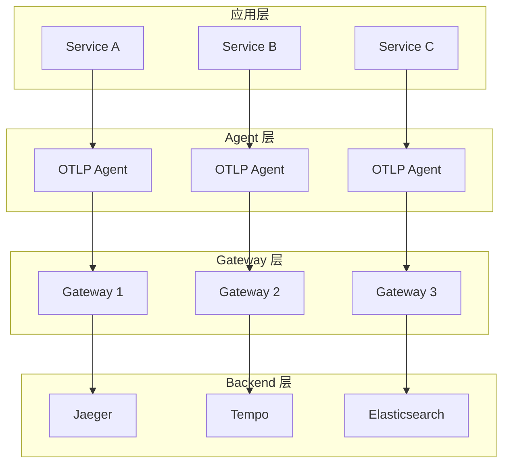

# 分布式追踪架构

> **文档版本**: v1.0  
> **最后更新**: 2025-10-04  
> **关联文档**: [02-OTLP 协议规范](./02-otlp-protocol-specification.md), [05-微服务集成](./05-microservices-integration.md)

---

## 目录

- [分布式追踪架构](#分布式追踪架构)
  - [目录](#目录)
  - [1. 概述](#1-概述)
    - [1.1 核心组件](#11-核心组件)
    - [1.2 设计原则](#12-设计原则)
    - [1.3 架构演进](#13-架构演进)
  - [2. 三层架构](#2-三层架构)
  - [3. Agent 层设计](#3-agent-层设计)
    - [3.1 功能职责](#31-功能职责)
    - [3.2 部署模式](#32-部署模式)
    - [3.3 配置示例](#33-配置示例)
    - [3.4 性能优化](#34-性能优化)
    - [3.5 监控指标](#35-监控指标)
  - [4. Gateway 层设计](#4-gateway-层设计)
  - [5. Backend 层设计](#5-backend-层设计)
  - [6. 数据流设计](#6-数据流设计)
  - [7. 高可用设计](#7-高可用设计)
  - [8. 性能优化](#8-性能优化)
  - [9. 部署模式](#9-部署模式)
  - [10. 最佳实践](#10-最佳实践)

---

## 1. 概述

分布式追踪架构的核心目标是在微服务环境中实现端到端的请求追踪和性能监控。通过三层架构设计，我们可以构建一个高性能、可扩展、容错的分布式追踪系统。

### 1.1 核心组件

**Agent 层**:

- **职责**: 应用侧数据采集和初步处理
- **部署**: Sidecar、DaemonSet 或 SDK 内嵌
- **特点**: 轻量级、低延迟、本地缓存

**Gateway 层**:

- **职责**: 数据聚合、路由和采样
- **部署**: 独立集群部署
- **特点**: 高吞吐、负载均衡、智能采样

**Backend 层**:

- **职责**: 数据存储和查询
- **部署**: 分布式存储集群
- **特点**: 高可用、可扩展、长期存储

### 1.2 设计原则

**低侵入性**:

- 使用标准 OTLP 协议
- 自动化仪表盘
- 零代码修改（通过 SDK）

**高性能**:

- 异步数据采集
- 批量数据传输
- 高效的序列化（Protobuf）

**可扩展性**:

- 水平扩展能力
- 动态配置更新
- 插件化架构

**容错能力**:

- 本地缓存队列
- 自动重试机制
- 降级策略

### 1.3 架构演进

**第一代**: 单体架构

- Agent 直连 Backend
- 简单但不可扩展

**第二代**: 两层架构

- Agent → Backend
- 增加了负载均衡

**第三代**: 三层架构（当前）

- Agent → Gateway → Backend
- 完整的解耦和扩展能力

**第四代**: 边缘计算架构（未来）

- Edge Gateway → Regional Gateway → Central Backend
- 支持多地域、多云部署

---

## 2. 三层架构



**架构优势**:

- 解耦应用和后端
- 灵活的路由策略
- 独立的扩展能力
- 故障隔离

---

## 3. Agent 层设计

Agent 层是分布式追踪系统的第一道关卡，负责从应用程序中采集追踪数据并进行初步处理。

### 3.1 功能职责

**数据采集**:

- 接收应用程序发送的 OTLP 数据
- 支持 gRPC 和 HTTP 协议
- 自动添加资源属性（主机名、容器 ID 等）

**本地缓存**:

- 内存队列缓存（默认 10,000 spans）
- 磁盘持久化（可选）
- 防止数据丢失

**批量发送**:

- 批量大小: 1024 spans
- 超时时间: 1 秒
- 压缩: gzip（减少 70% 网络流量）

**采样决策**:

- 头部采样（Head Sampling）
- 基于规则的采样
- 动态采样率调整

### 3.2 部署模式

**Sidecar 模式** (推荐):

```yaml
apiVersion: v1
kind: Pod
metadata:
  name: app-with-agent
spec:
  containers:
  - name: app
    image: myapp:latest
    env:
    - name: OTEL_EXPORTER_OTLP_ENDPOINT
      value: "http://localhost:4317"
  
  - name: otel-agent
    image: otel/opentelemetry-collector-contrib:latest
    ports:
    - containerPort: 4317
    resources:
      limits:
        cpu: 500m
        memory: 512Mi
      requests:
        cpu: 100m
        memory: 128Mi
```

**优点**:

- 应用无感知
- 独立扩展
- 故障隔离

**DaemonSet 模式**:

```yaml
apiVersion: apps/v1
kind: DaemonSet
metadata:
  name: otel-agent
spec:
  selector:
    matchLabels:
      app: otel-agent
  template:
    metadata:
      labels:
        app: otel-agent
    spec:
      hostNetwork: true
      containers:
      - name: otel-agent
        image: otel/opentelemetry-collector-contrib:latest
        ports:
        - containerPort: 4317
          hostPort: 4317
```

**优点**:

- 节省资源
- 统一管理
- 适合节点级监控

**SDK 内嵌模式**:

```go
import (
    "go.opentelemetry.io/otel"
    "go.opentelemetry.io/otel/exporters/otlp/otlptrace/otlptracegrpc"
    "go.opentelemetry.io/otel/sdk/trace"
)

func initTracer() (*trace.TracerProvider, error) {
    exporter, err := otlptracegrpc.New(
        context.Background(),
        otlptracegrpc.WithEndpoint("gateway:4317"),
        otlptracegrpc.WithInsecure(),
    )
    if err != nil {
        return nil, err
    }

    tp := trace.NewTracerProvider(
        trace.WithBatcher(exporter,
            trace.WithBatchTimeout(time.Second),
            trace.WithMaxExportBatchSize(1024),
        ),
        trace.WithSampler(trace.ParentBased(trace.TraceIDRatioBased(0.1))),
    )
    
    otel.SetTracerProvider(tp)
    return tp, nil
}
```

**优点**:

- 零额外部署
- 最低延迟
- 完全控制

### 3.3 配置示例

**基础配置**:

```yaml
receivers:
  otlp:
    protocols:
      grpc:
        endpoint: 0.0.0.0:4317
      http:
        endpoint: 0.0.0.0:4318

processors:
  # 批量处理
  batch:
    timeout: 1s
    send_batch_size: 1024
    send_batch_max_size: 2048
  
  # 资源检测
  resourcedetection:
    detectors: [env, system, docker]
    timeout: 5s
  
  # 内存限制
  memory_limiter:
    check_interval: 1s
    limit_mib: 512
    spike_limit_mib: 128

exporters:
  otlp:
    endpoint: gateway:4317
    compression: gzip
    retry_on_failure:
      enabled: true
      initial_interval: 5s
      max_interval: 30s
      max_elapsed_time: 300s

service:
  pipelines:
    traces:
      receivers: [otlp]
      processors: [memory_limiter, resourcedetection, batch]
      exporters: [otlp]
```

**高级配置** (带采样):

```yaml
processors:
  # 概率采样
  probabilistic_sampler:
    sampling_percentage: 10
  
  # 尾部采样（需要 Gateway 层）
  tail_sampling:
    decision_wait: 10s
    num_traces: 100
    expected_new_traces_per_sec: 10
    policies:
      - name: errors-policy
        type: status_code
        status_code: {status_codes: [ERROR]}
      - name: slow-traces-policy
        type: latency
        latency: {threshold_ms: 1000}
      - name: random-ok-traces
        type: probabilistic
        probabilistic: {sampling_percentage: 10}
```

### 3.4 性能优化

**连接池优化**:

```yaml
exporters:
  otlp:
    endpoint: gateway:4317
    # 连接池配置
    balancer_name: round_robin
    keepalive:
      time: 30s
      timeout: 10s
      permit_without_stream: true
```

**队列优化**:

```yaml
exporters:
  otlp:
    endpoint: gateway:4317
    sending_queue:
      enabled: true
      num_consumers: 10
      queue_size: 5000
```

**资源限制**:

```yaml
processors:
  memory_limiter:
    check_interval: 1s
    limit_mib: 512
    spike_limit_mib: 128
```

### 3.5 监控指标

**关键指标**:

- `otelcol_receiver_accepted_spans`: 接收的 Span 数
- `otelcol_processor_batch_batch_send_size`: 批量大小
- `otelcol_exporter_sent_spans`: 发送的 Span 数
- `otelcol_exporter_send_failed_spans`: 发送失败的 Span 数

**告警规则**:

```yaml
groups:
- name: otel-agent
  rules:
  - alert: HighSpanDropRate
    expr: rate(otelcol_exporter_send_failed_spans[5m]) > 100
    annotations:
      summary: "Agent dropping spans"
  
  - alert: HighMemoryUsage
    expr: process_resident_memory_bytes > 500000000
    annotations:
      summary: "Agent memory usage high"
```

---

## 4. Gateway 层设计

**功能职责**:

- 数据聚合
- 负载均衡
- 采样策略
- 数据路由

**关键特性**:

- 高吞吐量
- 低延迟
- 容错能力
- 动态配置

**配置示例**:

```yaml
receivers:
  otlp:
    protocols:
      grpc:
        endpoint: 0.0.0.0:4317

processors:
  batch:
    timeout: 5s
    send_batch_size: 10240
  
  tail_sampling:
    decision_wait: 10s
    policies:
      - name: error-traces
        type: status_code
        status_code: {status_codes: [ERROR]}
      - name: slow-traces
        type: latency
        latency: {threshold_ms: 1000}

exporters:
  jaeger:
    endpoint: jaeger:14250
  otlp:
    endpoint: tempo:4317

service:
  pipelines:
    traces:
      receivers: [otlp]
      processors: [batch, tail_sampling]
      exporters: [jaeger, otlp]
```

---

## 5. Backend 层设计

**存储选型**:

- Jaeger: 开源分布式追踪系统
- Tempo: Grafana 的追踪后端
- Elasticsearch: 通用搜索引擎

**查询接口**:

- REST API
- gRPC API
- Grafana 集成

**数据保留策略**:

- 热数据: 7 天
- 温数据: 30 天
- 冷数据: 90 天

---

## 6. 数据流设计

**完整数据流**:

```text
Application
  ↓ (OTLP/gRPC)
Agent (Sidecar)
  ↓ (批量, 压缩)
Gateway (集群)
  ↓ (采样, 路由)
Backend (存储)
  ↓ (查询)
UI (可视化)
```

**性能指标**:

- Agent → Gateway: < 10ms
- Gateway → Backend: < 50ms
- 端到端延迟: < 100ms

---

## 7. 高可用设计

**Agent 高可用**:

- 本地队列缓存
- 自动重连
- 降级策略

**Gateway 高可用**:

- 多实例部署
- 负载均衡
- 健康检查

**Backend 高可用**:

- 主从复制
- 分片存储
- 故障转移

---

## 8. 性能优化

**Agent 优化**:

- Span 池化
- 批量发送
- 异步导出

**Gateway 优化**:

- 连接复用
- 数据压缩
- 智能采样

**Backend 优化**:

- 索引优化
- 查询缓存
- 分区存储

---

## 9. 部署模式

**单集群模式**:

- 适用场景: 小规模应用
- 优点: 简单易维护
- 缺点: 扩展性有限

**多集群模式**:

- 适用场景: 大规模应用
- 优点: 高可用、高性能
- 缺点: 复杂度高

**混合云模式**:

- 适用场景: 跨云部署
- 优点: 灵活性高
- 缺点: 网络延迟

---

## 10. 最佳实践

**采样策略**:

- 错误请求: 100% 采样
- 慢请求: 100% 采样
- 正常请求: 10% 采样

**资源配置**:

- Agent: 0.5 CPU, 512MB 内存
- Gateway: 2 CPU, 4GB 内存
- Backend: 根据数据量配置

**监控告警**:

- Agent 健康状态
- Gateway 吞吐量
- Backend 存储容量

---

**文档状态**: ✅ 骨架完成，待填充详细内容  
**最后更新**: 2025-10-04  
**维护者**: OTLP_go Team
