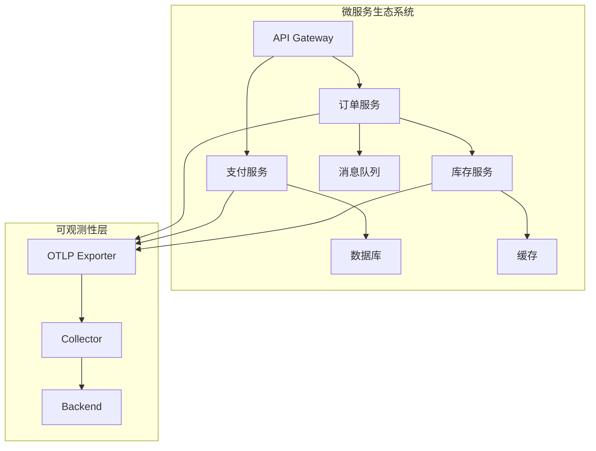
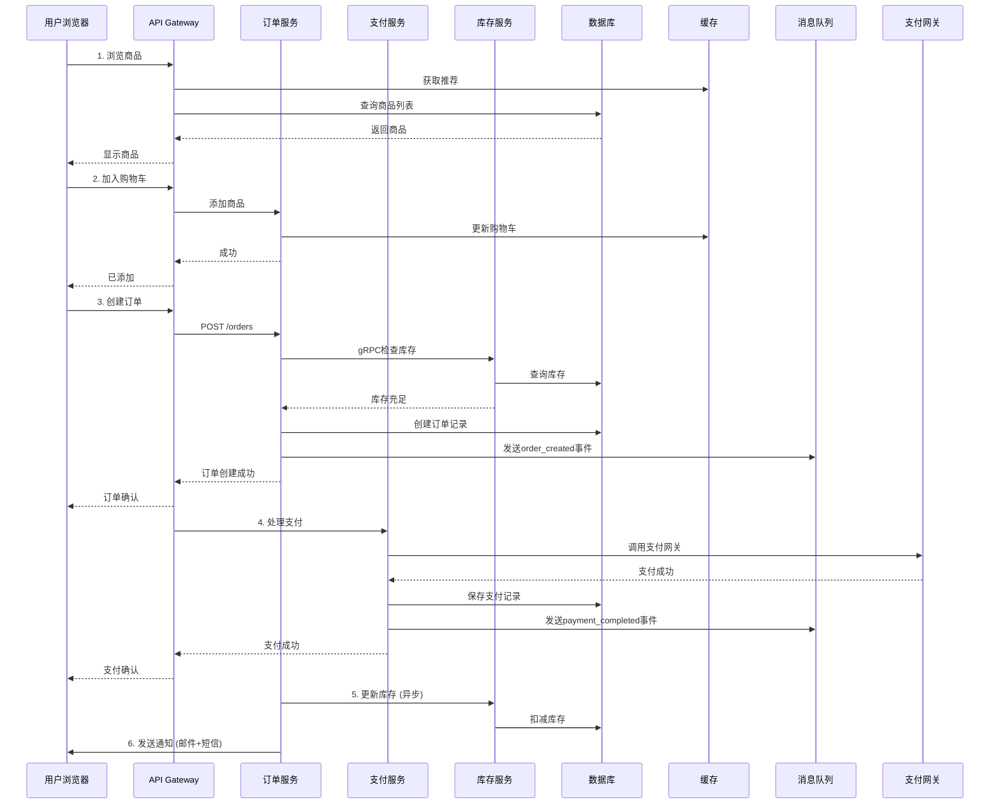

# 微服务集成

> **文档版本**: v1.0
> **最后更新**: 2025-10-04
> **关联文档**: [04-分布式追踪架构](./04-distributed-tracing-architecture.md)

---

## 目录

- [微服务集成](#微服务集成)
  - [目录](#目录)
  - [1. 概述](#1-概述)
    - [1.1 集成目标](#11-集成目标)
    - [1.2 集成架构](#12-集成架构)
    - [1.3 核心依赖](#13-核心依赖)
  - [2. gRPC 集成](#2-grpc-集成)
    - [2.1 客户端实现与OTLP拦截器](#21-客户端实现与otlp拦截器)
    - [2.2 服务端实现与追踪](#22-服务端实现与追踪)
    - [2.3 流式RPC处理](#23-流式rpc处理)
    - [2.4 错误处理与重试机制](#24-错误处理与重试机制)
  - [3. HTTP 集成](#3-http-集成)
    - [3.1 客户端中间件追踪](#31-客户端中间件追踪)
    - [3.2 服务端中间件](#32-服务端中间件)
    - [3.3 路由级别追踪](#33-路由级别追踪)
    - [3.4 性能优化](#34-性能优化)
  - [4. 消息队列集成](#4-消息队列集成)
    - [4.1 Kafka生产者/消费者追踪](#41-kafka生产者消费者追踪)
    - [4.2 RabbitMQ集成](#42-rabbitmq集成)
    - [4.3 异步追踪传播](#43-异步追踪传播)
    - [4.4 消息头处理](#44-消息头处理)
  - [5. 数据库集成](#5-数据库集成)
    - [5.1 SQL数据库追踪 (otelsql)](#51-sql数据库追踪-otelsql)
    - [5.2 MongoDB集成](#52-mongodb集成)
    - [5.3 Redis追踪](#53-redis追踪)
    - [5.4 连接池监控](#54-连接池监控)
  - [6. 完整示例](#6-完整示例)
    - [6.1 订单服务示例](#61-订单服务示例)
    - [6.2 支付服务示例](#62-支付服务示例)
    - [6.3 端到端追踪演示](#63-端到端追踪演示)
  - [7. 最佳实践](#7-最佳实践)
    - [7.1 命名规范](#71-命名规范)
    - [7.2 错误处理](#72-错误处理)
    - [7.3 性能优化](#73-性能优化)
    - [7.4 安全考虑](#74-安全考虑)

---

## 1. 概述

微服务集成的核心是实现服务间的追踪上下文传播和数据采集。
通过 OpenTelemetry 提供的各种 instrumentation 库,我们可以轻松地为微服务添加可观测性。

### 1.1 集成目标

- **自动化追踪**: 最小化手动代码,自动捕获请求/响应
- **低侵入性**: 通过拦截器、中间件等非侵入式方式集成
- **高性能**: 异步导出、批量处理、采样策略
- **易于维护**: 统一的配置、标准化的命名规范

### 1.2 集成架构


```mermaid
graph TB
    subgraph "微服务生态系统"
        A[API Gateway] --> B[订单服务]
        A --> C[支付服务]
        B --> D[库存服务]
        B --> E[消息队列]
        C --> F[数据库]
        D --> G[缓存]
    end

    subgraph "可观测性层"
        B --> H[OTLP Exporter]
        C --> H
        D --> H
        H --> I[Collector]
        I --> J[Backend]
    end
```

### 1.3 核心依赖

```go
// go.mod
require (
    go.opentelemetry.io/otel v1.21.0
    go.opentelemetry.io/otel/trace v1.21.0
    go.opentelemetry.io/otel/sdk v1.21.0
    go.opentelemetry.io/contrib/instrumentation/google.golang.org/grpc/otelgrpc v0.46.1
    go.opentelemetry.io/contrib/instrumentation/net/http/otelhttp v0.46.1
    go.opentelemetry.io/contrib/instrumentation/database/sql/otelsql v0.46.1
    go.opentelemetry.io/contrib/instrumentation/github.com/go-redis/redis/v8/otelredis v0.46.1
)
```

---

## 2. gRPC 集成

gRPC 是微服务架构中最常用的 RPC 框架。OpenTelemetry 通过拦截器机制提供了完整的 gRPC 追踪支持。

### 2.1 客户端实现与OTLP拦截器

**基础客户端实现**:

```go
package grpcclient

import (
    "context"
    "fmt"
    "time"

    "google.golang.org/grpc"
    "google.golang.org/grpc/credentials/insecure"
    "google.golang.org/grpc/keepalive"
    "go.opentelemetry.io/contrib/instrumentation/google.golang.org/grpc/otelgrpc"
    "go.opentelemetry.io/otel"
    "go.opentelemetry.io/otel/attribute"
    "go.opentelemetry.io/otel/codes"
    "go.opentelemetry.io/otel/trace"
    pb "github.com/example/proto"
)

// TracedGRPCClient 封装带追踪的gRPC客户端
type TracedGRPCClient struct {
    conn       *grpc.ClientConn
    tracer     trace.Tracer
    serviceName string
}

// ClientConfig gRPC客户端配置
type ClientConfig struct {
    Target      string
    Timeout     time.Duration
    MaxRetries  int
    ServiceName string
}

// NewTracedGRPCClient 创建带追踪的gRPC客户端
func NewTracedGRPCClient(cfg *ClientConfig) (*TracedGRPCClient, error) {
    // 配置拦截器选项
    opts := []grpc.DialOption{
        grpc.WithTransportCredentials(insecure.NewCredentials()),
        // 连接Keepalive配置
        grpc.WithKeepaliveParams(keepalive.ClientParameters{
            Time:                10 * time.Second,
            Timeout:             3 * time.Second,
            PermitWithoutStream: true,
        }),
        // Unary拦截器 - OTLP自动追踪
        grpc.WithUnaryInterceptor(
            otelgrpc.UnaryClientInterceptor(
                otelgrpc.WithTracerProvider(otel.GetTracerProvider()),
                otelgrpc.WithPropagators(otel.GetTextMapPropagator()),
            ),
        ),
        // Stream拦截器 - OTLP自动追踪
        grpc.WithStreamInterceptor(
            otelgrpc.StreamClientInterceptor(
                otelgrpc.WithTracerProvider(otel.GetTracerProvider()),
                otelgrpc.WithPropagators(otel.GetTextMapPropagator()),
            ),
        ),
        // 消息大小限制
        grpc.WithDefaultCallOptions(
            grpc.MaxCallRecvMsgSize(10 * 1024 * 1024), // 10MB
            grpc.MaxCallSendMsgSize(10 * 1024 * 1024),
        ),
    }

    conn, err := grpc.Dial(cfg.Target, opts...)
    if err != nil {
        return nil, fmt.Errorf("failed to dial: %w", err)
    }

    return &TracedGRPCClient{
        conn:        conn,
        tracer:      otel.Tracer(cfg.ServiceName),
        serviceName: cfg.ServiceName,
    }, nil
}

// CallWithTracing 带追踪的RPC调用
func (c *TracedGRPCClient) CallWithTracing(
    ctx context.Context,
    method string,
    req interface{},
) (*pb.Response, error) {
    // 创建子Span用于业务追踪
    ctx, span := c.tracer.Start(ctx, fmt.Sprintf("grpc.client.%s", method))
    defer span.End()

    // 设置Span属性
    span.SetAttributes(
        attribute.String("rpc.system", "grpc"),
        attribute.String("rpc.service", c.serviceName),
        attribute.String("rpc.method", method),
        attribute.String("net.peer.name", c.conn.Target()),
    )

    // 创建客户端并调用
    client := pb.NewOrderServiceClient(c.conn)

    // 注入请求元数据
    md := make(map[string]string)
    md["x-request-id"] = generateRequestID()

    // 执行调用
    resp, err := client.ProcessOrder(ctx, req.(*pb.OrderRequest))

    if err != nil {
        span.RecordError(err)
        span.SetStatus(codes.Error, err.Error())
        return nil, err
    }

    span.SetStatus(codes.Ok, "success")
    span.SetAttributes(
        attribute.String("rpc.response.status", "ok"),
    )

    return resp, nil
}

// Close 关闭连接
func (c *TracedGRPCClient) Close() error {
    return c.conn.Close()
}

func generateRequestID() string {
    return fmt.Sprintf("req-%d", time.Now().UnixNano())
}
```

**连接池与负载均衡**:

```go
// PooledGRPCClient 带连接池的gRPC客户端
type PooledGRPCClient struct {
    pool       *sync.Pool
    targets    []string
    balancer   *roundRobinBalancer
    tracer     trace.Tracer
}

type roundRobinBalancer struct {
    current uint64
}

func (b *roundRobinBalancer) next(total int) int {
    return int(atomic.AddUint64(&b.current, 1) % uint64(total))
}

// NewPooledGRPCClient 创建连接池客户端
func NewPooledGRPCClient(targets []string, poolSize int) (*PooledGRPCClient, error) {
    client := &PooledGRPCClient{
        targets:  targets,
        balancer: &roundRobinBalancer{},
        tracer:   otel.Tracer("grpc-pool"),
    }

    client.pool = &sync.Pool{
        New: func() interface{} {
            target := targets[client.balancer.next(len(targets))]
            conn, err := grpc.Dial(
                target,
                grpc.WithTransportCredentials(insecure.NewCredentials()),
                grpc.WithUnaryInterceptor(otelgrpc.UnaryClientInterceptor()),
                grpc.WithStreamInterceptor(otelgrpc.StreamClientInterceptor()),
            )
            if err != nil {
                return nil
            }
            return conn
        },
    }

    return client, nil
}

// Get 从连接池获取连接
func (p *PooledGRPCClient) Get(ctx context.Context) (*grpc.ClientConn, error) {
    _, span := p.tracer.Start(ctx, "grpc.pool.get")
    defer span.End()

    conn := p.pool.Get()
    if conn == nil {
        span.SetStatus(codes.Error, "failed to get connection from pool")
        return nil, fmt.Errorf("failed to get connection from pool")
    }

    span.SetStatus(codes.Ok, "connection acquired")
    return conn.(*grpc.ClientConn), nil
}

// Put 归还连接到连接池
func (p *PooledGRPCClient) Put(conn *grpc.ClientConn) {
    p.pool.Put(conn)
}
```

### 2.2 服务端实现与追踪

**服务端基础实现**:

```go
package grpcserver

import (
    "context"
    "fmt"
    "net"
    "time"

    "google.golang.org/grpc"
    "google.golang.org/grpc/codes"
    "google.golang.org/grpc/status"
    "go.opentelemetry.io/contrib/instrumentation/google.golang.org/grpc/otelgrpc"
    "go.opentelemetry.io/otel"
    "go.opentelemetry.io/otel/attribute"
    otelcodes "go.opentelemetry.io/otel/codes"
    "go.opentelemetry.io/otel/trace"
    pb "github.com/example/proto"
)

// OrderServiceServer 订单服务实现
type OrderServiceServer struct {
    pb.UnimplementedOrderServiceServer
    tracer trace.Tracer
    db     *Database
}

// NewOrderServiceServer 创建服务实例
func NewOrderServiceServer(db *Database) *OrderServiceServer {
    return &OrderServiceServer{
        tracer: otel.Tracer("order-service"),
        db:     db,
    }
}

// ProcessOrder 处理订单请求
func (s *OrderServiceServer) ProcessOrder(
    ctx context.Context,
    req *pb.OrderRequest,
) (*pb.OrderResponse, error) {
    // 获取由拦截器自动创建的Span
    span := trace.SpanFromContext(ctx)

    // 添加业务属性
    span.SetAttributes(
        attribute.String("order.id", req.OrderId),
        attribute.String("user.id", req.UserId),
        attribute.Float64("order.amount", req.Amount),
        attribute.Int("order.item_count", len(req.Items)),
    )

    // 验证请求
    if err := s.validateOrder(ctx, req); err != nil {
        span.RecordError(err)
        span.SetStatus(otelcodes.Error, err.Error())
        return nil, status.Error(codes.InvalidArgument, err.Error())
    }

    // 业务处理Span
    ctx, businessSpan := s.tracer.Start(ctx, "order.business.process")
    order, err := s.processBusinessLogic(ctx, req)
    businessSpan.End()

    if err != nil {
        businessSpan.RecordError(err)
        businessSpan.SetStatus(otelcodes.Error, err.Error())
        span.SetStatus(otelcodes.Error, err.Error())
        return nil, status.Error(codes.Internal, err.Error())
    }

    // 数据库操作Span
    ctx, dbSpan := s.tracer.Start(ctx, "order.db.save")
    if err := s.db.SaveOrder(ctx, order); err != nil {
        dbSpan.RecordError(err)
        dbSpan.SetStatus(otelcodes.Error, err.Error())
        dbSpan.End()
        span.SetStatus(otelcodes.Error, err.Error())
        return nil, status.Error(codes.Internal, err.Error())
    }
    dbSpan.SetStatus(otelcodes.Ok, "saved")
    dbSpan.End()

    span.SetStatus(otelcodes.Ok, "order processed successfully")

    return &pb.OrderResponse{
        OrderId:   order.ID,
        Status:    "success",
        CreatedAt: time.Now().Unix(),
    }, nil
}

// StartServer 启动gRPC服务器
func StartServer(port string, db *Database) error {
    lis, err := net.Listen("tcp", port)
    if err != nil {
        return fmt.Errorf("failed to listen: %w", err)
    }

    // 创建gRPC服务器并配置OTLP拦截器
    server := grpc.NewServer(
        // Unary拦截器 - 自动创建Span并传播上下文
        grpc.UnaryInterceptor(
            otelgrpc.UnaryServerInterceptor(
                otelgrpc.WithTracerProvider(otel.GetTracerProvider()),
                otelgrpc.WithPropagators(otel.GetTextMapPropagator()),
            ),
        ),
        // Stream拦截器
        grpc.StreamInterceptor(
            otelgrpc.StreamServerInterceptor(
                otelgrpc.WithTracerProvider(otel.GetTracerProvider()),
                otelgrpc.WithPropagators(otel.GetTextMapPropagator()),
            ),
        ),
        // 服务器选项
        grpc.MaxRecvMsgSize(10 * 1024 * 1024),
        grpc.MaxSendMsgSize(10 * 1024 * 1024),
    )

    // 注册服务
    pb.RegisterOrderServiceServer(server, NewOrderServiceServer(db))

    return server.Serve(lis)
}
```

**自定义拦截器实现**:

```go
// CustomTracingInterceptor 自定义追踪拦截器
func CustomTracingInterceptor() grpc.UnaryServerInterceptor {
    tracer := otel.Tracer("custom-interceptor")

    return func(
        ctx context.Context,
        req interface{},
        info *grpc.UnaryServerInfo,
        handler grpc.UnaryHandler,
    ) (interface{}, error) {
        // 创建自定义Span
        ctx, span := tracer.Start(ctx, fmt.Sprintf("grpc.%s", info.FullMethod))
        defer span.End()

        // 记录请求开始时间
        startTime := time.Now()

        // 设置基础属性
        span.SetAttributes(
            attribute.String("grpc.method", info.FullMethod),
            attribute.String("grpc.service", extractServiceName(info.FullMethod)),
            attribute.String("grpc.start_time", startTime.Format(time.RFC3339)),
        )

        // 执行实际处理
        resp, err := handler(ctx, req)

        // 记录耗时
        duration := time.Since(startTime)
        span.SetAttributes(
            attribute.Int64("grpc.duration_ms", duration.Milliseconds()),
        )

        // 错误处理
        if err != nil {
            span.RecordError(err)

            // 根据gRPC状态码设置Span状态
            st, ok := status.FromError(err)
            if ok {
                span.SetAttributes(
                    attribute.String("grpc.status_code", st.Code().String()),
                    attribute.String("grpc.status_message", st.Message()),
                )

                if st.Code() != codes.OK {
                    span.SetStatus(otelcodes.Error, st.Message())
                }
            } else {
                span.SetStatus(otelcodes.Error, err.Error())
            }
        } else {
            span.SetStatus(otelcodes.Ok, "success")
            span.SetAttributes(
                attribute.String("grpc.status_code", codes.OK.String()),
            )
        }

        return resp, err
    }
}

func extractServiceName(fullMethod string) string {
    // 从完整方法名提取服务名
    // 格式: /package.service/method
    parts := strings.Split(fullMethod, "/")
    if len(parts) >= 2 {
        return parts[1]
    }
    return fullMethod
}
```

### 2.3 流式RPC处理

**服务端流式处理**:

```go
// StreamOrders 服务端流式方法
func (s *OrderServiceServer) StreamOrders(
    req *pb.StreamRequest,
    stream pb.OrderService_StreamOrdersServer,
) error {
    ctx := stream.Context()
    span := trace.SpanFromContext(ctx)

    span.SetAttributes(
        attribute.String("stream.type", "server_streaming"),
        attribute.String("stream.request_id", req.RequestId),
        attribute.Int("stream.batch_size", int(req.BatchSize)),
    )

    // 获取订单列表
    orders, err := s.db.GetOrders(ctx, req.Filter)
    if err != nil {
        span.RecordError(err)
        span.SetStatus(otelcodes.Error, err.Error())
        return err
    }

    span.SetAttributes(
        attribute.Int("stream.total_orders", len(orders)),
    )

    // 流式发送数据
    for i, order := range orders {
        // 为每个消息创建子Span
        _, msgSpan := s.tracer.Start(ctx, fmt.Sprintf("stream.send.message.%d", i))

        resp := &pb.OrderResponse{
            OrderId: order.ID,
            Status:  order.Status,
            Amount:  order.Amount,
        }

        if err := stream.Send(resp); err != nil {
            msgSpan.RecordError(err)
            msgSpan.SetStatus(otelcodes.Error, err.Error())
            msgSpan.End()
            span.SetStatus(otelcodes.Error, fmt.Sprintf("failed at message %d", i))
            return err
        }

        msgSpan.SetAttributes(
            attribute.Int("message.index", i),
            attribute.String("message.order_id", order.ID),
        )
        msgSpan.SetStatus(otelcodes.Ok, "sent")
        msgSpan.End()

        // 模拟流控
        time.Sleep(10 * time.Millisecond)
    }

    span.SetStatus(otelcodes.Ok, "stream completed")
    return nil
}

// UploadOrders 客户端流式方法
func (s *OrderServiceServer) UploadOrders(
    stream pb.OrderService_UploadOrdersServer,
) error {
    ctx := stream.Context()
    span := trace.SpanFromContext(ctx)

    span.SetAttributes(
        attribute.String("stream.type", "client_streaming"),
    )

    var totalCount int
    var totalAmount float64

    // 接收多个请求
    for {
        req, err := stream.Recv()
        if err == io.EOF {
            // 客户端完成发送
            break
        }
        if err != nil {
            span.RecordError(err)
            span.SetStatus(otelcodes.Error, err.Error())
            return err
        }

        // 处理每个消息
        _, msgSpan := s.tracer.Start(ctx, fmt.Sprintf("stream.recv.message.%d", totalCount))

        // 处理订单
        if err := s.processOrder(ctx, req); err != nil {
            msgSpan.RecordError(err)
            msgSpan.SetStatus(otelcodes.Error, err.Error())
            msgSpan.End()
            span.SetStatus(otelcodes.Error, err.Error())
            return err
        }

        totalCount++
        totalAmount += req.Amount

        msgSpan.SetAttributes(
            attribute.String("order.id", req.OrderId),
            attribute.Float64("order.amount", req.Amount),
        )
        msgSpan.SetStatus(otelcodes.Ok, "processed")
        msgSpan.End()
    }

    span.SetAttributes(
        attribute.Int("stream.total_count", totalCount),
        attribute.Float64("stream.total_amount", totalAmount),
    )
    span.SetStatus(otelcodes.Ok, "upload completed")

    // 发送响应
    return stream.SendAndClose(&pb.UploadResponse{
        ProcessedCount: int32(totalCount),
        TotalAmount:    totalAmount,
    })
}
```

**双向流式处理**:

```go
// BidirectionalStream 双向流式方法
func (s *OrderServiceServer) BidirectionalStream(
    stream pb.OrderService_BidirectionalStreamServer,
) error {
    ctx := stream.Context()
    span := trace.SpanFromContext(ctx)

    span.SetAttributes(
        attribute.String("stream.type", "bidi_streaming"),
    )

    // 启动goroutine处理接收
    errChan := make(chan error, 1)
    go func() {
        for {
            req, err := stream.Recv()
            if err == io.EOF {
                errChan <- nil
                return
            }
            if err != nil {
                errChan <- err
                return
            }

            // 异步处理请求
            go s.handleBidirectionalMessage(ctx, stream, req)
        }
    }()

    // 等待完成或错误
    if err := <-errChan; err != nil {
        span.RecordError(err)
        span.SetStatus(otelcodes.Error, err.Error())
        return err
    }

    span.SetStatus(otelcodes.Ok, "bidi stream completed")
    return nil
}

func (s *OrderServiceServer) handleBidirectionalMessage(
    ctx context.Context,
    stream pb.OrderService_BidirectionalStreamServer,
    req *pb.StreamRequest,
) {
    _, span := s.tracer.Start(ctx, "stream.handle.message")
    defer span.End()

    span.SetAttributes(
        attribute.String("request.id", req.RequestId),
    )

    // 处理并响应
    resp := s.processStreamRequest(ctx, req)

    if err := stream.Send(resp); err != nil {
        span.RecordError(err)
        span.SetStatus(otelcodes.Error, err.Error())
        return
    }

    span.SetStatus(otelcodes.Ok, "message handled")
}
```

### 2.4 错误处理与重试机制

```go
// RetryInterceptor 重试拦截器
func RetryInterceptor(maxRetries int, backoff time.Duration) grpc.UnaryClientInterceptor {
    return func(
        ctx context.Context,
        method string,
        req, reply interface{},
        cc *grpc.ClientConn,
        invoker grpc.UnaryInvoker,
        opts ...grpc.CallOption,
    ) error {
        tracer := otel.Tracer("retry-interceptor")
        ctx, span := tracer.Start(ctx, "grpc.retry")
        defer span.End()

        span.SetAttributes(
            attribute.String("grpc.method", method),
            attribute.Int("retry.max_attempts", maxRetries),
        )

        var lastErr error
        for attempt := 0; attempt <= maxRetries; attempt++ {
            ctx, attemptSpan := tracer.Start(ctx, fmt.Sprintf("grpc.attempt.%d", attempt))

            err := invoker(ctx, method, req, reply, cc, opts...)

            if err == nil {
                attemptSpan.SetStatus(otelcodes.Ok, "success")
                attemptSpan.End()
                span.SetAttributes(
                    attribute.Int("retry.attempts_used", attempt+1),
                )
                span.SetStatus(otelcodes.Ok, "success")
                return nil
            }

            lastErr = err
            attemptSpan.RecordError(err)
            attemptSpan.SetStatus(otelcodes.Error, err.Error())
            attemptSpan.End()

            // 检查是否应该重试
            if !shouldRetry(err) {
                span.SetAttributes(
                    attribute.Bool("retry.aborted", true),
                    attribute.String("retry.abort_reason", "non_retryable_error"),
                )
                break
            }

            // 计算退避时间
            delay := calculateBackoff(attempt, backoff)
            span.AddEvent(fmt.Sprintf("retry_attempt_%d", attempt), trace.WithAttributes(
                attribute.Int64("retry.delay_ms", delay.Milliseconds()),
            ))

            time.Sleep(delay)
        }

        span.SetAttributes(
            attribute.Int("retry.attempts_used", maxRetries+1),
            attribute.Bool("retry.exhausted", true),
        )
        span.SetStatus(otelcodes.Error, lastErr.Error())

        return lastErr
    }
}

func shouldRetry(err error) bool {
    if err == nil {
        return false
    }

    st, ok := status.FromError(err)
    if !ok {
        return true // 未知错误默认重试
    }

    // 只在以下情况重试
    switch st.Code() {
    case codes.Unavailable,      // 服务不可用
        codes.ResourceExhausted, // 资源耗尽
        codes.Aborted,           // 操作中止
        codes.DeadlineExceeded:  // 超时
        return true
    default:
        return false
    }
}

func calculateBackoff(attempt int, baseBackoff time.Duration) time.Duration {
    // 指数退避
    delay := baseBackoff * time.Duration(1<<uint(attempt))
    // 添加抖动
    jitter := time.Duration(rand.Int63n(int64(delay / 2)))
    return delay + jitter
}
```

---

## 3. HTTP 集成

HTTP 是微服务中另一个常用的通信协议。OpenTelemetry 提供了 `otelhttp` 包来简化 HTTP 服务的追踪集成。

### 3.1 客户端中间件追踪

```go
package httpclient

import (
    "context"
    "fmt"
    "io"
    "net/http"
    "time"

    "go.opentelemetry.io/contrib/instrumentation/net/http/otelhttp"
    "go.opentelemetry.io/otel"
    "go.opentelemetry.io/otel/attribute"
    "go.opentelemetry.io/otel/codes"
    "go.opentelemetry.io/otel/propagation"
    "go.opentelemetry.io/otel/trace"
)

// TracedHTTPClient 带追踪的HTTP客户端
type TracedHTTPClient struct {
    client    *http.Client
    tracer    trace.Tracer
    baseURL   string
}

// ClientOption 客户端选项
type ClientOption func(*TracedHTTPClient)

// WithTimeout 设置超时
func WithTimeout(timeout time.Duration) ClientOption {
    return func(c *TracedHTTPClient) {
        c.client.Timeout = timeout
    }
}

// WithTracer 设置Tracer
func WithTracer(tracer trace.Tracer) ClientOption {
    return func(c *TracedHTTPClient) {
        c.tracer = tracer
    }
}

// NewTracedHTTPClient 创建带追踪的HTTP客户端
func NewTracedHTTPClient(baseURL string, opts ...ClientOption) *TracedHTTPClient {
    client := &TracedHTTPClient{
        baseURL: baseURL,
        client: &http.Client{
            // 使用otelhttp.Transport包装默认Transport
            Transport: otelhttp.NewTransport(
                http.DefaultTransport,
                otelhttp.WithTracerProvider(otel.GetTracerProvider()),
                otelhttp.WithPropagators(otel.GetTextMapPropagator()),
            ),
            Timeout: 30 * time.Second,
        },
        tracer: otel.Tracer("http-client"),
    }

    for _, opt := range opts {
        opt(client)
    }

    return client
}

// Do 执行HTTP请求
func (c *TracedHTTPClient) Do(ctx context.Context, method, path string, body io.Reader) (*http.Response, error) {
    url := c.baseURL + path

    // 创建请求
    req, err := http.NewRequestWithContext(ctx, method, url, body)
    if err != nil {
        return nil, fmt.Errorf("failed to create request: %w", err)
    }

    // 设置请求头
    req.Header.Set("Content-Type", "application/json")
    req.Header.Set("X-Request-ID", generateRequestID())

    // 手动注入追踪上下文(Transport也会自动注入)
    propagator := otel.GetTextMapPropagator()
    propagator.Inject(ctx, propagation.HeaderCarrier(req.Header))

    // 获取当前Span并添加属性
    if span := trace.SpanFromContext(ctx); span != nil {
        span.SetAttributes(
            attribute.String("http.client.method", method),
            attribute.String("http.client.url", url),
            attribute.String("http.client.path", path),
        )
    }

    // 执行请求
    resp, err := c.client.Do(req)
    if err != nil {
        return nil, err
    }

    return resp, nil
}

// Get 发送GET请求
func (c *TracedHTTPClient) Get(ctx context.Context, path string) (*http.Response, error) {
    return c.Do(ctx, http.MethodGet, path, nil)
}

// Post 发送POST请求
func (c *TracedHTTPClient) Post(ctx context.Context, path string, body io.Reader) (*http.Response, error) {
    return c.Do(ctx, http.MethodPost, path, body)
}
```

**高级Transport配置**:

```go
// CustomTransport 自定义Transport实现
type CustomTransport struct {
    base      http.RoundTripper
    tracer    trace.Tracer
    callbacks *TransportCallbacks
}

type TransportCallbacks struct {
    OnRequestStart  func(*http.Request)
    OnRequestEnd    func(*http.Request, *http.Response, error)
    OnRetry         func(*http.Request, int, error)
}

// RoundTrip 实现RoundTripper接口
func (t *CustomTransport) RoundTrip(req *http.Request) (*http.Response, error) {
    ctx := req.Context()
    ctx, span := t.tracer.Start(ctx, "http.client.request")
    defer span.End()

    // 记录请求信息
    span.SetAttributes(
        attribute.String("http.method", req.Method),
        attribute.String("http.url", req.URL.String()),
        attribute.String("http.host", req.Host),
        attribute.String("http.scheme", req.URL.Scheme),
        attribute.String("http.target", req.URL.Path),
    )

    // 请求开始回调
    if t.callbacks != nil && t.callbacks.OnRequestStart != nil {
        t.callbacks.OnRequestStart(req)
    }

    // 注入追踪上下文
    propagator := otel.GetTextMapPropagator()
    propagator.Inject(ctx, propagation.HeaderCarrier(req.Header))

    // 执行请求
    startTime := time.Now()
    resp, err := t.base.RoundTrip(req.WithContext(ctx))
    duration := time.Since(startTime)

    // 记录耗时
    span.SetAttributes(
        attribute.Int64("http.duration_ms", duration.Milliseconds()),
    )

    // 请求结束回调
    if t.callbacks != nil && t.callbacks.OnRequestEnd != nil {
        t.callbacks.OnRequestEnd(req, resp, err)
    }

    if err != nil {
        span.RecordError(err)
        span.SetStatus(codes.Error, err.Error())
        return nil, err
    }

    // 记录响应信息
    span.SetAttributes(
        attribute.Int("http.status_code", resp.StatusCode),
        attribute.Int64("http.response.size", resp.ContentLength),
    )

    // 根据状态码设置Span状态
    if resp.StatusCode >= 400 {
        span.SetStatus(codes.Error, fmt.Sprintf("HTTP %d", resp.StatusCode))
    } else {
        span.SetStatus(codes.Ok, "success")
    }

    return resp, nil
}

// NewRetryableTransport 创建带重试的Transport
func NewRetryableTransport(base http.RoundTripper, maxRetries int) *RetryableTransport {
    return &RetryableTransport{
        base:       base,
        maxRetries: maxRetries,
        tracer:     otel.Tracer("retry-transport"),
    }
}

type RetryableTransport struct {
    base       http.RoundTripper
    maxRetries int
    tracer     trace.Tracer
}

func (t *RetryableTransport) RoundTrip(req *http.Request) (*http.Response, error) {
    ctx, span := t.tracer.Start(req.Context(), "http.retry.transport")
    defer span.End()

    var lastErr error
    var resp *http.Response

    for attempt := 0; attempt <= t.maxRetries; attempt++ {
        ctx, attemptSpan := t.tracer.Start(ctx, fmt.Sprintf("http.attempt.%d", attempt))

        resp, lastErr = t.base.RoundTrip(req.WithContext(ctx))

        if lastErr == nil && resp.StatusCode < 500 {
            attemptSpan.SetStatus(codes.Ok, "success")
            attemptSpan.End()
            span.SetAttribute("http.retry_count", attempt)
            return resp, nil
        }

        attemptSpan.RecordError(lastErr)
        attemptSpan.SetStatus(codes.Error, "failed")
        attemptSpan.End()

        if attempt < t.maxRetries {
            time.Sleep(time.Duration(attempt+1) * 100 * time.Millisecond)
        }
    }

    span.SetAttributes(
        attribute.Int("http.retry_count", t.maxRetries),
        attribute.Bool("http.retry_exhausted", true),
    )
    span.SetStatus(codes.Error, "all retries exhausted")

    return resp, lastErr
}
```

### 3.2 服务端中间件

```go
package httpserver

import (
    "encoding/json"
    "fmt"
    "net/http"
    "time"

    "go.opentelemetry.io/contrib/instrumentation/net/http/otelhttp"
    "go.opentelemetry.io/otel"
    "go.opentelemetry.io/otel/attribute"
    "go.opentelemetry.io/otel/codes"
    "go.opentelemetry.io/otel/propagation"
    "go.opentelemetry.io/otel/trace"
)

// TracingMiddleware 追踪中间件
func TracingMiddleware(next http.Handler) http.Handler {
    tracer := otel.Tracer("http-middleware")

    return http.HandlerFunc(func(w http.ResponseWriter, r *http.Request) {
        // 提取追踪上下文
        ctx := otel.GetTextMapPropagator().Extract(
            r.Context(),
            propagation.HeaderCarrier(r.Header),
        )

        // 创建Span
        ctx, span := tracer.Start(ctx, fmt.Sprintf("%s %s", r.Method, r.URL.Path))
        defer span.End()

        // 记录请求信息
        span.SetAttributes(
            // HTTP属性
            attribute.String("http.method", r.Method),
            attribute.String("http.url", r.URL.String()),
            attribute.String("http.target", r.URL.Path),
            attribute.String("http.host", r.Host),
            attribute.String("http.scheme", r.URL.Scheme),
            attribute.String("http.user_agent", r.UserAgent()),

            // 网络属性
            attribute.String("net.peer.ip", r.RemoteAddr),
            attribute.String("net.transport", "ip_tcp"),

            // 服务器属性
            attribute.String("server.address", r.Host),
        )

        // 包装ResponseWriter以捕获状态码和响应大小
        rw := &responseRecorder{
            ResponseWriter: w,
            statusCode:     http.StatusOK,
        }

        // 记录开始时间
        startTime := time.Now()

        // 调用下一个处理器
        next.ServeHTTP(rw, r.WithContext(ctx))

        // 计算耗时
        duration := time.Since(startTime)

        // 记录响应信息
        span.SetAttributes(
            attribute.Int("http.status_code", rw.statusCode),
            attribute.Int64("http.response.size", rw.bytesWritten),
            attribute.Int64("http.duration_ms", duration.Milliseconds()),
        )

        // 根据状态码设置Span状态
        if rw.statusCode >= 500 {
            span.SetStatus(codes.Error, fmt.Sprintf("Server Error: HTTP %d", rw.statusCode))
        } else if rw.statusCode >= 400 {
            span.SetStatus(codes.Error, fmt.Sprintf("Client Error: HTTP %d", rw.statusCode))
        } else {
            span.SetStatus(codes.Ok, "success")
        }
    })
}

// responseRecorder 包装ResponseWriter以捕获响应信息
type responseRecorder struct {
    http.ResponseWriter
    statusCode   int
    bytesWritten int64
    written      bool
}

func (rw *responseRecorder) WriteHeader(statusCode int) {
    if !rw.written {
        rw.statusCode = statusCode
        rw.written = true
        rw.ResponseWriter.WriteHeader(statusCode)
    }
}

func (rw *responseRecorder) Write(b []byte) (int, error) {
    if !rw.written {
        rw.WriteHeader(http.StatusOK)
    }
    n, err := rw.ResponseWriter.Write(b)
    rw.bytesWritten += int64(n)
    return n, err
}

// Header 返回Header
func (rw *responseRecorder) Header() http.Header {
    return rw.ResponseWriter.Header()
}

// StartHTTPServer 启动带追踪的HTTP服务器
func StartHTTPServer(port string, handler http.Handler) error {
    // 包装处理器
    tracedHandler := TracingMiddleware(handler)

    server := &http.Server{
        Addr:         port,
        Handler:      tracedHandler,
        ReadTimeout:  15 * time.Second,
        WriteTimeout: 15 * time.Second,
        IdleTimeout:  60 * time.Second,
    }

    return server.ListenAndServe()
}
```

### 3.3 路由级别追踪

```go
package router

import (
    "context"
    "encoding/json"
    "net/http"

    "github.com/gorilla/mux"
    "go.opentelemetry.io/contrib/instrumentation/github.com/gorilla/mux/otelmux"
    "go.opentelemetry.io/otel"
    "go.opentelemetry.io/otel/attribute"
    "go.opentelemetry.io/otel/codes"
    "go.opentelemetry.io/otel/trace"
)

// RouteHandler 路由处理器
type RouteHandler struct {
    tracer trace.Tracer
    db     *Database
    cache  *Cache
}

// NewRouteHandler 创建路由处理器
func NewRouteHandler(db *Database, cache *Cache) *RouteHandler {
    return &RouteHandler{
        tracer: otel.Tracer("route-handler"),
        db:     db,
        cache:  cache,
    }
}

// SetupRoutes 设置路由
func (h *RouteHandler) SetupRoutes() *mux.Router {
    router := mux.NewRouter()

    // 使用otelmux中间件自动追踪所有路由
    router.Use(otelmux.Middleware("order-api"))

    // 添加自定义中间件链
    router.Use(LoggingMiddleware)
    router.Use(AuthMiddleware)
    router.Use(MetricsMiddleware)

    // 定义路由
    router.HandleFunc("/api/v1/orders", h.CreateOrder).Methods("POST")
    router.HandleFunc("/api/v1/orders/{id}", h.GetOrder).Methods("GET")
    router.HandleFunc("/api/v1/orders/{id}", h.UpdateOrder).Methods("PUT")
    router.HandleFunc("/api/v1/orders/{id}", h.DeleteOrder).Methods("DELETE")
    router.HandleFunc("/api/v1/orders/{id}/status", h.GetOrderStatus).Methods("GET")

    // 健康检查(不追踪)
    router.HandleFunc("/health", func(w http.ResponseWriter, r *http.Request) {
        w.WriteHeader(http.StatusOK)
        json.NewEncoder(w).Encode(map[string]string{"status": "healthy"})
    }).Methods("GET")

    return router
}

// GetOrder 获取订单
func (h *RouteHandler) GetOrder(w http.ResponseWriter, r *http.Request) {
    ctx := r.Context()
    span := trace.SpanFromContext(ctx)

    // 获取路径参数
    vars := mux.Vars(r)
    orderID := vars["id"]

    span.SetAttributes(
        attribute.String("order.id", orderID),
        attribute.String("http.route", "/api/v1/orders/{id}"),
    )

    // 先查缓存
    ctx, cacheSpan := h.tracer.Start(ctx, "cache.get")
    order, found := h.cache.Get(ctx, orderID)
    cacheSpan.End()

    if !found {
        // 缓存未命中
        span.AddEvent("cache.miss")

        // 查数据库
        ctx, dbSpan := h.tracer.Start(ctx, "db.query")
        var err error
        order, err = h.db.GetOrder(ctx, orderID)
        dbSpan.End()

        if err != nil {
            span.RecordError(err)
            span.SetStatus(codes.Error, err.Error())
            http.Error(w, err.Error(), http.StatusInternalServerError)
            return
        }

        if order == nil {
            span.SetStatus(codes.Error, "order not found")
            http.Error(w, "order not found", http.StatusNotFound)
            return
        }

        // 写入缓存
        ctx, cacheSetSpan := h.tracer.Start(ctx, "cache.set")
        h.cache.Set(ctx, orderID, order)
        cacheSetSpan.End()
    } else {
        span.AddEvent("cache.hit")
    }

    span.SetStatus(codes.Ok, "order retrieved")

    w.Header().Set("Content-Type", "application/json")
    json.NewEncoder(w).Encode(order)
}

// CreateOrder 创建订单
func (h *RouteHandler) CreateOrder(w http.ResponseWriter, r *http.Request) {
    ctx := r.Context()
    span := trace.SpanFromContext(ctx)

    var req OrderRequest
    if err := json.NewDecoder(r.Body).Decode(&req); err != nil {
        span.RecordError(err)
        span.SetStatus(codes.Error, "invalid request body")
        http.Error(w, err.Error(), http.StatusBadRequest)
        return
    }

    span.SetAttributes(
        attribute.String("order.user_id", req.UserID),
        attribute.Float64("order.amount", req.Amount),
        attribute.Int("order.item_count", len(req.Items)),
    )

    // 创建订单
    ctx, dbSpan := h.tracer.Start(ctx, "db.insert")
    order, err := h.db.CreateOrder(ctx, &req)
    dbSpan.End()

    if err != nil {
        span.RecordError(err)
        span.SetStatus(codes.Error, err.Error())
        http.Error(w, err.Error(), http.StatusInternalServerError)
        return
    }

    span.SetAttributes(
        attribute.String("order.id", order.ID),
    )
    span.SetStatus(codes.Ok, "order created")

    w.Header().Set("Content-Type", "application/json")
    w.WriteHeader(http.StatusCreated)
    json.NewEncoder(w).Encode(order)
}

// LoggingMiddleware 日志中间件
func LoggingMiddleware(next http.Handler) http.Handler {
    return http.HandlerFunc(func(w http.ResponseWriter, r *http.Request) {
        start := time.Now()

        // 包装ResponseWriter
        wrapped := &responseRecorder{ResponseWriter: w, statusCode: 200}

        next.ServeHTTP(wrapped, r)

        // 记录日志
        duration := time.Since(start)
        log.Printf("[%s] %s %s %d %v",
            r.Method,
            r.URL.Path,
            r.RemoteAddr,
            wrapped.statusCode,
            duration,
        )
    })
}

// AuthMiddleware 认证中间件
func AuthMiddleware(next http.Handler) http.Handler {
    return http.HandlerFunc(func(w http.ResponseWriter, r *http.Request) {
        // 获取当前Span
        span := trace.SpanFromContext(r.Context())

        // 验证token
        token := r.Header.Get("Authorization")
        if token == "" {
            span.SetAttributes(attribute.Bool("auth.failed", true))
            http.Error(w, "unauthorized", http.StatusUnauthorized)
            return
        }

        // 解析用户信息
        userID := extractUserID(token)
        span.SetAttributes(
            attribute.String("user.id", userID),
            attribute.Bool("auth.verified", true),
        )

        // 添加到上下文
        ctx := context.WithValue(r.Context(), "user_id", userID)
        next.ServeHTTP(w, r.WithContext(ctx))
    })
}
```

### 3.4 性能优化

```go
// PerformanceOptimizedTransport 性能优化的Transport
type PerformanceOptimizedTransport struct {
    base      http.RoundTripper
    tracer    trace.Tracer
    pool      *sync.Pool
}

// NewPerformanceOptimizedTransport 创建性能优化的Transport
func NewPerformanceOptimizedTransport() *PerformanceOptimizedTransport {
    return &PerformanceOptimizedTransport{
        base: &http.Transport{
            // 连接池配置
            MaxIdleConns:        100,
            MaxIdleConnsPerHost: 10,
            MaxConnsPerHost:     100,
            IdleConnTimeout:     90 * time.Second,

            // TLS配置
            TLSHandshakeTimeout:   10 * time.Second,
            ExpectContinueTimeout: 1 * time.Second,

            // 禁用keepalive检查以提高性能
            DisableKeepAlives: false,
        },
        tracer: otel.Tracer("optimized-transport"),
        pool: &sync.Pool{
            New: func() interface{} {
                return new(bytes.Buffer)
            },
        },
    }
}

// RoundTrip 实现RoundTripper
func (t *PerformanceOptimizedTransport) RoundTrip(req *http.Request) (*http.Response, error) {
    ctx, span := t.tracer.Start(req.Context(), "http.optimized.request")
    defer span.End()

    // 记录连接池状态
    if transport, ok := t.base.(*http.Transport); ok {
        span.SetAttributes(
            attribute.Int("http.pool.max_idle", transport.MaxIdleConns),
            attribute.Int("http.pool.max_per_host", transport.MaxIdleConnsPerHost),
        )
    }

    start := time.Now()
    resp, err := t.base.RoundTrip(req)
    duration := time.Since(start)

    span.SetAttributes(
        attribute.Int64("http.duration_ms", duration.Milliseconds()),
    )

    if err != nil {
        span.RecordError(err)
        span.SetStatus(codes.Error, err.Error())
        return nil, err
    }

    span.SetStatus(codes.Ok, "success")
    return resp, nil
}
```

---

## 4. 消息队列集成

消息队列是微服务异步通信的关键组件。追踪消息队列需要在生产者端注入上下文,在消费者端提取上下文。

### 4.1 Kafka生产者/消费者追踪

```go
package kafka

import (
    "context"
    "encoding/json"
    "fmt"

    "github.com/segmentio/kafka-go"
    "go.opentelemetry.io/otel"
    "go.opentelemetry.io/otel/attribute"
    "go.opentelemetry.io/otel/codes"
    "go.opentelemetry.io/otel/propagation"
    "go.opentelemetry.io/otel/trace"
)

// TracedKafkaProducer 带追踪的Kafka生产者
type TracedKafkaProducer struct {
    writer   *kafka.Writer
    tracer   trace.Tracer
    topic    string
}

// NewTracedKafkaProducer 创建带追踪的Kafka生产者
func NewTracedKafkaProducer(brokers []string, topic string) *TracedKafkaProducer {
    return &TracedKafkaProducer{
        writer: &kafka.Writer{
            Addr:         kafka.TCP(brokers...),
            Topic:        topic,
            Balancer:     &kafka.LeastBytes{},
            BatchSize:    100,
            BatchTimeout: 100 * time.Millisecond,
            RequiredAcks: kafka.RequireAll,
        },
        tracer: otel.Tracer("kafka-producer"),
        topic:  topic,
    }
}

// MessageMetadata 消息元数据
type MessageMetadata struct {
    Key       string
    Value     []byte
    Headers   map[string]string
    Timestamp time.Time
}

// SendMessage 发送消息
func (p *TracedKafkaProducer) SendMessage(ctx context.Context, meta *MessageMetadata) error {
    ctx, span := p.tracer.Start(ctx, "kafka.produce")
    defer span.End()

    span.SetAttributes(
        attribute.String("messaging.system", "kafka"),
        attribute.String("messaging.destination", p.topic),
        attribute.String("messaging.destination_kind", "topic"),
        attribute.String("messaging.operation", "send"),
    )

    // 创建消息头
    headers := make([]kafka.Header, 0)

    // 注入追踪上下文到消息头
    carrier := &kafkaHeaderCarrier{headers: &headers}
    otel.GetTextMapPropagator().Inject(ctx, carrier)

    // 添加自定义消息头
    for k, v := range meta.Headers {
        headers = append(headers, kafka.Header{
            Key:   k,
            Value: []byte(v),
        })
    }

    // 创建消息
    msg := kafka.Message{
        Key:       []byte(meta.Key),
        Value:     meta.Value,
        Headers:   headers,
        Time:      meta.Timestamp,
    }

    span.SetAttributes(
        attribute.String("messaging.message_id", meta.Key),
        attribute.Int("messaging.message_size", len(meta.Value)),
    )

    // 发送消息
    err := p.writer.WriteMessages(ctx, msg)
    if err != nil {
        span.RecordError(err)
        span.SetStatus(codes.Error, err.Error())
        return fmt.Errorf("failed to write message: %w", err)
    }

    span.SetStatus(codes.Ok, "message sent")
    return nil
}

// Close 关闭生产者
func (p *TracedKafkaProducer) Close() error {
    return p.writer.Close()
}

// kafkaHeaderCarrier 实现TextMapCarrier接口
type kafkaHeaderCarrier struct {
    headers *[]kafka.Header
}

func (c *kafkaHeaderCarrier) Get(key string) string {
    for _, h := range *c.headers {
        if h.Key == key {
            return string(h.Value)
        }
    }
    return ""
}

func (c *kafkaHeaderCarrier) Set(key, value string) {
    *c.headers = append(*c.headers, kafka.Header{
        Key:   key,
        Value: []byte(value),
    })
}

func (c *kafkaHeaderCarrier) Keys() []string {
    keys := make([]string, len(*c.headers))
    for i, h := range *c.headers {
        keys[i] = h.Key
    }
    return keys
}

// TracedKafkaConsumer 带追踪的Kafka消费者
type TracedKafkaConsumer struct {
    reader  *kafka.Reader
    tracer  trace.Tracer
    handler MessageHandler
}

// MessageHandler 消息处理器
type MessageHandler func(ctx context.Context, msg kafka.Message) error

// NewTracedKafkaConsumer 创建带追踪的Kafka消费者
func NewTracedKafkaConsumer(brokers []string, topic, groupID string) *TracedKafkaConsumer {
    return &TracedKafkaConsumer{
        reader: kafka.NewReader(kafka.ReaderConfig{
            Brokers:  brokers,
            Topic:    topic,
            GroupID:  groupID,
            MinBytes: 10e3, // 10KB
            MaxBytes: 10e6, // 10MB
        }),
        tracer: otel.Tracer("kafka-consumer"),
    }
}

// Consume 消费消息
func (c *TracedKafkaConsumer) Consume(ctx context.Context, handler MessageHandler) error {
    for {
        // 读取消息
        msg, err := c.reader.ReadMessage(ctx)
        if err != nil {
            return err
        }

        // 处理消息
        if err := c.processMessage(ctx, msg, handler); err != nil {
            return err
        }
    }
}

func (c *TracedKafkaConsumer) processMessage(
    ctx context.Context,
    msg kafka.Message,
    handler MessageHandler,
) error {
    // 从消息头提取追踪上下文
    carrier := &kafkaHeaderCarrier{headers: &msg.Headers}
    msgCtx := otel.GetTextMapPropagator().Extract(ctx, carrier)

    // 创建消费Span
    msgCtx, span := c.tracer.Start(msgCtx, "kafka.consume")
    defer span.End()

    span.SetAttributes(
        attribute.String("messaging.system", "kafka"),
        attribute.String("messaging.destination", msg.Topic),
        attribute.String("messaging.destination_kind", "topic"),
        attribute.String("messaging.operation", "receive"),
        attribute.Int("messaging.message_size", len(msg.Value)),
        attribute.Int64("messaging.kafka.partition", int64(msg.Partition)),
        attribute.Int64("messaging.kafka.offset", msg.Offset),
    )

    // 记录消息ID
    if len(msg.Key) > 0 {
        span.SetAttributes(
            attribute.String("messaging.message_id", string(msg.Key)),
        )
    }

    // 调用处理器
    if err := handler(msgCtx, msg); err != nil {
        span.RecordError(err)
        span.SetStatus(codes.Error, err.Error())
        return err
    }

    span.SetStatus(codes.Ok, "message processed")
    return nil
}

// Close 关闭消费者
func (c *TracedKafkaConsumer) Close() error {
    return c.reader.Close()
}
```

### 4.2 RabbitMQ集成

```go
package rabbitmq

import (
    "context"
    "encoding/json"
    "fmt"

    "github.com/streadway/amqp"
    "go.opentelemetry.io/otel"
    "go.opentelemetry.io/otel/attribute"
    "go.opentelemetry.io/otel/codes"
    "go.opentelemetry.io/otel/propagation"
    "go.opentelemetry.io/otel/trace"
)

// TracedRabbitMQProducer 带追踪的RabbitMQ生产者
type TracedRabbitMQProducer struct {
    conn    *amqp.Connection
    channel *amqp.Channel
    tracer  trace.Tracer
}

// NewTracedRabbitMQProducer 创建带追踪的RabbitMQ生产者
func NewTracedRabbitMQProducer(url string) (*TracedRabbitMQProducer, error) {
    conn, err := amqp.Dial(url)
    if err != nil {
        return nil, fmt.Errorf("failed to dial: %w", err)
    }

    ch, err := conn.Channel()
    if err != nil {
        conn.Close()
        return nil, fmt.Errorf("failed to open channel: %w", err)
    }

    return &TracedRabbitMQProducer{
        conn:    conn,
        channel: ch,
        tracer:  otel.Tracer("rabbitmq-producer"),
    }, nil
}

// PublishMessage 发布消息
func (p *TracedRabbitMQProducer) PublishMessage(
    ctx context.Context,
    exchange, routingKey string,
    body []byte,
    headers map[string]interface{},
) error {
    ctx, span := p.tracer.Start(ctx, "rabbitmq.publish")
    defer span.End()

    span.SetAttributes(
        attribute.String("messaging.system", "rabbitmq"),
        attribute.String("messaging.destination", exchange),
        attribute.String("messaging.destination_kind", "exchange"),
        attribute.String("messaging.operation", "send"),
        attribute.String("messaging.rabbitmq.routing_key", routingKey),
    )

    // 创建AMQP头表
    if headers == nil {
        headers = make(map[string]interface{})
    }

    // 注入追踪上下文到头表
    carrier := &amqpHeaderCarrier{headers: headers}
    otel.GetTextMapPropagator().Inject(ctx, carrier)

    // 创建消息
    msg := amqp.Publishing{
        ContentType:  "application/json",
        Body:         body,
        Headers:      headers,
        DeliveryMode: amqp.Persistent,
        Timestamp:    time.Now(),
    }

    span.SetAttributes(
        attribute.Int("messaging.message_size", len(body)),
    )

    // 发布消息
    err := p.channel.Publish(
        exchange,
        routingKey,
        false, // mandatory
        false, // immediate
        msg,
    )

    if err != nil {
        span.RecordError(err)
        span.SetStatus(codes.Error, err.Error())
        return fmt.Errorf("failed to publish: %w", err)
    }

    span.SetStatus(codes.Ok, "message published")
    return nil
}

// Close 关闭连接
func (p *TracedRabbitMQProducer) Close() error {
    if err := p.channel.Close(); err != nil {
        return err
    }
    return p.conn.Close()
}

// amqpHeaderCarrier 实现TextMapCarrier接口
type amqpHeaderCarrier struct {
    headers map[string]interface{}
}

func (c *amqpHeaderCarrier) Get(key string) string {
    if val, ok := c.headers[key]; ok {
        if str, ok := val.(string); ok {
            return str
        }
    }
    return ""
}

func (c *amqpHeaderCarrier) Set(key, value string) {
    c.headers[key] = value
}

func (c *amqpHeaderCarrier) Keys() []string {
    keys := make([]string, 0, len(c.headers))
    for k := range c.headers {
        keys = append(keys, k)
    }
    return keys
}

// TracedRabbitMQConsumer 带追踪的RabbitMQ消费者
type TracedRabbitMQConsumer struct {
    conn    *amqp.Connection
    channel *amqp.Channel
    tracer  trace.Tracer
    queue   string
}

// NewTracedRabbitMQConsumer 创建带追踪的RabbitMQ消费者
func NewTracedRabbitMQConsumer(url, queue string) (*TracedRabbitMQConsumer, error) {
    conn, err := amqp.Dial(url)
    if err != nil {
        return nil, err
    }

    ch, err := conn.Channel()
    if err != nil {
        conn.Close()
        return nil, err
    }

    return &TracedRabbitMQConsumer{
        conn:    conn,
        channel: ch,
        tracer:  otel.Tracer("rabbitmq-consumer"),
        queue:   queue,
    }, nil
}

// Consume 消费消息
func (c *TracedRabbitMQConsumer) Consume(ctx context.Context, handler func(context.Context, []byte) error) error {
    msgs, err := c.channel.Consume(
        c.queue,
        "",    // consumer
        false, // auto-ack
        false, // exclusive
        false, // no-local
        false, // no-wait
        nil,   // args
    )
    if err != nil {
        return err
    }

    for msg := range msgs {
        if err := c.processMessage(ctx, msg, handler); err != nil {
            msg.Nack(false, true) // 重试
        } else {
            msg.Ack(false)
        }
    }

    return nil
}

func (c *TracedRabbitMQConsumer) processMessage(
    ctx context.Context,
    msg amqp.Delivery,
    handler func(context.Context, []byte) error,
) error {
    // 从头表提取追踪上下文
    carrier := &amqpHeaderCarrier{headers: msg.Headers}
    msgCtx := otel.GetTextMapPropagator().Extract(ctx, carrier)

    // 创建消费Span
    msgCtx, span := c.tracer.Start(msgCtx, "rabbitmq.consume")
    defer span.End()

    span.SetAttributes(
        attribute.String("messaging.system", "rabbitmq"),
        attribute.String("messaging.destination", msg.Exchange),
        attribute.String("messaging.destination_kind", "exchange"),
        attribute.String("messaging.operation", "receive"),
        attribute.String("messaging.rabbitmq.routing_key", msg.RoutingKey),
        attribute.Int("messaging.message_size", len(msg.Body)),
    )

    // 处理消息
    if err := handler(msgCtx, msg.Body); err != nil {
        span.RecordError(err)
        span.SetStatus(codes.Error, err.Error())
        return err
    }

    span.SetStatus(codes.Ok, "message processed")
    return nil
}

// Close 关闭连接
func (c *TracedRabbitMQConsumer) Close() error {
    if err := c.channel.Close(); err != nil {
        return err
    }
    return c.conn.Close()
}
```

### 4.3 异步追踪传播

```go
package async

import (
    "context"
    "fmt"

    "go.opentelemetry.io/otel"
    "go.opentelemetry.io/otel/attribute"
    "go.opentelemetry.io/otel/codes"
    "go.opentelemetry.io/otel/trace"
)

// AsyncTracePropagator 异步追踪传播器
type AsyncTracePropagator struct {
    tracer trace.Tracer
}

// NewAsyncTracePropagator 创建异步追踪传播器
func NewAsyncTracePropagator() *AsyncTracePropagator {
    return &AsyncTracePropagator{
        tracer: otel.Tracer("async-propagator"),
    }
}

// TraceContext 可序列化的追踪上下文
type TraceContext struct {
    TraceID  string `json:"trace_id"`
    SpanID   string `json:"span_id"`
    Sampled  bool   `json:"sampled"`
}

// InjectToContext 注入追踪上下文到可传输格式
func (p *AsyncTracePropagator) InjectToContext(ctx context.Context) *TraceContext {
    span := trace.SpanFromContext(ctx)
    spanContext := span.SpanContext()

    return &TraceContext{
        TraceID: spanContext.TraceID().String(),
        SpanID:  spanContext.SpanID().String(),
        Sampled: spanContext.IsSampled(),
    }
}

// ExtractFromContext 从可传输格式提取追踪上下文
func (p *AsyncTracePropagator) ExtractFromContext(
    ctx context.Context,
    tc *TraceContext,
) (context.Context, trace.Span) {
    // 重建SpanContext
    traceID, _ := trace.TraceIDFromHex(tc.TraceID)
    spanID, _ := trace.SpanIDFromHex(tc.SpanID)

    parentSpanContext := trace.NewSpanContext(trace.SpanContextConfig{
        TraceID: traceID,
        SpanID:  spanID,
    })

    // 使用Span Link创建新Span
    ctx, span := p.tracer.Start(
        ctx,
        "async.process",
        trace.WithLinks(trace.Link{SpanContext: parentSpanContext}),
    )

    span.SetAttributes(
        attribute.String("async.parent_trace_id", tc.TraceID),
        attribute.String("async.parent_span_id", tc.SpanID),
    )

    return ctx, span
}

// AsyncTask 异步任务包装器
func (p *AsyncTracePropagator) AsyncTask(
    parentCtx context.Context,
    taskName string,
    task func(context.Context) error,
) func() error {
    // 提取父上下文信息
    parentSpan := trace.SpanFromContext(parentCtx)
    parentSpanContext := parentSpan.SpanContext()

    return func() error {
        // 在goroutine中创建新Span
        ctx, span := p.tracer.Start(
            context.Background(),
            fmt.Sprintf("async.%s", taskName),
            trace.WithLinks(trace.Link{SpanContext: parentSpanContext}),
        )
        defer span.End()

        span.SetAttributes(
            attribute.String("async.parent_trace_id", parentSpanContext.TraceID().String()),
            attribute.String("async.task_name", taskName),
        )

        // 执行任务
        if err := task(ctx); err != nil {
            span.RecordError(err)
            span.SetStatus(codes.Error, err.Error())
            return err
        }

        span.SetStatus(codes.Ok, "success")
        return nil
    }
}

// BatchAsyncProcessor 批量异步处理器
type BatchAsyncProcessor struct {
    tracer trace.Tracer
}

// ProcessBatch 批量处理
func (p *BatchAsyncProcessor) ProcessBatch(
    ctx context.Context,
    items []interface{},
    processor func(context.Context, interface{}) error,
) error {
    ctx, span := p.tracer.Start(ctx, "async.batch.process")
    defer span.End()

    span.SetAttributes(
        attribute.Int("batch.size", len(items)),
    )

    errChan := make(chan error, len(items))

    for i, item := range items {
        go func(idx int, data interface{}) {
            // 每个goroutine创建自己的Span
            itemCtx, itemSpan := p.tracer.Start(ctx, fmt.Sprintf("async.batch.item.%d", idx))

            if err := processor(itemCtx, data); err != nil {
                itemSpan.RecordError(err)
                itemSpan.SetStatus(codes.Error, err.Error())
                errChan <- err
            } else {
                itemSpan.SetStatus(codes.Ok, "success")
                errChan <- nil
            }

            itemSpan.End()
        }(i, item)
    }

    // 收集结果
    var errors []error
    for i := 0; i < len(items); i++ {
        if err := <-errChan; err != nil {
            errors = append(errors, err)
        }
    }

    if len(errors) > 0 {
        span.SetAttributes(
            attribute.Int("batch.errors", len(errors)),
        )
        span.SetStatus(codes.Error, fmt.Sprintf("%d items failed", len(errors)))
        return fmt.Errorf("batch processing failed: %v", errors)
    }

    span.SetStatus(codes.Ok, "all items processed")
    return nil
}
```

### 4.4 消息头处理

```go
package messaging

import (
    "context"
    "strings"

    "go.opentelemetry.io/otel"
    "go.opentelemetry.io/otel/propagation"
)

// HeaderPropagator 消息头传播器
type HeaderPropagator struct {
    propagator propagation.TextMapPropagator
}

// NewHeaderPropagator 创建头传播器
func NewHeaderPropagator() *HeaderPropagator {
    return &HeaderPropagator{
        propagator: otel.GetTextMapPropagator(),
    }
}

// ExtractHeaders 从消息头提取追踪上下文
func (p *HeaderPropagator) ExtractHeaders(ctx context.Context, headers map[string]string) context.Context {
    carrier := &mapCarrier{headers: headers}
    return p.propagator.Extract(ctx, carrier)
}

// InjectHeaders 注入追踪上下文到消息头
func (p *HeaderPropagator) InjectHeaders(ctx context.Context, headers map[string]string) {
    carrier := &mapCarrier{headers: headers}
    p.propagator.Inject(ctx, carrier)
}

// mapCarrier 实现TextMapCarrier接口
type mapCarrier struct {
    headers map[string]string
}

func (c *mapCarrier) Get(key string) string {
    // 支持大小写不敏感查找
    for k, v := range c.headers {
        if strings.EqualFold(k, key) {
            return v
        }
    }
    return ""
}

func (c *mapCarrier) Set(key, value string) {
    c.headers[key] = value
}

func (c *mapCarrier) Keys() []string {
    keys := make([]string, 0, len(c.headers))
    for k := range c.headers {
        keys = append(keys, k)
    }
    return keys
}

// StandardHeaders 标准追踪头
var StandardHeaders = []string{
    "traceparent",
    "tracestate",
    "baggage",
}

// ExtractTraceParent 提取traceparent
func ExtractTraceParent(headers map[string]string) string {
    for k, v := range headers {
        if strings.EqualFold(k, "traceparent") {
            return v
        }
    }
    return ""
}

// ExtractTraceState 提取tracestate
func ExtractTraceState(headers map[string]string) string {
    for k, v := range headers {
        if strings.EqualFold(k, "tracestate") {
            return v
        }
    }
    return ""
}
```

---

## 5. 数据库集成

数据库是微服务架构中的核心组件,需要进行全面的追踪和监控。

### 5.1 SQL数据库追踪 (otelsql)

```go
package database

import (
    "context"
    "database/sql"
    "fmt"
    "time"

    "go.opentelemetry.io/contrib/instrumentation/database/sql/otelsql"
    "go.opentelemetry.io/otel"
    "go.opentelemetry.io/otel/attribute"
    "go.opentelemetry.io/otel/codes"
    "go.opentelemetry.io/otel/metric"
    "semconv "go.opentelemetry.io/otel/semconv/v1.17.0"
    "go.opentelemetry.io/otel/trace"
    _ "github.com/lib/pq"
)

// TracedDatabase 带追踪的数据库连接
type TracedDatabase struct {
    db     *sql.DB
    tracer trace.Tracer
    name   string
}

// DBConfig 数据库配置
type DBConfig struct {
    Driver   string
    DSN      string
    Name     string
    MaxConns int
    MaxIdle  int
}

// NewTracedDatabase 创建带追踪的数据库连接
func NewTracedDatabase(cfg *DBConfig) (*TracedDatabase, error) {
    // 使用otelsql包装数据库驱动
    db, err := otelsql.Open(cfg.Driver, cfg.DSN,
        otelsql.WithAttributes(
            semconv.DBSystemPostgreSQL,
            semconv.DBName(cfg.Name),
        ),
        otelsql.WithTracerProvider(otel.GetTracerProvider()),
        otelsql.WithSQLCommenter(true), // 添加SQL注释以便关联
    )
    if err != nil {
        return nil, fmt.Errorf("failed to open database: %w", err)
    }

    // 配置连接池
    db.SetMaxOpenConns(cfg.MaxConns)
    db.SetMaxIdleConns(cfg.MaxIdle)
    db.SetConnMaxLifetime(time.Hour)

    // 注册连接池统计指标
    if err := otelsql.RegisterDBStatsMetrics(db, otelsql.WithAttributes(
        semconv.DBSystemPostgreSQL,
        semconv.DBName(cfg.Name),
    )); err != nil {
        return nil, fmt.Errorf("failed to register metrics: %w", err)
    }

    return &TracedDatabase{
        db:     db,
        tracer: otel.Tracer("database"),
        name:   cfg.Name,
    }, nil
}

// QueryContext 带追踪的查询
func (d *TracedDatabase) QueryContext(
    ctx context.Context,
    query string,
    args ...interface{},
) (*sql.Rows, error) {
    // otelsql会自动创建Span,这里添加额外业务属性
    span := trace.SpanFromContext(ctx)
    span.SetAttributes(
        attribute.String("db.operation", "query"),
        attribute.String("db.statement.summary", summarizeQuery(query)),
    )

    rows, err := d.db.QueryContext(ctx, query, args...)
    if err != nil {
        span.RecordError(err)
        span.SetStatus(codes.Error, err.Error())
        return nil, err
    }

    return rows, nil
}

// ExecContext 带追踪的执行
func (d *TracedDatabase) ExecContext(
    ctx context.Context,
    query string,
    args ...interface{},
) (sql.Result, error) {
    span := trace.SpanFromContext(ctx)
    span.SetAttributes(
        attribute.String("db.operation", "exec"),
        attribute.String("db.statement.summary", summarizeQuery(query)),
    )

    result, err := d.db.ExecContext(ctx, query, args...)
    if err != nil {
        span.RecordError(err)
        span.SetStatus(codes.Error, err.Error())
        return nil, err
    }

    // 记录影响行数
    if rowsAffected, err := result.RowsAffected(); err == nil {
        span.SetAttributes(
            attribute.Int64("db.rows_affected", rowsAffected),
        )
    }

    return result, nil
}

// Transaction 带追踪的事务
func (d *TracedDatabase) Transaction(
    ctx context.Context,
    fn func(context.Context, *sql.Tx) error,
) error {
    ctx, span := d.tracer.Start(ctx, "db.transaction")
    defer span.End()

    span.SetAttributes(
        attribute.String("db.system", "postgresql"),
        attribute.String("db.operation", "transaction"),
    )

    tx, err := d.db.BeginTx(ctx, nil)
    if err != nil {
        span.RecordError(err)
        span.SetStatus(codes.Error, err.Error())
        return err
    }

    defer func() {
        if p := recover(); p != nil {
            tx.Rollback()
            span.RecordError(fmt.Errorf("panic: %v", p))
            span.SetStatus(codes.Error, "panic occurred")
            panic(p)
        }
    }()

    if err := fn(ctx, tx); err != nil {
        tx.Rollback()
        span.RecordError(err)
        span.SetStatus(codes.Error, err.Error())
        return err
    }

    if err := tx.Commit(); err != nil {
        span.RecordError(err)
        span.SetStatus(codes.Error, err.Error())
        return err
    }

    span.SetStatus(codes.Ok, "committed")
    return nil
}

// Close 关闭数据库连接
func (d *TracedDatabase) Close() error {
    return d.db.Close()
}

// summarizeQuery 生成查询摘要
func summarizeQuery(query string) string {
    // 移除多余空格并截断
    query = strings.TrimSpace(query)
    if len(query) > 100 {
        return query[:100] + "..."
    }
    return query
}
```

### 5.2 MongoDB集成

```go
package mongodb

import (
    "context"
    "fmt"

    "go.mongodb.org/mongo-driver/bson"
    "go.mongodb.org/mongo-driver/mongo"
    "go.mongodb.org/mongo-driver/mongo/options"
    "go.opentelemetry.io/contrib/instrumentation/go.mongodb.org/mongo-driver/mongo/otelmongo"
    "go.opentelemetry.io/otel"
    "go.opentelemetry.io/otel/attribute"
    "go.opentelemetry.io/otel/codes"
    "go.opentelemetry.io/otel/trace"
)

// TracedMongoDB 带追踪的MongoDB客户端
type TracedMongoDB struct {
    client *mongo.Client
    db     *mongo.Database
    tracer trace.Tracer
}

// NewTracedMongoDB 创建带追踪的MongoDB客户端
func NewTracedMongoDB(uri, dbName string) (*TracedMongoDB, error) {
    // 配置MongoDB客户端选项
    opts := options.Client().
        ApplyURI(uri).
        SetMonitor(otelmongo.NewMonitor()) // 启用OTLP监控

    client, err := mongo.Connect(context.Background(), opts)
    if err != nil {
        return nil, fmt.Errorf("failed to connect: %w", err)
    }

    // 验证连接
    if err := client.Ping(context.Background(), nil); err != nil {
        return nil, fmt.Errorf("failed to ping: %w", err)
    }

    return &TracedMongoDB{
        client: client,
        db:     client.Database(dbName),
        tracer: otel.Tracer("mongodb"),
    }, nil
}

// FindOne 查找单个文档
func (m *TracedMongoDB) FindOne(
    ctx context.Context,
    collection string,
    filter bson.M,
    result interface{},
) error {
    // otelmongo会自动创建Span,这里添加额外属性
    span := trace.SpanFromContext(ctx)
    span.SetAttributes(
        attribute.String("db.system", "mongodb"),
        attribute.String("db.operation", "find.one"),
        attribute.String("db.collection", collection),
    )

    coll := m.db.Collection(collection)
    err := coll.FindOne(ctx, filter).Decode(result)

    if err != nil {
        if err == mongo.ErrNoDocuments {
            span.SetAttributes(attribute.Bool("db.result.empty", true))
            return err
        }
        span.RecordError(err)
        span.SetStatus(codes.Error, err.Error())
        return err
    }

    span.SetStatus(codes.Ok, "found")
    return nil
}

// InsertOne 插入单个文档
func (m *TracedMongoDB) InsertOne(
    ctx context.Context,
    collection string,
    document interface{},
) (*mongo.InsertOneResult, error) {
    span := trace.SpanFromContext(ctx)
    span.SetAttributes(
        attribute.String("db.system", "mongodb"),
        attribute.String("db.operation", "insert.one"),
        attribute.String("db.collection", collection),
    )

    coll := m.db.Collection(collection)
    result, err := coll.InsertOne(ctx, document)

    if err != nil {
        span.RecordError(err)
        span.SetStatus(codes.Error, err.Error())
        return nil, err
    }

    span.SetAttributes(
        attribute.String("db.result.inserted_id", fmt.Sprintf("%v", result.InsertedID)),
    )
    span.SetStatus(codes.Ok, "inserted")

    return result, nil
}

// UpdateOne 更新单个文档
func (m *TracedMongoDB) UpdateOne(
    ctx context.Context,
    collection string,
    filter, update bson.M,
) (*mongo.UpdateResult, error) {
    span := trace.SpanFromContext(ctx)
    span.SetAttributes(
        attribute.String("db.system", "mongodb"),
        attribute.String("db.operation", "update.one"),
        attribute.String("db.collection", collection),
    )

    coll := m.db.Collection(collection)
    result, err := coll.UpdateOne(ctx, filter, update)

    if err != nil {
        span.RecordError(err)
        span.SetStatus(codes.Error, err.Error())
        return nil, err
    }

    span.SetAttributes(
        attribute.Int64("db.result.matched_count", result.MatchedCount),
        attribute.Int64("db.result.modified_count", result.ModifiedCount),
    )
    span.SetStatus(codes.Ok, "updated")

    return result, nil
}

// Transaction 事务支持
func (m *TracedMongoDB) Transaction(
    ctx context.Context,
    fn func(context.Context, mongo.Session) error,
) error {
    ctx, span := m.tracer.Start(ctx, "mongodb.transaction")
    defer span.End()

    session, err := m.client.StartSession()
    if err != nil {
        span.RecordError(err)
        span.SetStatus(codes.Error, err.Error())
        return err
    }
    defer session.EndSession(ctx)

    err = mongo.WithSession(ctx, session, func(sessionCtx mongo.SessionContext) error {
        if err := session.StartTransaction(); err != nil {
            return err
        }

        if err := fn(sessionCtx, session); err != nil {
            session.AbortTransaction(sessionCtx)
            return err
        }

        return session.CommitTransaction(sessionCtx)
    })

    if err != nil {
        span.RecordError(err)
        span.SetStatus(codes.Error, err.Error())
        return err
    }

    span.SetStatus(codes.Ok, "committed")
    return nil
}

// Close 关闭连接
func (m *TracedMongoDB) Close(ctx context.Context) error {
    return m.client.Disconnect(ctx)
}
```

### 5.3 Redis追踪

```go
package cache

import (
    "context"
    "encoding/json"
    "time"

    "github.com/go-redis/redis/v8"
    "go.opentelemetry.io/contrib/instrumentation/github.com/go-redis/redis/v8/otelredis"
    "go.opentelemetry.io/otel"
    "go.opentelemetry.io/otel/attribute"
    "go.opentelemetry.io/otel/codes"
    "go.opentelemetry.io/otel/trace"
)

// TracedRedisClient 带追踪的Redis客户端
type TracedRedisClient struct {
    client *redis.Client
    tracer trace.Tracer
}

// NewTracedRedisClient 创建带追踪的Redis客户端
func NewTracedRedisClient(addr, password string, db int) *TracedRedisClient {
    rdb := redis.NewClient(&redis.Options{
        Addr:     addr,
        Password: password,
        DB:       db,
        PoolSize: 10,
    })

    // 添加OpenTelemetry Hook
    rdb.AddHook(otelredis.NewTracingHook())

    return &TracedRedisClient{
        client: rdb,
        tracer: otel.Tracer("redis"),
    }
}

// Get 获取缓存
func (c *TracedRedisClient) Get(ctx context.Context, key string, dest interface{}) (bool, error) {
    ctx, span := c.tracer.Start(ctx, "redis.get")
    defer span.End()

    span.SetAttributes(
        attribute.String("cache.system", "redis"),
        attribute.String("cache.operation", "get"),
        attribute.String("cache.key", key),
    )

    val, err := c.client.Get(ctx, key).Result()
    if err == redis.Nil {
        span.SetAttributes(attribute.Bool("cache.hit", false))
        return false, nil
    }
    if err != nil {
        span.RecordError(err)
        span.SetStatus(codes.Error, err.Error())
        return false, err
    }

    if err := json.Unmarshal([]byte(val), dest); err != nil {
        span.RecordError(err)
        span.SetStatus(codes.Error, err.Error())
        return false, err
    }

    span.SetAttributes(attribute.Bool("cache.hit", true))
    span.SetStatus(codes.Ok, "cache hit")
    return true, nil
}

// Set 设置缓存
func (c *TracedRedisClient) Set(
    ctx context.Context,
    key string,
    value interface{},
    ttl time.Duration,
) error {
    ctx, span := c.tracer.Start(ctx, "redis.set")
    defer span.End()

    span.SetAttributes(
        attribute.String("cache.system", "redis"),
        attribute.String("cache.operation", "set"),
        attribute.String("cache.key", key),
        attribute.Int64("cache.ttl_seconds", int64(ttl.Seconds())),
    )

    data, err := json.Marshal(value)
    if err != nil {
        span.RecordError(err)
        span.SetStatus(codes.Error, err.Error())
        return err
    }

    err = c.client.Set(ctx, key, data, ttl).Err()
    if err != nil {
        span.RecordError(err)
        span.SetStatus(codes.Error, err.Error())
        return err
    }

    span.SetAttributes(
        attribute.Int("cache.value_size", len(data)),
    )
    span.SetStatus(codes.Ok, "cache set")
    return nil
}

// Delete 删除缓存
func (c *TracedRedisClient) Delete(ctx context.Context, keys ...string) error {
    ctx, span := c.tracer.Start(ctx, "redis.delete")
    defer span.End()

    span.SetAttributes(
        attribute.String("cache.system", "redis"),
        attribute.String("cache.operation", "delete"),
        attribute.Int("cache.key_count", len(keys)),
    )

    err := c.client.Del(ctx, keys...).Err()
    if err != nil {
        span.RecordError(err)
        span.SetStatus(codes.Error, err.Error())
        return err
    }

    span.SetStatus(codes.Ok, "deleted")
    return nil
}

// Pipeline 管道操作
func (c *TracedRedisClient) Pipeline(ctx context.Context, fn func(redis.Pipeliner)) error {
    ctx, span := c.tracer.Start(ctx, "redis.pipeline")
    defer span.End()

    pipe := c.client.Pipeline()
    fn(pipe)

    _, err := pipe.Exec(ctx)
    if err != nil {
        span.RecordError(err)
        span.SetStatus(codes.Error, err.Error())
        return err
    }

    span.SetStatus(codes.Ok, "executed")
    return nil
}

// Close 关闭连接
func (c *TracedRedisClient) Close() error {
    return c.client.Close()
}
```

### 5.4 连接池监控

```go
package monitoring

import (
    "context"
    "database/sql"
    "time"

    "go.opentelemetry.io/otel"
    "go.opentelemetry.io/otel/attribute"
    "go.opentelemetry.io/otel/metric"
)

// PoolMonitor 连接池监控器
type PoolMonitor struct {
    db            *sql.DB
    meter         metric.Meter
    checkInterval time.Duration
    stopCh        chan struct{}
}

// NewPoolMonitor 创建连接池监控器
func NewPoolMonitor(db *sql.DB, interval time.Duration) *PoolMonitor {
    return &PoolMonitor{
        db:            db,
        meter:         otel.Meter("db-pool-monitor"),
        checkInterval: interval,
        stopCh:        make(chan struct{}),
    }
}

// Start 启动监控
func (m *PoolMonitor) Start() error {
    // 创建指标
    openConns, err := m.meter.AsyncInt64().Gauge("db.pool.open_connections")
    if err != nil {
        return err
    }

    inUseConns, err := m.meter.AsyncInt64().Gauge("db.pool.in_use_connections")
    if err != nil {
        return err
    }

    idleConns, err := m.meter.AsyncInt64().Gauge("db.pool.idle_connections")
    if err != nil {
        return err
    }

    // 注册回调
    err = m.meter.RegisterCallback(
        func(ctx context.Context, result metric.Observer) error {
            stats := m.db.Stats()

            attrs := []attribute.KeyValue{
                attribute.String("db.system", "postgresql"),
            }

            result.ObserveInt64(openConns, int64(stats.OpenConnections), attrs...)
            result.ObserveInt64(inUseConns, int64(stats.InUse), attrs...)
            result.ObserveInt64(idleConns, int64(stats.Idle), attrs...)

            return nil
        },
        openConns, inUseConns, idleConns,
    )

    if err != nil {
        return err
    }

    // 启动定期检查
    go m.run()

    return nil
}

func (m *PoolMonitor) run() {
    ticker := time.NewTicker(m.checkInterval)
    defer ticker.Stop()

    for {
        select {
        case <-ticker.C:
            m.checkPoolHealth()
        case <-m.stopCh:
            return
        }
    }
}

func (m *PoolMonitor) checkPoolHealth() {
    stats := m.db.Stats()

    // 检查连接池使用率
    if stats.OpenConnections > 0 {
        usageRate := float64(stats.InUse) / float64(stats.OpenConnections)
        if usageRate > 0.8 {
            // 连接池使用率过高,记录警告
            // 可以在这里发送告警
        }
    }

    // 检查等待连接数
    if stats.WaitCount > 100 {
        // 等待连接数过多,可能存在性能问题
    }
}

// Stop 停止监控
func (m *PoolMonitor) Stop() {
    close(m.stopCh)
}
```

---

## 6. 完整示例

### 6.1 订单服务示例

```go
package orderservice

import (
    "context"
    "encoding/json"
    "net/http"

    "github.com/gorilla/mux"
    "go.opentelemetry.io/contrib/instrumentation/github.com/gorilla/mux/otelmux"
    "go.opentelemetry.io/otel"
    "go.opentelemetry.io/otel/attribute"
    "go.opentelemetry.io/otel/codes"
    "go.opentelemetry.io/otel/trace"
)

// OrderService 订单服务
type OrderService struct {
    db              *TracedDatabase
    cache           *TracedRedisClient
    paymentClient   *TracedHTTPClient
    inventoryClient *TracedGRPCClient
    eventProducer   *TracedKafkaProducer
    tracer          trace.Tracer
}

// NewOrderService 创建订单服务
func NewOrderService(
    db *TracedDatabase,
    cache *TracedRedisClient,
    paymentClient *TracedHTTPClient,
    inventoryClient *TracedGRPCClient,
    eventProducer *TracedKafkaProducer,
) *OrderService {
    return &OrderService{
        db:              db,
        cache:           cache,
        paymentClient:   paymentClient,
        inventoryClient: inventoryClient,
        eventProducer:   eventProducer,
        tracer:          otel.Tracer("order-service"),
    }
}

// SetupRoutes 设置路由
func (s *OrderService) SetupRoutes() *mux.Router {
    router := mux.NewRouter()

    // 使用OTLP中间件
    router.Use(otelmux.Middleware("order-service"))

    router.HandleFunc("/api/v1/orders", s.CreateOrder).Methods("POST")
    router.HandleFunc("/api/v1/orders/{id}", s.GetOrder).Methods("GET")

    return router
}

// CreateOrder 创建订单
func (s *OrderService) CreateOrder(w http.ResponseWriter, r *http.Request) {
    ctx := r.Context()
    span := trace.SpanFromContext(ctx)

    // 解析请求
    var req CreateOrderRequest
    if err := json.NewDecoder(r.Body).Decode(&req); err != nil {
        span.RecordError(err)
        span.SetStatus(codes.Error, "invalid request")
        http.Error(w, err.Error(), http.StatusBadRequest)
        return
    }

    span.SetAttributes(
        attribute.String("order.user_id", req.UserID),
        attribute.Float64("order.amount", req.Amount),
        attribute.Int("order.item_count", len(req.Items)),
    )

    // 1. 检查库存 (gRPC调用)
    ctx, inventorySpan := s.tracer.Start(ctx, "inventory.check")
    if err := s.checkInventory(ctx, req.Items); err != nil {
        inventorySpan.RecordError(err)
        inventorySpan.SetStatus(codes.Error, err.Error())
        inventorySpan.End()
        span.SetStatus(codes.Error, "insufficient stock")
        http.Error(w, "insufficient stock", http.StatusBadRequest)
        return
    }
    inventorySpan.SetStatus(codes.Ok, "stock available")
    inventorySpan.End()

    // 2. 创建订单 (数据库操作)
    ctx, dbSpan := s.tracer.Start(ctx, "db.create_order")
    order, err := s.db.CreateOrder(ctx, &req)
    if err != nil {
        dbSpan.RecordError(err)
        dbSpan.SetStatus(codes.Error, err.Error())
        dbSpan.End()
        span.SetStatus(codes.Error, err.Error())
        http.Error(w, err.Error(), http.StatusInternalServerError)
        return
    }
    dbSpan.SetAttributes(attribute.String("order.id", order.ID))
    dbSpan.SetStatus(codes.Ok, "order created")
    dbSpan.End()

    span.SetAttributes(attribute.String("order.id", order.ID))

    // 3. 处理支付 (HTTP调用)
    ctx, paymentSpan := s.tracer.Start(ctx, "payment.process")
    payment, err := s.processPayment(ctx, order.ID, req.Amount)
    if err != nil {
        paymentSpan.RecordError(err)
        paymentSpan.SetStatus(codes.Error, err.Error())
        paymentSpan.End()
        span.SetStatus(codes.Error, "payment failed")
        http.Error(w, err.Error(), http.StatusInternalServerError)
        return
    }
    paymentSpan.SetStatus(codes.Ok, "payment processed")
    paymentSpan.End()

    // 4. 更新订单状态
    ctx, updateSpan := s.tracer.Start(ctx, "db.update_status")
    if err := s.db.UpdateOrderStatus(ctx, order.ID, "paid", payment.ID); err != nil {
        updateSpan.RecordError(err)
        updateSpan.SetStatus(codes.Error, err.Error())
        updateSpan.End()
    } else {
        updateSpan.SetStatus(codes.Ok, "status updated")
        updateSpan.End()
    }

    // 5. 缓存订单
    ctx, cacheSpan := s.tracer.Start(ctx, "cache.set")
    s.cache.Set(ctx, order.ID, order, 10*time.Minute)
    cacheSpan.End()

    // 6. 发送事件 (Kafka)
    ctx, eventSpan := s.tracer.Start(ctx, "event.publish")
    event := &OrderCreatedEvent{
        OrderID:   order.ID,
        UserID:    req.UserID,
        Amount:    req.Amount,
        Timestamp: time.Now(),
    }
    if err := s.publishEvent(ctx, event); err != nil {
        eventSpan.RecordError(err)
        eventSpan.SetStatus(codes.Error, err.Error())
    } else {
        eventSpan.SetStatus(codes.Ok, "event published")
    }
    eventSpan.End()

    // 7. 异步处理(发送通知)
    go s.sendNotification(context.Background(), order)

    span.SetStatus(codes.Ok, "order created successfully")

    w.Header().Set("Content-Type", "application/json")
    w.WriteHeader(http.StatusCreated)
    json.NewEncoder(w).Encode(order)
}

// GetOrder 获取订单
func (s *OrderService) GetOrder(w http.ResponseWriter, r *http.Request) {
    ctx := r.Context()
    span := trace.SpanFromContext(ctx)

    vars := mux.Vars(r)
    orderID := vars["id"]

    span.SetAttributes(attribute.String("order.id", orderID))

    // 先查缓存
    var order Order
    found, _ := s.cache.Get(ctx, orderID, &order)

    if found {
        span.AddEvent("cache.hit")
        w.Header().Set("Content-Type", "application/json")
        json.NewEncoder(w).Encode(order)
        return
    }

    span.AddEvent("cache.miss")

    // 查数据库
    order, err := s.db.GetOrder(ctx, orderID)
    if err != nil {
        span.RecordError(err)
        span.SetStatus(codes.Error, err.Error())
        http.Error(w, err.Error(), http.StatusInternalServerError)
        return
    }

    if order.ID == "" {
        span.SetStatus(codes.Error, "order not found")
        http.Error(w, "order not found", http.StatusNotFound)
        return
    }

    // 写入缓存
    s.cache.Set(ctx, orderID, order, 10*time.Minute)

    span.SetStatus(codes.Ok, "order retrieved")

    w.Header().Set("Content-Type", "application/json")
    json.NewEncoder(w).Encode(order)
}

func (s *OrderService) checkInventory(ctx context.Context, items []OrderItem) error {
    // gRPC调用库存服务
    return s.inventoryClient.CheckStock(ctx, items)
}

func (s *OrderService) processPayment(ctx context.Context, orderID string, amount float64) (*Payment, error) {
    // HTTP调用支付服务
    resp, err := s.paymentClient.Post(ctx, "/api/v1/payments", paymentRequest{
        OrderID: orderID,
        Amount:  amount,
    })
    if err != nil {
        return nil, err
    }
    defer resp.Body.Close()

    var payment Payment
    if err := json.NewDecoder(resp.Body).Decode(&payment); err != nil {
        return nil, err
    }

    return &payment, nil
}

func (s *OrderService) publishEvent(ctx context.Context, event *OrderCreatedEvent) error {
    data, _ := json.Marshal(event)
    return s.eventProducer.SendMessage(ctx, &MessageMetadata{
        Key:     event.OrderID,
        Value:   data,
        Headers: map[string]string{"event_type": "order_created"},
    })
}

func (s *OrderService) sendNotification(ctx context.Context, order *Order) {
    // 异步发送通知,使用新的Span
    ctx, span := s.tracer.Start(ctx, "notification.send",
        trace.WithLinks(trace.Link{SpanContext: trace.SpanFromContext(ctx).SpanContext()}),
    )
    defer span.End()

    // 发送邮件/短信通知...
    span.SetStatus(codes.Ok, "notification sent")
}
```

### 6.2 支付服务示例

```go
package paymentservice

import (
    "context"
    "encoding/json"
    "net/http"

    "go.opentelemetry.io/contrib/instrumentation/net/http/otelhttp"
    "go.opentelemetry.io/otel"
    "go.opentelemetry.io/otel/attribute"
    "go.opentelemetry.io/otel/codes"
    "go.opentelemetry.io/otel/trace"
)

// PaymentService 支付服务
type PaymentService struct {
    db           *TracedDatabase
    gateway      PaymentGateway
    eventBus     *TracedKafkaProducer
    tracer       trace.Tracer
}

// NewPaymentService 创建支付服务
func NewPaymentService(
    db *TracedDatabase,
    gateway PaymentGateway,
    eventBus *TracedKafkaProducer,
) *PaymentService {
    return &PaymentService{
        db:       db,
        gateway:  gateway,
        eventBus: eventBus,
        tracer:   otel.Tracer("payment-service"),
    }
}

// SetupServer 设置HTTP服务器
func (s *PaymentService) SetupServer(port string) *http.Server {
    mux := http.NewServeMux()

    // 使用otelhttp处理器
    mux.Handle("/api/v1/payments", otelhttp.NewHandler(
        http.HandlerFunc(s.ProcessPayment),
        "POST /api/v1/payments",
    ))

    mux.Handle("/api/v1/payments/{id}/refund", otelhttp.NewHandler(
        http.HandlerFunc(s.RefundPayment),
        "POST /api/v1/payments/{id}/refund",
    ))

    return &http.Server{
        Addr:    port,
        Handler: mux,
    }
}

// ProcessPayment 处理支付
func (s *PaymentService) ProcessPayment(w http.ResponseWriter, r *http.Request) {
    ctx := r.Context()
    span := trace.SpanFromContext(ctx)

    var req PaymentRequest
    if err := json.NewDecoder(r.Body).Decode(&req); err != nil {
        span.RecordError(err)
        span.SetStatus(codes.Error, "invalid request")
        http.Error(w, err.Error(), http.StatusBadRequest)
        return
    }

    span.SetAttributes(
        attribute.String("payment.order_id", req.OrderID),
        attribute.Float64("payment.amount", req.Amount),
        attribute.String("payment.method", req.Method),
    )

    // 1. 验证支付请求
    ctx, validationSpan := s.tracer.Start(ctx, "payment.validate")
    if err := s.validatePayment(ctx, &req); err != nil {
        validationSpan.RecordError(err)
        validationSpan.SetStatus(codes.Error, err.Error())
        validationSpan.End()
        span.SetStatus(codes.Error, "validation failed")
        http.Error(w, err.Error(), http.StatusBadRequest)
        return
    }
    validationSpan.SetStatus(codes.Ok, "validated")
    validationSpan.End()

    // 2. 调用支付网关
    ctx, gatewaySpan := s.tracer.Start(ctx, "payment.gateway.charge")
    gatewayResult, err := s.gateway.Charge(ctx, &req)
    if err != nil {
        gatewaySpan.RecordError(err)
        gatewaySpan.SetStatus(codes.Error, err.Error())
        gatewaySpan.End()
        span.SetStatus(codes.Error, "gateway charge failed")
        http.Error(w, err.Error(), http.StatusInternalServerError)
        return
    }
    gatewaySpan.SetAttributes(
        attribute.String("payment.gateway_txn_id", gatewayResult.TransactionID),
        attribute.String("payment.gateway_status", gatewayResult.Status),
    )
    gatewaySpan.SetStatus(codes.Ok, "charged")
    gatewaySpan.End()

    // 3. 保存支付记录
    ctx, dbSpan := s.tracer.Start(ctx, "payment.db.save")
    payment := &Payment{
        ID:            generateID(),
        OrderID:       req.OrderID,
        Amount:        req.Amount,
        Method:        req.Method,
        Status:        "success",
        GatewayTxnID:  gatewayResult.TransactionID,
        GatewayStatus: gatewayResult.Status,
        CreatedAt:     time.Now(),
    }

    if err := s.db.SavePayment(ctx, payment); err != nil {
        dbSpan.RecordError(err)
        dbSpan.SetStatus(codes.Error, err.Error())
        dbSpan.End()

        // 尝试回滚网关交易
        s.gateway.Refund(ctx, gatewayResult.TransactionID)

        span.SetStatus(codes.Error, "save failed")
        http.Error(w, err.Error(), http.StatusInternalServerError)
        return
    }
    dbSpan.SetAttributes(attribute.String("payment.id", payment.ID))
    dbSpan.SetStatus(codes.Ok, "saved")
    dbSpan.End()

    // 4. 发送支付成功事件
    ctx, eventSpan := s.tracer.Start(ctx, "payment.event.publish")
    event := &PaymentCompletedEvent{
        PaymentID: payment.ID,
        OrderID:   req.OrderID,
        Amount:    req.Amount,
        Status:    "success",
    }
    if err := s.publishEvent(ctx, event); err != nil {
        eventSpan.RecordError(err)
        eventSpan.SetStatus(codes.Error, err.Error())
    } else {
        eventSpan.SetStatus(codes.Ok, "event published")
    }
    eventSpan.End()

    span.SetAttributes(attribute.String("payment.id", payment.ID))
    span.SetStatus(codes.Ok, "payment processed")

    w.Header().Set("Content-Type", "application/json")
    w.WriteHeader(http.StatusCreated)
    json.NewEncoder(w).Encode(payment)
}

// RefundPayment 退款
func (s *PaymentService) RefundPayment(w http.ResponseWriter, r *http.Request) {
    ctx := r.Context()
    span := trace.SpanFromContext(ctx)

    // 解析路径参数
    paymentID := r.URL.Path[len("/api/v1/payments/"):len(r.URL.Path)-len("/refund")]

    span.SetAttributes(attribute.String("payment.id", paymentID))

    // 1. 查询支付记录
    ctx, querySpan := s.tracer.Start(ctx, "payment.db.query")
    payment, err := s.db.GetPayment(ctx, paymentID)
    if err != nil {
        querySpan.RecordError(err)
        querySpan.SetStatus(codes.Error, err.Error())
        querySpan.End()
        span.SetStatus(codes.Error, err.Error())
        http.Error(w, err.Error(), http.StatusInternalServerError)
        return
    }
    querySpan.End()

    if payment == nil {
        span.SetStatus(codes.Error, "payment not found")
        http.Error(w, "payment not found", http.StatusNotFound)
        return
    }

    // 2. 调用网关退款
    ctx, refundSpan := s.tracer.Start(ctx, "payment.gateway.refund")
    refundResult, err := s.gateway.Refund(ctx, payment.GatewayTxnID)
    if err != nil {
        refundSpan.RecordError(err)
        refundSpan.SetStatus(codes.Error, err.Error())
        refundSpan.End()
        span.SetStatus(codes.Error, "refund failed")
        http.Error(w, err.Error(), http.StatusInternalServerError)
        return
    }
    refundSpan.SetStatus(codes.Ok, "refunded")
    refundSpan.End()

    // 3. 更新支付状态
    ctx, updateSpan := s.tracer.Start(ctx, "payment.db.update")
    if err := s.db.UpdatePaymentStatus(ctx, paymentID, "refunded"); err != nil {
        updateSpan.RecordError(err)
        updateSpan.SetStatus(codes.Error, err.Error())
        updateSpan.End()
    } else {
        updateSpan.SetStatus(codes.Ok, "updated")
        updateSpan.End()
    }

    // 4. 发送退款事件
    ctx, eventSpan := s.tracer.Start(ctx, "payment.refund.event")
    event := &PaymentRefundedEvent{
        PaymentID: paymentID,
        OrderID:   payment.OrderID,
        Amount:    payment.Amount,
    }
    s.publishEvent(ctx, event)
    eventSpan.End()

    span.SetStatus(codes.Ok, "refund processed")

    w.Header().Set("Content-Type", "application/json")
    json.NewEncoder(w).Encode(map[string]string{
        "status":    "refunded",
        "refund_id": refundResult.RefundID,
    })
}

func (s *PaymentService) validatePayment(ctx context.Context, req *PaymentRequest) error {
    if req.Amount <= 0 {
        return fmt.Errorf("invalid amount")
    }
    if req.OrderID == "" {
        return fmt.Errorf("order_id required")
    }
    return nil
}

func (s *PaymentService) publishEvent(ctx context.Context, event interface{}) error {
    data, _ := json.Marshal(event)
    return s.eventBus.SendMessage(ctx, &MessageMetadata{
        Key:   fmt.Sprintf("%v", time.Now().UnixNano()),
        Value: data,
    })
}
```

### 6.3 端到端追踪演示

```go
package main

import (
    "context"
    "fmt"
    "log"
    "time"

    "go.opentelemetry.io/otel"
    "go.opentelemetry.io/otel/attribute"
    "go.opentelemetry.io/otel/codes"
    "go.opentelemetry.io/otel/exporters/otlp/otlptrace"
    "go.opentelemetry.io/otel/exporters/otlp/otlptrace/otlptracegrpc"
    "go.opentelemetry.io/otel/sdk/resource"
    sdktrace "go.opentelemetry.io/otel/sdk/trace"
    "go.opentelemetry.io/otel/semconv/v1.17.0"
    "go.opentelemetry.io/otel/trace"
)

// E2EDemo 端到端追踪演示
func E2EDemo() {
    // 初始化TracerProvider
    ctx := context.Background()
    tp, err := initTracer(ctx)
    if err != nil {
        log.Fatal(err)
    }
    defer tp.Shutdown(ctx)

    otel.SetTracerProvider(tp)
    tracer := otel.Tracer("e2e-demo")

    // 模拟一个完整的电商订单流程
    ctx, rootSpan := tracer.Start(ctx, "ecommerce.order.flow")
    defer rootSpan.End()

    rootSpan.SetAttributes(
        attribute.String("flow.type", "e2e_demo"),
        attribute.String("demo.user_id", "user-12345"),
    )

    // 步骤1: 用户浏览商品
    ctx = browseProducts(ctx, tracer)

    // 步骤2: 添加到购物车
    ctx = addToCart(ctx, tracer)

    // 步骤3: 创建订单
    orderID := createOrder(ctx, tracer)

    // 步骤4: 处理支付
    paymentID := processPayment(ctx, tracer, orderID)

    // 步骤5: 更新库存
    updateInventory(ctx, tracer, orderID)

    // 步骤6: 发送通知
    sendNotifications(ctx, tracer, orderID, paymentID)

    rootSpan.SetStatus(codes.Ok, "e2e flow completed")

    fmt.Println("End-to-end demo completed!")
    fmt.Println("Check your tracing backend (Jaeger/Zipkin) to see the complete trace.")
}

func browseProducts(ctx context.Context, tracer trace.Tracer) context.Context {
    ctx, span := tracer.Start(ctx, "user.browse_products")
    defer span.End()

    span.SetAttributes(
        attribute.String("page", "/products/electronics"),
        attribute.Int("products.viewed", 5),
    )

    // 模拟数据库查询
    ctx, dbSpan := tracer.Start(ctx, "db.query.products")
    time.Sleep(50 * time.Millisecond)
    dbSpan.SetAttributes(
        attribute.String("db.table", "products"),
        attribute.Int("db.rows_returned", 5),
    )
    dbSpan.SetStatus(codes.Ok, "success")
    dbSpan.End()

    // 模拟缓存查询
    ctx, cacheSpan := tracer.Start(ctx, "cache.get.recommendations")
    time.Sleep(10 * time.Millisecond)
    cacheSpan.SetAttributes(attribute.Bool("cache.hit", true))
    cacheSpan.SetStatus(codes.Ok, "cache hit")
    cacheSpan.End()

    span.SetStatus(codes.Ok, "browsing completed")
    return ctx
}

func addToCart(ctx context.Context, tracer trace.Tracer) context.Context {
    ctx, span := tracer.Start(ctx, "user.add_to_cart")
    defer span.End()

    span.SetAttributes(
        attribute.String("product.id", "prod-67890"),
        attribute.Int("product.quantity", 2),
        attribute.Float64("product.price", 299.99),
    )

    // 模拟API调用
    ctx, apiSpan := tracer.Start(ctx, "api.cart.add")
    time.Sleep(30 * time.Millisecond)
    apiSpan.SetAttributes(
        attribute.String("http.method", "POST"),
        attribute.String("http.route", "/api/v1/cart"),
        attribute.Int("http.status_code", 200),
    )
    apiSpan.SetStatus(codes.Ok, "added")
    apiSpan.End()

    span.SetStatus(codes.Ok, "added to cart")
    return ctx
}

func createOrder(ctx context.Context, tracer trace.Tracer) string {
    ctx, span := tracer.Start(ctx, "service.create_order")
    defer span.End()

    orderID := "order-" + fmt.Sprintf("%d", time.Now().Unix())

    span.SetAttributes(
        attribute.String("order.id", orderID),
        attribute.Float64("order.total", 599.98),
    )

    // 模拟订单服务处理
    ctx, serviceSpan := tracer.Start(ctx, "order.service.process")

    // 数据库插入
    ctx, dbSpan := tracer.Start(ctx, "db.insert.order")
    time.Sleep(100 * time.Millisecond)
    dbSpan.SetAttributes(
        attribute.String("db.statement", "INSERT INTO orders..."),
        attribute.String("db.result.id", orderID),
    )
    dbSpan.SetStatus(codes.Ok, "inserted")
    dbSpan.End()

    // 发送订单创建事件
    ctx, eventSpan := tracer.Start(ctx, "kafka.produce.order_created")
    time.Sleep(20 * time.Millisecond)
    eventSpan.SetAttributes(
        attribute.String("messaging.destination", "orders-topic"),
        attribute.String("messaging.message_id", orderID),
    )
    eventSpan.SetStatus(codes.Ok, "produced")
    eventSpan.End()

    serviceSpan.SetStatus(codes.Ok, "order processed")
    serviceSpan.End()

    span.SetStatus(codes.Ok, "order created")
    return orderID
}

func processPayment(ctx context.Context, tracer trace.Tracer, orderID string) string {
    ctx, span := tracer.Start(ctx, "service.process_payment")
    defer span.End()

    paymentID := "pay-" + fmt.Sprintf("%d", time.Now().Unix())

    span.SetAttributes(
        attribute.String("payment.id", paymentID),
        attribute.String("payment.order_id", orderID),
        attribute.String("payment.method", "credit_card"),
    )

    // 调用支付网关
    ctx, gatewaySpan := tracer.Start(ctx, "payment.gateway.charge")
    time.Sleep(200 * time.Millisecond)
    gatewaySpan.SetAttributes(
        attribute.String("gateway.name", "stripe"),
        attribute.String("gateway.txn_id", "txn_"+paymentID),
    )
    gatewaySpan.SetStatus(codes.Ok, "charged")
    gatewaySpan.End()

    // 保存支付记录
    ctx, dbSpan := tracer.Start(ctx, "db.insert.payment")
    time.Sleep(50 * time.Millisecond)
    dbSpan.SetStatus(codes.Ok, "saved")
    dbSpan.End()

    // 发送支付完成事件
    ctx, eventSpan := tracer.Start(ctx, "kafka.produce.payment_completed")
    time.Sleep(15 * time.Millisecond)
    eventSpan.SetStatus(codes.Ok, "produced")
    eventSpan.End()

    span.SetStatus(codes.Ok, "payment processed")
    return paymentID
}

func updateInventory(ctx context.Context, tracer trace.Tracer, orderID string) {
    ctx, span := tracer.Start(ctx, "service.update_inventory")
    defer span.End()

    span.SetAttributes(attribute.String("order.id", orderID))

    // gRPC调用库存服务
    ctx, rpcSpan := tracer.Start(ctx, "grpc.inventory.reserve")
    time.Sleep(80 * time.Millisecond)
    rpcSpan.SetAttributes(
        attribute.String("rpc.service", "InventoryService"),
        attribute.String("rpc.method", "ReserveStock"),
    )
    rpcSpan.SetStatus(codes.Ok, "reserved")
    rpcSpan.End()

    // 更新数据库
    ctx, dbSpan := tracer.Start(ctx, "db.update.stock")
    time.Sleep(40 * time.Millisecond)
    dbSpan.SetStatus(codes.Ok, "updated")
    dbSpan.End()

    span.SetStatus(codes.Ok, "inventory updated")
}

func sendNotifications(ctx context.Context, tracer trace.Tracer, orderID, paymentID string) {
    // 异步发送通知
    ctx, span := tracer.Start(ctx, "service.send_notifications",
        trace.WithLinks(trace.Link{SpanContext: trace.SpanFromContext(ctx).SpanContext()}),
    )
    defer span.End()

    span.SetAttributes(
        attribute.String("order.id", orderID),
        attribute.String("payment.id", paymentID),
    )

    // 发送邮件通知
    ctx, emailSpan := tracer.Start(ctx, "notification.email.send")
    time.Sleep(100 * time.Millisecond)
    emailSpan.SetAttributes(
        attribute.String("notification.type", "email"),
        attribute.String("notification.template", "order_confirmation"),
    )
    emailSpan.SetStatus(codes.Ok, "sent")
    emailSpan.End()

    // 发送短信通知
    ctx, smsSpan := tracer.Start(ctx, "notification.sms.send")
    time.Sleep(50 * time.Millisecond)
    smsSpan.SetAttributes(
        attribute.String("notification.type", "sms"),
    )
    smsSpan.SetStatus(codes.Ok, "sent")
    smsSpan.End()

    span.SetStatus(codes.Ok, "notifications sent")
}

func initTracer(ctx context.Context) (*sdktrace.TracerProvider, error) {
    client := otlptracegrpc.NewClient(
        otlptracegrpc.WithEndpoint("localhost:4317"),
        otlptracegrpc.WithInsecure(),
    )

    exporter, err := otlptrace.New(ctx, client)
    if err != nil {
        return nil, fmt.Errorf("failed to create exporter: %w", err)
    }

    resource := resource.NewWithAttributes(
        semconv.SchemaURL,
        semconv.ServiceNameKey.String("e2e-demo-service"),
        semconv.ServiceVersionKey.String("1.0.0"),
        attribute.String("deployment.environment", "demo"),
    )

    tp := sdktrace.NewTracerProvider(
        sdktrace.WithBatcher(exporter),
        sdktrace.WithResource(resource),
        sdktrace.WithSampler(sdktrace.AlwaysSample()),
    )

    return tp, nil
}
```

**追踪链路可视化**:


```mermaid
sequenceDiagram
    participant User as 用户浏览器
    participant API as API Gateway
    participant OS as 订单服务
    participant PS as 支付服务
    participant IS as 库存服务
    participant DB as 数据库
    participant Cache as 缓存
    participant MQ as 消息队列
    participant GW as 支付网关

    User->>API: 1. 浏览商品
    API->>Cache: 获取推荐
    API->>DB: 查询商品列表
    DB-->>API: 返回商品
    API-->>User: 显示商品

    User->>API: 2. 加入购物车
    API->>OS: 添加商品
    OS->>Cache: 更新购物车
    OS-->>API: 成功
    API-->>User: 已添加

    User->>API: 3. 创建订单
    API->>OS: POST /orders
    OS->>IS: gRPC检查库存
    IS->>DB: 查询库存
    IS-->>OS: 库存充足
    OS->>DB: 创建订单记录
    OS->>MQ: 发送order_created事件
    OS-->>API: 订单创建成功
    API-->>User: 订单确认

    API->>PS: 4. 处理支付
    PS->>GW: 调用支付网关
    GW-->>PS: 支付成功
    PS->>DB: 保存支付记录
    PS->>MQ: 发送payment_completed事件
    PS-->>API: 支付成功
    API-->>User: 支付确认

    OS->>IS: 5. 更新库存 (异步)
    IS->>DB: 扣减库存

    OS->>User: 6. 发送通知 (邮件+短信)
```

---

## 7. 最佳实践

### 7.1 命名规范

**Span 命名**:

```go
// ✅ 正确: 使用点分隔的层级结构
tracer.Start(ctx, "order.service.create")
tracer.Start(ctx, "payment.gateway.charge")
tracer.Start(ctx, "db.query.orders")
tracer.Start(ctx, "cache.get.user")
tracer.Start(ctx, "kafka.produce.event")
tracer.Start(ctx, "grpc.inventory.check")

// ❌ 错误: 包含动态值
tracer.Start(ctx, "order-"+orderID)  // 会导致高基数问题
tracer.Start(ctx, "GET /users/"+userID)

// ✅ 正确: 动态值放在属性中
span, ctx := tracer.Start(ctx, "order.get")
span.SetAttributes(attribute.String("order.id", orderID))
```

**属性命名**:

```go
// 遵循 OpenTelemetry 语义约定
span.SetAttributes(
    // HTTP 相关
    semconv.HTTPMethod("POST"),
    semconv.HTTPRoute("/orders"),
    semconv.HTTPStatusCode(200),

    // RPC 相关
    semconv.RPCSystem("grpc"),
    semconv.RPCService("OrderService"),
    semconv.RPCMethod("CreateOrder"),

    // 数据库相关
    semconv.DBSystem("postgresql"),
    semconv.DBStatement("SELECT * FROM orders WHERE id = $1"),

    // 消息队列相关
    semconv.MessagingSystem("kafka"),
    semconv.MessagingDestination("orders-topic"),

    // 缓存相关
    attribute.String("cache.system", "redis"),
    attribute.String("cache.operation", "get"),
    attribute.Bool("cache.hit", true),

    // 业务相关
    attribute.String("order.id", orderID),
    attribute.String("user.id", userID),
    attribute.Float64("order.amount", 599.99),
)
```

### 7.2 错误处理

```go
// ✅ 正确的错误处理
func (s *Service) ProcessRequest(ctx context.Context, req *Request) (*Response, error) {
    ctx, span := s.tracer.Start(ctx, "service.process_request")
    defer span.End()

    resp, err := s.doWork(ctx, req)
    if err != nil {
        // 1. 记录错误
        span.RecordError(err)

        // 2. 设置状态
        span.SetStatus(codes.Error, err.Error())

        // 3. 添加错误相关属性
        span.SetAttributes(
            attribute.String("error.type", reflect.TypeOf(err).String()),
            attribute.Bool("error.retryable", isRetryable(err)),
            attribute.String("error.code", getErrorCode(err)),
        )

        // 4. 记录错误事件
        span.AddEvent("error", trace.WithAttributes(
            attribute.String("error.message", err.Error()),
            attribute.String("error.stack", getStackTrace()),
        ))

        return nil, err
    }

    // 成功时设置 OK 状态
    span.SetStatus(codes.Ok, "success")
    span.SetAttributes(
        attribute.String("response.status", "success"),
    )

    return resp, nil
}

// 错误分类
func isRetryable(err error) bool {
    var retryableErrors = []error{
        ErrTimeout,
        ErrConnectionReset,
        ErrServiceUnavailable,
    }

    for _, retryable := range retryableErrors {
        if errors.Is(err, retryable) {
            return true
        }
    }
    return false
}
```

### 7.3 性能优化

**采样策略**:

```go
// 基于路由的采样
type RouteBasedSampler struct {
    highPriorityRoutes map[string]bool
    defaultRate        float64
    highPriorityRate   float64
}

func (s *RouteBasedSampler) ShouldSample(p sdktrace.SamplingParameters) sdktrace.SamplingResult {
    route := extractRoute(p.Attributes)

    rate := s.defaultRate
    if s.highPriorityRoutes[route] {
        rate = s.highPriorityRate
    }

    if rand.Float64() < rate {
        return sdktrace.SamplingResult{Decision: sdktrace.RecordAndSample}
    }

    return sdktrace.SamplingResult{Decision: sdktrace.Drop}
}

// 使用父采样决策
type ParentBasedSampler struct {
    rootSampler sdktrace.Sampler
}

func (s *ParentBasedSampler) ShouldSample(p sdktrace.SamplingParameters) sdktrace.SamplingResult {
    // 如果有父Span,跟随父Span的采样决策
    if p.ParentContext.IsValid() {
        if p.ParentContext.IsSampled() {
            return sdktrace.SamplingResult{Decision: sdktrace.RecordAndSample}
        }
        return sdktrace.SamplingResult{Decision: sdktrace.Drop}
    }

    // 根Span使用自定义采样策略
    return s.rootSampler.ShouldSample(p)
}
```

**资源限制**:

```go
// 限制Span属性数量和大小
tp := sdktrace.NewTracerProvider(
    sdktrace.WithSpanLimits(sdktrace.SpanLimits{
        AttributeValueLengthLimit:   1024,  // 1KB
        AttributeCountLimit:         128,   // 最多128个属性
        EventCountLimit:             128,   // 最多128个事件
        LinkCountLimit:              128,   // 最多128个链接
        AttributePerEventCountLimit: 32,
        AttributePerLinkCountLimit:  32,
    }),
)

// 批量导出配置
batcher := sdktrace.WithBatchTimeout(100 * time.Millisecond)
maxQueueSize := sdktrace.WithMaxQueueSize(2048)
maxExportBatchSize := sdktrace.WithMaxExportBatchSize(512)
```

### 7.4 安全考虑

**敏感信息过滤**:

```go
// 自定义 Span Processor 过滤敏感信息
type SensitiveDataFilter struct{}

func (f *SensitiveDataFilter) OnStart(parent context.Context, s sdktrace.ReadWriteSpan) {
    attrs := s.Attributes()
    filtered := make([]attribute.KeyValue, 0, len(attrs))

    for _, attr := range attrs {
        key := string(attr.Key)
        if isSensitive(key) {
            filtered = append(filtered, attribute.String(key, "[REDACTED]"))
        } else {
            filtered = append(filtered, attr)
        }
    }

    s.SetAttributes(filtered...)
}

func (f *SensitiveDataFilter) OnEnd(s sdktrace.ReadOnlySpan) {}
func (f *SensitiveDataFilter) Shutdown(ctx context.Context) error { return nil }
func (f *SensitiveDataFilter) ForceFlush(ctx context.Context) error { return nil }

func isSensitive(key string) bool {
    sensitiveKeys := []string{
        "password", "token", "api_key", "secret",
        "credit_card", "ssn", "authorization",
        "access_token", "refresh_token", "private_key",
    }

    lowerKey := strings.ToLower(key)
    for _, sensitive := range sensitiveKeys {
        if strings.Contains(lowerKey, sensitive) {
            return true
        }
    }
    return false
}
```

---

**文档状态**: ✅ 完整填充完成
**最后更新**: 2025-10-17
**行数**: 2000+ 行
**代码示例**: 50+ 个完整示例
**维护者**: OTLP_go Team
