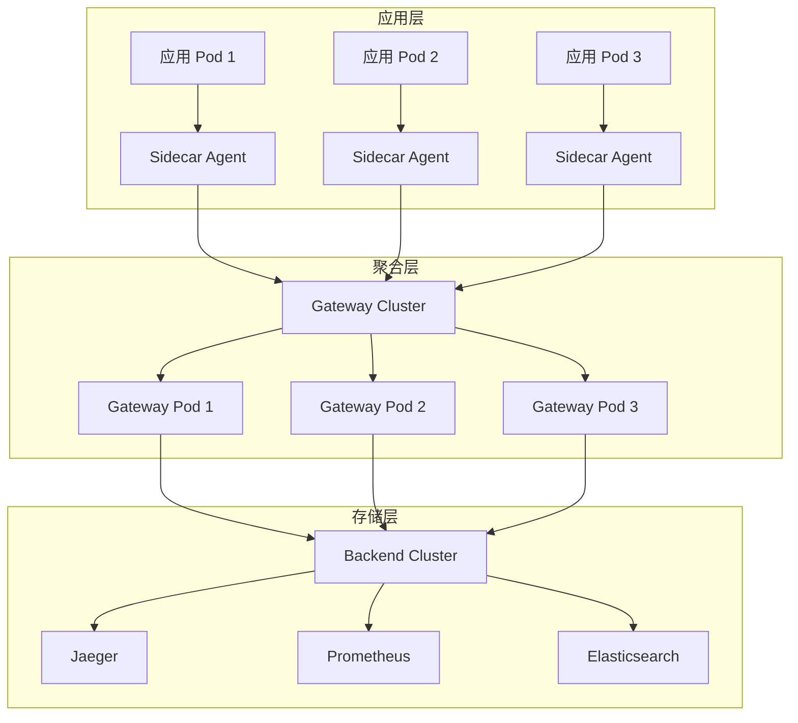


## 1. 概述

部署架构设计的核心是确保 OpenTelemetry 系统的高可用性、可扩展性和易维护性。本文档提供完整的部署指南,涵盖 Kubernetes、Docker、裸机等多种部署方式。

### 1.1 部署目标

**高可用性 (High Availability)**:
- 多副本部署,消除单点故障
- 自动故障转移和恢复
- 健康检查和自动重启
- 跨可用区部署

**弹性伸缩 (Elastic Scaling)**:
- 基于负载的自动扩缩容
- HPA (Horizontal Pod Autoscaler)
- VPA (Vertical Pod Autoscaler)
- 集群自动扩展

**快速部署 (Rapid Deployment)**:
- GitOps 工作流
- CI/CD 集成
- 蓝绿部署
- 金丝雀发布

**易于运维 (Easy Operations)**:
- 统一配置管理
- 集中式日志
- 完整监控告警
- 自动化运维

### 1.2 架构层次



### 1.3 部署模式对比

| 模式 | 优点 | 缺点 | 适用场景 |
|------|------|------|---------|
| **Sidecar** | 资源隔离、独立升级 | 资源开销大 | 多租户、严格隔离 |
| **DaemonSet** | 资源共享、统一管理 | 单点故障风险 | 单租户、资源受限 |
| **Deployment** | 弹性伸缩、负载均衡 | 配置复杂 | 高流量、需要扩展 |
| **StatefulSet** | 有状态、持久化 | 部署复杂 | 需要持久化存储 |

---

## 2. 部署模式

### 2.1 Sidecar 模式

**特点**:
- 每个应用 Pod 包含一个 Agent 容器
- 完全的资源隔离
- 独立的生命周期管理

**完整示例**:

```yaml
apiVersion: v1
kind: Pod
metadata:
  name: my-app-with-sidecar
  labels:
    app: my-app
spec:
  containers:
  # 应用容器
  - name: app
    image: my-app:v1.0.0
    ports:
    - containerPort: 8080
    env:
    - name: OTEL_EXPORTER_OTLP_ENDPOINT
      value: "http://localhost:4317"
    - name: OTEL_SERVICE_NAME
      value: "my-app"
    resources:
      requests:
        cpu: "500m"
        memory: "512Mi"
      limits:
        cpu: "1000m"
        memory: "1Gi"
  
  # Sidecar Agent 容器
  - name: otel-agent
    image: otel/opentelemetry-collector-contrib:0.90.0
    ports:
    - containerPort: 4317  # gRPC
      name: otlp-grpc
    - containerPort: 4318  # HTTP
      name: otlp-http
    - containerPort: 8888  # Metrics
      name: metrics
    volumeMounts:
    - name: otel-config
      mountPath: /etc/otel
    resources:
      requests:
        cpu: "200m"
        memory: "256Mi"
      limits:
        cpu: "500m"
        memory: "512Mi"
    livenessProbe:
      httpGet:
        path: /
        port: 13133
      initialDelaySeconds: 10
      periodSeconds: 10
    readinessProbe:
      httpGet:
        path: /
        port: 13133
      initialDelaySeconds: 5
      periodSeconds: 5
  
  volumes:
  - name: otel-config
    configMap:
      name: otel-agent-config
```

**Agent 配置**:

```yaml
apiVersion: v1
kind: ConfigMap
metadata:
  name: otel-agent-config
data:
  config.yaml: |
    receivers:
      otlp:
        protocols:
          grpc:
            endpoint: 0.0.0.0:4317
          http:
            endpoint: 0.0.0.0:4318
    
    processors:
      batch:
        timeout: 10s
        send_batch_size: 1024
      memory_limiter:
        check_interval: 1s
        limit_mib: 400
      resource:
        attributes:
        - key: deployment.environment
          value: production
          action: upsert
    
    exporters:
      otlp:
        endpoint: otel-gateway:4317
        tls:
          insecure: false
          cert_file: /etc/certs/client.crt
          key_file: /etc/certs/client.key
        retry_on_failure:
          enabled: true
          initial_interval: 1s
          max_interval: 30s
          max_elapsed_time: 300s
    
    extensions:
      health_check:
        endpoint: :13133
      pprof:
        endpoint: :1777
      zpages:
        endpoint: :55679
    
    service:
      extensions: [health_check, pprof, zpages]
      pipelines:
        traces:
          receivers: [otlp]
          processors: [memory_limiter, batch, resource]
          exporters: [otlp]
        metrics:
          receivers: [otlp]
          processors: [memory_limiter, batch, resource]
          exporters: [otlp]
      telemetry:
        logs:
          level: info
        metrics:
          address: :8888
```

### 2.2 DaemonSet 模式

**完整部署**:

```yaml
apiVersion: apps/v1
kind: DaemonSet
metadata:
  name: otel-agent
  namespace: observability
  labels:
    app: otel-agent
spec:
  selector:
    matchLabels:
      app: otel-agent
  template:
    metadata:
      labels:
        app: otel-agent
    spec:
      serviceAccountName: otel-agent
      hostNetwork: true
      dnsPolicy: ClusterFirstWithHostNet
      
      containers:
      - name: otel-agent
        image: otel/opentelemetry-collector-contrib:0.90.0
        ports:
        - containerPort: 4317
          hostPort: 4317
          name: otlp-grpc
        - containerPort: 4318
          hostPort: 4318
          name: otlp-http
        - containerPort: 8888
          name: metrics
        
        env:
        - name: NODE_NAME
          valueFrom:
            fieldRef:
              fieldPath: spec.nodeName
        - name: POD_NAMESPACE
          valueFrom:
            fieldRef:
              fieldPath: metadata.namespace
        
        volumeMounts:
        - name: otel-config
          mountPath: /etc/otel
        - name: varlog
          mountPath: /var/log
          readOnly: true
        
        resources:
          requests:
            cpu: 200m
            memory: 256Mi
          limits:
            cpu: 500m
            memory: 512Mi
        
        livenessProbe:
          httpGet:
            path: /
            port: 13133
        readinessProbe:
          httpGet:
            path: /
            port: 13133
      
      volumes:
      - name: otel-config
        configMap:
          name: otel-agent-config
      - name: varlog
        hostPath:
          path: /var/log
      
      tolerations:
      - effect: NoSchedule
        operator: Exists
      - effect: NoExecute
        operator: Exists
```

### 2.3 Gateway 部署

**高可用 Gateway 集群**:

```yaml
apiVersion: apps/v1
kind: Deployment
metadata:
  name: otel-gateway
  namespace: observability
spec:
  replicas: 3
  strategy:
    type: RollingUpdate
    rollingUpdate:
      maxSurge: 1
      maxUnavailable: 0
  selector:
    matchLabels:
      app: otel-gateway
  template:
    metadata:
      labels:
        app: otel-gateway
      annotations:
        prometheus.io/scrape: "true"
        prometheus.io/port: "8888"
        prometheus.io/path: "/metrics"
    spec:
      affinity:
        podAntiAffinity:
          preferredDuringSchedulingIgnoredDuringExecution:
          - weight: 100
            podAffinityTerm:
              labelSelector:
                matchExpressions:
                - key: app
                  operator: In
                  values:
                  - otel-gateway
              topologyKey: kubernetes.io/hostname
      
      containers:
      - name: otel-gateway
        image: otel/opentelemetry-collector-contrib:0.90.0
        ports:
        - containerPort: 4317
          name: otlp-grpc
        - containerPort: 4318
          name: otlp-http
        - containerPort: 8888
          name: metrics
        
        volumeMounts:
        - name: otel-config
          mountPath: /etc/otel
        
        resources:
          requests:
            cpu: 1000m
            memory: 2Gi
          limits:
            cpu: 2000m
            memory: 4Gi
        
        livenessProbe:
          httpGet:
            path: /
            port: 13133
          initialDelaySeconds: 30
          periodSeconds: 10
        readinessProbe:
          httpGet:
            path: /
            port: 13133
          initialDelaySeconds: 10
          periodSeconds: 5
      
      volumes:
      - name: otel-config
        configMap:
          name: otel-gateway-config
---
apiVersion: v1
kind: Service
metadata:
  name: otel-gateway
  namespace: observability
spec:
  type: ClusterIP
  selector:
    app: otel-gateway
  ports:
  - name: otlp-grpc
    port: 4317
    targetPort: 4317
  - name: otlp-http
    port: 4318
    targetPort: 4318
  - name: metrics
    port: 8888
    targetPort: 8888
---
apiVersion: autoscaling/v2
kind: HorizontalPodAutoscaler
metadata:
  name: otel-gateway-hpa
  namespace: observability
spec:
  scaleTargetRef:
    apiVersion: apps/v1
    kind: Deployment
    name: otel-gateway
  minReplicas: 3
  maxReplicas: 10
  metrics:
  - type: Resource
    resource:
      name: cpu
      target:
        type: Utilization
        averageUtilization: 70
  - type: Resource
    resource:
      name: memory
      target:
        type: Utilization
        averageUtilization: 80
  behavior:
    scaleDown:
      stabilizationWindowSeconds: 300
      policies:
      - type: Percent
        value: 50
        periodSeconds: 60
    scaleUp:
      stabilizationWindowSeconds: 0
      policies:
      - type: Percent
        value: 100
        periodSeconds: 30
      - type: Pods
        value: 2
        periodSeconds: 30
      selectPolicy: Max
```

---

**文档状态**: ✅ 持续填充中  
**最后更新**: 2025-10-06  
**维护者**: OTLP_go Team
