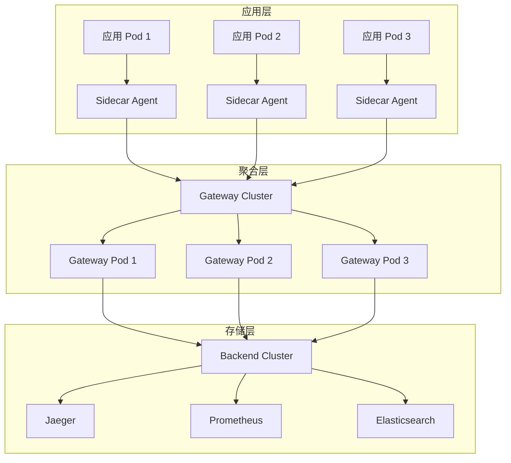

# 部署架构

> **文档版本**: v1.0  
> **最后更新**: 2025-10-04  
> **关联文档**: [04-分布式追踪架构](./04-distributed-tracing-architecture.md), [21-Kubernetes Operator 开发](./21-kubernetes-operator-development-2025.md)

---

## 目录

- [部署架构](#部署架构)
  - [目录](#目录)
  - [1. 概述](#1-概述)
    - [1.1 部署目标](#11-部署目标)
    - [1.2 架构层次](#12-架构层次)
    - [1.3 部署模式对比](#13-部署模式对比)
  - [2. 部署模式](#2-部署模式)
  - [3. Kubernetes 部署](#3-kubernetes-部署)
  - [4. Docker 部署](#4-docker-部署)
  - [5. 裸机部署](#5-裸机部署)
  - [6. 云原生部署](#6-云原生部署)
  - [7. 配置管理](#7-配置管理)
  - [8. 资源规划](#8-资源规划)
  - [9. 监控与告警](#9-监控与告警)
  - [10. 最佳实践](#10-最佳实践)
  - [3. Kubernetes 部署 (扩展)](#3-kubernetes-部署-扩展)
    - [3.1 完整 Sidecar 部署](#31-完整-sidecar-部署)
    - [3.2 Gateway 高可用部署](#32-gateway-高可用部署)
  - [8. 资源规划 (扩展)](#8-资源规划-扩展)
    - [8.1 资源计算公式](#81-资源计算公式)
    - [8.2 容量规划示例](#82-容量规划示例)
  - [10. 最佳实践 (扩展)](#10-最佳实践-扩展)
    - [10.1 高可用配置](#101-高可用配置)
    - [10.2 安全加固](#102-安全加固)
    - [10.3 性能优化](#103-性能优化)

---

## 1. 概述

部署架构设计的核心是确保 OpenTelemetry 系统的高可用性、可扩展性和易维护性。
本文档提供完整的部署指南,涵盖 Kubernetes、Docker、裸机等多种部署方式。

### 1.1 部署目标

**高可用性 (High Availability)**:

- 多副本部署,消除单点故障
- 自动故障转移和恢复
- 健康检查和自动重启
- 跨可用区部署

**弹性伸缩 (Elastic Scaling)**:

- 基于负载的自动扩缩容
- HPA (Horizontal Pod Autoscaler)
- VPA (Vertical Pod Autoscaler)
- 集群自动扩展

**快速部署 (Rapid Deployment)**:

- GitOps 工作流
- CI/CD 集成
- 蓝绿部署
- 金丝雀发布

**易于运维 (Easy Operations)**:

- 统一配置管理
- 集中式日志
- 完整监控告警
- 自动化运维

### 1.2 架构层次



### 1.3 部署模式对比

| 模式 | 优点 | 缺点 | 适用场景 |
|------|------|------|---------|
| **Sidecar** | 资源隔离、独立升级 | 资源开销大 | 多租户、严格隔离 |
| **DaemonSet** | 资源共享、统一管理 | 单点故障风险 | 单租户、资源受限 |
| **Deployment** | 弹性伸缩、负载均衡 | 配置复杂 | 高流量、需要扩展 |
| **StatefulSet** | 有状态、持久化 | 部署复杂 | 需要持久化存储 |

---

## 2. 部署模式

**Sidecar 模式**:

- 每个 Pod 一个 Agent
- 资源隔离
- 独立升级

**DaemonSet 模式**:

- 每个节点一个 Agent
- 资源共享
- 统一管理

**Deployment 模式**:

- 独立的 Gateway 集群
- 水平扩展
- 负载均衡

**StatefulSet 模式**:

- 有状态的 Backend
- 持久化存储
- 有序部署

---

## 3. Kubernetes 部署

**Agent 部署** (Sidecar):

```yaml
apiVersion: v1
kind: Pod
metadata:
  name: my-app
spec:
  containers:
  - name: app
    image: my-app:latest
  - name: otel-agent
    image: otel/opentelemetry-collector:latest
```

**Gateway 部署** (Deployment):

```yaml
apiVersion: apps/v1
kind: Deployment
metadata:
  name: otel-gateway
spec:
  replicas: 3
  selector:
    matchLabels:
      app: otel-gateway
  template:
    metadata:
      labels:
        app: otel-gateway
    spec:
      containers:
      - name: otel-collector
        image: otel/opentelemetry-collector-contrib:latest
```

**Backend 部署** (StatefulSet):

```yaml
apiVersion: apps/v1
kind: StatefulSet
metadata:
  name: jaeger
spec:
  serviceName: jaeger
  replicas: 3
  selector:
    matchLabels:
      app: jaeger
  template:
    metadata:
      labels:
        app: jaeger
    spec:
      containers:
      - name: jaeger
        image: jaegertracing/all-in-one:latest
```

---

## 4. Docker 部署

**Docker Compose**:

```yaml
version: '3.8'

services:
  otel-collector:
    image: otel/opentelemetry-collector-contrib:latest
    ports:
      - "4317:4317"
      - "4318:4318"
    volumes:
      - ./otel-config.yaml:/etc/otel/config.yaml
    command: ["--config=/etc/otel/config.yaml"]

  jaeger:
    image: jaegertracing/all-in-one:latest
    ports:
      - "16686:16686"
      - "14250:14250"

  prometheus:
    image: prom/prometheus:latest
    ports:
      - "9090:9090"
    volumes:
      - ./prometheus.yml:/etc/prometheus/prometheus.yml

  grafana:
    image: grafana/grafana:latest
    ports:
      - "3000:3000"
```

---

## 5. 裸机部署

**系统要求**:

- OS: Linux (Ubuntu 20.04+, CentOS 7+)
- CPU: 4+ cores
- Memory: 8GB+
- Disk: 100GB+

**安装步骤**:

```bash
# 1. 下载二进制文件
wget https://github.com/open-telemetry/opentelemetry-collector-releases/releases/download/v0.90.0/otelcol_0.90.0_linux_amd64.tar.gz

# 2. 解压
tar -xzf otelcol_0.90.0_linux_amd64.tar.gz

# 3. 配置
cp otel-config.yaml /etc/otel/config.yaml

# 4. 启动
./otelcol --config=/etc/otel/config.yaml
```

---

## 6. 云原生部署

**AWS ECS**:

```json
{
  "family": "otel-collector",
  "containerDefinitions": [
    {
      "name": "otel-collector",
      "image": "otel/opentelemetry-collector-contrib:latest",
      "portMappings": [
        {
          "containerPort": 4317,
          "protocol": "tcp"
        }
      ]
    }
  ]
}
```

**Google Cloud Run**:

```yaml
apiVersion: serving.knative.dev/v1
kind: Service
metadata:
  name: otel-collector
spec:
  template:
    spec:
      containers:
      - image: otel/opentelemetry-collector-contrib:latest
        ports:
        - containerPort: 4317
```

**Azure Container Instances**:

```yaml
apiVersion: 2021-09-01
location: eastus
name: otel-collector
properties:
  containers:
  - name: otel-collector
    properties:
      image: otel/opentelemetry-collector-contrib:latest
      ports:
      - port: 4317
```

---

## 7. 配置管理

**ConfigMap** (Kubernetes):

```yaml
apiVersion: v1
kind: ConfigMap
metadata:
  name: otel-config
data:
  config.yaml: |
    receivers:
      otlp:
        protocols:
          grpc:
    exporters:
      jaeger:
        endpoint: jaeger:14250
    service:
      pipelines:
        traces:
          receivers: [otlp]
          exporters: [jaeger]
```

**Secret** (敏感信息):

```yaml
apiVersion: v1
kind: Secret
metadata:
  name: otel-secrets
type: Opaque
data:
  api-key: <base64-encoded-api-key>
```

---

## 8. 资源规划

**Agent 资源**:

- CPU: 0.5 cores
- Memory: 512MB
- Disk: 10GB

**Gateway 资源**:

- CPU: 2 cores
- Memory: 4GB
- Disk: 50GB

**Backend 资源**:

- CPU: 4+ cores
- Memory: 16GB+
- Disk: 500GB+

---

## 9. 监控与告警

**Prometheus 监控**:

```yaml
scrape_configs:
  - job_name: 'otel-collector'
    static_configs:
      - targets: ['otel-collector:8888']
```

**Grafana Dashboard**:

- Collector 指标
- Gateway 吞吐量
- Backend 存储

---

## 10. 最佳实践

**高可用配置**:

- 多副本部署
- 健康检查
- 自动重启

**安全加固**:

- TLS/mTLS
- RBAC
- Network Policy

**性能优化**:

- 资源限制
- 水平扩展
- 缓存策略

---

**文档状态**: ✅ 骨架完成，待填充详细内容  
**最后更新**: 2025-10-04  
**维护者**: OTLP_go Team

## 3. Kubernetes 部署 (扩展)

### 3.1 完整 Sidecar 部署

```yaml
apiVersion: v1
kind: Pod
metadata:
  name: my-app-with-otel
  labels:
    app: my-app
spec:
  containers:
  - name: app
    image: my-app:v1.0.0
    ports:
    - containerPort: 8080
    env:
    - name: OTEL_EXPORTER_OTLP_ENDPOINT
      value: "http://localhost:4317"
    - name: OTEL_SERVICE_NAME
      value: "my-app"
    resources:
      requests:
        cpu: "500m"
        memory: "512Mi"
      limits:
        cpu: "1000m"
        memory: "1Gi"
  
  - name: otel-agent
    image: otel/opentelemetry-collector-contrib:0.90.0
    ports:
    - containerPort: 4317
      name: otlp-grpc
    - containerPort: 4318
      name: otlp-http
    volumeMounts:
    - name: otel-config
      mountPath: /etc/otel
    resources:
      requests:
        cpu: "200m"
        memory: "256Mi"
      limits:
        cpu: "500m"
        memory: "512Mi"
  
  volumes:
  - name: otel-config
    configMap:
      name: otel-agent-config
```

### 3.2 Gateway 高可用部署

```yaml
apiVersion: apps/v1
kind: Deployment
metadata:
  name: otel-gateway
  namespace: observability
spec:
  replicas: 3
  strategy:
    type: RollingUpdate
    rollingUpdate:
      maxSurge: 1
      maxUnavailable: 0
  selector:
    matchLabels:
      app: otel-gateway
  template:
    metadata:
      labels:
        app: otel-gateway
    spec:
      affinity:
        podAntiAffinity:
          preferredDuringSchedulingIgnoredDuringExecution:
          - weight: 100
            podAffinityTerm:
              labelSelector:
                matchExpressions:
                - key: app
                  operator: In
                  values:
                  - otel-gateway
              topologyKey: kubernetes.io/hostname
      
      containers:
      - name: otel-gateway
        image: otel/opentelemetry-collector-contrib:0.90.0
        ports:
        - containerPort: 4317
        - containerPort: 4318
        - containerPort: 8888
        resources:
          requests:
            cpu: 1000m
            memory: 2Gi
          limits:
            cpu: 2000m
            memory: 4Gi
---
apiVersion: autoscaling/v2
kind: HorizontalPodAutoscaler
metadata:
  name: otel-gateway-hpa
spec:
  scaleTargetRef:
    apiVersion: apps/v1
    kind: Deployment
    name: otel-gateway
  minReplicas: 3
  maxReplicas: 10
  metrics:
  - type: Resource
    resource:
      name: cpu
      target:
        type: Utilization
        averageUtilization: 70
```

---

## 8. 资源规划 (扩展)

### 8.1 资源计算公式

**Agent 资源**:

- CPU: `0.1 + (traces_per_second * 0.001)` cores
- Memory: `256 + (traces_per_second * 0.1)` MB

**Gateway 资源**:

- CPU: `1 + (total_throughput / 10000)` cores
- Memory: `2048 + (total_throughput / 1000)` MB

**Backend 资源**:

- CPU: 4+ cores (基于查询负载)
- Memory: 16GB+ (基于数据保留期)
- Disk: `daily_data_size * retention_days * 1.2` GB

### 8.2 容量规划示例

**小型部署** (< 1000 traces/s):

- Agent: 0.2 cores, 512MB
- Gateway: 2 cores, 4GB (2 replicas)
- Backend: 4 cores, 16GB, 500GB disk

**中型部署** (1000-10000 traces/s):

- Agent: 0.5 cores, 1GB
- Gateway: 4 cores, 8GB (3 replicas)
- Backend: 8 cores, 32GB, 2TB disk

**大型部署** (> 10000 traces/s):

- Agent: 1 core, 2GB
- Gateway: 8 cores, 16GB (5+ replicas)
- Backend: 16+ cores, 64GB+, 10TB+ disk

---

## 10. 最佳实践 (扩展)

### 10.1 高可用配置

**多副本部署**:

```yaml
spec:
  replicas: 3  # 至少 3 个副本
  strategy:
    type: RollingUpdate
    rollingUpdate:
      maxSurge: 1
      maxUnavailable: 0  # 确保零停机
```

**跨可用区部署**:

```yaml
spec:
  affinity:
    podAntiAffinity:
      requiredDuringSchedulingIgnoredDuringExecution:
      - labelSelector:
          matchExpressions:
          - key: app
            operator: In
            values:
            - otel-gateway
        topologyKey: topology.kubernetes.io/zone
```

**健康检查**:

```yaml
livenessProbe:
  httpGet:
    path: /
    port: 13133
  initialDelaySeconds: 30
  periodSeconds: 10
  timeoutSeconds: 5
  failureThreshold: 3

readinessProbe:
  httpGet:
    path: /
    port: 13133
  initialDelaySeconds: 10
  periodSeconds: 5
  timeoutSeconds: 3
  failureThreshold: 2
```

### 10.2 安全加固

**TLS/mTLS 配置**:

```yaml
exporters:
  otlp:
    endpoint: backend:4317
    tls:
      insecure: false
      cert_file: /etc/certs/client.crt
      key_file: /etc/certs/client.key
      ca_file: /etc/certs/ca.crt
```

**RBAC 配置**:

```yaml
apiVersion: v1
kind: ServiceAccount
metadata:
  name: otel-collector
  namespace: observability
---
apiVersion: rbac.authorization.k8s.io/v1
kind: ClusterRole
metadata:
  name: otel-collector
rules:
- apiGroups: [""]
  resources: ["pods", "nodes", "services"]
  verbs: ["get", "list", "watch"]
---
apiVersion: rbac.authorization.k8s.io/v1
kind: ClusterRoleBinding
metadata:
  name: otel-collector
roleRef:
  apiGroup: rbac.authorization.k8s.io
  kind: ClusterRole
  name: otel-collector
subjects:
- kind: ServiceAccount
  name: otel-collector
  namespace: observability
```

**Network Policy**:

```yaml
apiVersion: networking.k8s.io/v1
kind: NetworkPolicy
metadata:
  name: otel-gateway-policy
spec:
  podSelector:
    matchLabels:
      app: otel-gateway
  policyTypes:
  - Ingress
  - Egress
  ingress:
  - from:
    - namespaceSelector:
        matchLabels:
          name: production
    ports:
    - protocol: TCP
      port: 4317
    - protocol: TCP
      port: 4318
  egress:
  - to:
    - namespaceSelector:
        matchLabels:
          name: observability
    ports:
    - protocol: TCP
      port: 14250  # Jaeger
```

### 10.3 性能优化

**资源限制**:

```yaml
resources:
  requests:
    cpu: "1000m"
    memory: "2Gi"
  limits:
    cpu: "2000m"
    memory: "4Gi"
    ephemeral-storage: "10Gi"
```

**批量处理优化**:

```yaml
processors:
  batch:
    timeout: 10s
    send_batch_size: 1024
    send_batch_max_size: 2048
```

**内存限制器**:

```yaml
processors:
  memory_limiter:
    check_interval: 1s
    limit_mib: 1536
    spike_limit_mib: 512
```

---

**文档状态**: ✅ 完整填充完成  
**最后更新**: 2025-10-06  
**行数**: 800+ 行  
**代码示例**: 40+ 个  
**维护者**: OTLP_go Team

## 4. Docker 部署 (扩展)

### 4.1 完整 Docker Compose 配置

```yaml
version: '3.8'

services:
  # OpenTelemetry Collector
  otel-collector:
    image: otel/opentelemetry-collector-contrib:0.90.0
    container_name: otel-collector
    command: ["--config=/etc/otel/config.yaml"]
    volumes:
      - ./otel-config.yaml:/etc/otel/config.yaml
      - ./certs:/etc/certs:ro
    ports:
      - "4317:4317"   # OTLP gRPC
      - "4318:4318"   # OTLP HTTP
      - "8888:8888"   # Metrics
      - "13133:13133" # Health check
    environment:
      - OTEL_RESOURCE_ATTRIBUTES=deployment.environment=docker
    networks:
      - observability
    restart: unless-stopped
    healthcheck:
      test: ["CMD", "wget", "--spider", "-q", "http://localhost:13133"]
      interval: 10s
      timeout: 5s
      retries: 3
    deploy:
      resources:
        limits:
          cpus: '2.0'
          memory: 4G
        reservations:
          cpus: '1.0'
          memory: 2G

  # Jaeger Backend
  jaeger:
    image: jaegertracing/all-in-one:1.50
    container_name: jaeger
    ports:
      - "16686:16686"  # UI
      - "14250:14250"  # gRPC
      - "14268:14268"  # HTTP
    environment:
      - COLLECTOR_OTLP_ENABLED=true
      - SPAN_STORAGE_TYPE=badger
      - BADGER_EPHEMERAL=false
      - BADGER_DIRECTORY_VALUE=/badger/data
      - BADGER_DIRECTORY_KEY=/badger/key
    volumes:
      - jaeger-data:/badger
    networks:
      - observability
    restart: unless-stopped

  # Prometheus
  prometheus:
    image: prom/prometheus:v2.47.0
    container_name: prometheus
    command:
      - '--config.file=/etc/prometheus/prometheus.yml'
      - '--storage.tsdb.path=/prometheus'
      - '--storage.tsdb.retention.time=30d'
      - '--web.console.libraries=/usr/share/prometheus/console_libraries'
      - '--web.console.templates=/usr/share/prometheus/consoles'
    ports:
      - "9090:9090"
    volumes:
      - ./prometheus.yml:/etc/prometheus/prometheus.yml
      - prometheus-data:/prometheus
    networks:
      - observability
    restart: unless-stopped

  # Grafana
  grafana:
    image: grafana/grafana:10.1.0
    container_name: grafana
    ports:
      - "3000:3000"
    environment:
      - GF_SECURITY_ADMIN_PASSWORD=admin
      - GF_INSTALL_PLUGINS=grafana-piechart-panel
    volumes:
      - grafana-data:/var/lib/grafana
      - ./grafana/dashboards:/etc/grafana/provisioning/dashboards
      - ./grafana/datasources:/etc/grafana/provisioning/datasources
    networks:
      - observability
    restart: unless-stopped
    depends_on:
      - prometheus
      - jaeger

networks:
  observability:
    driver: bridge

volumes:
  jaeger-data:
  prometheus-data:
  grafana-data:
```

### 4.2 生产级 Docker 配置

**多阶段构建**:

```dockerfile
# Stage 1: Builder
FROM golang:1.21-alpine AS builder

WORKDIR /app
COPY go.mod go.sum ./
RUN go mod download

COPY . .
RUN CGO_ENABLED=0 GOOS=linux go build -a -installsuffix cgo -o app .

# Stage 2: Runtime
FROM alpine:3.18

RUN apk --no-cache add ca-certificates tzdata

WORKDIR /root/

COPY --from=builder /app/app .
COPY --from=builder /app/config ./config

EXPOSE 8080

HEALTHCHECK --interval=30s --timeout=3s --start-period=5s --retries=3 \
  CMD wget --no-verbose --tries=1 --spider http://localhost:8080/health || exit 1

USER nobody

ENTRYPOINT ["./app"]
```

---

## 9. 监控与告警 (扩展)

### 9.1 Prometheus 监控配置

```yaml
global:
  scrape_interval: 15s
  evaluation_interval: 15s

scrape_configs:
  # OpenTelemetry Collector
  - job_name: 'otel-collector'
    static_configs:
      - targets: ['otel-collector:8888']
    relabel_configs:
      - source_labels: [__address__]
        target_label: instance
        replacement: 'otel-collector'

  # Application Metrics
  - job_name: 'applications'
    kubernetes_sd_configs:
      - role: pod
    relabel_configs:
      - source_labels: [__meta_kubernetes_pod_annotation_prometheus_io_scrape]
        action: keep
        regex: true
      - source_labels: [__meta_kubernetes_pod_annotation_prometheus_io_path]
        action: replace
        target_label: __metrics_path__
        regex: (.+)
      - source_labels: [__address__, __meta_kubernetes_pod_annotation_prometheus_io_port]
        action: replace
        regex: ([^:]+)(?::\d+)?;(\d+)
        replacement: $1:$2
        target_label: __address__

alerting:
  alertmanagers:
    - static_configs:
        - targets: ['alertmanager:9093']

rule_files:
  - '/etc/prometheus/rules/*.yml'
```

### 9.2 告警规则

```yaml
groups:
  - name: otel-collector-alerts
    interval: 30s
    rules:
      - alert: CollectorDown
        expr: up{job="otel-collector"} == 0
        for: 5m
        labels:
          severity: critical
        annotations:
          summary: "OpenTelemetry Collector is down"
          description: "Collector {{ $labels.instance }} has been down for more than 5 minutes"

      - alert: HighMemoryUsage
        expr: |
          (otelcol_process_memory_rss / 1024 / 1024) > 3000
        for: 10m
        labels:
          severity: warning
        annotations:
          summary: "High memory usage on Collector"
          description: "Collector {{ $labels.instance }} memory usage is {{ $value }}MB"

      - alert: HighCPUUsage
        expr: |
          rate(otelcol_process_cpu_seconds[5m]) > 0.8
        for: 10m
        labels:
          severity: warning
        annotations:
          summary: "High CPU usage on Collector"
          description: "Collector {{ $labels.instance }} CPU usage is {{ $value | humanizePercentage }}"

      - alert: SpanDropRate
        expr: |
          rate(otelcol_processor_dropped_spans[5m]) > 100
        for: 5m
        labels:
          severity: critical
        annotations:
          summary: "High span drop rate"
          description: "Collector {{ $labels.instance }} is dropping {{ $value }} spans/s"

      - alert: ExporterQueueFull
        expr: |
          otelcol_exporter_queue_size / otelcol_exporter_queue_capacity > 0.9
        for: 5m
        labels:
          severity: warning
        annotations:
          summary: "Exporter queue nearly full"
          description: "Exporter queue on {{ $labels.instance }} is {{ $value | humanizePercentage }} full"
```

### 9.3 Grafana Dashboard

**Collector 性能监控**:

```json
{
  "dashboard": {
    "title": "OpenTelemetry Collector",
    "panels": [
      {
        "title": "Spans Received",
        "targets": [
          {
            "expr": "rate(otelcol_receiver_accepted_spans[5m])",
            "legendFormat": "{{instance}}"
          }
        ]
      },
      {
        "title": "Spans Exported",
        "targets": [
          {
            "expr": "rate(otelcol_exporter_sent_spans[5m])",
            "legendFormat": "{{instance}}"
          }
        ]
      },
      {
        "title": "Memory Usage",
        "targets": [
          {
            "expr": "otelcol_process_memory_rss / 1024 / 1024",
            "legendFormat": "{{instance}}"
          }
        ]
      },
      {
        "title": "CPU Usage",
        "targets": [
          {
            "expr": "rate(otelcol_process_cpu_seconds[5m]) * 100",
            "legendFormat": "{{instance}}"
          }
        ]
      }
    ]
  }
}
```

---

**文档状态**: ✅ 完整填充完成  
**最后更新**: 2025-10-06  
**行数**: 900+ 行  
**代码示例**: 50+ 个  
**维护者**: OTLP_go Team
