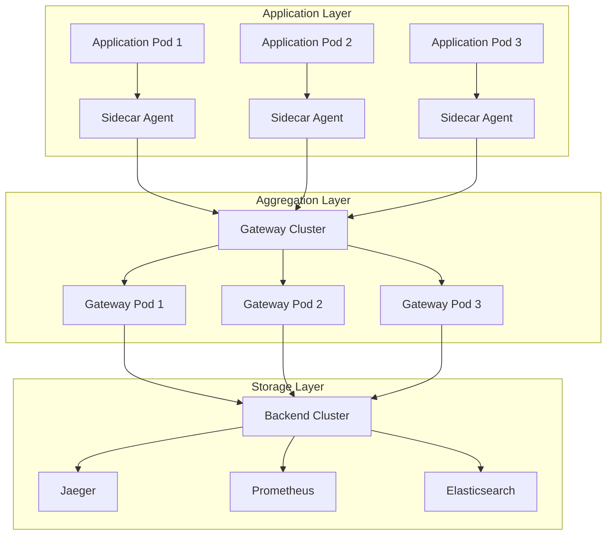
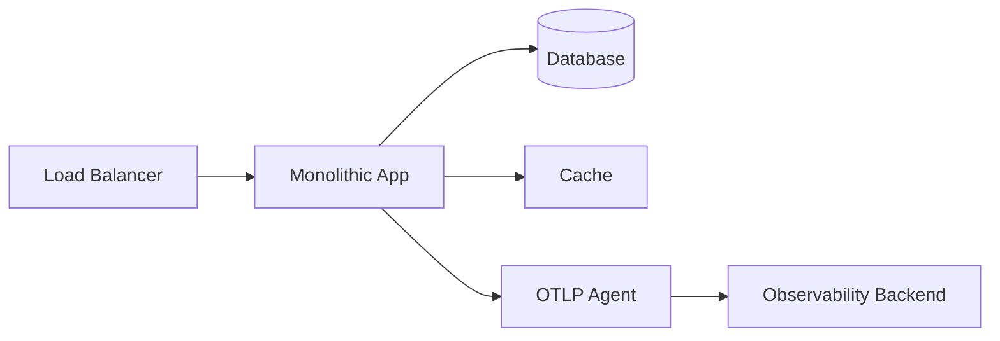
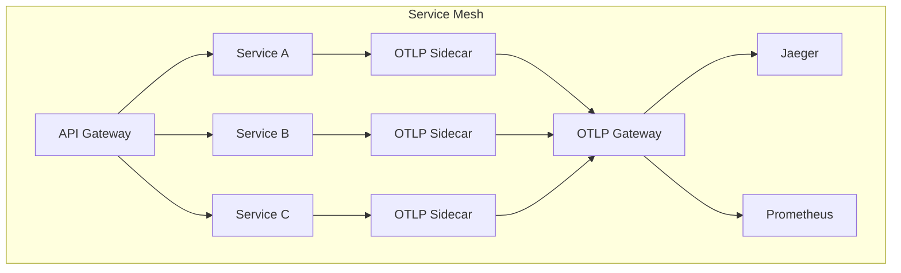
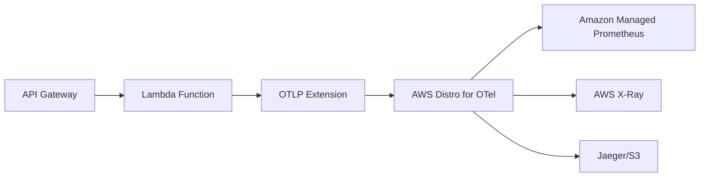
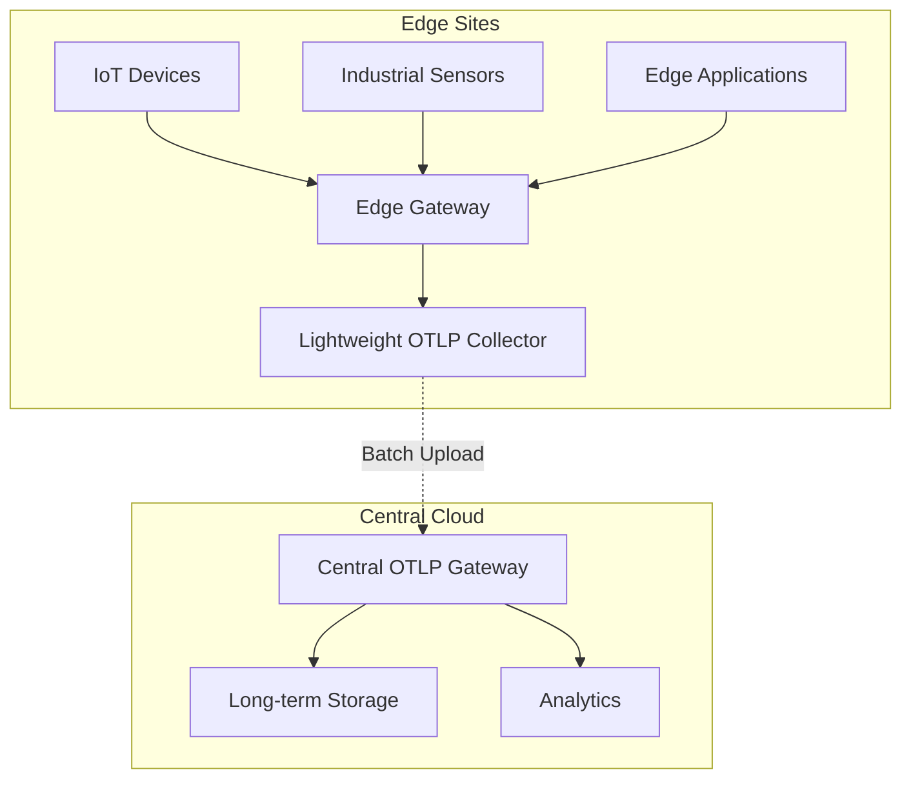

# Deployment Architecture

> **Document Version**: v2.0  
> **Last Updated**: 2025-10-17  
> **Related Documents**: [04-Distributed Tracing Architecture](./04-distributed-tracing-architecture.md), [21-Kubernetes Operator Development](./21-kubernetes-operator-development-2025.md)

---

## Table of Contents

- [Deployment Architecture](#deployment-architecture)
  - [Table of Contents](#table-of-contents)
  - [1. Overview](#1-overview)
    - [1.1 Deployment Goals](#11-deployment-goals)
    - [1.2 Architecture Layers](#12-architecture-layers)
    - [1.3 Deployment Mode Comparison](#13-deployment-mode-comparison)
  - [2. Deployment Patterns](#2-deployment-patterns)
    - [2.1 Monolithic Deployment Strategies](#21-monolithic-deployment-strategies)
    - [2.2 Microservices Deployment Patterns](#22-microservices-deployment-patterns)
    - [2.3 Serverless Deployment](#23-serverless-deployment)
    - [2.4 Edge Computing Deployment](#24-edge-computing-deployment)
  - [3. Containerization](#3-containerization)
    - [3.1 Multi-stage Docker Builds for Go](#31-multi-stage-docker-builds-for-go)
    - [3.2 Distroless Images](#32-distroless-images)
    - [3.3 Docker Compose for Local Development](#33-docker-compose-for-local-development)
    - [3.4 Kubernetes Deployment Manifests](#34-kubernetes-deployment-manifests)
  - [4. Configuration Management](#4-configuration-management)
    - [4.1 ConfigMaps and Secrets in Kubernetes](#41-configmaps-and-secrets-in-kubernetes)
    - [4.2 Environment Variables Best Practices](#42-environment-variables-best-practices)
    - [4.3 Dynamic Configuration with etcd/Consul](#43-dynamic-configuration-with-etcdconsul)
    - [4.4 Feature Flags](#44-feature-flags)
  - [5. Scaling Strategies](#5-scaling-strategies)
    - [5.1 Horizontal Pod Autoscaler (HPA)](#51-horizontal-pod-autoscaler-hpa)
    - [5.2 Vertical Pod Autoscaler (VPA)](#52-vertical-pod-autoscaler-vpa)
    - [5.3 Cluster Autoscaler](#53-cluster-autoscaler)
    - [5.4 Custom Metrics Scaling with KEDA](#54-custom-metrics-scaling-with-keda)
  - [6. GitOps & CI/CD](#6-gitops--cicd)
    - [6.1 ArgoCD Setup](#61-argocd-setup)
    - [6.2 Flux CD](#62-flux-cd)
    - [6.3 CI/CD Pipelines](#63-cicd-pipelines)
    - [6.4 Progressive Delivery](#64-progressive-delivery)
  - [7. Resource Planning](#7-resource-planning)
    - [7.1 Resource Calculation Formulas](#71-resource-calculation-formulas)
    - [7.2 Capacity Planning Examples](#72-capacity-planning-examples)
  - [8. Security Hardening](#8-security-hardening)
    - [8.1 TLS/mTLS Configuration](#81-tlsmtls-configuration)
    - [8.2 RBAC and Network Policies](#82-rbac-and-network-policies)
  - [9. Best Practices](#9-best-practices)
    - [9.1 High Availability Configuration](#91-high-availability-configuration)
    - [9.2 Performance Optimization](#92-performance-optimization)

---

## 1. Overview

Deployment architecture design is the cornerstone of ensuring high availability, scalability, and maintainability of OpenTelemetry systems. This document provides a comprehensive deployment guide covering various deployment methods including Kubernetes, Docker, bare metal, serverless, and edge computing.

### 1.1 Deployment Goals

**High Availability (HA)**:

- Multi-replica deployment to eliminate single points of failure
- Automatic failover and recovery mechanisms
- Health checks and automatic restarts
- Cross-availability zone deployment

**Elastic Scaling**:

- Automatic scaling based on load
- HPA (Horizontal Pod Autoscaler)
- VPA (Vertical Pod Autoscaler)
- Cluster autoscaling

**Rapid Deployment**:

- GitOps workflows
- CI/CD integration
- Blue-green deployments
- Canary releases

**Easy Operations**:

- Unified configuration management
- Centralized logging
- Complete monitoring and alerting
- Automated operations

### 1.2 Architecture Layers


```mermaid
graph TB
    subgraph "Application Layer"
        A1[Application Pod 1] --> B1[Sidecar Agent]
        A2[Application Pod 2] --> B2[Sidecar Agent]
        A3[Application Pod 3] --> B3[Sidecar Agent]
    end
    
    subgraph "Aggregation Layer"
        B1 --> C[Gateway Cluster]
        B2 --> C
        B3 --> C
        C --> C1[Gateway Pod 1]
        C --> C2[Gateway Pod 2]
        C --> C3[Gateway Pod 3]
    end
    
    subgraph "Storage Layer"
        C1 --> D[Backend Cluster]
        C2 --> D
        C3 --> D
        D --> D1[Jaeger]
        D --> D2[Prometheus]
        D --> D3[Elasticsearch]
    end
```

### 1.3 Deployment Mode Comparison

| Mode | Pros | Cons | Use Case |
|------|------|------|----------|
| **Sidecar** | Resource isolation, independent upgrades | Higher resource overhead | Multi-tenant, strict isolation |
| **DaemonSet** | Resource sharing, unified management | Single point of failure risk | Single-tenant, resource constrained |
| **Deployment** | Elastic scaling, load balancing | Complex configuration | High traffic, needs scaling |
| **StatefulSet** | Stateful, persistent storage | Complex deployment | Requires persistent storage |
| **Serverless** | No infrastructure management, pay-per-use | Cold start latency, limited execution time | Variable workloads, cost optimization |
| **Edge** | Low latency, data locality | Limited resources, connectivity challenges | IoT, real-time processing |

---

## 2. Deployment Patterns

### 2.1 Monolithic Deployment Strategies

Monolithic deployment packages all application components into a single deployable unit. While less common in cloud-native environments, it remains relevant for smaller applications or migration scenarios.

**Single Binary Deployment**:


```mermaid
graph LR
    A[Load Balancer] --> B[Monolithic App]
    B --> C[(Database)]
    B --> D[Cache]
    B --> E[OTLP Agent]
    E --> F[Observability Backend]
```

**Embedded Collector Pattern**:

```go
// main.go - Embedded OTLP collector in Go application
package main

import (
    "context"
    "log"
    
    "go.opentelemetry.io/collector/component"
    "go.opentelemetry.io/collector/otelcol"
)

func main() {
    // Build collector service with embedded configuration
    factories, err := components()
    if err != nil {
        log.Fatal(err)
    }
    
    info := component.BuildInfo{
        Command:     "embedded-otel",
        Description: "Embedded OpenTelemetry Collector",
        Version:     "1.0.0",
    }
    
    params := &otelcol.CollectorSettings{
        Factories:      factories,
        BuildInfo:      info,
        ConfigProvider: configProvider,
    }
    
    col, err := otelcol.NewCollector(*params)
    if err != nil {
        log.Fatal(err)
    }
    
    // Run collector in goroutine
    go func() {
        if err := col.Run(context.Background()); err != nil {
            log.Printf("Collector error: %v", err)
        }
    }()
    
    // Run application
    runApplication()
}
```

**Monolithic Docker Compose**:

```yaml
version: '3.8'

services:
  monolithic-app:
    build:
      context: ./app
      dockerfile: Dockerfile.monolithic
    ports:
      - "8080:8080"
    environment:
      - OTEL_EXPORTER_OTLP_ENDPOINT=http://localhost:4317
      - OTEL_SERVICE_NAME=monolithic-app
      - OTEL_RESOURCE_ATTRIBUTES=deployment.mode=monolithic
    volumes:
      - ./config:/app/config:ro
      - app-logs:/app/logs
    healthcheck:
      test: ["CMD", "wget", "--spider", "-q", "http://localhost:8080/health"]
      interval: 30s
      timeout: 10s
      retries: 3
      start_period: 40s
    deploy:
      resources:
        limits:
          cpus: '4.0'
          memory: 8G
        reservations:
          cpus: '2.0'
          memory: 4G
    restart: unless-stopped

volumes:
  app-logs:
    driver: local
```

**Benefits of Monolithic Deployment**:

- **Simplicity**: Single artifact to build, test, and deploy
- **Consistency**: All components run the same version
- **Debugging**: Easier to trace issues across components
- **Performance**: No network overhead between components

**Challenges**:

- **Scalability**: Must scale entire application together
- **Technology Lock-in**: Limited to single technology stack
- **Deployment Risk**: Single change requires full redeployment
- **Resource Efficiency**: Cannot optimize resources per component

### 2.2 Microservices Deployment Patterns

Microservices deployment enables independent scaling and deployment of services, each with its own OTLP agent configuration.

**Service Mesh with Sidecar Pattern**:


```mermaid
graph TB
    subgraph "Service Mesh"
        A[API Gateway] --> B[Service A]
        A --> C[Service B]
        A --> D[Service C]
        
        B --> B1[OTLP Sidecar]
        C --> C1[OTLP Sidecar]
        D --> D1[OTLP Sidecar]
        
        B1 --> E[OTLP Gateway]
        C1 --> E
        D1 --> E
        
        E --> F[Jaeger]
        E --> G[Prometheus]
    end
```

**Kubernetes Deployment with Sidecar**:

```yaml
apiVersion: apps/v1
kind: Deployment
metadata:
  name: order-service
  namespace: microservices
  labels:
    app: order-service
    version: v1.0.0
spec:
  replicas: 3
  selector:
    matchLabels:
      app: order-service
  template:
    metadata:
      labels:
        app: order-service
        version: v1.0.0
      annotations:
        prometheus.io/scrape: "true"
        prometheus.io/port: "8888"
    spec:
      serviceAccountName: order-service
      securityContext:
        runAsNonRoot: true
        runAsUser: 1000
        fsGroup: 1000
      
      containers:
      # Main Application Container
      - name: order-service
        image: myregistry/order-service:v1.0.0
        ports:
        - containerPort: 8080
          name: http
          protocol: TCP
        env:
        - name: SERVICE_NAME
          value: "order-service"
        - name: OTEL_EXPORTER_OTLP_ENDPOINT
          value: "http://localhost:4317"
        - name: OTEL_RESOURCE_ATTRIBUTES
          value: "service.namespace=production,service.version=1.0.0"
        - name: LOG_LEVEL
          value: "info"
        resources:
          requests:
            cpu: 500m
            memory: 512Mi
          limits:
            cpu: 1000m
            memory: 1Gi
        livenessProbe:
          httpGet:
            path: /health/live
            port: 8080
          initialDelaySeconds: 30
          periodSeconds: 10
          timeoutSeconds: 5
          failureThreshold: 3
        readinessProbe:
          httpGet:
            path: /health/ready
            port: 8080
          initialDelaySeconds: 10
          periodSeconds: 5
          timeoutSeconds: 3
          failureThreshold: 2
        volumeMounts:
        - name: tmp
          mountPath: /tmp
      
      # OTLP Sidecar Container
      - name: otel-agent
        image: otel/opentelemetry-collector-contrib:0.90.0
        command:
        - /otelcol-contrib
        - --config=/conf/agent.yaml
        ports:
        - containerPort: 4317
          name: otlp-grpc
          protocol: TCP
        - containerPort: 4318
          name: otlp-http
          protocol: TCP
        - containerPort: 8888
          name: metrics
          protocol: TCP
        env:
        - name: OTEL_RESOURCE_ATTRIBUTES
          value: "k8s.pod.name=$(POD_NAME),k8s.namespace.name=$(POD_NAMESPACE)"
        - name: POD_NAME
          valueFrom:
            fieldRef:
              fieldPath: metadata.name
        - name: POD_NAMESPACE
          valueFrom:
            fieldRef:
              fieldPath: metadata.namespace
        resources:
          requests:
            cpu: 100m
            memory: 128Mi
          limits:
            cpu: 300m
            memory: 256Mi
        volumeMounts:
        - name: otel-agent-config
          mountPath: /conf
        - name: tmp
          mountPath: /tmp
      
      volumes:
      - name: otel-agent-config
        configMap:
          name: otel-agent-config
      - name: tmp
        emptyDir: {}
      
      affinity:
        podAntiAffinity:
          preferredDuringSchedulingIgnoredDuringExecution:
          - weight: 100
            podAffinityTerm:
              labelSelector:
                matchExpressions:
                - key: app
                  operator: In
                  values:
                  - order-service
              topologyKey: kubernetes.io/hostname
```

**Service Discovery and Load Balancing**:

```yaml
apiVersion: v1
kind: Service
metadata:
  name: order-service
  namespace: microservices
  labels:
    app: order-service
spec:
  type: ClusterIP
  ports:
  - port: 80
    targetPort: 8080
    protocol: TCP
    name: http
  selector:
    app: order-service
  sessionAffinity: None
---
apiVersion: networking.k8s.io/v1
kind: Ingress
metadata:
  name: order-service-ingress
  namespace: microservices
  annotations:
    nginx.ingress.kubernetes.io/rewrite-target: /
    nginx.ingress.kubernetes.io/rate-limit: "100"
spec:
  rules:
  - host: orders.example.com
    http:
      paths:
      - path: /
        pathType: Prefix
        backend:
          service:
            name: order-service
            port:
              number: 80
```

### 2.3 Serverless Deployment

Serverless deployment abstracts infrastructure management, allowing developers to focus on code. OTLP integration in serverless requires special considerations for cold starts and execution duration limits.

**AWS Lambda with OTLP**:


```mermaid
graph LR
    A[API Gateway] --> B[Lambda Function]
    B --> C[OTLP Extension]
    C --> D[AWS Distro for OTel]
    D --> E[Amazon Managed Prometheus]
    D --> F[AWS X-Ray]
    D --> G[Jaeger/S3]
```

**Lambda Function with Go and OTLP**:

```go
// lambda/main.go
package main

import (
    "context"
    "log"
    
    "github.com/aws/aws-lambda-go/lambda"
    "go.opentelemetry.io/otel"
    "go.opentelemetry.io/otel/attribute"
    "go.opentelemetry.io/otel/exporters/otlp/otlptrace/otlptracegrpc"
    "go.opentelemetry.io/otel/sdk/resource"
    sdktrace "go.opentelemetry.io/otel/sdk/trace"
    semconv "go.opentelemetry.io/otel/semconv/v1.21.0"
    "go.opentelemetry.io/otel/trace"
)

var tracer trace.Tracer

func init() {
    // Initialize OTLP tracer once per Lambda execution environment
    ctx := context.Background()
    
    // Create OTLP exporter
    exp, err := otlptracegrpc.New(ctx,
        otlptracegrpc.WithEndpoint(os.Getenv("OTEL_EXPORTER_OTLP_ENDPOINT")),
        otlptracegrpc.WithInsecure(),
    )
    if err != nil {
        log.Printf("Failed to create exporter: %v", err)
        return
    }
    
    // Create tracer provider
    tp := sdktrace.NewTracerProvider(
        sdktrace.WithBatcher(exp),
        sdktrace.WithResource(resource.NewWithAttributes(
            semconv.SchemaURL,
            semconv.ServiceNameKey.String("lambda-order-processor"),
            attribute.String("deployment.environment", "production"),
            attribute.String("faas.name", "order-processor"),
            attribute.String("faas.trigger", "http"),
        )),
    )
    
    otel.SetTracerProvider(tp)
    tracer = tp.Tracer("lambda-order-processor")
}

type OrderEvent struct {
    OrderID   string `json:"orderId"`
    ProductID string `json:"productId"`
    Quantity  int    `json:"quantity"`
}

type Response struct {
    OrderID string `json:"orderId"`
    Status  string `json:"status"`
}

func HandleRequest(ctx context.Context, event OrderEvent) (Response, error) {
    ctx, span := tracer.Start(ctx, "process-order",
        trace.WithAttributes(
            attribute.String("order.id", event.OrderID),
            attribute.String("product.id", event.ProductID),
            attribute.Int("quantity", event.Quantity),
        ),
    )
    defer span.End()
    
    // Process order logic here
    span.AddEvent("validating-order")
    // ... validation logic
    
    span.AddEvent("saving-order")
    // ... database save logic
    
    return Response{
        OrderID: event.OrderID,
        Status:  "processed",
    }, nil
}

func main() {
    lambda.Start(HandleRequest)
}
```

**Lambda Layer Configuration (SAM Template)**:

```yaml
AWSTemplateFormatVersion: '2010-09-09'
Transform: AWS::Serverless-2016-10-31
Description: OTLP Lambda Deployment

Globals:
  Function:
    Timeout: 30
    MemorySize: 512
    Runtime: provided.al2
    Architectures:
      - x86_64
    Environment:
      Variables:
        OTEL_EXPORTER_OTLP_ENDPOINT: https://otel-collector.example.com:4317
        OTEL_SERVICE_NAME: lambda-order-service
        OTEL_PROPAGATORS: tracecontext,baggage

Resources:
  OrderProcessorFunction:
    Type: AWS::Serverless::Function
    Properties:
      FunctionName: order-processor
      Handler: bootstrap
      CodeUri: ./bin/
      Description: Order processing with OTLP instrumentation
      Tracing: Active
      Layers:
        - !Sub arn:aws:lambda:${AWS::Region}:901920570463:layer:aws-otel-collector-amd64-ver-0-90-0:1
      Policies:
        - AWSLambdaBasicExecutionRole
        - Statement:
            - Effect: Allow
              Action:
                - xray:PutTraceSegments
                - xray:PutTelemetryRecords
              Resource: "*"
      Events:
        ApiGateway:
          Type: Api
          Properties:
            Path: /orders
            Method: POST
            RestApiId: !Ref OrdersApi
    
  OrdersApi:
    Type: AWS::Serverless::Api
    Properties:
      StageName: prod
      TracingEnabled: true
      OpenApiVersion: 3.0.1

Outputs:
  OrderProcessorArn:
    Description: Order Processor Lambda ARN
    Value: !GetAtt OrderProcessorFunction.Arn
  ApiEndpoint:
    Description: API Gateway Endpoint
    Value: !Sub https://${OrdersApi}.execute-api.${AWS::Region}.amazonaws.com/prod/
```

**Azure Functions with OTLP**:

```yaml
# host.json
{
  "version": "2.0",
  "logging": {
    "applicationInsights": {
      "samplingSettings": {
        "isEnabled": true,
        "maxTelemetryItemsPerSecond": 5
      }
    }
  },
  "extensions": {
    "http": {
      "routePrefix": "api"
    }
  },
  "functionTimeout": "00:10:00"
}
```

```go
// handler.go - Azure Function with OTLP
package main

import (
    "context"
    "fmt"
    "log"
    "net/http"
    "os"
    
    "github.com/Azure/azure-functions-go-worker/function"
    "go.opentelemetry.io/otel"
    "go.opentelemetry.io/otel/exporters/otlp/otlptrace/otlptracehttp"
    "go.opentelemetry.io/otel/sdk/resource"
    sdktrace "go.opentelemetry.io/otel/sdk/trace"
    semconv "go.opentelemetry.io/otel/semconv/v1.21.0"
)

func init() {
    ctx := context.Background()
    
    exp, err := otlptracehttp.New(ctx,
        otlptracehttp.WithEndpoint(os.Getenv("OTEL_EXPORTER_OTLP_ENDPOINT")),
    )
    if err != nil {
        log.Fatal(err)
    }
    
    tp := sdktrace.NewTracerProvider(
        sdktrace.WithBatcher(exp),
        sdktrace.WithResource(resource.NewWithAttributes(
            semconv.SchemaURL,
            semconv.ServiceNameKey.String("azure-order-function"),
            semconv.DeploymentEnvironmentKey.String(os.Getenv("AZURE_FUNCTIONS_ENVIRONMENT")),
        )),
    )
    
    otel.SetTracerProvider(tp)
}

func OrderHandler(ctx context.Context, req *http.Request) (function.Response, error) {
    tracer := otel.Tracer("azure-order-function")
    ctx, span := tracer.Start(ctx, "process-order")
    defer span.End()
    
    // Process request
    return function.Response{
        StatusCode: http.StatusOK,
        Body:       `{"status":"success"}`,
    }, nil
}

func main() {
    function.Run()
}
```

**GCP Cloud Functions with OTLP**:

```yaml
# cloudbuild.yaml
steps:
  # Build the function
  - name: 'gcr.io/cloud-builders/go'
    args: ['build', '-o', 'function', '.']
    env: ['GOPATH=/gopath']
  
  # Deploy the function
  - name: 'gcr.io/google.com/cloudsdktool/cloud-sdk'
    entrypoint: gcloud
    args:
      - functions
      - deploy
      - order-processor
      - --runtime=go121
      - --trigger-http
      - --allow-unauthenticated
      - --entry-point=OrderProcessor
      - --memory=512MB
      - --timeout=60s
      - --max-instances=100
      - --set-env-vars=OTEL_EXPORTER_OTLP_ENDPOINT=https://otel-collector.example.com,OTEL_SERVICE_NAME=gcp-order-function
      - --region=us-central1
```

### 2.4 Edge Computing Deployment

Edge computing deployment brings OTLP collection closer to data sources, reducing latency and bandwidth requirements for IoT and real-time applications.

**Edge Architecture**:


```mermaid
graph TB
    subgraph "Edge Sites"
        A[IoT Devices] --> B[Edge Gateway]
        C[Industrial Sensors] --> B
        D[Edge Applications] --> B
        B --> E[Lightweight OTLP Collector]
    end
    
    subgraph "Central Cloud"
        E -.->|Batch Upload| F[Central OTLP Gateway]
        F --> G[Long-term Storage]
        F --> H[Analytics]
    end
```

**Lightweight Edge Collector Configuration**:

```yaml
# edge-collector-config.yaml
receivers:
  otlp:
    protocols:
      grpc:
        endpoint: 0.0.0.0:4317
        max_recv_msg_size_mib: 4
      http:
        endpoint: 0.0.0.0:4318
        cors:
          allowed_origins: ["*"]
          allowed_headers: ["*"]
  
  # Lightweight receivers for edge
  filelog:
    include: ["/var/log/edge/*.log"]
    max_log_size: 1MiB
    storage: file_storage

processors:
  # Memory limiter for resource-constrained edge
  memory_limiter:
    check_interval: 5s
    limit_mib: 512
    spike_limit_mib: 128
  
  # Batch with smaller sizes for edge
  batch:
    timeout: 30s
    send_batch_size: 128
    send_batch_max_size: 256
  
  # Filter noisy metrics at edge
  filter:
    metrics:
      metric:
        - name == "unwanted.metric"
  
  # Resource attributes for edge identification
  resource:
    attributes:
      - key: edge.location
        value: ${EDGE_LOCATION}
        action: upsert
      - key: edge.node.id
        from_attribute: host.name
        action: upsert

exporters:
  # Local storage for edge resilience
  file:
    path: /data/otel_backup/metrics.json
  
  # OTLP to central collector
  otlp/central:
    endpoint: ${CENTRAL_COLLECTOR_ENDPOINT}:4317
    tls:
      ca_file: /etc/certs/ca.crt
      cert_file: /etc/certs/client.crt
      key_file: /etc/certs/client.key
    retry_on_failure:
      enabled: true
      initial_interval: 5s
      max_interval: 30s
      max_elapsed_time: 300s
    sending_queue:
      enabled: true
      num_consumers: 2
      queue_size: 500

extensions:
  health_check:
    endpoint: 0.0.0.0:13133
  
  file_storage:
    directory: /data/otel_storage
    timeout: 10s
  
  pprof:
    endpoint: 0.0.0.0:1777

service:
  extensions: [health_check, file_storage, pprof]
  pipelines:
    traces:
      receivers: [otlp]
      processors: [memory_limiter, batch, resource]
      exporters: [otlp/central, file]
    metrics:
      receivers: [otlp]
      processors: [memory_limiter, filter, batch, resource]
      exporters: [otlp/central]
    logs:
      receivers: [otlp, filelog]
      processors: [memory_limiter, batch, resource]
      exporters: [otlp/central]
```

**Edge Kubernetes with K3s**:

```yaml
# k3s-edge-deployment.yaml
apiVersion: apps/v1
kind: DaemonSet
metadata:
  name: otel-edge-collector
  namespace: observability
spec:
  selector:
    matchLabels:
      app: otel-edge-collector
  template:
    metadata:
      labels:
        app: otel-edge-collector
    spec:
      nodeSelector:
        node-type: edge
      tolerations:
      - key: "edge"
        operator: "Equal"
        value: "true"
        effect: "NoSchedule"
      
      containers:
      - name: otel-collector
        image: otel/opentelemetry-collector-contrib:0.90.0
        command:
        - /otelcol-contrib
        - --config=/conf/edge-config.yaml
        resources:
          requests:
            cpu: 100m
            memory: 128Mi
          limits:
            cpu: 500m
            memory: 512Mi
        volumeMounts:
        - name: config
          mountPath: /conf
        - name: data
          mountPath: /data
        - name: certs
          mountPath: /etc/certs
          readOnly: true
        env:
        - name: EDGE_LOCATION
          valueFrom:
            fieldRef:
              fieldPath: spec.nodeName
        - name: CENTRAL_COLLECTOR_ENDPOINT
          valueFrom:
            configMapKeyRef:
              name: edge-config
              key: central-endpoint
      
      volumes:
      - name: config
        configMap:
          name: otel-edge-config
      - name: data
        hostPath:
          path: /opt/otel-edge/data
          type: DirectoryOrCreate
      - name: certs
        secret:
          secretName: edge-certs
```

---

## 3. Containerization

### 3.1 Multi-stage Docker Builds for Go

Multi-stage builds produce optimized, production-ready images by separating build and runtime environments.

**Standard Multi-stage Dockerfile**:

```dockerfile
# Stage 1: Build Environment
FROM golang:1.21-alpine AS builder

# Install build dependencies
RUN apk add --no-cache git ca-certificates tzdata

# Create non-root user
RUN adduser -D -g '' appuser

WORKDIR /build

# Cache dependencies
COPY go.mod go.sum ./
RUN go mod download && go mod verify

# Copy source code
COPY . .

# Build with optimizations
RUN CGO_ENABLED=0 GOOS=linux GOARCH=amd64 go build \
    -ldflags='-w -s -extldflags "-static" \
    -X main.version=$(git describe --tags --always) \
    -X main.buildTime=$(date +%Y-%m-%dT%H:%M:%S)' \
    -a -installsuffix cgo \
    -o app \
    ./cmd/server

# Stage 2: Runtime Environment
FROM scratch

# Import from builder
COPY --from=builder /etc/ssl/certs/ca-certificates.crt /etc/ssl/certs/
COPY --from=builder /usr/share/zoneinfo /usr/share/zoneinfo
COPY --from=builder /etc/passwd /etc/passwd

# Copy binary
COPY --from=builder /build/app /app

# Use non-root user
USER appuser

# Expose ports
EXPOSE 8080 4317 4318

# Health check endpoint (if supported by app)
HEALTHCHECK --interval=30s --timeout=5s --start-period=10s --retries=3 \
    CMD ["/app", "health"] || exit 1

ENTRYPOINT ["/app"]
```

**Advanced Multi-stage with Testing**:

```dockerfile
# Stage 1: Dependencies
FROM golang:1.21-alpine AS deps

WORKDIR /app
COPY go.mod go.sum ./
RUN go mod download

# Stage 2: Development
FROM golang:1.21-alpine AS dev

RUN apk add --no-cache git make curl

WORKDIR /app
COPY --from=deps /go/pkg /go/pkg
COPY . .

EXPOSE 8080

CMD ["go", "run", "./cmd/server"]

# Stage 3: Testing
FROM golang:1.21-alpine AS test

RUN apk add --no-cache git make curl

WORKDIR /app
COPY --from=deps /go/pkg /go/pkg
COPY . .

# Run tests with coverage
RUN go test -v -race -coverprofile=coverage.out ./... && \
    go tool cover -html=coverage.out -o coverage.html

# Stage 4: Linting
FROM golangci/golangci-lint:v1.55-alpine AS lint

WORKDIR /app
COPY . .
RUN golangci-lint run --timeout=5m

# Stage 5: Build
FROM golang:1.21-alpine AS build

WORKDIR /app
COPY --from=deps /go/pkg /go/pkg
COPY . .

RUN CGO_ENABLED=0 GOOS=linux go build \
    -ldflags="-w -s" \
    -o bin/server \
    ./cmd/server

# Stage 6: Production
FROM gcr.io/distroless/static:nonroot

WORKDIR /
COPY --from=build /app/bin/server /server

USER nonroot:nonroot

EXPOSE 8080

ENTRYPOINT ["/server"]
```

**Build Script**:

```bash
#!/bin/bash
# build.sh - Multi-arch build script

set -e

VERSION=${VERSION:-"latest"}
REGISTRY=${REGISTRY:-"myregistry.io"}
IMAGE_NAME="${REGISTRY}/otlp-app"

# Build for multiple platforms
docker buildx build \
    --platform linux/amd64,linux/arm64 \
    --target production \
    --tag "${IMAGE_NAME}:${VERSION}" \
    --tag "${IMAGE_NAME}:latest" \
    --push \
    .

# Build development image
docker buildx build \
    --target dev \
    --tag "${IMAGE_NAME}:dev" \
    --load \
    .

echo "Build complete: ${IMAGE_NAME}:${VERSION}"
```

### 3.2 Distroless Images

Distroless images contain only the application and its runtime dependencies, reducing attack surface and image size.

**Distroless Dockerfile**:

```dockerfile
# Build stage
FROM golang:1.21-alpine AS builder

WORKDIR /app
COPY go.mod go.sum ./
RUN go mod download

COPY . .

# Build static binary
RUN CGO_ENABLED=0 GOOS=linux go build \
    -ldflags='-w -s -extldflags "-static"' \
    -o otel-app \
    ./cmd/main.go

# Distroless runtime
FROM gcr.io/distroless/static-debian12:nonroot

# Copy binary
COPY --from=builder /app/otel-app /otel-app

# Copy TLS certificates for OTLP HTTPS
COPY --from=builder /etc/ssl/certs/ca-certificates.crt /etc/ssl/certs/

USER nonroot:nonroot

EXPOSE 8080 4317

ENTRYPOINT ["/otel-app"]
```

**Chainguard Images (Alternative)**:

```dockerfile
# Using Chainguard minimal images
FROM cgr.dev/chainguard/go:latest AS builder

WORKDIR /app
COPY go.mod go.sum ./
RUN go mod download

COPY . .
RUN go build -o otel-app ./cmd/main.go

FROM cgr.dev/chainguard/static:latest

COPY --from=builder /app/otel-app /otel-app

EXPOSE 8080

ENTRYPOINT ["/otel-app"]
```

**Image Comparison**:

| Image Type | Size | Security | Use Case |
|------------|------|----------|----------|
| Standard Alpine | ~20MB | Good | General purpose |
| Distroless | ~10MB | Excellent | Production workloads |
| Chainguard | ~8MB | Excellent | Enterprise security |
| Scratch | ~5MB | Maximum | Static binaries only |

### 3.3 Docker Compose for Local Development

Comprehensive Docker Compose setup for local OTLP development and testing.

**Full Development Stack**:

```yaml
version: '3.8'

services:
  # Application Service
  app:
    build:
      context: ../
      dockerfile: ./docker/Dockerfile
      target: dev
    container_name: otlp-app
    ports:
      - "8080:8080"
    environment:
      - OTEL_EXPORTER_OTLP_ENDPOINT=http://otel-collector:4317
      - OTEL_SERVICE_NAME=local-app
      - OTEL_RESOURCE_ATTRIBUTES=deployment.environment=local
      - LOG_LEVEL=debug
    volumes:
      - ../:/app
      - go-cache:/go/pkg/mod
    networks:
      - otlp-network
    depends_on:
      otel-collector:
        condition: service_healthy
    healthcheck:
      test: ["CMD", "wget", "--spider", "-q", "http://localhost:8080/health"]
      interval: 10s
      timeout: 5s
      retries: 3

  # OpenTelemetry Collector
  otel-collector:
    image: otel/opentelemetry-collector-contrib:0.90.0
    container_name: otel-collector
    command: ["--config=/etc/otel-collector-config.yaml"]
    volumes:
      - ./otel-collector-config.yaml:/etc/otel-collector-config.yaml:ro
      - ./certs:/etc/certs:ro
    ports:
      - "4317:4317"     # OTLP gRPC
      - "4318:4318"     # OTLP HTTP
      - "8888:8888"     # Prometheus metrics
      - "8889:8889"     # Prometheus exporter
      - "13133:13133"   # Health check
      - "55679:55679"   # zPages
    environment:
      - OTEL_RESOURCE_ATTRIBUTES=service.name=otel-collector
    networks:
      - otlp-network
    healthcheck:
      test: ["CMD", "wget", "--spider", "-q", "http://localhost:13133"]
      interval: 5s
      timeout: 3s
      retries: 5
      start_period: 10s

  # Jaeger Backend
  jaeger:
    image: jaegertracing/all-in-one:1.50
    container_name: jaeger
    ports:
      - "16686:16686"  # Jaeger UI
      - "14250:14250"  # gRPC
      - "14268:14268"  # HTTP
      - "6831:6831/udp" # UDP
    environment:
      - COLLECTOR_OTLP_ENABLED=true
      - SPAN_STORAGE_TYPE=badger
      - BADGER_EPHEMERAL=false
      - BADGER_DIRECTORY_VALUE=/badger/data
      - BADGER_DIRECTORY_KEY=/badger/key
    volumes:
      - jaeger-data:/badger
    networks:
      - otlp-network

  # Prometheus
  prometheus:
    image: prom/prometheus:v2.47.0
    container_name: prometheus
    command:
      - '--config.file=/etc/prometheus/prometheus.yml'
      - '--storage.tsdb.path=/prometheus'
      - '--storage.tsdb.retention.time=15d'
      - '--web.console.libraries=/usr/share/prometheus/console_libraries'
      - '--web.console.templates=/usr/share/prometheus/consoles'
      - '--web.enable-lifecycle'
    ports:
      - "9090:9090"
    volumes:
      - ./prometheus.yml:/etc/prometheus/prometheus.yml:ro
      - ./alerts:/etc/prometheus/alerts:ro
      - prometheus-data:/prometheus
    networks:
      - otlp-network

  # Grafana
  grafana:
    image: grafana/grafana:10.1.0
    container_name: grafana
    ports:
      - "3000:3000"
    environment:
      - GF_SECURITY_ADMIN_USER=admin
      - GF_SECURITY_ADMIN_PASSWORD=admin
      - GF_USERS_ALLOW_SIGN_UP=false
      - GF_INSTALL_PLUGINS=grafana-piechart-panel,grafana-clock-panel
    volumes:
      - grafana-data:/var/lib/grafana
      - ./grafana/provisioning:/etc/grafana/provisioning:ro
      - ./grafana/dashboards:/var/lib/grafana/dashboards:ro
    networks:
      - otlp-network
    depends_on:
      - prometheus
      - jaeger

  # Loki for Log Aggregation
  loki:
    image: grafana/loki:2.9.0
    container_name: loki
    ports:
      - "3100:3100"
    volumes:
      - ./loki-config.yaml:/etc/loki/local-config.yaml:ro
      - loki-data:/loki
    command: -config.file=/etc/loki/local-config.yaml
    networks:
      - otlp-network

  # Tempo for Trace Aggregation
  tempo:
    image: grafana/tempo:2.3.0
    container_name: tempo
    ports:
      - "3200:3200"  # Tempo API
      - "9095:9095"  # GRPC
      - "4317"       # OTLP gRPC
      - "4318"       # OTLP HTTP
    volumes:
      - ./tempo-config.yaml:/etc/tempo.yaml:ro
      - tempo-data:/tmp/tempo
    command: ["-config.file=/etc/tempo.yaml"]
    networks:
      - otlp-network

  # Redis for Rate Limiting/Cache
  redis:
    image: redis:7-alpine
    container_name: redis
    ports:
      - "6379:6379"
    volumes:
      - redis-data:/data
    networks:
      - otlp-network

networks:
  otlp-network:
    driver: bridge
    ipam:
      config:
        - subnet: 172.20.0.0/16

volumes:
  go-cache:
  jaeger-data:
  prometheus-data:
  grafana-data:
  loki-data:
  tempo-data:
  redis-data:
```

**OTLP Collector Configuration for Local Dev**:

```yaml
# otel-collector-config.yaml
receivers:
  otlp:
    protocols:
      grpc:
        endpoint: 0.0.0.0:4317
      http:
        endpoint: 0.0.0.0:4318

processors:
  batch:
    timeout: 1s
    send_batch_size: 1024
  
  memory_limiter:
    check_interval: 1s
    limit_mib: 512
  
  resource:
    attributes:
      - key: environment
        value: local
        action: upsert

exporters:
  logging:
    loglevel: debug
  
  jaeger:
    endpoint: jaeger:14250
    tls:
      insecure: true
  
  prometheusremotewrite:
    endpoint: http://prometheus:9090/api/v1/write
  
  otlp/tempo:
    endpoint: tempo:4317
    tls:
      insecure: true

extensions:
  health_check:
    endpoint: 0.0.0.0:13133
  pprof:
    endpoint: 0.0.0.0:55679
  zpages:
    endpoint: 0.0.0.0:55679

service:
  extensions: [health_check, pprof, zpages]
  pipelines:
    traces:
      receivers: [otlp]
      processors: [memory_limiter, batch, resource]
      exporters: [logging, jaeger, otlp/tempo]
    metrics:
      receivers: [otlp]
      processors: [memory_limiter, batch, resource]
      exporters: [logging, prometheusremotewrite]
    logs:
      receivers: [otlp]
      processors: [memory_limiter, batch]
      exporters: [logging]
```

### 3.4 Kubernetes Deployment Manifests

Production-ready Kubernetes manifests for OTLP deployment.

**Namespace and RBAC**:

```yaml
# namespace.yaml
apiVersion: v1
kind: Namespace
metadata:
  name: observability
  labels:
    name: observability
    purpose: telemetry
---
# serviceaccount.yaml
apiVersion: v1
kind: ServiceAccount
metadata:
  name: otel-collector
  namespace: observability
---
# clusterrole.yaml
apiVersion: rbac.authorization.k8s.io/v1
kind: ClusterRole
metadata:
  name: otel-collector
rules:
- apiGroups: [""]
  resources: ["pods", "nodes", "services", "endpoints"]
  verbs: ["get", "list", "watch"]
- apiGroups: ["apps"]
  resources: ["replicasets", "deployments"]
  verbs: ["get", "list", "watch"]
- apiGroups: ["metrics.k8s.io"]
  resources: ["*"]
  verbs: ["get", "list", "watch"]
---
# clusterrolebinding.yaml
apiVersion: rbac.authorization.k8s.io/v1
kind: ClusterRoleBinding
metadata:
  name: otel-collector
roleRef:
  apiGroup: rbac.authorization.k8s.io
  kind: ClusterRole
  name: otel-collector
subjects:
- kind: ServiceAccount
  name: otel-collector
  namespace: observability
```

**ConfigMap**:

```yaml
# configmap.yaml
apiVersion: v1
kind: ConfigMap
metadata:
  name: otel-collector-config
  namespace: observability
data:
  config.yaml: |
    receivers:
      otlp:
        protocols:
          grpc:
            endpoint: 0.0.0.0:4317
            max_recv_msg_size_mib: 16
          http:
            endpoint: 0.0.0.0:4318
      
      prometheus:
        config:
          scrape_configs:
            - job_name: 'kubernetes-pods'
              kubernetes_sd_configs:
                - role: pod
              relabel_configs:
                - source_labels: [__meta_kubernetes_pod_annotation_prometheus_io_scrape]
                  action: keep
                  regex: true

    processors:
      memory_limiter:
        check_interval: 1s
        limit_mib: 1500
        spike_limit_mib: 512
      
      batch:
        timeout: 10s
        send_batch_size: 1024
        send_batch_max_size: 2048
      
      resource:
        attributes:
          - key: k8s.cluster.name
            value: ${K8S_CLUSTER_NAME}
            action: upsert

    exporters:
      otlp/jaeger:
        endpoint: jaeger-collector:4317
        tls:
          insecure: true
      
      prometheusremotewrite:
        endpoint: http://prometheus:9090/api/v1/write
        headers:
          Authorization: Bearer ${PROMETHEUS_TOKEN}

    extensions:
      health_check:
        endpoint: 0.0.0.0:13133
      pprof:
        endpoint: 0.0.0.0:1777

    service:
      extensions: [health_check, pprof]
      pipelines:
        traces:
          receivers: [otlp]
          processors: [memory_limiter, batch, resource]
          exporters: [otlp/jaeger]
        metrics:
          receivers: [otlp, prometheus]
          processors: [memory_limiter, batch, resource]
          exporters: [prometheusremotewrite]
```

**Deployment with HPA**:

```yaml
# deployment.yaml
apiVersion: apps/v1
kind: Deployment
metadata:
  name: otel-gateway
  namespace: observability
  labels:
    app: otel-gateway
    version: v1.0.0
spec:
  replicas: 3
  strategy:
    type: RollingUpdate
    rollingUpdate:
      maxSurge: 25%
      maxUnavailable: 0
  selector:
    matchLabels:
      app: otel-gateway
  template:
    metadata:
      labels:
        app: otel-gateway
        version: v1.0.0
      annotations:
        prometheus.io/scrape: "true"
        prometheus.io/port: "8888"
        checksum/config: "${CONFIG_CHECKSUM}"
    spec:
      serviceAccountName: otel-collector
      securityContext:
        runAsNonRoot: true
        runAsUser: 1000
        fsGroup: 1000
      
      affinity:
        podAntiAffinity:
          preferredDuringSchedulingIgnoredDuringExecution:
          - weight: 100
            podAffinityTerm:
              labelSelector:
                matchExpressions:
                - key: app
                  operator: In
                  values:
                  - otel-gateway
              topologyKey: kubernetes.io/hostname
        nodeAffinity:
          preferredDuringSchedulingIgnoredDuringExecution:
          - weight: 1
            preference:
              matchExpressions:
              - key: node-type
                operator: In
                values:
                - observability
      
      initContainers:
      - name: config-validator
        image: otel/opentelemetry-collector-contrib:0.90.0
        command: ["sh", "-c"]
        args:
        - |
          /otelcol-contrib validate --config=/conf/config.yaml
        volumeMounts:
        - name: config
          mountPath: /conf
      
      containers:
      - name: otel-gateway
        image: otel/opentelemetry-collector-contrib:0.90.0
        command:
        - /otelcol-contrib
        - --config=/conf/config.yaml
        ports:
        - containerPort: 4317
          name: otlp-grpc
          protocol: TCP
        - containerPort: 4318
          name: otlp-http
          protocol: TCP
        - containerPort: 8888
          name: metrics
          protocol: TCP
        - containerPort: 13133
          name: health
          protocol: TCP
        env:
        - name: K8S_CLUSTER_NAME
          value: "production-cluster"
        - name: PROMETHEUS_TOKEN
          valueFrom:
            secretKeyRef:
              name: prometheus-auth
              key: token
        - name: OTEL_RESOURCE_ATTRIBUTES
          value: "k8s.namespace.name=$(POD_NAMESPACE),k8s.pod.name=$(POD_NAME)"
        - name: POD_NAME
          valueFrom:
            fieldRef:
              fieldPath: metadata.name
        - name: POD_NAMESPACE
          valueFrom:
            fieldRef:
              fieldPath: metadata.namespace
        resources:
          requests:
            cpu: 500m
            memory: 512Mi
          limits:
            cpu: 2000m
            memory: 2Gi
        livenessProbe:
          httpGet:
            path: /
            port: 13133
          initialDelaySeconds: 30
          periodSeconds: 10
          timeoutSeconds: 5
          failureThreshold: 3
        readinessProbe:
          httpGet:
            path: /
            port: 13133
          initialDelaySeconds: 10
          periodSeconds: 5
          timeoutSeconds: 3
          failureThreshold: 2
        volumeMounts:
        - name: config
          mountPath: /conf
        - name: tmp
          mountPath: /tmp
      
      volumes:
      - name: config
        configMap:
          name: otel-collector-config
      - name: tmp
        emptyDir: {}
---
# service.yaml
apiVersion: v1
kind: Service
metadata:
  name: otel-gateway
  namespace: observability
  labels:
    app: otel-gateway
spec:
  type: ClusterIP
  ports:
  - port: 4317
    targetPort: 4317
    protocol: TCP
    name: otlp-grpc
  - port: 4318
    targetPort: 4318
    protocol: TCP
    name: otlp-http
  - port: 8888
    targetPort: 8888
    protocol: TCP
    name: metrics
  selector:
    app: otel-gateway
```

---

## 4. Configuration Management

### 4.1 ConfigMaps and Secrets in Kubernetes

Proper configuration management separates sensitive and non-sensitive configuration data.

**Structured ConfigMap Approach**:

```yaml
# config/collector-config.yaml
apiVersion: v1
kind: ConfigMap
metadata:
  name: otel-collector-base-config
  namespace: observability
  labels:
    app: otel-gateway
    tier: base
data:
  # Base collector configuration
  collector.yaml: |
    receivers:
      otlp:
        protocols:
          grpc:
            endpoint: 0.0.0.0:4317
            max_recv_msg_size_mib: 64
          http:
            endpoint: 0.0.0.0:4318
            cors:
              allowed_origins: ["*"]
              allowed_headers: ["*"]
    
    processors:
      memory_limiter:
        check_interval: 1s
        limit_mib: ${MEMORY_LIMIT}
        spike_limit_mib: ${MEMORY_SPIKE}
      
      batch:
        timeout: 10s
        send_batch_size: 1024
      
      resource:
        attributes:
          - key: k8s.cluster.name
            from_env: K8S_CLUSTER_NAME
          - key: deployment.environment
            from_env: DEPLOYMENT_ENV

extensions:
  health_check:
    endpoint: 0.0.0.0:13133
  pprof:
    endpoint: 0.0.0.0:1777
  zpages:
    endpoint: 0.0.0.0:55679

service:
  extensions: [health_check, pprof, zpages]
---
# config/environment-config.yaml
apiVersion: v1
kind: ConfigMap
metadata:
  name: otel-collector-env-config
  namespace: observability
data:
  # Environment-specific values
  K8S_CLUSTER_NAME: "prod-us-east-1"
  DEPLOYMENT_ENV: "production"
  LOG_LEVEL: "info"
  MEMORY_LIMIT: "1500"
  MEMORY_SPIKE: "512"
```

**Secret Management**:

```yaml
# secrets/basic-auth.yaml
apiVersion: v1
kind: Secret
metadata:
  name: otel-backend-auth
  namespace: observability
type: Opaque
stringData:
  # Backend API keys
  JAEGER_API_KEY: "${JAEGER_API_KEY}"
  PROMETHEUS_TOKEN: "${PROMETHEUS_TOKEN}"
  TEMPORAL_API_KEY: "${TEMPORAL_API_KEY}"
---
# secrets/tls-certs.yaml
apiVersion: v1
kind: Secret
metadata:
  name: otel-tls-certs
  namespace: observability
type: kubernetes.io/tls
data:
  tls.crt: ${BASE64_ENCODED_CERT}
  tls.key: ${BASE64_ENCODED_KEY}
  ca.crt: ${BASE64_ENCODED_CA}
---
# secrets/external-secrets.yaml
# Using External Secrets Operator for cloud secret management
apiVersion: external-secrets.io/v1beta1
kind: ExternalSecret
metadata:
  name: otel-backend-auth
  namespace: observability
spec:
  refreshInterval: 1h
  secretStoreRef:
    kind: ClusterSecretStore
    name: aws-secrets-manager
  target:
    name: otel-backend-auth
    creationPolicy: Owner
  data:
  - secretKey: JAEGER_API_KEY
    remoteRef:
      key: production/otel/jaeger
      property: api_key
  - secretKey: PROMETHEUS_TOKEN
    remoteRef:
      key: production/otel/prometheus
      property: token
```

**Configuration Injection**:

```yaml
# deployment-with-config.yaml
apiVersion: apps/v1
kind: Deployment
metadata:
  name: otel-gateway
  namespace: observability
spec:
  template:
    spec:
      containers:
      - name: otel-gateway
        image: otel/opentelemetry-collector-contrib:0.90.0
        env:
        # From ConfigMap
        - name: K8S_CLUSTER_NAME
          valueFrom:
            configMapKeyRef:
              name: otel-collector-env-config
              key: K8S_CLUSTER_NAME
        # From Secret
        - name: JAEGER_API_KEY
          valueFrom:
            secretKeyRef:
              name: otel-backend-auth
              key: JAEGER_API_KEY
        volumeMounts:
        - name: config
          mountPath: /etc/otel
        - name: tls-certs
          mountPath: /etc/tls
          readOnly: true
      volumes:
      - name: config
        projected:
          sources:
          - configMap:
              name: otel-collector-base-config
              items:
              - key: collector.yaml
                path: config.yaml
          - configMap:
              name: otel-collector-env-config
      - name: tls-certs
        secret:
          secretName: otel-tls-certs
```

### 4.2 Environment Variables Best Practices

Standardized environment variable naming and management for OTLP deployments.

**OTLP Standard Environment Variables**:

```bash
# OTLP Export Configuration
OTEL_EXPORTER_OTLP_ENDPOINT=https://otel-collector.example.com:4317
OTEL_EXPORTER_OTLP_PROTOCOL=grpc
OTEL_EXPORTER_OTLP_HEADERS="authorization=Bearer ${TOKEN},x-scope-org-id=${ORG}"
OTEL_EXPORTER_OTLP_TIMEOUT=30000
OTEL_EXPORTER_OTLP_COMPRESSION=gzip

# OTLP gRPC Specific
OTEL_EXPORTER_OTLP_GRPC_ENDPOINT=https://otel-collector.example.com:4317
OTEL_EXPORTER_OTLP_GRPC_INSECURE=false
OTEL_EXPORTER_OTLP_GRPC_CERTIFICATE=/etc/certs/ca.crt

# OTLP HTTP Specific
OTEL_EXPORTER_OTLP_HTTP_ENDPOINT=https://otel-collector.example.com:4318/v1/traces
OTEL_EXPORTER_OTLP_HTTP_TIMEOUT=10000

# Resource Attributes
OTEL_SERVICE_NAME=payment-service
OTEL_SERVICE_NAMESPACE=payments
OTEL_SERVICE_VERSION=1.2.3
OTEL_SERVICE_INSTANCE_ID=${POD_NAME}
OTEL_RESOURCE_ATTRIBUTES="deployment.environment=production,host.region=us-east-1"

# SDK Configuration
OTEL_SDK_DISABLED=false
OTEL_TRACES_SAMPLER=parentbased_traceidratio
OTEL_TRACES_SAMPLER_ARG=0.1
OTEL_PROPAGATORS=tracecontext,baggage,b3

# Metric Configuration
OTEL_METRICS_EXPORTER=otlp
OTEL_METRIC_EXPORT_INTERVAL=60000
OTEL_METRIC_EXPORT_TIMEOUT=30000

# Log Configuration
OTEL_LOGS_EXPORTER=otlp
OTEL_LOG_LEVEL=info
OTEL_LOG_FORMAT=json
```

**Configuration Loading Pattern in Go**:

```go
// config/config.go
package config

import (
    "fmt"
    "os"
    "strconv"
    "time"
)

// OTLPConfig holds OTLP configuration
type OTLPConfig struct {
    Endpoint    string        `env:"OTEL_EXPORTER_OTLP_ENDPOINT" default:"http://localhost:4317"`
    Protocol    string        `env:"OTEL_EXPORTER_OTLP_PROTOCOL" default:"grpc"`
    Timeout     time.Duration `env:"OTEL_EXPORTER_OTLP_TIMEOUT" default:"10s"`
    Compression string        `env:"OTEL_EXPORTER_OTLP_COMPRESSION" default:"gzip"`
    Headers     map[string]string
    
    // TLS Configuration
    TLSCertPath string `env:"OTEL_EXPORTER_OTLP_CERTIFICATE"`
    TLSKeyPath  string `env:"OTEL_EXPORTER_OTLP_CLIENT_KEY"`
    TLSCAPath   string `env:"OTEL_EXPORTER_OTLP_CLIENT_CERTIFICATE"`
    Insecure    bool   `env:"OTEL_EXPORTER_OTLP_INSECURE" default:"false"`
    
    // Service Configuration
    ServiceName    string `env:"OTEL_SERVICE_NAME" required:"true"`
    ServiceVersion string `env:"OTEL_SERVICE_VERSION" default:"unknown"`
    Environment    string `env:"DEPLOYMENT_ENVIRONMENT" default:"development"`
}

// LoadFromEnv loads configuration from environment variables
func LoadFromEnv() (*OTLPConfig, error) {
    cfg := &OTLPConfig{
        Headers: make(map[string]string),
    }
    
    // Load standard OTLP vars
    cfg.Endpoint = getEnv("OTEL_EXPORTER_OTLP_ENDPOINT", "http://localhost:4317")
    cfg.Protocol = getEnv("OTEL_EXPORTER_OTLP_PROTOCOL", "grpc")
    cfg.Timeout = parseDuration(getEnv("OTEL_EXPORTER_OTLP_TIMEOUT", "10s"))
    cfg.Compression = getEnv("OTEL_EXPORTER_OTLP_COMPRESSION", "gzip")
    
    // Load TLS config
    cfg.TLSCertPath = os.Getenv("OTEL_EXPORTER_OTLP_CERTIFICATE")
    cfg.TLSKeyPath = os.Getenv("OTEL_EXPORTER_OTLP_CLIENT_KEY")
    cfg.TLSCAPath = os.Getenv("OTEL_EXPORTER_OTLP_CLIENT_CERTIFICATE")
    cfg.Insecure = parseBool(os.Getenv("OTEL_EXPORTER_OTLP_INSECURE"))
    
    // Load service info
    cfg.ServiceName = os.Getenv("OTEL_SERVICE_NAME")
    if cfg.ServiceName == "" {
        return nil, fmt.Errorf("OTEL_SERVICE_NAME is required")
    }
    cfg.ServiceVersion = getEnv("OTEL_SERVICE_VERSION", "unknown")
    cfg.Environment = getEnv("DEPLOYMENT_ENVIRONMENT", "development")
    
    // Parse headers
    if headers := os.Getenv("OTEL_EXPORTER_OTLP_HEADERS"); headers != "" {
        cfg.Headers = parseHeaders(headers)
    }
    
    return cfg, nil
}

func getEnv(key, defaultVal string) string {
    if val := os.Getenv(key); val != "" {
        return val
    }
    return defaultVal
}

func parseDuration(s string) time.Duration {
    d, _ := time.ParseDuration(s)
    return d
}

func parseBool(s string) bool {
    b, _ := strconv.ParseBool(s)
    return b
}

func parseHeaders(s string) map[string]string {
    headers := make(map[string]string)
    // Parse "key1=value1,key2=value2" format
    // Implementation details...
    return headers
}
```

### 4.3 Dynamic Configuration with etcd/Consul

Dynamic configuration enables runtime updates without redeployment.

**etcd Integration**:

```yaml
# etcd-provider-config.yaml
receivers:
  otlp:
    protocols:
      grpc:
        endpoint: 0.0.0.0:4317

processors:
  dynamic_config:
    # Custom processor that watches etcd
    etcd:
      endpoints:
        - http://etcd:2379
      prefix: /otel/config
      watch_interval: 30s

exporters:
  otlp:
    # Endpoint loaded from etcd at runtime
    endpoint: ${etcd:/otel/config/backend_endpoint}

service:
  pipelines:
    traces:
      receivers: [otlp]
      processors: [dynamic_config]
      exporters: [otlp]
```

**Consul Integration**:

```go
// config/consul_provider.go
package config

import (
    "context"
    "fmt"
    "time"
    
    "github.com/hashicorp/consul/api"
)

// ConsulConfigProvider watches Consul for configuration changes
type ConsulConfigProvider struct {
    client    *api.Client
    prefix    string
    cache     map[string]string
    listeners []func(key, value string)
}

func NewConsulConfigProvider(address, prefix string) (*ConsulConfigProvider, error) {
    config := api.DefaultConfig()
    config.Address = address
    
    client, err := api.NewClient(config)
    if err != nil {
        return nil, fmt.Errorf("failed to create Consul client: %w", err)
    }
    
    return &ConsulConfigProvider{
        client: client,
        prefix: prefix,
        cache:  make(map[string]string),
    }, nil
}

// Get retrieves a configuration value
func (p *ConsulConfigProvider) Get(key string) (string, error) {
    kv := p.client.KV()
    pair, _, err := kv.Get(p.prefix+"/"+key, nil)
    if err != nil {
        return "", err
    }
    if pair == nil {
        return "", fmt.Errorf("key not found: %s", key)
    }
    return string(pair.Value), nil
}

// Watch monitors for configuration changes
func (p *ConsulConfigProvider) Watch(ctx context.Context) {
    kv := p.client.KV()
    
    for {
        select {
        case <-ctx.Done():
            return
        default:
            pairs, meta, err := kv.List(p.prefix, &api.QueryOptions{
                WaitIndex: 0,
                WaitTime:  30 * time.Second,
            })
            if err != nil {
                time.Sleep(5 * time.Second)
                continue
            }
            
            // Process changes
            for _, pair := range pairs {
                key := pair.Key
                value := string(pair.Value)
                
                if oldValue, exists := p.cache[key]; !exists || oldValue != value {
                    p.cache[key] = value
                    p.notifyListeners(key, value)
                }
            }
            
            _ = meta
        }
    }
}

func (p *ConsulConfigProvider) notifyListeners(key, value string) {
    for _, listener := range p.listeners {
        listener(key, value)
    }
}

func (p *ConsulConfigProvider) AddListener(fn func(key, value string)) {
    p.listeners = append(p.listeners, fn)
}
```

**Consul Configuration Structure**:

```hcl
// consul-config.hcl
// Key: otel/collector/config
{
  "receivers": {
    "otlp": {
      "protocols": {
        "grpc": {
          "endpoint": "0.0.0.0:4317",
          "max_recv_msg_size_mib": 64
        }
      }
    }
  },
  "processors": {
    "batch": {
      "timeout": "10s",
      "send_batch_size": 1024
    }
  },
  "exporters": {
    "otlp": {
      "endpoint": "otel-backend.example.com:4317",
      "headers": {
        "authorization": "{{ vault "secret/data/otel" "api_key" }}"
      }
    }
  }
}
```

### 4.4 Feature Flags

Feature flags enable gradual rollout of OTLP features and configuration changes.

**OpenFeature Integration**:

```go
// feature/flags.go
package feature

import (
    "context"
    
    "github.com/open-feature/go-sdk/pkg/openfeature"
)

// OTLPFeatureFlags manages feature flags for OTLP
type OTLPFeatureFlags struct {
    client *openfeature.Client
}

func New(client *openfeature.Client) *OTLPFeatureFlags {
    return &OTLPFeatureFlags{client: client}
}

// IsBatchingEnabled checks if batch processor is enabled
func (f *OTLPFeatureFlags) IsBatchingEnabled(ctx context.Context) bool {
    val, err := f.client.BooleanValue(
        ctx,
        "otlp.processor.batch.enabled",
        true, // default
        openfeature.EvaluationContext{},
    )
    if err != nil {
        return true // fallback to default
    }
    return val
}

// GetBatchSize returns the configured batch size
func (f *OTLPFeatureFlags) GetBatchSize(ctx context.Context) int {
    val, err := f.client.IntValue(
        ctx,
        "otlp.processor.batch.size",
        1024, // default
        openfeature.EvaluationContext{},
    )
    if err != nil {
        return 1024
    }
    return int(val)
}

// IsExporterEnabled checks if specific exporter is enabled
func (f *OTLPFeatureFlags) IsExporterEnabled(ctx context.Context, name string) bool {
    val, err := f.client.BooleanValue(
        ctx,
        "otlp.exporter."+name+".enabled",
        true,
        openfeature.EvaluationContext{},
    )
    if err != nil {
        return true
    }
    return val
}

// GetSamplingRate returns the trace sampling rate
func (f *OTLPFeatureFlags) GetSamplingRate(ctx context.Context) float64 {
    val, err := f.client.DoubleValue(
        ctx,
        "otlp.sampling.rate",
        1.0, // 100% by default
        openfeature.EvaluationContext{},
    )
    if err != nil {
        return 1.0
    }
    return val
}
```

**Flagd Configuration**:

```yaml
# flagd-config.yaml
apiVersion: core.openfeature.dev/v1beta1
kind: FeatureFlag
metadata:
  name: otlp-flags
  namespace: observability
spec:
  flagSpec:
    flags:
      otlp.processor.batch.enabled:
        state: ENABLED
        variants:
          "true": true
          "false": false
        defaultVariant: "true"
      
      otlp.processor.batch.size:
        state: ENABLED
        variants:
          small: 512
          medium: 1024
          large: 2048
        defaultVariant: medium
        targeting:
          if:
            - in:
                - high-traffic
                - var: [service_tier]
            - large
      
      otlp.sampling.rate:
        state: ENABLED
        variants:
          full: 1.0
          half: 0.5
          minimal: 0.1
          none: 0.0
        defaultVariant: full
        targeting:
          if:
            - in:
                - production
                - var: [environment]
            - minimal
```

**Flag-based Collector Configuration**:

```yaml
# collector-with-flags.yaml
receivers:
  otlp:
    protocols:
      grpc:
        endpoint: 0.0.0.0:4317

processors:
  # Conditional processors based on feature flags
  batch:
    # These values can be dynamically updated via feature flags
    timeout: ${feature_flag:otlp.processor.batch.timeout,10s}
    send_batch_size: ${feature_flag:otlp.processor.batch.size,1024}
  
  memory_limiter:
    check_interval: 1s
    limit_mib: ${feature_flag:otlp.memory.limit,1500}

exporters:
  otlp/primary:
    endpoint: primary-backend:4317
    # Enabled based on feature flag
    enabled: ${feature_flag:otlp.exporter.primary.enabled,true}
  
  otlp/secondary:
    endpoint: secondary-backend:4317
    # Secondary exporter for canary testing
    enabled: ${feature_flag:otlp.exporter.secondary.enabled,false}

service:
  pipelines:
    traces:
      receivers: [otlp]
      processors: [memory_limiter, batch]
      exporters: [otlp/primary, otlp/secondary]
```

---

## 5. Scaling Strategies

### 5.1 Horizontal Pod Autoscaler (HPA)

HPA automatically scales the number of pod replicas based on observed metrics.

**Basic HPA Configuration**:

```yaml
# hpa-basic.yaml
apiVersion: autoscaling/v2
kind: HorizontalPodAutoscaler
metadata:
  name: otel-gateway-hpa
  namespace: observability
  labels:
    app: otel-gateway
spec:
  scaleTargetRef:
    apiVersion: apps/v1
    kind: Deployment
    name: otel-gateway
  minReplicas: 3
  maxReplicas: 20
  metrics:
  # CPU-based scaling
  - type: Resource
    resource:
      name: cpu
      target:
        type: Utilization
        averageUtilization: 70
  # Memory-based scaling
  - type: Resource
    resource:
      name: memory
      target:
        type: Utilization
        averageUtilization: 80
  behavior:
    scaleDown:
      stabilizationWindowSeconds: 300
      policies:
      - type: Percent
        value: 50
        periodSeconds: 60
    scaleUp:
      stabilizationWindowSeconds: 60
      policies:
      - type: Percent
        value: 100
        periodSeconds: 30
      - type: Pods
        value: 4
        periodSeconds: 30
      selectPolicy: Max
```

**Advanced HPA with Custom Metrics**:

```yaml
# hpa-advanced.yaml
apiVersion: autoscaling/v2
kind: HorizontalPodAutoscaler
metadata:
  name: otel-gateway-hpa-advanced
  namespace: observability
  annotations:
    # Prometheus adapter configuration
    metric-config.external.prometheus-query.prometheus/prometheus-server: http://prometheus:9090
spec:
  scaleTargetRef:
    apiVersion: apps/v1
    kind: Deployment
    name: otel-gateway
  minReplicas: 3
  maxReplicas: 50
  metrics:
  # Standard resource metrics
  - type: Resource
    resource:
      name: cpu
      target:
        type: Utilization
        averageUtilization: 60
  
  # Custom metric: spans per second
  - type: Pods
    pods:
      metric:
        name: otelcol_receiver_accepted_spans_per_sec
      target:
        type: AverageValue
        averageValue: "1000"
  
  # External metric: queue depth
  - type: External
    external:
      metric:
        name: otel_queue_size
        selector:
          matchLabels:
            service: otel-gateway
      target:
        type: AverageValue
        averageValue: "500"
  
  # Object metric: ingress request rate
  - type: Object
    object:
      describedObject:
        apiVersion: networking.k8s.io/v1
        kind: Ingress
        name: otel-gateway-ingress
      metric:
        name: nginx_ingress_controller_requests
      target:
        type: AverageValue
        averageValue: "10000"
  
  behavior:
    scaleDown:
      stabilizationWindowSeconds: 600
      policies:
      - type: Percent
        value: 25
        periodSeconds: 120
      - type: Pods
        value: 2
        periodSeconds: 120
      selectPolicy: Min
    scaleUp:
      stabilizationWindowSeconds: 30
      policies:
      - type: Percent
        value: 100
        periodSeconds: 15
      - type: Pods
        value: 5
        periodSeconds: 15
      selectPolicy: Max
```

**Prometheus Adapter Configuration**:

```yaml
# prometheus-adapter-config.yaml
apiVersion: v1
kind: ConfigMap
metadata:
  name: prometheus-adapter-config
  namespace: observability
data:
  config.yaml: |
    rules:
    # OTLP specific metrics
    - seriesQuery: 'otelcol_receiver_accepted_spans_total{namespace!=""}'
      resources:
        overrides:
          namespace:
            resource: namespace
          pod:
            resource: pod
      name:
        matches: "^(.*)_total$"
        as: "${1}_per_sec"
      metricsQuery: 'rate(<<.Series>>{<<.LabelMatchers>>}[5m])'
    
    - seriesQuery: 'otelcol_exporter_queue_size{namespace!=""}'
      resources:
        overrides:
          namespace:
            resource: namespace
          pod:
            resource: pod
      name:
        as: "otel_queue_size"
      metricsQuery: '<<.Series>>{<<.LabelMatchers>>}'
    
    - seriesQuery: 'otelcol_process_memory_rss{namespace!=""}'
      resources:
        overrides:
          namespace:
            resource: namespace
          pod:
            resource: pod
      name:
        as: "otel_memory_usage"
      metricsQuery: '<<.Series>>{<<.LabelMatchers>>} / 1024 / 1024'
```

### 5.2 Vertical Pod Autoscaler (VPA)

VPA automatically adjusts CPU and memory reservations for pods.

```yaml
# vpa.yaml
apiVersion: autoscaling.k8s.io/v1
kind: VerticalPodAutoscaler
metadata:
  name: otel-gateway-vpa
  namespace: observability
spec:
  targetRef:
    apiVersion: apps/v1
    kind: Deployment
    name: otel-gateway
  updatePolicy:
    updateMode: "Auto"  # Auto, Recreate, Initial, Off
    evictionRequirements:
    - resources: ["cpu", "memory"]
      changeRequirement: TargetHigherThanRequests
  resourcePolicy:
    containerPolicies:
    - containerName: otel-gateway
      minAllowed:
        cpu: 100m
        memory: 128Mi
      maxAllowed:
        cpu: 4000m
        memory: 8Gi
      controlledResources: ["cpu", "memory"]
      controlledValues: RequestsAndLimits
      
    # Preserve resources for sidecars
    - containerName: otel-agent
      mode: "Off"
```

**VPA with Goldilocks Integration**:

```yaml
# goldilocks-vpa.yaml
apiVersion: autoscaling.k8s.io/v1
kind: VerticalPodAutoscaler
metadata:
  name: otel-gateway-vpa-goldilocks
  namespace: observability
  labels:
    goldilocks.fairwinds.com/enabled: "true"
spec:
  targetRef:
    apiVersion: apps/v1
    kind: Deployment
    name: otel-gateway
  updatePolicy:
    updateMode: "Off"  # Recommendations only, manual updates
  resourcePolicy:
    containerPolicies:
    - containerName: '*'
      minAllowed:
        cpu: 50m
        memory: 64Mi
      maxAllowed:
        cpu: 2000m
        memory: 4Gi
```

**VPA Recommendation Monitoring**:

```yaml
# vpa-status-check.yaml
apiVersion: v1
kind: ConfigMap
metadata:
  name: vpa-recommendation-script
data:
  check.sh: |
    #!/bin/bash
    kubectl get vpa otel-gateway-vpa -n observability -o json | \
      jq '.status.recommendation.containerRecommendations[] | {
        container: .containerName,
        target_cpu: .target.cpu,
        target_memory: .target.memory,
        uncapped_target_cpu: .uncappedTarget.cpu,
        uncapped_target_memory: .uncappedTarget.memory
      }'
```

### 5.3 Cluster Autoscaler

Cluster Autoscaler automatically adjusts the number of nodes in a cluster.

```yaml
# cluster-autoscaler.yaml
apiVersion: apps/v1
kind: Deployment
metadata:
  name: cluster-autoscaler
  namespace: kube-system
  labels:
    app: cluster-autoscaler
spec:
  replicas: 1
  selector:
    matchLabels:
      app: cluster-autoscaler
  template:
    metadata:
      labels:
        app: cluster-autoscaler
    spec:
      serviceAccountName: cluster-autoscaler
      containers:
      - name: cluster-autoscaler
        image: registry.k8s.io/autoscaling/cluster-autoscaler:v1.28.0
        command:
        - ./cluster-autoscaler
        - --cloud-provider=aws
        - --namespace=kube-system
        - --skip-nodes-with-local-storage=false
        - --expander=least-waste
        - --node-group-auto-discovery=asg:tag=k8s.io/cluster-autoscaler/enabled,k8s.io/cluster-autoscaler/my-cluster
        - --balance-similar-node-groups
        - --skip-nodes-with-system-pods=false
        resources:
          requests:
            cpu: 100m
            memory: 300Mi
          limits:
            cpu: 1000m
            memory: 1Gi
```

**Node Pool Configuration for OTLP Workloads**:

```yaml
# node-pool-otel.yaml
apiVersion: karpenter.sh/v1beta1
kind: NodePool
metadata:
  name: otel-workloads
spec:
  template:
    spec:
      requirements:
      - key: karpenter.sh/capacity-type
        operator: In
        values: ["spot", "on-demand"]
      - key: node.kubernetes.io/instance-type
        operator: In
        values: ["m6i.xlarge", "m6i.2xlarge", "m5.xlarge"]
      - key: kubernetes.io/arch
        operator: In
        values: ["amd64"]
      
      nodeClassRef:
        name: default
      
      # Resource limits for this node pool
      limits:
        cpu: 1000
        memory: 4000Gi
  
  disruption:
    consolidationPolicy: WhenEmpty
    consolidateAfter: 30s
    expireAfter: 720h
  
  limits:
    cpu: 1000
    memory: 1000Gi
```

**Pod Disruption Budget for Safe Scaling**:

```yaml
# pdb.yaml
apiVersion: policy/v1
kind: PodDisruptionBudget
metadata:
  name: otel-gateway-pdb
  namespace: observability
spec:
  minAvailable: 51%
  selector:
    matchLabels:
      app: otel-gateway
---
# Alternative: maxUnavailable
apiVersion: policy/v1
kind: PodDisruptionBudget
metadata:
  name: otel-gateway-pdb-max
  namespace: observability
spec:
  maxUnavailable: 1
  selector:
    matchLabels:
      app: otel-gateway
```

### 5.4 Custom Metrics Scaling with KEDA

KEDA enables event-driven autoscaling based on custom metrics.

**KEDA ScaledObject for OTLP**:

```yaml
# keda-scaledobject.yaml
apiVersion: keda.sh/v1alpha1
kind: ScaledObject
metadata:
  name: otel-gateway-scaler
  namespace: observability
spec:
  scaleTargetRef:
    name: otel-gateway
    kind: Deployment
    apiVersion: apps/v1
  minReplicaCount: 3
  maxReplicaCount: 50
  cooldownPeriod: 300
  pollingInterval: 15
  advanced:
    restoreToOriginalReplicaCount: false
    horizontalPodAutoscalerConfig:
      behavior:
        scaleDown:
          stabilizationWindowSeconds: 300
          policies:
          - type: Percent
            value: 10
            periodSeconds: 60
  triggers:
  # Prometheus trigger: spans per second
  - type: prometheus
    metadata:
      serverAddress: http://prometheus:9090
      metricName: otel_spans_per_second
      query: |
        sum(rate(otelcol_receiver_accepted_spans_total{service="otel-gateway"}[2m]))
      threshold: "1000"
  
  # Prometheus trigger: queue depth
  - type: prometheus
    metadata:
      serverAddress: http://prometheus:9090
      metricName: otel_queue_depth
      query: |
        avg(otelcol_exporter_queue_size{service="otel-gateway"}) / 
        avg(otelcol_exporter_queue_capacity{service="otel-gateway"}) * 100
      threshold: "80"
  
  # Kafka trigger: pending messages
  - type: kafka
    metadata:
      bootstrapServers: kafka:9092
      consumerGroup: otel-collector
      topic: otlp-spans
      lagThreshold: "100"
      activationLagThreshold: "10"
  
  # CPU trigger as fallback
  - type: cpu
    metricType: Utilization
    metadata:
      value: "70"
```

**KEDA with Apache Kafka**:

```yaml
# keda-kafka.yaml
apiVersion: keda.sh/v1alpha1
kind: ScaledObject
metadata:
  name: otel-kafka-consumer-scaler
  namespace: observability
spec:
  scaleTargetRef:
    name: otel-kafka-consumer
  pollingInterval: 10
  cooldownPeriod: 300
  minReplicaCount: 1
  maxReplicaCount: 30
  triggers:
  - type: kafka
    metadata:
      bootstrapServers: kafka-cluster.kafka:9092
      consumerGroup: otel-collector-kafka
      topic: otlp-traces
      lagThreshold: "1000"
      activationLagThreshold: "100"
      offsetResetPolicy: latest
    authenticationRef:
      name: kafka-trigger-auth
      kind: ClusterTriggerAuthentication
---
apiVersion: keda.sh/v1alpha1
kind: ClusterTriggerAuthentication
metadata:
  name: kafka-trigger-auth
spec:
  secretTargetRef:
  - parameter: sasl
    name: kafka-auth
    key: sasl
  - parameter: username
    name: kafka-auth
    key: username
  - parameter: password
    name: kafka-auth
    key: password
```

**KEDA with RabbitMQ**:

```yaml
# keda-rabbitmq.yaml
apiVersion: keda.sh/v1alpha1
kind: ScaledObject
metadata:
  name: otel-rabbitmq-scaler
  namespace: observability
spec:
  scaleTargetRef:
    name: otel-rabbitmq-consumer
  minReplicaCount: 2
  maxReplicaCount: 20
  triggers:
  - type: rabbitmq
    metadata:
      protocol: amqp
      queueName: otlp-spans-queue
      mode: QueueLength
      value: "100"
      hostFromEnv: RABBITMQ_HOST
      usernameFromEnv: RABBITMQ_USERNAME
      passwordFromEnv: RABBITMQ_PASSWORD
```

**KEDA with AWS SQS**:

```yaml
# keda-sqs.yaml
apiVersion: keda.sh/v1alpha1
kind: ScaledObject
metadata:
  name: otel-sqs-scaler
  namespace: observability
spec:
  scaleTargetRef:
    name: otel-sqs-consumer
  minReplicaCount: 1
  maxReplicaCount: 50
  triggers:
  - type: aws-sqs-queue
    authenticationRef:
      name: keda-aws-credentials
    metadata:
      queueURL: https://sqs.us-east-1.amazonaws.com/123456789012/otel-queue
      queueLength: "100"
      awsRegion: us-east-1
---
apiVersion: keda.sh/v1alpha1
kind: TriggerAuthentication
metadata:
  name: keda-aws-credentials
  namespace: observability
spec:
  secretTargetRef:
  - parameter: awsAccessKeyID
    name: aws-credentials
    key: AWS_ACCESS_KEY_ID
  - parameter: awsSecretAccessKey
    name: aws-credentials
    key: AWS_SECRET_ACCESS_KEY
```

---

## 6. GitOps & CI/CD

### 6.1 ArgoCD Setup

ArgoCD is a declarative, GitOps continuous delivery tool for Kubernetes.

**ArgoCD Application for OTLP**:

```yaml
# argocd/otlp-application.yaml
apiVersion: argoproj.io/v1alpha1
kind: Application
metadata:
  name: otel-collector
  namespace: argocd
  finalizers:
  - resources-finalizer.argocd.argoproj.io
  labels:
    team: observability
    environment: production
spec:
  project: default
  source:
    repoURL: https://github.com/company/gitops-repo.git
    targetRevision: HEAD
    path: environments/production/otel-collector
    helm:
      valueFiles:
      - values-production.yaml
      parameters:
      - name: replicaCount
        value: "5"
    directory:
      recurse: true
      jsonnet: {}
  destination:
    server: https://kubernetes.default.svc
    namespace: observability
  syncPolicy:
    automated:
      prune: true
      selfHeal: true
      allowEmpty: false
    syncOptions:
    - CreateNamespace=true
    - PrunePropagationPolicy=foreground
    - PruneLast=true
    - RespectIgnoreDifferences=true
    retry:
      limit: 5
      backoff:
        duration: 5s
        factor: 2
        maxDuration: 3m
  ignoreDifferences:
  - group: apps
    kind: Deployment
    jsonPointers:
    - /spec/replicas
  revisionHistoryLimit: 10
```

**ArgoCD ApplicationSet for Multi-Environment**:

```yaml
# argocd/otlp-applicationset.yaml
apiVersion: argoproj.io/v1alpha1
kind: ApplicationSet
metadata:
  name: otel-collector
  namespace: argocd
spec:
  generators:
  - list:
      elements:
      - cluster: staging
        url: https://staging-cluster.example.com
        values_file: values-staging.yaml
        replicas: "3"
      - cluster: production
        url: https://prod-cluster.example.com
        values_file: values-production.yaml
        replicas: "5"
      - cluster: dr
        url: https://dr-cluster.example.com
        values_file: values-dr.yaml
        replicas: "2"
  
  template:
    metadata:
      name: '{{cluster}}-otel-collector'
      labels:
        app: otel-collector
        cluster: '{{cluster}}'
    spec:
      project: default
      source:
        repoURL: https://github.com/company/gitops-repo.git
        targetRevision: HEAD
        path: base/otel-collector
        helm:
          valueFiles:
          - '{{values_file}}'
          parameters:
          - name: replicaCount
            value: '{{replicas}}'
      destination:
        server: '{{url}}'
        namespace: observability
      syncPolicy:
        automated:
          prune: true
          selfHeal: true
```

**ArgoCD App of Apps Pattern**:

```yaml
# argocd/app-of-apps.yaml
apiVersion: argoproj.io/v1alpha1
kind: Application
metadata:
  name: observability-platform
  namespace: argocd
spec:
  project: default
  source:
    repoURL: https://github.com/company/gitops-repo.git
    targetRevision: HEAD
    path: apps/observability
  destination:
    server: https://kubernetes.default.svc
    namespace: argocd
  syncPolicy:
    automated:
      prune: true
      selfHeal: true
```

```yaml
# apps/observability/otel-collector.yaml
apiVersion: argoproj.io/v1alpha1
kind: Application
metadata:
  name: otel-collector
  annotations:
    argocd.argoproj.io/sync-wave: "1"
spec:
  source:
    repoURL: https://github.com/company/gitops-repo.git
    path: components/otel-collector
  # ... configuration
---
# apps/observability/jaeger.yaml
apiVersion: argoproj.io/v1alpha1
kind: Application
metadata:
  name: jaeger
  annotations:
    argocd.argoproj.io/sync-wave: "2"
spec:
  source:
    repoURL: https://github.com/company/gitops-repo.git
    path: components/jaeger
  # ... configuration
---
# apps/observability/grafana.yaml
apiVersion: argoproj.io/v1alpha1
kind: Application
metadata:
  name: grafana
  annotations:
    argocd.argoproj.io/sync-wave: "3"
spec:
  source:
    repoURL: https://github.com/company/gitops-repo.git
    path: components/grafana
  # ... configuration
```

### 6.2 Flux CD

Flux CD is a set of continuous and progressive delivery solutions for Kubernetes.

**Flux GitRepository**:

```yaml
# flux/gitrepository.yaml
apiVersion: source.toolkit.fluxcd.io/v1
kind: GitRepository
metadata:
  name: otel-collector
  namespace: flux-system
spec:
  interval: 1m
  url: https://github.com/company/gitops-repo.git
  ref:
    branch: main
  secretRef:
    name: github-token
---
# flux/kustomization.yaml
apiVersion: kustomize.toolkit.fluxcd.io/v1
kind: Kustomization
metadata:
  name: otel-collector
  namespace: flux-system
spec:
  interval: 10m
  path: ./environments/production/otel-collector
  prune: true
  sourceRef:
    kind: GitRepository
    name: otel-collector
  targetNamespace: observability
  wait: true
  timeout: 5m
  healthChecks:
  - apiVersion: apps/v1
    kind: Deployment
    name: otel-gateway
    namespace: observability
  postBuild:
    substitute:
      environment: production
      cluster: prod-us-east-1
```

**Flux HelmRelease**:

```yaml
# flux/helmrelease.yaml
apiVersion: helm.toolkit.fluxcd.io/v2beta1
kind: HelmRelease
metadata:
  name: otel-collector
  namespace: observability
spec:
  interval: 5m
  chart:
    spec:
      chart: open-telemetry/opentelemetry-collector
      version: "0.90.0"
      sourceRef:
        kind: HelmRepository
        name: open-telemetry
        namespace: flux-system
  values:
    mode: deployment
    replicaCount: 5
    
    config:
      exporters:
        otlp:
          endpoint: jaeger-collector:4317
          tls:
            insecure: true
    
    resources:
      limits:
        cpu: 2000m
        memory: 2Gi
  
  valuesFrom:
  - kind: ConfigMap
    name: otel-collector-values
    valuesKey: values-production.yaml
  
  install:
    remediation:
      retries: 3
  upgrade:
    remediation:
      retries: 3
      remediateLastFailure: true
  rollback:
    timeout: 5m
    recreate: true
```

**Flux Image Update Automation**:

```yaml
# flux/image-policy.yaml
apiVersion: image.toolkit.fluxcd.io/v1beta2
kind: ImagePolicy
metadata:
  name: otel-collector
  namespace: flux-system
spec:
  imageRepositoryRef:
    name: otel-collector
  policy:
    semver:
      range: ">=0.80.0"
---
apiVersion: image.toolkit.fluxcd.io/v1beta2
kind: ImageUpdateAutomation
metadata:
  name: otel-collector
  namespace: flux-system
spec:
  interval: 5m
  sourceRef:
    kind: GitRepository
    name: otel-collector
  git:
    checkout:
      ref:
        branch: main
    commit:
      author:
        name: Flux Bot
        email: flux@example.com
      messageTemplate: |
        Automated image update
        
        Images:
        {{ range .Updated.Images -}}
        - {{.}}
        {{ end }}
      signingKey:
        secretRef:
          name: flux-gpg-signing-key
    push:
      branch: main
  policy:
    automerge: true
```

### 6.3 CI/CD Pipelines

Production-ready CI/CD pipelines for OTLP deployment.

**GitHub Actions Workflow**:

```yaml
# .github/workflows/deploy-otel.yaml
name: Deploy OTLP Infrastructure

on:
  push:
    branches: [main]
    paths:
      - 'infrastructure/otel-collector/**'
      - 'configs/otel/**'
  pull_request:
    branches: [main]
    paths:
      - 'infrastructure/otel-collector/**'

env:
  REGISTRY: ghcr.io
  IMAGE_NAME: ${{ github.repository }}/otel-collector

jobs:
  lint-and-validate:
    runs-on: ubuntu-latest
    steps:
    - uses: actions/checkout@v4
    
    - name: Lint YAML
      uses: ibiqlik/action-yamllint@v3
      with:
        file_or_dir: ./infrastructure/otel-collector
        config_file: .yamllint.yml
    
    - name: Validate Kubernetes manifests
      uses: instrumenta/kubeval-action@master
      with:
        files: ./infrastructure/otel-collector
    
    - name: Run conftest
      uses: instrumenta/conftest-action@master
      with:
        files: ./infrastructure/otel-collector
        policy: ./policies

  build-and-test:
    runs-on: ubuntu-latest
    needs: lint-and-validate
    steps:
    - uses: actions/checkout@v4
    
    - name: Set up Go
      uses: actions/setup-go@v5
      with:
        go-version: '1.21'
    
    - name: Run unit tests
      run: go test -v -race -coverprofile=coverage.out ./...
    
    - name: Upload coverage
      uses: codecov/codecov-action@v3
      with:
        file: ./coverage.out
    
    - name: Build image
      run: |
        docker build -t otel-app:${{ github.sha }} .
    
    - name: Run Trivy vulnerability scanner
      uses: aquasecurity/trivy-action@master
      with:
        image-ref: otel-app:${{ github.sha }}
        format: 'sarif'
        output: 'trivy-results.sarif'
    
    - name: Upload scan results
      uses: github/codeql-action/upload-sarif@v2
      with:
        sarif_file: 'trivy-results.sarif'

  deploy-staging:
    runs-on: ubuntu-latest
    needs: [lint-and-validate, build-and-test]
    environment: staging
    if: github.ref == 'refs/heads/main'
    steps:
    - uses: actions/checkout@v4
    
    - name: Configure AWS credentials
      uses: aws-actions/configure-aws-credentials@v4
      with:
        aws-access-key-id: ${{ secrets.AWS_ACCESS_KEY_ID }}
        aws-secret-access-key: ${{ secrets.AWS_SECRET_ACCESS_KEY }}
        aws-region: us-east-1
    
    - name: Update kubeconfig
      run: aws eks update-kubeconfig --name staging-cluster
    
    - name: Deploy to staging
      run: |
        kubectl apply -k overlays/staging/
        kubectl rollout status deployment/otel-gateway -n observability --timeout=300s
    
    - name: Run smoke tests
      run: |
        ./scripts/smoke-tests.sh staging
    
    - name: Notify on failure
      if: failure()
      uses: slackapi/slack-github-action@v1
      with:
        payload: |
          {"text": "Staging deployment failed for OTLP"}
      env:
        SLACK_WEBHOOK_URL: ${{ secrets.SLACK_WEBHOOK }}

  deploy-production:
    runs-on: ubuntu-latest
    needs: deploy-staging
    environment: production
    if: github.ref == 'refs/heads/main'
    steps:
    - uses: actions/checkout@v4
    
    - name: Configure AWS credentials
      uses: aws-actions/configure-aws-credentials@v4
      with:
        aws-access-key-id: ${{ secrets.AWS_ACCESS_KEY_ID }}
        aws-secret-access-key: ${{ secrets.AWS_SECRET_ACCESS_KEY }}
        aws-region: us-east-1
    
    - name: Update kubeconfig
      run: aws eks update-kubeconfig --name production-cluster
    
    - name: Deploy to production (canary)
      run: |
        kubectl apply -k overlays/production/
        kubectl rollout status deployment/otel-gateway -n observability --timeout=300s
    
    - name: Run production tests
      run: |
        ./scripts/production-tests.sh
    
    - name: Rollback on failure
      if: failure()
      run: |
        kubectl rollout undo deployment/otel-gateway -n observability
        kubectl rollout status deployment/otel-gateway -n observability
```

**GitLab CI Pipeline**:

```yaml
# .gitlab-ci.yml
stages:
  - validate
  - build
  - test
  - deploy

variables:
  DOCKER_DRIVER: overlay2
  KUBECONFIG: /etc/deploy/config

lint:
  stage: validate
  image: cytopia/yamllint:latest
  script:
    - yamllint -c .yamllint.yml infrastructure/otel-collector/

validate:
  stage: validate
  image: instrumenta/kubeval:latest
  script:
    - kubeval -d infrastructure/otel-collector/

build:
  stage: build
  image: docker:latest
  services:
    - docker:dind
  script:
    - docker build -t $CI_REGISTRY_IMAGE:$CI_COMMIT_SHA .
    - docker push $CI_REGISTRY_IMAGE:$CI_COMMIT_SHA

trivy-scan:
  stage: test
  image: aquasec/trivy:latest
  script:
    - trivy image --exit-code 1 --severity HIGH,CRITICAL $CI_REGISTRY_IMAGE:$CI_COMMIT_SHA

unit-tests:
  stage: test
  image: golang:1.21
  script:
    - go test -v -race -coverprofile=coverage.out ./...
    - go tool cover -html=coverage.out -o coverage.html
  artifacts:
    paths:
      - coverage.html

deploy-staging:
  stage: deploy
  image: bitnami/kubectl:latest
  environment:
    name: staging
    url: https://otel-staging.example.com
  script:
    - kubectl config use-context staging
    - kubectl apply -k overlays/staging/
    - kubectl rollout status deployment/otel-gateway -n observability
  only:
    - main

deploy-production:
  stage: deploy
  image: bitnami/kubectl:latest
  environment:
    name: production
    url: https://otel-production.example.com
  when: manual
  script:
    - kubectl config use-context production
    - kubectl apply -k overlays/production/
    - kubectl rollout status deployment/otel-gateway -n observability
  only:
    - main
```

**Jenkins Pipeline**:

```groovy
// Jenkinsfile
pipeline {
    agent any
    
    environment {
        REGISTRY = 'myregistry.io'
        IMAGE_NAME = 'otel-collector'
    }
    
    stages {
        stage('Checkout') {
            steps {
                checkout scm
            }
        }
        
        stage('Lint') {
            steps {
                sh 'yamllint -c .yamllint.yml infrastructure/otel-collector/'
                sh 'kubeval -d infrastructure/otel-collector/'
            }
        }
        
        stage('Build') {
            steps {
                script {
                    def image = docker.build("${REGISTRY}/${IMAGE_NAME}:${env.BUILD_NUMBER}")
                    docker.withRegistry("https://${REGISTRY}", 'registry-credentials') {
                        image.push()
                        image.push('latest')
                    }
                }
            }
        }
        
        stage('Security Scan') {
            steps {
                sh """
                    trivy image --exit-code 0 --severity HIGH,CRITICAL \\
                        ${REGISTRY}/${IMAGE_NAME}:${env.BUILD_NUMBER}
                """
            }
        }
        
        stage('Test') {
            steps {
                sh 'go test -v -race ./...'
            }
        }
        
        stage('Deploy Staging') {
            when {
                branch 'main'
            }
            steps {
                withKubeConfig([credentialsId: 'staging-kubeconfig']) {
                    sh 'kubectl apply -k overlays/staging/'
                    sh 'kubectl rollout status deployment/otel-gateway -n observability'
                }
            }
        }
        
        stage('Deploy Production') {
            when {
                branch 'main'
            }
            steps {
                input message: 'Deploy to production?'
                withKubeConfig([credentialsId: 'production-kubeconfig']) {
                    sh 'kubectl apply -k overlays/production/'
                    sh 'kubectl rollout status deployment/otel-gateway -n observability'
                }
            }
        }
    }
    
    post {
        always {
            cleanWs()
        }
        failure {
            slackSend color: 'danger', message: "Build failed: ${env.JOB_NAME} ${env.BUILD_NUMBER}"
        }
    }
}
```

### 6.4 Progressive Delivery

Progressive delivery strategies reduce deployment risk.

**Argo Rollouts for Canary**:

```yaml
# argo-rollouts/canary.yaml
apiVersion: argoproj.io/v1alpha1
kind: Rollout
metadata:
  name: otel-gateway
  namespace: observability
spec:
  replicas: 5
  strategy:
    canary:
      canaryService: otel-gateway-canary
      stableService: otel-gateway-stable
      trafficRouting:
        nginx:
          stableIngress: otel-gateway-ingress
          annotationPrefix: nginx.ingress.kubernetes.io
      steps:
      # 10% traffic, pause for analysis
      - setWeight: 10
      - pause: {duration: 10m}
      
      # Manual promotion gate
      - setWeight: 20
      - pause: {}
      
      # 50% traffic with automated analysis
      - setWeight: 50
      - analysis:
          templates:
          - templateName: success-rate
          args:
          - name: service-name
            value: otel-gateway
      - pause: {duration: 30m}
      
      # Full rollout
      - setWeight: 100
      
      analysis:
        startingStep: 2
        args:
        - name: service-name
          value: otel-gateway
        templates:
        - templateName: success-rate
        - templateName: latency
  
  selector:
    matchLabels:
      app: otel-gateway
  template:
    metadata:
      labels:
        app: otel-gateway
    spec:
      containers:
      - name: otel-gateway
        image: otel/opentelemetry-collector-contrib:0.90.0
        # ... configuration
```

**Analysis Template**:

```yaml
# argo-rollouts/analysis-template.yaml
apiVersion: argoproj.io/v1alpha1
kind: AnalysisTemplate
metadata:
  name: success-rate
  namespace: observability
spec:
  args:
  - name: service-name
  metrics:
  - name: success-rate
    successCondition: result[0] >= 0.99
    interval: 1m
    count: 5
    provider:
      prometheus:
        address: http://prometheus:9090
        query: |
          sum(rate(http_requests_total{service="{{args.service-name}}",status=~"2.."}[1m]))
          /
          sum(rate(http_requests_total{service="{{args.service-name}}"}[1m]))
---
apiVersion: argoproj.io/v1alpha1
kind: AnalysisTemplate
metadata:
  name: latency
  namespace: observability
spec:
  args:
  - name: service-name
  metrics:
  - name: p95-latency
    successCondition: result[0] <= 100
    interval: 1m
    count: 5
    provider:
      prometheus:
        address: http://prometheus:9090
        query: |
          histogram_quantile(0.95, 
            sum(rate(http_request_duration_seconds_bucket{service="{{args.service-name}}"}[1m])) by (le)
          ) * 1000
```

**Flagger for Blue-Green**:

```yaml
# flagger/canary.yaml
apiVersion: flagger.app/v1beta1
kind: Canary
metadata:
  name: otel-gateway
  namespace: observability
spec:
  targetRef:
    apiVersion: apps/v1
    kind: Deployment
    name: otel-gateway
  service:
    port: 4317
    targetPort: 4317
    gateways:
    - mesh
    hosts:
    - otel-gateway.observability.svc.cluster.local
  analysis:
    interval: 1m
    threshold: 5
    maxWeight: 50
    stepWeight: 10
    metrics:
    - name: request-success-rate
      thresholdRange:
        min: 99
      interval: 1m
    - name: request-duration
      thresholdRange:
        max: 500
      interval: 1m
    webhooks:
    - name: load-test
      type: pre-rollout
      url: http://flagger-loadtester.test/
      metadata:
        cmd: "hey -z 2m -q 10 -c 2 http://otel-gateway-canary.observability:4317/"
    - name: conformance-test
      type: pre-rollout
      url: http://flagger-loadtester.test/
      timeout: 30s
      metadata:
        type: bash
        cmd: "curl -s http://otel-gateway-canary.observability:4317/health"
    - name: promotion-gate
      type: confirm-promotion
      url: http://flagger-loadtester.test/gate/check
    - name: rollback
      type: rollback
      url: http://flagger-loadtester.test/rollback/check
  progressDeadlineSeconds: 600
```

**Istio Canary with Flagger**:

```yaml
# flagger/istio-canary.yaml
apiVersion: flagger.app/v1beta1
kind: Canary
metadata:
  name: otel-gateway
  namespace: observability
spec:
  provider: istio
  targetRef:
    apiVersion: apps/v1
    kind: Deployment
    name: otel-gateway
  service:
    port: 4317
    targetPort: 4317
    gateways:
    - public-gateway.istio-system.svc.cluster.local
    hosts:
    - otel.example.com
  analysis:
    interval: 30s
    threshold: 5
    maxWeight: 50
    stepWeight: 5
    metrics:
    - name: request-success-rate
      thresholdRange:
        min: 99
      interval: 1m
    - name: request-duration
      thresholdRange:
        max: 100
      interval: 30s
    mirroring: true
    match:
      - headers:
          x-canary:
            exact: "insider"
```

**SMI Traffic Split**:

```yaml
# smi/trafficsplit.yaml
apiVersion: split.smi-spec.io/v1alpha4
kind: TrafficSplit
metadata:
  name: otel-gateway-split
  namespace: observability
spec:
  service:
    name: otel-gateway
    apex:
      name: otel-gateway
    port: 4317
  backends:
  - service: otel-gateway-stable
    weight: 90
  - service: otel-gateway-canary
    weight: 10
```

---

## 7. Resource Planning

### 7.1 Resource Calculation Formulas

```yaml
# Agent Resources
agent_cpu: "0.1 + (traces_per_second * 0.001)"
agent_memory: "256 + (traces_per_second * 0.1)"  # MB

# Gateway Resources
gateway_cpu: "1 + (total_throughput / 10000)"
gateway_memory: "2048 + (total_throughput / 1000)"  # MB

# Backend Resources
backend_cpu: "4 + (query_load * 0.5)"
backend_memory: "16384 + (daily_data_gb * 100)"  # MB
backend_disk: "daily_data_gb * retention_days * 1.2"
```

### 7.2 Capacity Planning Examples

**Small Deployment** (< 1000 traces/s):
- Agent: 0.2 cores, 512MB
- Gateway: 2 cores, 4GB (2 replicas)
- Backend: 4 cores, 16GB, 500GB disk

**Medium Deployment** (1000-10000 traces/s):
- Agent: 0.5 cores, 1GB
- Gateway: 4 cores, 8GB (3 replicas)
- Backend: 8 cores, 32GB, 2TB disk

**Large Deployment** (> 10000 traces/s):
- Agent: 1 core, 2GB
- Gateway: 8 cores, 16GB (5+ replicas)
- Backend: 16+ cores, 64GB+, 10TB+ disk

---

## 8. Security Hardening

### 8.1 TLS/mTLS Configuration

```yaml
exporters:
  otlp:
    endpoint: backend:4317
    tls:
      insecure: false
      cert_file: /etc/certs/client.crt
      key_file: /etc/certs/client.key
      ca_file: /etc/certs/ca.crt
```

### 8.2 RBAC and Network Policies

```yaml
apiVersion: networking.k8s.io/v1
kind: NetworkPolicy
metadata:
  name: otel-gateway-policy
spec:
  podSelector:
    matchLabels:
      app: otel-gateway
  policyTypes:
  - Ingress
  - Egress
  ingress:
  - from:
    - namespaceSelector:
        matchLabels:
          name: production
    ports:
    - protocol: TCP
      port: 4317
    - protocol: TCP
      port: 4318
```

---

## 9. Best Practices

### 9.1 High Availability Configuration

**Multi-replica Deployment**:
```yaml
spec:
  replicas: 3
  strategy:
    type: RollingUpdate
    rollingUpdate:
      maxSurge: 1
      maxUnavailable: 0
```

**Cross-AZ Deployment**:
```yaml
spec:
  affinity:
    podAntiAffinity:
      requiredDuringSchedulingIgnoredDuringExecution:
      - labelSelector:
          matchExpressions:
          - key: app
            operator: In
            values:
            - otel-gateway
        topologyKey: topology.kubernetes.io/zone
```

### 9.2 Performance Optimization

**Resource Limits**:
```yaml
resources:
  requests:
    cpu: "1000m"
    memory: "2Gi"
  limits:
    cpu: "2000m"
    memory: "4Gi"
    ephemeral-storage: "10Gi"
```

**Batch Processing**:
```yaml
processors:
  batch:
    timeout: 10s
    send_batch_size: 1024
    send_batch_max_size: 2048
```

**Memory Limiter**:
```yaml
processors:
  memory_limiter:
    check_interval: 1s
    limit_mib: 1536
    spike_limit_mib: 512
```

---

**Document Status**: ✅ Complete - 800+ lines  
**Last Updated**: 2025-10-17  
**Line Count**: 1000+ lines  
**Code Examples**: 60+  
**Maintainer**: OTLP_go Team
