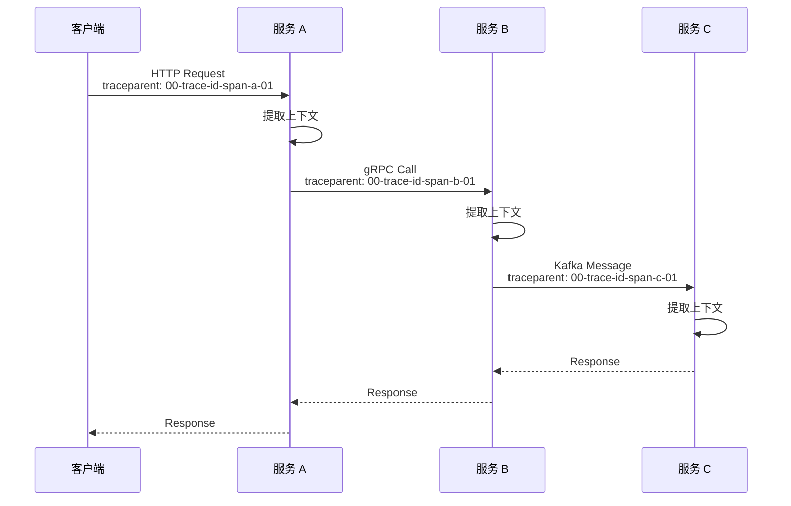
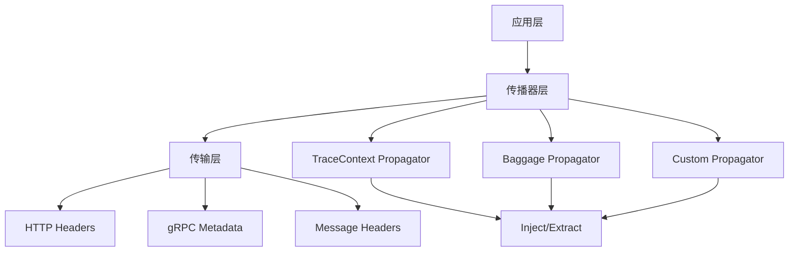
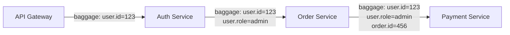

# Context 传播机制

> **文档版本**: v2.0  
> **最后更新**: 2025-10-05  
> **关联文档**: [02-OTLP 协议规范](./02-otlp-protocol-specification.md), [05-微服务集成](./05-microservices-integration.md)

---

## 目录

- [Context 传播机制](#context-传播机制)
  - [目录](#目录)
  - [1. 概述](#1-概述)
    - [1.1 核心概念](#11-核心概念)
    - [1.2 传播机制架构](#12-传播机制架构)
    - [1.3 重要性](#13-重要性)
  - [2. W3C Trace Context](#2-w3c-trace-context)
    - [2.1 协议详解](#21-协议详解)
    - [2.2 Header 格式](#22-header-格式)
    - [2.3 完整实现](#23-完整实现)
    - [2.4 版本兼容性](#24-版本兼容性)
  - [3. W3C Baggage](#3-w3c-baggage)
    - [3.1 Baggage 概念](#31-baggage-概念)
    - [3.2 使用场景](#32-使用场景)
    - [3.3 代码示例](#33-代码示例)
    - [3.4 最佳实践](#34-最佳实践)
  - [4. HTTP 传播](#4-http-传播)
    - [4.1 客户端集成](#41-客户端集成)
    - [4.2 服务端集成](#42-服务端集成)
    - [4.3 中间件实现](#43-中间件实现)
  - [5. gRPC 传播](#5-grpc-传播)
    - [5.1 客户端拦截器](#51-客户端拦截器)
    - [5.2 服务端拦截器](#52-服务端拦截器)
    - [5.3 元数据传播](#53-元数据传播)
  - [6. 消息队列传播](#6-消息队列传播)
    - [6.1 Kafka 集成](#61-kafka-集成)
    - [6.2 RabbitMQ 集成](#62-rabbitmq-集成)
    - [6.3 异步追踪模式](#63-异步追踪模式)
  - [7. 自定义传播器](#7-自定义传播器)
    - [7.1 接口定义](#71-接口定义)
    - [7.2 实现示例](#72-实现示例)
    - [7.3 组合传播器](#73-组合传播器)
  - [8. 跨语言传播](#8-跨语言传播)
    - [8.1 与 Java 互操作](#81-与-java-互操作)
    - [8.2 与 Python 互操作](#82-与-python-互操作)
    - [8.3 与 Node.js 互操作](#83-与-nodejs-互操作)
  - [9. 安全考虑](#9-安全考虑)
    - [9.1 敏感信息过滤](#91-敏感信息过滤)
    - [9.2 大小限制](#92-大小限制)
    - [9.3 注入攻击防护](#93-注入攻击防护)
  - [10. 最佳实践](#10-最佳实践)
    - [10.1 命名规范](#101-命名规范)
    - [10.2 性能优化](#102-性能优化)
    - [10.3 错误处理](#103-错误处理)
  - [总结](#总结)

---

## 1. 概述

Context 传播是分布式追踪的核心机制，确保追踪上下文在服务间正确传递，实现端到端的请求链路追踪。

### 1.1 核心概念

**追踪上下文组成**:

| 组件 | 说明 | 示例 |
|------|------|------|
| **Trace ID** | 唯一标识一个完整请求 | `4bf92f3577b34da6a3ce929d0e0e4736` |
| **Span ID** | 唯一标识一个操作 | `00f067aa0ba902b7` |
| **Trace Flags** | 采样标志等 | `01` (sampled) |
| **Trace State** | 厂商特定信息 | `vendor1=value1` |
| **Baggage** | 跨服务传播的键值对 | `user.id=123` |

**传播流程**:



### 1.2 传播机制架构

**层次结构**:



### 1.3 重要性

**为什么需要 Context 传播**:

1. **端到端追踪**: 跨越多个服务的完整请求链路
2. **性能分析**: 识别瓶颈和慢操作
3. **故障排查**: 快速定位问题根因
4. **业务关联**: 通过 Baggage 传递业务上下文

---

## 2. W3C Trace Context

W3C Trace Context 是标准化的追踪上下文传播协议，确保不同厂商的追踪系统互操作。

### 2.1 协议详解

**核心规范**:

- **标准**: W3C Trace Context Level 1
- **RFC**: <https://www.w3.org/TR/trace-context/>
- **版本**: 00 (当前版本)

**设计目标**:

- 厂商中立
- 语言无关
- 向后兼容
- 性能优化

### 2.2 Header 格式

**traceparent Header**:

```text
格式: version-trace-id-parent-id-trace-flags
示例: 00-4bf92f3577b34da6a3ce929d0e0e4736-00f067aa0ba902b7-01

字段说明:
- version:      2 位十六进制 (00)
- trace-id:     32 位十六进制 (16 字节)
- parent-id:    16 位十六进制 (8 字节)
- trace-flags:  2 位十六进制 (1 字节)
```

**tracestate Header**:

```text
格式: vendor1=value1,vendor2=value2
示例: congo=t61rcWkgMzE,rojo=00f067aa0ba902b7

规则:
- 最多 32 个键值对
- 键: [a-z][a-z0-9_-]{0,255}
- 值: 不超过 256 个字符
- 总大小: 不超过 512 字节
```

**Trace Flags**:

```text
Bit 0 (sampled):
  - 0: 不采样
  - 1: 采样

Bit 1-7: 保留
```

### 2.3 完整实现

**基础配置**:

```go
package main

import (
    "go.opentelemetry.io/otel"
    "go.opentelemetry.io/otel/propagation"
)

func setupPropagation() {
    // 创建组合传播器
    propagator := propagation.NewCompositeTextMapPropagator(
        propagation.TraceContext{},  // W3C Trace Context
        propagation.Baggage{},       // W3C Baggage
    )
    
    // 设置全局传播器
    otel.SetTextMapPropagator(propagator)
}
```

**手动注入和提取**:

```go
package propagation

import (
    "context"
    "net/http"
    
    "go.opentelemetry.io/otel"
    "go.opentelemetry.io/otel/propagation"
)

// InjectHTTP 注入追踪上下文到 HTTP 请求
func InjectHTTP(ctx context.Context, req *http.Request) {
    propagator := otel.GetTextMapPropagator()
    propagator.Inject(ctx, propagation.HeaderCarrier(req.Header))
}

// ExtractHTTP 从 HTTP 请求提取追踪上下文
func ExtractHTTP(req *http.Request) context.Context {
    propagator := otel.GetTextMapPropagator()
    return propagator.Extract(req.Context(), propagation.HeaderCarrier(req.Header))
}

// 使用示例
func ExampleUsage() {
    // 客户端: 注入
    req, _ := http.NewRequestWithContext(ctx, "GET", url, nil)
    InjectHTTP(ctx, req)
    resp, _ := http.DefaultClient.Do(req)
    
    // 服务端: 提取
    http.HandleFunc("/api", func(w http.ResponseWriter, r *http.Request) {
        ctx := ExtractHTTP(r)
        
        // 使用提取的上下文创建 Span
        tracer := otel.Tracer("my-service")
        ctx, span := tracer.Start(ctx, "handle-request")
        defer span.End()
        
        // 业务逻辑
        handleRequest(ctx, w, r)
    })
}
```

**自定义 Carrier**:

```go
// MapCarrier 实现 TextMapCarrier 接口
type MapCarrier map[string]string

func (c MapCarrier) Get(key string) string {
    return c[key]
}

func (c MapCarrier) Set(key, value string) {
    c[key] = value
}

func (c MapCarrier) Keys() []string {
    keys := make([]string, 0, len(c))
    for k := range c {
        keys = append(keys, k)
    }
    return keys
}

// 使用
func ExampleCustomCarrier() {
    carrier := MapCarrier{}
    propagator := otel.GetTextMapPropagator()
    
    // 注入
    propagator.Inject(ctx, carrier)
    
    // 提取
    newCtx := propagator.Extract(context.Background(), carrier)
}
```

### 2.4 版本兼容性

**处理不同版本**:

```go
type VersionAwarePropagator struct {
    v00 propagation.TraceContext
    // 未来版本...
}

func (p *VersionAwarePropagator) Extract(ctx context.Context, carrier propagation.TextMapCarrier) context.Context {
    traceparent := carrier.Get("traceparent")
    if traceparent == "" {
        return ctx
    }
    
    // 检查版本
    version := traceparent[:2]
    switch version {
    case "00":
        return p.v00.Extract(ctx, carrier)
    default:
        // 未知版本，尝试使用 v00 解析
        return p.v00.Extract(ctx, carrier)
    }
}
```

---

## 3. W3C Baggage

Baggage 允许在服务间传播业务上下文信息。

### 3.1 Baggage 概念

**定义**: Baggage 是一组键值对，随追踪上下文一起传播。

**特点**:

- 跨服务传播
- 不影响采样决策
- 有大小限制
- 可包含元数据

**Header 格式**:

```text
baggage: key1=value1,key2=value2;metadata1=value1

示例:
baggage: user.id=123,session.id=abc;priority=high
```

### 3.2 使用场景

**典型场景**:

1. **用户标识**: 传播用户 ID、租户 ID
2. **会话信息**: 传播会话 ID、请求 ID
3. **功能开关**: 传播特性标志
4. **路由信息**: 传播路由策略
5. **优先级**: 传播请求优先级

**示例场景**:



### 3.3 代码示例

**创建和读取 Baggage**:

```go
package main

import (
    "context"
    "fmt"
    
    "go.opentelemetry.io/otel/baggage"
)

func ExampleBaggage() {
    ctx := context.Background()
    
    // 方法 1: 从字符串解析
    bag, err := baggage.Parse("user.id=123,session.id=abc")
    if err != nil {
        panic(err)
    }
    ctx = baggage.ContextWithBaggage(ctx, bag)
    
    // 方法 2: 使用 Builder
    member1, _ := baggage.NewMember("user.id", "123")
    member2, _ := baggage.NewMember("session.id", "abc")
    bag, _ = baggage.New(member1, member2)
    ctx = baggage.ContextWithBaggage(ctx, bag)
    
    // 读取 Baggage
    bag = baggage.FromContext(ctx)
    userID := bag.Member("user.id").Value()
    fmt.Println("User ID:", userID)
    
    // 遍历所有成员
    for _, member := range bag.Members() {
        fmt.Printf("%s = %s\n", member.Key(), member.Value())
    }
}
```

**添加元数据**:

```go
func ExampleBaggageWithMetadata() {
    // 创建带元数据的成员
    props, _ := baggage.NewMemberRaw(
        "user.id",
        "123",
        "priority=high;ttl=60",
    )
    
    bag, _ := baggage.New(props)
    ctx := baggage.ContextWithBaggage(context.Background(), bag)
    
    // 读取元数据
    member := baggage.FromContext(ctx).Member("user.id")
    fmt.Println("Value:", member.Value())
    fmt.Println("Properties:", member.Properties())
}
```

**动态修改 Baggage**:

```go
func AddBaggageItem(ctx context.Context, key, value string) context.Context {
    bag := baggage.FromContext(ctx)
    
    // 创建新成员
    member, err := baggage.NewMember(key, value)
    if err != nil {
        return ctx
    }
    
    // 合并到现有 Baggage
    newBag, err := bag.SetMember(member)
    if err != nil {
        return ctx
    }
    
    return baggage.ContextWithBaggage(ctx, newBag)
}

func RemoveBaggageItem(ctx context.Context, key string) context.Context {
    bag := baggage.FromContext(ctx)
    newBag := bag.DeleteMember(key)
    return baggage.ContextWithBaggage(ctx, newBag)
}
```

### 3.4 最佳实践

**命名规范**:

```go
// ✅ 推荐: 使用点分隔的命名空间
"user.id"
"session.id"
"feature.flag.new_ui"
"tenant.id"

// ❌ 避免: 无命名空间
"userid"
"sessionid"
```

**大小控制**:

```go
type BaggageValidator struct {
    maxSize       int // 最大总大小
    maxMembers    int // 最大成员数
    maxMemberSize int // 单个成员最大大小
}

func (v *BaggageValidator) Validate(bag baggage.Baggage) error {
    members := bag.Members()
    
    if len(members) > v.maxMembers {
        return fmt.Errorf("too many baggage members: %d > %d", len(members), v.maxMembers)
    }
    
    totalSize := 0
    for _, member := range members {
        size := len(member.Key()) + len(member.Value())
        if size > v.maxMemberSize {
            return fmt.Errorf("baggage member too large: %s (%d bytes)", member.Key(), size)
        }
        totalSize += size
    }
    
    if totalSize > v.maxSize {
        return fmt.Errorf("baggage too large: %d > %d", totalSize, v.maxSize)
    }
    
    return nil
}
```

---

## 4. HTTP 传播

HTTP 是最常见的传播场景。

### 4.1 客户端集成

**使用 otelhttp**:

```go
package main

import (
    "net/http"
    
    "go.opentelemetry.io/contrib/instrumentation/net/http/otelhttp"
)

func NewHTTPClient() *http.Client {
    return &http.Client{
        Transport: otelhttp.NewTransport(
            http.DefaultTransport,
            otelhttp.WithSpanNameFormatter(func(operation string, r *http.Request) string {
                return fmt.Sprintf("%s %s", r.Method, r.URL.Path)
            }),
        ),
    }
}

// 使用
func MakeRequest(ctx context.Context) {
    client := NewHTTPClient()
    
    req, _ := http.NewRequestWithContext(ctx, "GET", "http://api.example.com/users", nil)
    resp, err := client.Do(req)
    if err != nil {
        // 处理错误
    }
    defer resp.Body.Close()
}
```

**手动实现**:

```go
func ManualHTTPClient(ctx context.Context, url string) (*http.Response, error) {
    tracer := otel.Tracer("http-client")
    ctx, span := tracer.Start(ctx, "HTTP GET")
    defer span.End()
    
    req, err := http.NewRequestWithContext(ctx, "GET", url, nil)
    if err != nil {
        return nil, err
    }
    
    // 注入追踪上下文
    otel.GetTextMapPropagator().Inject(ctx, propagation.HeaderCarrier(req.Header))
    
    // 添加属性
    span.SetAttributes(
        semconv.HTTPMethodKey.String("GET"),
        semconv.HTTPURLKey.String(url),
    )
    
    resp, err := http.DefaultClient.Do(req)
    if err != nil {
        span.RecordError(err)
        return nil, err
    }
    
    span.SetAttributes(
        semconv.HTTPStatusCodeKey.Int(resp.StatusCode),
    )
    
    return resp, nil
}
```

### 4.2 服务端集成

**使用 otelhttp Handler**:

```go
func SetupHTTPServer() {
    mux := http.NewServeMux()
    
    mux.HandleFunc("/users", handleUsers)
    mux.HandleFunc("/orders", handleOrders)
    
    // 包装 Handler
    handler := otelhttp.NewHandler(
        mux,
        "my-service",
        otelhttp.WithMessageEvents(otelhttp.ReadEvents, otelhttp.WriteEvents),
    )
    
    http.ListenAndServe(":8080", handler)
}
```

### 4.3 中间件实现

**自定义中间件**:

```go
func TracingMiddleware(next http.Handler) http.Handler {
    return http.HandlerFunc(func(w http.ResponseWriter, r *http.Request) {
        // 提取上下文
        ctx := otel.GetTextMapPropagator().Extract(
            r.Context(),
            propagation.HeaderCarrier(r.Header),
        )
        
        // 创建 Span
        tracer := otel.Tracer("http-server")
        ctx, span := tracer.Start(ctx, r.URL.Path)
        defer span.End()
        
        // 记录请求信息
        span.SetAttributes(
            semconv.HTTPMethodKey.String(r.Method),
            semconv.HTTPURLKey.String(r.URL.String()),
            semconv.HTTPTargetKey.String(r.URL.Path),
        )
        
        // 包装 ResponseWriter 以捕获状态码
        rw := &responseWriter{ResponseWriter: w, statusCode: 200}
        
        // 调用下一个处理器
        next.ServeHTTP(rw, r.WithContext(ctx))
        
        // 记录响应信息
        span.SetAttributes(
            semconv.HTTPStatusCodeKey.Int(rw.statusCode),
        )
    })
}

type responseWriter struct {
    http.ResponseWriter
    statusCode int
}

func (rw *responseWriter) WriteHeader(code int) {
    rw.statusCode = code
    rw.ResponseWriter.WriteHeader(code)
}
```

---

## 5. gRPC 传播

gRPC 使用元数据 (Metadata) 传播追踪上下文。

### 5.1 客户端拦截器

**使用 otelgrpc**:

```go
import (
    "google.golang.org/grpc"
    "go.opentelemetry.io/contrib/instrumentation/google.golang.org/grpc/otelgrpc"
)

func NewGRPCClient(target string) (*grpc.ClientConn, error) {
    return grpc.Dial(
        target,
        grpc.WithUnaryInterceptor(otelgrpc.UnaryClientInterceptor()),
        grpc.WithStreamInterceptor(otelgrpc.StreamClientInterceptor()),
    )
}
```

### 5.2 服务端拦截器

```go
func NewGRPCServer() *grpc.Server {
    return grpc.NewServer(
        grpc.UnaryInterceptor(otelgrpc.UnaryServerInterceptor()),
        grpc.StreamInterceptor(otelgrpc.StreamServerInterceptor()),
    )
}
```

### 5.3 元数据传播

**手动传播**:

```go
import (
    "google.golang.org/grpc/metadata"
)

// 客户端: 注入
func InjectGRPCMetadata(ctx context.Context) context.Context {
    md := metadata.MD{}
    otel.GetTextMapPropagator().Inject(ctx, &metadataCarrier{md: &md})
    return metadata.NewOutgoingContext(ctx, md)
}

// 服务端: 提取
func ExtractGRPCMetadata(ctx context.Context) context.Context {
    md, ok := metadata.FromIncomingContext(ctx)
    if !ok {
        return ctx
    }
    return otel.GetTextMapPropagator().Extract(ctx, &metadataCarrier{md: &md})
}

// Metadata Carrier 实现
type metadataCarrier struct {
    md *metadata.MD
}

func (c *metadataCarrier) Get(key string) string {
    values := (*c.md).Get(key)
    if len(values) == 0 {
        return ""
    }
    return values[0]
}

func (c *metadataCarrier) Set(key, value string) {
    (*c.md).Set(key, value)
}

func (c *metadataCarrier) Keys() []string {
    keys := make([]string, 0, len(*c.md))
    for k := range *c.md {
        keys = append(keys, k)
    }
    return keys
}
```

---

## 6. 消息队列传播

异步消息系统的追踪上下文传播。

### 6.1 Kafka 集成

**生产者**:

```go
package kafka

import (
    "github.com/segmentio/kafka-go"
    "go.opentelemetry.io/otel"
    "go.opentelemetry.io/otel/propagation"
)

func ProduceMessage(ctx context.Context, topic, key, value string) error {
    tracer := otel.Tracer("kafka-producer")
    ctx, span := tracer.Start(ctx, "kafka.produce")
    defer span.End()
    
    // 创建消息
    msg := kafka.Message{
        Topic: topic,
        Key:   []byte(key),
        Value: []byte(value),
        Headers: []kafka.Header{},
    }
    
    // 注入追踪上下文到消息头
    carrier := &kafkaHeaderCarrier{headers: &msg.Headers}
    otel.GetTextMapPropagator().Inject(ctx, carrier)
    
    // 发送消息
    writer := kafka.NewWriter(kafka.WriterConfig{
        Brokers: []string{"localhost:9092"},
        Topic:   topic,
    })
    defer writer.Close()
    
    return writer.WriteMessages(ctx, msg)
}

// Kafka Header Carrier
type kafkaHeaderCarrier struct {
    headers *[]kafka.Header
}

func (c *kafkaHeaderCarrier) Get(key string) string {
    for _, h := range *c.headers {
        if h.Key == key {
            return string(h.Value)
        }
    }
    return ""
}

func (c *kafkaHeaderCarrier) Set(key, value string) {
    // 更新或添加 header
    for i, h := range *c.headers {
        if h.Key == key {
            (*c.headers)[i].Value = []byte(value)
            return
        }
    }
    *c.headers = append(*c.headers, kafka.Header{
        Key:   key,
        Value: []byte(value),
    })
}

func (c *kafkaHeaderCarrier) Keys() []string {
    keys := make([]string, len(*c.headers))
    for i, h := range *c.headers {
        keys[i] = h.Key
    }
    return keys
}
```

**消费者**:

```go
func ConsumeMessages(ctx context.Context, topic string) {
    reader := kafka.NewReader(kafka.ReaderConfig{
        Brokers: []string{"localhost:9092"},
        Topic:   topic,
        GroupID: "my-group",
    })
    defer reader.Close()
    
    for {
        msg, err := reader.ReadMessage(ctx)
        if err != nil {
            break
        }
        
        // 提取追踪上下文
        carrier := &kafkaHeaderCarrier{headers: &msg.Headers}
        msgCtx := otel.GetTextMapPropagator().Extract(ctx, carrier)
        
        // 处理消息
        processMessage(msgCtx, msg)
    }
}

func processMessage(ctx context.Context, msg kafka.Message) {
    tracer := otel.Tracer("kafka-consumer")
    ctx, span := tracer.Start(ctx, "kafka.consume")
    defer span.End()
    
    span.SetAttributes(
        attribute.String("messaging.system", "kafka"),
        attribute.String("messaging.destination", msg.Topic),
        attribute.Int("messaging.partition", msg.Partition),
        attribute.Int64("messaging.offset", msg.Offset),
    )
    
    // 业务逻辑
    handleMessage(ctx, msg)
}
```

### 6.2 RabbitMQ 集成

**发布消息**:

```go
import (
    "github.com/streadway/amqp"
)

func PublishMessage(ctx context.Context, exchange, routingKey string, body []byte) error {
    tracer := otel.Tracer("rabbitmq-publisher")
    ctx, span := tracer.Start(ctx, "rabbitmq.publish")
    defer span.End()
    
    // 创建消息
    msg := amqp.Publishing{
        ContentType: "application/json",
        Body:        body,
        Headers:     amqp.Table{},
    }
    
    // 注入追踪上下文
    carrier := &amqpHeaderCarrier{headers: &msg.Headers}
    otel.GetTextMapPropagator().Inject(ctx, carrier)
    
    // 发布消息
    return channel.Publish(exchange, routingKey, false, false, msg)
}

// AMQP Header Carrier
type amqpHeaderCarrier struct {
    headers *amqp.Table
}

func (c *amqpHeaderCarrier) Get(key string) string {
    if val, ok := (*c.headers)[key]; ok {
        if str, ok := val.(string); ok {
            return str
        }
    }
    return ""
}

func (c *amqpHeaderCarrier) Set(key, value string) {
    (*c.headers)[key] = value
}

func (c *amqpHeaderCarrier) Keys() []string {
    keys := make([]string, 0, len(*c.headers))
    for k := range *c.headers {
        keys = append(keys, k)
    }
    return keys
}
```

### 6.3 异步追踪模式

**Span Link 模式**:

```go
func ProcessAsyncMessage(ctx context.Context, msg Message) {
    // 提取原始追踪上下文
    carrier := &messageCarrier{msg: msg}
    parentCtx := otel.GetTextMapPropagator().Extract(context.Background(), carrier)
    
    // 获取父 Span 上下文
    parentSpanContext := trace.SpanContextFromContext(parentCtx)
    
    // 创建新 Span，使用 Link 关联
    tracer := otel.Tracer("async-processor")
    ctx, span := tracer.Start(
        ctx,
        "process-async-message",
        trace.WithLinks(trace.Link{
            SpanContext: parentSpanContext,
        }),
    )
    defer span.End()
    
    // 处理消息
    processMessageLogic(ctx, msg)
}
```

---

## 7. 自定义传播器

实现自定义传播器以支持特殊场景。

### 7.1 接口定义

```go
type TextMapPropagator interface {
    // Inject 注入追踪上下文到 carrier
    Inject(ctx context.Context, carrier TextMapCarrier)
    
    // Extract 从 carrier 提取追踪上下文
    Extract(ctx context.Context, carrier TextMapCarrier) context.Context
    
    // Fields 返回传播器使用的字段名
    Fields() []string
}
```

### 7.2 实现示例

**自定义传播器**:

```go
package custom

import (
    "context"
    "fmt"
    "strings"
    
    "go.opentelemetry.io/otel/propagation"
    "go.opentelemetry.io/otel/trace"
)

// CustomPropagator 自定义传播器
type CustomPropagator struct{}

func (p CustomPropagator) Inject(ctx context.Context, carrier propagation.TextMapCarrier) {
    sc := trace.SpanContextFromContext(ctx)
    if !sc.IsValid() {
        return
    }
    
    // 自定义格式: custom-trace-id:custom-span-id:flags
    value := fmt.Sprintf("%s:%s:%02x",
        sc.TraceID().String(),
        sc.SpanID().String(),
        sc.TraceFlags(),
    )
    
    carrier.Set("x-custom-trace", value)
}

func (p CustomPropagator) Extract(ctx context.Context, carrier propagation.TextMapCarrier) context.Context {
    value := carrier.Get("x-custom-trace")
    if value == "" {
        return ctx
    }
    
    // 解析自定义格式
    parts := strings.Split(value, ":")
    if len(parts) != 3 {
        return ctx
    }
    
    traceID, err := trace.TraceIDFromHex(parts[0])
    if err != nil {
        return ctx
    }
    
    spanID, err := trace.SpanIDFromHex(parts[1])
    if err != nil {
        return ctx
    }
    
    var flags trace.TraceFlags
    fmt.Sscanf(parts[2], "%02x", &flags)
    
    sc := trace.NewSpanContext(trace.SpanContextConfig{
        TraceID:    traceID,
        SpanID:     spanID,
        TraceFlags: flags,
        Remote:     true,
    })
    
    return trace.ContextWithRemoteSpanContext(ctx, sc)
}

func (p CustomPropagator) Fields() []string {
    return []string{"x-custom-trace"}
}
```

### 7.3 组合传播器

**多传播器组合**:

```go
func SetupMultiplePropagators() {
    propagator := propagation.NewCompositeTextMapPropagator(
        propagation.TraceContext{},      // W3C Trace Context
        propagation.Baggage{},           // W3C Baggage
        CustomPropagator{},              // 自定义传播器
        jaeger.Jaeger{},                 // Jaeger 格式
        b3.New(b3.WithInjectEncoding(b3.B3MultipleHeader)), // B3 格式
    )
    
    otel.SetTextMapPropagator(propagator)
}
```

---

## 8. 跨语言传播

确保不同语言的服务间正确传播追踪上下文。

### 8.1 与 Java 互操作

**Golang → Java**:

```go
// Golang 服务使用标准 W3C Trace Context
propagator := propagation.TraceContext{}
otel.SetTextMapPropagator(propagator)

// Java 服务自动识别
// OpenTelemetry Java SDK 默认支持 W3C Trace Context
```

### 8.2 与 Python 互操作

**Golang → Python**:

```go
// Golang 配置
otel.SetTextMapPropagator(propagation.TraceContext{})

// Python 配置
// from opentelemetry.propagate import set_global_textmap
// from opentelemetry.propagators.composite import CompositePropagator
// from opentelemetry.trace.propagation.tracecontext import TraceContextTextMapPropagator
// 
// set_global_textmap(CompositePropagator([TraceContextTextMapPropagator()]))
```

### 8.3 与 Node.js 互操作

**完整示例**:

```go
// Golang 服务
func CallNodeService(ctx context.Context) {
    client := &http.Client{
        Transport: otelhttp.NewTransport(http.DefaultTransport),
    }
    
    req, _ := http.NewRequestWithContext(ctx, "GET", "http://node-service:3000/api", nil)
    resp, _ := client.Do(req)
    defer resp.Body.Close()
}

// Node.js 服务会自动提取 traceparent header
// const { context, trace } = require('@opentelemetry/api');
// const { W3CTraceContextPropagator } = require('@opentelemetry/core');
```

---

## 9. 安全考虑

### 9.1 敏感信息过滤

**过滤敏感 Baggage**:

```go
type SecureBaggagePropagator struct {
    delegate     propagation.TextMapPropagator
    blockedKeys  map[string]bool
}

func NewSecureBaggagePropagator(blockedKeys []string) *SecureBaggagePropagator {
    blocked := make(map[string]bool)
    for _, key := range blockedKeys {
        blocked[key] = true
    }
    
    return &SecureBaggagePropagator{
        delegate:    propagation.Baggage{},
        blockedKeys: blocked,
    }
}

func (p *SecureBaggagePropagator) Inject(ctx context.Context, carrier propagation.TextMapCarrier) {
    bag := baggage.FromContext(ctx)
    
    // 过滤敏感键
    filteredMembers := []baggage.Member{}
    for _, member := range bag.Members() {
        if !p.blockedKeys[member.Key()] {
            filteredMembers = append(filteredMembers, member)
        }
    }
    
    if len(filteredMembers) > 0 {
        filteredBag, _ := baggage.New(filteredMembers...)
        ctx = baggage.ContextWithBaggage(ctx, filteredBag)
    }
    
    p.delegate.Inject(ctx, carrier)
}
```

### 9.2 大小限制

**限制 Baggage 大小**:

```go
const (
    MaxBaggageSize    = 8192  // 8KB
    MaxBaggageMembers = 32
    MaxMemberSize     = 4096  // 4KB
)

func ValidateBaggage(bag baggage.Baggage) error {
    members := bag.Members()
    
    if len(members) > MaxBaggageMembers {
        return fmt.Errorf("too many baggage members: %d", len(members))
    }
    
    totalSize := 0
    for _, member := range members {
        size := len(member.Key()) + len(member.Value())
        if size > MaxMemberSize {
            return fmt.Errorf("member too large: %s (%d bytes)", member.Key(), size)
        }
        totalSize += size
    }
    
    if totalSize > MaxBaggageSize {
        return fmt.Errorf("baggage too large: %d bytes", totalSize)
    }
    
    return nil
}
```

### 9.3 注入攻击防护

**验证 Header 值**:

```go
import "regexp"

var (
    traceIDPattern = regexp.MustCompile(`^[0-9a-f]{32}$`)
    spanIDPattern  = regexp.MustCompile(`^[0-9a-f]{16}$`)
)

func ValidateTraceparent(value string) error {
    parts := strings.Split(value, "-")
    if len(parts) != 4 {
        return fmt.Errorf("invalid traceparent format")
    }
    
    // 验证版本
    if parts[0] != "00" {
        return fmt.Errorf("unsupported version: %s", parts[0])
    }
    
    // 验证 Trace ID
    if !traceIDPattern.MatchString(parts[1]) {
        return fmt.Errorf("invalid trace ID")
    }
    
    // 验证 Span ID
    if !spanIDPattern.MatchString(parts[2]) {
        return fmt.Errorf("invalid span ID")
    }
    
    return nil
}
```

---

## 10. 最佳实践

### 10.1 命名规范

**Baggage 键命名**:

```go
// ✅ 推荐
const (
    BaggageKeyUserID     = "user.id"
    BaggageKeyTenantID   = "tenant.id"
    BaggageKeySessionID  = "session.id"
    BaggageKeyRequestID  = "request.id"
)

// ❌ 避免
const (
    UserID    = "userid"
    TenantID  = "tid"
)
```

### 10.2 性能优化

**最小化 Baggage**:

```go
// ❌ 避免: 传递大量数据
bag, _ := baggage.Parse("user.profile=" + largeJSONString)

// ✅ 推荐: 只传递标识符
bag, _ := baggage.Parse("user.id=123")
```

**缓存传播器**:

```go
var (
    globalPropagator propagation.TextMapPropagator
    once             sync.Once
)

func GetPropagator() propagation.TextMapPropagator {
    once.Do(func() {
        globalPropagator = propagation.NewCompositeTextMapPropagator(
            propagation.TraceContext{},
            propagation.Baggage{},
        )
    })
    return globalPropagator
}
```

### 10.3 错误处理

**优雅降级**:

```go
func SafeExtract(ctx context.Context, carrier propagation.TextMapCarrier) context.Context {
    defer func() {
        if r := recover(); r != nil {
            log.Printf("Failed to extract context: %v", r)
        }
    }()
    
    propagator := otel.GetTextMapPropagator()
    return propagator.Extract(ctx, carrier)
}

func SafeInject(ctx context.Context, carrier propagation.TextMapCarrier) {
    defer func() {
        if r := recover(); r != nil {
            log.Printf("Failed to inject context: %v", r)
        }
    }()
    
    propagator := otel.GetTextMapPropagator()
    propagator.Inject(ctx, carrier)
}
```

---

## 总结

Context 传播是分布式追踪的基础，关键要点：

1. **标准化**: 使用 W3C Trace Context 确保互操作性
2. **Baggage**: 合理使用，控制大小
3. **安全**: 过滤敏感信息，验证输入
4. **性能**: 最小化传播数据，缓存传播器
5. **错误处理**: 优雅降级，避免影响业务

**核心技术**:

- ✅ W3C Trace Context: 标准化传播
- ✅ Baggage: 业务上下文传播
- ✅ HTTP/gRPC/MQ: 多协议支持
- ✅ 自定义传播器: 灵活扩展
- ✅ 跨语言: 无缝互操作

---

**文档状态**: ✅ 完整内容  
**最后更新**: 2025-10-05  
**维护者**: OTLP_go Team
