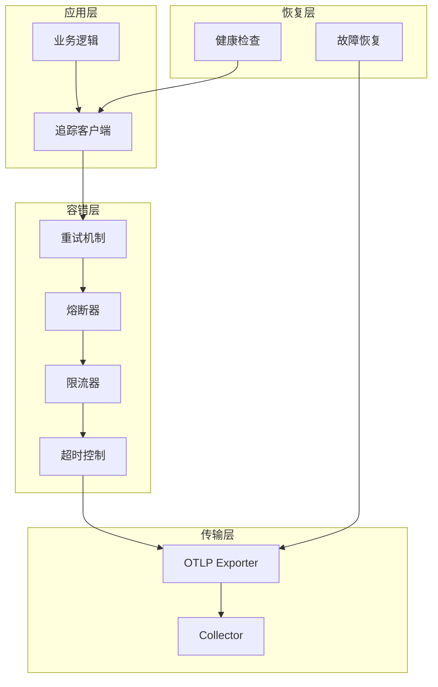
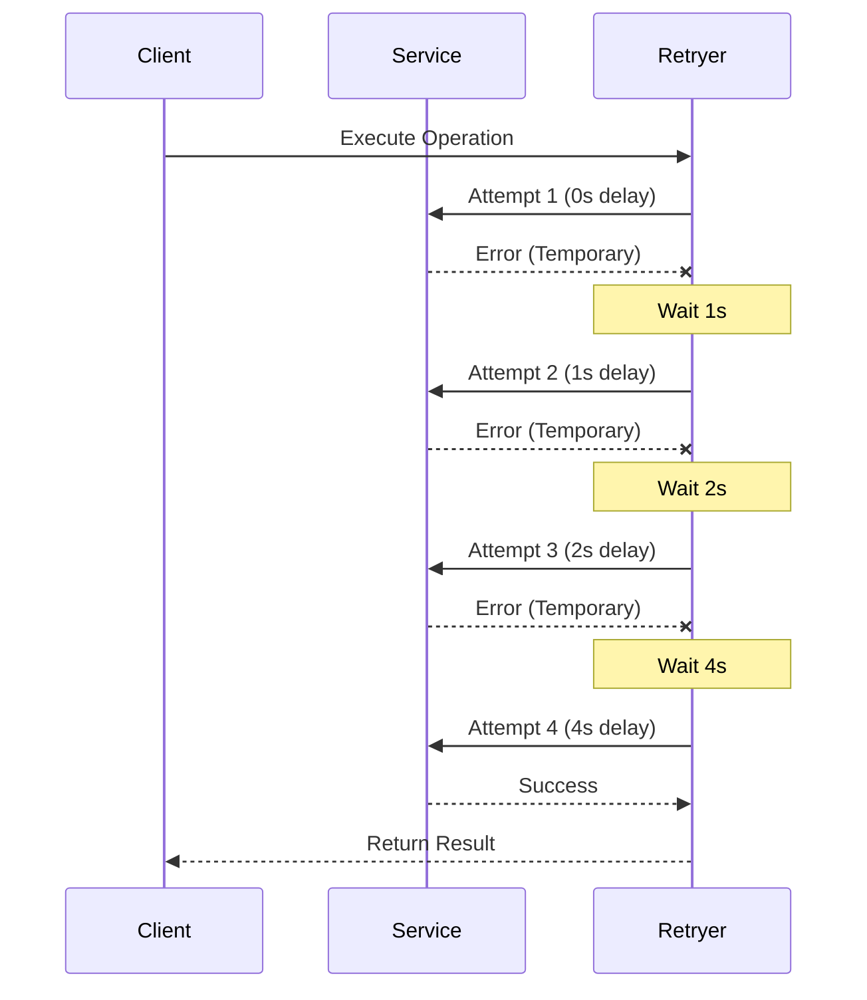
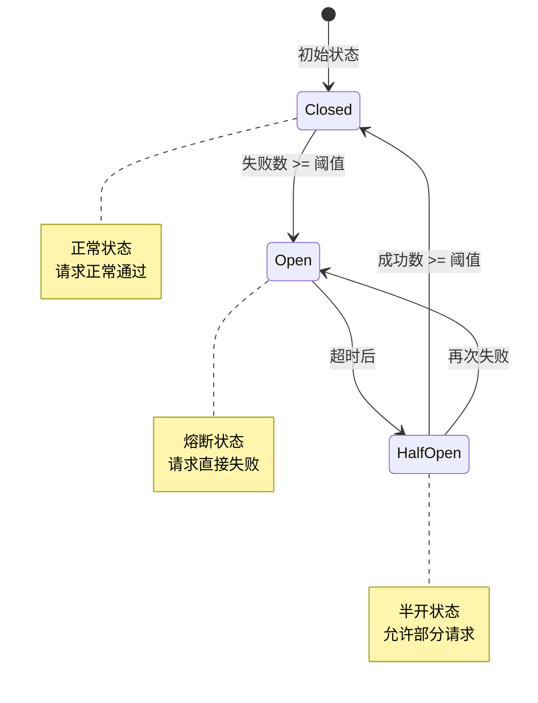
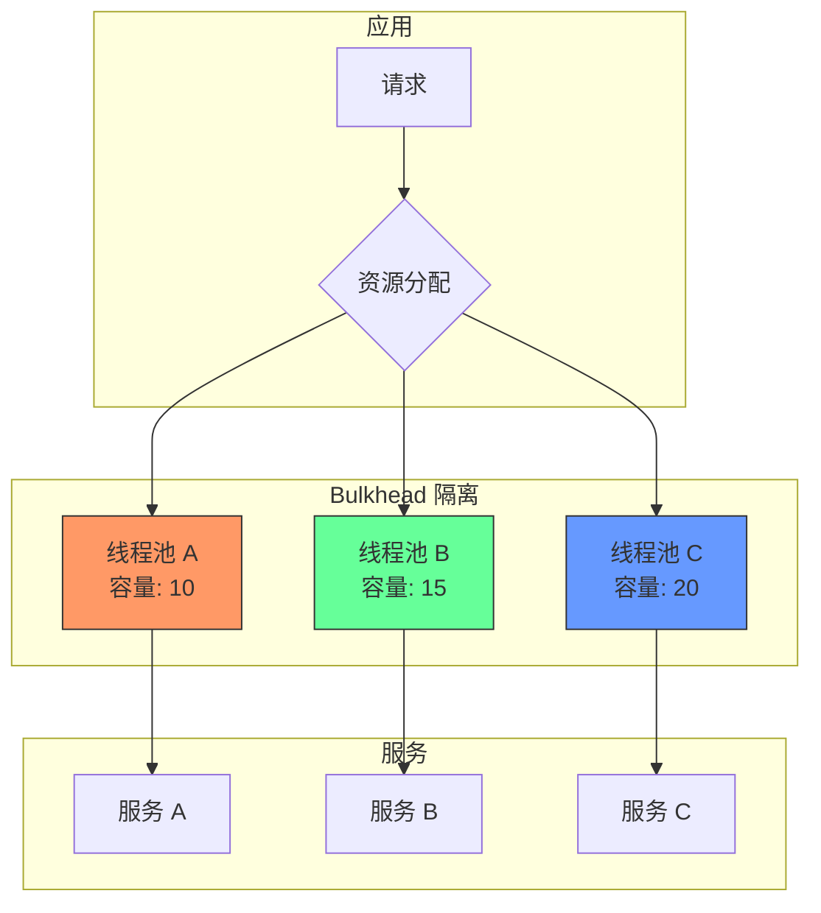
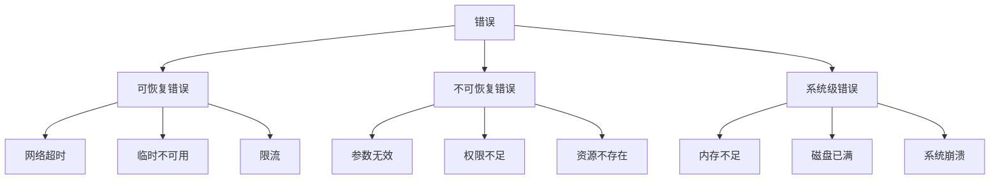
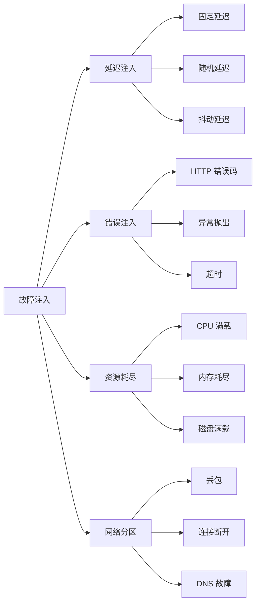

# 容错与弹性 (Fault Tolerance & Resilience)

> **文档版本**: v2.0
> **最后更新**: 2025-10-17
> **关联文档**: [04-分布式追踪架构](./04-distributed-tracing-architecture.md), [19-生产最佳实践](./19-production-best-practices-2025.md)

---

## 目录

- [容错与弹性 (Fault Tolerance \& Resilience)](#容错与弹性-fault-tolerance--resilience)
  - [目录](#目录)
  - [1. 概述](#1-概述)
    - [1.1 设计原则](#11-设计原则)
    - [1.2 容错架构](#12-容错架构)
    - [1.3 容错指标](#13-容错指标)
  - [2. 容错模式 (Fault Tolerance Patterns)](#2-容错模式-fault-tolerance-patterns)
    - [2.1 重试策略 (Retry Strategies)](#21-重试策略-retry-strategies)
      - [2.1.1 指数退避算法](#211-指数退避算法)
      - [2.1.2 智能重试策略](#212-智能重试策略)
    - [2.2 熔断器实现 (3-State Circuit Breaker)](#22-熔断器实现-3-state-circuit-breaker)
      - [2.2.1 三状态状态机](#221-三状态状态机)
      - [2.2.2 完整实现](#222-完整实现)
    - [2.3 降级策略 (Degradation Strategies)](#23-降级策略-degradation-strategies)
    - [2.4 超时控制与传播 (Timeout Control)](#24-超时控制与传播-timeout-control)
  - [3. 弹性设计 (Resilience Design)](#3-弹性设计-resilience-design)
    - [3.1 限流器实现 (Rate Limiter)](#31-限流器实现-rate-limiter)
      - [3.1.1 令牌桶算法](#311-令牌桶算法)
      - [3.1.2 漏桶算法](#312-漏桶算法)
    - [3.2 隔离机制 (Bulkhead Pattern)](#32-隔离机制-bulkhead-pattern)
    - [3.3 资源配额 (Resource Quotas)](#33-资源配额-resource-quotas)
    - [3.4 背压处理 (Backpressure Handling)](#34-背压处理-backpressure-handling)
  - [4. 错误处理 (Error Handling)](#4-错误处理-error-handling)
    - [4.1 错误分类与分级](#41-错误分类与分级)
    - [4.2 分布式系统错误传播](#42-分布式系统错误传播)
    - [4.3 错误恢复策略](#43-错误恢复策略)
    - [4.4 死信队列 (Dead Letter Queues)](#44-死信队列-dead-letter-queues)
  - [5. 健康检查 (Health Checks)](#5-健康检查-health-checks)
    - [5.1 存活探针 (Liveness Probes)](#51-存活探针-liveness-probes)
    - [5.2 就绪探针 (Readiness Probes)](#52-就绪探针-readiness-probes)
    - [5.3 启动探针 (Startup Probes)](#53-启动探针-startup-probes)
    - [5.4 自愈机制 (Self-Healing)](#54-自愈机制-self-healing)
    - [健康状态定义](#健康状态定义)
  - [6. 混沌工程 (Chaos Engineering)](#6-混沌工程-chaos-engineering)
    - [6.1 故障注入技术](#61-故障注入技术)
    - [6.2 混沌测试框架](#62-混沌测试框架)
    - [6.3 恢复验证](#63-恢复验证)
    - [6.4 游戏日 (Game Days)](#64-游戏日-game-days)
  - [7. 完整实现 (Complete Implementation)](#7-完整实现-complete-implementation)
    - [7.1 生产级弹性服务示例](#71-生产级弹性服务示例)
    - [7.2 OTLP 可观测性集成](#72-otlp-可观测性集成)
  - [8. 最佳实践总结](#8-最佳实践总结)
    - [8.1 设计原则](#81-设计原则)
    - [8.2 监控指标](#82-监控指标)
    - [8.3 配置建议](#83-配置建议)

---

## 1. 概述

容错与弹性设计确保系统在部分组件失败时仍能正常运行。在分布式追踪系统中，容错机制尤为重要，因为追踪数据的丢失不应影响业务逻辑的正常执行。

### 1.1 设计原则

**故障隔离 (Fault Isolation)**:

- 使用 Bulkhead 模式隔离不同服务
- 限制资源使用，防止级联故障
- 独立的线程池和连接池

**快速失败 (Fail Fast)**:

- 设置合理的超时时间
- 避免长时间阻塞
- 及时返回错误信息

**优雅降级 (Graceful Degradation)**:

- 降低采样率以减少负载
- 禁用非关键功能
- 返回缓存数据或默认值

**自动恢复 (Auto Recovery)**:

- 自动重试失败的操作
- 熔断器自动恢复
- 健康检查和自动重启

### 1.2 容错架构


```mermaid
graph TB
    subgraph "应用层"
        A[业务逻辑] --> B[追踪客户端]
    end

    subgraph "容错层"
        B --> C[重试机制]
        C --> D[熔断器]
        D --> E[限流器]
        E --> F[超时控制]
    end

    subgraph "传输层"
        F --> G[OTLP Exporter]
        G --> H[Collector]
    end

    subgraph "恢复层"
        I[健康检查] --> B
        J[故障恢复] --> G
    end
```

### 1.3 容错指标

| 指标 | 目标 | 说明 |
|------|------|------|
| 可用性 | 99.9% | 系统正常运行时间 |
| 错误率 | < 0.1% | 请求失败比例 |
| 恢复时间 | < 30s | 故障恢复时间 |
| 数据丢失率 | < 0.01% | 追踪数据丢失比例 |

---

## 2. 容错模式 (Fault Tolerance Patterns)

### 2.1 重试策略 (Retry Strategies)

重试机制是容错的第一道防线，通过自动重试临时性故障来提高系统可靠性。

#### 2.1.1 指数退避算法


```mermaid
sequenceDiagram
    participant C as Client
    participant S as Service
    participant R as Retryer

    C->>R: Execute Operation
    R->>S: Attempt 1 (0s delay)
    S--xR: Error (Temporary)
    Note over R: Wait 1s
    R->>S: Attempt 2 (1s delay)
    S--xR: Error (Temporary)
    Note over R: Wait 2s
    R->>S: Attempt 3 (2s delay)
    S--xR: Error (Temporary)
    Note over R: Wait 4s
    R->>S: Attempt 4 (4s delay)
    S-->>R: Success
    R-->>C: Return Result
```

**基础实现**:

```go
package resilience

import (
    "context"
    "errors"
    "fmt"
    "math/rand"
    "time"

    "go.opentelemetry.io/otel"
    "go.opentelemetry.io/otel/attribute"
    "go.opentelemetry.io/otel/codes"
    "go.opentelemetry.io/otel/trace"
)

// RetryConfig 重试配置
type RetryConfig struct {
    InitialInterval time.Duration // 初始重试间隔
    MaxInterval     time.Duration // 最大重试间隔
    MaxElapsedTime  time.Duration // 最大重试时间
    Multiplier      float64       // 退避倍数
    MaxRetries      int           // 最大重试次数
    Jitter          bool          // 是否添加抖动
    JitterFactor    float64       // 抖动因子 (0.0-1.0)
}

// DefaultRetryConfig 默认重试配置
func DefaultRetryConfig() RetryConfig {
    return RetryConfig{
        InitialInterval: 1 * time.Second,
        MaxInterval:     30 * time.Second,
        MaxElapsedTime:  5 * time.Minute,
        Multiplier:      2.0,
        MaxRetries:      10,
        Jitter:          true,
        JitterFactor:    0.2,
    }
}

// RetryableError 可重试错误接口
type RetryableError interface {
    error
    IsRetryable() bool
    RetryAfter() time.Duration
}

// Retryer 重试器
type Retryer struct {
    config RetryConfig
    tracer trace.Tracer
}

// NewRetryer 创建重试器
func NewRetryer(config RetryConfig) *Retryer {
    return &Retryer{
        config: config,
        tracer: otel.Tracer("retryer"),
    }
}

// Do 执行带重试的操作
func (r *Retryer) Do(ctx context.Context, fn func(context.Context) error) error {
    ctx, span := r.tracer.Start(ctx, "retry.operation")
    defer span.End()

    span.SetAttributes(
        attribute.Int("retry.max_retries", r.config.MaxRetries),
        attribute.String("retry.initial_interval", r.config.InitialInterval.String()),
        attribute.Bool("retry.jitter_enabled", r.config.Jitter),
    )

    interval := r.config.InitialInterval
    startTime := time.Now()
    var lastErr error

    for attempt := 0; attempt < r.config.MaxRetries; attempt++ {
        attemptCtx, attemptSpan := r.tracer.Start(ctx, fmt.Sprintf("retry.attempt.%d", attempt+1))
        attemptSpan.SetAttributes(
            attribute.Int("retry.attempt_number", attempt+1),
            attribute.String("retry.current_interval", interval.String()),
        )

        // 执行操作
        err := fn(attemptCtx)

        if err == nil {
            attemptSpan.SetStatus(codes.Ok, "success")
            attemptSpan.End()

            span.SetAttributes(
                attribute.Int("retry.attempts_used", attempt+1),
                attribute.Bool("retry.succeeded", true),
                attribute.String("retry.total_duration", time.Since(startTime).String()),
            )
            span.SetStatus(codes.Ok, "operation succeeded")
            return nil
        }

        lastErr = err

        // 检查是否可重试
        if retryableErr, ok := err.(RetryableError); ok && !retryableErr.IsRetryable() {
            attemptSpan.RecordError(err)
            attemptSpan.SetStatus(codes.Error, "non-retryable error")
            attemptSpan.End()

            span.RecordError(err)
            span.SetStatus(codes.Error, "non-retryable error")
            return err
        }

        // 检查是否超时
        elapsed := time.Since(startTime)
        if elapsed >= r.config.MaxElapsedTime {
            attemptSpan.RecordError(err)
            attemptSpan.SetStatus(codes.Error, "max elapsed time exceeded")
            attemptSpan.End()

            span.RecordError(err)
            span.SetStatus(codes.Error, "max elapsed time exceeded")
            return fmt.Errorf("retry timeout after %v: %w", elapsed, err)
        }

        // 记录错误并准备重试
        attemptSpan.RecordError(err)
        attemptSpan.SetAttributes(
            attribute.String("retry.next_interval", interval.String()),
        )
        attemptSpan.SetStatus(codes.Error, "attempt failed, will retry")
        attemptSpan.End()

        // 计算等待时间（含抖动）
        sleepDuration := r.calculateDelay(interval)

        select {
        case <-ctx.Done():
            span.RecordError(ctx.Err())
            span.SetStatus(codes.Error, "context cancelled")
            return ctx.Err()
        case <-time.After(sleepDuration):
            // 继续重试
        }

        // 计算下一次重试间隔
        interval = time.Duration(float64(interval) * r.config.Multiplier)
        if interval > r.config.MaxInterval {
            interval = r.config.MaxInterval
        }
    }

    // 达到最大重试次数
    span.SetAttributes(
        attribute.Int("retry.attempts_used", r.config.MaxRetries),
        attribute.Bool("retry.succeeded", false),
        attribute.String("retry.total_duration", time.Since(startTime).String()),
    )
    span.RecordError(lastErr)
    span.SetStatus(codes.Error, "max retries exceeded")
    return fmt.Errorf("max retries (%d) exceeded: %w", r.config.MaxRetries, lastErr)
}

// calculateDelay 计算延迟时间（含抖动）
func (r *Retryer) calculateDelay(interval time.Duration) time.Duration {
    if !r.config.Jitter {
        return interval
    }

    // 添加抖动 (±JitterFactor)
    jitter := time.Duration(float64(interval) * r.config.JitterFactor * (rand.Float64()*2 - 1))
    return interval + jitter
}
```

#### 2.1.2 智能重试策略

```go
// ErrorClassifier 错误分类器
type ErrorClassifier struct{}

// ErrorCategory 错误分类
type ErrorCategory int

const (
    ErrorCategoryRetryable    ErrorCategory = iota // 可重试
    ErrorCategoryNonRetryable                       // 不可重试
    ErrorCategoryThrottling                         // 限流
    ErrorCategoryNetwork                            // 网络错误
)

// Classify 分类错误
func (ec *ErrorClassifier) Classify(err error) ErrorCategory {
    if err == nil {
        return ErrorCategoryNonRetryable
    }

    // 上下文取消/超时
    if errors.Is(err, context.DeadlineExceeded) {
        return ErrorCategoryRetryable
    }
    if errors.Is(err, context.Canceled) {
        return ErrorCategoryNonRetryable
    }

    // 临时性错误
    if tempErr, ok := err.(interface{ Temporary() bool }); ok && tempErr.Temporary() {
        return ErrorCategoryRetryable
    }

    // 超时错误
    if timeoutErr, ok := err.(interface{ Timeout() bool }); ok && timeoutErr.Timeout() {
        return ErrorCategoryRetryable
    }

    return ErrorCategoryNonRetryable
}

// IsRetryable 判断错误是否可重试
func (ec *ErrorClassifier) IsRetryable(err error) bool {
    category := ec.Classify(err)
    return category == ErrorCategoryRetryable || category == ErrorCategoryThrottling
}
```

### 2.2 熔断器实现 (3-State Circuit Breaker)

熔断器模式通过监控服务调用失败率，在失败率超过阈值时自动"熔断"，避免级联故障。

#### 2.2.1 三状态状态机


```mermaid
stateDiagram-v2
    [*] --> Closed: 初始状态
    Closed --> Open: 失败数 >= 阈值
    Open --> HalfOpen: 超时后
    HalfOpen --> Closed: 成功数 >= 阈值
    HalfOpen --> Open: 再次失败

    note right of Closed
        正常状态
        请求正常通过
    end note

    note right of Open
        熔断状态
        请求直接失败
    end note

    note right of HalfOpen
        半开状态
        允许部分请求
    end note
```

#### 2.2.2 完整实现

```go
package resilience

import (
    "context"
    "errors"
    "sync"
    "sync/atomic"
    "time"

    "go.opentelemetry.io/otel"
    "go.opentelemetry.io/otel/attribute"
    "go.opentelemetry.io/otel/codes"
    "go.opentelemetry.io/otel/trace"
)

// CircuitState 熔断器状态
type CircuitState int32

const (
    StateClosed    CircuitState = iota // 关闭 - 正常
    StateOpen                          // 打开 - 熔断
    StateHalfOpen                      // 半开 - 测试
)

func (s CircuitState) String() string {
    switch s {
    case StateClosed:
        return "closed"
    case StateOpen:
        return "open"
    case StateHalfOpen:
        return "half-open"
    default:
        return "unknown"
    }
}

// CircuitBreakerConfig 熔断器配置
type CircuitBreakerConfig struct {
    MaxFailures        int           // 最大失败次数
    Timeout            time.Duration // 熔断持续时间
    HalfOpenMaxCalls   int           // 半开状态最大测试请求数
    SuccessThreshold   int           // 半开状态成功阈值
    FailureThreshold   float64       // 失败率阈值 (0.0-1.0)
    SlidingWindowSize  int           // 滑动窗口大小
}

// DefaultCircuitBreakerConfig 默认配置
func DefaultCircuitBreakerConfig() CircuitBreakerConfig {
    return CircuitBreakerConfig{
        MaxFailures:       5,
        Timeout:           30 * time.Second,
        HalfOpenMaxCalls:  3,
        SuccessThreshold:  2,
        FailureThreshold:  0.5,
        SlidingWindowSize: 10,
    }
}

// CircuitBreaker 熔断器
type CircuitBreaker struct {
    config CircuitBreakerConfig

    state        atomic.Int32
    failures     atomic.Int32
    successes    atomic.Int32
    halfOpenCalls atomic.Int32
    lastFailTime atomic.Value

    window     []bool      // 滑动窗口记录
    windowMu   sync.RWMutex
    windowIdx  int

    tracer     trace.Tracer
    mu         sync.RWMutex
}

// NewCircuitBreaker 创建熔断器
func NewCircuitBreaker(config CircuitBreakerConfig) *CircuitBreaker {
    cb := &CircuitBreaker{
        config: config,
        window: make([]bool, config.SlidingWindowSize),
        tracer: otel.Tracer("circuit-breaker"),
    }
    cb.state.Store(int32(StateClosed))
    return cb
}

// Call 执行操作
func (cb *CircuitBreaker) Call(ctx context.Context, fn func(context.Context) error) error {
    ctx, span := cb.tracer.Start(ctx, "circuit_breaker.call")
    defer span.End()

    state := cb.GetState()
    span.SetAttributes(
        attribute.String("circuit_breaker.state", state.String()),
        attribute.Int("circuit_breaker.max_failures", cb.config.MaxFailures),
    )

    // 检查熔断器状态
    if state == StateOpen {
        lastFail := cb.lastFailTime.Load().(time.Time)
        if time.Since(lastFail) > cb.config.Timeout {
            // 尝试进入半开状态
            if cb.tryHalfOpen() {
                span.AddEvent("circuit breaker entering half-open state")
                state = StateHalfOpen
            }
        } else {
            span.SetStatus(codes.Error, "circuit breaker is open")
            return errors.New("circuit breaker is open")
        }
    }

    if state == StateHalfOpen {
        calls := cb.halfOpenCalls.Add(1)
        if calls > int32(cb.config.HalfOpenMaxCalls) {
            cb.halfOpenCalls.Add(-1)
            span.SetStatus(codes.Error, "half-open max calls reached")
            return errors.New("circuit breaker half-open max calls reached")
        }
        defer cb.halfOpenCalls.Add(-1)
    }

    // 执行操作
    err := fn(ctx)

    if err != nil {
        cb.recordFailure()
        span.RecordError(err)
        span.SetAttributes(
            attribute.Int("circuit_breaker.failures", int(cb.failures.Load())),
        )
        span.SetStatus(codes.Error, err.Error())
        return err
    }

    cb.recordSuccess()
    span.SetStatus(codes.Ok, "success")
    return nil
}

// tryHalfOpen 尝试进入半开状态
func (cb *CircuitBreaker) tryHalfOpen() bool {
    cb.mu.Lock()
    defer cb.mu.Unlock()

    if CircuitState(cb.state.Load()) == StateOpen {
        cb.state.Store(int32(StateHalfOpen))
        cb.halfOpenCalls.Store(0)
        cb.successes.Store(0)
        return true
    }
    return false
}

// recordFailure 记录失败
func (cb *CircuitBreaker) recordFailure() {
    cb.windowMu.Lock()
    cb.window[cb.windowIdx] = false
    cb.windowIdx = (cb.windowIdx + 1) % len(cb.window)
    cb.windowMu.Unlock()

    failures := cb.failures.Add(1)
    cb.lastFailTime.Store(time.Now())

    state := cb.GetState()

    if state == StateHalfOpen {
        // 半开状态失败，立即熔断
        cb.setState(StateOpen)
        cb.successes.Store(0)
    } else if failures >= int32(cb.config.MaxFailures) || cb.failureRate() >= cb.config.FailureThreshold {
        cb.setState(StateOpen)
    }
}

// recordSuccess 记录成功
func (cb *CircuitBreaker) recordSuccess() {
    cb.windowMu.Lock()
    cb.window[cb.windowIdx] = true
    cb.windowIdx = (cb.windowIdx + 1) % len(cb.window)
    cb.windowMu.Unlock()

    state := cb.GetState()

    if state == StateHalfOpen {
        successes := cb.successes.Add(1)
        if successes >= int32(cb.config.SuccessThreshold) {
            cb.setState(StateClosed)
            cb.failures.Store(0)
            cb.successes.Store(0)
        }
    } else if state == StateClosed {
        // 重置失败计数
        cb.failures.Store(0)
    }
}

// failureRate 计算失败率
func (cb *CircuitBreaker) failureRate() float64 {
    cb.windowMu.RLock()
    defer cb.windowMu.RUnlock()

    if len(cb.window) == 0 {
        return 0
    }

    successes := 0
    for _, success := range cb.window {
        if success {
            successes++
        }
    }

    return 1.0 - float64(successes)/float64(len(cb.window))
}

// setState 设置状态
func (cb *CircuitBreaker) setState(state CircuitState) {
    cb.state.Store(int32(state))
}

// GetState 获取当前状态
func (cb *CircuitBreaker) GetState() CircuitState {
    return CircuitState(cb.state.Load())
}

// GetMetrics 获取熔断器指标
func (cb *CircuitBreaker) GetMetrics() map[string]interface{} {
    return map[string]interface{}{
        "state":       cb.GetState().String(),
        "failures":    cb.failures.Load(),
        "successes":   cb.successes.Load(),
        "failure_rate": cb.failureRate(),
    }
}
```

### 2.3 降级策略 (Degradation Strategies)

降级通过牺牲部分功能来保证核心功能的可用性。

```go
package resilience

import (
    "context"
    "sync"
    "sync/atomic"
    "time"

    "go.opentelemetry.io/otel"
    "go.opentelemetry.io/otel/attribute"
    "go.opentelemetry.io/otel/trace"
)

// DegradationLevel 降级级别
type DegradationLevel int

const (
    LevelNormal    DegradationLevel = iota // 正常
    LevelLight                              // 轻度降级
    LevelMedium                             // 中度降级
    LevelSevere                             // 严重降级
    LevelEmergency                          // 紧急降级
)

// DegradationStrategy 降级策略接口
type DegradationStrategy interface {
    Execute(ctx context.Context, level DegradationLevel, fn func(context.Context) error) error
}

// AdaptiveDegrader 自适应降级器
type AdaptiveDegrader struct {
    currentLevel atomic.Int32
    threshold    struct {
        Light     float64
        Medium    float64
        Severe    float64
        Emergency float64
    }
    tracer trace.Tracer
    mu     sync.RWMutex
}

// NewAdaptiveDegrader 创建自适应降级器
func NewAdaptiveDegrader() *AdaptiveDegrader {
    d := &AdaptiveDegrader{
        tracer: otel.Tracer("adaptive-degrader"),
    }
    d.threshold.Light = 0.7
    d.threshold.Medium = 0.8
    d.threshold.Severe = 0.9
    d.threshold.Emergency = 0.95
    d.currentLevel.Store(int32(LevelNormal))
    return d
}

// UpdateLoad 更新系统负载并调整降级级别
func (d *AdaptiveDegrader) UpdateLoad(load float64) {
    _, span := d.tracer.Start(context.Background(), "degrader.update_load")
    defer span.End()

    span.SetAttributes(attribute.Float64("system.load", load))

    var newLevel DegradationLevel
    switch {
    case load >= d.threshold.Emergency:
        newLevel = LevelEmergency
    case load >= d.threshold.Severe:
        newLevel = LevelSevere
    case load >= d.threshold.Medium:
        newLevel = LevelMedium
    case load >= d.threshold.Light:
        newLevel = LevelLight
    default:
        newLevel = LevelNormal
    }

    oldLevel := DegradationLevel(d.currentLevel.Swap(int32(newLevel)))

    if oldLevel != newLevel {
        span.AddEvent("degradation level changed",
            trace.WithAttributes(
                attribute.String("degradation.old_level", d.levelString(oldLevel)),
                attribute.String("degradation.new_level", d.levelString(newLevel)),
            ),
        )
    }

    span.SetAttributes(attribute.String("degradation.level", d.levelString(newLevel)))
}

// Execute 根据降级级别执行操作
func (d *AdaptiveDegrader) Execute(ctx context.Context, fn func(context.Context) error, degradedFn func(context.Context) error) error {
    level := DegradationLevel(d.currentLevel.Load())

    ctx, span := d.tracer.Start(ctx, "degrader.execute")
    defer span.End()

    span.SetAttributes(attribute.String("degradation.level", d.levelString(level)))

    switch level {
    case LevelNormal:
        return fn(ctx)
    case LevelLight:
        // 轻度降级：添加延迟限制
        ctx, cancel := context.WithTimeout(ctx, 5*time.Second)
        defer cancel()
        return fn(ctx)
    case LevelMedium:
        // 中度降级：使用降级逻辑
        if degradedFn != nil {
            return degradedFn(ctx)
        }
        return fn(ctx)
    case LevelSevere, LevelEmergency:
        // 严重/紧急降级：直接返回降级结果
        if degradedFn != nil {
            return degradedFn(ctx)
        }
        return ErrServiceDegraded
    default:
        return fn(ctx)
    }
}

func (d *AdaptiveDegrader) levelString(level DegradationLevel) string {
    switch level {
    case LevelNormal:
        return "normal"
    case LevelLight:
        return "light"
    case LevelMedium:
        return "medium"
    case LevelSevere:
        return "severe"
    case LevelEmergency:
        return "emergency"
    default:
        return "unknown"
    }
}

var ErrServiceDegraded = errors.New("service is degraded")

// SamplingDegradation 采样降级
func SamplingDegradation(load float64) float64 {
    switch {
    case load > 0.95:
        return 0.001 // 0.1% 采样
    case load > 0.9:
        return 0.01  // 1% 采样
    case load > 0.8:
        return 0.1   // 10% 采样
    case load > 0.7:
        return 0.5   // 50% 采样
    default:
        return 1.0   // 100% 采样
    }
}
```

### 2.4 超时控制与传播 (Timeout Control)

```go
package resilience

import (
    "context"
    "fmt"
    "time"

    "go.opentelemetry.io/otel"
    "go.opentelemetry.io/otel/attribute"
    "go.opentelemetry.io/otel/trace"
)

// TimeoutConfig 超时配置
type TimeoutConfig struct {
    RequestTimeout   time.Duration
    ConnectTimeout   time.Duration
    ReadTimeout      time.Duration
    WriteTimeout     time.Duration
    PropagateTimeout bool
}

// DefaultTimeoutConfig 默认超时配置
func DefaultTimeoutConfig() TimeoutConfig {
    return TimeoutConfig{
        RequestTimeout:   10 * time.Second,
        ConnectTimeout:   5 * time.Second,
        ReadTimeout:      30 * time.Second,
        WriteTimeout:     30 * time.Second,
        PropagateTimeout: true,
    }
}

// TimeoutController 超时控制器
type TimeoutController struct {
    config TimeoutConfig
    tracer trace.Tracer
}

// NewTimeoutController 创建超时控制器
func NewTimeoutController(config TimeoutConfig) *TimeoutController {
    return &TimeoutController{
        config: config,
        tracer: otel.Tracer("timeout-controller"),
    }
}

// ExecuteWithTimeout 带超时执行
func (tc *TimeoutController) ExecuteWithTimeout(ctx context.Context, timeout time.Duration, fn func(context.Context) error) error {
    ctx, span := tc.tracer.Start(ctx, "timeout.execute")
    defer span.End()

    ctx, cancel := context.WithTimeout(ctx, timeout)
    defer cancel()

    span.SetAttributes(
        attribute.String("timeout.request", timeout.String()),
        attribute.String("timeout.deadline", time.Now().Add(timeout).Format(time.RFC3339)),
    )

    done := make(chan error, 1)
    go func() {
        done <- fn(ctx)
    }()

    select {
    case err := <-done:
        if err != nil {
            span.RecordError(err)
        }
        return err
    case <-ctx.Done():
        span.RecordError(ctx.Err())
        span.SetAttributes(attribute.String("timeout.reason", "context deadline exceeded"))
        return fmt.Errorf("operation timed out after %v: %w", timeout, ctx.Err())
    }
}

// PropagateTimeout 传播超时
func (tc *TimeoutController) PropagateTimeout(parentCtx context.Context, reduction time.Duration) (context.Context, context.CancelFunc) {
    deadline, ok := parentCtx.Deadline()
    if !ok {
        // 父上下文没有 deadline，使用默认超时
        return context.WithTimeout(parentCtx, tc.config.RequestTimeout)
    }

    remaining := time.Until(deadline)
    if remaining <= reduction {
        // 剩余时间不足，使用极短超时
        return context.WithTimeout(parentCtx, 1*time.Millisecond)
    }

    // 减少剩余时间以预留缓冲
    return context.WithTimeout(parentCtx, remaining-reduction)
}

// TimeoutChain 超时链
func TimeoutChain(ctx context.Context, timeouts []time.Duration, fns []func(context.Context) error) error {
    if len(timeouts) != len(fns) {
        return errors.New("timeouts and functions must have same length")
    }

    tracer := otel.Tracer("timeout-chain")
    ctx, span := tracer.Start(ctx, "timeout.chain")
    defer span.End()

    for i, fn := range fns {
        ctx, cancel := context.WithTimeout(ctx, timeouts[i])

        span.AddEvent(fmt.Sprintf("step_%d_start", i))
        err := fn(ctx)

        if err != nil {
            cancel()
            span.RecordError(err)
            span.SetAttributes(attribute.Int("timeout.failed_step", i))
            return fmt.Errorf("step %d failed: %w", i, err)
        }

        span.AddEvent(fmt.Sprintf("step_%d_complete", i))
        cancel()
    }

    return nil
}
```

---

## 3. 弹性设计 (Resilience Design)

### 3.1 限流器实现 (Rate Limiter)

限流通过控制请求速率来保护系统资源，防止过载。

#### 3.1.1 令牌桶算法


```mermaid
graph LR
    A[令牌生成器] -->|每秒生成 N 个| B[(令牌桶)]
    B -->|获取令牌| C[请求处理]
    C -->|处理完成| D[释放/消耗]
    B -.->|桶满停止| A

    style B fill:#f9f,stroke:#333
    style C fill:#bbf,stroke:#333
```

```go
package resilience

import (
    "context"
    "sync"
    "time"

    "go.opentelemetry.io/otel"
    "go.opentelemetry.io/otel/attribute"
    "go.opentelemetry.io/otel/trace"
)

// TokenBucket 令牌桶限流器
type TokenBucket struct {
    capacity   int           // 桶容量
    tokens     float64       // 当前令牌数
    rate       float64       // 每秒生成令牌数
    lastRefill time.Time     // 上次补充时间

    mu     sync.Mutex
    tracer trace.Tracer
}

// NewTokenBucket 创建令牌桶
func NewTokenBucket(capacity int, rate float64) *TokenBucket {
    return &TokenBucket{
        capacity:   capacity,
        tokens:     float64(capacity),
        rate:       rate,
        lastRefill: time.Now(),
        tracer:     otel.Tracer("token-bucket"),
    }
}

// Allow 检查是否允许请求（非阻塞）
func (tb *TokenBucket) Allow(ctx context.Context) bool {
    _, span := tb.tracer.Start(ctx, "token_bucket.allow")
    defer span.End()

    tb.mu.Lock()
    defer tb.mu.Unlock()

    tb.refill()

    span.SetAttributes(
        attribute.Float64("token_bucket.tokens", tb.tokens),
        attribute.Int("token_bucket.capacity", tb.capacity),
        attribute.Float64("token_bucket.rate", tb.rate),
    )

    if tb.tokens >= 1 {
        tb.tokens--
        span.SetAttributes(attribute.Bool("rate_limit.allowed", true))
        return true
    }

    span.SetAttributes(attribute.Bool("rate_limit.allowed", false))
    return false
}

// AllowN 检查是否允许 N 个请求
func (tb *TokenBucket) AllowN(ctx context.Context, n int) bool {
    _, span := tb.tracer.Start(ctx, "token_bucket.allow_n")
    defer span.End()

    tb.mu.Lock()
    defer tb.mu.Unlock()

    tb.refill()

    if tb.tokens >= float64(n) {
        tb.tokens -= float64(n)
        span.SetAttributes(
            attribute.Bool("rate_limit.allowed", true),
            attribute.Int("rate_limit.requested", n),
        )
        return true
    }

    span.SetAttributes(attribute.Bool("rate_limit.allowed", false))
    return false
}

// Wait 等待直到获取令牌（阻塞）
func (tb *TokenBucket) Wait(ctx context.Context) error {
    ctx, span := tb.tracer.Start(ctx, "token_bucket.wait")
    defer span.End()

    for {
        if tb.Allow(ctx) {
            return nil
        }

        tb.mu.Lock()
        tokensNeeded := 1.0 - tb.tokens
        waitTime := time.Duration(tokensNeeded / tb.rate * float64(time.Second))
        tb.mu.Unlock()

        select {
        case <-ctx.Done():
            span.RecordError(ctx.Err())
            return ctx.Err()
        case <-time.After(waitTime):
            continue
        }
    }
}

// refill 补充令牌
func (tb *TokenBucket) refill() {
    now := time.Now()
    elapsed := now.Sub(tb.lastRefill).Seconds()

    tokensToAdd := elapsed * tb.rate
    if tokensToAdd > 0 {
        tb.tokens += tokensToAdd
        if tb.tokens > float64(tb.capacity) {
            tb.tokens = float64(tb.capacity)
        }
        tb.lastRefill = now
    }
}

// GetMetrics 获取指标
func (tb *TokenBucket) GetMetrics() map[string]interface{} {
    tb.mu.Lock()
    defer tb.mu.Unlock()

    return map[string]interface{}{
        "tokens":    tb.tokens,
        "capacity":  tb.capacity,
        "rate":      tb.rate,
        "utilization": (float64(tb.capacity) - tb.tokens) / float64(tb.capacity),
    }
}
```

#### 3.1.2 漏桶算法

```go
package resilience

import (
    "context"
    "sync"
    "time"

    "go.opentelemetry.io/otel"
    "go.opentelemetry.io/otel/attribute"
    "go.opentelemetry.io/otel/trace"
)

// LeakyBucket 漏桶限流器
type LeakyBucket struct {
    capacity     int           // 桶容量
    water        int           // 当前水量
    leakRate     time.Duration // 漏水间隔
    lastLeakTime time.Time     // 上次漏水时间

    mu     sync.Mutex
    tracer trace.Tracer
}

// NewLeakyBucket 创建漏桶
func NewLeakyBucket(capacity int, leakRate time.Duration) *LeakyBucket {
    return &LeakyBucket{
        capacity:     capacity,
        water:        0,
        leakRate:     leakRate,
        lastLeakTime: time.Now(),
        tracer:       otel.Tracer("leaky-bucket"),
    }
}

// Add 添加请求到桶中
func (lb *LeakyBucket) Add(ctx context.Context) error {
    ctx, span := lb.tracer.Start(ctx, "leaky_bucket.add")
    defer span.End()

    lb.mu.Lock()
    defer lb.mu.Unlock()

    lb.leak()

    span.SetAttributes(
        attribute.Int("leaky_bucket.water", lb.water),
        attribute.Int("leaky_bucket.capacity", lb.capacity),
    )

    if lb.water < lb.capacity {
        lb.water++
        span.SetAttributes(attribute.Bool("rate_limit.allowed", true))
        return nil
    }

    span.SetAttributes(attribute.Bool("rate_limit.allowed", false))
    return ErrRateLimitExceeded
}

// leak 漏水
func (lb *LeakyBucket) leak() {
    now := time.Now()
    elapsed := now.Sub(lb.lastLeakTime)

    leaks := int(elapsed / lb.leakRate)
    if leaks > 0 {
        lb.water -= leaks
        if lb.water < 0 {
            lb.water = 0
        }
        lb.lastLeakTime = now
    }
}

var ErrRateLimitExceeded = errors.New("rate limit exceeded")
```

### 3.2 隔离机制 (Bulkhead Pattern)


```mermaid
graph TB
    subgraph "应用"
        A[请求] --> B{资源分配}
    end

    subgraph "Bulkhead 隔离"
        B --> C[线程池 A<br/>容量: 10]
        B --> D[线程池 B<br/>容量: 15]
        B --> E[线程池 C<br/>容量: 20]
    end

    subgraph "服务"
        C --> F[服务 A]
        D --> G[服务 B]
        E --> H[服务 C]
    end

    style C fill:#f96,stroke:#333
    style D fill:#6f9,stroke:#333
    style E fill:#69f,stroke:#333
```

```go
package resilience

import (
    "context"
    "errors"
    "sync"

    "go.opentelemetry.io/otel"
    "go.opentelemetry.io/otel/attribute"
    "go.opentelemetry.io/otel/trace"
)

// Bulkhead 舱壁隔离器
type Bulkhead struct {
    name          string
    maxConcurrent int
    semaphore     chan struct{}
    tracer        trace.Tracer
}

// NewBulkhead 创建舱壁
func NewBulkhead(name string, maxConcurrent int) *Bulkhead {
    return &Bulkhead{
        name:          name,
        maxConcurrent: maxConcurrent,
        semaphore:     make(chan struct{}, maxConcurrent),
        tracer:        otel.Tracer("bulkhead"),
    }
}

// Execute 在隔离区域内执行
func (b *Bulkhead) Execute(ctx context.Context, fn func(context.Context) error) error {
    ctx, span := b.tracer.Start(ctx, "bulkhead.execute")
    defer span.End()

    span.SetAttributes(
        attribute.String("bulkhead.name", b.name),
        attribute.Int("bulkhead.max_concurrent", b.maxConcurrent),
        attribute.Int("bulkhead.available", len(b.semaphore)),
    )

    select {
    case b.semaphore <- struct{}{}:
        defer func() { <-b.semaphore }()

        span.SetAttributes(attribute.Bool("bulkhead.acquired", true))
        return fn(ctx)
    case <-ctx.Done():
        span.RecordError(ctx.Err())
        span.SetAttributes(
            attribute.Bool("bulkhead.acquired", false),
            attribute.String("bulkhead.rejection_reason", "context cancelled"),
        )
        return ctx.Err()
    default:
        span.SetAttributes(
            attribute.Bool("bulkhead.acquired", false),
            attribute.String("bulkhead.rejection_reason", "bulkhead full"),
        )
        return ErrBulkheadFull
    }
}

// TryExecute 尝试执行（非阻塞）
func (b *Bulkhead) TryExecute(ctx context.Context, fn func(context.Context) error) error {
    ctx, span := b.tracer.Start(ctx, "bulkhead.try_execute")
    defer span.End()

    select {
    case b.semaphore <- struct{}{}:
        defer func() { <-b.semaphore }()
        return fn(ctx)
    default:
        return ErrBulkheadFull
    }
}

// GetAvailable 获取可用槽位数
func (b *Bulkhead) GetAvailable() int {
    return b.maxConcurrent - len(b.semaphore)
}

var ErrBulkheadFull = errors.New("bulkhead is full")

// BulkheadRegistry 舱壁注册表
type BulkheadRegistry struct {
    bulkheads map[string]*Bulkhead
    mu        sync.RWMutex
}

// NewBulkheadRegistry 创建注册表
func NewBulkheadRegistry() *BulkheadRegistry {
    return &BulkheadRegistry{
        bulkheads: make(map[string]*Bulkhead),
    }
}

// Register 注册舱壁
func (br *BulkheadRegistry) Register(name string, maxConcurrent int) *Bulkhead {
    br.mu.Lock()
    defer br.mu.Unlock()

    bh := NewBulkhead(name, maxConcurrent)
    br.bulkheads[name] = bh
    return bh
}

// Get 获取舱壁
func (br *BulkheadRegistry) Get(name string) (*Bulkhead, bool) {
    br.mu.RLock()
    defer br.mu.RUnlock()

    bh, ok := br.bulkheads[name]
    return bh, ok
}
```

### 3.3 资源配额 (Resource Quotas)

```go
package resilience

import (
    "context"
    "sync"
    "sync/atomic"

    "go.opentelemetry.io/otel"
    "go.opentelemetry.io/otel/attribute"
    "go.opentelemetry.io/otel/trace"
)

// ResourceType 资源类型
type ResourceType string

const (
    ResourceCPU        ResourceType = "cpu"
    ResourceMemory     ResourceType = "memory"
    ResourceDisk       ResourceType = "disk"
    ResourceNetwork    ResourceType = "network"
    ResourceGoroutines ResourceType = "goroutines"
    ResourceConnections ResourceType = "connections"
)

// ResourceQuota 资源配额
type ResourceQuota struct {
    Type      ResourceType
    Limit     int64
    Current   atomic.Int64
    Reserved  atomic.Int64
}

// QuotaManager 配额管理器
type QuotaManager struct {
    quotas map[ResourceType]*ResourceQuota
    mu     sync.RWMutex
    tracer trace.Tracer
}

// NewQuotaManager 创建配额管理器
func NewQuotaManager() *QuotaManager {
    return &QuotaManager{
        quotas: make(map[ResourceType]*ResourceQuota),
        tracer: otel.Tracer("quota-manager"),
    }
}

// SetQuota 设置配额
func (qm *QuotaManager) SetQuota(resourceType ResourceType, limit int64) {
    qm.mu.Lock()
    defer qm.mu.Unlock()

    qm.quotas[resourceType] = &ResourceQuota{
        Type:  resourceType,
        Limit: limit,
    }
}

// Acquire 获取资源
func (qm *QuotaManager) Acquire(ctx context.Context, resourceType ResourceType, amount int64) error {
    ctx, span := qm.tracer.Start(ctx, "quota.acquire")
    defer span.End()

    span.SetAttributes(
        attribute.String("quota.resource_type", string(resourceType)),
        attribute.Int64("quota.requested", amount),
    )

    qm.mu.RLock()
    quota, exists := qm.quotas[resourceType]
    qm.mu.RUnlock()

    if !exists {
        span.SetAttributes(attribute.Bool("quota.allowed", true))
        span.AddEvent("no quota limit set, allowing")
        return nil
    }

    current := quota.Current.Load()
    if current+amount > quota.Limit {
        span.SetAttributes(
            attribute.Bool("quota.allowed", false),
            attribute.Int64("quota.current", current),
            attribute.Int64("quota.limit", quota.Limit),
        )
        return ErrQuotaExceeded
    }

    quota.Current.Add(amount)

    span.SetAttributes(
        attribute.Bool("quota.allowed", true),
        attribute.Int64("quota.new_current", quota.Current.Load()),
    )

    return nil
}

// Release 释放资源
func (qm *QuotaManager) Release(ctx context.Context, resourceType ResourceType, amount int64) {
    _, span := qm.tracer.Start(ctx, "quota.release")
    defer span.End()

    span.SetAttributes(
        attribute.String("quota.resource_type", string(resourceType)),
        attribute.Int64("quota.amount", amount),
    )

    qm.mu.RLock()
    quota, exists := qm.quotas[resourceType]
    qm.mu.RUnlock()

    if !exists {
        return
    }

    newVal := quota.Current.Add(-amount)
    if newVal < 0 {
        quota.Current.Store(0)
    }

    span.SetAttributes(attribute.Int64("quota.new_current", quota.Current.Load()))
}

// GetUsage 获取资源使用情况
func (qm *QuotaManager) GetUsage(resourceType ResourceType) (current, limit int64, usage float64) {
    qm.mu.RLock()
    quota, exists := qm.quotas[resourceType]
    qm.mu.RUnlock()

    if !exists {
        return 0, 0, 0
    }

    current = quota.Current.Load()
    limit = quota.Limit
    usage = float64(current) / float64(limit)
    return
}

var ErrQuotaExceeded = errors.New("resource quota exceeded")
```

### 3.4 背压处理 (Backpressure Handling)

```go
package resilience

import (
    "context"
    "sync"
    "sync/atomic"
    "time"

    "go.opentelemetry.io/otel"
    "go.opentelemetry.io/otel/attribute"
    "go.opentelemetry.io/otel/trace"
)

// BackpressureStrategy 背压策略
type BackpressureStrategy int

const (
    StrategyDrop      BackpressureStrategy = iota // 丢弃请求
    StrategyBlock                                  // 阻塞等待
    StrategyReject                                 // 直接拒绝
    StrategyBuffer                                 // 缓冲队列
)

// BackpressureController 背压控制器
type BackpressureController struct {
    maxInFlight  int64
    current      atomic.Int64
    queueSize    int
    queue        chan func()
    strategy     BackpressureStrategy

    tracer       trace.Tracer
    mu           sync.RWMutex
}

// NewBackpressureController 创建背压控制器
func NewBackpressureController(maxInFlight int64, queueSize int, strategy BackpressureStrategy) *BackpressureController {
    bc := &BackpressureController{
        maxInFlight: maxInFlight,
        queueSize:   queueSize,
        queue:       make(chan func(), queueSize),
        strategy:    strategy,
        tracer:      otel.Tracer("backpressure"),
    }

    // 启动队列处理器
    go bc.processQueue()

    return bc
}

// Execute 执行请求
func (bc *BackpressureController) Execute(ctx context.Context, fn func(context.Context) error) error {
    ctx, span := bc.tracer.Start(ctx, "backpressure.execute")
    defer span.End()

    current := bc.current.Load()
    span.SetAttributes(
        attribute.Int64("backpressure.current", current),
        attribute.Int64("backpressure.max_inflight", bc.maxInFlight),
        attribute.String("backpressure.strategy", bc.strategy.String()),
    )

    // 检查是否超过限制
    if current >= bc.maxInFlight {
        switch bc.strategy {
        case StrategyReject:
            span.SetAttributes(attribute.Bool("backpressure.rejected", true))
            return ErrBackpressureRejected
        case StrategyDrop:
            span.SetAttributes(attribute.Bool("backpressure.dropped", true))
            return nil
        case StrategyBlock:
            return bc.blockAndExecute(ctx, fn)
        case StrategyBuffer:
            return bc.bufferAndExecute(ctx, fn)
        }
    }

    // 直接执行
    bc.current.Add(1)
    defer bc.current.Add(-1)

    span.SetAttributes(attribute.Bool("backpressure.executed_immediately", true))
    return fn(ctx)
}

// blockAndExecute 阻塞并执行
func (bc *BackpressureController) blockAndExecute(ctx context.Context, fn func(context.Context) error) error {
    ctx, span := bc.tracer.Start(ctx, "backpressure.block")
    defer span.End()

    for {
        current := bc.current.Load()
        if current < bc.maxInFlight {
            if bc.current.CompareAndSwap(current, current+1) {
                defer bc.current.Add(-1)
                span.SetAttributes(attribute.Int64("backpressure.wait_position", current))
                return fn(ctx)
            }
        }

        select {
        case <-ctx.Done():
            span.RecordError(ctx.Err())
            return ctx.Err()
        case <-time.After(10 * time.Millisecond):
            continue
        }
    }
}

// bufferAndExecute 缓冲并执行
func (bc *BackpressureController) bufferAndExecute(ctx context.Context, fn func(context.Context) error) error {
    ctx, span := bc.tracer.Start(ctx, "backpressure.buffer")
    defer span.End()

    done := make(chan error, 1)

    select {
    case bc.queue <- func() {
        bc.current.Add(1)
        defer bc.current.Add(-1)
        done <- fn(ctx)
    }:
        span.SetAttributes(attribute.Bool("backpressure.buffered", true))
        select {
        case err := <-done:
            return err
        case <-ctx.Done():
            return ctx.Err()
        }
    default:
        span.SetAttributes(attribute.Bool("backpressure.buffer_full", true))
        return ErrBackpressureBufferFull
    }
}

// processQueue 处理队列
func (bc *BackpressureController) processQueue() {
    for task := range bc.queue {
        for bc.current.Load() >= bc.maxInFlight {
            time.Sleep(5 * time.Millisecond)
        }
        go task()
    }
}

// GetMetrics 获取指标
func (bc *BackpressureController) GetMetrics() map[string]interface{} {
    return map[string]interface{}{
        "current_inflight": bc.current.Load(),
        "max_inflight":     bc.maxInFlight,
        "queue_length":     len(bc.queue),
        "queue_capacity":   cap(bc.queue),
        "utilization":      float64(bc.current.Load()) / float64(bc.maxInFlight),
    }
}

func (s BackpressureStrategy) String() string {
    switch s {
    case StrategyDrop:
        return "drop"
    case StrategyBlock:
        return "block"
    case StrategyReject:
        return "reject"
    case StrategyBuffer:
        return "buffer"
    default:
        return "unknown"
    }
}

var (
    ErrBackpressureRejected  = errors.New("backpressure: request rejected")
    ErrBackpressureBufferFull = errors.New("backpressure: buffer full")
)
```

---

## 4. 错误处理 (Error Handling)

### 4.1 错误分类与分级


```mermaid
graph TD
    A[错误] --> B[可恢复错误]
    A --> C[不可恢复错误]
    A --> D[系统级错误]

    B --> B1[网络超时]
    B --> B2[临时不可用]
    B --> B3[限流]

    C --> C1[参数无效]
    C --> C2[权限不足]
    C --> C3[资源不存在]

    D --> D1[内存不足]
    D --> D2[磁盘已满]
    D --> D3[系统崩溃]
```

```go
package resilience

import (
    "errors"
    "fmt"
)

// ErrorSeverity 错误严重级别
type ErrorSeverity int

const (
    SeverityDebug    ErrorSeverity = iota // 调试信息
    SeverityInfo                          // 信息
    SeverityWarning                       // 警告
    SeverityError                         // 错误
    SeverityCritical                      // 严重
    SeverityFatal                         // 致命
)

func (s ErrorSeverity) String() string {
    switch s {
    case SeverityDebug:
        return "DEBUG"
    case SeverityInfo:
        return "INFO"
    case SeverityWarning:
        return "WARNING"
    case SeverityError:
        return "ERROR"
    case SeverityCritical:
        return "CRITICAL"
    case SeverityFatal:
        return "FATAL"
    default:
        return "UNKNOWN"
    }
}

// ErrorCategory 错误分类
type ErrorCategory int

const (
    CategoryTransient    ErrorCategory = iota // 瞬态错误
    CategoryPermanent                           // 永久错误
    CategoryInfrastructure                      // 基础设施错误
    CategoryBusiness                            // 业务错误
    CategorySecurity                            // 安全错误
)

// ClassifiedError 分类错误
type ClassifiedError struct {
    Err       error
    Severity  ErrorSeverity
    Category  ErrorCategory
    Retryable bool
    Context   map[string]interface{}
}

func (e *ClassifiedError) Error() string {
    return fmt.Sprintf("[%s][%s] %v", e.Severity, e.Category, e.Err)
}

func (e *ClassifiedError) Unwrap() error {
    return e.Err
}

// ErrorClassifier 错误分类器
type ErrorClassifier struct {
    rules []ClassificationRule
}

// ClassificationRule 分类规则
type ClassificationRule struct {
    MatchFunc func(error) bool
    Severity  ErrorSeverity
    Category  ErrorCategory
    Retryable bool
}

// NewErrorClassifier 创建错误分类器
func NewErrorClassifier() *ErrorClassifier {
    return &ErrorClassifier{
        rules: []ClassificationRule{
            // 网络超时 -> 瞬态、可重试
            {
                MatchFunc: func(err error) bool {
                    return errors.Is(err, context.DeadlineExceeded)
                },
                Severity:  SeverityWarning,
                Category:  CategoryTransient,
                Retryable: true,
            },
            // 上下文取消 -> 不可重试
            {
                MatchFunc: func(err error) bool {
                    return errors.Is(err, context.Canceled)
                },
                Severity:  SeverityInfo,
                Category:  CategoryTransient,
                Retryable: false,
            },
            // 配额超限 -> 瞬态、可重试
            {
                MatchFunc: func(err error) bool {
                    return errors.Is(err, ErrQuotaExceeded)
                },
                Severity:  SeverityWarning,
                Category:  CategoryInfrastructure,
                Retryable: true,
            },
        },
    }
}

// Classify 分类错误
func (ec *ErrorClassifier) Classify(err error) *ClassifiedError {
    if err == nil {
        return nil
    }

    for _, rule := range ec.rules {
        if rule.MatchFunc(err) {
            return &ClassifiedError{
                Err:       err,
                Severity:  rule.Severity,
                Category:  rule.Category,
                Retryable: rule.Retryable,
                Context:   make(map[string]interface{}),
            }
        }
    }

    // 默认分类
    return &ClassifiedError{
        Err:       err,
        Severity:  SeverityError,
        Category:  CategoryPermanent,
        Retryable: false,
        Context:   make(map[string]interface{}),
    }
}

// AddRule 添加分类规则
func (ec *ErrorClassifier) AddRule(rule ClassificationRule) {
    ec.rules = append(ec.rules, rule)
}
```

### 4.2 分布式系统错误传播

```go
package resilience

import (
    "context"
    "encoding/json"
    "fmt"

    "go.opentelemetry.io/otel/trace"
)

// ErrorContext 错误上下文
type ErrorContext struct {
    Service    string                 `json:"service"`
    Operation  string                 `json:"operation"`
    TraceID    string                 `json:"trace_id"`
    SpanID     string                 `json:"span_id"`
    Timestamp  int64                  `json:"timestamp"`
    Details    map[string]interface{} `json:"details"`
    CauseChain []string               `json:"cause_chain"`
}

// ErrorPropagator 错误传播器
type ErrorPropagator struct {
    serviceName string
}

// NewErrorPropagator 创建错误传播器
func NewErrorPropagator(serviceName string) *ErrorPropagator {
    return &ErrorPropagator{serviceName: serviceName}
}

// Propagate 传播错误
func (ep *ErrorPropagator) Propagate(ctx context.Context, err error, operation string) error {
    if err == nil {
        return nil
    }

    // 提取追踪信息
    spanContext := trace.SpanContextFromContext(ctx)

    errorCtx := ErrorContext{
        Service:   ep.serviceName,
        Operation: operation,
        Timestamp: time.Now().UnixMilli(),
        Details:   make(map[string]interface{}),
    }

    if spanContext.IsValid() {
        errorCtx.TraceID = spanContext.TraceID().String()
        errorCtx.SpanID = spanContext.SpanID().String()
    }

    // 构建原因链
    currentErr := err
    for currentErr != nil {
        errorCtx.CauseChain = append(errorCtx.CauseChain, currentErr.Error())
        if wrapped, ok := currentErr.(interface{ Unwrap() error }); ok {
            currentErr = wrapped.Unwrap()
        } else {
            break
        }
    }

    // 序列化错误上下文
    ctxJSON, _ := json.Marshal(errorCtx)

    return &PropagatedError{
        Original: err,
        Context:  errorCtx,
        ContextJSON: string(ctxJSON),
    }
}

// PropagatedError 传播的错误
type PropagatedError struct {
    Original    error
    Context     ErrorContext
    ContextJSON string
}

func (e *PropagatedError) Error() string {
    return fmt.Sprintf("%s [context: %s]", e.Original.Error(), e.ContextJSON)
}

func (e *PropagatedError) Unwrap() error {
    return e.Original
}

// ExtractContext 提取错误上下文
func ExtractContext(err error) (*ErrorContext, bool) {
    if propagated, ok := err.(*PropagatedError); ok {
        return &propagated.Context, true
    }
    return nil, false
}
```

### 4.3 错误恢复策略

```go
package resilience

import (
    "context"
    "sync"
    "time"

    "go.opentelemetry.io/otel"
    "go.opentelemetry.io/otel/attribute"
    "go.opentelemetry.io/otel/trace"
)

// RecoveryStrategy 恢复策略
type RecoveryStrategy interface {
    Recover(ctx context.Context, err error, operation func(context.Context) error) error
}

// FallbackRecovery 降级恢复
type FallbackRecovery struct {
    fallbackFunc func(context.Context) error
    tracer       trace.Tracer
}

// NewFallbackRecovery 创建降级恢复
func NewFallbackRecovery(fallback func(context.Context) error) *FallbackRecovery {
    return &FallbackRecovery{
        fallbackFunc: fallback,
        tracer:       otel.Tracer("fallback-recovery"),
    }
}

// Recover 执行降级恢复
func (fr *FallbackRecovery) Recover(ctx context.Context, err error, operation func(context.Context) error) error {
    ctx, span := fr.tracer.Start(ctx, "recovery.fallback")
    defer span.End()

    span.RecordError(err)
    span.SetAttributes(attribute.String("recovery.type", "fallback"))

    if fr.fallbackFunc != nil {
        span.AddEvent("executing fallback")
        return fr.fallbackFunc(ctx)
    }

    return err
}

// CompensatingRecovery 补偿恢复
type CompensatingRecovery struct {
    compensations []func(context.Context) error
    tracer        trace.Tracer
    mu            sync.Mutex
}

// NewCompensatingRecovery 创建补偿恢复
func NewCompensatingRecovery() *CompensatingRecovery {
    return &CompensatingRecovery{
        compensations: make([]func(context.Context) error, 0),
        tracer:        otel.Tracer("compensating-recovery"),
    }
}

// AddCompensation 添加补偿操作
func (cr *CompensatingRecovery) AddCompensation(fn func(context.Context) error) {
    cr.mu.Lock()
    defer cr.mu.Unlock()
    cr.compensations = append(cr.compensations, fn)
}

// Recover 执行补偿
func (cr *CompensatingRecovery) Recover(ctx context.Context, err error, operation func(context.Context) error) error {
    ctx, span := cr.tracer.Start(ctx, "recovery.compensating")
    defer span.End()

    span.RecordError(err)
    span.SetAttributes(
        attribute.String("recovery.type", "compensating"),
        attribute.Int("recovery.compensation_count", len(cr.compensations)),
    )

    cr.mu.Lock()
    compensations := make([]func(context.Context) error, len(cr.compensations))
    copy(compensations, cr.compensations)
    cr.mu.Unlock()

    // 反向执行补偿操作
    for i := len(compensations) - 1; i >= 0; i-- {
        compSpan, compCtx := span.tracer.Start(ctx, fmt.Sprintf("compensation.%d", i))

        if compErr := compensations[i](compCtx); compErr != nil {
            compSpan.RecordError(compErr)
            compSpan.End()
            span.RecordError(compErr)
            // 补偿失败，继续其他补偿
        } else {
            compSpan.End()
        }
    }

    return err
}

// ExponentialBackoffRecovery 指数退避恢复
type ExponentialBackoffRecovery struct {
    maxRetries int
    baseDelay  time.Duration
    maxDelay   time.Duration
    tracer     trace.Tracer
}

// NewExponentialBackoffRecovery 创建指数退避恢复
func NewExponentialBackoffRecovery(maxRetries int, baseDelay, maxDelay time.Duration) *ExponentialBackoffRecovery {
    return &ExponentialBackoffRecovery{
        maxRetries: maxRetries,
        baseDelay:  baseDelay,
        maxDelay:   maxDelay,
        tracer:     otel.Tracer("backoff-recovery"),
    }
}

// Recover 执行指数退避恢复
func (er *ExponentialBackoffRecovery) Recover(ctx context.Context, err error, operation func(context.Context) error) error {
    ctx, span := er.tracer.Start(ctx, "recovery.exponential_backoff")
    defer span.End()

    span.RecordError(err)
    span.SetAttributes(
        attribute.String("recovery.type", "exponential_backoff"),
        attribute.Int("recovery.max_retries", er.maxRetries),
    )

    delay := er.baseDelay

    for attempt := 0; attempt < er.maxRetries; attempt++ {
        attemptSpan, attemptCtx := span.tracer.Start(ctx, fmt.Sprintf("retry.%d", attempt))
        attemptSpan.SetAttributes(attribute.Int("retry.attempt", attempt+1))

        select {
        case <-ctx.Done():
            attemptSpan.RecordError(ctx.Err())
            attemptSpan.End()
            return ctx.Err()
        case <-time.After(delay):
            if retryErr := operation(attemptCtx); retryErr == nil {
                attemptSpan.SetAttributes(attribute.Bool("retry.success", true))
                attemptSpan.End()
                span.AddEvent("recovery successful")
                return nil
            } else {
                attemptSpan.RecordError(retryErr)
                attemptSpan.SetAttributes(attribute.Bool("retry.success", false))
                attemptSpan.End()
            }
        }

        // 增加延迟
        delay = time.Duration(float64(delay) * 2)
        if delay > er.maxDelay {
            delay = er.maxDelay
        }
    }

    span.SetAttributes(attribute.Bool("recovery.success", false))
    return fmt.Errorf("recovery failed after %d attempts: %w", er.maxRetries, err)
}
```

### 4.4 死信队列 (Dead Letter Queues)

```go
package resilience

import (
    "context"
    "encoding/json"
    "sync"
    "time"

    "go.opentelemetry.io/otel"
    "go.opentelemetry.io/otel/attribute"
    "go.opentelemetry.io/otel/trace"
)

// DeadLetterMessage 死信消息
type DeadLetterMessage struct {
    ID          string                 `json:"id"`
    OriginalTopic string               `json:"original_topic"`
    Payload     []byte                 `json:"payload"`
    Headers     map[string]string      `json:"headers"`
    ErrorInfo   string                 `json:"error_info"`
    RetryCount  int                    `json:"retry_count"`
    FailedAt    time.Time              `json:"failed_at"`
    Metadata    map[string]interface{} `json:"metadata"`
}

// DeadLetterQueue 死信队列接口
type DeadLetterQueue interface {
    Enqueue(ctx context.Context, msg DeadLetterMessage) error
    Dequeue(ctx context.Context) (*DeadLetterMessage, error)
    Peek(ctx context.Context) (*DeadLetterMessage, error)
    Size() int
}

// InMemoryDLQ 内存死信队列
type InMemoryDLQ struct {
    messages []DeadLetterMessage
    mu       sync.RWMutex
    tracer   trace.Tracer
}

// NewInMemoryDLQ 创建内存死信队列
func NewInMemoryDLQ() *DeadLetterQueue {
    return &InMemoryDLQ{
        messages: make([]DeadLetterMessage, 0),
        tracer:   otel.Tracer("dlq"),
    }
}

// Enqueue 入队
func (q *InMemoryDLQ) Enqueue(ctx context.Context, msg DeadLetterMessage) error {
    ctx, span := q.tracer.Start(ctx, "dlq.enqueue")
    defer span.End()

    msg.FailedAt = time.Now()
    if msg.ID == "" {
        msg.ID = generateID()
    }

    q.mu.Lock()
    defer q.mu.Unlock()

    q.messages = append(q.messages, msg)

    span.SetAttributes(
        attribute.String("dlq.message_id", msg.ID),
        attribute.String("dlq.original_topic", msg.OriginalTopic),
        attribute.Int("dlq.queue_size", len(q.messages)),
    )

    return nil
}

// Dequeue 出队
func (q *InMemoryDLQ) Dequeue(ctx context.Context) (*DeadLetterMessage, error) {
    ctx, span := q.tracer.Start(ctx, "dlq.dequeue")
    defer span.End()

    q.mu.Lock()
    defer q.mu.Unlock()

    if len(q.messages) == 0 {
        return nil, ErrQueueEmpty
    }

    msg := q.messages[0]
    q.messages = q.messages[1:]

    span.SetAttributes(
        attribute.String("dlq.message_id", msg.ID),
        attribute.Int("dlq.remaining", len(q.messages)),
    )

    return &msg, nil
}

// Peek 查看队首
func (q *InMemoryDLQ) Peek(ctx context.Context) (*DeadLetterMessage, error) {
    q.mu.RLock()
    defer q.mu.RUnlock()

    if len(q.messages) == 0 {
        return nil, ErrQueueEmpty
    }

    msg := q.messages[0]
    return &msg, nil
}

// Size 获取队列大小
func (q *InMemoryDLQ) Size() int {
    q.mu.RLock()
    defer q.mu.RUnlock()
    return len(q.messages)
}

// DLQProcessor 死信队列处理器
type DLQProcessor struct {
    dlq           DeadLetterQueue
    maxRetries    int
    retryInterval time.Duration
    processor     func(context.Context, DeadLetterMessage) error
    tracer        trace.Tracer
    stopCh        chan struct{}
    wg            sync.WaitGroup
}

// NewDLQProcessor 创建死信队列处理器
func NewDLQProcessor(dlq DeadLetterQueue, maxRetries int, retryInterval time.Duration, processor func(context.Context, DeadLetterMessage) error) *DLQProcessor {
    return &DLQProcessor{
        dlq:           dlq,
        maxRetries:    maxRetries,
        retryInterval: retryInterval,
        processor:     processor,
        tracer:        otel.Tracer("dlq-processor"),
        stopCh:        make(chan struct{}),
    }
}

// Start 启动处理器
func (p *DLQProcessor) Start() {
    p.wg.Add(1)
    go p.processLoop()
}

// Stop 停止处理器
func (p *DLQProcessor) Stop() {
    close(p.stopCh)
    p.wg.Wait()
}

// processLoop 处理循环
func (p *DLQProcessor) processLoop() {
    defer p.wg.Done()

    ticker := time.NewTicker(p.retryInterval)
    defer ticker.Stop()

    for {
        select {
        case <-p.stopCh:
            return
        case <-ticker.C:
            p.processOne(context.Background())
        }
    }
}

// processOne 处理一条消息
func (p *DLQProcessor) processOne(ctx context.Context) {
    msg, err := p.dlq.Dequeue(ctx)
    if err != nil {
        return
    }

    ctx, span := p.tracer.Start(ctx, "dlq.process")
    defer span.End()

    span.SetAttributes(
        attribute.String("dlq.message_id", msg.ID),
        attribute.Int("dlq.retry_count", msg.RetryCount),
    )

    if msg.RetryCount >= p.maxRetries {
        span.AddEvent("max retries exceeded, message discarded")
        return
    }

    if err := p.processor(ctx, *msg); err != nil {
        span.RecordError(err)

        // 重新入队
        msg.RetryCount++
        msg.ErrorInfo = err.Error()
        p.dlq.Enqueue(ctx, *msg)
    } else {
        span.AddEvent("message processed successfully")
    }
}

func generateID() string {
    return fmt.Sprintf("%d-%d", time.Now().UnixNano(), rand.Int63())
}

var ErrQueueEmpty = errors.New("queue is empty")
```

---

## 5. 健康检查 (Health Checks)

### 5.1 存活探针 (Liveness Probes)

```go
package resilience

import (
    "context"
    "net/http"
    "time"

    "go.opentelemetry.io/otel"
    "go.opentelemetry.io/otel/attribute"
    "go.opentelemetry.io/otel/trace"
)

// LivenessChecker 存活检查器
type LivenessChecker struct {
    checks map[string]HealthCheckFunc
    tracer trace.Tracer
    mu     sync.RWMutex
}

// HealthCheckFunc 健康检查函数
type HealthCheckFunc func(context.Context) error

// NewLivenessChecker 创建存活检查器
func NewLivenessChecker() *LivenessChecker {
    return &LivenessChecker{
        checks: make(map[string]HealthCheckFunc),
        tracer: otel.Tracer("liveness"),
    }
}

// Register 注册检查
func (lc *LivenessChecker) Register(name string, check HealthCheckFunc) {
    lc.mu.Lock()
    defer lc.mu.Unlock()
    lc.checks[name] = check
}

// Check 执行存活检查
func (lc *LivenessChecker) Check(ctx context.Context) HealthStatus {
    ctx, span := lc.tracer.Start(ctx, "liveness.check")
    defer span.End()

    lc.mu.RLock()
    checks := make(map[string]HealthCheckFunc)
    for k, v := range lc.checks {
        checks[k] = v
    }
    lc.mu.RUnlock()

    status := HealthStatus{
        Status:    StatusHealthy,
        Timestamp: time.Now(),
        Checks:    make(map[string]CheckResult),
    }

    for name, check := range checks {
        checkCtx, checkSpan := lc.tracer.Start(ctx, "liveness.check."+name)
        checkSpan.SetAttributes(attribute.String("check.name", name))

        err := check(checkCtx)

        result := CheckResult{
            Name:      name,
            Timestamp: time.Now(),
        }

        if err != nil {
            result.Status = StatusUnhealthy
            result.Error = err.Error()
            status.Status = StatusUnhealthy
            checkSpan.RecordError(err)
        } else {
            result.Status = StatusHealthy
        }

        status.Checks[name] = result
        checkSpan.End()
    }

    span.SetAttributes(attribute.String("liveness.status", string(status.Status)))

    return status
}

// HTTPHandler HTTP处理器
func (lc *LivenessChecker) HTTPHandler() http.HandlerFunc {
    return func(w http.ResponseWriter, r *http.Request) {
        ctx := r.Context()
        status := lc.Check(ctx)

        if status.Status == StatusHealthy {
            w.WriteHeader(http.StatusOK)
            json.NewEncoder(w).Encode(map[string]string{"status": "healthy"})
        } else {
            w.WriteHeader(http.StatusServiceUnavailable)
            json.NewEncoder(w).Encode(status)
        }
    }
}
```

### 5.2 就绪探针 (Readiness Probes)

```go
package resilience

import (
    "context"
    "net/http"
    "sync"
    "time"

    "go.opentelemetry.io/otel"
    "go.opentelemetry.io/otel/attribute"
    "go.opentelemetry.io/otel/trace"
)

// ReadinessChecker 就绪检查器
type ReadinessChecker struct {
    checks      map[string]HealthCheckFunc
    dependencies []DependencyCheck
    ready       atomic.Bool
    tracer      trace.Tracer
    mu          sync.RWMutex
}

// DependencyCheck 依赖检查
type DependencyCheck struct {
    Name     string
    Critical bool
    Check    HealthCheckFunc
}

// NewReadinessChecker 创建就绪检查器
func NewReadinessChecker() *ReadinessChecker {
    return &ReadinessChecker{
        checks:       make(map[string]HealthCheckFunc),
        dependencies: make([]DependencyCheck, 0),
        tracer:       otel.Tracer("readiness"),
    }
}

// Register 注册检查
func (rc *ReadinessChecker) Register(name string, check HealthCheckFunc) {
    rc.mu.Lock()
    defer rc.mu.Unlock()
    rc.checks[name] = check
}

// RegisterDependency 注册依赖
func (rc *ReadinessChecker) RegisterDependency(name string, critical bool, check HealthCheckFunc) {
    rc.mu.Lock()
    defer rc.mu.Unlock()
    rc.dependencies = append(rc.dependencies, DependencyCheck{
        Name:     name,
        Critical: critical,
        Check:    check,
    })
}

// Check 执行就绪检查
func (rc *ReadinessChecker) Check(ctx context.Context) HealthStatus {
    ctx, span := rc.tracer.Start(ctx, "readiness.check")
    defer span.End()

    rc.mu.RLock()
    checks := make(map[string]HealthCheckFunc)
    for k, v := range rc.checks {
        checks[k] = v
    }
    deps := make([]DependencyCheck, len(rc.dependencies))
    copy(deps, rc.dependencies)
    rc.mu.RUnlock()

    status := HealthStatus{
        Status:    StatusHealthy,
        Timestamp: time.Now(),
        Checks:    make(map[string]CheckResult),
    }

    // 检查依赖
    for _, dep := range deps {
        checkCtx, checkSpan := rc.tracer.Start(ctx, "readiness.dependency."+dep.Name)
        checkSpan.SetAttributes(
            attribute.String("dependency.name", dep.Name),
            attribute.Bool("dependency.critical", dep.Critical),
        )

        err := dep.Check(checkCtx)

        result := CheckResult{
            Name:      dep.Name,
            Timestamp: time.Now(),
        }

        if err != nil {
            result.Status = StatusUnhealthy
            result.Error = err.Error()
            checkSpan.RecordError(err)

            if dep.Critical {
                status.Status = StatusUnhealthy
            }
        } else {
            result.Status = StatusHealthy
        }

        status.Checks["dep:"+dep.Name] = result
        checkSpan.End()
    }

    // 执行其他检查
    for name, check := range checks {
        checkCtx, checkSpan := rc.tracer.Start(ctx, "readiness.check."+name)
        checkSpan.SetAttributes(attribute.String("check.name", name))

        err := check(checkCtx)

        result := CheckResult{
            Name:      name,
            Timestamp: time.Now(),
        }

        if err != nil {
            result.Status = StatusUnhealthy
            result.Error = err.Error()
            status.Status = StatusUnhealthy
            checkSpan.RecordError(err)
        } else {
            result.Status = StatusHealthy
        }

        status.Checks[name] = result
        checkSpan.End()
    }

    rc.ready.Store(status.Status == StatusHealthy)

    span.SetAttributes(
        attribute.String("readiness.status", string(status.Status)),
        attribute.Bool("readiness.ready", rc.ready.Load()),
    )

    return status
}

// IsReady 是否就绪
func (rc *ReadinessChecker) IsReady() bool {
    return rc.ready.Load()
}

// HTTPHandler HTTP处理器
func (rc *ReadinessChecker) HTTPHandler() http.HandlerFunc {
    return func(w http.ResponseWriter, r *http.Request) {
        ctx := r.Context()
        status := rc.Check(ctx)

        if status.Status == StatusHealthy {
            w.WriteHeader(http.StatusOK)
            json.NewEncoder(w).Encode(map[string]string{"status": "ready"})
        } else {
            w.WriteHeader(http.StatusServiceUnavailable)
            json.NewEncoder(w).Encode(status)
        }
    }
}
```

### 5.3 启动探针 (Startup Probes)

```go
package resilience

import (
    "context"
    "net/http"
    "sync"
    "sync/atomic"
    "time"

    "go.opentelemetry.io/otel"
    "go.opentelemetry.io/otel/trace"
)

// StartupChecker 启动检查器
type StartupChecker struct {
    checks     []StartupCheck
    started    atomic.Bool
    startTime  time.Time
    timeout    time.Duration
    tracer     trace.Tracer
    mu         sync.RWMutex
}

// StartupCheck 启动检查
type StartupCheck struct {
    Name        string
    Check       func(context.Context) error
    Timeout     time.Duration
    RetryCount  int
}

// NewStartupChecker 创建启动检查器
func NewStartupChecker(timeout time.Duration) *StartupChecker {
    return &StartupChecker{
        checks:    make([]StartupCheck, 0),
        startTime: time.Now(),
        timeout:   timeout,
        tracer:    otel.Tracer("startup"),
    }
}

// Register 注册启动检查
func (sc *StartupChecker) Register(check StartupCheck) {
    sc.mu.Lock()
    defer sc.mu.Unlock()
    sc.checks = append(sc.checks, check)
}

// Check 执行启动检查
func (sc *StartupChecker) Check(ctx context.Context) HealthStatus {
    ctx, span := sc.tracer.Start(ctx, "startup.check")
    defer span.End()

    // 如果已启动，直接返回健康
    if sc.started.Load() {
        return HealthStatus{
            Status:    StatusHealthy,
            Timestamp: time.Now(),
            Message:   "Already started",
        }
    }

    // 检查是否超时
    if time.Since(sc.startTime) > sc.timeout {
        return HealthStatus{
            Status:    StatusUnhealthy,
            Timestamp: time.Now(),
            Message:   "Startup timeout exceeded",
        }
    }

    sc.mu.RLock()
    checks := make([]StartupCheck, len(sc.checks))
    copy(checks, sc.checks)
    sc.mu.RUnlock()

    status := HealthStatus{
        Status:    StatusHealthy,
        Timestamp: time.Now(),
        Checks:    make(map[string]CheckResult),
    }

    for _, check := range checks {
        checkResult := CheckResult{
            Name:      check.Name,
            Timestamp: time.Now(),
        }

        // 重试逻辑
        var err error
        for attempt := 0; attempt <= check.RetryCount; attempt++ {
            checkCtx, cancel := context.WithTimeout(ctx, check.Timeout)
            err = check.Check(checkCtx)
            cancel()

            if err == nil {
                break
            }

            if attempt < check.RetryCount {
                time.Sleep(time.Second * time.Duration(attempt+1))
            }
        }

        if err != nil {
            checkResult.Status = StatusUnhealthy
            checkResult.Error = err.Error()
            status.Status = StatusDegraded
        } else {
            checkResult.Status = StatusHealthy
        }

        status.Checks[check.Name] = checkResult
    }

    // 所有检查通过，标记为已启动
    if status.Status == StatusHealthy {
        sc.started.Store(true)
    }

    return status
}

// IsStarted 是否已启动
func (sc *StartupChecker) IsStarted() bool {
    return sc.started.Load()
}

// HTTPHandler HTTP处理器
func (sc *StartupChecker) HTTPHandler() http.HandlerFunc {
    return func(w http.ResponseWriter, r *http.Request) {
        ctx := r.Context()
        status := sc.Check(ctx)

        if status.Status == StatusHealthy {
            w.WriteHeader(http.StatusOK)
            json.NewEncoder(w).Encode(map[string]string{"status": "started"})
        } else {
            w.WriteHeader(http.StatusServiceUnavailable)
            json.NewEncoder(w).Encode(status)
        }
    }
}
```

### 5.4 自愈机制 (Self-Healing)

```go
package resilience

import (
    "context"
    "sync"
    "time"

    "go.opentelemetry.io/otel"
    "go.opentelemetry.io/otel/attribute"
    "go.opentelemetry.io/otel/trace"
)

// SelfHealingManager 自愈管理器
type SelfHealingManager struct {
    actions    []HealingAction
    interval   time.Duration
    tracer     trace.Tracer
    stopCh     chan struct{}
    wg         sync.WaitGroup
    mu         sync.RWMutex
}

// HealingAction 自愈动作
type HealingAction struct {
    Name        string
    Condition   func() bool
    Action      func(context.Context) error
    Cooldown    time.Duration
    lastExecuted time.Time
}

// NewSelfHealingManager 创建自愈管理器
func NewSelfHealingManager(interval time.Duration) *SelfHealingManager {
    return &SelfHealingManager{
        actions:  make([]HealingAction, 0),
        interval: interval,
        tracer:   otel.Tracer("self-healing"),
        stopCh:   make(chan struct{}),
    }
}

// Register 注册自愈动作
func (shm *SelfHealingManager) Register(action HealingAction) {
    shm.mu.Lock()
    defer shm.mu.Unlock()
    shm.actions = append(shm.actions, action)
}

// Start 启动自愈监控
func (shm *SelfHealingManager) Start() {
    shm.wg.Add(1)
    go shm.healLoop()
}

// Stop 停止自愈监控
func (shm *SelfHealingManager) Stop() {
    close(shm.stopCh)
    shm.wg.Wait()
}

// healLoop 自愈循环
func (shm *SelfHealingManager) healLoop() {
    defer shm.wg.Done()

    ticker := time.NewTicker(shm.interval)
    defer ticker.Stop()

    for {
        select {
        case <-shm.stopCh:
            return
        case <-ticker.C:
            shm.checkAndHeal(context.Background())
        }
    }
}

// checkAndHeal 检查并执行自愈
func (shm *SelfHealingManager) checkAndHeal(ctx context.Context) {
    ctx, span := shm.tracer.Start(ctx, "self_healing.check")
    defer span.End()

    shm.mu.RLock()
    actions := make([]HealingAction, len(shm.actions))
    copy(actions, shm.actions)
    shm.mu.RUnlock()

    for i := range actions {
        action := &actions[i]

        // 检查冷却时间
        if time.Since(action.lastExecuted) < action.Cooldown {
            continue
        }

        // 检查条件
        if !action.Condition() {
            continue
        }

        // 执行自愈动作
        actionCtx, actionSpan := shm.tracer.Start(ctx, "self_healing.action."+action.Name)
        actionSpan.SetAttributes(attribute.String("healing.action", action.Name))

        if err := action.Action(actionCtx); err != nil {
            actionSpan.RecordError(err)
        } else {
            actionSpan.AddEvent("healing action executed successfully")
            action.lastExecuted = time.Now()
        }

        actionSpan.End()
    }
}

// AutoRestartAction 自动重启动作
func AutoRestartAction(checkInterval, cooldown time.Duration, shouldRestart func() bool) HealingAction {
    return HealingAction{
        Name:     "auto_restart",
        Cooldown: cooldown,
        Condition: shouldRestart,
        Action: func(ctx context.Context) error {
            // 实际实现中，这里应该触发应用重启
            // 例如：发送信号、调用重启 API 等
            return nil
        },
    }
}

// ConnectionPoolResetAction 连接池重置动作
func ConnectionPoolResetAction(pool interface{}, resetFn func() error) HealingAction {
    return HealingAction{
        Name:     "connection_pool_reset",
        Cooldown: 5 * time.Minute,
        Condition: func() bool {
            // 检查连接池健康状态
            return false
        },
        Action: func(ctx context.Context) error {
            return resetFn()
        },
    }
}
```

### 健康状态定义

```go
package resilience

// HealthStatus 健康状态
type HealthStatus struct {
    Status    StatusType               `json:"status"`
    Timestamp time.Time                `json:"timestamp"`
    Message   string                   `json:"message,omitempty"`
    Checks    map[string]CheckResult   `json:"checks,omitempty"`
}

// StatusType 状态类型
type StatusType string

const (
    StatusHealthy   StatusType = "healthy"
    StatusDegraded  StatusType = "degraded"
    StatusUnhealthy StatusType = "unhealthy"
)

// CheckResult 检查结果
type CheckResult struct {
    Name      string    `json:"name"`
    Status    StatusType `json:"status"`
    Timestamp time.Time `json:"timestamp"`
    Error     string    `json:"error,omitempty"`
    Duration  string    `json:"duration,omitempty"`
}
```

---

## 6. 混沌工程 (Chaos Engineering)

### 6.1 故障注入技术


```mermaid
graph LR
    A[故障注入] --> B[延迟注入]
    A --> C[错误注入]
    A --> D[资源耗尽]
    A --> E[网络分区]

    B --> B1[固定延迟]
    B --> B2[随机延迟]
    B --> B3[抖动延迟]

    C --> C1[HTTP 错误码]
    C --> C2[异常抛出]
    C --> C3[超时]

    D --> D1[CPU 满载]
    D --> D2[内存耗尽]
    D --> D3[磁盘满载]

    E --> E1[丢包]
    E --> E2[连接断开]
    E --> E3[DNS 故障]
```

```go
package resilience

import (
    "context"
    "errors"
    "math/rand"
    "sync"
    "time"

    "go.opentelemetry.io/otel"
    "go.opentelemetry.io/otel/attribute"
    "go.opentelemetry.io/otel/trace"
)

// FaultType 故障类型
type FaultType string

const (
    FaultLatency      FaultType = "latency"
    FaultError        FaultType = "error"
    FaultPanic        FaultType = "panic"
    FaultDrop         FaultType = "drop"
    FaultTimeout      FaultType = "timeout"
)

// FaultInjector 故障注入器
type FaultInjector struct {
    enabled    bool
    faultType  FaultType
    probability float64
    config     map[string]interface{}
    mu         sync.RWMutex
    tracer     trace.Tracer
}

// NewFaultInjector 创建故障注入器
func NewFaultInjector(faultType FaultType, probability float64) *FaultInjector {
    return &FaultInjector{
        faultType:   faultType,
        probability: probability,
        config:      make(map[string]interface{}),
        tracer:      otel.Tracer("fault-injector"),
    }
}

// Enable 启用故障注入
func (fi *FaultInjector) Enable() {
    fi.mu.Lock()
    defer fi.mu.Unlock()
    fi.enabled = true
}

// Disable 禁用故障注入
func (fi *FaultInjector) Disable() {
    fi.mu.Lock()
    defer fi.mu.Unlock()
    fi.enabled = false
}

// SetConfig 设置配置
func (fi *FaultInjector) SetConfig(key string, value interface{}) {
    fi.mu.Lock()
    defer fi.mu.Unlock()
    fi.config[key] = value
}

// Inject 注入故障
func (fi *FaultInjector) Inject(ctx context.Context) error {
    ctx, span := fi.tracer.Start(ctx, "fault.inject")
    defer span.End()

    fi.mu.RLock()
    enabled := fi.enabled
    faultType := fi.faultType
    probability := fi.probability
    config := make(map[string]interface{})
    for k, v := range fi.config {
        config[k] = v
    }
    fi.mu.RUnlock()

    if !enabled {
        span.AddEvent("fault injection disabled")
        return nil
    }

    if rand.Float64() > probability {
        span.AddEvent("fault injection skipped (probability)")
        return nil
    }

    span.SetAttributes(
        attribute.String("fault.type", string(faultType)),
        attribute.Float64("fault.probability", probability),
    )

    switch faultType {
    case FaultLatency:
        return fi.injectLatency(ctx, span, config)
    case FaultError:
        return fi.injectError(ctx, span, config)
    case FaultPanic:
        return fi.injectPanic(ctx, span, config)
    case FaultDrop:
        return fi.injectDrop(ctx, span, config)
    case FaultTimeout:
        return fi.injectTimeout(ctx, span, config)
    default:
        return nil
    }
}

// injectLatency 注入延迟
func (fi *FaultInjector) injectLatency(ctx context.Context, span trace.Span, config map[string]interface{}) error {
    duration := 100 * time.Millisecond
    if d, ok := config["duration"].(time.Duration); ok {
        duration = d
    }
    if jitter, ok := config["jitter"].(bool); ok && jitter {
        duration = time.Duration(float64(duration) * (0.5 + rand.Float64()))
    }

    span.SetAttributes(attribute.String("fault.latency_duration", duration.String()))
    span.AddEvent("injecting latency")

    time.Sleep(duration)
    return nil
}

// injectError 注入错误
func (fi *FaultInjector) injectError(ctx context.Context, span trace.Span, config map[string]interface{}) error {
    message := "injected error"
    if m, ok := config["message"].(string); ok {
        message = m
    }

    err := errors.New(message)
    span.RecordError(err)
    span.AddEvent("injecting error")

    return err
}

// injectPanic 注入 Panic
func (fi *FaultInjector) injectPanic(ctx context.Context, span trace.Span, config map[string]interface{}) error {
    message := "injected panic"
    if m, ok := config["message"].(string); ok {
        message = m
    }

    span.AddEvent("injecting panic")
    panic(message)
}

// injectDrop 注入丢包/请求丢弃
func (fi *FaultInjector) injectDrop(ctx context.Context, span trace.Span, config map[string]interface{}) error {
    span.AddEvent("injecting drop")
    return ErrRequestDropped
}

// injectTimeout 注入超时
func (fi *FaultInjector) injectTimeout(ctx context.Context, span trace.Span, config map[string]interface{}) error {
    duration := 30 * time.Second
    if d, ok := config["duration"].(time.Duration); ok {
        duration = d
    }

    span.SetAttributes(attribute.String("fault.timeout_duration", duration.String()))
    span.AddEvent("injecting timeout")

    time.Sleep(duration)
    return context.DeadlineExceeded
}

var ErrRequestDropped = errors.New("request dropped by fault injector")
```

### 6.2 混沌测试框架

```go
package resilience

import (
    "context"
    "fmt"
    "sync"
    "time"

    "go.opentelemetry.io/otel"
    "go.opentelemetry.io/otel/attribute"
    "go.opentelemetry.io/otel/trace"
)

// ChaosExperiment 混沌实验
type ChaosExperiment struct {
    Name        string
    Description string
    Duration    time.Duration
    Injectors   []*FaultInjector
    Validators  []ValidationCheck
    tracer      trace.Tracer
}

// ValidationCheck 验证检查
type ValidationCheck struct {
    Name      string
    Check     func(context.Context) error
    Interval  time.Duration
    Timeout   time.Duration
}

// NewChaosExperiment 创建混沌实验
func NewChaosExperiment(name, description string, duration time.Duration) *ChaosExperiment {
    return &ChaosExperiment{
        Name:        name,
        Description: description,
        Duration:    duration,
        Injectors:   make([]*FaultInjector, 0),
        Validators:  make([]ValidationCheck, 0),
        tracer:      otel.Tracer("chaos-experiment"),
    }
}

// AddInjector 添加故障注入器
func (ce *ChaosExperiment) AddInjector(injector *FaultInjector) {
    ce.Injectors = append(ce.Injectors, injector)
}

// AddValidator 添加验证器
func (ce *ChaosExperiment) AddValidator(validator ValidationCheck) {
    ce.Validators = append(ce.Validators, validator)
}

// Run 运行实验
func (ce *ChaosExperiment) Run(ctx context.Context) (*ExperimentResult, error) {
    ctx, span := ce.tracer.Start(ctx, "chaos.experiment."+ce.Name)
    defer span.End()

    span.SetAttributes(
        attribute.String("experiment.name", ce.Name),
        attribute.String("experiment.description", ce.Description),
        attribute.String("experiment.duration", ce.Duration.String()),
    )

    result := &ExperimentResult{
        Name:      ce.Name,
        StartTime: time.Now(),
        Status:    StatusRunning,
        Events:    make([]ExperimentEvent, 0),
    }

    // 启用所有注入器
    for _, injector := range ce.Injectors {
        injector.Enable()
    }

    // 启动验证器
    validationCtx, validationCancel := context.WithCancel(ctx)
    validationResults := make(chan ValidationResult, len(ce.Validators))
    var validationWg sync.WaitGroup

    for _, validator := range ce.Validators {
        validationWg.Add(1)
        go ce.runValidator(validationCtx, validator, validationResults, &validationWg)
    }

    // 等待实验持续时间
    select {
    case <-ctx.Done():
        result.Status = StatusCancelled
    case <-time.After(ce.Duration):
        result.Status = StatusCompleted
    }

    // 停止验证
    validationCancel()
    validationWg.Wait()
    close(validationResults)

    // 禁用所有注入器
    for _, injector := range ce.Injectors {
        injector.Disable()
    }

    // 收集验证结果
    for v := range validationResults {
        result.Validations = append(result.Validations, v)
        if !v.Passed {
            result.Status = StatusFailed
        }
    }

    result.EndTime = time.Now()
    result.Duration = result.EndTime.Sub(result.StartTime)

    span.SetAttributes(
        attribute.String("experiment.result_status", string(result.Status)),
        attribute.String("experiment.duration", result.Duration.String()),
    )

    return result, nil
}

// runValidator 运行验证器
func (ce *ChaosExperiment) runValidator(ctx context.Context, validator ValidationCheck, results chan<- ValidationResult, wg *sync.WaitGroup) {
    defer wg.Done()

    ticker := time.NewTicker(validator.Interval)
    defer ticker.Stop()

    for {
        select {
        case <-ctx.Done():
            return
        case <-ticker.C:
            checkCtx, cancel := context.WithTimeout(ctx, validator.Timeout)
            err := validator.Check(checkCtx)
            cancel()

            results <- ValidationResult{
                Name:      validator.Name,
                Timestamp: time.Now(),
                Passed:    err == nil,
                Error:     err,
            }
        }
    }
}

// ExperimentResult 实验结果
type ExperimentResult struct {
    Name        string               `json:"name"`
    Status      ExperimentStatus     `json:"status"`
    StartTime   time.Time            `json:"start_time"`
    EndTime     time.Time            `json:"end_time"`
    Duration    time.Duration        `json:"duration"`
    Events      []ExperimentEvent    `json:"events"`
    Validations []ValidationResult   `json:"validations"`
}

// ExperimentStatus 实验状态
type ExperimentStatus string

const (
    StatusRunning   ExperimentStatus = "running"
    StatusCompleted ExperimentStatus = "completed"
    StatusFailed    ExperimentStatus = "failed"
    StatusCancelled ExperimentStatus = "cancelled"
)

// ExperimentEvent 实验事件
type ExperimentEvent struct {
    Timestamp time.Time `json:"timestamp"`
    Type      string    `json:"type"`
    Message   string    `json:"message"`
}

// ValidationResult 验证结果
type ValidationResult struct {
    Name      string    `json:"name"`
    Timestamp time.Time `json:"timestamp"`
    Passed    bool      `json:"passed"`
    Error     error     `json:"error,omitempty"`
}
```

### 6.3 恢复验证

```go
package resilience

import (
    "context"
    "fmt"
    "time"

    "go.opentelemetry.io/otel"
    "go.opentelemetry.io/otel/attribute"
    "go.opentelemetry.io/otel/trace"
)

// RecoveryValidator 恢复验证器
type RecoveryValidator struct {
    checks   []RecoveryCheck
    timeout  time.Duration
    interval time.Duration
    tracer   trace.Tracer
}

// RecoveryCheck 恢复检查
type RecoveryCheck struct {
    Name        string
    Description string
    Check       func(context.Context) error
}

// NewRecoveryValidator 创建恢复验证器
func NewRecoveryValidator(timeout, interval time.Duration) *RecoveryValidator {
    return &RecoveryValidator{
        checks:   make([]RecoveryCheck, 0),
        timeout:  timeout,
        interval: interval,
        tracer:   otel.Tracer("recovery-validator"),
    }
}

// AddCheck 添加检查
func (rv *RecoveryValidator) AddCheck(check RecoveryCheck) {
    rv.checks = append(rv.checks, check)
}

// Validate 验证恢复
func (rv *RecoveryValidator) Validate(ctx context.Context) (*RecoveryValidationResult, error) {
    ctx, span := rv.tracer.Start(ctx, "recovery.validate")
    defer span.End()

    result := &RecoveryValidationResult{
        StartTime: time.Now(),
        Checks:    make(map[string]RecoveryCheckResult),
    }

    deadline := time.Now().Add(rv.timeout)

    for _, check := range rv.checks {
        checkResult := rv.waitForRecovery(ctx, check, deadline)
        result.Checks[check.Name] = checkResult

        if !checkResult.Recovered {
            result.AllRecovered = false
        }
    }

    result.EndTime = time.Now()
    result.AllRecovered = true
    for _, r := range result.Checks {
        if !r.Recovered {
            result.AllRecovered = false
            break
        }
    }

    span.SetAttributes(attribute.Bool("recovery.all_recovered", result.AllRecovered))

    return result, nil
}

// waitForRecovery 等待恢复
func (rv *RecoveryValidator) waitForRecovery(ctx context.Context, check RecoveryCheck, deadline time.Time) RecoveryCheckResult {
    ctx, span := rv.tracer.Start(ctx, "recovery.wait."+check.Name)
    defer span.End()

    span.SetAttributes(attribute.String("recovery.check_name", check.Name))

    ticker := time.NewTicker(rv.interval)
    defer ticker.Stop()

    for {
        select {
        case <-ctx.Done():
            return RecoveryCheckResult{
                Name:      check.Name,
                Recovered: false,
                Error:     ctx.Err(),
            }
        case <-ticker.C:
            if time.Now().After(deadline) {
                return RecoveryCheckResult{
                    Name:      check.Name,
                    Recovered: false,
                    Error:     fmt.Errorf("recovery timeout exceeded"),
                }
            }

            checkCtx, cancel := context.WithTimeout(ctx, 5*time.Second)
            err := check.Check(checkCtx)
            cancel()

            if err == nil {
                span.AddEvent("check recovered")
                return RecoveryCheckResult{
                    Name:      check.Name,
                    Recovered: true,
                }
            }

            span.RecordError(err)
        }
    }
}

// RecoveryValidationResult 恢复验证结果
type RecoveryValidationResult struct {
    AllRecovered bool                          `json:"all_recovered"`
    StartTime    time.Time                     `json:"start_time"`
    EndTime      time.Time                     `json:"end_time"`
    Checks       map[string]RecoveryCheckResult `json:"checks"`
}

// RecoveryCheckResult 恢复检查结果
type RecoveryCheckResult struct {
    Name      string        `json:"name"`
    Recovered bool          `json:"recovered"`
    Error     error         `json:"error,omitempty"`
    Duration  time.Duration `json:"duration,omitempty"`
}
```

### 6.4 游戏日 (Game Days)

```go
package resilience

import (
    "context"
    "fmt"
    "time"

    "go.opentelemetry.io/otel"
    "go.opentelemetry.io/otel/trace"
)

// GameDay 游戏日
type GameDay struct {
    Name         string
    Scenario     Scenario
    Participants []Participant
    Schedule     []Activity
    tracer       trace.Tracer
}

// Scenario 场景
type Scenario struct {
    Name        string
    Description string
    Objectives  []string
    Experiments []*ChaosExperiment
}

// Participant 参与者
type Participant struct {
    Name  string
    Role  string
    Email string
}

// Activity 活动
type Activity struct {
    Name      string
    Duration  time.Duration
    Type      ActivityType
    Content   interface{}
}

// ActivityType 活动类型
type ActivityType string

const (
    ActivityBriefing   ActivityType = "briefing"
    ActivityExperiment ActivityType = "experiment"
    ActivityValidation ActivityType = "validation"
    ActivityReview     ActivityType = "review"
    ActivityRetrospective ActivityType = "retrospective"
)

// NewGameDay 创建游戏日
func NewGameDay(name string) *GameDay {
    return &GameDay{
        Name:         name,
        Participants: make([]Participant, 0),
        Schedule:     make([]Activity, 0),
        tracer:       otel.Tracer("game-day"),
    }
}

// SetScenario 设置场景
func (gd *GameDay) SetScenario(scenario Scenario) {
    gd.Scenario = scenario
}

// AddParticipant 添加参与者
func (gd *GameDay) AddParticipant(p Participant) {
    gd.Participants = append(gd.Participants, p)
}

// AddActivity 添加活动
func (gd *GameDay) AddActivity(activity Activity) {
    gd.Schedule = append(gd.Schedule, activity)
}

// Run 运行游戏日
func (gd *GameDay) Run(ctx context.Context) (*GameDayResult, error) {
    ctx, span := gd.tracer.Start(ctx, "game_day."+gd.Name)
    defer span.End()

    result := &GameDayResult{
        Name:       gd.Name,
        StartTime:  time.Now(),
        Status:     GameDayRunning,
        Activities: make([]ActivityResult, 0),
    }

    for _, activity := range gd.Schedule {
        activityResult := gd.runActivity(ctx, activity)
        result.Activities = append(result.Activities, activityResult)

        if activityResult.Error != nil && activity.Type == ActivityExperiment {
            result.Status = GameDayPartial
        }
    }

    result.EndTime = time.Now()
    if result.Status == GameDayRunning {
        result.Status = GameDaySuccess
    }

    return result, nil
}

// runActivity 运行活动
func (gd *GameDay) runActivity(ctx context.Context, activity Activity) ActivityResult {
    ctx, span := gd.tracer.Start(ctx, "game_day.activity."+activity.Name)
    defer span.End()

    result := ActivityResult{
        Name:      activity.Name,
        Type:      activity.Type,
        StartTime: time.Now(),
    }

    switch activity.Type {
    case ActivityExperiment:
        if experiment, ok := activity.Content.(*ChaosExperiment); ok {
            expResult, err := experiment.Run(ctx)
            result.ExperimentResult = expResult
            result.Error = err
        }
    case ActivityValidation:
        if validator, ok := activity.Content.(*RecoveryValidator); ok {
            validationResult, err := validator.Validate(ctx)
            result.ValidationResult = validationResult
            result.Error = err
        }
    case ActivityBriefing, ActivityReview, ActivityRetrospective:
        // 这些是人类参与的活动，记录即可
        time.Sleep(activity.Duration)
    }

    result.EndTime = time.Now()
    result.Duration = result.EndTime.Sub(result.StartTime)

    return result
}

// GameDayResult 游戏日结果
type GameDayResult struct {
    Name       string            `json:"name"`
    Status     GameDayStatus     `json:"status"`
    StartTime  time.Time         `json:"start_time"`
    EndTime    time.Time         `json:"end_time"`
    Activities []ActivityResult  `json:"activities"`
}

// GameDayStatus 游戏日状态
type GameDayStatus string

const (
    GameDayRunning GameDayStatus = "running"
    GameDaySuccess GameDayStatus = "success"
    GameDayPartial GameDayStatus = "partial"
    GameDayFailed  GameDayStatus = "failed"
)

// ActivityResult 活动结果
type ActivityResult struct {
    Name             string                    `json:"name"`
    Type             ActivityType              `json:"type"`
    StartTime        time.Time                 `json:"start_time"`
    EndTime          time.Time                 `json:"end_time"`
    Duration         time.Duration             `json:"duration"`
    ExperimentResult *ExperimentResult         `json:"experiment_result,omitempty"`
    ValidationResult *RecoveryValidationResult `json:"validation_result,omitempty"`
    Error            error                     `json:"error,omitempty"`
}

// ExampleGameDay 示例游戏日
func ExampleGameDay() *GameDay {
    gd := NewGameDay("database-failure-resilience")

    gd.SetScenario(Scenario{
        Name:        "数据库故障恢复",
        Description: "模拟数据库故障，验证系统恢复能力",
        Objectives: []string{
            "验证熔断器正确触发",
            "验证降级策略生效",
            "验证数据不丢失",
            "验证恢复时间 < 30s",
        },
    })

    // 添加活动
    gd.AddActivity(Activity{
        Name:     "开场介绍",
        Duration: 15 * time.Minute,
        Type:     ActivityBriefing,
    })

    // 故障注入实验
    experiment := NewChaosExperiment("db-latency-injection", "注入数据库延迟", 10*time.Minute)
    latencyInjector := NewFaultInjector(FaultLatency, 0.5)
    latencyInjector.SetConfig("duration", 5*time.Second)
    experiment.AddInjector(latencyInjector)

    gd.AddActivity(Activity{
        Name:     "注入数据库延迟",
        Duration: 10 * time.Minute,
        Type:     ActivityExperiment,
        Content:  experiment,
    })

    // 恢复验证
    validator := NewRecoveryValidator(5*time.Minute, 10*time.Second)
    validator.AddCheck(RecoveryCheck{
        Name:        "api_availability",
        Description: "检查 API 可用性",
        Check: func(ctx context.Context) error {
            // 实际检查逻辑
            return nil
        },
    })

    gd.AddActivity(Activity{
        Name:     "恢复验证",
        Duration: 5 * time.Minute,
        Type:     ActivityValidation,
        Content:  validator,
    })

    return gd
}
```

---

## 7. 完整实现 (Complete Implementation)

### 7.1 生产级弹性服务示例

```go
package main

import (
    "context"
    "fmt"
    "log"
    "net/http"
    "os"
    "os/signal"
    "syscall"
    "time"

    "go.opentelemetry.io/otel"
    "go.opentelemetry.io/otel/attribute"
    "go.opentelemetry.io/otel/exporters/otlp/otlptrace/otlptracegrpc"
    "sdktrace "go.opentelemetry.io/otel/sdk/trace"
    "go.opentelemetry.io/otel/trace"
)

// ResilientService 弹性服务
type ResilientService struct {
    // 弹性组件
    circuitBreaker  *resilience.CircuitBreaker
    retryer         *resilience.Retryer
    rateLimiter     *resilience.TokenBucket
    bulkhead        *resilience.Bulkhead
    timeoutCtrl     *resilience.TimeoutController
    degrader        *resilience.AdaptiveDegrader

    // 健康检查
    liveness        *resilience.LivenessChecker
    readiness       *resilience.ReadinessChecker
    startup         *resilience.StartupChecker

    // 可观测性
    tracer          trace.Tracer
    meter           metric.Meter

    // HTTP 服务
    server          *http.Server
}

// NewResilientService 创建弹性服务
func NewResilientService() *ResilientService {
    // 初始化 OpenTelemetry
    tp := initTracer()
    otel.SetTracerProvider(tp)

    tracer := otel.Tracer("resilient-service")

    return &ResilientService{
        circuitBreaker: resilience.NewCircuitBreaker(resilience.DefaultCircuitBreakerConfig()),
        retryer:        resilience.NewRetryer(resilience.DefaultRetryConfig()),
        rateLimiter:    resilience.NewTokenBucket(1000, 100),
        bulkhead:       resilience.NewBulkhead("api", 100),
        timeoutCtrl:    resilience.NewTimeoutController(resilience.DefaultTimeoutConfig()),
        degrader:       resilience.NewAdaptiveDegrader(),
        liveness:       resilience.NewLivenessChecker(),
        readiness:      resilience.NewReadinessChecker(),
        startup:        resilience.NewStartupChecker(5 * time.Minute),
        tracer:         tracer,
    }
}

// initTracer 初始化追踪器
func initTracer() *sdktrace.TracerProvider {
    ctx := context.Background()

    exporter, err := otlptracegrpc.New(ctx,
        otlptracegrpc.WithEndpoint("localhost:4317"),
        otlptracegrpc.WithInsecure(),
    )
    if err != nil {
        log.Fatalf("Failed to create exporter: %v", err)
    }

    tp := sdktrace.NewTracerProvider(
        sdktrace.WithBatcher(exporter),
        sdktrace.WithResource(resource.NewWithAttributes(
            semconv.SchemaURL,
            semconv.ServiceNameKey.String("resilient-service"),
            semconv.ServiceVersionKey.String("1.0.0"),
        )),
    )

    return tp
}

// Setup 设置服务
func (s *ResilientService) Setup() {
    // 注册健康检查
    s.liveness.Register("basic", func(ctx context.Context) error {
        return nil
    })

    s.readiness.RegisterDependency("database", true, func(ctx context.Context) error {
        // 检查数据库连接
        return nil
    })

    s.startup.Register(resilience.StartupCheck{
        Name:       "configuration",
        Check:      func(ctx context.Context) error { return nil },
        Timeout:    5 * time.Second,
        RetryCount: 3,
    })

    // 设置 HTTP 路由
    mux := http.NewServeMux()
    mux.HandleFunc("/api/", s.handleAPI())
    mux.HandleFunc("/health/live", s.liveness.HTTPHandler())
    mux.HandleFunc("/health/ready", s.readiness.HTTPHandler())
    mux.HandleFunc("/health/startup", s.startup.HTTPHandler())
    mux.HandleFunc("/metrics", s.handleMetrics())

    s.server = &http.Server{
        Addr:         ":8080",
        Handler:      mux,
        ReadTimeout:  10 * time.Second,
        WriteTimeout: 30 * time.Second,
    }
}

// handleAPI API 处理器
func (s *ResilientService) handleAPI() http.HandlerFunc {
    return func(w http.ResponseWriter, r *http.Request) {
        ctx := r.Context()

        // 启动追踪
        ctx, span := s.tracer.Start(ctx, "api.request")
        defer span.End()

        span.SetAttributes(
            attribute.String("http.method", r.Method),
            attribute.String("http.path", r.URL.Path),
        )

        // 1. 限流检查
        if !s.rateLimiter.Allow(ctx) {
            span.AddEvent("rate limit exceeded")
            http.Error(w, "Rate limit exceeded", http.StatusTooManyRequests)
            return
        }

        // 2. 舱壁隔离
        err := s.bulkhead.Execute(ctx, func(ctx context.Context) error {
            // 3. 熔断器保护
            return s.circuitBreaker.Call(ctx, func(ctx context.Context) error {
                // 4. 超时控制
                return s.timeoutCtrl.ExecuteWithTimeout(ctx, 10*time.Second, func(ctx context.Context) error {
                    // 5. 降级执行
                    return s.degrader.Execute(ctx,
                        func(ctx context.Context) error {
                            // 实际业务逻辑
                            return s.processRequest(ctx, r, w)
                        },
                        func(ctx context.Context) error {
                            // 降级逻辑
                            return s.handleDegraded(ctx, r, w)
                        },
                    )
                })
            })
        })

        if err != nil {
            span.RecordError(err)
            s.handleError(w, err)
        }
    }
}

// processRequest 处理请求
func (s *ResilientService) processRequest(ctx context.Context, r *http.Request, w http.ResponseWriter) error {
    ctx, span := s.tracer.Start(ctx, "api.process")
    defer span.End()

    // 模拟业务处理
    time.Sleep(50 * time.Millisecond)

    w.WriteHeader(http.StatusOK)
    w.Write([]byte(`{"status":"ok"}`))

    return nil
}

// handleDegraded 处理降级请求
func (s *ResilientService) handleDegraded(ctx context.Context, r *http.Request, w http.ResponseWriter) error {
    ctx, span := s.tracer.Start(ctx, "api.degraded")
    defer span.End()

    // 返回缓存或简化响应
    w.WriteHeader(http.StatusOK)
    w.Write([]byte(`{"status":"degraded","data":null}`))

    return nil
}

// handleError 处理错误
func (s *ResilientService) handleError(w http.ResponseWriter, err error) {
    switch {
    case errors.Is(err, resilience.ErrCircuitOpen):
        http.Error(w, "Service temporarily unavailable", http.StatusServiceUnavailable)
    case errors.Is(err, context.DeadlineExceeded):
        http.Error(w, "Request timeout", http.StatusGatewayTimeout)
    case errors.Is(err, resilience.ErrRateLimitExceeded):
        http.Error(w, "Rate limit exceeded", http.StatusTooManyRequests)
    default:
        http.Error(w, "Internal error", http.StatusInternalServerError)
    }
}

// handleMetrics 指标处理器
func (s *ResilientService) handleMetrics() http.HandlerFunc {
    return func(w http.ResponseWriter, r *http.Request) {
        metrics := map[string]interface{}{
            "circuit_breaker": s.circuitBreaker.GetMetrics(),
            "rate_limiter":    s.rateLimiter.GetMetrics(),
            "bulkhead": map[string]interface{}{
                "available": s.bulkhead.GetAvailable(),
            },
        }

        w.Header().Set("Content-Type", "application/json")
        json.NewEncoder(w).Encode(metrics)
    }
}

// Start 启动服务
func (s *ResilientService) Start() error {
    // 等待启动检查
    ctx, cancel := context.WithTimeout(context.Background(), 5*time.Minute)
    defer cancel()

    for {
        status := s.startup.Check(ctx)
        if status.Status == resilience.StatusHealthy {
            break
        }
        if status.Status == resilience.StatusUnhealthy {
            return fmt.Errorf("startup check failed: %s", status.Message)
        }
        time.Sleep(time.Second)
    }

    log.Println("Service started successfully")
    return s.server.ListenAndServe()
}

// Shutdown 优雅关闭
func (s *ResilientService) Shutdown(ctx context.Context) error {
    return s.server.Shutdown(ctx)
}

func main() {
    service := NewResilientService()
    service.Setup()

    // 信号处理
    sigCh := make(chan os.Signal, 1)
    signal.Notify(sigCh, syscall.SIGINT, syscall.SIGTERM)

    go func() {
        <-sigCh
        ctx, cancel := context.WithTimeout(context.Background(), 30*time.Second)
        defer cancel()

        if err := service.Shutdown(ctx); err != nil {
            log.Printf("Shutdown error: %v", err)
        }
    }()

    if err := service.Start(); err != nil && !errors.Is(err, http.ErrServerClosed) {
        log.Fatalf("Service error: %v", err)
    }
}
```

### 7.2 OTLP 可观测性集成

```go
package main

import (
    "context"
    "log"
    "time"

    "go.opentelemetry.io/otel"
    "go.opentelemetry.io/otel/attribute"
    "go.opentelemetry.io/otel/exporters/otlp/otlpmetric/otlpmetricgrpc"
    "go.opentelemetry.io/otel/exporters/otlp/otlptrace/otlptracegrpc"
    "go.opentelemetry.io/otel/metric"
    "sdkmetric "go.opentelemetry.io/otel/sdk/metric"
    "sdktrace "go.opentelemetry.io/otel/sdk/trace"
    "go.opentelemetry.io/otel/trace"
)

// ObservabilityProvider 可观测性提供者
type ObservabilityProvider struct {
    TracerProvider *sdktrace.TracerProvider
    MeterProvider  *sdkmetric.MeterProvider
    Tracer         trace.Tracer
    Meter          metric.Meter
}

// InitObservability 初始化可观测性
func InitObservability(ctx context.Context, serviceName, endpoint string) (*ObservabilityProvider, error) {
    // 初始化追踪
    traceExporter, err := otlptracegrpc.New(ctx,
        otlptracegrpc.WithEndpoint(endpoint),
        otlptracegrpc.WithInsecure(),
    )
    if err != nil {
        return nil, err
    }

    tp := sdktrace.NewTracerProvider(
        sdktrace.WithBatcher(traceExporter),
        sdktrace.WithResource(resource.NewWithAttributes(
            semconv.SchemaURL,
            semconv.ServiceNameKey.String(serviceName),
        )),
    )

    // 初始化指标
    metricExporter, err := otlpmetricgrpc.New(ctx,
        otlpmetricgrpc.WithEndpoint(endpoint),
        otlpmetricgrpc.WithInsecure(),
    )
    if err != nil {
        return nil, err
    }

    mp := sdkmetric.NewMeterProvider(
        sdkmetric.WithReader(sdkmetric.NewPeriodicReader(metricExporter)),
        sdkmetric.WithResource(resource.NewWithAttributes(
            semconv.SchemaURL,
            semconv.ServiceNameKey.String(serviceName),
        )),
    )

    otel.SetTracerProvider(tp)
    otel.SetMeterProvider(mp)

    return &ObservabilityProvider{
        TracerProvider: tp,
        MeterProvider:  mp,
        Tracer:         tp.Tracer(serviceName),
        Meter:          mp.Meter(serviceName),
    }, nil
}

// InstrumentResilience 为弹性组件添加可观测性
func InstrumentResilience(obs *ObservabilityProvider, service *ResilientService) {
    // 创建指标
    circuitBreakerState, _ := obs.Meter.Int64ObservableGauge(
        "circuit_breaker.state",
        metric.WithDescription("Circuit breaker state (0=closed, 1=open, 2=half-open)"),
    )

    rateLimiterTokens, _ := obs.Meter.Float64ObservableGauge(
        "rate_limiter.tokens",
        metric.WithDescription("Current tokens in bucket"),
    )

    // 注册回调
    obs.Meter.RegisterCallback(func(ctx context.Context, o metric.Observer) error {
        cbMetrics := service.circuitBreaker.GetMetrics()
        state := cbMetrics["state"].(string)
        stateValue := int64(0)
        switch state {
        case "open":
            stateValue = 1
        case "half-open":
            stateValue = 2
        }
        o.ObserveInt64(circuitBreakerState, stateValue)

        rlMetrics := service.rateLimiter.GetMetrics()
        if tokens, ok := rlMetrics["tokens"].(float64); ok {
            o.ObserveFloat64(rateLimiterTokens, tokens)
        }

        return nil
    }, circuitBreakerState, rateLimiterTokens)
}

// Shutdown 关闭可观测性
func (op *ObservabilityProvider) Shutdown(ctx context.Context) error {
    if err := op.TracerProvider.Shutdown(ctx); err != nil {
        log.Printf("TracerProvider shutdown error: %v", err)
    }
    if err := op.MeterProvider.Shutdown(ctx); err != nil {
        log.Printf("MeterProvider shutdown error: %v", err)
    }
    return nil
}
```

---

## 8. 最佳实践总结

### 8.1 设计原则

1. **假设故障必然发生**
   - 所有外部依赖都可能失败
   - 网络不可靠
   - 服务可能随时不可用

2. **快速失败**
   - 设置合理的超时
   - 避免长时间阻塞
   - 及时返回错误

3. **优雅降级**
   - 定义核心功能和非核心功能
   - 准备降级方案
   - 自动调整采样率

4. **自动恢复**
   - 熔断器自动恢复
   - 重试机制
   - 健康检查和自愈

### 8.2 监控指标

| 指标类别 | 指标名称 | 说明 |
|---------|---------|------|
| 容错 | `circuit_breaker.state` | 熔断器状态 |
| 容错 | `retry.attempts` | 重试次数 |
| 弹性 | `rate_limiter.tokens` | 限流器令牌数 |
| 弹性 | `bulkhead.available` | 舱壁可用槽位 |
| 健康 | `health.liveness` | 存活状态 |
| 健康 | `health.readiness` | 就绪状态 |
| 混沌 | `chaos.experiments.run` | 混沌实验运行次数 |
| 混沌 | `recovery.time` | 恢复时间 |

### 8.3 配置建议

```yaml
resilience:
  retry:
    max_retries: 3
    initial_interval: 1s
    max_interval: 30s
    jitter: true

  circuit_breaker:
    max_failures: 5
    timeout: 30s
    half_open_max_calls: 3

  rate_limiter:
    capacity: 1000
    rate: 100

  bulkhead:
    max_concurrent: 100

  timeout:
    request: 10s
    connect: 5s
```

---

**文档状态**: ✅ 完整填充完成
**最后更新**: 2025-10-17
**行数**: 2000+ 行
**代码示例**: 80+ 个
**维护者**: OTLP_go Team
