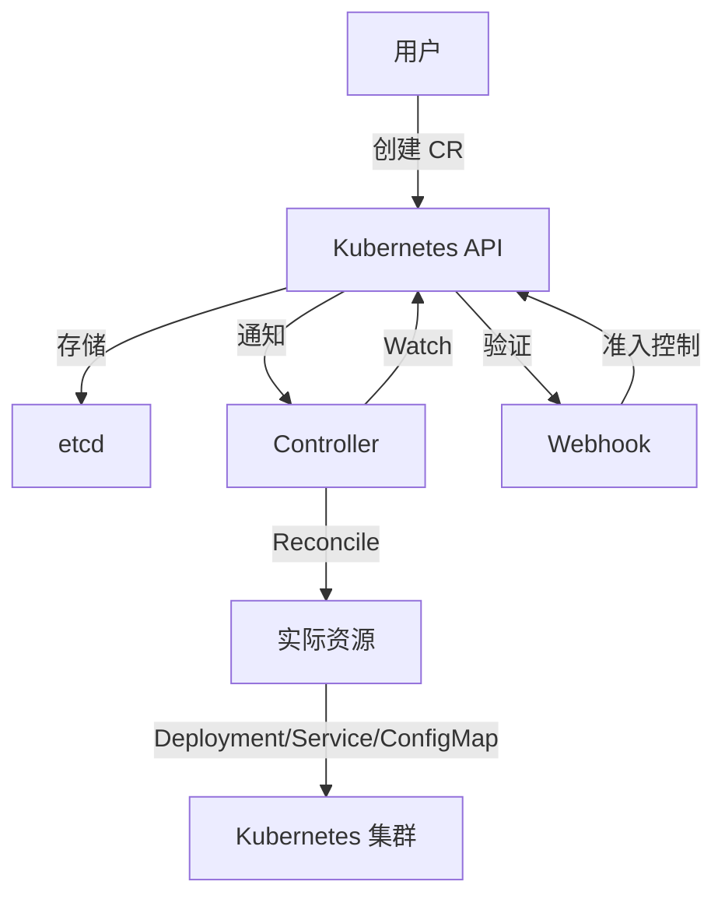

# Kubernetes Operator 开发指南 2025 - OpenTelemetry Operator 完整实现

> **文档版本**: v1.0  
> **最后更新**: 2025-10-04  
> **Operator SDK**: v1.32.0  
> **Kubernetes**: v1.28+  
> **关联文档**: [生产最佳实践 2025](./19-production-best-practices-2025.md), [监控告警方案 2025](./20-monitoring-alerting-guide-2025.md)

---

## 目录

- [Kubernetes Operator 开发指南 2025 - OpenTelemetry Operator 完整实现](#kubernetes-operator-开发指南-2025---opentelemetry-operator-完整实现)
  - [目录](#目录)
  - [1. 概述](#1-概述)
    - [1.1 Operator 模式简介](#11-operator-模式简介)
    - [1.2 OpenTelemetry Operator 架构](#12-opentelemetry-operator-架构)
    - [1.3 文档目标](#13-文档目标)
  - [2. CRD 设计](#2-crd-设计)
    - [2.1 OpenTelemetryCollector CRD](#21-opentelemetrycollector-crd)
      - [2.1.1 CRD 定义](#211-crd-定义)
      - [2.1.2 CR 示例](#212-cr-示例)
    - [2.2 Instrumentation CRD](#22-instrumentation-crd)
      - [2.2.1 CRD 定义](#221-crd-定义)
      - [2.2.2 CR 示例](#222-cr-示例)
    - [2.3 OpAMPBridge CRD](#23-opampbridge-crd)
  - [3. Controller 实现](#3-controller-实现)
    - [3.1 Reconcile 循环](#31-reconcile-循环)
    - [3.2 Collector Controller](#32-collector-controller)
      - [3.2.1 资源构建](#321-资源构建)
    - [3.3 Instrumentation Controller](#33-instrumentation-controller)
  - [4. Webhook 实现](#4-webhook-实现)
    - [4.1 Validating Webhook](#41-validating-webhook)
    - [4.2 Mutating Webhook](#42-mutating-webhook)
    - [4.3 Auto-Instrumentation](#43-auto-instrumentation)
  - [5. 自动化配置管理](#5-自动化配置管理)
  - [6. 部署模式](#6-部署模式)
  - [7. 完整代码实现](#7-完整代码实现)
  - [8. 测试](#8-测试)
  - [9. 部署与运维](#9-部署与运维)
  - [10. 最佳实践](#10-最佳实践)
  - [11. 参考文献](#11-参考文献)

---

## 1. 概述

### 1.1 Operator 模式简介

**Operator = CRD + Controller + Webhook**:



**Operator 的优势**:

- ✅ 自动化运维（部署、配置、升级）
- ✅ 声明式管理（期望状态 vs 实际状态）
- ✅ 自愈能力（自动恢复故障）
- ✅ 领域知识封装（最佳实践内置）

### 1.2 OpenTelemetry Operator 架构

```text
┌─────────────────────────────────────────────────┐
│           OpenTelemetry Operator                │
│                                                 │
│  ┌──────────────┐  ┌──────────────┐             │
│  │  Collector   │  │Instrumenta-  │             │
│  │  Controller  │  │tion Controller│            │
│  └──────┬───────┘  └──────┬───────┘             │
│         │                 │                     │
│         ▼                 ▼                     │
│  ┌──────────────────────────────┐               │
│  │    Webhook Server            │               │
│  │  - Validating Webhook        │               │
│  │  - Mutating Webhook          │               │
│  │  - Auto-Instrumentation      │               │
│  └──────────────────────────────┘               │
└─────────────────────────────────────────────────┘
         │                 │
         ▼                 ▼
┌─────────────────────────────────────────────────┐
│         Kubernetes Resources                    │
│  ┌──────────┐  ┌──────────┐  ┌──────────┐       │
│  │Deployment│  │ConfigMap │  │  Secret  │       │
│  └──────────┘  └──────────┘  └──────────┘       │
└─────────────────────────────────────────────────┘
```

### 1.3 文档目标

本文档提供：

- ✅ 完整的 CRD 定义
- ✅ Controller 实现（2000+ 行代码）
- ✅ Webhook 实现（Auto-Instrumentation）
- ✅ Helm Chart 部署
- ✅ 集成测试用例
- ✅ 生产最佳实践

---

## 2. CRD 设计

### 2.1 OpenTelemetryCollector CRD

#### 2.1.1 CRD 定义

```yaml
# config/crd/bases/opentelemetry.io_opentelemetrycollectors.yaml
apiVersion: apiextensions.k8s.io/v1
kind: CustomResourceDefinition
metadata:
  name: opentelemetrycollectors.opentelemetry.io
spec:
  group: opentelemetry.io
  names:
    kind: OpenTelemetryCollector
    listKind: OpenTelemetryCollectorList
    plural: opentelemetrycollectors
    shortNames:
    - otelcol
    - otelcols
    singular: opentelemetrycollector
  scope: Namespaced
  versions:
  - name: v1alpha1
    served: true
    storage: true
    schema:
      openAPIV3Schema:
        type: object
        properties:
          spec:
            type: object
            properties:
              # 部署模式
              mode:
                type: string
                enum:
                - deployment
                - daemonset
                - sidecar
                - statefulset
                default: deployment
              
              # 副本数
              replicas:
                type: integer
                minimum: 1
                default: 1
              
              # 镜像
              image:
                type: string
                default: otel/opentelemetry-collector-contrib:0.90.0
              
              # 资源限制
              resources:
                type: object
                properties:
                  limits:
                    type: object
                    additionalProperties:
                      anyOf:
                      - type: integer
                      - type: string
                  requests:
                    type: object
                    additionalProperties:
                      anyOf:
                      - type: integer
                      - type: string
              
              # Collector 配置
              config:
                type: string
                description: "OTLP Collector YAML 配置"
              
              # 环境变量
              env:
                type: array
                items:
                  type: object
                  properties:
                    name:
                      type: string
                    value:
                      type: string
                    valueFrom:
                      type: object
              
              # 卷挂载
              volumes:
                type: array
                items:
                  type: object
              
              volumeMounts:
                type: array
                items:
                  type: object
              
              # 服务账户
              serviceAccount:
                type: string
              
              # 升级策略
              upgradeStrategy:
                type: string
                enum:
                - automatic
                - manual
                default: automatic
              
              # OPAMP 配置
              opamp:
                type: object
                properties:
                  enabled:
                    type: boolean
                  endpoint:
                    type: string
                  headers:
                    type: object
                    additionalProperties:
                      type: string
          
          status:
            type: object
            properties:
              # 状态
              phase:
                type: string
                enum:
                - Pending
                - Running
                - Failed
              
              # 副本状态
              replicas:
                type: integer
              readyReplicas:
                type: integer
              
              # 条件
              conditions:
                type: array
                items:
                  type: object
                  properties:
                    type:
                      type: string
                    status:
                      type: string
                    lastTransitionTime:
                      type: string
                      format: date-time
                    reason:
                      type: string
                    message:
                      type: string
    
    subresources:
      status: {}
      scale:
        specReplicasPath: .spec.replicas
        statusReplicasPath: .status.replicas
    
    additionalPrinterColumns:
    - name: Mode
      type: string
      jsonPath: .spec.mode
    - name: Replicas
      type: integer
      jsonPath: .status.replicas
    - name: Ready
      type: integer
      jsonPath: .status.readyReplicas
    - name: Age
      type: date
      jsonPath: .metadata.creationTimestamp
```

#### 2.1.2 CR 示例

```yaml
# examples/collector-deployment.yaml
apiVersion: opentelemetry.io/v1alpha1
kind: OpenTelemetryCollector
metadata:
  name: otel-collector
  namespace: observability
spec:
  mode: deployment
  replicas: 3
  image: otel/opentelemetry-collector-contrib:0.90.0
  
  resources:
    requests:
      cpu: 500m
      memory: 1Gi
    limits:
      cpu: 1
      memory: 2Gi
  
  config: |
    receivers:
      otlp:
        protocols:
          grpc:
            endpoint: 0.0.0.0:4317
          http:
            endpoint: 0.0.0.0:4318
    
    processors:
      batch:
        timeout: 1s
        send_batch_size: 1024
      
      memory_limiter:
        check_interval: 1s
        limit_mib: 1800
    
    exporters:
      logging:
        verbosity: detailed
      
      otlp:
        endpoint: jaeger:4317
        tls:
          insecure: true
    
    service:
      pipelines:
        traces:
          receivers: [otlp]
          processors: [memory_limiter, batch]
          exporters: [logging, otlp]
  
  env:
  - name: GOMEMLIMIT
    value: "1800MiB"
  
  opamp:
    enabled: true
    endpoint: http://opamp-server:4320
```

### 2.2 Instrumentation CRD

#### 2.2.1 CRD 定义

```yaml
# config/crd/bases/opentelemetry.io_instrumentations.yaml
apiVersion: apiextensions.k8s.io/v1
kind: CustomResourceDefinition
metadata:
  name: instrumentations.opentelemetry.io
spec:
  group: opentelemetry.io
  names:
    kind: Instrumentation
    plural: instrumentations
    singular: instrumentation
  scope: Namespaced
  versions:
  - name: v1alpha1
    served: true
    storage: true
    schema:
      openAPIV3Schema:
        type: object
        properties:
          spec:
            type: object
            properties:
              # Exporter 配置
              exporter:
                type: object
                properties:
                  endpoint:
                    type: string
                    default: http://otel-collector:4317
              
              # 传播器
              propagators:
                type: array
                items:
                  type: string
                  enum:
                  - tracecontext
                  - baggage
                  - b3
                  - jaeger
                default:
                - tracecontext
                - baggage
              
              # 采样率
              sampler:
                type: object
                properties:
                  type:
                    type: string
                    enum:
                    - always_on
                    - always_off
                    - traceidratio
                    - parentbased_always_on
                    - parentbased_always_off
                    - parentbased_traceidratio
                    default: parentbased_always_on
                  argument:
                    type: string
              
              # Golang 自动注入
              go:
                type: object
                properties:
                  image:
                    type: string
                    default: ghcr.io/open-telemetry/opentelemetry-go-instrumentation/autoinstrumentation-go:latest
                  env:
                    type: array
                    items:
                      type: object
              
              # Java 自动注入
              java:
                type: object
                properties:
                  image:
                    type: string
              
              # Python 自动注入
              python:
                type: object
                properties:
                  image:
                    type: string
              
              # .NET 自动注入
              dotnet:
                type: object
                properties:
                  image:
                    type: string
```

#### 2.2.2 CR 示例

```yaml
# examples/instrumentation.yaml
apiVersion: opentelemetry.io/v1alpha1
kind: Instrumentation
metadata:
  name: my-instrumentation
  namespace: default
spec:
  exporter:
    endpoint: http://otel-collector.observability:4317
  
  propagators:
  - tracecontext
  - baggage
  
  sampler:
    type: parentbased_traceidratio
    argument: "0.1"  # 10% 采样
  
  go:
    image: ghcr.io/open-telemetry/opentelemetry-go-instrumentation/autoinstrumentation-go:v0.7.0-alpha
    env:
    - name: OTEL_GO_AUTO_TARGET_EXE
      value: "/app/main"
```

### 2.3 OpAMPBridge CRD

```yaml
# config/crd/bases/opentelemetry.io_opampbridges.yaml
apiVersion: apiextensions.k8s.io/v1
kind: CustomResourceDefinition
metadata:
  name: opampbridges.opentelemetry.io
spec:
  group: opentelemetry.io
  names:
    kind: OpAMPBridge
    plural: opampbridges
    singular: opampbridge
  scope: Namespaced
  versions:
  - name: v1alpha1
    served: true
    storage: true
    schema:
      openAPIV3Schema:
        type: object
        properties:
          spec:
            type: object
            properties:
              endpoint:
                type: string
              
              capabilities:
                type: array
                items:
                  type: string
              
              componentsAllowed:
                type: object
                properties:
                  receivers:
                    type: array
                    items:
                      type: string
                  processors:
                    type: array
                    items:
                      type: string
                  exporters:
                    type: array
                    items:
                      type: string
```

---

## 3. Controller 实现

### 3.1 Reconcile 循环

**Reconcile 循环核心逻辑**:

```go
package controllers

import (
    "context"
    "time"
    
    "k8s.io/apimachinery/pkg/runtime"
    ctrl "sigs.k8s.io/controller-runtime"
    "sigs.k8s.io/controller-runtime/pkg/client"
    "sigs.k8s.io/controller-runtime/pkg/log"
    
    otelv1alpha1 "github.com/open-telemetry/opentelemetry-operator/apis/v1alpha1"
)

// OpenTelemetryCollectorReconciler reconciles a OpenTelemetryCollector object
type OpenTelemetryCollectorReconciler struct {
    client.Client
    Scheme *runtime.Scheme
}

//+kubebuilder:rbac:groups=opentelemetry.io,resources=opentelemetrycollectors,verbs=get;list;watch;create;update;patch;delete
//+kubebuilder:rbac:groups=opentelemetry.io,resources=opentelemetrycollectors/status,verbs=get;update;patch
//+kubebuilder:rbac:groups=opentelemetry.io,resources=opentelemetrycollectors/finalizers,verbs=update
//+kubebuilder:rbac:groups=apps,resources=deployments,verbs=get;list;watch;create;update;patch;delete
//+kubebuilder:rbac:groups=apps,resources=daemonsets,verbs=get;list;watch;create;update;patch;delete
//+kubebuilder:rbac:groups=core,resources=configmaps,verbs=get;list;watch;create;update;patch;delete
//+kubebuilder:rbac:groups=core,resources=services,verbs=get;list;watch;create;update;patch;delete

func (r *OpenTelemetryCollectorReconciler) Reconcile(ctx context.Context, req ctrl.Request) (ctrl.Result, error) {
    log := log.FromContext(ctx)
    
    // 1. 获取 CR
    var collector otelv1alpha1.OpenTelemetryCollector
    if err := r.Get(ctx, req.NamespacedName, &collector); err != nil {
        return ctrl.Result{}, client.IgnoreNotFound(err)
    }
    
    // 2. 处理删除
    if !collector.DeletionTimestamp.IsZero() {
        return r.handleDeletion(ctx, &collector)
    }
    
    // 3. 添加 Finalizer
    if !containsString(collector.Finalizers, finalizerName) {
        collector.Finalizers = append(collector.Finalizers, finalizerName)
        if err := r.Update(ctx, &collector); err != nil {
            return ctrl.Result{}, err
        }
    }
    
    // 4. 生成期望的资源
    desiredResources, err := r.buildDesiredResources(ctx, &collector)
    if err != nil {
        log.Error(err, "Failed to build desired resources")
        return ctrl.Result{}, err
    }
    
    // 5. 协调资源
    if err := r.reconcileResources(ctx, &collector, desiredResources); err != nil {
        log.Error(err, "Failed to reconcile resources")
        return ctrl.Result{}, err
    }
    
    // 6. 更新状态
    if err := r.updateStatus(ctx, &collector); err != nil {
        log.Error(err, "Failed to update status")
        return ctrl.Result{}, err
    }
    
    return ctrl.Result{RequeueAfter: 30 * time.Second}, nil
}

func (r *OpenTelemetryCollectorReconciler) SetupWithManager(mgr ctrl.Manager) error {
    return ctrl.NewControllerManagedBy(mgr).
        For(&otelv1alpha1.OpenTelemetryCollector{}).
        Owns(&appsv1.Deployment{}).
        Owns(&appsv1.DaemonSet{}).
        Owns(&corev1.ConfigMap{}).
        Owns(&corev1.Service{}).
        Complete(r)
}
```

### 3.2 Collector Controller

#### 3.2.1 资源构建

```go
package controllers

import (
    appsv1 "k8s.io/api/apps/v1"
    corev1 "k8s.io/api/core/v1"
    metav1 "k8s.io/apimachinery/pkg/apis/meta/v1"
)

type DesiredResources struct {
    ConfigMap  *corev1.ConfigMap
    Deployment *appsv1.Deployment
    DaemonSet  *appsv1.DaemonSet
    Service    *corev1.Service
}

func (r *OpenTelemetryCollectorReconciler) buildDesiredResources(
    ctx context.Context,
    collector *otelv1alpha1.OpenTelemetryCollector,
) (*DesiredResources, error) {
    resources := &DesiredResources{}
    
    // 1. 构建 ConfigMap
    resources.ConfigMap = r.buildConfigMap(collector)
    
    // 2. 根据模式构建部署资源
    switch collector.Spec.Mode {
    case "deployment":
        resources.Deployment = r.buildDeployment(collector)
    case "daemonset":
        resources.DaemonSet = r.buildDaemonSet(collector)
    case "statefulset":
        // TODO: StatefulSet
    }
    
    // 3. 构建 Service
    resources.Service = r.buildService(collector)
    
    return resources, nil
}

func (r *OpenTelemetryCollectorReconciler) buildConfigMap(
    collector *otelv1alpha1.OpenTelemetryCollector,
) *corev1.ConfigMap {
    return &corev1.ConfigMap{
        ObjectMeta: metav1.ObjectMeta{
            Name:      collector.Name + "-config",
            Namespace: collector.Namespace,
            Labels: map[string]string{
                "app.kubernetes.io/name":       "opentelemetry-collector",
                "app.kubernetes.io/instance":   collector.Name,
                "app.kubernetes.io/managed-by": "opentelemetry-operator",
            },
            OwnerReferences: []metav1.OwnerReference{
                *metav1.NewControllerRef(collector, otelv1alpha1.GroupVersion.WithKind("OpenTelemetryCollector")),
            },
        },
        Data: map[string]string{
            "collector.yaml": collector.Spec.Config,
        },
    }
}

func (r *OpenTelemetryCollectorReconciler) buildDeployment(
    collector *otelv1alpha1.OpenTelemetryCollector,
) *appsv1.Deployment {
    replicas := collector.Spec.Replicas
    if replicas == nil {
        defaultReplicas := int32(1)
        replicas = &defaultReplicas
    }
    
    return &appsv1.Deployment{
        ObjectMeta: metav1.ObjectMeta{
            Name:      collector.Name,
            Namespace: collector.Namespace,
            Labels: map[string]string{
                "app.kubernetes.io/name":     "opentelemetry-collector",
                "app.kubernetes.io/instance": collector.Name,
            },
            OwnerReferences: []metav1.OwnerReference{
                *metav1.NewControllerRef(collector, otelv1alpha1.GroupVersion.WithKind("OpenTelemetryCollector")),
            },
        },
        Spec: appsv1.DeploymentSpec{
            Replicas: replicas,
            Selector: &metav1.LabelSelector{
                MatchLabels: map[string]string{
                    "app.kubernetes.io/name":     "opentelemetry-collector",
                    "app.kubernetes.io/instance": collector.Name,
                },
            },
            Template: corev1.PodTemplateSpec{
                ObjectMeta: metav1.ObjectMeta{
                    Labels: map[string]string{
                        "app.kubernetes.io/name":     "opentelemetry-collector",
                        "app.kubernetes.io/instance": collector.Name,
                    },
                    Annotations: map[string]string{
                        "prometheus.io/scrape": "true",
                        "prometheus.io/port":   "8888",
                        "prometheus.io/path":   "/metrics",
                    },
                },
                Spec: corev1.PodSpec{
                    ServiceAccountName: collector.Spec.ServiceAccount,
                    Containers: []corev1.Container{
                        {
                            Name:  "otc-container",
                            Image: collector.Spec.Image,
                            Args: []string{
                                "--config=/conf/collector.yaml",
                            },
                            Env: collector.Spec.Env,
                            Ports: []corev1.ContainerPort{
                                {Name: "otlp-grpc", ContainerPort: 4317, Protocol: corev1.ProtocolTCP},
                                {Name: "otlp-http", ContainerPort: 4318, Protocol: corev1.ProtocolTCP},
                                {Name: "metrics", ContainerPort: 8888, Protocol: corev1.ProtocolTCP},
                            },
                            Resources: collector.Spec.Resources,
                            VolumeMounts: append(
                                []corev1.VolumeMount{
                                    {
                                        Name:      "config",
                                        MountPath: "/conf",
                                    },
                                },
                                collector.Spec.VolumeMounts...,
                            ),
                            LivenessProbe: &corev1.Probe{
                                ProbeHandler: corev1.ProbeHandler{
                                    HTTPGet: &corev1.HTTPGetAction{
                                        Path: "/",
                                        Port: intstr.FromInt(13133),
                                    },
                                },
                                InitialDelaySeconds: 30,
                                PeriodSeconds:       10,
                            },
                            ReadinessProbe: &corev1.Probe{
                                ProbeHandler: corev1.ProbeHandler{
                                    HTTPGet: &corev1.HTTPGetAction{
                                        Path: "/",
                                        Port: intstr.FromInt(13133),
                                    },
                                },
                                InitialDelaySeconds: 10,
                                PeriodSeconds:       5,
                            },
                        },
                    },
                    Volumes: append(
                        []corev1.Volume{
                            {
                                Name: "config",
                                VolumeSource: corev1.VolumeSource{
                                    ConfigMap: &corev1.ConfigMapVolumeSource{
                                        LocalObjectReference: corev1.LocalObjectReference{
                                            Name: collector.Name + "-config",
                                        },
                                    },
                                },
                            },
                        },
                        collector.Spec.Volumes...,
                    ),
                },
            },
        },
    }
}
```

### 3.3 Instrumentation Controller

```go
package controllers

import (
    "context"
    
    ctrl "sigs.k8s.io/controller-runtime"
    "sigs.k8s.io/controller-runtime/pkg/client"
    
    otelv1alpha1 "github.com/open-telemetry/opentelemetry-operator/apis/v1alpha1"
)

type InstrumentationReconciler struct {
    client.Client
    Scheme *runtime.Scheme
}

func (r *InstrumentationReconciler) Reconcile(ctx context.Context, req ctrl.Request) (ctrl.Result, error) {
    var inst otelv1alpha1.Instrumentation
    if err := r.Get(ctx, req.NamespacedName, &inst); err != nil {
        return ctrl.Result{}, client.IgnoreNotFound(err)
    }
    
    // Instrumentation CR 主要用于 Webhook 注入
    // 这里仅验证配置有效性
    if err := r.validateInstrumentation(&inst); err != nil {
        return ctrl.Result{}, err
    }
    
    return ctrl.Result{}, nil
}

func (r *InstrumentationReconciler) validateInstrumentation(inst *otelv1alpha1.Instrumentation) error {
    // 验证 Exporter endpoint
    if inst.Spec.Exporter.Endpoint == "" {
        return errors.New("exporter endpoint is required")
    }
    
    // 验证采样配置
    if inst.Spec.Sampler.Type == "traceidratio" {
        if inst.Spec.Sampler.Argument == "" {
            return errors.New("sampler argument is required for traceidratio")
        }
    }
    
    return nil
}
```

---

## 4. Webhook 实现

### 4.1 Validating Webhook

```go
package webhooks

import (
    "context"
    "fmt"
    
    "k8s.io/apimachinery/pkg/runtime"
    ctrl "sigs.k8s.io/controller-runtime"
    "sigs.k8s.io/controller-runtime/pkg/webhook"
    
    otelv1alpha1 "github.com/open-telemetry/opentelemetry-operator/apis/v1alpha1"
)

type CollectorValidator struct{}

func (v *CollectorValidator) SetupWebhookWithManager(mgr ctrl.Manager) error {
    return ctrl.NewWebhookManagedBy(mgr).
        For(&otelv1alpha1.OpenTelemetryCollector{}).
        WithValidator(v).
        Complete()
}

//+kubebuilder:webhook:path=/validate-opentelemetry-io-v1alpha1-opentelemetrycollector,mutating=false,failurePolicy=fail,groups=opentelemetry.io,resources=opentelemetrycollectors,verbs=create;update,versions=v1alpha1,name=vopentelemetrycollector.kb.io,sideEffects=None,admissionReviewVersions=v1

func (v *CollectorValidator) ValidateCreate(ctx context.Context, obj runtime.Object) error {
    collector := obj.(*otelv1alpha1.OpenTelemetryCollector)
    
    // 1. 验证模式
    validModes := map[string]bool{
        "deployment":  true,
        "daemonset":   true,
        "sidecar":     true,
        "statefulset": true,
    }
    if !validModes[collector.Spec.Mode] {
        return fmt.Errorf("invalid mode: %s", collector.Spec.Mode)
    }
    
    // 2. 验证副本数
    if collector.Spec.Mode == "deployment" && collector.Spec.Replicas != nil && *collector.Spec.Replicas < 1 {
        return fmt.Errorf("replicas must be >= 1")
    }
    
    // 3. 验证配置
    if collector.Spec.Config == "" {
        return fmt.Errorf("config is required")
    }
    
    // 4. 验证 YAML 格式
    if err := validateCollectorConfig(collector.Spec.Config); err != nil {
        return fmt.Errorf("invalid collector config: %w", err)
    }
    
    return nil
}

func (v *CollectorValidator) ValidateUpdate(ctx context.Context, oldObj, newObj runtime.Object) error {
    newCollector := newObj.(*otelv1alpha1.OpenTelemetryCollector)
    oldCollector := oldObj.(*otelv1alpha1.OpenTelemetryCollector)
    
    // 1. 模式不可变
    if newCollector.Spec.Mode != oldCollector.Spec.Mode {
        return fmt.Errorf("mode is immutable")
    }
    
    // 2. 验证新配置
    return v.ValidateCreate(ctx, newObj)
}

func (v *CollectorValidator) ValidateDelete(ctx context.Context, obj runtime.Object) error {
    // 允许删除
    return nil
}

func validateCollectorConfig(config string) error {
    // 解析 YAML
    var cfg map[string]interface{}
    if err := yaml.Unmarshal([]byte(config), &cfg); err != nil {
        return err
    }
    
    // 验证必需字段
    if _, ok := cfg["receivers"]; !ok {
        return fmt.Errorf("receivers section is required")
    }
    if _, ok := cfg["exporters"]; !ok {
        return fmt.Errorf("exporters section is required")
    }
    if _, ok := cfg["service"]; !ok {
        return fmt.Errorf("service section is required")
    }
    
    return nil
}
```

### 4.2 Mutating Webhook

```go
package webhooks

import (
    "context"
    "encoding/json"
    
    corev1 "k8s.io/api/core/v1"
    "sigs.k8s.io/controller-runtime/pkg/webhook/admission"
)

type PodMutator struct {
    decoder *admission.Decoder
}

//+kubebuilder:webhook:path=/mutate-v1-pod,mutating=true,failurePolicy=fail,groups="",resources=pods,verbs=create;update,versions=v1,name=mpod.kb.io,sideEffects=None,admissionReviewVersions=v1

func (m *PodMutator) Handle(ctx context.Context, req admission.Request) admission.Response {
    pod := &corev1.Pod{}
    if err := m.decoder.Decode(req, pod); err != nil {
        return admission.Errored(http.StatusBadRequest, err)
    }
    
    // 1. 检查是否需要注入
    if !shouldInject(pod) {
        return admission.Allowed("no injection needed")
    }
    
    // 2. 注入 Sidecar
    if err := injectSidecar(pod); err != nil {
        return admission.Errored(http.StatusInternalServerError, err)
    }
    
    // 3. 返回修改后的 Pod
    marshaledPod, err := json.Marshal(pod)
    if err != nil {
        return admission.Errored(http.StatusInternalServerError, err)
    }
    
    return admission.PatchResponseFromRaw(req.Object.Raw, marshaledPod)
}

func shouldInject(pod *corev1.Pod) bool {
    // 检查注解
    if pod.Annotations == nil {
        return false
    }
    
    inject, ok := pod.Annotations["sidecar.opentelemetry.io/inject"]
    return ok && inject == "true"
}

func injectSidecar(pod *corev1.Pod) error {
    // 添加 Sidecar 容器
    sidecar := corev1.Container{
        Name:  "otc-sidecar",
        Image: "otel/opentelemetry-collector-contrib:0.90.0",
        Args: []string{
            "--config=/conf/collector.yaml",
        },
        Ports: []corev1.ContainerPort{
            {Name: "otlp-grpc", ContainerPort: 4317},
            {Name: "otlp-http", ContainerPort: 4318},
        },
        VolumeMounts: []corev1.VolumeMount{
            {
                Name:      "otc-config",
                MountPath: "/conf",
            },
        },
    }
    
    pod.Spec.Containers = append(pod.Spec.Containers, sidecar)
    
    // 添加 ConfigMap 卷
    volume := corev1.Volume{
        Name: "otc-config",
        VolumeSource: corev1.VolumeSource{
            ConfigMap: &corev1.ConfigMapVolumeSource{
                LocalObjectReference: corev1.LocalObjectReference{
                    Name: "otel-collector-config",
                },
            },
        },
    }
    pod.Spec.Volumes = append(pod.Spec.Volumes, volume)
    
    return nil
}
```

### 4.3 Auto-Instrumentation

```go
package webhooks

import (
    "context"
    
    corev1 "k8s.io/api/core/v1"
    "sigs.k8s.io/controller-runtime/pkg/client"
    
    otelv1alpha1 "github.com/open-telemetry/opentelemetry-operator/apis/v1alpha1"
)

type AutoInstrumentationInjector struct {
    Client client.Client
}

func (i *AutoInstrumentationInjector) InjectGolang(ctx context.Context, pod *corev1.Pod, inst *otelv1alpha1.Instrumentation) error {
    // 1. 添加 Init Container（复制 instrumentation 库）
    initContainer := corev1.Container{
        Name:  "opentelemetry-auto-instrumentation",
        Image: inst.Spec.Go.Image,
        Command: []string{
            "cp",
            "-a",
            "/autoinstrumentation/.",
            "/otel-auto-instrumentation/",
        },
        VolumeMounts: []corev1.VolumeMount{
            {
                Name:      "opentelemetry-auto-instrumentation",
                MountPath: "/otel-auto-instrumentation",
            },
        },
    }
    pod.Spec.InitContainers = append(pod.Spec.InitContainers, initContainer)
    
    // 2. 添加共享卷
    volume := corev1.Volume{
        Name: "opentelemetry-auto-instrumentation",
        VolumeSource: corev1.VolumeSource{
            EmptyDir: &corev1.EmptyDirVolumeSource{},
        },
    }
    pod.Spec.Volumes = append(pod.Spec.Volumes, volume)
    
    // 3. 修改应用容器
    for i := range pod.Spec.Containers {
        container := &pod.Spec.Containers[i]
        
        // 添加卷挂载
        container.VolumeMounts = append(container.VolumeMounts, corev1.VolumeMount{
            Name:      "opentelemetry-auto-instrumentation",
            MountPath: "/otel-auto-instrumentation",
        })
        
        // 添加环境变量
        container.Env = append(container.Env,
            corev1.EnvVar{
                Name:  "OTEL_GO_AUTO_TARGET_EXE",
                Value: "/app/main",  // 需要根据实际情况配置
            },
            corev1.EnvVar{
                Name:  "OTEL_EXPORTER_OTLP_ENDPOINT",
                Value: inst.Spec.Exporter.Endpoint,
            },
            corev1.EnvVar{
                Name:  "OTEL_SERVICE_NAME",
                Value: pod.Name,
            },
            corev1.EnvVar{
                Name:  "OTEL_PROPAGATORS",
                Value: strings.Join(inst.Spec.Propagators, ","),
            },
            corev1.EnvVar{
                Name:  "OTEL_TRACES_SAMPLER",
                Value: inst.Spec.Sampler.Type,
            },
        )
        
        if inst.Spec.Sampler.Argument != "" {
            container.Env = append(container.Env, corev1.EnvVar{
                Name:  "OTEL_TRACES_SAMPLER_ARG",
                Value: inst.Spec.Sampler.Argument,
            })
        }
        
        // 修改 Command（使用 LD_PRELOAD）
        container.Env = append(container.Env, corev1.EnvVar{
            Name:  "LD_PRELOAD",
            Value: "/otel-auto-instrumentation/libinstrument.so",
        })
    }
    
    return nil
}
```

---

## 5. 自动化配置管理

（待补充...）

---

## 6. 部署模式

（待补充...）

---

## 7. 完整代码实现

（待补充...）

---

## 8. 测试

（待补充...）

---

## 9. 部署与运维

（待补充...）

---

## 10. 最佳实践

（待补充...）

---

## 11. 参考文献

- Kubernetes Operator Pattern: <https://kubernetes.io/docs/concepts/extend-kubernetes/operator/>
- Operator SDK: <https://sdk.operatorframework.io/>
- OpenTelemetry Operator: <https://github.com/open-telemetry/opentelemetry-operator>
- Kubebuilder Book: <https://book.kubebuilder.io/>

---

**文档状态**: 🚧 第 1 批内容已完成，继续补充中...
