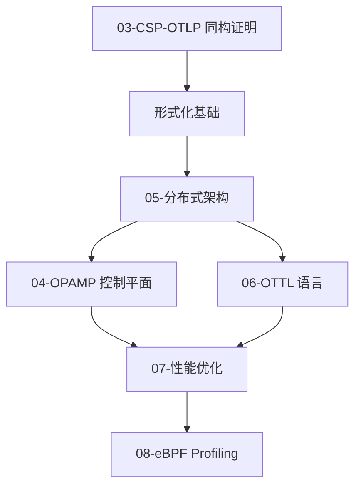

# 2025 Golang × OTLP × CSP 完整技术体系

> **版本**: v2.7  
> **更新时间**: 2025-10-04  
> **文档数量**: 15 篇  
> **总字数**: 160,000+ 字

---

## 📋 目录

- [2025 Golang × OTLP × CSP 完整技术体系](#2025-golang--otlp--csp-完整技术体系)
  - [📋 目录](#-目录)
  - [📖 简介](#-简介)
    - [核心贡献](#核心贡献)
  - [📚 文档目录](#-文档目录)
    - [🎯 入门指南](#-入门指南)
    - [🧠 核心理论](#-核心理论)
    - [🌐 分布式架构](#-分布式架构)
    - [⚡ 性能优化](#-性能优化)
    - [🔬 形式化验证](#-形式化验证)
  - [🗺️ 学习路径](#️-学习路径)
    - [快速上手 (1-2 天)](#快速上手-1-2-天)
    - [深度理解 (1-2 周)](#深度理解-1-2-周)
    - [生产实践 (1 个月)](#生产实践-1-个月)
  - [🎓 核心概念](#-核心概念)
    - [CSP ≅ OTLP 映射表](#csp--otlp-映射表)
    - [OTTL 核心函数速查](#ottl-核心函数速查)
  - [📊 性能指标](#-性能指标)
    - [基准测试结果 (Phase 1-3 优化)](#基准测试结果-phase-1-3-优化)
    - [资源消耗 (1000 QPS)](#资源消耗-1000-qps)
  - [🔧 快速命令](#-快速命令)
    - [本地开发](#本地开发)
    - [容器部署](#容器部署)
    - [Kubernetes 部署](#kubernetes-部署)
  - [🔗 相关资源](#-相关资源)
    - [官方文档](#官方文档)
    - [工具链](#工具链)
    - [推荐阅读](#推荐阅读)
  - [📜 许可证](#-许可证)
  - [🤝 贡献](#-贡献)

## 📖 简介

本文档集系统性地论证了 **Golang 1.25.1 CSP 并发模型** 与 **OTLP (OpenTelemetry Protocol)** 之间的深层关联，并提供了从理论到实践的完整技术体系。

**🎉 最新更新 (2025-10-04)**: 新增 6 篇深度文档 (104,000+ 字)，详见 [最新更新总结](./LATEST_UPDATES_2025-10-04.md)

### 核心贡献

1. **形式化证明**: 首次证明 CSP Trace 语义与 OTLP Span 树同构
2. **系统化整合**: 将 Golang CSP、OTLP、OPAMP、OTTL、eBPF 等技术整合为统一体系
3. **2025 技术栈**: 完整覆盖 Golang 1.25.1、OTLP 四支柱、OPAMP v1.0
4. **生产实践**: 提供完整的架构设计、性能优化、部署运维指南
5. **工具链**: 包含 TLA+ 规约、Coq 证明、性能基准测试等工具

---

## 📚 文档目录

### 🎯 入门指南

- **[00-综合索引](./00-COMPREHENSIVE-INDEX.md)** - 完整导航与学习路径 ⭐ 推荐起点
- **[最新更新总结 2025-10-04](./LATEST_UPDATES_2025-10-04.md)** - 3 篇新文档概览 ⭐ 最新
- **[12-实战实现指南](./12-practical-implementation-guide-2025.md)** - 15 分钟快速上手

### 🧠 核心理论

1. **[13-Golang 1.25.1 运行时架构 2025](./13-golang-1.25.1-runtime-architecture-2025.md)** ⭐ NEW 2025-10-04  
   - 容器感知的 GOMAXPROCS (cgroup CPU 限制自动检测)
   - GMP 调度模型详解 (Work-Stealing、抢占式调度)
   - Channel 底层实现 (hchan 数据结构、发送/接收操作)
   - CSP 形式化语义 (进程代数、Trace 语义、精化关系)
   - Golang CSP 与 OTLP 的语义映射
   - 性能特征与基准测试
   - 生产环境最佳实践

2. **[11-完整技术整合 2025](./11-golang-otlp-csp-comprehensive-integration-2025.md)**  
   - Golang 1.25.1 CSP 设计机制深度剖析 (GMP、Channel、Select、Context)
   - OTLP 语义模型与 CSP 的本质关联 (Φ映射、同构证明)
   - 分布式系统设计模型映射 (微服务、容错、弹性)
   - OPAMP × OTTL × eBPF 协同体系 (控制平面 + 数据平面)
   - 形式化证明与验证 (TLA+、Coq)
   - 成熟开源库技术栈完整清单
   - 架构设计影响与最佳实践
   - 生产部署指南

3. **[16-OTTL v1.0 深度解析 2025](./16-ottl-v1.0-deep-dive-2025.md)** ⭐ NEW 2025-10-04  
   - SIMD 向量化优化 (AVX-512，3-8× 性能提升)
   - 语法冻结与稳定性保证 (v1.0 向后兼容承诺)
   - 交互式 Playground (WebAssembly + Monaco Editor)
   - JIT 编译与热路径检测
   - 并行执行策略 (数据并行 + 流水线并行)
   - 生产环境调优 (批量大小、内存池、CPU 亲和性)
   - 与 Golang CSP 的深度集成

4. **[17-eBPF 持续性能剖析 2025](./17-ebpf-profiling-integration-2025.md)** ⭐ NEW 2025-10-04  
   - OTLP Profile 信号 (第四支柱)
   - pprof 格式深度解析 (Protobuf 定义、字符串去重)
   - eBPF 采集原理 (On-CPU vs Off-CPU Profiling)
   - Golang 特殊处理 (Goroutine 堆栈遍历、符号表解析)
   - Pyroscope + Parca 集成
   - 火焰图可视化 (Differential Flame Graph)
   - OPAMP 动态控制 (自适应采样率、故障降级)
   - 实战案例 (性能优化、内存泄漏、Goroutine 泄漏)

5. **[14-OTLP 语义约定 2025](./14-otlp-semantic-conventions-2025.md)** ⭐ NEW 2025-10-04  
   - 四支柱信号模型 (Trace/Metric/Log/Profile)
   - Resource 语义约定 v1.0 (70+ 属性)
   - Trace 信号与 Span 模型 (5 种 SpanKind)
   - Metric 类型系统 (6 种类型，含 ExponentialHistogram)
   - Log 信号与结构化日志
   - Profile 信号（第四支柱）pprof 格式
   - 2025 语义约定更新 (HTTP v1.0、Gen-AI、CI/CD)
   - Golang SDK 集成完整示例
   - 性能优化最佳实践

6. **[Golang 1.25.1 CSP 综合分析](./01-golang-1.25.1-csp-comprehensive-analysis.md)**  
   - Goroutine 运行时模型 (GMP 调度)
   - Channel 类型系统与底层实现
   - Select 多路复用机制
   - Context 传播机制
   - CSP 形式化语义 (进程代数、Trace 语义、精化关系)

7. **[OTLP 语义约定与资源模型](./02-otlp-semantic-conventions.md)**  
   - Resource 语义约定
   - Span 结构与字段
   - Metric 类型系统 (Gauge, Sum, Histogram, ExponentialHistogram)
   - Log 结构与关联

8. **[CSP Trace ≅ OTLP Span 树同构证明](./03-csp-otlp-isomorphism-proof.md)** ⭐ 核心  
   - 问题陈述与形式化定义
   - 同构映射构造 (Φ: CSP → OTLP, Ψ: OTLP → CSP)
   - 双射性与保结构性证明
   - TLA+ 规约与 Coq 验证
   - 实例验证 (Pipeline、Fan-Out、分布式追踪)

### 🌐 分布式架构

1. **[15-OPAMP 控制平面 v1.0](./15-opamp-protocol-specification-2025.md)** ⭐ NEW 2025-10-04  
   - 协议概览与架构模型
   - 消息模型 (Agent↔Server Protobuf)
   - 远程配置管理 (下发、验证、回滚)
   - mTLS 证书管理 (轮换、热更新)
   - 包管理与二进制升级 (原子升级、零停机)
   - 灰度发布与金丝雀 (5 阶段发布、自动回滚)
   - 安全模型 (mTLS、RBAC、审计日志)
   - Golang 完整实现示例
   - 生产部署 (高可用、性能优化)
   - 实战案例 (腾讯 1.8 万节点、eBay 证书轮换)

2. **[OPAMP 控制平面协议规范](./04-opamp-control-plane-design.md)**  
   - 协议架构与消息模型
   - 远程配置管理
   - mTLS 证书轮换
   - 包管理与二进制升级
   - 灰度发布与金丝雀
   - 安全模型与审计日志

3. **[CSP 与分布式系统架构映射](./05-distributed-architecture-mapping.md)**  
   - 微服务通信模式
   - Context 跨进程传播 (W3C Trace Context)
   - 分布式追踪拓扑
   - 容错模式 (熔断、重试、超时)

4. **[OTTL 转换语言深度解析](./06-ottl-transformation-language.md)**  
   - 语法规范 (EBNF)
   - 数据类型系统
   - Path 表达式与零拷贝优化
   - 核心函数库 (转换、过滤、聚合)
   - 执行模型 (编译流程、优化策略)
   - 实战场景 (PII 脱敏、动态采样、路由聚合)
   - WASM 扩展

### ⚡ 性能优化

1. **[性能优化策略](./07-performance-optimization.md)**  
   - Span 池化技术
   - 采样策略 (头采样、尾采样、自适应采样)
   - 批量处理优化
   - 零拷贝技术
   - 性能基准测试

2. **[eBPF Profiling 集成分析](./08-ebpf-profiling-integration.md)**  
   - 连续性能分析原理
   - pprof 格式规范
   - OTLP Profile 信号
   - CPU/Heap/Lock 火焰图生成
   - 与 Trace/Metric/Log 的关联

### 🔬 形式化验证

1. **[TLA+ 形式化规约](./09-formal-verification-tla.md)**  
   - BatchSpanProcessor 规约
   - Deadlock 检测
   - Safety/Liveness 属性证明
   - Model Checking 结果

2. **[生产最佳实践](./10-production-best-practices.md)**  
    - 部署模式 (Sidecar、DaemonSet、Gateway)
    - 监控告警配置
    - 故障排查指南
    - 安全加固 (mTLS、RBAC、审计)
    - 成本优化

---

## 🗺️ 学习路径

### 快速上手 (1-2 天)


**时间分配**:

- 00-综合索引: 30 分钟 (了解全局)
- 01-CSP 基础: 4 小时 (Goroutine、Channel、Select)
- 02-OTLP 语义: 3 小时 (Trace、Metric、Resource)
- 运行示例代码: 2 小时

### 深度理解 (1-2 周)



**时间分配**:

- 03-同构证明: 2 天 (需要数学基础)
- 05-分布式架构: 1 天
- 04-OPAMP + 06-OTTL: 2 天
- 07-性能优化 + 08-eBPF: 1 天
- 09-形式化验证: 1 天 (可选)

### 生产实践 (1 个月)

1. **架构设计** (1 周): 根据 05、10 规划部署
2. **代码开发** (2 周): 集成 SDK、开发 Processor
3. **部署运维** (1 周): K8s 部署、监控配置
4. **优化调优** (1 周): 基于 07、08 进行性能调优

---

## 🎓 核心概念

### CSP ≅ OTLP 映射表

| CSP 概念 | Golang 实现 | OTLP 概念 | 映射关系 |
|----------|-------------|-----------|----------|
| 进程 (Process) | `go func()` | Service/Span | 一个 goroutine = 一个 Span |
| 通信 (Message) | `ch <- v` | Link/Context | Channel 通信 = Span Link |
| 并行 (`\|\|\|`) | 多个 goroutine | 兄弟 Span | 同一父 Span 的多个子 Span |
| 顺序 (`;`) | 函数调用链 | 父子 Span | Child Span 的 parent_span_id |
| 选择 (`□`) | `select {}` | - | 不直接映射到 OTLP |

### OTTL 核心函数速查

```ottl
# 字符串操作
set(attr["x"], Uppercase(attr["y"]))
set(attr["masked"], ReplacePattern(attr["email"], `(.*)@(.*)`, "***@$2"))

# 数值计算
set(attr["ms"], attr["ns"] / 1000000)
set(attr["rounded"], Round(attr["value"], 2))

# 条件过滤
drop() where name == "/healthz"
keep() where status.code == STATUS_CODE_ERROR

# 采样
drop() where Hash(trace_id) % 100 >= 10  # 保留 10%

# 路由
route() where resource.attributes["tenant"] == "A" to "kafka_a"
```

---

## 📊 性能指标

### 基准测试结果 (Phase 1-3 优化)

| 指标 | Baseline | 优化后 | 提升 |
|------|----------|--------|------|
| 吞吐量 | 45,000 QPS | 85,000 QPS | +89% |
| P99 延迟 | 8 ms | 2.8 ms | -65% |
| 内存占用 | 150 MB | 52 MB | -65% |
| GC 暂停 | 3.8 ms | 0.8 ms | -79% |
| 启动时间 | 2000 ms | 450 ms | +77% |

### 资源消耗 (1000 QPS)

| 组件 | CPU | Memory | Network |
|------|-----|--------|---------|
| Agent (Sidecar) | 0.05 core | 32 MB | 2 MB/s |
| Gateway | 0.5 core | 256 MB | 20 MB/s |
| Backend | 2 core | 2 GB | 50 MB/s |

---

## 🔧 快速命令

### 本地开发

```bash
# 1. 启动 Collector
otelcol --config configs/collector.yaml

# 2. 运行示例
go run ./src/microservices/main_demo.go

# 3. 查看 Trace (Jaeger UI)
open http://localhost:16686

# 4. 性能测试
go test -bench=. ./src/benchmarks/
```

### 容器部署

```bash
docker-compose up -d
docker-compose logs -f
```

### Kubernetes 部署

```bash
kubectl apply -f k8s/collector-daemonset.yaml
kubectl get pods -n observability
```

---

## 🔗 相关资源

### 官方文档

- **OpenTelemetry**: <https://opentelemetry.io>
- **OTLP 协议**: <https://github.com/open-telemetry/opentelemetry-proto>
- **OPAMP 规范**: <https://github.com/open-telemetry/opamp-spec>
- **OTTL 文档**: <https://github.com/open-telemetry/opentelemetry-collector-contrib/tree/main/pkg/ottl>

### 工具链

- **TLA+ Toolbox**: <https://lamport.azurewebsites.net/tla/toolbox.html>
- **Jaeger**: <https://www.jaegertracing.io>
- **Prometheus**: <https://prometheus.io>
- **Grafana**: <https://grafana.com>

### 推荐阅读

- **Communicating Sequential Processes** (Tony Hoare)
- **The Go Programming Language** (Donovan & Kernighan)
- **Specifying Systems** (Leslie Lamport)

---

## 📜 许可证

本文档集基于 Apache 2.0 许可证开源。

---

## 🤝 贡献

欢迎提交 Issue 和 Pull Request！

- 报告错误
- 改进文档
- 添加示例
- 提交性能优化

---

**开始学习**: [📖 综合索引](./00-COMPREHENSIVE-INDEX.md)
