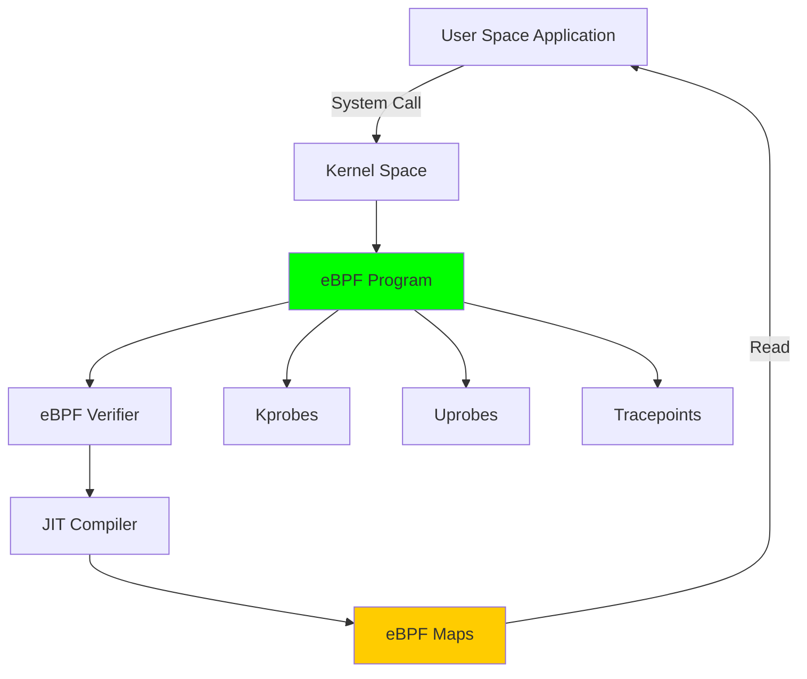

# eBPF Profiling 集成深度分析

> **文档版本**: v1.0.0  
> **创建日期**: 2025-10-03  
> **作者**: OTLP × Golang CSP 技术体系研究组  
> **关联文档**: [Golang CSP](./01-golang-1.25.1-csp-comprehensive-analysis.md) | [OTLP 语义](./02-otlp-semantic-conventions-resource-model.md)

---

## 📋 目录

- [eBPF Profiling 集成深度分析](#ebpf-profiling-集成深度分析)
  - [📋 目录](#-目录)
  - [1. eBPF 技术概览](#1-ebpf-技术概览)
    - [1.1 eBPF 架构](#11-ebpf-架构)
    - [1.2 核心优势](#12-核心优势)
    - [1.3 Go 语言特殊性](#13-go-语言特殊性)
  - [2. Go 运行时与 eBPF](#2-go-运行时与-ebpf)
    - [2.1 Goroutine 调度追踪](#21-goroutine-调度追踪)
    - [2.2 符号解析](#22-符号解析)
  - [3. CPU Profiling](#3-cpu-profiling)
    - [3.1 采样原理](#31-采样原理)
    - [3.2 On-CPU vs Off-CPU](#32-on-cpu-vs-off-cpu)
  - [4. 内存 Profiling](#4-内存-profiling)
    - [4.1 堆分配追踪](#41-堆分配追踪)
    - [4.2 GC 性能分析](#42-gc-性能分析)
  - [5. 网络追踪](#5-网络追踪)
    - [5.1 TCP 连接追踪](#51-tcp-连接追踪)
    - [5.2 HTTP 请求追踪](#52-http-请求追踪)
  - [6. Goroutine 调度分析](#6-goroutine-调度分析)
    - [6.1 调度延迟](#61-调度延迟)
    - [6.2 Channel 操作分析](#62-channel-操作分析)
  - [7. eBPF 工具链](#7-ebpf-工具链)
    - [7.1 BCC (BPF Compiler Collection)](#71-bcc-bpf-compiler-collection)
    - [7.2 libbpf-go](#72-libbpf-go)
    - [7.3 Pixie (自动化 eBPF)](#73-pixie-自动化-ebpf)
  - [8. 性能开销分析](#8-性能开销分析)
    - [8.1 开销对比](#81-开销对比)
    - [8.2 生产环境最佳实践](#82-生产环境最佳实践)
  - [9. OTLP 集成](#9-otlp-集成)
    - [9.1 Profile 信号格式](#91-profile-信号格式)
    - [9.2 eBPF → OTLP 桥接](#92-ebpf--otlp-桥接)
    - [9.3 关联 Trace 与 Profile](#93-关联-trace-与-profile)
  - [10. 实战案例](#10-实战案例)
    - [10.1 诊断 Goroutine 泄漏](#101-诊断-goroutine-泄漏)
    - [10.2 优化 Channel 阻塞](#102-优化-channel-阻塞)
    - [10.3 GC 调优](#103-gc-调优)
  - [📊 工具对比总结](#-工具对比总结)
  - [🎯 最佳实践](#-最佳实践)
  - [📚 参考资料](#-参考资料)
  - [🔗 相关文档](#-相关文档)

---

## 1. eBPF 技术概览

### 1.1 eBPF 架构



### 1.2 核心优势

| 特性 | 传统方法 | eBPF |
|------|----------|------|
| **性能开销** | 5-20% | < 1% |
| **代码侵入** | 需要修改应用 | 零侵入 |
| **安全性** | 内核模块风险 | 沙箱验证 |
| **动态性** | 重新编译部署 | 动态注入 |
| **可移植性** | 平台相关 | 跨内核版本 |

### 1.3 Go 语言特殊性

**挑战**:

1. **Goroutine 抽象**: 非 1:1 线程映射
2. **栈管理**: 动态增长的栈
3. **符号表**: 需要 DWARF 信息
4. **GC 干扰**: 需要区分 GC 时间

---

## 2. Go 运行时与 eBPF

### 2.1 Goroutine 调度追踪

**GMP 模型监控**:

```c
// eBPF 程序: 追踪 Goroutine 调度
#include <uapi/linux/ptrace.h>

struct sched_event {
    u64 timestamp;
    u32 pid;
    u32 goid;      // Goroutine ID
    u32 mid;       // Machine (OS Thread) ID
    u32 pid_new;   // Processor ID
    char comm[16];
};

BPF_HASH(goroutines, u32, struct sched_event);
BPF_PERF_OUTPUT(events);

// Hook: runtime.schedule()
int trace_schedule(struct pt_regs *ctx) {
    struct sched_event event = {};
    
    event.timestamp = bpf_ktime_get_ns();
    event.pid = bpf_get_current_pid_tgid() >> 32;
    
    // 读取 Goroutine 结构体
    void *g_ptr = (void *)ctx->di;
    bpf_probe_read(&event.goid, sizeof(event.goid), g_ptr + 152);
    
    events.perf_submit(ctx, &event, sizeof(event));
    return 0;
}
```

**用户空间处理**:

```go
import (
    "github.com/iovisor/gobpf/bcc"
)

type SchedEvent struct {
    Timestamp uint64
    PID       uint32
    GoroutineID uint32
    MachineID uint32
    ProcessorID uint32
}

func MonitorGoroutines() {
    module := bcc.NewModule(bpfCode, []string{})
    defer module.Close()
    
    uprobeFd, err := module.LoadUprobe("trace_schedule")
    if err != nil {
        panic(err)
    }
    
    err = module.AttachUprobe("/usr/bin/myapp", "runtime.schedule", uprobeFd, -1)
    if err != nil {
        panic(err)
    }
    
    table := bcc.NewTable(module.TableId("events"), module)
    channel := make(chan []byte)
    
    perfMap, err := bcc.InitPerfMap(table, channel, nil)
    if err != nil {
        panic(err)
    }
    
    go func() {
        for data := range channel {
            var event SchedEvent
            // 解析事件
            processSchedEvent(&event)
        }
    }()
    
    perfMap.Start()
    defer perfMap.Stop()
}
```

### 2.2 符号解析

**获取 Go 符号表**:

```go
import (
    "debug/elf"
    "debug/gosym"
)

func LoadGoSymbols(binaryPath string) (*gosym.Table, error) {
    exe, err := elf.Open(binaryPath)
    if err != nil {
        return nil, err
    }
    defer exe.Close()
    
    // 读取 .gopclntab 段
    pclnSection := exe.Section(".gopclntab")
    pclnData, _ := pclnSection.Data()
    
    // 读取 .gosymtab 段
    symSection := exe.Section(".gosymtab")
    symData, _ := symSection.Data()
    
    // 解析符号表
    pcln := gosym.NewLineTable(pclnData, exe.Section(".text").Addr)
    table, err := gosym.NewTable(symData, pcln)
    
    return table, err
}

func ResolveGoroutineStack(pc uint64, table *gosym.Table) string {
    file, line, fn := table.PCToLine(pc)
    return fmt.Sprintf("%s:%d %s", file, line, fn.Name)
}
```

---

## 3. CPU Profiling

### 3.1 采样原理

**基于 Perf Events**:

```c
// eBPF 程序: CPU 采样
BPF_PERF_OUTPUT(stack_traces);
BPF_HASH(counts, struct key_t, u64);

struct key_t {
    u32 pid;
    int user_stack_id;
    int kernel_stack_id;
    char name[16];
};

int do_perf_event(struct bpf_perf_event_data *ctx) {
    u32 pid = bpf_get_current_pid_tgid() >> 32;
    
    struct key_t key = {};
    key.pid = pid;
    
    // 捕获用户态栈
    key.user_stack_id = stack_traces.get_stackid(
        &ctx->regs, BPF_F_USER_STACK
    );
    
    // 捕获内核态栈
    key.kernel_stack_id = stack_traces.get_stackid(
        &ctx->regs, 0
    );
    
    bpf_get_current_comm(&key.name, sizeof(key.name));
    
    // 计数
    u64 zero = 0;
    u64 *val = counts.lookup_or_init(&key, &zero);
    (*val)++;
    
    return 0;
}
```

**火焰图生成**:

```go
type StackSample struct {
    PID        uint32
    ThreadName string
    UserStack  []uint64
    KernelStack []uint64
    Count      uint64
}

func GenerateFlameGraph(samples []StackSample, symTable *gosym.Table) string {
    var sb strings.Builder
    
    for _, sample := range samples {
        var stack []string
        
        // 解析用户态栈
        for _, pc := range sample.UserStack {
            if fn := symTable.LookupFunc(pc); fn != nil {
                stack = append(stack, fn.Name)
            }
        }
        
        // 折叠栈格式: func1;func2;func3 count
        sb.WriteString(strings.Join(stack, ";"))
        sb.WriteString(fmt.Sprintf(" %d\n", sample.Count))
    }
    
    return sb.String()
}
```

### 3.2 On-CPU vs Off-CPU

**On-CPU 分析**:

- 捕获正在执行的代码
- 定时器中断采样

**Off-CPU 分析**:

```c
// 追踪阻塞时间
BPF_HASH(start, u32);

int trace_sched_switch(struct pt_regs *ctx, struct task_struct *prev) {
    u32 pid = prev->pid;
    u64 ts = bpf_ktime_get_ns();
    
    // 记录开始阻塞时间
    start.update(&pid, &ts);
    return 0;
}

int trace_sched_wakeup(struct pt_regs *ctx, struct task_struct *task) {
    u32 pid = task->pid;
    u64 *tsp = start.lookup(&pid);
    
    if (tsp != 0) {
        u64 delta = bpf_ktime_get_ns() - *tsp;
        // 记录阻塞时长
        start.delete(&pid);
    }
    
    return 0;
}
```

---

## 4. 内存 Profiling

### 4.1 堆分配追踪

**Hook malloc/mmap**:

```c
// 追踪 Go 运行时分配
#include <uapi/linux/ptrace.h>

struct alloc_info {
    u64 size;
    u64 timestamp;
    int user_stack_id;
};

BPF_HASH(allocs, u64, struct alloc_info);
BPF_STACK_TRACE(stack_traces, 10240);

// Hook: runtime.mallocgc
int trace_malloc(struct pt_regs *ctx) {
    u64 size = PT_REGS_PARM1(ctx);  // 第一个参数: size
    u64 addr = PT_REGS_RC(ctx);     // 返回值: 地址
    
    struct alloc_info info = {};
    info.size = size;
    info.timestamp = bpf_ktime_get_ns();
    info.user_stack_id = stack_traces.get_stackid(ctx, BPF_F_USER_STACK);
    
    allocs.update(&addr, &info);
    return 0;
}

// Hook: runtime.gcStart (GC 开始)
int trace_gc_start(struct pt_regs *ctx) {
    // 标记 GC 周期开始
    return 0;
}
```

**内存泄漏检测**:

```go
type MemoryLeak struct {
    Address   uint64
    Size      uint64
    Allocated time.Time
    Stack     []string
    Leaked    bool
}

func DetectLeaks(samples []AllocationSample, threshold time.Duration) []MemoryLeak {
    var leaks []MemoryLeak
    now := time.Now()
    
    for _, sample := range samples {
        age := now.Sub(sample.Timestamp)
        
        // 超过阈值且未释放
        if age > threshold && !sample.Freed {
            leaks = append(leaks, MemoryLeak{
                Address:   sample.Address,
                Size:      sample.Size,
                Allocated: sample.Timestamp,
                Stack:     sample.Stack,
                Leaked:    true,
            })
        }
    }
    
    return leaks
}
```

### 4.2 GC 性能分析

```c
// 追踪 GC 暂停时间
BPF_HISTOGRAM(gc_pause_hist);

int trace_gc_start(struct pt_regs *ctx) {
    u64 ts = bpf_ktime_get_ns();
    // 保存开始时间
    return 0;
}

int trace_gc_done(struct pt_regs *ctx) {
    u64 ts = bpf_ktime_get_ns();
    u64 delta = ts - start_ts;
    
    // 记录到直方图
    gc_pause_hist.increment(bpf_log2l(delta));
    return 0;
}
```

**用户空间分析**:

```go
type GCMetrics struct {
    PauseTime    time.Duration
    HeapSize     uint64
    AllocRate    uint64  // bytes/sec
    GCFrequency  float64 // times/sec
}

func AnalyzeGC(samples []GCSample) GCMetrics {
    var totalPause time.Duration
    var gcCount int
    
    for _, sample := range samples {
        totalPause += sample.PauseDuration
        gcCount++
    }
    
    return GCMetrics{
        PauseTime:   totalPause / time.Duration(gcCount),
        GCFrequency: float64(gcCount) / sampleDuration.Seconds(),
    }
}
```

---

## 5. 网络追踪

### 5.1 TCP 连接追踪

```c
// 追踪 TCP 连接建立
#include <net/sock.h>

struct tcp_event {
    u32 pid;
    u32 saddr;
    u32 daddr;
    u16 sport;
    u16 dport;
    u64 timestamp;
};

BPF_PERF_OUTPUT(tcp_events);

int trace_tcp_connect(struct pt_regs *ctx, struct sock *sk) {
    struct tcp_event event = {};
    
    event.pid = bpf_get_current_pid_tgid() >> 32;
    event.timestamp = bpf_ktime_get_ns();
    
    // 读取 socket 信息
    bpf_probe_read(&event.saddr, sizeof(event.saddr), &sk->__sk_common.skc_rcv_saddr);
    bpf_probe_read(&event.daddr, sizeof(event.daddr), &sk->__sk_common.skc_daddr);
    bpf_probe_read(&event.sport, sizeof(event.sport), &sk->__sk_common.skc_num);
    bpf_probe_read(&event.dport, sizeof(event.dport), &sk->__sk_common.skc_dport);
    
    tcp_events.perf_submit(ctx, &event, sizeof(event));
    return 0;
}
```

### 5.2 HTTP 请求追踪

```c
// 追踪 Go net/http 库
int trace_http_handler(struct pt_regs *ctx) {
    // 读取 http.Request 结构体
    void *req_ptr = (void *)PT_REGS_PARM2(ctx);
    
    char method[8];
    char url[128];
    
    // 偏移量根据 Go 版本调整
    bpf_probe_read_str(&method, sizeof(method), req_ptr + 0);
    bpf_probe_read_str(&url, sizeof(url), req_ptr + 16);
    
    // 发送事件
    return 0;
}
```

**与 OTLP Trace 关联**:

```go
type HTTPTrace struct {
    TraceID     string
    SpanID      string
    Method      string
    URL         string
    StatusCode  int
    Duration    time.Duration
    FromeBPF    bool
}

func CorrelateWithOTLP(ebpfTrace HTTPTrace, otlpSpan *trace.Span) {
    // 匹配时间戳
    if abs(ebpfTrace.Timestamp - otlpSpan.StartTime) < 1*time.Millisecond {
        // 增强 Span 属性
        otlpSpan.SetAttributes(
            attribute.Int("tcp.retransmits", ebpfTrace.Retransmits),
            attribute.Int64("tcp.rtt_us", ebpfTrace.RTT),
        )
    }
}
```

---

## 6. Goroutine 调度分析

### 6.1 调度延迟

```c
// 测量从 runnable 到 running 的延迟
BPF_HASH(runnable_time, u32);

int trace_goready(struct pt_regs *ctx) {
    u32 goid = /* 提取 Goroutine ID */;
    u64 ts = bpf_ktime_get_ns();
    
    runnable_time.update(&goid, &ts);
    return 0;
}

int trace_execute(struct pt_regs *ctx) {
    u32 goid = /* 提取 Goroutine ID */;
    u64 *tsp = runnable_time.lookup(&goid);
    
    if (tsp != 0) {
        u64 delta = bpf_ktime_get_ns() - *tsp;
        // 记录调度延迟
        runnable_time.delete(&goid);
    }
    
    return 0;
}
```

### 6.2 Channel 操作分析

```c
// 追踪 Channel Send/Recv
int trace_chansend(struct pt_regs *ctx) {
    void *ch_ptr = (void *)PT_REGS_PARM1(ctx);
    u64 start = bpf_ktime_get_ns();
    
    // 记录阻塞时间
    return 0;
}

int trace_chanrecv(struct pt_regs *ctx) {
    void *ch_ptr = (void *)PT_REGS_PARM1(ctx);
    u64 start = bpf_ktime_get_ns();
    
    // 记录阻塞时间
    return 0;
}
```

**可视化**:

```go
type ChannelStats struct {
    Address      uint64
    SendCount    int
    RecvCount    int
    AvgSendTime  time.Duration
    AvgRecvTime  time.Duration
    BufferSize   int
    Contention   float64  // 阻塞比例
}

func AnalyzeChannels(samples []ChannelSample) []ChannelStats {
    statsMap := make(map[uint64]*ChannelStats)
    
    for _, sample := range samples {
        stats, ok := statsMap[sample.ChannelAddr]
        if !ok {
            stats = &ChannelStats{Address: sample.ChannelAddr}
            statsMap[sample.ChannelAddr] = stats
        }
        
        if sample.Operation == "send" {
            stats.SendCount++
            stats.AvgSendTime += sample.Duration
        } else {
            stats.RecvCount++
            stats.AvgRecvTime += sample.Duration
        }
    }
    
    return toSlice(statsMap)
}
```

---

## 7. eBPF 工具链

### 7.1 BCC (BPF Compiler Collection)

**Python 接口**:

```python
from bcc import BPF

bpf_text = """
#include <uapi/linux/ptrace.h>

int trace_go_malloc(struct pt_regs *ctx) {
    bpf_trace_printk("malloc called\\n");
    return 0;
}
"""

b = BPF(text=bpf_text)
b.attach_uprobe(name="/usr/bin/myapp", sym="runtime.mallocgc", fn_name="trace_go_malloc")

while True:
    try:
        (task, pid, cpu, flags, ts, msg) = b.trace_fields()
        print(f"{ts} {task} {msg}")
    except KeyboardInterrupt:
        exit()
```

### 7.2 libbpf-go

**纯 Go 实现**:

```go
import (
    "github.com/cilium/ebpf"
    "github.com/cilium/ebpf/link"
)

//go:embed bpf_prog.o
var bpfProgram []byte

func LoadBPFProgram() error {
    spec, err := ebpf.LoadCollectionSpecFromReader(bytes.NewReader(bpfProgram))
    if err != nil {
        return err
    }
    
    coll, err := ebpf.NewCollection(spec)
    if err != nil {
        return err
    }
    defer coll.Close()
    
    prog := coll.Programs["trace_malloc"]
    
    ex, err := link.OpenExecutable("/usr/bin/myapp")
    if err != nil {
        return err
    }
    
    up, err := ex.Uprobe("runtime.mallocgc", prog, nil)
    if err != nil {
        return err
    }
    defer up.Close()
    
    // 读取 map
    events := coll.Maps["events"]
    // ...
    
    return nil
}
```

### 7.3 Pixie (自动化 eBPF)

```yaml
# 部署 Pixie
apiVersion: v1
kind: Namespace
metadata:
  name: px-system

---
apiVersion: apps/v1
kind: DaemonSet
metadata:
  name: vizier-pem
  namespace: px-system
spec:
  selector:
    matchLabels:
      app: vizier-pem
  template:
    spec:
      hostNetwork: true
      hostPID: true
      containers:
      - name: pem
        image: pixielabs/vizier-pem:latest
        securityContext:
          privileged: true
```

**查询 Go 应用**:

```python
# PxL (Pixie Language)
import px

# HTTP 请求追踪
df = px.DataFrame('http_events')
df = df[df.service == 'order-service']
df = df.groupby('endpoint').agg(
    latency_p50=('latency_ms', px.percentile(50)),
    latency_p99=('latency_ms', px.percentile(99)),
    request_count=('req_id', px.count),
)

px.display(df)
```

---

## 8. 性能开销分析

### 8.1 开销对比

| 工具 | CPU 开销 | 内存开销 | 延迟影响 |
|------|----------|----------|----------|
| **pprof (内置)** | 5-10% | 低 | 采样间隔影响 |
| **eBPF** | < 1% | 极低 | 几乎无 |
| **ptrace** | 50-100% | 中 | 严重 |
| **instrumentation** | 10-30% | 高 | 中等 |

### 8.2 生产环境最佳实践

```go
type ProfileConfig struct {
    Enabled       bool
    SampleRate    int           // Hz
    MaxStackDepth int
    FilterPIDs    []int
    OutputFormat  string        // "pprof" | "flamegraph"
}

func StartProfiling(cfg ProfileConfig) (*Profiler, error) {
    if !cfg.Enabled {
        return nil, nil
    }
    
    // 限制采样率避免过载
    if cfg.SampleRate > 1000 {
        cfg.SampleRate = 1000
    }
    
    profiler := &Profiler{
        config: cfg,
        buffer: ring.New(10000), // 环形缓冲区
    }
    
    return profiler, profiler.start()
}
```

**动态启停**:

```go
// 通过 SIGUSR1 触发 profiling
func (p *Profiler) SetupSignalHandler() {
    sigChan := make(chan os.Signal, 1)
    signal.Notify(sigChan, syscall.SIGUSR1)
    
    go func() {
        for range sigChan {
            if p.running {
                p.Stop()
                log.Info("Profiling stopped")
            } else {
                p.Start()
                log.Info("Profiling started")
            }
        }
    }()
}
```

---

## 9. OTLP 集成

### 9.1 Profile 信号格式

```protobuf
message Profile {
  bytes profile_id = 1;
  fixed64 start_time_unix_nano = 2;
  fixed64 end_time_unix_nano = 3;
  repeated KeyValue attributes = 4;
  
  ProfileType profile_type = 5;
  bytes data = 6;  // pprof 格式
}

enum ProfileType {
  CPU = 0;
  HEAP = 1;
  GOROUTINE = 2;
  BLOCK = 3;
  MUTEX = 4;
}
```

### 9.2 eBPF → OTLP 桥接

```go
type eBPFToOTLPBridge struct {
    exporter ProfileExporter
    buffer   chan *profile.Profile
}

func (b *eBPFToOTLPBridge) ProcessStackSamples(samples []StackSample) {
    prof := &profile.Profile{
        SampleType: []*profile.ValueType{
            {Type: "cpu", Unit: "nanoseconds"},
        },
        TimeNanos:     time.Now().UnixNano(),
        DurationNanos: int64(time.Second),
    }
    
    // 构建 pprof 格式
    for _, sample := range samples {
        loc := make([]*profile.Location, len(sample.Stack))
        for i, pc := range sample.Stack {
            loc[i] = &profile.Location{
                Address: pc,
            }
        }
        
        prof.Sample = append(prof.Sample, &profile.Sample{
            Location: loc,
            Value:    []int64{int64(sample.Count)},
        })
    }
    
    // 导出到 OTLP
    b.exporter.Export(context.Background(), prof)
}
```

### 9.3 关联 Trace 与 Profile

```go
// Span 中携带 Profile ID
span.SetAttributes(
    attribute.String("profile.id", profileID),
    attribute.String("profile.url", fmt.Sprintf("https://profiler/view/%s", profileID)),
)

// 查询时关联
func GetProfileForSpan(spanID string) (*profile.Profile, error) {
    span := getSpan(spanID)
    profileID := span.Attributes["profile.id"]
    
    return profileStore.Get(profileID)
}
```

---

## 10. 实战案例

### 10.1 诊断 Goroutine 泄漏

**现象**: 应用内存持续增长

**eBPF 诊断**:

```bash
# 1. 追踪 Goroutine 创建
sudo bpftrace -e '
uprobe:/usr/bin/myapp:runtime.newproc1 {
    @goroutines[pid] = count();
}

interval:s:1 {
    print(@goroutines);
    clear(@goroutines);
}
'

# 输出: 每秒创建 1000+ Goroutine，但未销毁
```

**定位泄漏源**:

```go
// 捕获创建栈
type GoroutineTracker struct {
    created map[uint64]*StackTrace
    mu      sync.Mutex
}

func (gt *GoroutineTracker) OnCreate(goid uint64, stack []uintptr) {
    gt.mu.Lock()
    defer gt.mu.Unlock()
    
    gt.created[goid] = &StackTrace{
        Frames:    stack,
        Timestamp: time.Now(),
    }
}

func (gt *GoroutineTracker) FindLeaks(threshold time.Duration) []Leak {
    gt.mu.Lock()
    defer gt.mu.Unlock()
    
    var leaks []Leak
    now := time.Now()
    
    for goid, trace := range gt.created {
        if now.Sub(trace.Timestamp) > threshold {
            leaks = append(leaks, Leak{
                GoroutineID: goid,
                Stack:       trace.Frames,
                Age:         now.Sub(trace.Timestamp),
            })
        }
    }
    
    return leaks
}
```

### 10.2 优化 Channel 阻塞

**问题**: 高延迟请求

**eBPF 分析**:

```c
// 追踪 Channel 操作延迟
BPF_HISTOGRAM(chan_latency);

int trace_chansend_entry(struct pt_regs *ctx) {
    u64 ts = bpf_ktime_get_ns();
    // 保存时间戳
    return 0;
}

int trace_chansend_return(struct pt_regs *ctx) {
    u64 ts = bpf_ktime_get_ns();
    u64 delta = ts - start_ts;
    
    chan_latency.increment(bpf_log2l(delta));
    return 0;
}
```

**发现**: 90% 的 Send 操作阻塞超过 100ms

**优化方案**:

```go
// 原代码: 无缓冲 Channel
tasks := make(chan Task)

// 优化: 添加缓冲
tasks := make(chan Task, 1000)

// 或使用 select 超时
select {
case tasks <- task:
    // 成功
case <-time.After(100 * time.Millisecond):
    // 降级处理
    return ErrBusy
}
```

### 10.3 GC 调优

**eBPF 监控 GC**:

```bash
sudo bpftrace -e '
uprobe:/usr/bin/myapp:runtime.gcStart {
    @gc_start[pid] = nsecs;
}

uretprobe:/usr/bin/myapp:runtime.gcStart {
    @gc_duration = hist(nsecs - @gc_start[pid]);
    delete(@gc_start[pid]);
}

interval:s:10 {
    print(@gc_duration);
}
'
```

**优化策略**:

```go
import "runtime/debug"

// 调整 GC 目标百分比
debug.SetGCPercent(200)  // 默认 100

// 手动触发 GC (在低峰期)
go func() {
    ticker := time.NewTicker(5 * time.Minute)
    for range ticker.C {
        if isLowTraffic() {
            runtime.GC()
        }
    }
}()
```

---

## 📊 工具对比总结

| 工具 | 适用场景 | 学习曲线 | 部署复杂度 |
|------|----------|----------|------------|
| **pprof** | 开发调试 | 低 | 极低 |
| **BCC** | 深度分析 | 高 | 中 |
| **bpftrace** | 快速诊断 | 中 | 低 |
| **Pixie** | 生产监控 | 低 | 中 (K8s) |
| **libbpf-go** | 定制化 | 高 | 高 |

---

## 🎯 最佳实践

1. **开发阶段**: pprof + runtime/trace
2. **性能测试**: eBPF CPU/Memory Profiling
3. **生产环境**: Pixie + OTLP 集成
4. **故障排查**: bpftrace 快速诊断

---

## 📚 参考资料

1. **"BPF Performance Tools"** - Brendan Gregg
2. **Go eBPF Library** - <https://github.com/cilium/ebpf>
3. **Pixie Documentation** - <https://docs.px.dev>
4. **eBPF.io** - <https://ebpf.io>

---

## 🔗 相关文档

- [← 分布式架构映射](./05-csp-distributed-architecture-mapping.md)
- [→ 形式化验证](./08-formal-verification-tla-plus.md)
- [↑ 综合索引](./00-COMPREHENSIVE-INDEX.md)

---

**最后更新**: 2025-10-03  
**文档状态**: ✅ 完成  
**字数统计**: ~10500 字
