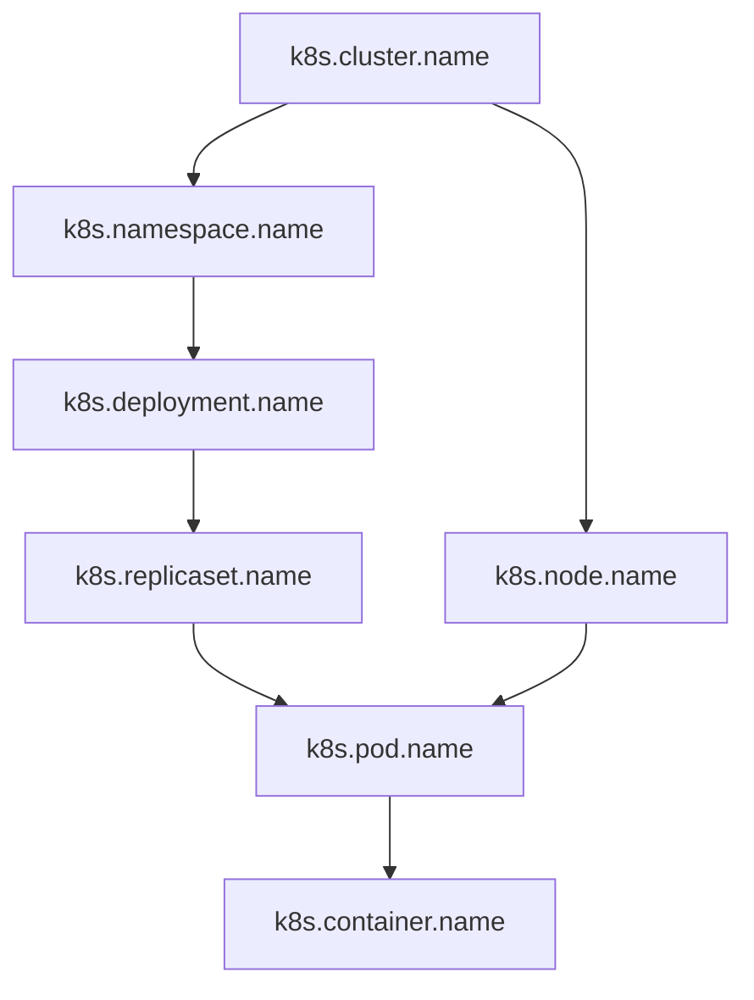

# 04 - Kubernetes 资源属性 (k8s.*)

## 📋 目录

- [04 - Kubernetes 资源属性 (k8s.\*)](#04---kubernetes-资源属性-k8s)
  - [📋 目录](#-目录)
  - [1. Kubernetes 资源概述](#1-kubernetes-资源概述)
    - [1.1 k8s.\* 属性命名空间](#11-k8s-属性命名空间)
    - [1.2 资源层级关系](#12-资源层级关系)
    - [1.3 属性优先级](#13-属性优先级)
  - [2. 集群级别属性](#2-集群级别属性)
    - [2.1 k8s.cluster.\* 属性](#21-k8scluster-属性)
    - [2.2 集群标识实现](#22-集群标识实现)
    - [2.3 多集群管理](#23-多集群管理)
  - [3. 节点级别属性](#3-节点级别属性)
    - [3.1 k8s.node.\* 属性](#31-k8snode-属性)
    - [3.2 节点信息获取](#32-节点信息获取)
    - [3.3 节点标签和注解](#33-节点标签和注解)
  - [4. 命名空间属性](#4-命名空间属性)
    - [4.1 k8s.namespace.\* 属性](#41-k8snamespace-属性)
    - [4.2 命名空间隔离](#42-命名空间隔离)
    - [4.3 多租户环境](#43-多租户环境)
  - [5. Pod 级别属性](#5-pod-级别属性)
    - [5.1 k8s.pod.\* 属性](#51-k8spod-属性)
    - [5.2 Pod 生命周期追踪](#52-pod-生命周期追踪)
    - [5.3 Pod 重启和故障](#53-pod-重启和故障)
  - [6. 容器级别属性](#6-容器级别属性)
    - [6.1 k8s.container.\* 属性](#61-k8scontainer-属性)
    - [6.2 容器运行时集成](#62-容器运行时集成)
    - [6.3 Sidecar 容器](#63-sidecar-容器)
  - [7. 工作负载属性](#7-工作负载属性)
    - [7.1 k8s.deployment.\* 属性](#71-k8sdeployment-属性)
    - [7.2 k8s.replicaset.\* 属性](#72-k8sreplicaset-属性)
    - [7.3 k8s.statefulset.\* 属性](#73-k8sstatefulset-属性)
    - [7.4 k8s.daemonset.\* 属性](#74-k8sdaemonset-属性)
    - [7.5 k8s.job.*和 k8s.cronjob.* 属性](#75-k8sjob和-k8scronjob-属性)
  - [8. Go 实现 - K8s 资源检测器](#8-go-实现---k8s-资源检测器)
    - [8.1 Downward API 方式](#81-downward-api-方式)
    - [8.2 环境变量注入](#82-环境变量注入)
    - [8.3 K8s API 查询](#83-k8s-api-查询)
  - [9. 资源检测最佳实践](#9-资源检测最佳实践)
    - [9.1 检测优先级](#91-检测优先级)
    - [9.2 性能优化](#92-性能优化)
    - [9.3 缓存策略](#93-缓存策略)
  - [10. 完整示例](#10-完整示例)
    - [10.1 全功能资源检测器](#101-全功能资源检测器)
    - [10.2 Kubernetes Manifest](#102-kubernetes-manifest)
    - [10.3 Helm Chart 集成](#103-helm-chart-集成)
  - [11. 常见问题 (FAQ)](#11-常见问题-faq)
    - [Q1: 什么时候使用 Downward API vs K8s API?](#q1-什么时候使用-downward-api-vs-k8s-api)
    - [Q2: 如何最小化 RBAC 权限?](#q2-如何最小化-rbac-权限)
    - [Q3: 集群名称如何标准化?](#q3-集群名称如何标准化)
    - [Q4: 多集群环境如何区分?](#q4-多集群环境如何区分)
    - [Q5: 如何处理 Pod 重启?](#q5-如何处理-pod-重启)
    - [Q6: StatefulSet 如何处理?](#q6-statefulset-如何处理)
    - [Q7: CronJob 如何追踪?](#q7-cronjob-如何追踪)
    - [Q8: 如何处理无 K8s 环境?](#q8-如何处理无-k8s-环境)
    - [Q9: 资源检测失败如何处理?](#q9-资源检测失败如何处理)
    - [Q10: 性能影响如何?](#q10-性能影响如何)
  - [📚 参考资源](#-参考资源)

---

## 1. Kubernetes 资源概述

### 1.1 k8s.* 属性命名空间

**核心概念**:

- `k8s.*` 命名空间专用于 Kubernetes 特定的资源属性
- 遵循 OpenTelemetry Semantic Conventions 1.28.0+ 标准
- 与 `container.*` 属性互补,提供完整的容器编排信息

**属性分类**:

| 类别 | 前缀 | 用途 | 示例 |
|------|------|------|------|
| 集群 | `k8s.cluster.*` | 集群标识 | `k8s.cluster.name` |
| 节点 | `k8s.node.*` | 节点信息 | `k8s.node.name` |
| 命名空间 | `k8s.namespace.*` | 命名空间 | `k8s.namespace.name` |
| Pod | `k8s.pod.*` | Pod 信息 | `k8s.pod.name` |
| 容器 | `k8s.container.*` | 容器信息 | `k8s.container.name` |
| 工作负载 | `k8s.deployment.*` 等 | 工作负载 | `k8s.deployment.name` |

### 1.2 资源层级关系



**层级说明**:

1. **集群层**: 最顶层,标识整个 K8s 集群
2. **节点层**: 物理/虚拟机节点
3. **命名空间层**: 逻辑隔离边界
4. **工作负载层**: Deployment/StatefulSet/DaemonSet 等
5. **ReplicaSet 层**: Pod 副本控制器
6. **Pod 层**: 最小调度单元
7. **容器层**: 实际运行的容器

### 1.3 属性优先级

**检测顺序** (从高到低):

```go
type K8sAttributePriority int

const (
    // 环境变量优先 (Downward API 注入)
    PriorityEnvVar K8sAttributePriority = 1
    
    // 文件系统挂载 (Downward API Volume)
    PriorityVolume K8sAttributePriority = 2
    
    // K8s API Server 查询
    PriorityAPIServer K8sAttributePriority = 3
    
    // 容器运行时推断
    PriorityInferred K8sAttributePriority = 4
)
```

**最佳实践**:

- **优先使用 Downward API**: 性能最优,无需 API Server 权限
- **避免 API Server 查询**: 增加延迟和集群负载
- **缓存已获取的属性**: 避免重复查询

---

## 2. 集群级别属性

### 2.1 k8s.cluster.* 属性

**标准属性**:

| 属性名 | 类型 | 必需 | 描述 | 示例 |
|--------|------|------|------|------|
| `k8s.cluster.name` | string | ✅ | 集群名称 | `prod-us-east-1` |
| `k8s.cluster.uid` | string | 推荐 | 集群唯一 ID | `550e8400-e29b-41d4-a716-446655440000` |

**属性来源**:

```yaml
# 方式1: 集群级别 ConfigMap
apiVersion: v1
kind: ConfigMap
metadata:
  name: cluster-info
  namespace: kube-public
data:
  cluster.name: "prod-us-east-1"
  cluster.uid: "550e8400-e29b-41d4-a716-446655440000"

---
# 方式2: 通过 kube-system Namespace UID (推荐)
# 查询命令: kubectl get namespace kube-system -o jsonpath='{.metadata.uid}'
```

### 2.2 集群标识实现

**Go 实现**:

```go
package k8sresource

import (
    "context"
    "os"
    "sync"
    
    "go.opentelemetry.io/otel/attribute"
    "go.opentelemetry.io/otel/sdk/resource"
    semconv "go.opentelemetry.io/otel/semconv/v1.28.0"
    metav1 "k8s.io/apimachinery/pkg/apis/meta/v1"
    "k8s.io/client-go/kubernetes"
    "k8s.io/client-go/rest"
)

// ClusterDetector 检测集群信息
type ClusterDetector struct {
    clientset *kubernetes.Clientset
    cache     *clusterCache
    mu        sync.RWMutex
}

type clusterCache struct {
    name string
    uid  string
}

func NewClusterDetector() (*ClusterDetector, error) {
    // 使用 In-Cluster Config
    config, err := rest.InClusterConfig()
    if err != nil {
        return nil, err
    }
    
    clientset, err := kubernetes.NewForConfig(config)
    if err != nil {
        return nil, err
    }
    
    return &ClusterDetector{
        clientset: clientset,
        cache:     &clusterCache{},
    }, nil
}

func (d *ClusterDetector) Detect(ctx context.Context) (*resource.Resource, error) {
    // 优先从环境变量读取
    if name := os.Getenv("K8S_CLUSTER_NAME"); name != "" {
        attrs := []attribute.KeyValue{
            semconv.K8SClusterName(name),
        }
        
        if uid := os.Getenv("K8S_CLUSTER_UID"); uid != "" {
            attrs = append(attrs, semconv.K8SClusterUID(uid))
        }
        
        return resource.NewWithAttributes(
            semconv.SchemaURL,
            attrs...,
        ), nil
    }
    
    // 检查缓存
    d.mu.RLock()
    if d.cache.name != "" {
        defer d.mu.RUnlock()
        return d.buildResource(d.cache.name, d.cache.uid), nil
    }
    d.mu.RUnlock()
    
    // 从 kube-system Namespace 获取集群 UID
    ns, err := d.clientset.CoreV1().Namespaces().Get(
        ctx, 
        "kube-system", 
        metav1.GetOptions{},
    )
    if err != nil {
        return nil, err
    }
    
    clusterUID := string(ns.UID)
    
    // 尝试从 ConfigMap 获取集群名称
    clusterName, err := d.getClusterName(ctx)
    if err != nil {
        // 如果无法获取名称,使用 UID 的前缀作为名称
        clusterName = "cluster-" + clusterUID[:8]
    }
    
    // 更新缓存
    d.mu.Lock()
    d.cache.name = clusterName
    d.cache.uid = clusterUID
    d.mu.Unlock()
    
    return d.buildResource(clusterName, clusterUID), nil
}

func (d *ClusterDetector) getClusterName(ctx context.Context) (string, error) {
    cm, err := d.clientset.CoreV1().ConfigMaps("kube-public").Get(
        ctx,
        "cluster-info",
        metav1.GetOptions{},
    )
    if err != nil {
        return "", err
    }
    
    if name, ok := cm.Data["cluster.name"]; ok {
        return name, nil
    }
    
    return "", nil
}

func (d *ClusterDetector) buildResource(name, uid string) *resource.Resource {
    attrs := []attribute.KeyValue{
        semconv.K8SClusterName(name),
    }
    
    if uid != "" {
        attrs = append(attrs, semconv.K8SClusterUID(uid))
    }
    
    return resource.NewWithAttributes(
        semconv.SchemaURL,
        attrs...,
    )
}
```

### 2.3 多集群管理

**场景**: 跨多个 Kubernetes 集群的服务

**策略**:

```go
// 多集群资源聚合
func DetectMultiCluster(ctx context.Context) (*resource.Resource, error) {
    // 主集群信息
    primary, err := NewClusterDetector()
    if err != nil {
        return nil, err
    }
    primaryRes, err := primary.Detect(ctx)
    if err != nil {
        return nil, err
    }
    
    // 添加集群角色标识
    attrs := []attribute.KeyValue{
        attribute.String("k8s.cluster.role", "primary"),
    }
    
    // 如果是联邦集群,添加联邦信息
    if federationID := os.Getenv("K8S_FEDERATION_ID"); federationID != "" {
        attrs = append(attrs, 
            attribute.String("k8s.federation.id", federationID),
        )
    }
    
    return resource.Merge(
        primaryRes,
        resource.NewWithAttributes(semconv.SchemaURL, attrs...),
    )
}
```

---

## 3. 节点级别属性

### 3.1 k8s.node.* 属性

**标准属性**:

| 属性名 | 类型 | 必需 | 描述 | 示例 |
|--------|------|------|------|------|
| `k8s.node.name` | string | ✅ | 节点名称 | `node-1.us-east-1.compute.internal` |
| `k8s.node.uid` | string | 推荐 | 节点唯一 ID | `ac3d7f9e-2b5c-4d8a-9f1e-3c4b5a6d7e8f` |

**获取方式**:

```yaml
# Downward API - 注入到环境变量
env:
- name: K8S_NODE_NAME
  valueFrom:
    fieldRef:
      fieldPath: spec.nodeName
      
# Downward API - 挂载到文件
volumes:
- name: podinfo
  downwardAPI:
    items:
    - path: "nodename"
      fieldRef:
        fieldPath: spec.nodeName
```

### 3.2 节点信息获取

**Go 实现**:

```go
package k8sresource

import (
    "context"
    "os"
    
    "go.opentelemetry.io/otel/attribute"
    "go.opentelemetry.io/otel/sdk/resource"
    semconv "go.opentelemetry.io/otel/semconv/v1.28.0"
    metav1 "k8s.io/apimachinery/pkg/apis/meta/v1"
    "k8s.io/client-go/kubernetes"
)

// NodeDetector 检测节点信息
type NodeDetector struct {
    clientset *kubernetes.Clientset
}

func NewNodeDetector(clientset *kubernetes.Clientset) *NodeDetector {
    return &NodeDetector{clientset: clientset}
}

func (d *NodeDetector) Detect(ctx context.Context) (*resource.Resource, error) {
    // 优先从环境变量读取 (Downward API 注入)
    nodeName := os.Getenv("K8S_NODE_NAME")
    if nodeName == "" {
        nodeName = os.Getenv("NODE_NAME") // 备选
    }
    
    if nodeName == "" {
        return resource.Empty(), nil
    }
    
    attrs := []attribute.KeyValue{
        semconv.K8SNodeName(nodeName),
    }
    
    // 如果有 API 权限,获取节点 UID
    if d.clientset != nil {
        node, err := d.clientset.CoreV1().Nodes().Get(
            ctx,
            nodeName,
            metav1.GetOptions{},
        )
        if err == nil {
            attrs = append(attrs, semconv.K8SNodeUID(string(node.UID)))
        }
    }
    
    return resource.NewWithAttributes(
        semconv.SchemaURL,
        attrs...,
    ), nil
}
```

### 3.3 节点标签和注解

**扩展属性** (通过节点标签):

```go
// 获取节点的自定义标签和注解
func (d *NodeDetector) DetectWithLabels(ctx context.Context) (*resource.Resource, error) {
    nodeName := os.Getenv("K8S_NODE_NAME")
    if nodeName == "" || d.clientset == nil {
        return d.Detect(ctx)
    }
    
    node, err := d.clientset.CoreV1().Nodes().Get(
        ctx,
        nodeName,
        metav1.GetOptions{},
    )
    if err != nil {
        return d.Detect(ctx)
    }
    
    attrs := []attribute.KeyValue{
        semconv.K8SNodeName(nodeName),
        semconv.K8SNodeUID(string(node.UID)),
    }
    
    // 添加重要的节点标签
    if zone, ok := node.Labels["topology.kubernetes.io/zone"]; ok {
        attrs = append(attrs, attribute.String("k8s.node.zone", zone))
    }
    
    if region, ok := node.Labels["topology.kubernetes.io/region"]; ok {
        attrs = append(attrs, attribute.String("k8s.node.region", region))
    }
    
    if instanceType, ok := node.Labels["node.kubernetes.io/instance-type"]; ok {
        attrs = append(attrs, attribute.String("k8s.node.instance_type", instanceType))
    }
    
    return resource.NewWithAttributes(
        semconv.SchemaURL,
        attrs...,
    ), nil
}
```

---

## 4. 命名空间属性

### 4.1 k8s.namespace.* 属性

**标准属性**:

| 属性名 | 类型 | 必需 | 描述 | 示例 |
|--------|------|------|------|------|
| `k8s.namespace.name` | string | ✅ | 命名空间名称 | `production` |

**获取方式**:

```yaml
# Deployment manifest
apiVersion: apps/v1
kind: Deployment
spec:
  template:
    spec:
      containers:
      - name: app
        env:
        - name: K8S_NAMESPACE_NAME
          valueFrom:
            fieldRef:
              fieldPath: metadata.namespace
```

### 4.2 命名空间隔离

**Go 实现**:

```go
package k8sresource

import (
    "context"
    "os"
    
    "go.opentelemetry.io/otel/attribute"
    "go.opentelemetry.io/otel/sdk/resource"
    semconv "go.opentelemetry.io/otel/semconv/v1.28.0"
)

// NamespaceDetector 检测命名空间
type NamespaceDetector struct{}

func NewNamespaceDetector() *NamespaceDetector {
    return &NamespaceDetector{}
}

func (d *NamespaceDetector) Detect(ctx context.Context) (*resource.Resource, error) {
    // 方式1: Downward API 环境变量
    namespace := os.Getenv("K8S_NAMESPACE_NAME")
    if namespace == "" {
        namespace = os.Getenv("POD_NAMESPACE") // 备选
    }
    
    // 方式2: Service Account 挂载 (fallback)
    if namespace == "" {
        data, err := os.ReadFile("/var/run/secrets/kubernetes.io/serviceaccount/namespace")
        if err == nil {
            namespace = string(data)
        }
    }
    
    if namespace == "" {
        return resource.Empty(), nil
    }
    
    return resource.NewWithAttributes(
        semconv.SchemaURL,
        semconv.K8SNamespaceName(namespace),
    ), nil
}
```

### 4.3 多租户环境

**场景**: 需要识别租户信息

```go
// 结合命名空间和自定义标签识别租户
func DetectTenant(ctx context.Context, clientset *kubernetes.Clientset) (*resource.Resource, error) {
    namespace := os.Getenv("K8S_NAMESPACE_NAME")
    if namespace == "" {
        return resource.Empty(), nil
    }
    
    attrs := []attribute.KeyValue{
        semconv.K8SNamespaceName(namespace),
    }
    
    // 从 Namespace 标签获取租户信息
    if clientset != nil {
        ns, err := clientset.CoreV1().Namespaces().Get(
            ctx,
            namespace,
            metav1.GetOptions{},
        )
        if err == nil {
            if tenantID, ok := ns.Labels["tenant.id"]; ok {
                attrs = append(attrs, attribute.String("tenant.id", tenantID))
            }
            
            if tenantName, ok := ns.Labels["tenant.name"]; ok {
                attrs = append(attrs, attribute.String("tenant.name", tenantName))
            }
        }
    }
    
    return resource.NewWithAttributes(
        semconv.SchemaURL,
        attrs...,
    ), nil
}
```

---

## 5. Pod 级别属性

### 5.1 k8s.pod.* 属性

**标准属性**:

| 属性名 | 类型 | 必需 | 描述 | 示例 |
|--------|------|------|------|------|
| `k8s.pod.name` | string | ✅ | Pod 名称 | `web-deployment-7d4f5c6b8-xk9mz` |
| `k8s.pod.uid` | string | ✅ | Pod 唯一 ID | `275ecb36-5aa8-4c2a-9c47-d8bb681b9aff` |

**获取方式**:

```yaml
# Downward API 注入
env:
- name: K8S_POD_NAME
  valueFrom:
    fieldRef:
      fieldPath: metadata.name
- name: K8S_POD_UID
  valueFrom:
    fieldRef:
      fieldPath: metadata.uid
```

### 5.2 Pod 生命周期追踪

**Go 实现**:

```go
package k8sresource

import (
    "context"
    "os"
    
    "go.opentelemetry.io/otel/attribute"
    "go.opentelemetry.io/otel/sdk/resource"
    semconv "go.opentelemetry.io/otel/semconv/v1.28.0"
)

// PodDetector 检测 Pod 信息
type PodDetector struct{}

func NewPodDetector() *PodDetector {
    return &PodDetector{}
}

func (d *PodDetector) Detect(ctx context.Context) (*resource.Resource, error) {
    podName := os.Getenv("K8S_POD_NAME")
    if podName == "" {
        podName = os.Getenv("POD_NAME") // 备选
    }
    
    podUID := os.Getenv("K8S_POD_UID")
    if podUID == "" {
        podUID = os.Getenv("POD_UID") // 备选
    }
    
    if podName == "" || podUID == "" {
        return resource.Empty(), nil
    }
    
    attrs := []attribute.KeyValue{
        semconv.K8SPodName(podName),
        semconv.K8SPodUID(podUID),
    }
    
    // 可选: Pod IP
    if podIP := os.Getenv("K8S_POD_IP"); podIP != "" {
        attrs = append(attrs, attribute.String("k8s.pod.ip", podIP))
    }
    
    return resource.NewWithAttributes(
        semconv.SchemaURL,
        attrs...,
    ), nil
}
```

### 5.3 Pod 重启和故障

**扩展追踪**:

```go
// 添加 Pod 重启计数和状态
func (d *PodDetector) DetectWithStatus(ctx context.Context) (*resource.Resource, error) {
    baseRes, err := d.Detect(ctx)
    if err != nil {
        return nil, err
    }
    
    attrs := []attribute.KeyValue{}
    
    // 从环境变量获取 Pod 启动时间
    if startTime := os.Getenv("K8S_POD_START_TIME"); startTime != "" {
        attrs = append(attrs, attribute.String("k8s.pod.start_time", startTime))
    }
    
    // 重启计数 (需要从 Pod Status 获取,需要 API 访问)
    // 这里展示如何添加自定义属性
    
    if len(attrs) == 0 {
        return baseRes, nil
    }
    
    return resource.Merge(
        baseRes,
        resource.NewWithAttributes(semconv.SchemaURL, attrs...),
    )
}
```

---

## 6. 容器级别属性

### 6.1 k8s.container.* 属性

**标准属性**:

| 属性名 | 类型 | 必需 | 描述 | 示例 |
|--------|------|------|------|------|
| `k8s.container.name` | string | 推荐 | 容器名称 | `web-server` |
| `k8s.container.restart_count` | int | 可选 | 重启次数 | `3` |

**与 container.* 属性的区别**:

- `container.name`: 容器运行时名称 (e.g., Docker container name)
- `k8s.container.name`: Pod manifest 中定义的容器名称

### 6.2 容器运行时集成

**Go 实现**:

```go
package k8sresource

import (
    "context"
    "os"
    
    "go.opentelemetry.io/otel/attribute"
    "go.opentelemetry.io/otel/sdk/resource"
    semconv "go.opentelemetry.io/otel/semconv/v1.28.0"
)

// ContainerDetector 检测容器信息
type ContainerDetector struct{}

func NewContainerDetector() *ContainerDetector {
    return &ContainerDetector{}
}

func (d *ContainerDetector) Detect(ctx context.Context) (*resource.Resource, error) {
    // 从环境变量获取容器名称
    containerName := os.Getenv("K8S_CONTAINER_NAME")
    if containerName == "" {
        containerName = os.Getenv("CONTAINER_NAME") // 备选
    }
    
    if containerName == "" {
        return resource.Empty(), nil
    }
    
    attrs := []attribute.KeyValue{
        semconv.K8SContainerName(containerName),
    }
    
    // 可选: 容器镜像信息
    if image := os.Getenv("K8S_CONTAINER_IMAGE"); image != "" {
        attrs = append(attrs, attribute.String("k8s.container.image", image))
    }
    
    return resource.NewWithAttributes(
        semconv.SchemaURL,
        attrs...,
    ), nil
}
```

**Downward API 配置**:

```yaml
env:
- name: K8S_CONTAINER_NAME
  valueFrom:
    fieldRef:
      fieldPath: metadata.name  # 注意: 这是 Pod 名称
      
# 容器名称需要在 Deployment 中直接设置
- name: CONTAINER_NAME
  value: "web-server"  # 硬编码容器名称
```

### 6.3 Sidecar 容器

**场景**: 区分主容器和 Sidecar

```go
// 容器角色检测
func DetectContainerRole() string {
    containerName := os.Getenv("CONTAINER_NAME")
    
    // 根据命名约定识别角色
    switch {
    case containerName == "app" || containerName == "main":
        return "primary"
    case containerName == "envoy" || containerName == "istio-proxy":
        return "sidecar.proxy"
    case containerName == "log-collector":
        return "sidecar.logging"
    case containerName == "metrics-exporter":
        return "sidecar.metrics"
    default:
        return "unknown"
    }
}

// 带角色的资源检测
func (d *ContainerDetector) DetectWithRole(ctx context.Context) (*resource.Resource, error) {
    baseRes, err := d.Detect(ctx)
    if err != nil {
        return nil, err
    }
    
    role := DetectContainerRole()
    
    return resource.Merge(
        baseRes,
        resource.NewWithAttributes(
            semconv.SchemaURL,
            attribute.String("k8s.container.role", role),
        ),
    )
}
```

---

## 7. 工作负载属性

### 7.1 k8s.deployment.* 属性

**标准属性**:

| 属性名 | 类型 | 必需 | 描述 | 示例 |
|--------|------|------|------|------|
| `k8s.deployment.name` | string | 推荐 | Deployment 名称 | `web-deployment` |
| `k8s.deployment.uid` | string | 可选 | Deployment UID | `8f3d2e1c-4b5a-6d7e-8f9a-0b1c2d3e4f5a` |

**获取方式**:

```yaml
# 从 Pod 的 OwnerReferences 推断
# 需要通过 API 查询或 Downward API 注入 Pod 标签

env:
- name: K8S_DEPLOYMENT_NAME
  valueFrom:
    fieldRef:
      fieldPath: metadata.labels['app.kubernetes.io/name']
```

### 7.2 k8s.replicaset.* 属性

**标准属性**:

| 属性名 | 类型 | 描述 | 示例 |
|--------|------|------|------|
| `k8s.replicaset.name` | string | ReplicaSet 名称 | `web-deployment-7d4f5c6b8` |
| `k8s.replicaset.uid` | string | ReplicaSet UID | `ac3d7f9e-2b5c-4d8a-9f1e-3c4b5a6d7e8f` |

### 7.3 k8s.statefulset.* 属性

**标准属性**:

| 属性名 | 类型 | 描述 | 示例 |
|--------|------|------|------|
| `k8s.statefulset.name` | string | StatefulSet 名称 | `database` |
| `k8s.statefulset.uid` | string | StatefulSet UID | `bd4e8f0g-3c6d-5e9b-0g2h-4d5e6f7g8h9i` |

### 7.4 k8s.daemonset.* 属性

**标准属性**:

| 属性名 | 类型 | 描述 | 示例 |
|--------|------|------|------|
| `k8s.daemonset.name` | string | DaemonSet 名称 | `log-collector` |
| `k8s.daemonset.uid` | string | DaemonSet UID | `ce5f9g1h-4d7e-6f0a-1h3i-5e6f7g8h9i0j` |

### 7.5 k8s.job.*和 k8s.cronjob.* 属性

**Job 属性**:

| 属性名 | 类型 | 描述 | 示例 |
|--------|------|------|------|
| `k8s.job.name` | string | Job 名称 | `data-migration-20231009` |
| `k8s.job.uid` | string | Job UID | `df6g0h2i-5e8f-7g1b-2i4j-6f7g8h9i0j1k` |

**CronJob 属性**:

| 属性名 | 类型 | 描述 | 示例 |
|--------|------|------|------|
| `k8s.cronjob.name` | string | CronJob 名称 | `daily-backup` |
| `k8s.cronjob.uid` | string | CronJob UID | `eg7h1i3j-6f9g-8h2c-3j5k-7g8h9i0j1k2l` |

**工作负载检测器**:

```go
package k8sresource

import (
    "context"
    "os"
    "strings"
    
    "go.opentelemetry.io/otel/attribute"
    "go.opentelemetry.io/otel/sdk/resource"
    semconv "go.opentelemetry.io/otel/semconv/v1.28.0"
    metav1 "k8s.io/apimachinery/pkg/apis/meta/v1"
    "k8s.io/client-go/kubernetes"
)

// WorkloadDetector 检测工作负载信息
type WorkloadDetector struct {
    clientset *kubernetes.Clientset
}

func NewWorkloadDetector(clientset *kubernetes.Clientset) *WorkloadDetector {
    return &WorkloadDetector{clientset: clientset}
}

func (d *WorkloadDetector) Detect(ctx context.Context) (*resource.Resource, error) {
    podName := os.Getenv("K8S_POD_NAME")
    namespace := os.Getenv("K8S_NAMESPACE_NAME")
    
    if podName == "" || namespace == "" || d.clientset == nil {
        return d.detectFromLabels()
    }
    
    // 从 Pod 的 OwnerReferences 推断工作负载
    pod, err := d.clientset.CoreV1().Pods(namespace).Get(
        ctx,
        podName,
        metav1.GetOptions{},
    )
    if err != nil {
        return d.detectFromLabels()
    }
    
    for _, owner := range pod.OwnerReferences {
        switch owner.Kind {
        case "ReplicaSet":
            return d.detectDeployment(ctx, namespace, owner.Name)
        case "StatefulSet":
            return d.buildWorkloadResource("statefulset", owner.Name, string(owner.UID))
        case "DaemonSet":
            return d.buildWorkloadResource("daemonset", owner.Name, string(owner.UID))
        case "Job":
            return d.detectJob(ctx, namespace, owner.Name, string(owner.UID))
        }
    }
    
    return resource.Empty(), nil
}

func (d *WorkloadDetector) detectDeployment(ctx context.Context, namespace, rsName string) (*resource.Resource, error) {
    // ReplicaSet 名称格式: <deployment-name>-<hash>
    // 查询 ReplicaSet 获取 Deployment 信息
    rs, err := d.clientset.AppsV1().ReplicaSets(namespace).Get(
        ctx,
        rsName,
        metav1.GetOptions{},
    )
    if err != nil {
        return resource.Empty(), err
    }
    
    // 检查 ReplicaSet 的 OwnerReferences
    for _, owner := range rs.OwnerReferences {
        if owner.Kind == "Deployment" {
            attrs := []attribute.KeyValue{
                semconv.K8SDeploymentName(owner.Name),
                semconv.K8SDeploymentUID(string(owner.UID)),
                semconv.K8SReplicaSetName(rsName),
                semconv.K8SReplicaSetUID(string(rs.UID)),
            }
            
            return resource.NewWithAttributes(
                semconv.SchemaURL,
                attrs...,
            ), nil
        }
    }
    
    // 只有 ReplicaSet,没有 Deployment
    return d.buildWorkloadResource("replicaset", rsName, string(rs.UID))
}

func (d *WorkloadDetector) detectJob(ctx context.Context, namespace, jobName, jobUID string) (*resource.Resource, error) {
    attrs := []attribute.KeyValue{
        semconv.K8SJobName(jobName),
        semconv.K8SJobUID(jobUID),
    }
    
    // 检查是否是 CronJob 创建的 Job
    job, err := d.clientset.BatchV1().Jobs(namespace).Get(
        ctx,
        jobName,
        metav1.GetOptions{},
    )
    if err == nil {
        for _, owner := range job.OwnerReferences {
            if owner.Kind == "CronJob" {
                attrs = append(attrs,
                    semconv.K8SCronJobName(owner.Name),
                    semconv.K8SCronJobUID(string(owner.UID)),
                )
                break
            }
        }
    }
    
    return resource.NewWithAttributes(
        semconv.SchemaURL,
        attrs...,
    ), nil
}

func (d *WorkloadDetector) detectFromLabels() (*resource.Resource, error) {
    // 从标准标签推断工作负载
    // app.kubernetes.io/name, app.kubernetes.io/instance
    
    workloadName := os.Getenv("K8S_WORKLOAD_NAME")
    if workloadName == "" {
        return resource.Empty(), nil
    }
    
    workloadType := os.Getenv("K8S_WORKLOAD_TYPE") // deployment, statefulset, etc.
    if workloadType == "" {
        workloadType = "deployment" // 默认
    }
    
    return d.buildWorkloadResource(workloadType, workloadName, "")
}

func (d *WorkloadDetector) buildWorkloadResource(kind, name, uid string) (*resource.Resource, error) {
    var attrs []attribute.KeyValue
    
    switch strings.ToLower(kind) {
    case "deployment":
        attrs = []attribute.KeyValue{semconv.K8SDeploymentName(name)}
        if uid != "" {
            attrs = append(attrs, semconv.K8SDeploymentUID(uid))
        }
    case "statefulset":
        attrs = []attribute.KeyValue{semconv.K8SStatefulSetName(name)}
        if uid != "" {
            attrs = append(attrs, semconv.K8SStatefulSetUID(uid))
        }
    case "daemonset":
        attrs = []attribute.KeyValue{semconv.K8SDaemonSetName(name)}
        if uid != "" {
            attrs = append(attrs, semconv.K8SDaemonSetUID(uid))
        }
    case "replicaset":
        attrs = []attribute.KeyValue{semconv.K8SReplicaSetName(name)}
        if uid != "" {
            attrs = append(attrs, semconv.K8SReplicaSetUID(uid))
        }
    default:
        return resource.Empty(), nil
    }
    
    return resource.NewWithAttributes(
        semconv.SchemaURL,
        attrs...,
    ), nil
}
```

---

## 8. Go 实现 - K8s 资源检测器

### 8.1 Downward API 方式

**推荐方式** - 无需 K8s API 权限,性能最优:

```yaml
# Deployment manifest
apiVersion: apps/v1
kind: Deployment
metadata:
  name: my-app
  namespace: production
spec:
  replicas: 3
  selector:
    matchLabels:
      app: my-app
  template:
    metadata:
      labels:
        app: my-app
    spec:
      containers:
      - name: app
        image: my-app:1.0.0
        env:
        # Pod 信息
        - name: K8S_POD_NAME
          valueFrom:
            fieldRef:
              fieldPath: metadata.name
        - name: K8S_POD_UID
          valueFrom:
            fieldRef:
              fieldPath: metadata.uid
        - name: K8S_POD_IP
          valueFrom:
            fieldRef:
              fieldPath: status.podIP
        
        # 命名空间
        - name: K8S_NAMESPACE_NAME
          valueFrom:
            fieldRef:
              fieldPath: metadata.namespace
        
        # 节点信息
        - name: K8S_NODE_NAME
          valueFrom:
            fieldRef:
              fieldPath: spec.nodeName
        
        # 容器名称 (硬编码)
        - name: K8S_CONTAINER_NAME
          value: "app"
        
        # 工作负载信息 (通过标签)
        - name: K8S_DEPLOYMENT_NAME
          value: "my-app"
        
        # 集群信息 (需要手动配置)
        - name: K8S_CLUSTER_NAME
          value: "prod-us-east-1"
```

### 8.2 环境变量注入

**完整的资源检测器**:

```go
package k8sresource

import (
    "context"
    "errors"
    
    "go.opentelemetry.io/otel/sdk/resource"
    semconv "go.opentelemetry.io/otel/semconv/v1.28.0"
)

// Detector 组合所有 K8s 资源检测器
type Detector struct {
    clusterDetector   *ClusterDetector
    nodeDetector      *NodeDetector
    namespaceDetector *NamespaceDetector
    podDetector       *PodDetector
    containerDetector *ContainerDetector
    workloadDetector  *WorkloadDetector
}

// NewDetector 创建完整的 K8s 资源检测器
func NewDetector() (*Detector, error) {
    return &Detector{
        clusterDetector:   nil, // 需要 K8s API 访问
        nodeDetector:      nil, // 需要 K8s API 访问
        namespaceDetector: NewNamespaceDetector(),
        podDetector:       NewPodDetector(),
        containerDetector: NewContainerDetector(),
        workloadDetector:  nil, // 需要 K8s API 访问
    }, nil
}

// NewDetectorWithAPI 创建带 API 访问的检测器
func NewDetectorWithAPI() (*Detector, error) {
    // 初始化 K8s clientset
    clusterDet, err := NewClusterDetector()
    if err != nil {
        return nil, err
    }
    
    clientset := clusterDet.clientset
    
    return &Detector{
        clusterDetector:   clusterDet,
        nodeDetector:      NewNodeDetector(clientset),
        namespaceDetector: NewNamespaceDetector(),
        podDetector:       NewPodDetector(),
        containerDetector: NewContainerDetector(),
        workloadDetector:  NewWorkloadDetector(clientset),
    }, nil
}

// Detect 检测所有 K8s 资源属性
func (d *Detector) Detect(ctx context.Context) (*resource.Resource, error) {
    resources := []*resource.Resource{}
    
    // 检测集群信息
    if d.clusterDetector != nil {
        if res, err := d.clusterDetector.Detect(ctx); err == nil {
            resources = append(resources, res)
        }
    }
    
    // 检测节点信息
    if d.nodeDetector != nil {
        if res, err := d.nodeDetector.Detect(ctx); err == nil {
            resources = append(resources, res)
        }
    }
    
    // 检测命名空间
    if d.namespaceDetector != nil {
        if res, err := d.namespaceDetector.Detect(ctx); err == nil {
            resources = append(resources, res)
        }
    }
    
    // 检测 Pod
    if d.podDetector != nil {
        if res, err := d.podDetector.Detect(ctx); err == nil {
            resources = append(resources, res)
        }
    }
    
    // 检测容器
    if d.containerDetector != nil {
        if res, err := d.containerDetector.Detect(ctx); err == nil {
            resources = append(resources, res)
        }
    }
    
    // 检测工作负载
    if d.workloadDetector != nil {
        if res, err := d.workloadDetector.Detect(ctx); err == nil {
            resources = append(resources, res)
        }
    }
    
    // 合并所有资源
    if len(resources) == 0 {
        return resource.Empty(), errors.New("no k8s resources detected")
    }
    
    merged := resources[0]
    for i := 1; i < len(resources); i++ {
        merged, _ = resource.Merge(merged, resources[i])
    }
    
    return merged, nil
}
```

### 8.3 K8s API 查询

**使用 client-go 进行 API 查询** (适用于需要动态信息的场景):

```go
package k8sresource

import (
    "context"
    "fmt"
    
    metav1 "k8s.io/apimachinery/pkg/apis/meta/v1"
    "k8s.io/client-go/kubernetes"
    "k8s.io/client-go/rest"
)

// APIBasedDetector 基于 K8s API 的检测器
type APIBasedDetector struct {
    clientset *kubernetes.Clientset
}

func NewAPIBasedDetector() (*APIBasedDetector, error) {
    // In-Cluster Config
    config, err := rest.InClusterConfig()
    if err != nil {
        return nil, fmt.Errorf("failed to get in-cluster config: %w", err)
    }
    
    clientset, err := kubernetes.NewForConfig(config)
    if err != nil {
        return nil, fmt.Errorf("failed to create clientset: %w", err)
    }
    
    return &APIBasedDetector{
        clientset: clientset,
    }, nil
}

// GetPodInfo 查询完整的 Pod 信息
func (d *APIBasedDetector) GetPodInfo(ctx context.Context, namespace, podName string) (*PodInfo, error) {
    pod, err := d.clientset.CoreV1().Pods(namespace).Get(
        ctx,
        podName,
        metav1.GetOptions{},
    )
    if err != nil {
        return nil, err
    }
    
    info := &PodInfo{
        Name:      pod.Name,
        UID:       string(pod.UID),
        Namespace: pod.Namespace,
        NodeName:  pod.Spec.NodeName,
        IP:        pod.Status.PodIP,
        Labels:    pod.Labels,
        Annotations: pod.Annotations,
    }
    
    // 提取工作负载信息
    for _, owner := range pod.OwnerReferences {
        info.OwnerKind = owner.Kind
        info.OwnerName = owner.Name
        info.OwnerUID = string(owner.UID)
        break
    }
    
    return info, nil
}

type PodInfo struct {
    Name        string
    UID         string
    Namespace   string
    NodeName    string
    IP          string
    Labels      map[string]string
    Annotations map[string]string
    OwnerKind   string
    OwnerName   string
    OwnerUID    string
}
```

**RBAC 配置** (如果使用 API 查询):

```yaml
# ServiceAccount
apiVersion: v1
kind: ServiceAccount
metadata:
  name: otel-app
  namespace: production

---
# Role
apiVersion: rbac.authorization.k8s.io/v1
kind: Role
metadata:
  name: otel-app-reader
  namespace: production
rules:
- apiGroups: [""]
  resources: ["pods", "namespaces"]
  verbs: ["get", "list"]
- apiGroups: ["apps"]
  resources: ["deployments", "replicasets", "statefulsets", "daemonsets"]
  verbs: ["get", "list"]
- apiGroups: ["batch"]
  resources: ["jobs", "cronjobs"]
  verbs: ["get", "list"]

---
# RoleBinding
apiVersion: rbac.authorization.k8s.io/v1
kind: RoleBinding
metadata:
  name: otel-app-reader-binding
  namespace: production
subjects:
- kind: ServiceAccount
  name: otel-app
  namespace: production
roleRef:
  kind: Role
  name: otel-app-reader
  apiGroup: rbac.authorization.k8s.io

---
# ClusterRole (for cluster-level resources)
apiVersion: rbac.authorization.k8s.io/v1
kind: ClusterRole
metadata:
  name: otel-app-cluster-reader
rules:
- apiGroups: [""]
  resources: ["nodes", "namespaces"]
  verbs: ["get", "list"]

---
# ClusterRoleBinding
apiVersion: rbac.authorization.k8s.io/v1
kind: ClusterRoleBinding
metadata:
  name: otel-app-cluster-reader-binding
subjects:
- kind: ServiceAccount
  name: otel-app
  namespace: production
roleRef:
  kind: ClusterRole
  name: otel-app-cluster-reader
  apiGroup: rbac.authorization.k8s.io
```

---

## 9. 资源检测最佳实践

### 9.1 检测优先级

**优先级顺序**:

```go
// 资源检测策略
type DetectionStrategy string

const (
    // 1. 优先: Downward API 环境变量 (最快,无需权限)
    StrategyDownwardAPIEnv DetectionStrategy = "downward_api_env"
    
    // 2. 次优: Downward API Volume (需要挂载)
    StrategyDownwardAPIVolume DetectionStrategy = "downward_api_volume"
    
    // 3. 备选: Service Account Token (命名空间)
    StrategyServiceAccount DetectionStrategy = "service_account"
    
    // 4. 最后: K8s API 查询 (需要 RBAC 权限,有延迟)
    StrategyAPIQuery DetectionStrategy = "api_query"
)

// StrategySelector 选择最优检测策略
type StrategySelector struct {
    strategies []DetectionStrategy
}

func NewStrategySelector() *StrategySelector {
    return &StrategySelector{
        strategies: []DetectionStrategy{
            StrategyDownwardAPIEnv,
            StrategyDownwardAPIVolume,
            StrategyServiceAccount,
            StrategyAPIQuery,
        },
    }
}

func (s *StrategySelector) SelectBest(ctx context.Context) DetectionStrategy {
    for _, strategy := range s.strategies {
        if s.isAvailable(strategy) {
            return strategy
        }
    }
    return StrategyDownwardAPIEnv // 默认
}

func (s *StrategySelector) isAvailable(strategy DetectionStrategy) bool {
    switch strategy {
    case StrategyDownwardAPIEnv:
        // 检查关键环境变量是否存在
        return os.Getenv("K8S_POD_NAME") != ""
        
    case StrategyDownwardAPIVolume:
        // 检查挂载点是否存在
        _, err := os.Stat("/etc/podinfo")
        return err == nil
        
    case StrategyServiceAccount:
        // 检查 Service Account 挂载
        _, err := os.Stat("/var/run/secrets/kubernetes.io/serviceaccount/namespace")
        return err == nil
        
    case StrategyAPIQuery:
        // 检查是否能创建 K8s client
        _, err := rest.InClusterConfig()
        return err == nil
        
    default:
        return false
    }
}
```

### 9.2 性能优化

**最佳实践**:

```go
// 资源检测器配置
type DetectorConfig struct {
    // 启用缓存
    EnableCache bool
    
    // 缓存 TTL
    CacheTTL time.Duration
    
    // 是否使用 API 查询
    UseAPIQuery bool
    
    // API 查询超时
    APITimeout time.Duration
    
    // 并行检测
    ParallelDetection bool
}

// OptimizedDetector 优化的资源检测器
type OptimizedDetector struct {
    config DetectorConfig
    cache  *resourceCache
    mu     sync.RWMutex
}

type resourceCache struct {
    resource  *resource.Resource
    timestamp time.Time
}

func NewOptimizedDetector(config DetectorConfig) *OptimizedDetector {
    return &OptimizedDetector{
        config: config,
        cache:  &resourceCache{},
    }
}

func (d *OptimizedDetector) Detect(ctx context.Context) (*resource.Resource, error) {
    // 检查缓存
    if d.config.EnableCache {
        d.mu.RLock()
        if d.cache.resource != nil && time.Since(d.cache.timestamp) < d.config.CacheTTL {
            cached := d.cache.resource
            d.mu.RUnlock()
            return cached, nil
        }
        d.mu.RUnlock()
    }
    
    // 执行检测
    var res *resource.Resource
    var err error
    
    if d.config.ParallelDetection {
        res, err = d.detectParallel(ctx)
    } else {
        res, err = d.detectSequential(ctx)
    }
    
    if err != nil {
        return nil, err
    }
    
    // 更新缓存
    if d.config.EnableCache {
        d.mu.Lock()
        d.cache.resource = res
        d.cache.timestamp = time.Now()
        d.mu.Unlock()
    }
    
    return res, nil
}

func (d *OptimizedDetector) detectParallel(ctx context.Context) (*resource.Resource, error) {
    type result struct {
        res *resource.Resource
        err error
    }
    
    results := make(chan result, 6)
    
    detectors := []func(context.Context) (*resource.Resource, error){
        NewNamespaceDetector().Detect,
        NewPodDetector().Detect,
        NewContainerDetector().Detect,
    }
    
    for _, detect := range detectors {
        go func(fn func(context.Context) (*resource.Resource, error)) {
            res, err := fn(ctx)
            results <- result{res, err}
        }(detect)
    }
    
    resources := []*resource.Resource{}
    for i := 0; i < len(detectors); i++ {
        r := <-results
        if r.err == nil && r.res != nil {
            resources = append(resources, r.res)
        }
    }
    
    if len(resources) == 0 {
        return resource.Empty(), errors.New("no resources detected")
    }
    
    merged := resources[0]
    for i := 1; i < len(resources); i++ {
        merged, _ = resource.Merge(merged, resources[i])
    }
    
    return merged, nil
}

func (d *OptimizedDetector) detectSequential(ctx context.Context) (*resource.Resource, error) {
    // 基础实现,按顺序检测
    detector, _ := NewDetector()
    return detector.Detect(ctx)
}
```

### 9.3 缓存策略

**推荐缓存配置**:

```go
// 不同类型资源的缓存策略
var DefaultCacheTTL = map[string]time.Duration{
    "cluster":    24 * time.Hour,      // 集群信息很少变化
    "node":       1 * time.Hour,       // 节点信息中等变化
    "namespace":  24 * time.Hour,      // 命名空间很少变化
    "pod":        5 * time.Minute,     // Pod 可能重启
    "container":  5 * time.Minute,     // 容器可能重启
    "workload":   1 * time.Hour,       // 工作负载中等变化
}

// 智能缓存管理器
type CacheManager struct {
    caches map[string]*timedCache
    mu     sync.RWMutex
}

type timedCache struct {
    data      interface{}
    timestamp time.Time
    ttl       time.Duration
}

func NewCacheManager() *CacheManager {
    return &CacheManager{
        caches: make(map[string]*timedCache),
    }
}

func (cm *CacheManager) Get(key string) (interface{}, bool) {
    cm.mu.RLock()
    defer cm.mu.RUnlock()
    
    cache, ok := cm.caches[key]
    if !ok {
        return nil, false
    }
    
    if time.Since(cache.timestamp) > cache.ttl {
        return nil, false // 已过期
    }
    
    return cache.data, true
}

func (cm *CacheManager) Set(key string, data interface{}, ttl time.Duration) {
    cm.mu.Lock()
    defer cm.mu.Unlock()
    
    cm.caches[key] = &timedCache{
        data:      data,
        timestamp: time.Now(),
        ttl:       ttl,
    }
}

func (cm *CacheManager) Invalidate(key string) {
    cm.mu.Lock()
    defer cm.mu.Unlock()
    
    delete(cm.caches, key)
}
```

---

## 10. 完整示例

### 10.1 全功能资源检测器

**main.go**:

```go
package main

import (
    "context"
    "log"
    "time"
    
    "go.opentelemetry.io/otel"
    "go.opentelemetry.io/otel/exporters/otlp/otlptrace/otlptracegrpc"
    "go.opentelemetry.io/otel/sdk/resource"
    sdktrace "go.opentelemetry.io/otel/sdk/trace"
    semconv "go.opentelemetry.io/otel/semconv/v1.28.0"
    
    "myapp/k8sresource"
)

func main() {
    ctx := context.Background()
    
    // 1. 检测 K8s 资源
    k8sRes, err := detectK8sResources(ctx)
    if err != nil {
        log.Printf("Warning: failed to detect k8s resources: %v", err)
        k8sRes = resource.Empty()
    }
    
    // 2. 合并其他资源
    serviceRes := resource.NewWithAttributes(
        semconv.SchemaURL,
        semconv.ServiceName("my-app"),
        semconv.ServiceVersion("1.0.0"),
    )
    
    res, err := resource.Merge(serviceRes, k8sRes)
    if err != nil {
        log.Fatalf("Failed to merge resources: %v", err)
    }
    
    // 3. 初始化 TracerProvider
    tp, err := initTracerProvider(ctx, res)
    if err != nil {
        log.Fatalf("Failed to initialize tracer provider: %v", err)
    }
    defer func() {
        if err := tp.Shutdown(ctx); err != nil {
            log.Printf("Error shutting down tracer provider: %v", err)
        }
    }()
    
    otel.SetTracerProvider(tp)
    
    // 4. 应用逻辑
    log.Println("Application started with K8s resource detection")
    runApp(ctx)
}

func detectK8sResources(ctx context.Context) (*resource.Resource, error) {
    // 尝试使用 API 访问
    detector, err := k8sresource.NewDetectorWithAPI()
    if err != nil {
        // 降级到仅环境变量
        log.Printf("API access not available, using env vars only: %v", err)
        detector, _ = k8sresource.NewDetector()
    }
    
    // 配置检测器
    optimized := k8sresource.NewOptimizedDetector(k8sresource.DetectorConfig{
        EnableCache:       true,
        CacheTTL:          5 * time.Minute,
        UseAPIQuery:       false, // 仅使用环境变量
        ParallelDetection: true,
    })
    
    return optimized.Detect(ctx)
}

func initTracerProvider(ctx context.Context, res *resource.Resource) (*sdktrace.TracerProvider, error) {
    // OTLP gRPC Exporter
    exporter, err := otlptracegrpc.New(
        ctx,
        otlptracegrpc.WithEndpoint("otel-collector:4317"),
        otlptracegrpc.WithInsecure(),
    )
    if err != nil {
        return nil, err
    }
    
    tp := sdktrace.NewTracerProvider(
        sdktrace.WithResource(res),
        sdktrace.WithBatcher(exporter),
        sdktrace.WithSampler(sdktrace.AlwaysSample()),
    )
    
    return tp, nil
}

func runApp(ctx context.Context) {
    tracer := otel.Tracer("my-app")
    
    // 创建 Span
    ctx, span := tracer.Start(ctx, "app.startup")
    defer span.End()
    
    // 模拟业务逻辑
    time.Sleep(100 * time.Millisecond)
    span.AddEvent("app started successfully")
}
```

### 10.2 Kubernetes Manifest

**deployment.yaml**:

```yaml
apiVersion: apps/v1
kind: Deployment
metadata:
  name: my-app
  namespace: production
  labels:
    app: my-app
    version: v1.0.0
spec:
  replicas: 3
  selector:
    matchLabels:
      app: my-app
  template:
    metadata:
      labels:
        app: my-app
        version: v1.0.0
    spec:
      serviceAccountName: otel-app
      
      containers:
      - name: app
        image: my-app:1.0.0
        ports:
        - containerPort: 8080
          name: http
        
        env:
        # ===== K8s 资源信息 (Downward API) =====
        
        # Pod 信息
        - name: K8S_POD_NAME
          valueFrom:
            fieldRef:
              apiVersion: v1
              fieldPath: metadata.name
        
        - name: K8S_POD_UID
          valueFrom:
            fieldRef:
              fieldPath: metadata.uid
        
        - name: K8S_POD_IP
          valueFrom:
            fieldRef:
              fieldPath: status.podIP
        
        # 命名空间
        - name: K8S_NAMESPACE_NAME
          valueFrom:
            fieldRef:
              fieldPath: metadata.namespace
        
        # 节点信息
        - name: K8S_NODE_NAME
          valueFrom:
            fieldRef:
              fieldPath: spec.nodeName
        
        # 容器名称 (硬编码)
        - name: K8S_CONTAINER_NAME
          value: "app"
        
        # 工作负载信息 (硬编码或通过标签)
        - name: K8S_DEPLOYMENT_NAME
          value: "my-app"
        
        # 集群信息 (ConfigMap 引用)
        - name: K8S_CLUSTER_NAME
          valueFrom:
            configMapKeyRef:
              name: cluster-info
              key: cluster.name
        
        - name: K8S_CLUSTER_UID
          valueFrom:
            configMapKeyRef:
              name: cluster-info
              key: cluster.uid
        
        # OTLP Exporter 配置
        - name: OTEL_EXPORTER_OTLP_ENDPOINT
          value: "http://otel-collector:4317"
        
        resources:
          requests:
            memory: "128Mi"
            cpu: "100m"
          limits:
            memory: "256Mi"
            cpu: "200m"
        
        livenessProbe:
          httpGet:
            path: /health
            port: 8080
          initialDelaySeconds: 10
          periodSeconds: 10
        
        readinessProbe:
          httpGet:
            path: /ready
            port: 8080
          initialDelaySeconds: 5
          periodSeconds: 5

---
# ConfigMap for cluster info
apiVersion: v1
kind: ConfigMap
metadata:
  name: cluster-info
  namespace: production
data:
  cluster.name: "prod-us-east-1"
  cluster.uid: "550e8400-e29b-41d4-a716-446655440000"

---
# Service
apiVersion: v1
kind: Service
metadata:
  name: my-app
  namespace: production
spec:
  selector:
    app: my-app
  ports:
  - port: 80
    targetPort: 8080
    name: http
  type: ClusterIP
```

### 10.3 Helm Chart 集成

**values.yaml**:

```yaml
# Helm Chart values
app:
  name: my-app
  version: 1.0.0
  replicas: 3

k8s:
  cluster:
    name: "prod-us-east-1"
    uid: "550e8400-e29b-41d4-a716-446655440000"
  
  # 启用 Downward API
  downwardAPI:
    enabled: true
    
  # 启用 API 查询 (需要 RBAC)
  apiAccess:
    enabled: false

otel:
  collector:
    endpoint: "http://otel-collector:4317"
  
  # 资源检测配置
  resourceDetection:
    cache:
      enabled: true
      ttl: "5m"
    
    parallel: true
    
    sources:
      - downward_api
      - service_account
      # - api_query  # 需要 RBAC
```

**templates/deployment.yaml**:

```yaml
apiVersion: apps/v1
kind: Deployment
metadata:
  name: {{ .Values.app.name }}
  namespace: {{ .Release.Namespace }}
spec:
  replicas: {{ .Values.app.replicas }}
  template:
    spec:
      containers:
      - name: {{ .Values.app.name }}
        env:
        {{- if .Values.k8s.downwardAPI.enabled }}
        # Downward API 注入
        - name: K8S_POD_NAME
          valueFrom:
            fieldRef:
              fieldPath: metadata.name
        - name: K8S_POD_UID
          valueFrom:
            fieldRef:
              fieldPath: metadata.uid
        - name: K8S_NAMESPACE_NAME
          valueFrom:
            fieldRef:
              fieldPath: metadata.namespace
        - name: K8S_NODE_NAME
          valueFrom:
            fieldRef:
              fieldPath: spec.nodeName
        {{- end }}
        
        # 集群信息
        - name: K8S_CLUSTER_NAME
          value: {{ .Values.k8s.cluster.name | quote }}
        - name: K8S_CLUSTER_UID
          value: {{ .Values.k8s.cluster.uid | quote }}
        
        # OTLP 配置
        - name: OTEL_EXPORTER_OTLP_ENDPOINT
          value: {{ .Values.otel.collector.endpoint | quote }}
```

---

## 11. 常见问题 (FAQ)

### Q1: 什么时候使用 Downward API vs K8s API?

**A**: 优先级:

1. **Downward API 环境变量**: 适用于静态信息 (Pod name, UID, namespace),性能最优
2. **Downward API Volume**: 适用于需要文件挂载的场景
3. **K8s API 查询**: 仅在需要动态信息或无法通过 Downward API 获取时使用

**示例**:

```go
// 优先使用 Downward API
podName := os.Getenv("K8S_POD_NAME")

// 仅在需要时使用 API
if needDetailedInfo {
    pod, _ := clientset.CoreV1().Pods(namespace).Get(ctx, podName, metav1.GetOptions{})
}
```

### Q2: 如何最小化 RBAC 权限?

**A**: 只授予必要的权限:

```yaml
# 最小权限示例
rules:
- apiGroups: [""]
  resources: ["pods"]
  verbs: ["get"]
  resourceNames: ["<specific-pod-name>"]  # 限制到特定资源
```

### Q3: 集群名称如何标准化?

**A**: 推荐命名约定:

```text
<env>-<region>-<number>

示例:
- prod-us-east-1
- staging-eu-west-2
- dev-local
```

### Q4: 多集群环境如何区分?

**A**: 使用集群 UID + 名称:

```go
attrs := []attribute.KeyValue{
    semconv.K8SClusterName("prod-us-east-1"),
    semconv.K8SClusterUID("550e8400-e29b-41d4-a716-446655440000"),
}
```

### Q5: 如何处理 Pod 重启?

**A**: Pod UID 会变化,需要动态检测:

```go
// 每次启动时重新检测
func init() {
    podUID = os.Getenv("K8S_POD_UID")
}
```

### Q6: StatefulSet 如何处理?

**A**: StatefulSet Pod 名称稳定:

```go
// StatefulSet Pod: my-statefulset-0, my-statefulset-1, ...
podName := os.Getenv("K8S_POD_NAME")

// 提取序号
if strings.Contains(podName, "-") {
    parts := strings.Split(podName, "-")
    ordinal := parts[len(parts)-1]
    // 使用 ordinal 进行分片等操作
}
```

### Q7: CronJob 如何追踪?

**A**: CronJob -> Job -> Pod:

```go
// 添加 Job 和 CronJob 属性
attrs := []attribute.KeyValue{
    semconv.K8SJobName("data-migration-20231009"),
    semconv.K8SCronJobName("daily-backup"),
}
```

### Q8: 如何处理无 K8s 环境?

**A**: 检测并降级:

```go
func isRunningInK8s() bool {
    return os.Getenv("K8S_POD_NAME") != "" ||
           os.Getenv("KUBERNETES_SERVICE_HOST") != ""
}

func detectResources(ctx context.Context) (*resource.Resource, error) {
    if isRunningInK8s() {
        return detectK8sResources(ctx)
    }
    return detectLocalResources(ctx)
}
```

### Q9: 资源检测失败如何处理?

**A**: 优雅降级:

```go
k8sRes, err := detector.Detect(ctx)
if err != nil {
    log.Printf("Warning: k8s resource detection failed: %v", err)
    k8sRes = resource.Empty() // 使用空资源
}

// 继续使用基本的服务资源
serviceRes := resource.NewWithAttributes(
    semconv.SchemaURL,
    semconv.ServiceName("my-app"),
)

finalRes, _ := resource.Merge(serviceRes, k8sRes)
```

### Q10: 性能影响如何?

**A**: 性能对比:

| 方法 | 延迟 | CPU | 内存 |
|------|------|-----|------|
| Downward API (环境变量) | ~0ms | 可忽略 | 可忽略 |
| Downward API (Volume) | ~1ms | 低 | 低 |
| K8s API 查询 | ~10-50ms | 中 | 中 |

**优化建议**:

- 启用缓存 (TTL 5-60分钟)
- 使用 Downward API
- 避免频繁 API 查询

---

## 📚 参考资源

1. **OpenTelemetry Semantic Conventions**:
   - K8s Resource Attributes: <https://opentelemetry.io/docs/specs/semconv/resource/k8s/>

2. **Kubernetes Downward API**:
   - Official Docs: <https://kubernetes.io/docs/concepts/workloads/pods/downward-api/>

3. **client-go**:
   - GitHub: <https://github.com/kubernetes/client-go>

4. **相关文档**:
   - [01_服务资源.md](./01_服务资源.md) - Service 属性
   - [02_部署环境.md](./02_部署环境.md) - Deployment 环境
   - [03_云平台资源.md](./03_云平台资源.md) - 云平台集成
   - [05_主机与进程.md](./05_主机与进程.md) - Host 和 Process 属性

---

**文档版本**: 1.0.0  
**最后更新**: 2025-10-09  
**OpenTelemetry 版本**: 1.32.0+  
**Semantic Conventions 版本**: 1.28.0+
