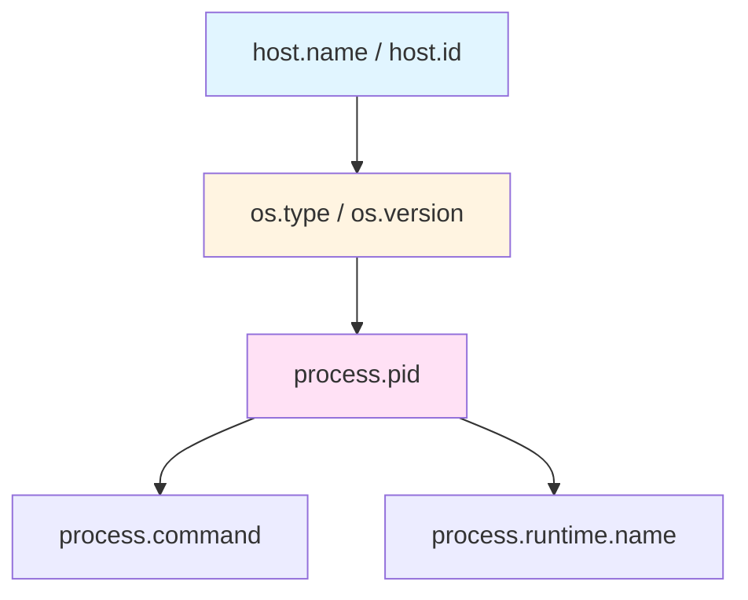

# 05 - 主机与进程资源属性 (host.*/ process.*)

## 📋 目录

- [05 - 主机与进程资源属性 (host.*/ process.*)](#05---主机与进程资源属性-host-process)
  - [📋 目录](#-目录)
  - [1. 主机与进程属性概述](#1-主机与进程属性概述)
    - [1.1 host.*vs process.* 命名空间](#11-hostvs-process-命名空间)
    - [1.2 属性层级关系](#12-属性层级关系)
    - [1.3 检测策略](#13-检测策略)
  - [2. 主机级别属性 (host.\*)](#2-主机级别属性-host)
    - [2.1 host.\* 标准属性](#21-host-标准属性)
    - [2.2 主机标识 (ID/Name)](#22-主机标识-idname)
    - [2.3 主机架构 (Arch/Type)](#23-主机架构-archtype)
    - [2.4 主机镜像 (Image)](#24-主机镜像-image)
  - [3. 操作系统属性 (os.\*)](#3-操作系统属性-os)
    - [3.1 os.\* 标准属性](#31-os-标准属性)
    - [3.2 OS 类型和版本](#32-os-类型和版本)
    - [3.3 OS 构建信息](#33-os-构建信息)
    - [3.4 跨平台兼容性](#34-跨平台兼容性)
  - [6. Go 实现 - OS 检测器](#6-go-实现---os-检测器)
    - [6.2 Linux 系统检测](#62-linux-系统检测)
    - [6.3 Windows 系统检测](#63-windows-系统检测)
    - [6.4 macOS 系统检测](#64-macos-系统检测)
  - [7. Go 实现 - Process 检测器](#7-go-实现---process-检测器)
    - [7.1 基础进程检测](#71-基础进程检测)
    - [7.2 进程可执行文件路径](#72-进程可执行文件路径)
    - [7.3 进程命令行参数](#73-进程命令行参数)
    - [7.4 进程所有者检测](#74-进程所有者检测)
    - [7.5 进程运行时检测](#75-进程运行时检测)
  - [8. 容器环境特殊处理](#8-容器环境特殊处理)
    - [8.1 容器 vs 主机](#81-容器-vs-主机)
    - [8.2 Docker 容器检测](#82-docker-容器检测)
    - [8.3 Kubernetes Pod 检测](#83-kubernetes-pod-检测)
    - [8.4 容器 ID 提取](#84-容器-id-提取)
  - [9. 完整示例](#9-完整示例)
    - [9.1 统一资源检测器](#91-统一资源检测器)
    - [9.2 生产环境配置](#92-生产环境配置)
    - [9.3 监控和诊断](#93-监控和诊断)
  - [10. 最佳实践](#10-最佳实践)
    - [10.1 性能优化](#101-性能优化)
    - [10.2 错误处理](#102-错误处理)
    - [10.3 安全考虑](#103-安全考虑)
    - [10.4 跨平台支持](#104-跨平台支持)
  - [11. 常见问题 (FAQ)](#11-常见问题-faq)
    - [Q1: host.name 和 host.id 必须都设置吗?](#q1-hostname-和-hostid-必须都设置吗)
    - [Q2: 如何在容器中获取宿主机信息?](#q2-如何在容器中获取宿主机信息)
    - [Q3: process.command\_line 会泄露敏感信息吗?](#q3-processcommand_line-会泄露敏感信息吗)
    - [Q4: 如何处理多个进程实例?](#q4-如何处理多个进程实例)
    - [Q5: 为什么 host.id 在容器中每次都不同?](#q5-为什么-hostid-在容器中每次都不同)
    - [Q6: 如何检测虚拟化类型 (KVM/VMware/Xen)?](#q6-如何检测虚拟化类型-kvmvmwarexen)
    - [Q7: Windows 上如何获取 machine GUID?](#q7-windows-上如何获取-machine-guid)
    - [Q8: macOS 上如何获取稳定的 host.id?](#q8-macos-上如何获取稳定的-hostid)
    - [Q9: 如何最小化资源检测的性能影响?](#q9-如何最小化资源检测的性能影响)
    - [Q10: 跨平台兼容性如何保证?](#q10-跨平台兼容性如何保证)
  - [📚 参考资源](#-参考资源)

---

## 1. 主机与进程属性概述

### 1.1 host.*vs process.* 命名空间

**核心概念**:

- `host.*`: 物理或虚拟机级别的属性 (硬件、OS)
- `os.*`: 操作系统属性 (通常作为 host 的子属性)
- `process.*`: 进程级别的属性 (PID、命令行、所有者)

**命名空间对比**:

| 命名空间 | 作用域 | 生命周期 | 示例 |
|----------|--------|----------|------|
| `host.*` | 主机级 | 主机启动到关闭 | `host.name`, `host.id` |
| `os.*` | OS 级 | OS 安装到重装 | `os.type`, `os.version` |
| `process.*` | 进程级 | 进程启动到退出 | `process.pid`, `process.command` |

### 1.2 属性层级关系



**层级说明**:

1. **主机层**: 最底层硬件/虚拟机
2. **OS 层**: 操作系统
3. **进程层**: 应用进程

### 1.3 检测策略

**检测优先级**:

```go
type DetectionSource string

const (
    // 1. 环境变量 (最快)
    SourceEnvVar DetectionSource = "env"
    
    // 2. 系统调用 (中等性能)
    SourceSyscall DetectionSource = "syscall"
    
    // 3. 文件系统读取 (较慢)
    SourceFS DetectionSource = "fs"
    
    // 4. 外部命令执行 (最慢)
    SourceExec DetectionSource = "exec"
)
```

**最佳实践**:

- **优先使用 Go 标准库**: `runtime.GOOS`, `runtime.GOARCH`, `os.Hostname()`
- **缓存检测结果**: 主机和 OS 信息很少变化
- **避免执行外部命令**: 性能差且不可移植

---

## 2. 主机级别属性 (host.*)

### 2.1 host.* 标准属性

**标准属性清单**:

| 属性名 | 类型 | 必需 | 描述 | 示例 |
|--------|------|------|------|------|
| `host.name` | string | ✅ | 主机名 | `web-server-01.example.com` |
| `host.id` | string | 推荐 | 主机唯一 ID | `2c54a1e3-8f4c-4d5e-9a1b-7c8d9e0f1a2b` |
| `host.type` | string | 可选 | 主机类型 | `physical`, `virtual`, `container` |
| `host.arch` | string | 推荐 | CPU 架构 | `amd64`, `arm64` |
| `host.image.name` | string | 可选 | 主机镜像名称 | `ubuntu-20.04-lts` |
| `host.image.id` | string | 可选 | 主机镜像 ID | `ami-0c55b159cbfafe1f0` |
| `host.image.version` | string | 可选 | 主机镜像版本 | `20.04.3` |

**属性关系**:

- `host.name` + `host.id` 组合唯一标识主机
- `host.arch` 描述硬件架构
- `host.image.*` 在云环境中特别重要

### 2.2 主机标识 (ID/Name)

**host.name 获取**:

```go
package hostresource

import (
    "os"
    "strings"
    
    "go.opentelemetry.io/otel/attribute"
    semconv "go.opentelemetry.io/otel/semconv/v1.28.0"
)

// GetHostName 获取主机名
func GetHostName() (string, error) {
    // 优先从环境变量
    if hostname := os.Getenv("HOSTNAME"); hostname != "" {
        return hostname, nil
    }
    
    // 使用 os.Hostname()
    hostname, err := os.Hostname()
    if err != nil {
        return "", err
    }
    
    // 标准化: 转换为小写,去除域名后缀
    hostname = strings.ToLower(hostname)
    
    return hostname, nil
}

// HostNameAttribute 返回主机名属性
func HostNameAttribute() (attribute.KeyValue, error) {
    hostname, err := GetHostName()
    if err != nil {
        return attribute.KeyValue{}, err
    }
    
    return semconv.HostName(hostname), nil
}
```

**host.id 生成策略**:

```go
package hostresource

import (
    "crypto/sha256"
    "encoding/hex"
    "fmt"
    "io"
    "os"
    "runtime"
    "strings"
    
    "go.opentelemetry.io/otel/attribute"
    semconv "go.opentelemetry.io/otel/semconv/v1.28.0"
)

// GetHostID 获取主机唯一 ID
func GetHostID() (string, error) {
    // 优先从环境变量
    if hostID := os.Getenv("HOST_ID"); hostID != "" {
        return hostID, nil
    }
    
    // 平台特定的 Host ID
    switch runtime.GOOS {
    case "linux":
        return getLinuxHostID()
    case "darwin":
        return getDarwinHostID()
    case "windows":
        return getWindowsHostID()
    default:
        // Fallback: 基于主机名生成稳定的 ID
        return generateHostIDFromName()
    }
}

// getLinuxHostID 从 /etc/machine-id 或 /var/lib/dbus/machine-id 读取
func getLinuxHostID() (string, error) {
    paths := []string{
        "/etc/machine-id",
        "/var/lib/dbus/machine-id",
    }
    
    for _, path := range paths {
        data, err := os.ReadFile(path)
        if err == nil {
            id := strings.TrimSpace(string(data))
            if id != "" {
                return id, nil
            }
        }
    }
    
    return "", fmt.Errorf("machine-id not found")
}

// getDarwinHostID 从 ioreg 获取 IOPlatformUUID
func getDarwinHostID() (string, error) {
    // 方式1: 从环境变量 (推荐在容器中设置)
    if uuid := os.Getenv("MACOS_PLATFORM_UUID"); uuid != "" {
        return uuid, nil
    }
    
    // 方式2: 从文件 (如果已缓存)
    data, err := os.ReadFile("/var/db/.SystemSerialNumber")
    if err == nil {
        return strings.TrimSpace(string(data)), nil
    }
    
    // 方式3: Fallback
    return generateHostIDFromName()
}

// getWindowsHostID 从注册表获取 MachineGuid
func getWindowsHostID() (string, error) {
    // 方式1: 从环境变量
    if guid := os.Getenv("MACHINE_GUID"); guid != "" {
        return guid, nil
    }
    
    // 方式2: Fallback (Windows 注册表读取需要 golang.org/x/sys/windows)
    // 这里使用简化的 fallback
    return generateHostIDFromName()
}

// generateHostIDFromName 基于主机名生成稳定的 ID (fallback)
func generateHostIDFromName() (string, error) {
    hostname, err := GetHostName()
    if err != nil {
        return "", err
    }
    
    // 使用 SHA-256 生成稳定的 UUID
    hash := sha256.Sum256([]byte(hostname))
    return hex.EncodeToString(hash[:16]), nil // 128-bit UUID
}

// HostIDAttribute 返回主机 ID 属性
func HostIDAttribute() (attribute.KeyValue, error) {
    hostID, err := GetHostID()
    if err != nil {
        return attribute.KeyValue{}, err
    }
    
    return semconv.HostID(hostID), nil
}
```

### 2.3 主机架构 (Arch/Type)

**host.arch 检测**:

```go
package hostresource

import (
    "runtime"
    
    "go.opentelemetry.io/otel/attribute"
    semconv "go.opentelemetry.io/otel/semconv/v1.28.0"
)

// GetHostArch 获取 CPU 架构
func GetHostArch() string {
    return runtime.GOARCH
}

// HostArchAttribute 返回主机架构属性
func HostArchAttribute() attribute.KeyValue {
    return semconv.HostArch(GetHostArch())
}

// 标准架构值:
// - amd64 (x86-64)
// - arm64 (ARM 64-bit)
// - arm (ARM 32-bit)
// - 386 (x86 32-bit)
// - ppc64le (PowerPC 64-bit LE)
// - s390x (IBM System z)
```

**host.type 检测**:

```go
// GetHostType 检测主机类型
func GetHostType() string {
    // 检测容器环境
    if isRunningInContainer() {
        return "container"
    }
    
    // 检测虚拟化
    if isVirtualMachine() {
        return "virtual"
    }
    
    return "physical"
}

// isRunningInContainer 检测是否在容器中运行
func isRunningInContainer() bool {
    // Docker 容器标识
    if _, err := os.Stat("/.dockerenv"); err == nil {
        return true
    }
    
    // Kubernetes Pod 标识
    if os.Getenv("KUBERNETES_SERVICE_HOST") != "" {
        return true
    }
    
    // cgroup 检测 (Linux)
    if runtime.GOOS == "linux" {
        data, err := os.ReadFile("/proc/1/cgroup")
        if err == nil && (strings.Contains(string(data), "docker") ||
            strings.Contains(string(data), "kubepods")) {
            return true
        }
    }
    
    return false
}

// isVirtualMachine 检测是否在虚拟机中运行
func isVirtualMachine() bool {
    switch runtime.GOOS {
    case "linux":
        return isLinuxVM()
    case "darwin":
        // macOS 通常在虚拟机中运行较少见
        return false
    case "windows":
        return isWindowsVM()
    default:
        return false
    }
}

func isLinuxVM() bool {
    // 检测 /sys/class/dmi/id/product_name
    data, err := os.ReadFile("/sys/class/dmi/id/product_name")
    if err == nil {
        product := strings.ToLower(string(data))
        vmIndicators := []string{"virtualbox", "vmware", "qemu", "kvm", "xen"}
        for _, indicator := range vmIndicators {
            if strings.Contains(product, indicator) {
                return true
            }
        }
    }
    
    return false
}

func isWindowsVM() bool {
    // Windows 虚拟化检测需要 WMI 查询
    // 简化实现: 检查环境变量
    return os.Getenv("VM_VENDOR") != ""
}

// HostTypeAttribute 返回主机类型属性
func HostTypeAttribute() attribute.KeyValue {
    return semconv.HostType(GetHostType())
}
```

### 2.4 主机镜像 (Image)

**适用场景**: 云环境 (AWS EC2, GCE, Azure VM)

```go
package hostresource

import (
    "encoding/json"
    "io"
    "net/http"
    "os"
    "time"
    
    "go.opentelemetry.io/otel/attribute"
    semconv "go.opentelemetry.io/otel/semconv/v1.28.0"
)

// GetHostImage 获取主机镜像信息
func GetHostImage() (*HostImage, error) {
    // 优先从环境变量
    if imageName := os.Getenv("HOST_IMAGE_NAME"); imageName != "" {
        return &HostImage{
            Name:    imageName,
            ID:      os.Getenv("HOST_IMAGE_ID"),
            Version: os.Getenv("HOST_IMAGE_VERSION"),
        }, nil
    }
    
    // 云平台 Metadata API
    if isAWSEC2() {
        return getAWSImageInfo()
    }
    
    if isGCE() {
        return getGCEImageInfo()
    }
    
    if isAzureVM() {
        return getAzureImageInfo()
    }
    
    return nil, fmt.Errorf("host image not available")
}

type HostImage struct {
    Name    string
    ID      string
    Version string
}

func isAWSEC2() bool {
    return os.Getenv("AWS_EXECUTION_ENV") != "" || isMetadataAvailable("http://169.254.169.254/latest/meta-data/")
}

func getAWSImageInfo() (*HostImage, error) {
    // AWS EC2 Metadata API
    amiID, err := fetchMetadata("http://169.254.169.254/latest/meta-data/ami-id")
    if err != nil {
        return nil, err
    }
    
    return &HostImage{
        ID: amiID,
        // Name 和 Version 需要从 EC2 Tags 或 ImageDescription 获取
    }, nil
}

func isGCE() bool {
    return isMetadataAvailable("http://metadata.google.internal")
}

func getGCEImageInfo() (*HostImage, error) {
    // GCE Metadata API
    imageName, err := fetchMetadata("http://metadata.google.internal/computeMetadata/v1/instance/image")
    if err != nil {
        return nil, err
    }
    
    return &HostImage{
        Name: imageName,
    }, nil
}

func isAzureVM() bool {
    return isMetadataAvailable("http://169.254.169.254/metadata/instance")
}

func getAzureImageInfo() (*HostImage, error) {
    // Azure VM Metadata API
    resp, err := http.Get("http://169.254.169.254/metadata/instance/compute?api-version=2021-02-01")
    if err != nil {
        return nil, err
    }
    defer resp.Body.Close()
    
    var metadata struct {
        ImageReference struct {
            ID        string `json:"id"`
            Publisher string `json:"publisher"`
            Offer     string `json:"offer"`
            Sku       string `json:"sku"`
            Version   string `json:"version"`
        } `json:"imageReference"`
    }
    
    if err := json.NewDecoder(resp.Body).Decode(&metadata); err != nil {
        return nil, err
    }
    
    return &HostImage{
        Name:    fmt.Sprintf("%s:%s:%s", metadata.ImageReference.Publisher, metadata.ImageReference.Offer, metadata.ImageReference.Sku),
        ID:      metadata.ImageReference.ID,
        Version: metadata.ImageReference.Version,
    }, nil
}

func isMetadataAvailable(endpoint string) bool {
    client := &http.Client{Timeout: 1 * time.Second}
    resp, err := client.Get(endpoint)
    if err != nil {
        return false
    }
    defer resp.Body.Close()
    return resp.StatusCode == http.StatusOK
}

func fetchMetadata(url string) (string, error) {
    client := &http.Client{Timeout: 2 * time.Second}
    resp, err := client.Get(url)
    if err != nil {
        return "", err
    }
    defer resp.Body.Close()
    
    data, err := io.ReadAll(resp.Body)
    if err != nil {
        return "", err
    }
    
    return strings.TrimSpace(string(data)), nil
}

// HostImageAttributes 返回主机镜像属性
func HostImageAttributes() []attribute.KeyValue {
    image, err := GetHostImage()
    if err != nil {
        return nil
    }
    
    attrs := []attribute.KeyValue{}
    
    if image.Name != "" {
        attrs = append(attrs, semconv.HostImageName(image.Name))
    }
    
    if image.ID != "" {
        attrs = append(attrs, semconv.HostImageID(image.ID))
    }
    
    if image.Version != "" {
        attrs = append(attrs, semconv.HostImageVersion(image.Version))
    }
    
    return attrs
}
```

---

## 3. 操作系统属性 (os.*)

### 3.1 os.* 标准属性

**标准属性清单**:

| 属性名 | 类型 | 必需 | 描述 | 示例 |
|--------|------|------|------|------|
| `os.type` | string | ✅ | OS 类型 | `linux`, `windows`, `darwin` |
| `os.description` | string | 推荐 | OS 完整描述 | `Ubuntu 20.04.3 LTS` |
| `os.name` | string | 可选 | OS 名称 | `Ubuntu` |
| `os.version` | string | 推荐 | OS 版本 | `20.04` |
| `os.build_id` | string | 可选 | OS 构建 ID | `#62-Ubuntu SMP Tue Nov 22` |

### 3.2 OS 类型和版本

**os.type 检测**:

```go
package osresource

import (
    "runtime"
    
    "go.opentelemetry.io/otel/attribute"
    semconv "go.opentelemetry.io/otel/semconv/v1.28.0"
)

// GetOSType 获取 OS 类型
func GetOSType() string {
    return runtime.GOOS
}

// OSTypeAttribute 返回 OS 类型属性
func OSTypeAttribute() attribute.KeyValue {
    return semconv.OSType(GetOSType())
}

// 标准 OS 类型值:
// - linux
// - windows
// - darwin (macOS)
// - freebsd
// - netbsd
// - openbsd
// - dragonfly
// - solaris
// - aix
```

**os.version 检测 (跨平台)**:

```go
package osresource

import (
    "fmt"
    "os"
    "runtime"
    "strings"
    
    "go.opentelemetry.io/otel/attribute"
    semconv "go.opentelemetry.io/otel/semconv/v1.28.0"
)

// GetOSVersion 获取 OS 版本
func GetOSVersion() (string, error) {
    switch runtime.GOOS {
    case "linux":
        return getLinuxVersion()
    case "darwin":
        return getDarwinVersion()
    case "windows":
        return getWindowsVersion()
    default:
        return "", fmt.Errorf("unsupported OS: %s", runtime.GOOS)
    }
}

// OSVersionAttribute 返回 OS 版本属性
func OSVersionAttribute() (attribute.KeyValue, error) {
    version, err := GetOSVersion()
    if err != nil {
        return attribute.KeyValue{}, err
    }
    
    return semconv.OSVersion(version), nil
}
```

### 3.3 OS 构建信息

**os.description 检测**:

```go
// GetOSDescription 获取 OS 完整描述
func GetOSDescription() (string, error) {
    switch runtime.GOOS {
    case "linux":
        return getLinuxDescription()
    case "darwin":
        return getDarwinDescription()
    case "windows":
        return getWindowsDescription()
    default:
        return fmt.Sprintf("%s %s", runtime.GOOS, runtime.GOARCH), nil
    }
}

// OSDescriptionAttribute 返回 OS 描述属性
func OSDescriptionAttribute() (attribute.KeyValue, error) {
    description, err := GetOSDescription()
    if err != nil {
        return attribute.KeyValue{}, err
    }
    
    return semconv.OSDescription(description), nil
}
```

### 3.4 跨平台兼容性

**统一的 OS 信息结构**:

```go
// OSInfo 操作系统信息
type OSInfo struct {
    Type        string // linux, windows, darwin
    Name        string // Ubuntu, Windows Server, macOS
    Version     string // 20.04, 10.0.19044, 12.3
    Description string // 完整描述
    BuildID     string // 构建 ID
}

// GetOSInfo 获取完整的 OS 信息
func GetOSInfo() (*OSInfo, error) {
    info := &OSInfo{
        Type: runtime.GOOS,
    }
    
    switch runtime.GOOS {
    case "linux":
        return getLinuxOSInfo()
    case "darwin":
        return getDarwinOSInfo()
    case "windows":
        return getWindowsOSInfo()
    default:
        return info, nil
    }
}

// OSAttributes 返回所有 OS 属性
func OSAttributes() ([]attribute.KeyValue, error) {
    info, err := GetOSInfo()
    if err != nil {
        return nil, err
    }
    
    attrs := []attribute.KeyValue{
        semconv.OSType(info.Type),
    }
    
    if info.Name != "" {
        attrs = append(attrs, semconv.OSName(info.Name))
    }
    
    if info.Version != "" {
        attrs = append(attrs, semconv.OSVersion(info.Version))
    }
    
    if info.Description != "" {
        attrs = append(attrs, semconv.OSDescription(info.Description))
    }
    
    if info.BuildID != "" {
        attrs = append(attrs, semconv.OSBuildID(info.BuildID))
    }
    
    return attrs, nil
}
```

---

## 6. Go 实现 - OS 检测器

### 6.2 Linux 系统检测

**从 /etc/os-release 读取**:

```go
package osresource

import (
    "bufio"
    "os"
    "strings"
)

// getLinuxOSInfo 获取 Linux 系统信息
func getLinuxOSInfo() (*OSInfo, error) {
    info := &OSInfo{
        Type: "linux",
    }
    
    // 解析 /etc/os-release
    osRelease, err := parseOSRelease("/etc/os-release")
    if err != nil {
        // Fallback: /usr/lib/os-release
        osRelease, err = parseOSRelease("/usr/lib/os-release")
        if err != nil {
            return info, nil
        }
    }
    
    info.Name = osRelease["NAME"]
    info.Version = osRelease["VERSION_ID"]
    info.Description = osRelease["PRETTY_NAME"]
    info.BuildID = osRelease["BUILD_ID"]
    
    return info, nil
}

// parseOSRelease 解析 os-release 文件
func parseOSRelease(path string) (map[string]string, error) {
    file, err := os.Open(path)
    if err != nil {
        return nil, err
    }
    defer file.Close()
    
    result := make(map[string]string)
    scanner := bufio.NewScanner(file)
    
    for scanner.Scan() {
        line := scanner.Text()
        
        // 跳过注释和空行
        if strings.HasPrefix(line, "#") || line == "" {
            continue
        }
        
        // 解析 KEY=VALUE
        parts := strings.SplitN(line, "=", 2)
        if len(parts) != 2 {
            continue
        }
        
        key := parts[0]
        value := strings.Trim(parts[1], `"`)
        
        result[key] = value
    }
    
    return result, scanner.Err()
}

// getLinuxVersion 获取 Linux 内核版本
func getLinuxVersion() (string, error) {
    data, err := os.ReadFile("/proc/version")
    if err != nil {
        return "", err
    }
    
    // 解析: Linux version 5.10.0-14-amd64 ...
    versionStr := string(data)
    if strings.HasPrefix(versionStr, "Linux version ") {
        parts := strings.Fields(versionStr)
        if len(parts) >= 3 {
            return parts[2], nil
        }
    }
    
    return "", fmt.Errorf("failed to parse kernel version")
}

// getLinuxDescription 获取 Linux 完整描述
func getLinuxDescription() (string, error) {
    osRelease, err := parseOSRelease("/etc/os-release")
    if err != nil {
        return "", err
    }
    
    if prettyName, ok := osRelease["PRETTY_NAME"]; ok {
        return prettyName, nil
    }
    
    return fmt.Sprintf("%s %s", osRelease["NAME"], osRelease["VERSION"]), nil
}
```

### 6.3 Windows 系统检测

**使用 golang.org/x/sys/windows**:

```go
//go:build windows

package osresource

import (
    "fmt"
    "unsafe"
    
    "golang.org/x/sys/windows"
)

// getWindowsOSInfo 获取 Windows 系统信息
func getWindowsOSInfo() (*OSInfo, error) {
    info := &OSInfo{
        Type: "windows",
    }
    
    // 获取 Windows 版本
    version := windows.RtlGetVersion()
    
    info.Version = fmt.Sprintf("%d.%d.%d",
        version.MajorVersion,
        version.MinorVersion,
        version.BuildNumber,
    )
    
    // 获取 Windows 名称
    info.Name = getWindowsProductName()
    
    // 完整描述
    info.Description = fmt.Sprintf("%s (Build %d)",
        info.Name,
        version.BuildNumber,
    )
    
    return info, nil
}

// getWindowsProductName 获取 Windows 产品名称
func getWindowsProductName() string {
    // 从注册表读取
    // HKEY_LOCAL_MACHINE\SOFTWARE\Microsoft\Windows NT\CurrentVersion\ProductName
    
    k, err := windows.RegOpenKeyEx(
        windows.HKEY_LOCAL_MACHINE,
        windows.StringToUTF16Ptr(`SOFTWARE\Microsoft\Windows NT\CurrentVersion`),
        0,
        windows.KEY_READ,
    )
    if err != nil {
        return "Windows"
    }
    defer windows.RegCloseKey(k)
    
    var productName [256]uint16
    size := uint32(len(productName) * 2)
    
    err = windows.RegQueryValueEx(
        k,
        windows.StringToUTF16Ptr("ProductName"),
        nil,
        nil,
        (*byte)(unsafe.Pointer(&productName[0])),
        &size,
    )
    if err != nil {
        return "Windows"
    }
    
    return windows.UTF16ToString(productName[:])
}

// getWindowsVersion 获取 Windows 版本字符串
func getWindowsVersion() (string, error) {
    version := windows.RtlGetVersion()
    return fmt.Sprintf("%d.%d.%d",
        version.MajorVersion,
        version.MinorVersion,
        version.BuildNumber,
    ), nil
}

// getWindowsDescription 获取 Windows 完整描述
func getWindowsDescription() (string, error) {
    info, err := getWindowsOSInfo()
    if err != nil {
        return "", err
    }
    return info.Description, nil
}
```

### 6.4 macOS 系统检测

**使用 sw_vers 命令** (或解析系统文件):

```go
//go:build darwin

package osresource

import (
    "bytes"
    "os/exec"
    "strings"
)

// getDarwinOSInfo 获取 macOS 系统信息
func getDarwinOSInfo() (*OSInfo, error) {
    info := &OSInfo{
        Type: "darwin",
        Name: "macOS",
    }
    
    // 使用 sw_vers 获取版本信息
    version, err := execSWVers("ProductVersion")
    if err == nil {
        info.Version = version
    }
    
    build, err := execSWVers("BuildVersion")
    if err == nil {
        info.BuildID = build
    }
    
    // 完整描述
    if info.Version != "" {
        info.Description = fmt.Sprintf("macOS %s (Build %s)", info.Version, info.BuildID)
    }
    
    return info, nil
}

// execSWVers 执行 sw_vers 命令
func execSWVers(key string) (string, error) {
    cmd := exec.Command("sw_vers", "-"+key)
    var out bytes.Buffer
    cmd.Stdout = &out
    
    if err := cmd.Run(); err != nil {
        return "", err
    }
    
    return strings.TrimSpace(out.String()), nil
}

// getDarwinVersion 获取 macOS 版本
func getDarwinVersion() (string, error) {
    return execSWVers("ProductVersion")
}

// getDarwinDescription 获取 macOS 完整描述
func getDarwinDescription() (string, error) {
    info, err := getDarwinOSInfo()
    if err != nil {
        return "", err
    }
    return info.Description, nil
}
```

---

## 7. Go 实现 - Process 检测器

### 7.1 基础进程检测

**process.pid 和 process.parent_pid**:

```go
package processresource

import (
    "os"
    
    "go.opentelemetry.io/otel/attribute"
    semconv "go.opentelemetry.io/otel/semconv/v1.28.0"
)

// GetProcessPID 获取当前进程 PID
func GetProcessPID() int {
    return os.Getpid()
}

// GetParentPID 获取父进程 PID
func GetParentPID() int {
    return os.Getppid()
}

// ProcessPIDAttribute 返回进程 PID 属性
func ProcessPIDAttribute() attribute.KeyValue {
    return semconv.ProcessPID(GetProcessPID())
}

// ProcessParentPIDAttribute 返回父进程 PID 属性
func ProcessParentPIDAttribute() attribute.KeyValue {
    return semconv.ProcessParentPID(GetParentPID())
}
```

### 7.2 进程可执行文件路径

**process.executable.path 和 process.executable.name**:

```go
package processresource

import (
    "os"
    "path/filepath"
    
    "go.opentelemetry.io/otel/attribute"
    semconv "go.opentelemetry.io/otel/semconv/v1.28.0"
)

// GetExecutablePath 获取可执行文件路径
func GetExecutablePath() (string, error) {
    return os.Executable()
}

// GetExecutableName 获取可执行文件名称
func GetExecutableName() (string, error) {
    exePath, err := os.Executable()
    if err != nil {
        return "", err
    }
    
    return filepath.Base(exePath), nil
}

// ProcessExecutablePathAttribute 返回可执行文件路径属性
func ProcessExecutablePathAttribute() (attribute.KeyValue, error) {
    exePath, err := GetExecutablePath()
    if err != nil {
        return attribute.KeyValue{}, err
    }
    
    return semconv.ProcessExecutablePath(exePath), nil
}

// ProcessExecutableNameAttribute 返回可执行文件名称属性
func ProcessExecutableNameAttribute() (attribute.KeyValue, error) {
    exeName, err := GetExecutableName()
    if err != nil {
        return attribute.KeyValue{}, err
    }
    
    return semconv.ProcessExecutableName(exeName), nil
}
```

### 7.3 进程命令行参数

**process.command 和 process.command_line**:

```go
package processresource

import (
    "os"
    "strings"
    
    "go.opentelemetry.io/otel/attribute"
    semconv "go.opentelemetry.io/otel/semconv/v1.28.0"
)

// GetProcessCommand 获取进程命令 (不含参数)
func GetProcessCommand() (string, error) {
    return GetExecutablePath()
}

// GetProcessCommandLine 获取完整命令行 (含参数)
func GetProcessCommandLine() string {
    args := os.Args
    return strings.Join(args, " ")
}

// GetProcessCommandArgs 获取命令行参数列表
func GetProcessCommandArgs() []string {
    if len(os.Args) > 1 {
        return os.Args[1:]
    }
    return []string{}
}

// ProcessCommandAttribute 返回进程命令属性
func ProcessCommandAttribute() (attribute.KeyValue, error) {
    command, err := GetProcessCommand()
    if err != nil {
        return attribute.KeyValue{}, err
    }
    
    return semconv.ProcessCommand(command), nil
}

// ProcessCommandLineAttribute 返回完整命令行属性
func ProcessCommandLineAttribute() attribute.KeyValue {
    return semconv.ProcessCommandLine(GetProcessCommandLine())
}

// ProcessCommandArgsAttribute 返回命令行参数属性
func ProcessCommandArgsAttribute() attribute.KeyValue {
    args := GetProcessCommandArgs()
    return semconv.ProcessCommandArgs(args...)
}
```

### 7.4 进程所有者检测

**process.owner 和 process.user.***:

```go
package processresource

import (
    "os/user"
    "strconv"
    
    "go.opentelemetry.io/otel/attribute"
    semconv "go.opentelemetry.io/otel/semconv/v1.28.0"
)

// GetProcessOwner 获取进程所有者信息
func GetProcessOwner() (*ProcessOwner, error) {
    currentUser, err := user.Current()
    if err != nil {
        return nil, err
    }
    
    uid, _ := strconv.Atoi(currentUser.Uid)
    gid, _ := strconv.Atoi(currentUser.Gid)
    
    return &ProcessOwner{
        Username: currentUser.Username,
        UID:      uid,
        GID:      gid,
    }, nil
}

type ProcessOwner struct {
    Username string
    UID      int
    GID      int
}

// ProcessOwnerAttribute 返回进程所有者属性
func ProcessOwnerAttribute() (attribute.KeyValue, error) {
    owner, err := GetProcessOwner()
    if err != nil {
        return attribute.KeyValue{}, err
    }
    
    return semconv.ProcessOwner(owner.Username), nil
}
```

### 7.5 进程运行时检测

**process.runtime.*** (Go 特定):

```go
package processresource

import (
    "runtime"
    
    "go.opentelemetry.io/otel/attribute"
    semconv "go.opentelemetry.io/otel/semconv/v1.28.0"
)

// GetProcessRuntimeInfo 获取进程运行时信息
func GetProcessRuntimeInfo() *ProcessRuntime {
    return &ProcessRuntime{
        Name:        "go",
        Version:     runtime.Version(),
        Description: runtime.Compiler + " " + runtime.Version(),
    }
}

type ProcessRuntime struct {
    Name        string
    Version     string
    Description string
}

// ProcessRuntimeAttributes 返回运行时属性
func ProcessRuntimeAttributes() []attribute.KeyValue {
    rt := GetProcessRuntimeInfo()
    
    return []attribute.KeyValue{
        semconv.ProcessRuntimeName(rt.Name),
        semconv.ProcessRuntimeVersion(rt.Version),
        semconv.ProcessRuntimeDescription(rt.Description),
    }
}
```

---

## 8. 容器环境特殊处理

### 8.1 容器 vs 主机

**区分容器和主机属性**:

```go
package containerresource

import (
    "os"
    "runtime"
    "strings"
)

// IsRunningInContainer 检测是否在容器中运行
func IsRunningInContainer() bool {
    // Docker
    if _, err := os.Stat("/.dockerenv"); err == nil {
        return true
    }
    
    // Kubernetes
    if os.Getenv("KUBERNETES_SERVICE_HOST") != "" {
        return true
    }
    
    // cgroup 检测 (Linux)
    if runtime.GOOS == "linux" {
        if data, err := os.ReadFile("/proc/1/cgroup"); err == nil {
            content := string(data)
            return strings.Contains(content, "docker") ||
                   strings.Contains(content, "kubepods") ||
                   strings.Contains(content, "containerd")
        }
    }
    
    return false
}

// GetContainerType 获取容器类型
func GetContainerType() string {
    if _, err := os.Stat("/.dockerenv"); err == nil {
        return "docker"
    }
    
    if os.Getenv("KUBERNETES_SERVICE_HOST") != "" {
        return "kubernetes"
    }
    
    if runtime.GOOS == "linux" {
        if data, err := os.ReadFile("/proc/1/cgroup"); err == nil {
            content := string(data)
            if strings.Contains(content, "docker") {
                return "docker"
            }
            if strings.Contains(content, "kubepods") {
                return "kubernetes"
            }
            if strings.Contains(content, "containerd") {
                return "containerd"
            }
        }
    }
    
    return ""
}
```

### 8.2 Docker 容器检测

**container.id 提取**:

```go
// GetDockerContainerID 获取 Docker 容器 ID
func GetDockerContainerID() (string, error) {
    // 方式1: 从环境变量
    if containerID := os.Getenv("HOSTNAME"); containerID != "" {
        // Docker 默认将容器 ID 前缀作为 hostname
        return containerID, nil
    }
    
    // 方式2: 从 cgroup 提取
    if runtime.GOOS == "linux" {
        return extractContainerIDFromCGroup()
    }
    
    return "", fmt.Errorf("container ID not found")
}

// extractContainerIDFromCGroup 从 cgroup 提取容器 ID
func extractContainerIDFromCGroup() (string, error) {
    data, err := os.ReadFile("/proc/self/cgroup")
    if err != nil {
        return "", err
    }
    
    lines := strings.Split(string(data), "\n")
    for _, line := range lines {
        // 格式: 12:pids:/docker/<container-id>
        if strings.Contains(line, "docker") {
            parts := strings.Split(line, "/")
            if len(parts) > 0 {
                containerID := parts[len(parts)-1]
                if len(containerID) == 64 { // Docker 容器 ID 是 64 字符
                    return containerID, nil
                }
            }
        }
    }
    
    return "", fmt.Errorf("container ID not found in cgroup")
}
```

### 8.3 Kubernetes Pod 检测

**已在 04_Kubernetes资源.md 中详细说明**:

### 8.4 容器 ID 提取

**统一的容器 ID 提取**:

```go
// GetContainerID 获取容器 ID (自动检测容器类型)
func GetContainerID() (string, error) {
    containerType := GetContainerType()
    
    switch containerType {
    case "docker":
        return GetDockerContainerID()
    case "kubernetes":
        // Kubernetes 使用 Pod UID
        if podUID := os.Getenv("K8S_POD_UID"); podUID != "" {
            return podUID, nil
        }
        return "", fmt.Errorf("k8s pod uid not found")
    case "containerd":
        return extractContainerIDFromCGroup()
    default:
        return "", fmt.Errorf("not running in container")
    }
}
```

---

## 9. 完整示例

### 9.1 统一资源检测器

**main.go**:

```go
package main

import (
    "context"
    "log"
    
    "go.opentelemetry.io/otel"
    "go.opentelemetry.io/otel/exporters/otlp/otlptrace/otlptracegrpc"
    "go.opentelemetry.io/otel/sdk/resource"
    sdktrace "go.opentelemetry.io/otel/sdk/trace"
    semconv "go.opentelemetry.io/otel/semconv/v1.28.0"
    
    "myapp/containerresource"
    "myapp/hostresource"
    "myapp/osresource"
    "myapp/processresource"
)

func main() {
    ctx := context.Background()
    
    // 检测所有资源
    res, err := detectAllResources(ctx)
    if err != nil {
        log.Fatalf("Failed to detect resources: %v", err)
    }
    
    // 初始化 TracerProvider
    tp, err := initTracerProvider(ctx, res)
    if err != nil {
        log.Fatalf("Failed to initialize tracer provider: %v", err)
    }
    defer tp.Shutdown(ctx)
    
    otel.SetTracerProvider(tp)
    
    log.Println("Application started with full resource detection")
}

func detectAllResources(ctx context.Context) (*resource.Resource, error) {
    // 1. 服务信息
    serviceRes := resource.NewWithAttributes(
        semconv.SchemaURL,
        semconv.ServiceName("my-app"),
        semconv.ServiceVersion("1.0.0"),
    )
    
    // 2. 主机信息
    hostAttrs := []attribute.KeyValue{}
    
    if attr, err := hostresource.HostNameAttribute(); err == nil {
        hostAttrs = append(hostAttrs, attr)
    }
    
    if attr, err := hostresource.HostIDAttribute(); err == nil {
        hostAttrs = append(hostAttrs, attr)
    }
    
    hostAttrs = append(hostAttrs, hostresource.HostArchAttribute())
    hostAttrs = append(hostAttrs, hostresource.HostTypeAttribute())
    
    hostRes := resource.NewWithAttributes(semconv.SchemaURL, hostAttrs...)
    
    // 3. OS 信息
    osAttrs, _ := osresource.OSAttributes()
    osRes := resource.NewWithAttributes(semconv.SchemaURL, osAttrs...)
    
    // 4. 进程信息
    processAttrs := []attribute.KeyValue{
        processresource.ProcessPIDAttribute(),
        processresource.ProcessParentPIDAttribute(),
    }
    
    if attr, err := processresource.ProcessExecutablePathAttribute(); err == nil {
        processAttrs = append(processAttrs, attr)
    }
    
    if attr, err := processresource.ProcessExecutableNameAttribute(); err == nil {
        processAttrs = append(processAttrs, attr)
    }
    
    processAttrs = append(processAttrs, processresource.ProcessCommandLineAttribute())
    processAttrs = append(processAttrs, processresource.ProcessRuntimeAttributes()...)
    
    processRes := resource.NewWithAttributes(semconv.SchemaURL, processAttrs...)
    
    // 5. 容器信息 (如果在容器中运行)
    var containerRes *resource.Resource
    if containerresource.IsRunningInContainer() {
        if containerID, err := containerresource.GetContainerID(); err == nil {
            containerRes = resource.NewWithAttributes(
                semconv.SchemaURL,
                semconv.ContainerID(containerID),
            )
        }
    }
    
    // 合并所有资源
    resources := []*resource.Resource{serviceRes, hostRes, osRes, processRes}
    if containerRes != nil {
        resources = append(resources, containerRes)
    }
    
    return resource.Merge(resources[0], resources[1:]...)
}

func initTracerProvider(ctx context.Context, res *resource.Resource) (*sdktrace.TracerProvider, error) {
    exporter, err := otlptracegrpc.New(
        ctx,
        otlptracegrpc.WithEndpoint("otel-collector:4317"),
        otlptracegrpc.WithInsecure(),
    )
    if err != nil {
        return nil, err
    }
    
    tp := sdktrace.NewTracerProvider(
        sdktrace.WithResource(res),
        sdktrace.WithBatcher(exporter),
    )
    
    return tp, nil
}
```

### 9.2 生产环境配置

**环境变量注入**:

```bash
# Kubernetes Deployment
env:
# 主机信息
- name: HOST_ID
  value: "550e8400-e29b-41d4-a716-446655440000"
- name: HOST_IMAGE_NAME
  value: "ubuntu-20.04-lts"

# OS 信息 (可选,通常自动检测)
- name: OS_TYPE
  value: "linux"
- name: OS_VERSION
  value: "20.04"

# 进程信息 (可选)
- name: PROCESS_OWNER
  value: "app-user"
```

### 9.3 监控和诊断

**资源属性查询示例** (Jaeger/Grafana):

```promql
# Jaeger Trace Query
service.name="my-app" AND host.name="web-server-01"

# Grafana Dashboard
{service_name="my-app", host_type="container", os_type="linux"}
```

---

## 10. 最佳实践

### 10.1 性能优化

**缓存资源检测结果**:

```go
var (
    cachedResource *resource.Resource
    cacheOnce      sync.Once
)

func GetCachedResource(ctx context.Context) *resource.Resource {
    cacheOnce.Do(func() {
        cachedResource, _ = detectAllResources(ctx)
    })
    return cachedResource
}
```

### 10.2 错误处理

**优雅降级**:

```go
func detectWithFallback(ctx context.Context) *resource.Resource {
    res, err := detectAllResources(ctx)
    if err != nil {
        log.Printf("Warning: resource detection failed: %v", err)
        // 使用最小资源集
        return resource.NewWithAttributes(
            semconv.SchemaURL,
            semconv.ServiceName("unknown-service"),
        )
    }
    return res
}
```

### 10.3 安全考虑

**避免泄露敏感信息**:

```go
// 过滤命令行参数中的敏感信息
func SanitizeCommandLine(cmdLine string) string {
    // 移除密码、token 等
    patterns := []string{
        `--password=[^\s]+`,
        `--token=[^\s]+`,
        `--secret=[^\s]+`,
    }
    
    sanitized := cmdLine
    for _, pattern := range patterns {
        re := regexp.MustCompile(pattern)
        sanitized = re.ReplaceAllString(sanitized, "$1=***")
    }
    
    return sanitized
}
```

### 10.4 跨平台支持

**构建标签**:

```go
//go:build !windows
// +build !windows

package hostresource

// Unix-specific implementation
```

```go
//go:build windows
// +build windows

package hostresource

// Windows-specific implementation
```

---

## 11. 常见问题 (FAQ)

### Q1: host.name 和 host.id 必须都设置吗?

**A**: `host.name` 是必需的,`host.id` 是推荐的。`host.id` 用于唯一标识主机,在主机名可能重复的环境中特别重要。

### Q2: 如何在容器中获取宿主机信息?

**A**: 容器中通常只能获取容器自身的信息。如果需要宿主机信息,可以:

1. 通过 Downward API 注入环境变量
2. 挂载宿主机的 `/etc/machine-id` (只读)
3. 使用 K8s Node Affinity 获取节点信息

### Q3: process.command_line 会泄露敏感信息吗?

**A**: 是的,命令行参数可能包含密码、token 等敏感信息。建议:

1. 使用配置文件或环境变量传递敏感信息
2. 对 `process.command_line` 进行脱敏处理
3. 在生产环境中禁用 `process.command_line` 属性

### Q4: 如何处理多个进程实例?

**A**: 使用 `process.pid` 和 `service.instance.id` 组合唯一标识:

```go
semconv.ServiceInstanceID(fmt.Sprintf("%s-%d", hostname, os.Getpid()))
```

### Q5: 为什么 host.id 在容器中每次都不同?

**A**: 容器的 "主机" 是容器本身,每次重启容器 ID 会变化。解决方案:

1. 使用 `container.id` 而不是 `host.id`
2. 在 K8s 中使用 `k8s.pod.uid`
3. 注入稳定的 `HOST_ID` 环境变量

### Q6: 如何检测虚拟化类型 (KVM/VMware/Xen)?

**A**: Linux 系统可以从 `/sys/class/dmi/id/product_name` 或使用 `systemd-detect-virt` 命令。

### Q7: Windows 上如何获取 machine GUID?

**A**: 从注册表 `HKEY_LOCAL_MACHINE\SOFTWARE\Microsoft\Cryptography\MachineGuid` 读取,需要使用 `golang.org/x/sys/windows`。

### Q8: macOS 上如何获取稳定的 host.id?

**A**: 使用 `ioreg -rd1 -c IOPlatformExpertDevice | grep IOPlatformUUID` 或从 `/Library/Preferences/SystemConfiguration/preferences.plist` 读取。

### Q9: 如何最小化资源检测的性能影响?

**A**:

1. 使用 `sync.Once` 缓存检测结果
2. 避免执行外部命令
3. 使用 Go 标准库而非文件系统读取
4. 并行检测独立的资源项

### Q10: 跨平台兼容性如何保证?

**A**:

1. 使用构建标签 (`//go:build`) 分离平台特定代码
2. 提供 fallback 实现
3. 优先使用 Go 标准库 (`runtime`, `os`)
4. 测试覆盖 Linux/Windows/macOS

---

## 📚 参考资源

1. **OpenTelemetry Semantic Conventions**:
   - Host: <https://opentelemetry.io/docs/specs/semconv/resource/host/>
   - OS: <https://opentelemetry.io/docs/specs/semconv/resource/os/>
   - Process: <https://opentelemetry.io/docs/specs/semconv/resource/process/>

2. **Go 标准库**:
   - `runtime` package: <https://pkg.go.dev/runtime>
   - `os` package: <https://pkg.go.dev/os>
   - `os/user` package: <https://pkg.go.dev/os/user>

3. **平台特定**:
   - golang.org/x/sys/windows: <https://pkg.go.dev/golang.org/x/sys/windows>
   - golang.org/x/sys/unix: <https://pkg.go.dev/golang.org/x/sys/unix>

4. **相关文档**:
   - [01_服务资源.md](./01_服务资源.md) - Service 属性
   - [04_Kubernetes资源.md](./04_Kubernetes资源.md) - K8s 容器环境

---

**文档版本**: 1.0.0  
**最后更新**: 2025-10-09  
**OpenTelemetry 版本**: 1.32.0+  
**Semantic Conventions 版本**: 1.28.0+
