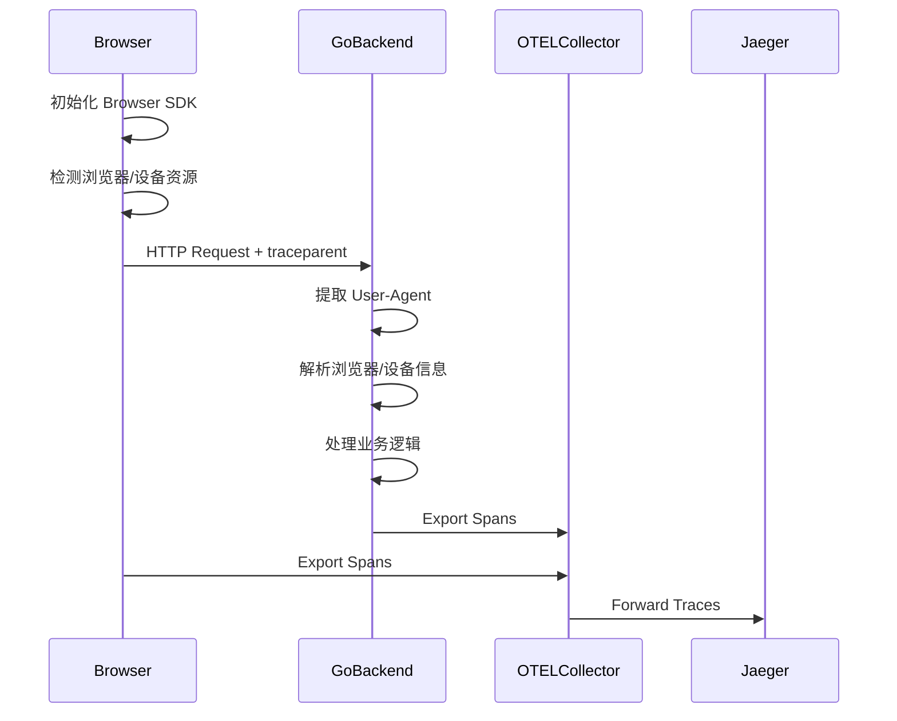

# 06 - 设备与浏览器资源属性 (device.*/ browser.*)

## 📋 目录

- [06 - 设备与浏览器资源属性 (device.*/ browser.*)](#06---设备与浏览器资源属性-device-browser)
  - [📋 目录](#-目录)
  - [1. 设备与浏览器属性概述](#1-设备与浏览器属性概述)
    - [1.1 device.*vs browser.* 命名空间](#11-devicevs-browser-命名空间)
    - [1.2 适用场景](#12-适用场景)
    - [1.3 后端 vs 前端检测](#13-后端-vs-前端检测)
  - [2. 设备级别属性 (device.\*)](#2-设备级别属性-device)
    - [2.1 device.\* 标准属性](#21-device-标准属性)
    - [2.2 设备标识 (ID/Model)](#22-设备标识-idmodel)
    - [2.3 设备制造商](#23-设备制造商)
    - [2.4 移动设备特有属性](#24-移动设备特有属性)
  - [3. 浏览器级别属性 (browser.\*)](#3-浏览器级别属性-browser)
    - [3.1 browser.\* 标准属性](#31-browser-标准属性)
    - [3.2 浏览器标识 (Brand/Version)](#32-浏览器标识-brandversion)
    - [3.3 浏览器语言和平台](#33-浏览器语言和平台)
    - [3.4 用户代理 (User-Agent)](#34-用户代理-user-agent)
  - [4. Go 后端实现 - User-Agent 解析](#4-go-后端实现---user-agent-解析)
    - [4.1 基础 User-Agent 解析](#41-基础-user-agent-解析)
    - [4.2 使用 ua-parser 库](#42-使用-ua-parser-库)
    - [4.3 设备类型检测](#43-设备类型检测)
    - [4.4 浏览器特性检测](#44-浏览器特性检测)
  - [5. Go 后端实现 - HTTP Headers 提取](#5-go-后端实现---http-headers-提取)
    - [5.1 标准 HTTP Headers](#51-标准-http-headers)
    - [5.2 Client Hints API](#52-client-hints-api)
    - [5.3 中间件集成](#53-中间件集成)
    - [5.4 Context 传播](#54-context-传播)
  - [6. 前端 JavaScript 检测](#6-前端-javascript-检测)
    - [6.1 浏览器信息获取](#61-浏览器信息获取)
    - [6.2 设备信息获取](#62-设备信息获取)
    - [6.3 屏幕信息](#63-屏幕信息)
    - [6.4 网络信息](#64-网络信息)
  - [7. OpenTelemetry Browser SDK 集成](#7-opentelemetry-browser-sdk-集成)
    - [7.1 Browser SDK 初始化](#71-browser-sdk-初始化)
    - [7.2 资源检测器](#72-资源检测器)
    - [7.3 自动插桩](#73-自动插桩)
    - [7.4 前后端关联](#74-前后端关联)
  - [9. 完整示例](#9-完整示例)
    - [9.1 Go HTTP 服务器](#91-go-http-服务器)
    - [9.2 前端 SPA 应用](#92-前端-spa-应用)
    - [9.3 全栈追踪](#93-全栈追踪)
  - [10. 最佳实践](#10-最佳实践)
    - [10.1 隐私考虑](#101-隐私考虑)
    - [10.2 性能优化](#102-性能优化)
    - [10.3 准确性保证](#103-准确性保证)
    - [10.4 跨平台兼容性](#104-跨平台兼容性)
  - [11. 常见问题 (FAQ)](#11-常见问题-faq)
    - [Q1: User-Agent 解析准确性如何?](#q1-user-agent-解析准确性如何)
    - [Q2: Client Hints 兼容性如何?](#q2-client-hints-兼容性如何)
    - [Q3: 如何避免设备指纹识别?](#q3-如何避免设备指纹识别)
    - [Q4: 移动应用如何集成?](#q4-移动应用如何集成)
    - [Q5: 浏览器资源属性会影响性能吗?](#q5-浏览器资源属性会影响性能吗)
    - [Q6: 如何处理爬虫和机器人?](#q6-如何处理爬虫和机器人)
    - [Q7: device.model.name 如何获取精确值?](#q7-devicemodelname-如何获取精确值)
    - [Q8: 如何关联前后端 Traces?](#q8-如何关联前后端-traces)
    - [Q9: 浏览器版本变化如何追踪?](#q9-浏览器版本变化如何追踪)
    - [Q10: 如何测试资源检测逻辑?](#q10-如何测试资源检测逻辑)
  - [📚 参考资源](#-参考资源)

---

## 1. 设备与浏览器属性概述

### 1.1 device.*vs browser.* 命名空间

**核心概念**:

- `device.*`: 物理设备属性 (手机、平板、桌面)
- `browser.*`: 浏览器软件属性 (Chrome、Safari、Firefox)

**命名空间对比**:

| 命名空间 | 作用域 | 主要用途 | 示例 |
|----------|--------|----------|------|
| `device.*` | 硬件设备 | 移动应用、响应式 Web | `device.model.name`, `device.manufacturer` |
| `browser.*` | 浏览器软件 | Web 应用、前端追踪 | `browser.brand`, `browser.version` |

### 1.2 适用场景

**设备属性适用场景**:

- 移动应用 (iOS/Android)
- 响应式 Web 应用
- PWA (Progressive Web App)
- 跨设备用户体验分析

**浏览器属性适用场景**:

- Web 应用前端追踪
- 浏览器兼容性分析
- 用户行为分析
- A/B 测试

### 1.3 后端 vs 前端检测

**检测方式对比**:

| 方法 | 位置 | 准确性 | 性能 | 隐私 |
|------|------|--------|------|------|
| User-Agent 解析 | 后端 | 中等 | 高 | 较好 |
| Client Hints | 后端 | 高 | 高 | 好 |
| JavaScript API | 前端 | 最高 | 中 | 较差 |
| 原生 SDK | 移动端 | 最高 | 高 | 好 |

**最佳实践**:

- **Web 应用**: 优先使用 Client Hints,备选 User-Agent
- **SPA/PWA**: 前端 JavaScript 检测
- **移动应用**: 使用原生 SDK

---

## 2. 设备级别属性 (device.*)

### 2.1 device.* 标准属性

**标准属性清单**:

| 属性名 | 类型 | 必需 | 描述 | 示例 |
|--------|------|------|------|------|
| `device.id` | string | 可选 | 设备唯一 ID | `2c54a1e3-8f4c-4d5e-9a1b-7c8d9e0f1a2b` |
| `device.model.name` | string | 推荐 | 设备型号名称 | `iPhone14,2` |
| `device.model.identifier` | string | 可选 | 设备型号标识符 | `iPhone 13 Pro` |
| `device.manufacturer` | string | 推荐 | 设备制造商 | `Apple` |

**注意事项**:

- `device.id` 涉及隐私,需遵守 GDPR/CCPA 等法规
- 移动设备建议使用广告 ID (IDFA/GAID)
- Web 浏览器无法直接获取硬件设备 ID

### 2.2 设备标识 (ID/Model)

**device.id 获取策略**:

```go
package deviceresource

import (
    "crypto/sha256"
    "encoding/hex"
    "os"
    
    "go.opentelemetry.io/otel/attribute"
    semconv "go.opentelemetry.io/otel/semconv/v1.28.0"
)

// GetDeviceID 获取设备 ID (需考虑隐私合规)
func GetDeviceID() (string, error) {
    // 优先从环境变量 (移动应用场景)
    if deviceID := os.Getenv("DEVICE_ID"); deviceID != "" {
        return deviceID, nil
    }
    
    // Web 场景: 不应直接获取设备 ID
    // 建议使用 Session ID 或匿名化的用户 ID
    
    return "", fmt.Errorf("device ID not available")
}

// GenerateAnonymousDeviceID 生成匿名设备 ID
func GenerateAnonymousDeviceID(userAgent string, ipAddress string) string {
    // 基于 User-Agent 和 IP 生成稳定的匿名 ID
    // 注意: 这不是真实的设备 ID,仅用于会话关联
    
    data := fmt.Sprintf("%s|%s", userAgent, ipAddress)
    hash := sha256.Sum256([]byte(data))
    return hex.EncodeToString(hash[:16])
}

// DeviceIDAttribute 返回设备 ID 属性
func DeviceIDAttribute() (attribute.KeyValue, error) {
    deviceID, err := GetDeviceID()
    if err != nil {
        return attribute.KeyValue{}, err
    }
    
    return semconv.DeviceID(deviceID), nil
}
```

**device.model.name 解析**:

```go
// GetDeviceModel 从 User-Agent 解析设备型号
func GetDeviceModel(userAgent string) *DeviceModel {
    // 检测移动设备
    if strings.Contains(userAgent, "iPhone") {
        return parseAppleDevice(userAgent)
    }
    
    if strings.Contains(userAgent, "Android") {
        return parseAndroidDevice(userAgent)
    }
    
    // 桌面设备
    return &DeviceModel{
        Name:       "Desktop",
        Identifier: "Unknown",
    }
}

type DeviceModel struct {
    Name       string
    Identifier string
}

func parseAppleDevice(ua string) *DeviceModel {
    // 示例: Mozilla/5.0 (iPhone; CPU iPhone OS 15_0 like Mac OS X) ...
    
    if strings.Contains(ua, "iPhone") {
        return &DeviceModel{
            Name:       "iPhone",
            Identifier: extractiOSModel(ua),
        }
    }
    
    if strings.Contains(ua, "iPad") {
        return &DeviceModel{
            Name:       "iPad",
            Identifier: "iPad",
        }
    }
    
    return &DeviceModel{Name: "Apple Device"}
}

func extractiOSModel(ua string) string {
    // 从 User-Agent 提取 iOS 版本
    re := regexp.MustCompile(`CPU iPhone OS ([\d_]+)`)
    matches := re.FindStringSubmatch(ua)
    if len(matches) > 1 {
        version := strings.ReplaceAll(matches[1], "_", ".")
        return fmt.Sprintf("iPhone iOS %s", version)
    }
    return "iPhone"
}

func parseAndroidDevice(ua string) *DeviceModel {
    // 示例: Mozilla/5.0 (Linux; Android 11; Pixel 5) ...
    
    re := regexp.MustCompile(`Android ([\d.]+); ([^)]+)`)
    matches := re.FindStringSubmatch(ua)
    
    if len(matches) > 2 {
        androidVersion := matches[1]
        deviceName := matches[2]
        
        return &DeviceModel{
            Name:       deviceName,
            Identifier: fmt.Sprintf("Android %s", androidVersion),
        }
    }
    
    return &DeviceModel{Name: "Android Device"}
}
```

### 2.3 设备制造商

**device.manufacturer 检测**:

```go
// GetDeviceManufacturer 获取设备制造商
func GetDeviceManufacturer(userAgent string) string {
    ua := strings.ToLower(userAgent)
    
    manufacturers := map[string][]string{
        "Apple":   {"iphone", "ipad", "macintosh"},
        "Samsung": {"samsung", "sm-", "galaxy"},
        "Google":  {"pixel"},
        "Huawei":  {"huawei"},
        "Xiaomi":  {"xiaomi", "redmi", "mi "},
        "OnePlus": {"oneplus"},
        "LG":      {"lg-"},
        "Sony":    {"sony"},
        "Motorola": {"motorola", "moto"},
        "Nokia":   {"nokia"},
    }
    
    for manufacturer, patterns := range manufacturers {
        for _, pattern := range patterns {
            if strings.Contains(ua, pattern) {
                return manufacturer
            }
        }
    }
    
    return "Unknown"
}

// DeviceManufacturerAttribute 返回设备制造商属性
func DeviceManufacturerAttribute(userAgent string) attribute.KeyValue {
    manufacturer := GetDeviceManufacturer(userAgent)
    return semconv.DeviceManufacturer(manufacturer)
}
```

### 2.4 移动设备特有属性

**扩展属性** (非标准,但有用):

```go
// MobileDeviceInfo 移动设备扩展信息
type MobileDeviceInfo struct {
    IsTablet     bool
    IsMobile     bool
    IsDesktop    bool
    ScreenWidth  int
    ScreenHeight int
    PixelRatio   float64
}

// DetectDeviceType 检测设备类型
func DetectDeviceType(userAgent string) string {
    ua := strings.ToLower(userAgent)
    
    // 平板检测
    if strings.Contains(ua, "ipad") ||
       (strings.Contains(ua, "android") && !strings.Contains(ua, "mobile")) {
        return "tablet"
    }
    
    // 手机检测
    if strings.Contains(ua, "mobile") ||
       strings.Contains(ua, "iphone") ||
       strings.Contains(ua, "android") {
        return "mobile"
    }
    
    // 默认桌面
    return "desktop"
}

// IsMobileDevice 检测是否为移动设备
func IsMobileDevice(userAgent string) bool {
    deviceType := DetectDeviceType(userAgent)
    return deviceType == "mobile" || deviceType == "tablet"
}
```

---

## 3. 浏览器级别属性 (browser.*)

### 3.1 browser.* 标准属性

**标准属性清单**:

| 属性名 | 类型 | 必需 | 描述 | 示例 |
|--------|------|------|------|------|
| `browser.brand` | string | 推荐 | 浏览器品牌 | `Chrome` |
| `browser.version` | string | 推荐 | 浏览器版本 | `96.0.4664.110` |
| `browser.language` | string | 可选 | 浏览器语言 | `en-US` |
| `browser.platform` | string | 可选 | 浏览器平台 | `Win32`, `MacIntel` |

**与 user_agent.* 的关系**:

- `browser.*` 是结构化的、解析后的属性
- `user_agent.original` 是原始的 User-Agent 字符串

### 3.2 浏览器标识 (Brand/Version)

**browser.brand 解析**:

```go
package browserresource

import (
    "regexp"
    "strings"
    
    "go.opentelemetry.io/otel/attribute"
    semconv "go.opentelemetry.io/otel/semconv/v1.28.0"
)

// GetBrowserInfo 从 User-Agent 解析浏览器信息
func GetBrowserInfo(userAgent string) *BrowserInfo {
    ua := strings.ToLower(userAgent)
    
    // 检测顺序很重要 (Chrome 包含 Safari 字符串)
    browsers := []struct {
        name    string
        pattern string
    }{
        {"Edge", `edg/([\d.]+)`},
        {"Chrome", `chrome/([\d.]+)`},
        {"Safari", `version/([\d.]+).*safari`},
        {"Firefox", `firefox/([\d.]+)`},
        {"Opera", `opr/([\d.]+)`},
        {"IE", `msie ([\d.]+)`},
        {"IE", `trident/.*rv:([\d.]+)`},
    }
    
    for _, browser := range browsers {
        re := regexp.MustCompile(browser.pattern)
        if matches := re.FindStringSubmatch(ua); len(matches) > 1 {
            return &BrowserInfo{
                Brand:   browser.name,
                Version: matches[1],
            }
        }
    }
    
    return &BrowserInfo{
        Brand:   "Unknown",
        Version: "Unknown",
    }
}

type BrowserInfo struct {
    Brand    string
    Version  string
    Language string
    Platform string
}

// BrowserBrandAttribute 返回浏览器品牌属性
func BrowserBrandAttribute(userAgent string) attribute.KeyValue {
    info := GetBrowserInfo(userAgent)
    return semconv.BrowserBrand(info.Brand)
}

// BrowserVersionAttribute 返回浏览器版本属性
func BrowserVersionAttribute(userAgent string) attribute.KeyValue {
    info := GetBrowserInfo(userAgent)
    return semconv.BrowserVersion(info.Version)
}
```

### 3.3 浏览器语言和平台

**从 HTTP Headers 提取**:

```go
// GetBrowserLanguage 从 Accept-Language Header 获取语言
func GetBrowserLanguage(acceptLanguage string) string {
    if acceptLanguage == "" {
        return ""
    }
    
    // 解析: en-US,en;q=0.9,zh-CN;q=0.8
    languages := strings.Split(acceptLanguage, ",")
    if len(languages) > 0 {
        // 取第一个语言 (优先级最高)
        lang := strings.Split(languages[0], ";")[0]
        return strings.TrimSpace(lang)
    }
    
    return ""
}

// GetBrowserPlatform 从 User-Agent 解析平台
func GetBrowserPlatform(userAgent string) string {
    ua := strings.ToLower(userAgent)
    
    platforms := map[string][]string{
        "Win32":    {"windows nt"},
        "MacIntel": {"macintosh", "mac os x"},
        "Linux":    {"linux"},
        "Android":  {"android"},
        "iOS":      {"iphone", "ipad"},
    }
    
    for platform, patterns := range platforms {
        for _, pattern := range patterns {
            if strings.Contains(ua, pattern) {
                return platform
            }
        }
    }
    
    return "Unknown"
}

// BrowserLanguageAttribute 返回浏览器语言属性
func BrowserLanguageAttribute(acceptLanguage string) attribute.KeyValue {
    lang := GetBrowserLanguage(acceptLanguage)
    return semconv.BrowserLanguage(lang)
}

// BrowserPlatformAttribute 返回浏览器平台属性
func BrowserPlatformAttribute(userAgent string) attribute.KeyValue {
    platform := GetBrowserPlatform(userAgent)
    return semconv.BrowserPlatform(platform)
}
```

### 3.4 用户代理 (User-Agent)

**user_agent.original 存储**:

```go
// UserAgentOriginalAttribute 返回原始 User-Agent 属性
func UserAgentOriginalAttribute(userAgent string) attribute.KeyValue {
    return semconv.UserAgentOriginal(userAgent)
}

// 完整的浏览器资源属性
func BrowserAttributes(userAgent, acceptLanguage string) []attribute.KeyValue {
    attrs := []attribute.KeyValue{
        UserAgentOriginalAttribute(userAgent),
        BrowserBrandAttribute(userAgent),
        BrowserVersionAttribute(userAgent),
        BrowserPlatformAttribute(userAgent),
    }
    
    if acceptLanguage != "" {
        attrs = append(attrs, BrowserLanguageAttribute(acceptLanguage))
    }
    
    return attrs
}
```

---

## 4. Go 后端实现 - User-Agent 解析

### 4.1 基础 User-Agent 解析

**手动解析实现**:

```go
package useragent

import (
    "regexp"
    "strings"
)

// UserAgentParser User-Agent 解析器
type UserAgentParser struct {
    ua string
}

func NewUserAgentParser(ua string) *UserAgentParser {
    return &UserAgentParser{ua: ua}
}

// Parse 解析 User-Agent
func (p *UserAgentParser) Parse() *ParsedUserAgent {
    return &ParsedUserAgent{
        Browser:      p.parseBrowser(),
        Device:       p.parseDevice(),
        OS:           p.parseOS(),
        OriginalUA:   p.ua,
    }
}

type ParsedUserAgent struct {
    Browser    *BrowserInfo
    Device     *DeviceInfo
    OS         *OSInfo
    OriginalUA string
}

type BrowserInfo struct {
    Name    string
    Version string
}

type DeviceInfo struct {
    Type         string // mobile, tablet, desktop
    Manufacturer string
    Model        string
}

type OSInfo struct {
    Name    string
    Version string
}

func (p *UserAgentParser) parseBrowser() *BrowserInfo {
    ua := strings.ToLower(p.ua)
    
    // Chrome
    if re := regexp.MustCompile(`chrome/([\d.]+)`); re.MatchString(ua) {
        matches := re.FindStringSubmatch(ua)
        return &BrowserInfo{Name: "Chrome", Version: matches[1]}
    }
    
    // Firefox
    if re := regexp.MustCompile(`firefox/([\d.]+)`); re.MatchString(ua) {
        matches := re.FindStringSubmatch(ua)
        return &BrowserInfo{Name: "Firefox", Version: matches[1]}
    }
    
    // Safari
    if re := regexp.MustCompile(`version/([\d.]+).*safari`); re.MatchString(ua) {
        matches := re.FindStringSubmatch(ua)
        return &BrowserInfo{Name: "Safari", Version: matches[1]}
    }
    
    return &BrowserInfo{Name: "Unknown", Version: "Unknown"}
}

func (p *UserAgentParser) parseDevice() *DeviceInfo {
    ua := strings.ToLower(p.ua)
    
    device := &DeviceInfo{
        Type: "desktop", // 默认
    }
    
    // 移动设备
    if strings.Contains(ua, "mobile") || strings.Contains(ua, "iphone") {
        device.Type = "mobile"
    }
    
    // 平板
    if strings.Contains(ua, "ipad") || 
       (strings.Contains(ua, "android") && !strings.Contains(ua, "mobile")) {
        device.Type = "tablet"
    }
    
    // 制造商
    if strings.Contains(ua, "iphone") || strings.Contains(ua, "ipad") {
        device.Manufacturer = "Apple"
    } else if strings.Contains(ua, "samsung") {
        device.Manufacturer = "Samsung"
    }
    
    return device
}

func (p *UserAgentParser) parseOS() *OSInfo {
    ua := strings.ToLower(p.ua)
    
    // Windows
    if strings.Contains(ua, "windows nt") {
        re := regexp.MustCompile(`windows nt ([\d.]+)`)
        matches := re.FindStringSubmatch(ua)
        if len(matches) > 1 {
            return &OSInfo{Name: "Windows", Version: matches[1]}
        }
        return &OSInfo{Name: "Windows", Version: "Unknown"}
    }
    
    // macOS
    if strings.Contains(ua, "mac os x") {
        re := regexp.MustCompile(`mac os x ([\d_]+)`)
        matches := re.FindStringSubmatch(ua)
        if len(matches) > 1 {
            version := strings.ReplaceAll(matches[1], "_", ".")
            return &OSInfo{Name: "macOS", Version: version}
        }
        return &OSInfo{Name: "macOS", Version: "Unknown"}
    }
    
    // Linux
    if strings.Contains(ua, "linux") {
        return &OSInfo{Name: "Linux", Version: "Unknown"}
    }
    
    // iOS
    if strings.Contains(ua, "iphone") || strings.Contains(ua, "ipad") {
        re := regexp.MustCompile(`cpu (?:iphone )?os ([\d_]+)`)
        matches := re.FindStringSubmatch(ua)
        if len(matches) > 1 {
            version := strings.ReplaceAll(matches[1], "_", ".")
            return &OSInfo{Name: "iOS", Version: version}
        }
        return &OSInfo{Name: "iOS", Version: "Unknown"}
    }
    
    // Android
    if strings.Contains(ua, "android") {
        re := regexp.MustCompile(`android ([\d.]+)`)
        matches := re.FindStringSubmatch(ua)
        if len(matches) > 1 {
            return &OSInfo{Name: "Android", Version: matches[1]}
        }
        return &OSInfo{Name: "Android", Version: "Unknown"}
    }
    
    return &OSInfo{Name: "Unknown", Version: "Unknown"}
}
```

### 4.2 使用 ua-parser 库

**推荐库: github.com/ua-parser/uap-go**:

```go
package useragent

import (
    uaparser "github.com/ua-parser/uap-go/uaparser"
)

// ParseWithLibrary 使用第三方库解析 User-Agent
func ParseWithLibrary(userAgent string) (*ParsedUserAgent, error) {
    parser := uaparser.NewFromSaved()
    
    client := parser.Parse(userAgent)
    
    return &ParsedUserAgent{
        Browser: &BrowserInfo{
            Name:    client.UserAgent.Family,
            Version: formatVersion(client.UserAgent),
        },
        Device: &DeviceInfo{
            Type:         normalizeDeviceType(client.Device.Family),
            Manufacturer: client.Device.Brand,
            Model:        client.Device.Model,
        },
        OS: &OSInfo{
            Name:    client.Os.Family,
            Version: formatVersion(client.Os),
        },
        OriginalUA: userAgent,
    }, nil
}

func formatVersion(v interface{}) string {
    // 实现版本号格式化
    // ...
    return "1.0.0"
}

func normalizeDeviceType(family string) string {
    family = strings.ToLower(family)
    
    switch family {
    case "smartphone", "mobile phone":
        return "mobile"
    case "tablet":
        return "tablet"
    default:
        return "desktop"
    }
}
```

**go.mod 依赖**:

```go
module myapp

go 1.25

require (
    github.com/ua-parser/uap-go v0.0.0-20211112212520-00c877edfe0f
    go.opentelemetry.io/otel v1.32.0
    go.opentelemetry.io/otel/sdk v1.32.0
)
```

### 4.3 设备类型检测

**详细设备分类**:

```go
// DeviceCategory 设备分类
type DeviceCategory struct {
    Type      string // mobile, tablet, desktop, tv, wearable, console
    IsMobile  bool
    IsTablet  bool
    IsDesktop bool
    IsBot     bool
}

// ClassifyDevice 分类设备
func ClassifyDevice(ua string) *DeviceCategory {
    parser := NewUserAgentParser(ua)
    parsed := parser.Parse()
    
    category := &DeviceCategory{
        Type: parsed.Device.Type,
    }
    
    switch category.Type {
    case "mobile":
        category.IsMobile = true
    case "tablet":
        category.IsTablet = true
    case "desktop":
        category.IsDesktop = true
    }
    
    // Bot 检测
    if isBot(ua) {
        category.IsBot = true
    }
    
    return category
}

func isBot(ua string) bool {
    ua = strings.ToLower(ua)
    
    botPatterns := []string{
        "bot", "crawler", "spider", "scraper",
        "googlebot", "bingbot", "slurp", "duckduckbot",
        "baiduspider", "yandexbot",
    }
    
    for _, pattern := range botPatterns {
        if strings.Contains(ua, pattern) {
            return true
        }
    }
    
    return false
}
```

### 4.4 浏览器特性检测

**浏览器能力检测** (基于版本):

```go
// BrowserCapabilities 浏览器能力
type BrowserCapabilities struct {
    SupportsWebGL      bool
    SupportsWebWorkers bool
    SupportsWebSockets bool
    SupportsHTTP2      bool
    SupportsWebAssembly bool
}

// DetectCapabilities 检测浏览器能力
func DetectCapabilities(browser *BrowserInfo) *BrowserCapabilities {
    caps := &BrowserCapabilities{}
    
    // 基于浏览器和版本检测特性支持
    switch browser.Name {
    case "Chrome":
        if compareVersion(browser.Version, "90.0") >= 0 {
            caps.SupportsWebGL = true
            caps.SupportsWebWorkers = true
            caps.SupportsWebSockets = true
            caps.SupportsHTTP2 = true
            caps.SupportsWebAssembly = true
        }
    case "Firefox":
        if compareVersion(browser.Version, "78.0") >= 0 {
            caps.SupportsWebGL = true
            caps.SupportsWebWorkers = true
            caps.SupportsWebSockets = true
            caps.SupportsHTTP2 = true
            caps.SupportsWebAssembly = true
        }
    case "Safari":
        if compareVersion(browser.Version, "14.0") >= 0 {
            caps.SupportsWebGL = true
            caps.SupportsWebWorkers = true
            caps.SupportsWebSockets = true
            caps.SupportsHTTP2 = true
            caps.SupportsWebAssembly = true
        }
    }
    
    return caps
}

func compareVersion(v1, v2 string) int {
    // 实现版本号比较逻辑
    // ...
    return 0
}
```

---

## 5. Go 后端实现 - HTTP Headers 提取

### 5.1 标准 HTTP Headers

**提取资源相关 Headers**:

```go
package httpresource

import (
    "net/http"
    
    "go.opentelemetry.io/otel/attribute"
    semconv "go.opentelemetry.io/otel/semconv/v1.28.0"
)

// ExtractResourceFromHeaders 从 HTTP Headers 提取资源属性
func ExtractResourceFromHeaders(headers http.Header) []attribute.KeyValue {
    attrs := []attribute.KeyValue{}
    
    // User-Agent
    if ua := headers.Get("User-Agent"); ua != "" {
        attrs = append(attrs, semconv.UserAgentOriginal(ua))
        
        // 解析浏览器信息
        browserInfo := browserresource.GetBrowserInfo(ua)
        attrs = append(attrs,
            semconv.BrowserBrand(browserInfo.Brand),
            semconv.BrowserVersion(browserInfo.Version),
        )
    }
    
    // Accept-Language
    if lang := headers.Get("Accept-Language"); lang != "" {
        language := browserresource.GetBrowserLanguage(lang)
        attrs = append(attrs, semconv.BrowserLanguage(language))
    }
    
    // Sec-CH-UA (Client Hints)
    if chUA := headers.Get("Sec-CH-UA"); chUA != "" {
        attrs = append(attrs, attribute.String("browser.user_agent_hint", chUA))
    }
    
    return attrs
}
```

### 5.2 Client Hints API

**User-Agent Client Hints (UA-CH)**:

```go
// ClientHints Client Hints 信息
type ClientHints struct {
    Brands       []Brand
    Mobile       bool
    Platform     string
    PlatformVersion string
    Architecture string
    Bitness      string
    Model        string
}

type Brand struct {
    Brand   string
    Version string
}

// ParseClientHints 解析 Client Hints Headers
func ParseClientHints(headers http.Header) *ClientHints {
    ch := &ClientHints{}
    
    // Sec-CH-UA: "Chromium";v="96", "Google Chrome";v="96"
    if secUA := headers.Get("Sec-CH-UA"); secUA != "" {
        ch.Brands = parseSecCHUA(secUA)
    }
    
    // Sec-CH-UA-Mobile: ?1
    if mobile := headers.Get("Sec-CH-UA-Mobile"); mobile == "?1" {
        ch.Mobile = true
    }
    
    // Sec-CH-UA-Platform: "Windows"
    ch.Platform = headers.Get("Sec-CH-UA-Platform")
    
    // Sec-CH-UA-Platform-Version: "14.0.0"
    ch.PlatformVersion = headers.Get("Sec-CH-UA-Platform-Version")
    
    // Sec-CH-UA-Arch: "x86"
    ch.Architecture = headers.Get("Sec-CH-UA-Arch")
    
    // Sec-CH-UA-Bitness: "64"
    ch.Bitness = headers.Get("Sec-CH-UA-Bitness")
    
    // Sec-CH-UA-Model: "Pixel 5"
    ch.Model = headers.Get("Sec-CH-UA-Model")
    
    return ch
}

func parseSecCHUA(secUA string) []Brand {
    // 解析: "Chromium";v="96", "Google Chrome";v="96"
    brands := []Brand{}
    
    parts := strings.Split(secUA, ",")
    for _, part := range parts {
        part = strings.TrimSpace(part)
        
        // 提取品牌和版本
        brandRe := regexp.MustCompile(`"([^"]+)";v="([^"]+)"`)
        matches := brandRe.FindStringSubmatch(part)
        
        if len(matches) == 3 {
            brands = append(brands, Brand{
                Brand:   matches[1],
                Version: matches[2],
            })
        }
    }
    
    return brands
}

// ClientHintsAttributes 返回 Client Hints 属性
func ClientHintsAttributes(ch *ClientHints) []attribute.KeyValue {
    attrs := []attribute.KeyValue{}
    
    if len(ch.Brands) > 0 {
        // 使用第一个品牌 (通常是主浏览器)
        attrs = append(attrs,
            semconv.BrowserBrand(ch.Brands[0].Brand),
            semconv.BrowserVersion(ch.Brands[0].Version),
        )
    }
    
    if ch.Mobile {
        attrs = append(attrs, attribute.String("device.type", "mobile"))
    }
    
    if ch.Platform != "" {
        attrs = append(attrs, semconv.BrowserPlatform(ch.Platform))
    }
    
    if ch.Model != "" {
        attrs = append(attrs, semconv.DeviceModelName(ch.Model))
    }
    
    return attrs
}
```

**启用 Client Hints** (服务器响应):

```go
// EnableClientHints 在响应中启用 Client Hints
func EnableClientHints(w http.ResponseWriter) {
    // 请求客户端发送高熵 Client Hints
    w.Header().Set("Accept-CH", "Sec-CH-UA, Sec-CH-UA-Mobile, Sec-CH-UA-Platform, Sec-CH-UA-Model")
    
    // 持久化 Client Hints (可选)
    w.Header().Set("Critical-CH", "Sec-CH-UA-Mobile")
}
```

### 5.3 中间件集成

**HTTP 中间件自动提取资源属性**:

```go
package middleware

import (
    "context"
    "net/http"
    
    "go.opentelemetry.io/otel/attribute"
    "go.opentelemetry.io/otel/trace"
)

// ResourceDetectionMiddleware 资源检测中间件
func ResourceDetectionMiddleware(next http.Handler) http.Handler {
    return http.HandlerFunc(func(w http.ResponseWriter, r *http.Request) {
        // 启用 Client Hints
        httpresource.EnableClientHints(w)
        
        // 提取资源属性
        attrs := httpresource.ExtractResourceFromHeaders(r.Header)
        
        // 添加到 Span
        span := trace.SpanFromContext(r.Context())
        span.SetAttributes(attrs...)
        
        // 也可以添加到 Context 供后续使用
        ctx := context.WithValue(r.Context(), "resource.attrs", attrs)
        
        next.ServeHTTP(w, r.WithContext(ctx))
    })
}
```

### 5.4 Context 传播

**将资源属性传播到整个请求链**:

```go
// ResourceContextKey Context Key 类型
type ResourceContextKey string

const (
    BrowserInfoKey   ResourceContextKey = "resource.browser"
    DeviceInfoKey    ResourceContextKey = "resource.device"
    ClientHintsKey   ResourceContextKey = "resource.client_hints"
)

// AttachResourceToContext 将资源信息附加到 Context
func AttachResourceToContext(ctx context.Context, r *http.Request) context.Context {
    // 解析 User-Agent
    if ua := r.Header.Get("User-Agent"); ua != "" {
        parser := useragent.NewUserAgentParser(ua)
        parsed := parser.Parse()
        
        ctx = context.WithValue(ctx, BrowserInfoKey, parsed.Browser)
        ctx = context.WithValue(ctx, DeviceInfoKey, parsed.Device)
    }
    
    // 解析 Client Hints
    ch := httpresource.ParseClientHints(r.Header)
    ctx = context.WithValue(ctx, ClientHintsKey, ch)
    
    return ctx
}

// GetBrowserInfoFromContext 从 Context 获取浏览器信息
func GetBrowserInfoFromContext(ctx context.Context) *useragent.BrowserInfo {
    if info, ok := ctx.Value(BrowserInfoKey).(*useragent.BrowserInfo); ok {
        return info
    }
    return nil
}
```

---

## 6. 前端 JavaScript 检测

### 6.1 浏览器信息获取

**JavaScript 实现**:

```javascript
// browser-detector.js

class BrowserDetector {
    constructor() {
        this.navigator = window.navigator;
        this.userAgent = this.navigator.userAgent;
    }
    
    getBrowserInfo() {
        return {
            brand: this.getBrand(),
            version: this.getVersion(),
            language: this.navigator.language,
            platform: this.navigator.platform,
            userAgent: this.userAgent,
            // User-Agent Client Hints (如果可用)
            userAgentData: this.navigator.userAgentData || null,
        };
    }
    
    getBrand() {
        const ua = this.userAgent.toLowerCase();
        
        if (ua.includes('edg/')) return 'Edge';
        if (ua.includes('chrome/')) return 'Chrome';
        if (ua.includes('firefox/')) return 'Firefox';
        if (ua.includes('safari/') && !ua.includes('chrome')) return 'Safari';
        if (ua.includes('opr/')) return 'Opera';
        
        return 'Unknown';
    }
    
    getVersion() {
        const brand = this.getBrand();
        const ua = this.userAgent;
        
        let match;
        switch (brand) {
            case 'Edge':
                match = ua.match(/Edg\/([\d.]+)/);
                break;
            case 'Chrome':
                match = ua.match(/Chrome\/([\d.]+)/);
                break;
            case 'Firefox':
                match = ua.match(/Firefox\/([\d.]+)/);
                break;
            case 'Safari':
                match = ua.match(/Version\/([\d.]+)/);
                break;
            case 'Opera':
                match = ua.match(/OPR\/([\d.]+)/);
                break;
        }
        
        return match ? match[1] : 'Unknown';
    }
    
    // User-Agent Client Hints API (现代浏览器)
    async getHighEntropyValues() {
        if (!this.navigator.userAgentData) {
            return null;
        }
        
        try {
            return await this.navigator.userAgentData.getHighEntropyValues([
                'architecture',
                'bitness',
                'model',
                'platformVersion',
                'uaFullVersion',
            ]);
        } catch (error) {
            console.error('Failed to get high entropy values:', error);
            return null;
        }
    }
}

// 使用示例
const detector = new BrowserDetector();
const browserInfo = detector.getBrowserInfo();
console.log('Browser Info:', browserInfo);

// 异步获取高熵值
detector.getHighEntropyValues().then(highEntropy => {
    console.log('High Entropy Values:', highEntropy);
});
```

### 6.2 设备信息获取

**JavaScript 设备检测**:

```javascript
// device-detector.js

class DeviceDetector {
    constructor() {
        this.navigator = window.navigator;
        this.userAgent = this.navigator.userAgent;
    }
    
    getDeviceInfo() {
        return {
            type: this.getDeviceType(),
            isMobile: this.isMobile(),
            isTablet: this.isTablet(),
            isDesktop: this.isDesktop(),
            touchSupport: this.hasTouchSupport(),
            // 屏幕信息
            screen: this.getScreenInfo(),
            // 网络信息
            network: this.getNetworkInfo(),
        };
    }
    
    getDeviceType() {
        if (this.isTablet()) return 'tablet';
        if (this.isMobile()) return 'mobile';
        return 'desktop';
    }
    
    isMobile() {
        const ua = this.userAgent.toLowerCase();
        return /mobile|iphone|ipod|android.*mobile/.test(ua);
    }
    
    isTablet() {
        const ua = this.userAgent.toLowerCase();
        return /ipad|android(?!.*mobile)/.test(ua);
    }
    
    isDesktop() {
        return !this.isMobile() && !this.isTablet();
    }
    
    hasTouchSupport() {
        return (
            'ontouchstart' in window ||
            navigator.maxTouchPoints > 0 ||
            navigator.msMaxTouchPoints > 0
        );
    }
    
    getScreenInfo() {
        return {
            width: window.screen.width,
            height: window.screen.height,
            availWidth: window.screen.availWidth,
            availHeight: window.screen.availHeight,
            colorDepth: window.screen.colorDepth,
            pixelDepth: window.screen.pixelDepth,
            orientation: this.getOrientation(),
            pixelRatio: window.devicePixelRatio || 1,
        };
    }
    
    getOrientation() {
        if (window.screen.orientation) {
            return window.screen.orientation.type;
        }
        
        // Fallback
        return window.innerWidth > window.innerHeight ? 'landscape' : 'portrait';
    }
    
    getNetworkInfo() {
        if (!navigator.connection) {
            return null;
        }
        
        const conn = navigator.connection;
        return {
            effectiveType: conn.effectiveType, // '4g', '3g', '2g', 'slow-2g'
            downlink: conn.downlink, // Mbps
            rtt: conn.rtt, // ms
            saveData: conn.saveData, // boolean
        };
    }
}

// 使用示例
const deviceDetector = new DeviceDetector();
const deviceInfo = deviceDetector.getDeviceInfo();
console.log('Device Info:', deviceInfo);
```

### 6.3 屏幕信息

**详细屏幕属性**:

```javascript
// screen-info.js

function getScreenInfo() {
    return {
        // 物理尺寸
        screen: {
            width: window.screen.width,
            height: window.screen.height,
        },
        
        // 可用尺寸 (排除任务栏等)
        availableScreen: {
            width: window.screen.availWidth,
            height: window.screen.availHeight,
        },
        
        // 视口尺寸
        viewport: {
            width: window.innerWidth,
            height: window.innerHeight,
        },
        
        // 像素比
        pixelRatio: window.devicePixelRatio || 1,
        
        // 颜色深度
        colorDepth: window.screen.colorDepth,
        pixelDepth: window.screen.pixelDepth,
        
        // 方向
        orientation: getScreenOrientation(),
    };
}

function getScreenOrientation() {
    if (window.screen.orientation) {
        return {
            type: window.screen.orientation.type,
            angle: window.screen.orientation.angle,
        };
    }
    
    // Fallback
    return {
        type: window.innerWidth > window.innerHeight ? 'landscape' : 'portrait',
        angle: 0,
    };
}
```

### 6.4 网络信息

**Network Information API**:

```javascript
// network-info.js

function getNetworkInfo() {
    if (!navigator.connection) {
        return {
            supported: false,
            message: 'Network Information API not supported',
        };
    }
    
    const conn = navigator.connection;
    
    return {
        supported: true,
        
        // 有效类型: '4g', '3g', '2g', 'slow-2g'
        effectiveType: conn.effectiveType,
        
        // 下行速度 (Mbps)
        downlink: conn.downlink,
        
        // 往返时间 (ms)
        rtt: conn.rtt,
        
        // 节省数据模式
        saveData: conn.saveData,
        
        // 连接类型: 'bluetooth', 'cellular', 'ethernet', 'wifi', 'other', 'unknown'
        type: conn.type || 'unknown',
    };
}

// 监听网络变化
function monitorNetworkChanges(callback) {
    if (!navigator.connection) {
        console.warn('Network Information API not supported');
        return () => {}; // 返回空的清理函数
    }
    
    const conn = navigator.connection;
    
    const handler = () => {
        callback(getNetworkInfo());
    };
    
    conn.addEventListener('change', handler);
    
    // 返回清理函数
    return () => {
        conn.removeEventListener('change', handler);
    };
}

// 使用示例
const networkInfo = getNetworkInfo();
console.log('Network Info:', networkInfo);

// 监听网络变化
const cleanup = monitorNetworkChanges((info) => {
    console.log('Network changed:', info);
});

// 清理监听器
// cleanup();
```

---

## 7. OpenTelemetry Browser SDK 集成

### 7.1 Browser SDK 初始化

**安装依赖**:

```bash
npm install --save \
  @opentelemetry/api \
  @opentelemetry/sdk-trace-web \
  @opentelemetry/instrumentation \
  @opentelemetry/instrumentation-fetch \
  @opentelemetry/instrumentation-document-load \
  @opentelemetry/instrumentation-user-interaction \
  @opentelemetry/exporter-trace-otlp-http \
  @opentelemetry/resources \
  @opentelemetry/semantic-conventions
```

**初始化代码**:

```javascript
// otel-init.js

import { WebTracerProvider } from '@opentelemetry/sdk-trace-web';
import { BatchSpanProcessor } from '@opentelemetry/sdk-trace-base';
import { OTLPTraceExporter } from '@opentelemetry/exporter-trace-otlp-http';
import { Resource } from '@opentelemetry/resources';
import { ATTR_SERVICE_NAME, ATTR_SERVICE_VERSION } from '@opentelemetry/semantic-conventions';
import { registerInstrumentations } from '@opentelemetry/instrumentation';
import { FetchInstrumentation } from '@opentelemetry/instrumentation-fetch';
import { DocumentLoadInstrumentation } from '@opentelemetry/instrumentation-document-load';
import { UserInteractionInstrumentation } from '@opentelemetry/instrumentation-user-interaction';

// 自定义资源检测
import { BrowserResourceDetector } from './resource-detector';

function initializeOpenTelemetry() {
    // 1. 创建资源
    const resource = Resource.default().merge(
        new Resource({
            [ATTR_SERVICE_NAME]: 'my-web-app',
            [ATTR_SERVICE_VERSION]: '1.0.0',
        })
    );
    
    // 2. 检测浏览器和设备资源
    const browserDetector = new BrowserResourceDetector();
    const detectedResource = browserDetector.detect();
    const finalResource = resource.merge(detectedResource);
    
    // 3. 创建 TracerProvider
    const provider = new WebTracerProvider({
        resource: finalResource,
    });
    
    // 4. 配置 Exporter
    const exporter = new OTLPTraceExporter({
        url: 'http://localhost:4318/v1/traces', // OTLP HTTP endpoint
    });
    
    // 5. 添加 Span Processor
    provider.addSpanProcessor(new BatchSpanProcessor(exporter));
    
    // 6. 注册 Provider
    provider.register();
    
    // 7. 注册自动插桩
    registerInstrumentations({
        instrumentations: [
            new FetchInstrumentation(),
            new DocumentLoadInstrumentation(),
            new UserInteractionInstrumentation(),
        ],
    });
    
    console.log('OpenTelemetry initialized');
}

// 初始化
initializeOpenTelemetry();
```

### 7.2 资源检测器

**自定义浏览器资源检测器**:

```javascript
// resource-detector.js

import { Resource } from '@opentelemetry/resources';
import { 
    ATTR_BROWSER_BRAND, 
    ATTR_BROWSER_VERSION,
    ATTR_BROWSER_LANGUAGE,
    ATTR_BROWSER_PLATFORM,
    ATTR_DEVICE_MODEL_NAME,
    ATTR_USER_AGENT_ORIGINAL,
} from '@opentelemetry/semantic-conventions';

export class BrowserResourceDetector {
    detect() {
        const attrs = {};
        
        // User-Agent
        attrs[ATTR_USER_AGENT_ORIGINAL] = navigator.userAgent;
        
        // 浏览器信息
        const browserInfo = this.detectBrowser();
        attrs[ATTR_BROWSER_BRAND] = browserInfo.brand;
        attrs[ATTR_BROWSER_VERSION] = browserInfo.version;
        attrs[ATTR_BROWSER_LANGUAGE] = navigator.language;
        attrs[ATTR_BROWSER_PLATFORM] = navigator.platform;
        
        // 设备信息
        const deviceInfo = this.detectDevice();
        attrs['device.type'] = deviceInfo.type;
        
        if (deviceInfo.model) {
            attrs[ATTR_DEVICE_MODEL_NAME] = deviceInfo.model;
        }
        
        // 屏幕信息
        attrs['screen.width'] = window.screen.width;
        attrs['screen.height'] = window.screen.height;
        attrs['screen.pixel_ratio'] = window.devicePixelRatio || 1;
        
        // 网络信息 (如果可用)
        if (navigator.connection) {
            attrs['network.effective_type'] = navigator.connection.effectiveType;
        }
        
        return new Resource(attrs);
    }
    
    detectBrowser() {
        const ua = navigator.userAgent.toLowerCase();
        
        if (ua.includes('edg/')) {
            const match = ua.match(/edg\/([\d.]+)/);
            return { brand: 'Edge', version: match ? match[1] : 'unknown' };
        }
        
        if (ua.includes('chrome/')) {
            const match = ua.match(/chrome\/([\d.]+)/);
            return { brand: 'Chrome', version: match ? match[1] : 'unknown' };
        }
        
        if (ua.includes('firefox/')) {
            const match = ua.match(/firefox\/([\d.]+)/);
            return { brand: 'Firefox', version: match ? match[1] : 'unknown' };
        }
        
        if (ua.includes('safari/') && !ua.includes('chrome')) {
            const match = ua.match(/version\/([\d.]+)/);
            return { brand: 'Safari', version: match ? match[1] : 'unknown' };
        }
        
        return { brand: 'Unknown', version: 'unknown' };
    }
    
    detectDevice() {
        const ua = navigator.userAgent.toLowerCase();
        
        const isMobile = /mobile|iphone|ipod|android.*mobile/.test(ua);
        const isTablet = /ipad|android(?!.*mobile)/.test(ua);
        
        let type = 'desktop';
        if (isTablet) type = 'tablet';
        else if (isMobile) type = 'mobile';
        
        // 尝试提取设备型号
        let model = null;
        if (navigator.userAgentData) {
            model = navigator.userAgentData.mobile ? 'Mobile Device' : 'Desktop';
        }
        
        return { type, model };
    }
}
```

### 7.3 自动插桩

**配置自动插桩**:

```javascript
// instrumentation-config.js

import { FetchInstrumentation } from '@opentelemetry/instrumentation-fetch';
import { DocumentLoadInstrumentation } from '@opentelemetry/instrumentation-document-load';
import { UserInteractionInstrumentation } from '@opentelemetry/instrumentation-user-interaction';

export function getInstrumentations() {
    return [
        // Fetch API 插桩
        new FetchInstrumentation({
            propagateTraceHeaderCorsUrls: [
                /^https:\/\/api\.example\.com\/.*/,
            ],
            clearTimingResources: true,
        }),
        
        // 文档加载插桩
        new DocumentLoadInstrumentation(),
        
        // 用户交互插桩 (点击、键盘等)
        new UserInteractionInstrumentation({
            eventNames: ['click', 'submit'],
        }),
    ];
}
```

### 7.4 前后端关联

**Trace Context 传播**:

```javascript
// 前端发起请求时,自动传播 Trace Context

// 使用 Fetch (自动插桩)
fetch('https://api.example.com/data')
    .then(response => response.json())
    .then(data => console.log(data));

// 后端接收到的 Headers:
// traceparent: 00-trace-id-span-id-01
// tracestate: ...
```

**Go 后端接收**:

```go
import (
    "go.opentelemetry.io/contrib/instrumentation/net/http/otelhttp"
)

// HTTP Handler 自动提取 Trace Context
handler := otelhttp.NewHandler(
    http.HandlerFunc(myHandler),
    "my-api",
)

http.ListenAndServe(":8080", handler)
```

---

## 9. 完整示例

### 9.1 Go HTTP 服务器

**main.go**:

```go
package main

import (
    "context"
    "log"
    "net/http"
    
    "go.opentelemetry.io/contrib/instrumentation/net/http/otelhttp"
    "go.opentelemetry.io/otel"
    "go.opentelemetry.io/otel/exporters/otlp/otlptrace/otlptracegrpc"
    "go.opentelemetry.io/otel/sdk/resource"
    sdktrace "go.opentelemetry.io/otel/sdk/trace"
    semconv "go.opentelemetry.io/otel/semconv/v1.28.0"
    
    "myapp/middleware"
)

func main() {
    ctx := context.Background()
    
    // 初始化 TracerProvider
    tp, err := initTracerProvider(ctx)
    if err != nil {
        log.Fatal(err)
    }
    defer tp.Shutdown(ctx)
    
    otel.SetTracerProvider(tp)
    
    // 配置路由
    mux := http.NewServeMux()
    mux.HandleFunc("/api/data", handleData)
    
    // 应用中间件
    handler := middleware.ResourceDetectionMiddleware(mux)
    handler = otelhttp.NewHandler(handler, "my-api")
    
    log.Println("Server starting on :8080")
    http.ListenAndServe(":8080", handler)
}

func handleData(w http.ResponseWriter, r *http.Request) {
    // 业务逻辑
    w.Header().Set("Content-Type", "application/json")
    w.Write([]byte(`{"status":"ok"}`))
}

func initTracerProvider(ctx context.Context) (*sdktrace.TracerProvider, error) {
    res := resource.NewWithAttributes(
        semconv.SchemaURL,
        semconv.ServiceName("my-api"),
        semconv.ServiceVersion("1.0.0"),
    )
    
    exporter, err := otlptracegrpc.New(
        ctx,
        otlptracegrpc.WithEndpoint("localhost:4317"),
        otlptracegrpc.WithInsecure(),
    )
    if err != nil {
        return nil, err
    }
    
    tp := sdktrace.NewTracerProvider(
        sdktrace.WithResource(res),
        sdktrace.WithBatcher(exporter),
    )
    
    return tp, nil
}
```

### 9.2 前端 SPA 应用

**index.html**:

```html
<!DOCTYPE html>
<html lang="en">
<head>
    <meta charset="UTF-8">
    <meta name="viewport" content="width=device-width, initial-scale=1.0">
    <title>My Web App</title>
</head>
<body>
    <h1>My Web App</h1>
    <button id="fetch-data">Fetch Data</button>
    <div id="result"></div>
    
    <script type="module" src="/src/main.js"></script>
</body>
</html>
```

**src/main.js**:

```javascript
// main.js

import './otel-init.js';
import { trace } from '@opentelemetry/api';

const tracer = trace.getTracer('my-web-app');

document.getElementById('fetch-data').addEventListener('click', async () => {
    const span = tracer.startSpan('fetch-data-button-click');
    
    try {
        const response = await fetch('http://localhost:8080/api/data');
        const data = await response.json();
        
        document.getElementById('result').textContent = JSON.stringify(data);
        
        span.setStatus({ code: 0 }); // OK
    } catch (error) {
        span.recordException(error);
        span.setStatus({ code: 2, message: error.message }); // ERROR
    } finally {
        span.end();
    }
});
```

### 9.3 全栈追踪

**完整追踪流程**:



---

## 10. 最佳实践

### 10.1 隐私考虑

**GDPR/CCPA 合规**:

```go
// 匿名化敏感信息
func anonymizeUserAgent(ua string) string {
    // 移除可能识别个人的信息
    // 保留设备类型和浏览器信息,但移除精确版本号
    
    parser := useragent.NewUserAgentParser(ua)
    parsed := parser.Parse()
    
    return fmt.Sprintf("%s/%s %s",
        parsed.Browser.Name,
        majorVersion(parsed.Browser.Version),
        parsed.Device.Type,
    )
}

func majorVersion(version string) string {
    parts := strings.Split(version, ".")
    if len(parts) > 0 {
        return parts[0] + ".x"
    }
    return "x"
}
```

### 10.2 性能优化

**缓存解析结果**:

```go
var (
    uaCache   = make(map[string]*useragent.ParsedUserAgent)
    cacheMu   sync.RWMutex
    cacheSize = 1000
)

func parseUserAgentCached(ua string) *useragent.ParsedUserAgent {
    // 读缓存
    cacheMu.RLock()
    if parsed, ok := uaCache[ua]; ok {
        cacheMu.RUnlock()
        return parsed
    }
    cacheMu.RUnlock()
    
    // 解析
    parser := useragent.NewUserAgentParser(ua)
    parsed := parser.Parse()
    
    // 写缓存
    cacheMu.Lock()
    if len(uaCache) >= cacheSize {
        // 简单的 LRU: 清空缓存
        uaCache = make(map[string]*useragent.ParsedUserAgent)
    }
    uaCache[ua] = parsed
    cacheMu.Unlock()
    
    return parsed
}
```

### 10.3 准确性保证

**定期更新 User-Agent 规则**:

```bash
# 使用 ua-parser 并定期更新规则文件
go get -u github.com/ua-parser/uap-go/uaparser
```

### 10.4 跨平台兼容性

**Feature Detection over Browser Detection**:

```javascript
// ❌ 不推荐: 基于浏览器判断特性
if (browserInfo.brand === 'Chrome') {
    // 使用 Chrome 特有功能
}

// ✅ 推荐: 基于特性检测
if ('serviceWorker' in navigator) {
    // 使用 Service Worker
}
```

---

## 11. 常见问题 (FAQ)

### Q1: User-Agent 解析准确性如何?

**A**: User-Agent 解析准确性约 90-95%。建议:

1. 使用成熟的解析库 (ua-parser)
2. 结合 Client Hints API
3. 定期更新解析规则

### Q2: Client Hints 兼容性如何?

**A**: Client Hints 目前支持 Chrome 89+, Edge 89+。建议:

- 优先使用 Client Hints
- Fallback 到 User-Agent 解析
- 检测 `navigator.userAgentData` 可用性

### Q3: 如何避免设备指纹识别?

**A**:

1. 不收集 `device.id`
2. 对 User-Agent 进行匿名化
3. 遵守 DNT (Do Not Track) 请求
4. 提供隐私设置选项

### Q4: 移动应用如何集成?

**A**:

- **iOS**: 使用 OpenTelemetry Swift SDK
- **Android**: 使用 OpenTelemetry Android SDK
- **React Native**: 使用 @opentelemetry/react-native
- **Flutter**: 使用 opentelemetry_dart

### Q5: 浏览器资源属性会影响性能吗?

**A**: 影响极小 (<1ms):

- 资源检测通常在应用启动时执行一次
- 使用缓存避免重复检测
- Browser SDK 异步导出 Spans

### Q6: 如何处理爬虫和机器人?

**A**:

```go
func isBot(ua string) bool {
    ua = strings.ToLower(ua)
    botPatterns := []string{"bot", "crawler", "spider"}
    for _, pattern := range botPatterns {
        if strings.Contains(ua, pattern) {
            return true
        }
    }
    return false
}
```

### Q7: device.model.name 如何获取精确值?

**A**:

- **前端**: 使用 Client Hints `Sec-CH-UA-Model` (需用户授权)
- **后端**: 从 User-Agent 解析 (不够精确)
- **移动应用**: 使用原生 API

### Q8: 如何关联前后端 Traces?

**A**:

1. 前端 Browser SDK 自动在 Fetch/XHR 请求中注入 `traceparent` Header
2. 后端使用 `otelhttp` 中间件自动提取 Trace Context
3. 确保前后端使用相同的 OTLP Collector

### Q9: 浏览器版本变化如何追踪?

**A**:

- 在资源属性中记录 `browser.version`
- 使用 Metrics 统计不同版本的使用率
- 设置告警检测版本分布异常

### Q10: 如何测试资源检测逻辑?

**A**:

```go
func TestUserAgentParsing(t *testing.T) {
    testCases := []struct {
        ua       string
        expected string
    }{
        {
            "Mozilla/5.0 (Windows NT 10.0; Win64; x64) AppleWebKit/537.36 (KHTML, like Gecko) Chrome/96.0.4664.110 Safari/537.36",
            "Chrome",
        },
        // 更多测试用例...
    }
    
    for _, tc := range testCases {
        parsed := ParseUserAgent(tc.ua)
        assert.Equal(t, tc.expected, parsed.Browser.Name)
    }
}
```

---

## 📚 参考资源

1. **OpenTelemetry Semantic Conventions**:
   - Browser: <https://opentelemetry.io/docs/specs/semconv/resource/browser/>
   - Device: <https://opentelemetry.io/docs/specs/semconv/resource/device/>
   - User-Agent: <https://opentelemetry.io/docs/specs/semconv/resource/user-agent/>

2. **OpenTelemetry Browser SDK**:
   - Documentation: <https://opentelemetry.io/docs/instrumentation/js/>
   - GitHub: <https://github.com/open-telemetry/opentelemetry-js>

3. **User-Agent 解析库**:
   - uap-go: <https://github.com/ua-parser/uap-go>
   - ua-parser-js: <https://github.com/faisalman/ua-parser-js>

4. **Web APIs**:
   - User-Agent Client Hints: <https://wicg.github.io/ua-client-hints/>
   - Network Information API: <https://developer.mozilla.org/en-US/docs/Web/API/Network_Information_API>

5. **相关文档**:
   - [01_服务资源.md](./01_服务资源.md) - Service 属性
   - [05_主机与进程.md](./05_主机与进程.md) - Host 和 Process 属性

---

**文档版本**: 1.0.0  
**最后更新**: 2025-10-09  
**OpenTelemetry 版本**: 1.32.0+  
**Semantic Conventions 版本**: 1.28.0+
