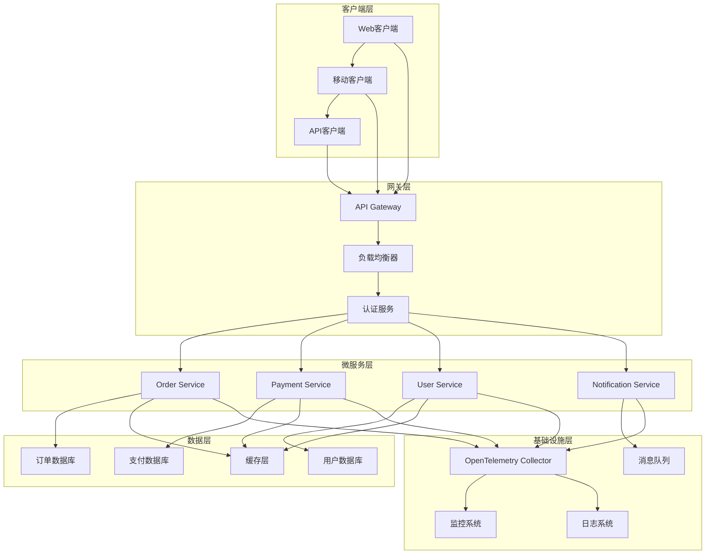
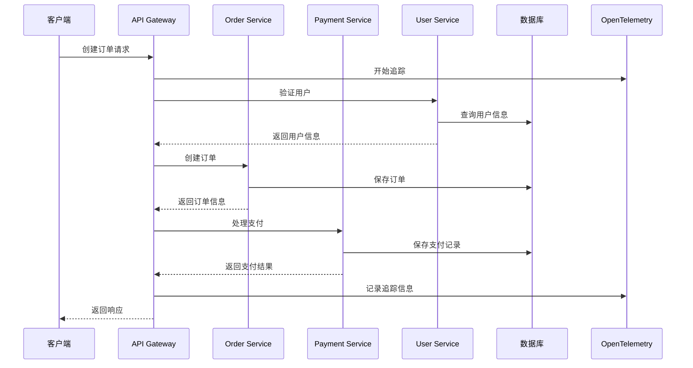
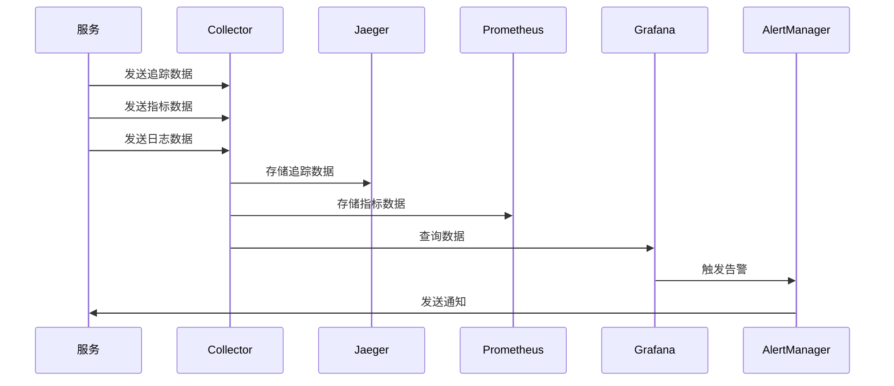

# 架构设计文档

## 📋 概述

本文档详细描述了OTLP Go项目的整体架构设计，包括系统架构、技术栈、模块设计和数据流等核心内容。

## 🏗️ 系统架构

### 整体架构图



### 架构原则

1. **微服务架构**: 服务解耦，独立部署
2. **事件驱动**: 异步通信，提高响应性
3. **可观测性**: 完整的监控、日志和追踪
4. **高可用**: 容错设计，故障隔离
5. **可扩展**: 水平扩展，弹性伸缩
6. **安全性**: 多层安全防护

## 🔧 技术栈

### 核心框架

| 组件 | 技术选型 | 版本 | 说明 |
|------|----------|------|------|
| 编程语言 | Go | 1.25.1 | 高性能、并发友好 |
| 微服务框架 | 原生HTTP | - | 轻量级，高性能 |
| API网关 | 自定义实现 | - | 路由、认证、限流 |
| 数据库 | PostgreSQL | 15+ | 关系型数据库 |
| 缓存 | Redis | 7+ | 内存缓存 |
| 消息队列 | RabbitMQ | 3.12+ | 异步通信 |

### 可观测性技术栈

| 组件 | 技术选型 | 版本 | 说明 |
|------|----------|------|------|
| 追踪 | OpenTelemetry | 1.20+ | 分布式追踪 |
| 指标 | OpenTelemetry Metrics | 1.20+ | 性能指标 |
| 日志 | OpenTelemetry Logs | 1.20+ | 结构化日志 |
| 收集器 | OTel Collector | 0.90+ | 数据收集 |
| 存储 | Jaeger | 1.50+ | 追踪存储 |
| 可视化 | Grafana | 10+ | 监控面板 |

### 基础设施技术栈

| 组件 | 技术选型 | 版本 | 说明 |
|------|----------|------|------|
| 容器化 | Docker | 24+ | 应用容器化 |
| 编排 | Kubernetes | 1.28+ | 容器编排 |
| 服务发现 | Consul | 1.16+ | 服务注册发现 |
| 配置管理 | Consul KV | 1.16+ | 配置中心 |
| 负载均衡 | Nginx | 1.24+ | 反向代理 |
| 监控 | Prometheus | 2.47+ | 指标收集 |

## 📦 模块设计

### 核心模块

#### 1. 类型定义模块 (`pkg/types`)

```go
// 通用类型定义
type CreateOrderRequest struct {
    UserID    string      `json:"user_id"`
    Items     []OrderItem `json:"items"`
    Total     float64     `json:"total"`
    Currency  string      `json:"currency"`
}

type Order struct {
    ID          string    `json:"id"`
    UserID      string    `json:"user_id"`
    Items       []OrderItem `json:"items"`
    Total       float64   `json:"total"`
    Status      string    `json:"status"`
    CreatedAt   time.Time `json:"created_at"`
    UpdatedAt   time.Time `json:"updated_at"`
}
```

**职责**:
- 定义统一的数据结构
- 提供类型安全保证
- 支持JSON序列化/反序列化

#### 2. 配置管理模块 (`pkg/config`)

```go
type OTLPConfig struct {
    Endpoint      string            `json:"endpoint"`
    ServiceName   string            `json:"service_name"`
    ServiceVersion string           `json:"service_version"`
    ResourceAttributes map[string]string `json:"resource_attributes"`
}

func ValidateOTLPConfig(cfg *OTLPConfig) error {
    if cfg.Endpoint == "" {
        return fmt.Errorf("endpoint is required")
    }
    if cfg.ServiceName == "" {
        return fmt.Errorf("service_name is required")
    }
    return nil
}
```

**职责**:
- 集中管理配置
- 配置验证和默认值
- 环境变量支持

#### 3. 错误处理模块 (`pkg/errors`)

```go
type ErrorHandler interface {
    HandleError(ctx context.Context, err error) error
    LogError(ctx context.Context, err error, fields map[string]interface{})
}

func WrapError(err error, message string) error {
    return fmt.Errorf("%s: %w", message, err)
}
```

**职责**:
- 统一错误处理
- 错误包装和上下文
- 错误日志记录

#### 4. 资源管理模块 (`pkg/resource`)

```go
type Resource interface {
    Initialize(ctx context.Context) error
    Shutdown(ctx context.Context) error
    GetName() string
}

type ResourceManager struct {
    resources map[string]Resource
    mu        sync.RWMutex
}
```

**职责**:
- 资源生命周期管理
- 优雅关闭
- 资源依赖管理

#### 5. OpenTelemetry集成模块 (`pkg/otel`)

```go
type OTelManager struct {
    tracerProvider trace.TracerProvider
    meterProvider  metric.MeterProvider
    propagator     propagation.TextMapPropagator
}

func InitializeGlobalOTel(ctx context.Context, cfg *config.OTLPConfig) error {
    // 初始化追踪器
    // 初始化指标器
    // 配置传播器
}
```

**职责**:
- OpenTelemetry SDK初始化
- 追踪和指标配置
- 全局管理器

### 功能模块

#### 1. 性能优化模块 (`pkg/performance`)

```go
type PerformanceManager struct {
    allocator      MemoryAllocator
    stringOptimizer StringOptimizer
    poolManager    PoolManager
    benchmarker    Benchmarker
}

type MemoryAllocator interface {
    Allocate(size int) []byte
    Free(data []byte)
    GetStats() AllocationStats
}
```

**职责**:
- 内存分配优化
- 字符串操作优化
- 对象池管理
- 性能基准测试

#### 2. 安全加固模块 (`pkg/security`)

```go
type SecurityManager struct {
    dataFilter    SensitiveDataFilter
    validator     InputValidator
    authManager   AuthorizationManager
    auditLogger   AuditLogger
}

type SensitiveDataFilter struct {
    patterns map[string]string
    mode     FilterMode
}
```

**职责**:
- 敏感数据过滤
- 输入验证
- 授权管理
- 审计日志

#### 3. 测试框架模块 (`pkg/testing`)

```go
type TestSuite struct {
    name     string
    tests    []TestCase
    setup    func() error
    teardown func() error
}

type MockService struct {
    data    map[string]interface{}
    errors  map[string]error
    latency time.Duration
}
```

**职责**:
- 测试套件管理
- 模拟服务
- 断言助手
- 测试数据生成

#### 4. 自动化集成模块 (`pkg/automation`)

```go
type AutomationManager struct {
    pipelineExecutor PipelineExecutor
    qualityChecker   CodeQualityChecker
    deploymentManager DeploymentManager
    notificationService NotificationService
}

type PipelineExecutor struct {
    stages []PipelineStage
    config PipelineConfig
}
```

**职责**:
- CI/CD流水线
- 代码质量检查
- 自动化部署
- 通知系统

#### 5. 监控告警模块 (`pkg/monitoring`)

```go
type MonitoringManager struct {
    metricMgr  *MetricManager
    alertMgr   *AlertManager
    dashboard  *Dashboard
}

type MetricManager struct {
    collectors map[string]MetricCollector
}
```

**职责**:
- 指标收集
- 告警规则
- 实时仪表板
- 通知系统

## 🔄 数据流设计

### 请求处理流程



### 监控数据流



## 🏛️ 微服务设计

### 服务拆分原则

1. **业务能力**: 按业务功能拆分
2. **数据所有权**: 每个服务拥有独立数据
3. **团队边界**: 按团队组织拆分
4. **技术栈**: 支持不同技术栈
5. **部署独立**: 独立部署和扩展

### 服务通信模式

#### 1. 同步通信

```go
// HTTP REST API
type OrderServiceClient struct {
    baseURL string
    client  *http.Client
}

func (c *OrderServiceClient) CreateOrder(ctx context.Context, req *types.CreateOrderRequest) (*types.Order, error) {
    // HTTP请求实现
}
```

#### 2. 异步通信

```go
// 消息队列
type EventPublisher struct {
    producer *rabbitmq.Producer
}

func (p *EventPublisher) PublishOrderCreated(ctx context.Context, order *types.Order) error {
    event := &OrderCreatedEvent{
        OrderID: order.ID,
        UserID:  order.UserID,
        Total:   order.Total,
    }
    return p.producer.Publish(ctx, "order.created", event)
}
```

### 数据一致性

#### 1. 最终一致性

```go
// Saga模式
type OrderSaga struct {
    steps []SagaStep
}

type SagaStep struct {
    Action    func(ctx context.Context) error
    Compensate func(ctx context.Context) error
}
```

#### 2. 事件溯源

```go
// 事件存储
type EventStore struct {
    events []DomainEvent
}

type DomainEvent struct {
    ID        string
    Type      string
    Data      interface{}
    Timestamp time.Time
}
```

## 🔒 安全架构

### 安全层次

1. **网络安全**: 防火墙、VPN、网络隔离
2. **应用安全**: 认证、授权、输入验证
3. **数据安全**: 加密、脱敏、备份
4. **运维安全**: 访问控制、审计日志

### 认证授权

```go
// JWT认证
type AuthService struct {
    jwtSecret string
    userRepo  UserRepository
}

func (s *AuthService) Authenticate(ctx context.Context, token string) (*User, error) {
    claims, err := s.validateToken(token)
    if err != nil {
        return nil, err
    }
    return s.userRepo.GetByID(ctx, claims.UserID)
}

// RBAC授权
type AuthorizationService struct {
    roleRepo RoleRepository
}

func (s *AuthorizationService) Authorize(ctx context.Context, user *User, resource string, action string) error {
    roles := s.roleRepo.GetUserRoles(ctx, user.ID)
    for _, role := range roles {
        if role.HasPermission(resource, action) {
            return nil
        }
    }
    return ErrUnauthorized
}
```

## 📊 性能架构

### 性能优化策略

1. **缓存策略**: 多级缓存，缓存预热
2. **数据库优化**: 索引优化，查询优化
3. **并发优化**: 协程池，连接池
4. **资源优化**: 内存池，对象复用

### 性能监控

```go
// 性能指标收集
type PerformanceCollector struct {
    metrics map[string]float64
    mu      sync.RWMutex
}

func (c *PerformanceCollector) RecordLatency(operation string, latency time.Duration) {
    c.mu.Lock()
    defer c.mu.Unlock()
    c.metrics[operation+"_latency"] = float64(latency.Milliseconds())
}

func (c *PerformanceCollector) RecordThroughput(operation string, count int) {
    c.mu.Lock()
    defer c.mu.Unlock()
    c.metrics[operation+"_throughput"] = float64(count)
}
```

## 🚀 部署架构

### 容器化部署

```dockerfile
# 多阶段构建
FROM golang:1.25.1-alpine AS builder
WORKDIR /app
COPY . .
RUN go mod tidy
RUN go build -o main src/microservices/main_demo.go

FROM alpine:latest
RUN apk --no-cache add ca-certificates
WORKDIR /root/
COPY --from=builder /app/main .
CMD ["./main"]
```

### Kubernetes部署

```yaml
# 部署配置
apiVersion: apps/v1
kind: Deployment
metadata:
  name: otlp-go-demo
spec:
  replicas: 3
  selector:
    matchLabels:
      app: otlp-go-demo
  template:
    metadata:
      labels:
        app: otlp-go-demo
    spec:
      containers:
      - name: otlp-go-demo
        image: otlp-go-demo:latest
        ports:
        - containerPort: 8080
        env:
        - name: OTEL_EXPORTER_OTLP_ENDPOINT
          value: "http://otel-collector:4317"
        resources:
          requests:
            memory: "64Mi"
            cpu: "250m"
          limits:
            memory: "128Mi"
            cpu: "500m"
```

### 服务网格

```yaml
# Istio配置
apiVersion: networking.istio.io/v1alpha3
kind: VirtualService
metadata:
  name: otlp-go-demo
spec:
  hosts:
  - otlp-go-demo
  http:
  - match:
    - uri:
        prefix: /api/v1
    route:
    - destination:
        host: otlp-go-demo
        port:
          number: 8080
    timeout: 30s
    retries:
      attempts: 3
      perTryTimeout: 10s
```

## 🔍 可观测性架构

### 三层可观测性

1. **指标 (Metrics)**: 系统性能指标
2. **日志 (Logs)**: 应用运行日志
3. **追踪 (Traces)**: 请求调用链

### 数据收集

```go
// 指标收集
type MetricsCollector struct {
    counters   map[string]int64
    gauges     map[string]float64
    histograms map[string][]float64
}

// 日志收集
type LogCollector struct {
    logs []LogEntry
}

// 追踪收集
type TraceCollector struct {
    spans []Span
}
```

### 数据存储

- **Jaeger**: 追踪数据存储
- **Prometheus**: 指标数据存储
- **Elasticsearch**: 日志数据存储
- **Grafana**: 数据可视化

## 📈 扩展性设计

### 水平扩展

1. **无状态服务**: 服务无状态，支持水平扩展
2. **负载均衡**: 请求分发到多个实例
3. **数据分片**: 数据库水平分片
4. **缓存集群**: 分布式缓存

### 垂直扩展

1. **资源优化**: CPU、内存优化
2. **性能调优**: 算法和数据结构优化
3. **硬件升级**: 更强大的硬件支持

## 🔄 容错设计

### 故障隔离

1. **服务隔离**: 服务间故障隔离
2. **数据隔离**: 数据存储隔离
3. **网络隔离**: 网络分段隔离

### 故障恢复

1. **重试机制**: 自动重试失败请求
2. **熔断器**: 防止级联故障
3. **降级策略**: 服务降级和限流
4. **备份恢复**: 数据备份和恢复

## 📝 总结

本架构设计文档详细描述了OTLP Go项目的整体架构，包括：

1. **系统架构**: 微服务架构，分层设计
2. **技术栈**: 现代化技术栈选择
3. **模块设计**: 清晰的模块划分和职责
4. **数据流**: 请求处理和监控数据流
5. **安全架构**: 多层次安全防护
6. **性能架构**: 性能优化和监控
7. **部署架构**: 容器化和Kubernetes部署
8. **可观测性**: 完整的监控、日志和追踪
9. **扩展性**: 水平和垂直扩展支持
10. **容错性**: 故障隔离和恢复机制

该架构设计为OTLP Go项目提供了坚实的技术基础，支持高可用、高性能、可扩展的企业级应用需求。

---

**文档版本**: v1.0.0  
**最后更新**: 2025年10月13日  
**维护者**: OTLP Go Team
