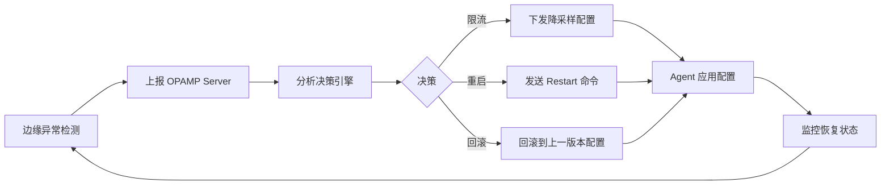

# 分布式模型（拓扑/一致性/容错）

## 目录

- [分布式模型（拓扑/一致性/容错）](#分布式模型拓扑一致性容错)
  - [目录](#目录)
  - [1. 系统拓扑架构](#1-系统拓扑架构)
    - [1.1 三层拓扑设计](#11-三层拓扑设计)
    - [1.2 边缘聚合层（DaemonSet Agent）](#12-边缘聚合层daemonset-agent)
    - [1.3 区域汇聚层（Gateway）](#13-区域汇聚层gateway)
    - [1.4 中心存储层（Backend）](#14-中心存储层backend)
  - [2. 一致性模型](#2-一致性模型)
    - [2.1 最终一致性](#21-最终一致性)
    - [2.2 顺序性保证](#22-顺序性保证)
    - [2.3 因果一致性](#23-因果一致性)
  - [3. 容错机制](#3-容错机制)
    - [3.1 背压控制](#31-背压控制)
    - [3.2 旁路降级](#32-旁路降级)
    - [3.3 重试与断路器](#33-重试与断路器)
  - [4. 多租户隔离](#4-多租户隔离)
    - [4.1 三维标签体系](#41-三维标签体系)
    - [4.2 路由与隔离](#42-路由与隔离)
  - [5. 自愈机制](#5-自愈机制)
    - [5.1 异常检测](#51-异常检测)
    - [5.2 自动响应](#52-自动响应)
    - [5.3 OPAMP 联动](#53-opamp-联动)
  - [6. 性能与可扩展性](#6-性能与可扩展性)
    - [6.1 水平扩展](#61-水平扩展)
    - [6.2 性能基线](#62-性能基线)
  - [7. 参考资料](#7-参考资料)

## 1. 系统拓扑架构

### 1.1 三层拓扑设计

OTLP 分布式系统采用经典的三层架构，确保数据采集的高可用性和可扩展性：

```text
┌─────────────────────────────────────────────────────────────────┐
│                     Application Layer                           │
│  ┌──────────┐  ┌──────────┐  ┌──────────┐  ┌──────────┐         │
│  │  App A   │  │  App B   │  │  App C   │  │  App D   │         │
│  │  (SDK)   │  │  (SDK)   │  │  (SDK)   │  │  (SDK)   │         │
│  └────┬─────┘  └────┬─────┘  └────┬─────┘  └────┬─────┘         │
└───────┼─────────────┼─────────────┼─────────────┼───────────────┘
        │             │             │             │
        └─────────────┴─────────────┴─────────────┘
                            │
                            ▼
┌─────────────────────────────────────────────────────────────────┐
│              Edge Aggregation Layer (DaemonSet)                 │
│  ┌─────────────┐  ┌─────────────┐  ┌─────────────┐              │
│  │  Agent-1    │  │  Agent-2    │  │  Agent-3    │              │
│  │  (Node-1)   │  │  (Node-2)   │  │  (Node-3)   │              │
│  │  • Batch    │  │  • Batch    │  │  • Batch    │              │
│  │  • Filter   │  │  • Filter   │  │  • Filter   │              │
│  │  • Sample   │  │  • Sample   │  │  • Sample   │              │
│  └──────┬──────┘  └──────┬──────┘  └──────┬──────┘              │
└─────────┼────────────────┼─────────────────┼────────────────────┘
          │                │                 │
          └────────────────┴─────────────────┘
                            │
                            ▼
┌─────────────────────────────────────────────────────────────────┐
│           Regional Gateway Layer (Cross-AZ)                     │
│  ┌─────────────────┐  ┌─────────────────┐                       │
│  │  Gateway-West   │  │  Gateway-East   │                       │
│  │  • Route        │  │  • Route        │                       │
│  │  • Aggregate    │  │  • Aggregate    │                       │
│  │  • Transform    │  │  • Transform    │                       │
│  │  • Load Balance │  │  • Load Balance │                       │
│  └────────┬────────┘  └────────┬────────┘                       │
└───────────┼────────────────────┼────────────────────────────────┘
            │                    │
            └────────────────────┘
                      │
                      ▼
┌────────────────────────────────────────────────────────────────┐
│                Central Backend Layer                           │
│  ┌──────────┐  ┌──────────┐  ┌──────────┐  ┌──────────┐        │
│  │  Jaeger  │  │  Tempo   │  │Prometheus│  │   Loki   │        │
│  │ (Traces) │  │ (Traces) │  │(Metrics) │  │  (Logs)  │        │
│  └──────────┘  └──────────┘  └──────────┘  └──────────┘        │
└────────────────────────────────────────────────────────────────┘
```

### 1.2 边缘聚合层（DaemonSet Agent）

**部署模式**：Kubernetes DaemonSet，每个节点一个 Agent 实例

**核心职责**：

- **本地聚合**：收集同节点所有 Pod 的遥测数据
- **批量处理**：按时间窗口（10s）或大小（1024 spans）批量发送
- **初步过滤**：丢弃调试级别日志、过滤健康检查请求
- **采样决策**：头部采样（Head-based Sampling），降低数据量

**配置示例**：

```yaml
receivers:
  otlp:
    protocols:
      grpc:
        endpoint: 0.0.0.0:4317

processors:
  batch:
    timeout: 10s
    send_batch_size: 1024
  
  filter:
    traces:
      span:
        - 'attributes["http.target"] == "/health"'
  
  probabilistic_sampler:
    sampling_percentage: 50  # 50% 采样率

exporters:
  otlp:
    endpoint: gateway.region-west.svc.cluster.local:4317
    tls:
      insecure: false
```

### 1.3 区域汇聚层（Gateway）

**部署模式**：跨可用区（AZ）部署，每个区域 3+ 实例

**核心职责**：

- **跨 AZ 汇聚**：聚合多个边缘 Agent 的数据
- **智能路由**：根据租户、环境、信号类型路由到不同后端
- **尾部采样**：基于完整 Trace 的采样决策（保留错误和慢请求）
- **负载均衡**：多后端负载均衡与故障转移

**配置示例**：

```yaml
processors:
  tail_sampling:
    decision_wait: 10s
    policies:
      - name: errors
        type: status_code
        status_code: {status_codes: [ERROR]}
      - name: slow
        type: latency
        latency: {threshold_ms: 1000}
      - name: probabilistic
        type: probabilistic
        probabilistic: {sampling_percentage: 10}
  
  routing:
    from_attribute: tenant
    table:
      - value: tenant-a
        exporters: [otlp/tenant-a]
      - value: tenant-b
        exporters: [otlp/tenant-b]

exporters:
  otlp/tenant-a:
    endpoint: backend-a.example.com:4317
  otlp/tenant-b:
    endpoint: backend-b.example.com:4317
```

### 1.4 中心存储层（Backend）

**组件选型**：

- **Traces**：Jaeger / Tempo（支持 OTLP 原生接收）
- **Metrics**：Prometheus / Mimir（长期存储）
- **Logs**：Loki / Elasticsearch
- **Profiles**：Grafana Phlare / Pyroscope

**数据保留策略**：

- **热数据**：7 天（SSD 存储，快速查询）
- **温数据**：30 天（对象存储，降采样）
- **冷数据**：90 天（归档存储，仅保留聚合数据）

## 2. 一致性模型

### 2.1 最终一致性

**设计原则**：遥测数据为追加型（Append-Only）数据流，采用 **at-least-once** 交付语义

**去重机制**：

```go
// 唯一标识：(trace_id, span_id, timestamp)
type SpanID struct {
    TraceID   string
    SpanID    string
    Timestamp int64
}

// 去重窗口：5 分钟滑动窗口
type Deduplicator struct {
    seen  map[SpanID]bool
    mutex sync.RWMutex
    ttl   time.Duration
}

func (d *Deduplicator) IsDuplicate(id SpanID) bool {
    d.mutex.RLock()
    defer d.mutex.RUnlock()
    return d.seen[id]
}
```

**收敛时间**：在网络正常情况下，数据在 30 秒内达到最终一致

### 2.2 顺序性保证

**资源内顺序**：同一 Resource（如同一服务实例）的数据保持时间戳有序

**实现机制**：

- **批量窗口对齐**：同一批次内按时间戳排序
- **分区键**：使用 `service.instance.id` 作为分区键，确保同实例数据路由到同一处理器

```yaml
processors:
  groupbyattrs:
    keys:
      - service.instance.id
  
  batch:
    timeout: 10s
    send_batch_size: 1024
```

### 2.3 因果一致性

**Trace 内因果关系**：通过 `parent_span_id` 维护 Span 之间的因果链

**跨服务传播**：

```go
// W3C Trace Context 传播
import "go.opentelemetry.io/otel/propagation"

propagator := propagation.NewCompositeTextMapPropagator(
    propagation.TraceContext{},
    propagation.Baggage{},
)

// HTTP 请求注入
propagator.Inject(ctx, propagation.HeaderCarrier(req.Header))

// HTTP 响应提取
ctx = propagator.Extract(ctx, propagation.HeaderCarrier(req.Header))
```

## 3. 容错机制

### 3.1 背压控制

**队列高水位检测**：

```go
type BackpressureController struct {
    queueSize     int
    queueCapacity int
    highWaterMark float64  // 0.8 (80%)
}

func (b *BackpressureController) ShouldApplyBackpressure() bool {
    utilization := float64(b.queueSize) / float64(b.queueCapacity)
    return utilization > b.highWaterMark
}
```

**降级策略**：

1. **降采样**：采样率从 50% 降至 10%
2. **降精度**：Histogram 桶数从 100 降至 10
3. **丢弃低优先级数据**：丢弃 DEBUG 级别日志

### 3.2 旁路降级

**本地落盘**：后端不可用时，数据写入本地 Parquet 文件

```yaml
exporters:
  file:
    path: /var/lib/otelcol/buffer
    format: parquet
    rotation:
      max_megabytes: 100
      max_days: 1

service:
  pipelines:
    traces:
      exporters: [otlp/primary, file]  # 双写
```

**延迟回传**：后端恢复后，自动重放本地文件

```go
func (r *Replayer) ReplayFromDisk(ctx context.Context) error {
    files, _ := filepath.Glob("/var/lib/otelcol/buffer/*.parquet")
    for _, file := range files {
        data, _ := parquet.ReadFile(file)
        if err := r.exporter.Export(ctx, data); err == nil {
            os.Remove(file)  // 成功后删除
        }
    }
    return nil
}
```

### 3.3 重试与断路器

**指数退避重试**：

```go
type RetryPolicy struct {
    InitialInterval time.Duration  // 1s
    MaxInterval     time.Duration  // 30s
    MaxElapsedTime  time.Duration  // 5m
    Multiplier      float64        // 2.0
}
```

**断路器状态机**：

```text
[Closed] ---(失败率 > 50%)---> [Open]
   ↑                              │
   │                              │ (30s 后)
   │                              ▼
   └---------(成功)---------- [Half-Open]
```

## 4. 多租户隔离

### 4.1 三维标签体系

**标签维度**：

- **租户**：`tenant=team-a`
- **环境**：`env=prod`
- **区域**：`region=us-west`

**标签注入**：

```yaml
processors:
  resource:
    attributes:
      - key: tenant
        value: ${TENANT}
        action: insert
      - key: env
        value: ${ENV}
        action: insert
```

### 4.2 路由与隔离

**独立管道**：不同租户使用独立的 Collector Pipeline

```yaml
service:
  pipelines:
    traces/tenant-a:
      receivers: [otlp]
      processors: [filter/tenant-a, batch]
      exporters: [otlp/tenant-a-backend]
    
    traces/tenant-b:
      receivers: [otlp]
      processors: [filter/tenant-b, batch]
      exporters: [otlp/tenant-b-backend]
```

**存储隔离**：不同租户数据存储到不同的数据库/表

## 5. 自愈机制

### 5.1 异常检测

**EWMA（指数加权移动平均）**：

```go
type EWMADetector struct {
    alpha float64  // 0.3
    mean  float64
}

func (d *EWMADetector) Update(value float64) {
    d.mean = d.alpha*value + (1-d.alpha)*d.mean
}

func (d *EWMADetector) IsAnomaly(value float64) bool {
    deviation := math.Abs(value - d.mean)
    return deviation > 3*d.stdDev()  // 3-sigma 规则
}
```

**Z-Score 检测**：

```go
func ZScore(value, mean, stdDev float64) float64 {
    return (value - mean) / stdDev
}

func IsAnomaly(zScore float64) bool {
    return math.Abs(zScore) > 3.0
}
```

### 5.2 自动响应

**触发条件与响应动作**：

| 异常类型 | 检测指标 | 响应动作 |
|---------|---------|---------|
| 内存告警 | memory_usage > 80% | 下发 memory_limiter 配置 |
| 高错误率 | error_rate > 5% | 回滚最近配置变更 |
| 队列溢出 | queue_utilization > 90% | 降低采样率至 10% |
| 后端不可用 | export_error > 50% | 启用本地落盘 |

### 5.3 OPAMP 联动

**自愈流程**：



**OPAMP 配置下发**：

```yaml
# Server 下发紧急配置
remote_config:
  priority: URGENT
  config:
    processors:
      probabilistic_sampler:
        sampling_percentage: 5  # 紧急降采样
      
      memory_limiter:
        limit_mib: 400
        spike_limit_mib: 100
```

## 6. 性能与可扩展性

### 6.1 水平扩展

**Agent 层**：随节点数线性扩展（DaemonSet）

**Gateway 层**：根据负载动态扩缩容

```yaml
apiVersion: autoscaling/v2
kind: HorizontalPodAutoscaler
metadata:
  name: otel-gateway
spec:
  scaleTargetRef:
    apiVersion: apps/v1
    kind: Deployment
    name: otel-gateway
  minReplicas: 3
  maxReplicas: 20
  metrics:
  - type: Resource
    resource:
      name: cpu
      target:
        type: Utilization
        averageUtilization: 70
```

### 6.2 性能基线

**单 Agent 吞吐量**：

- Tracing：≥ 50k span/s
- Metrics：≥ 100k datapoints/s
- Logs：≥ 20k records/s

**端到端延迟**（P95）：

- Agent 处理：< 2 ms
- Gateway 处理：< 8 ms
- 总延迟：< 50 ms

## 7. 参考资料

- **详细分布式模型**：`docs/analysis/distributed-model/system-model.md`
- **技术实现**：`docs/design/technical-model.md`
- **OPAMP 控制平面**：`docs/opamp/overview.md`
- **OTTL 规则示例**：`docs/otlp/ottl-examples.md`
- **形式化证明**：`docs/design/formal-proof.md`
