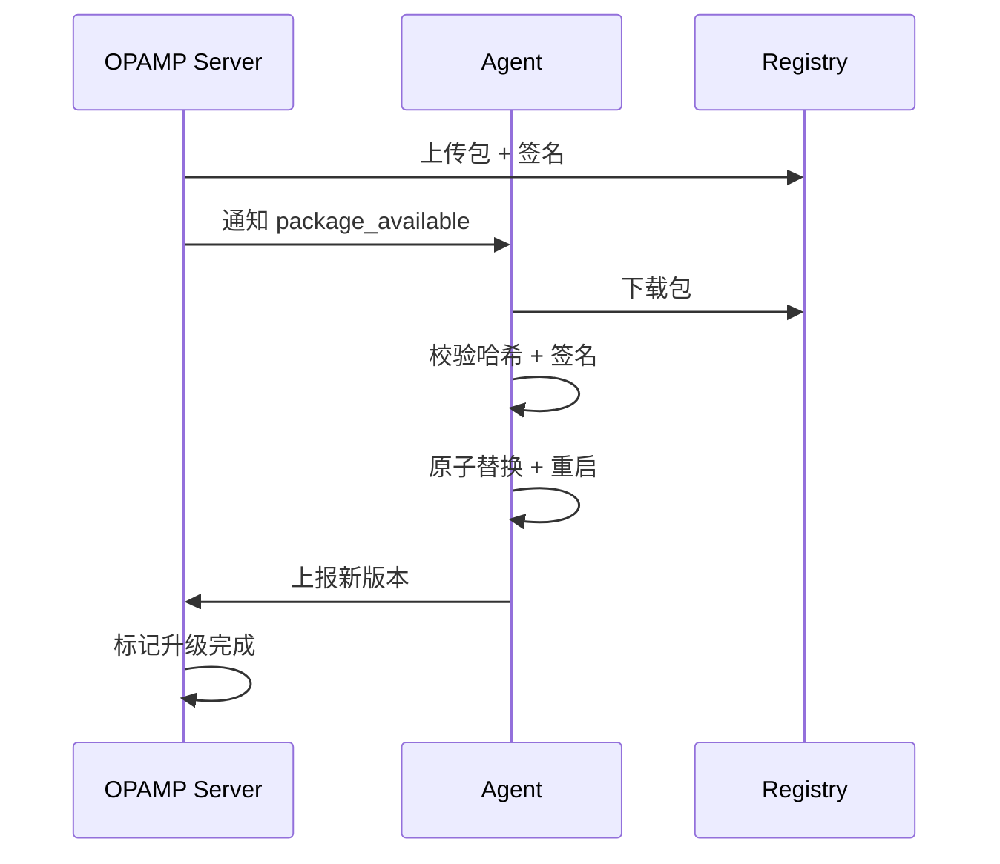
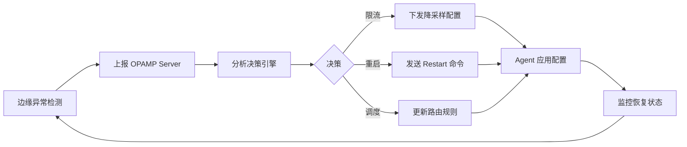

# OPAMP 概览（控制平面）

## 目录

- [OPAMP 概览（控制平面）](#opamp-概览控制平面)
  - [目录](#目录)
  - [1. 什么是 OPAMP](#1-什么是-opamp)
  - [2. 核心能力](#2-核心能力)
    - [2.1 远程配置管理](#21-远程配置管理)
    - [2.2 证书轮转](#22-证书轮转)
    - [2.3 插件与二进制分发](#23-插件与二进制分发)
    - [2.4 健康监控与上报](#24-健康监控与上报)
  - [3. 协议架构](#3-协议架构)
    - [3.1 通信模型](#31-通信模型)
    - [3.2 核心 RPC 接口](#32-核心-rpc-接口)
  - [4. 安全机制](#4-安全机制)
    - [4.1 版本控制](#41-版本控制)
    - [4.2 安全传输](#42-安全传输)
    - [4.3 灰度发布](#43-灰度发布)
  - [5. 与 OTLP 生态协同](#5-与-otlp-生态协同)
    - [5.1 OTTL 规则下发](#51-ottl-规则下发)
    - [5.2 Collector 动态配置](#52-collector-动态配置)
    - [5.3 自愈机制](#53-自愈机制)
  - [6. 实现参考](#6-实现参考)
  - [7. 参考资料](#7-参考资料)

## 1. 什么是 OPAMP

**OPAMP**（Open Agent Management Protocol）是 OpenTelemetry 项目推出的**开放代理管理协议**，用于统一管理分布式环境中的遥测数据采集代理（Agent）和 Collector。

核心价值：

- **集中管理**：通过控制平面统一管理数以万计的边缘 Agent
- **动态配置**：无需重启即可热更新配置、规则和插件
- **安全可靠**：内置版本控制、签名验证和灰度发布机制
- **自动化运维**：支持自动证书轮转、健康监控和自愈

## 2. 核心能力

### 2.1 远程配置管理

**功能**：Server 端集中管理并下发配置到所有 Agent

**特性**：

- 配置版本化管理（Git/Database 存储）
- 增量配置更新（仅下发变更部分）
- 配置回滚机制（保留历史版本）
- 配置模板化（支持变量替换和条件渲染）

**应用场景**：

- 动态调整采样率（应对流量突增）
- 修改数据过滤规则（合规要求变更）
- 更新后端导出地址（迁移存储系统）
- 调整资源限制（内存/CPU 配额）

### 2.2 证书轮转

**功能**：自动化 mTLS 证书的生命周期管理

**流程**：

1. Server 检测证书即将过期（提前 7 天）
2. 生成新证书并通过 OPAMP 下发
3. Agent 验证签名后原子替换证书
4. Agent 上报证书更新状态
5. Server 确认后标记旧证书废弃

**安全保障**：

- 证书哈希校验（防篡改）
- 数字签名验证（防伪造）
- 原子替换机制（无中断）
- 回滚能力（失败自动恢复）

### 2.3 插件与二进制分发

**功能**：远程分发 WASM 插件、OTTL 规则和 Agent 二进制

**支持格式**：

- **WASM 插件**：自定义处理器（如特殊协议解析）
- **OTTL 规则**：声明式数据转换脚本
- **Agent 二进制**：完整的 Collector/Agent 升级包

**分发流程**：



### 2.4 健康监控与上报

**Agent 上报内容**：

- 运行状态（running/stopped/error）
- 资源使用（CPU/Memory/Goroutines）
- 处理指标（吞吐量/延迟/错误率）
- 配置版本（当前生效的配置哈希）

**Server 监控能力**：

- 实时健康仪表盘
- 异常自动告警
- 趋势分析与预测
- 自动化响应（触发限流/重启/回滚）

## 3. 协议架构

### 3.1 通信模型

OPAMP 采用 **gRPC 双向流**（Bidirectional Streaming）实现实时通信：

```go
service OpAMPService {
  // Agent 与 Server 建立长连接
  rpc Connect(stream AgentToServer) returns (stream ServerToAgent);
}
```

**优势**：

- 低延迟（毫秒级配置下发）
- 双向通信（Server 可主动推送）
- 连接复用（减少握手开销）
- 自动重连（网络抖动容忍）

### 3.2 核心 RPC 接口

**Agent → Server**：

- `AgentIdentify`：上报身份（ID/版本/能力）
- `Heartbeat`：心跳保活（每 30 秒）
- `StatusReport`：健康状态上报
- `ConfigResult`：配置应用结果反馈

**Server → Agent**：

- `RemoteConfig`：下发配置更新
- `CertificateOffer`：提供新证书
- `PackageAvailable`：通知可用更新包
- `Command`：执行控制命令（重启/日志级别）

## 4. 安全机制

### 4.1 版本控制

每个配置/证书/包都包含：

- **版本号**：语义化版本（如 `v1.2.3`）
- **哈希值**：SHA256 内容摘要
- **签名**：RSA/ECDSA 数字签名
- **时间戳**：生成时间（用于排序）

### 4.2 安全传输

**传输层安全**：

- mTLS 双向认证（Server 和 Agent 互相验证）
- TLS 1.3 协议（最新安全标准）
- 证书固定（Certificate Pinning）

**应用层安全**：

- 签名验证（防止中间人攻击）
- 哈希校验（防止内容篡改）
- 重放保护（时间戳 + Nonce）

### 4.3 灰度发布

**策略**：

- **标签选择**：按 `env=prod`、`region=us-west` 等标签分组
- **灰度权重**：先 5% → 20% → 50% → 100%
- **回滚窗口**：观察 10 分钟，异常自动回滚
- **金丝雀部署**：先在测试集群验证

**示例配置**：

```yaml
rollout:
  strategy: canary
  stages:
    - selector: {env: staging}
      weight: 100%
      duration: 1h
    - selector: {env: prod, region: us-west}
      weight: 10%
      duration: 30m
    - selector: {env: prod}
      weight: 100%
  rollback:
    on_error_rate: 5%
    observation_window: 10m
```

## 5. 与 OTLP 生态协同

### 5.1 OTTL 规则下发

通过 OPAMP 动态下发 OTTL 转换规则：

```yaml
remote_config:
  processors:
    transform:
      traces:
        # 生产环境脱敏
        - set(attributes["user.id"], SHA256(attributes["user.id"])) 
          where resource.attributes["env"] == "prod"
        # 超时标记
        - set(status.message, "timeout") 
          where duration > 3s
```

**实时生效**：无需重启 Collector，10 秒内全集群生效

### 5.2 Collector 动态配置

**边缘 Collector 配置调整**：

```yaml
# Server 下发
exporters:
  otlp/primary:
    endpoint: new-backend.example.com:4317
  otlp/backup:
    endpoint: backup.example.com:4317

service:
  pipelines:
    traces:
      exporters: [otlp/primary, otlp/backup]
```

**DaemonSet Agent 采样率调整**：

```yaml
processors:
  probabilistic_sampler:
    sampling_percentage: 10  # 从 50% 降至 10%
```

### 5.3 自愈机制

**闭环自愈流程**：



**示例场景**：

1. **内存告警**：检测到 Agent 内存 > 80%
2. **自动响应**：下发 `memory_limiter` 配置，限制队列大小
3. **效果验证**：监控内存下降至 60%
4. **记录审计**：日志记录自愈动作和结果

## 6. 实现参考

**官方库**：

- **opamp-go**：Go 语言参考实现（Agent + Server）
  - GitHub: `open-telemetry/opamp-go`
  - 版本：v0.14.0+（2025 年稳定版）

**集成示例**：

```go
import "github.com/open-telemetry/opamp-go/client"

// 创建 OPAMP 客户端
opampClient := client.NewWebSocket(nil)
opampClient.SetAgentDescription(&protobufs.AgentDescription{
    IdentifyingAttributes: []*common.KeyValue{
        {Key: "service.name", Value: &common.AnyValue{Value: &common.AnyValue_StringValue{StringValue: "my-collector"}}},
    },
})

// 连接到 Server
opampClient.Start(context.Background(), client.StartSettings{
    OpAMPServerURL: "wss://opamp.example.com/v1/opamp",
    TLSConfig:      tlsConfig,
    Callbacks: client.CallbacksStruct{
        OnMessageFunc: handleServerMessage,
    },
})
```

**部署架构**：

```yaml
# Kubernetes Deployment
apiVersion: apps/v1
kind: Deployment
metadata:
  name: opamp-server
spec:
  replicas: 3
  template:
    spec:
      containers:
      - name: opamp-server
        image: opamp-server:v1.0.0
        ports:
        - containerPort: 4320  # OPAMP gRPC
        - containerPort: 8080  # 管理 UI
```

## 7. 参考资料

- **官方规范**：[OPAMP Specification](https://github.com/open-telemetry/opamp-spec)
- **实现库**：[opamp-go](https://github.com/open-telemetry/opamp-go)
- **示例配置**：`docs/opamp/sample.md`
- **技术架构**：`docs/design/technical-model.md`
- **分布式模型**：`docs/design/distributed-model.md`
- **OTTL 集成**：`docs/otlp/ottl-examples.md`
