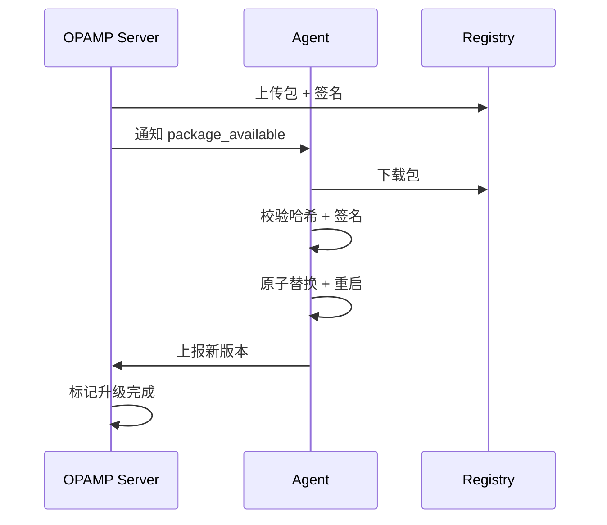
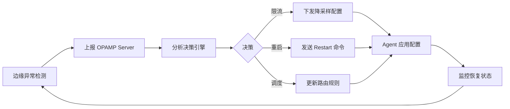

# OPAMP 概览（控制平面）

## 目录

- [OPAMP 概览（控制平面）](#opamp-概览控制平面)
  - [目录](#目录)
  - [1. 什么是 OPAMP](#1-什么是-opamp)
  - [2. 核心能力](#2-核心能力)
    - [2.1 远程配置管理](#21-远程配置管理)
    - [2.2 证书轮转](#22-证书轮转)
    - [2.3 插件与二进制分发](#23-插件与二进制分发)
    - [2.4 健康监控与上报](#24-健康监控与上报)
  - [3. 协议架构](#3-协议架构)
    - [3.1 通信模型](#31-通信模型)
    - [3.2 核心 RPC 接口](#32-核心-rpc-接口)
  - [4. 安全机制](#4-安全机制)
    - [4.1 版本控制](#41-版本控制)
    - [4.2 安全传输](#42-安全传输)
    - [4.3 灰度发布](#43-灰度发布)
  - [5. 与 OTLP 生态协同](#5-与-otlp-生态协同)
    - [5.1 OTTL 规则下发](#51-ottl-规则下发)
    - [5.2 Collector 动态配置](#52-collector-动态配置)
    - [5.3 自愈机制](#53-自愈机制)
  - [6. 实现参考](#6-实现参考)
  - [7. 生产环境部署架构](#7-生产环境部署架构)
    - [7.1 高可用架构](#71-高可用架构)
    - [7.2 Kubernetes 完整部署](#72-kubernetes-完整部署)
    - [7.3 容量规划](#73-容量规划)
  - [8. 故障排查指南](#8-故障排查指南)
    - [8.1 常见问题诊断](#81-常见问题诊断)
    - [8.2 监控指标](#82-监控指标)
    - [8.3 日志分析](#83-日志分析)
  - [9. 安全最佳实践](#9-安全最佳实践)
    - [9.1 认证与授权](#91-认证与授权)
    - [9.2 审计日志](#92-审计日志)
  - [10. 参考资料](#10-参考资料)

## 1. 什么是 OPAMP

**OPAMP**（Open Agent Management Protocol）是 OpenTelemetry 项目推出的**开放代理管理协议**，用于统一管理分布式环境中的遥测数据采集代理（Agent）和 Collector。

核心价值：

- **集中管理**：通过控制平面统一管理数以万计的边缘 Agent
- **动态配置**：无需重启即可热更新配置、规则和插件
- **安全可靠**：内置版本控制、签名验证和灰度发布机制
- **自动化运维**：支持自动证书轮转、健康监控和自愈

## 2. 核心能力

### 2.1 远程配置管理

**功能**：Server 端集中管理并下发配置到所有 Agent

**特性**：

- 配置版本化管理（Git/Database 存储）
- 增量配置更新（仅下发变更部分）
- 配置回滚机制（保留历史版本）
- 配置模板化（支持变量替换和条件渲染）

**应用场景**：

- 动态调整采样率（应对流量突增）
- 修改数据过滤规则（合规要求变更）
- 更新后端导出地址（迁移存储系统）
- 调整资源限制（内存/CPU 配额）

### 2.2 证书轮转

**功能**：自动化 mTLS 证书的生命周期管理

**流程**：

1. Server 检测证书即将过期（提前 7 天）
2. 生成新证书并通过 OPAMP 下发
3. Agent 验证签名后原子替换证书
4. Agent 上报证书更新状态
5. Server 确认后标记旧证书废弃

**安全保障**：

- 证书哈希校验（防篡改）
- 数字签名验证（防伪造）
- 原子替换机制（无中断）
- 回滚能力（失败自动恢复）

### 2.3 插件与二进制分发

**功能**：远程分发 WASM 插件、OTTL 规则和 Agent 二进制

**支持格式**：

- **WASM 插件**：自定义处理器（如特殊协议解析）
- **OTTL 规则**：声明式数据转换脚本
- **Agent 二进制**：完整的 Collector/Agent 升级包

**分发流程**：



### 2.4 健康监控与上报

**Agent 上报内容**：

- 运行状态（running/stopped/error）
- 资源使用（CPU/Memory/Goroutines）
- 处理指标（吞吐量/延迟/错误率）
- 配置版本（当前生效的配置哈希）

**Server 监控能力**：

- 实时健康仪表盘
- 异常自动告警
- 趋势分析与预测
- 自动化响应（触发限流/重启/回滚）

## 3. 协议架构

### 3.1 通信模型

OPAMP 采用 **gRPC 双向流**（Bidirectional Streaming）实现实时通信：

```go
service OpAMPService {
  // Agent 与 Server 建立长连接
  rpc Connect(stream AgentToServer) returns (stream ServerToAgent);
}
```

**优势**：

- 低延迟（毫秒级配置下发）
- 双向通信（Server 可主动推送）
- 连接复用（减少握手开销）
- 自动重连（网络抖动容忍）

### 3.2 核心 RPC 接口

**Agent → Server**：

- `AgentIdentify`：上报身份（ID/版本/能力）
- `Heartbeat`：心跳保活（每 30 秒）
- `StatusReport`：健康状态上报
- `ConfigResult`：配置应用结果反馈

**Server → Agent**：

- `RemoteConfig`：下发配置更新
- `CertificateOffer`：提供新证书
- `PackageAvailable`：通知可用更新包
- `Command`：执行控制命令（重启/日志级别）

## 4. 安全机制

### 4.1 版本控制

每个配置/证书/包都包含：

- **版本号**：语义化版本（如 `v1.2.3`）
- **哈希值**：SHA256 内容摘要
- **签名**：RSA/ECDSA 数字签名
- **时间戳**：生成时间（用于排序）

### 4.2 安全传输

**传输层安全**：

- mTLS 双向认证（Server 和 Agent 互相验证）
- TLS 1.3 协议（最新安全标准）
- 证书固定（Certificate Pinning）

**应用层安全**：

- 签名验证（防止中间人攻击）
- 哈希校验（防止内容篡改）
- 重放保护（时间戳 + Nonce）

### 4.3 灰度发布

**策略**：

- **标签选择**：按 `env=prod`、`region=us-west` 等标签分组
- **灰度权重**：先 5% → 20% → 50% → 100%
- **回滚窗口**：观察 10 分钟，异常自动回滚
- **金丝雀部署**：先在测试集群验证

**示例配置**：

```yaml
rollout:
  strategy: canary
  stages:
    - selector: {env: staging}
      weight: 100%
      duration: 1h
    - selector: {env: prod, region: us-west}
      weight: 10%
      duration: 30m
    - selector: {env: prod}
      weight: 100%
  rollback:
    on_error_rate: 5%
    observation_window: 10m
```

## 5. 与 OTLP 生态协同

### 5.1 OTTL 规则下发

通过 OPAMP 动态下发 OTTL 转换规则：

```yaml
remote_config:
  processors:
    transform:
      traces:
        # 生产环境脱敏
        - set(attributes["user.id"], SHA256(attributes["user.id"])) 
          where resource.attributes["env"] == "prod"
        # 超时标记
        - set(status.message, "timeout") 
          where duration > 3s
```

**实时生效**：无需重启 Collector，10 秒内全集群生效

### 5.2 Collector 动态配置

**边缘 Collector 配置调整**：

```yaml
# Server 下发
exporters:
  otlp/primary:
    endpoint: new-backend.example.com:4317
  otlp/backup:
    endpoint: backup.example.com:4317

service:
  pipelines:
    traces:
      exporters: [otlp/primary, otlp/backup]
```

**DaemonSet Agent 采样率调整**：

```yaml
processors:
  probabilistic_sampler:
    sampling_percentage: 10  # 从 50% 降至 10%
```

### 5.3 自愈机制

**闭环自愈流程**：



**示例场景**：

1. **内存告警**：检测到 Agent 内存 > 80%
2. **自动响应**：下发 `memory_limiter` 配置，限制队列大小
3. **效果验证**：监控内存下降至 60%
4. **记录审计**：日志记录自愈动作和结果

## 6. 实现参考

**官方库**：

- **opamp-go**：Go 语言参考实现（Agent + Server）
  - GitHub: `open-telemetry/opamp-go`
  - 版本：v0.14.0+（2025 年稳定版）

**集成示例**：

```go
import "github.com/open-telemetry/opamp-go/client"

// 创建 OPAMP 客户端
opampClient := client.NewWebSocket(nil)
opampClient.SetAgentDescription(&protobufs.AgentDescription{
    IdentifyingAttributes: []*common.KeyValue{
        {Key: "service.name", Value: &common.AnyValue{Value: &common.AnyValue_StringValue{StringValue: "my-collector"}}},
    },
})

// 连接到 Server
opampClient.Start(context.Background(), client.StartSettings{
    OpAMPServerURL: "wss://opamp.example.com/v1/opamp",
    TLSConfig:      tlsConfig,
    Callbacks: client.CallbacksStruct{
        OnMessageFunc: handleServerMessage,
    },
})
```

**部署架构**：

```yaml
# Kubernetes Deployment
apiVersion: apps/v1
kind: Deployment
metadata:
  name: opamp-server
spec:
  replicas: 3
  template:
    spec:
      containers:
      - name: opamp-server
        image: opamp-server:v1.0.0
        ports:
        - containerPort: 4320  # OPAMP gRPC
        - containerPort: 8080  # 管理 UI
```

## 7. 生产环境部署架构

### 7.1 高可用架构

**三层架构设计**：

```text
┌─────────────────────────────────────────────────────────────┐
│                    Load Balancer (L7)                       │
│                   (AWS ALB / GCP LB)                        │
└────────────────────────┬────────────────────────────────────┘
                         │
         ┌───────────────┼───────────────┐
         │               │               │
         ▼               ▼               ▼
┌─────────────┐  ┌─────────────┐  ┌─────────────┐
│ OPAMP       │  │ OPAMP       │  │ OPAMP       │
│ Server-1    │  │ Server-2    │  │ Server-3    │
│ (AZ-1)      │  │ (AZ-2)      │  │ (AZ-3)      │
└──────┬──────┘  └──────┬──────┘  └──────┬──────┘
       │                │                │
       └────────────────┼────────────────┘
                        │
                        ▼
         ┌──────────────────────────────┐
         │   PostgreSQL (RDS/Cloud SQL) │
         │   - Agent 状态                │
         │   - 配置历史                  │
         │   - 审计日志                  │
         └──────────────────────────────┘
                        │
         ┌──────────────┼──────────────┐
         │              │              │
         ▼              ▼              ▼
┌─────────────┐  ┌─────────────┐  ┌─────────────┐
│   Redis     │  │   S3/GCS    │  │   Git Repo  │
│   (缓存)    │  │  (包存储)   │  │  (配置源)   │
└─────────────┘  └─────────────┘  └─────────────┘
                        │
         ┌──────────────┼──────────────┐
         │              │              │
         ▼              ▼              ▼
┌─────────────┐  ┌─────────────┐  ┌─────────────┐
│  Agent-1    │  │  Agent-2    │  │  Agent-N    │
│  (10k连接)  │  │  (10k连接)  │  │  (10k连接)  │
└─────────────┘  └─────────────┘  └─────────────┘
```

### 7.2 Kubernetes 完整部署

**Server 端部署**：

```yaml
---
# ConfigMap
apiVersion: v1
kind: ConfigMap
metadata:
  name: opamp-server-config
  namespace: observability
data:
  config.yaml: |
    server:
      listen:
        grpc: 0.0.0.0:4320
        http: 0.0.0.0:8080
      tls:
        enabled: true
        cert_file: /etc/certs/tls.crt
        key_file: /etc/certs/tls.key
        client_ca_file: /etc/certs/ca.crt
        client_auth: require_and_verify
    
    database:
      type: postgresql
      dsn: ${DATABASE_URL}
      max_connections: 100
      max_idle_connections: 10
    
    redis:
      addr: redis:6379
      password: ${REDIS_PASSWORD}
      db: 0
    
    storage:
      type: s3
      s3:
        bucket: opamp-packages
        region: us-west-2
        endpoint: ${S3_ENDPOINT}
    
    config_source:
      type: git
      git:
        repository: https://github.com/example/opamp-configs.git
        branch: main
        sync_interval: 1m
        ssh_key_file: /etc/ssh/deploy_key

---
# Deployment
apiVersion: apps/v1
kind: Deployment
metadata:
  name: opamp-server
  namespace: observability
spec:
  replicas: 3
  strategy:
    type: RollingUpdate
    rollingUpdate:
      maxUnavailable: 1
      maxSurge: 1
  selector:
    matchLabels:
      app: opamp-server
  template:
    metadata:
      labels:
        app: opamp-server
      annotations:
        prometheus.io/scrape: "true"
        prometheus.io/port: "8080"
        prometheus.io/path: "/metrics"
    spec:
      affinity:
        podAntiAffinity:
          requiredDuringSchedulingIgnoredDuringExecution:
          - labelSelector:
              matchLabels:
                app: opamp-server
            topologyKey: topology.kubernetes.io/zone
      
      containers:
      - name: opamp-server
        image: opamp-server:v1.0.0
        ports:
        - name: grpc
          containerPort: 4320
        - name: http
          containerPort: 8080
        
        env:
        - name: DATABASE_URL
          valueFrom:
            secretKeyRef:
              name: opamp-secrets
              key: database-url
        - name: REDIS_PASSWORD
          valueFrom:
            secretKeyRef:
              name: opamp-secrets
              key: redis-password
        - name: S3_ENDPOINT
          value: "https://s3.us-west-2.amazonaws.com"
        
        volumeMounts:
        - name: config
          mountPath: /etc/opamp
        - name: certs
          mountPath: /etc/certs
        - name: ssh-key
          mountPath: /etc/ssh
        
        resources:
          requests:
            cpu: 500m
            memory: 512Mi
          limits:
            cpu: 2000m
            memory: 2Gi
        
        livenessProbe:
          httpGet:
            path: /health
            port: 8080
          initialDelaySeconds: 30
          periodSeconds: 10
        
        readinessProbe:
          httpGet:
            path: /ready
            port: 8080
          initialDelaySeconds: 10
          periodSeconds: 5
      
      volumes:
      - name: config
        configMap:
          name: opamp-server-config
      - name: certs
        secret:
          secretName: opamp-tls
      - name: ssh-key
        secret:
          secretName: git-deploy-key

---
# Service
apiVersion: v1
kind: Service
metadata:
  name: opamp-server
  namespace: observability
spec:
  type: LoadBalancer
  selector:
    app: opamp-server
  ports:
  - name: grpc
    port: 4320
    targetPort: 4320
  - name: http
    port: 8080
    targetPort: 8080

---
# HorizontalPodAutoscaler
apiVersion: autoscaling/v2
kind: HorizontalPodAutoscaler
metadata:
  name: opamp-server
  namespace: observability
spec:
  scaleTargetRef:
    apiVersion: apps/v1
    kind: Deployment
    name: opamp-server
  minReplicas: 3
  maxReplicas: 10
  metrics:
  - type: Resource
    resource:
      name: cpu
      target:
        type: Utilization
        averageUtilization: 70
  - type: Resource
    resource:
      name: memory
      target:
        type: Utilization
        averageUtilization: 80
```

**Agent 端部署（DaemonSet）**：

```yaml
---
apiVersion: v1
kind: ConfigMap
metadata:
  name: otel-agent-opamp-config
  namespace: observability
data:
  opamp.yaml: |
    opamp:
      server:
        endpoint: wss://opamp.example.com:4320/v1/opamp
        tls:
          insecure: false
          cert_file: /etc/certs/agent.crt
          key_file: /etc/certs/agent.key
          ca_file: /etc/certs/ca.crt
        headers:
          authorization: "Bearer ${OPAMP_TOKEN}"
      
      agent:
        instance_id: "${HOSTNAME}"
        labels:
          env: "${ENV}"
          region: "${REGION}"
          cluster: "${CLUSTER_NAME}"
      
      capabilities:
        accepts_remote_config: true
        reports_health: true
        accepts_packages: true
        accepts_restart_command: true
      
      health:
        report_interval: 30s

---
apiVersion: apps/v1
kind: DaemonSet
metadata:
  name: otel-agent
  namespace: observability
spec:
  selector:
    matchLabels:
      app: otel-agent
  template:
    metadata:
      labels:
        app: otel-agent
    spec:
      serviceAccountName: otel-agent
      containers:
      - name: otel-agent
        image: otel/opentelemetry-collector-contrib:0.95.0
        env:
        - name: HOSTNAME
          valueFrom:
            fieldRef:
              fieldPath: spec.nodeName
        - name: ENV
          value: "production"
        - name: REGION
          value: "us-west-2"
        - name: CLUSTER_NAME
          value: "prod-cluster-1"
        - name: OPAMP_TOKEN
          valueFrom:
            secretKeyRef:
              name: opamp-agent-token
              key: token
        
        volumeMounts:
        - name: opamp-config
          mountPath: /etc/opamp
        - name: certs
          mountPath: /etc/certs
        - name: local-config
          mountPath: /etc/otelcol
        
        resources:
          requests:
            cpu: 200m
            memory: 256Mi
          limits:
            cpu: 500m
            memory: 512Mi
      
      volumes:
      - name: opamp-config
        configMap:
          name: otel-agent-opamp-config
      - name: certs
        secret:
          secretName: otel-agent-certs
      - name: local-config
        emptyDir: {}
```

### 7.3 容量规划

**Server 端容量**：

| 指标 | 推荐值 | 说明 |
|------|--------|------|
| CPU | 2 核 | 每 10k Agent 连接 |
| 内存 | 2 GB | 每 10k Agent 连接 |
| 网络带宽 | 100 Mbps | 配置下发和心跳 |
| 数据库连接 | 100 | 连接池大小 |
| Redis 内存 | 4 GB | 缓存 Agent 状态 |

**Agent 端容量**：

| 指标 | 推荐值 | 说明 |
|------|--------|------|
| CPU | 200m | DaemonSet per node |
| 内存 | 256 MB | 基础配置 |
| 心跳间隔 | 30s | 平衡实时性和负载 |
| 重连间隔 | 5s → 60s | 指数退避 |

## 8. 故障排查指南

### 8.1 常见问题诊断

**问题 1：Agent 无法连接到 Server**:

**症状**：

```log
ERROR Failed to connect to OPAMP server: connection refused
```

**排查步骤**：

```bash
# 1. 检查网络连通性
curl -v https://opamp.example.com:4320/health

# 2. 检查 DNS 解析
nslookup opamp.example.com

# 3. 检查证书
openssl s_client -connect opamp.example.com:4320 -showcerts

# 4. 检查 Agent 日志
kubectl logs -n observability daemonset/otel-agent --tail=100

# 5. 检查 Server 日志
kubectl logs -n observability deployment/opamp-server --tail=100
```

**解决方案**：

```yaml
# 确保 Service 正确配置
apiVersion: v1
kind: Service
metadata:
  name: opamp-server
spec:
  type: LoadBalancer
  ports:
  - name: grpc
    port: 4320
    targetPort: 4320
    protocol: TCP
```

---

**问题 2：配置未生效**:

**症状**：

```log
INFO Received remote config, hash: abc123
INFO Applied config successfully
# 但 Collector 行为未改变
```

**排查步骤**：

```bash
# 1. 检查配置哈希
kubectl exec -n observability otel-agent-xxx -- \
  cat /etc/otelcol/config.yaml | sha256sum

# 2. 检查配置内容
kubectl exec -n observability otel-agent-xxx -- \
  cat /etc/otelcol/config.yaml

# 3. 验证配置语法
otelcol validate --config=/etc/otelcol/config.yaml

# 4. 检查 Collector 重载
kubectl logs -n observability otel-agent-xxx | grep "reload"
```

**解决方案**：

```go
// 确保配置应用后重载 Collector
func applyConfig(config *Config) error {
    // 1. 写入配置文件
    if err := writeConfigFile(config); err != nil {
        return err
    }
    
    // 2. 验证配置
    if err := validateConfig(config); err != nil {
        return err
    }
    
    // 3. 重载 Collector
    if err := reloadCollector(); err != nil {
        // 回滚配置
        rollbackConfig()
        return err
    }
    
    return nil
}
```

---

**问题 3：Server 性能瓶颈**:

**症状**：

```log
WARN High CPU usage: 95%
WARN Database connection pool exhausted
ERROR Failed to handle agent connection: too many open files
```

**排查步骤**：

```bash
# 1. 检查 Server 指标
curl http://opamp-server:8080/metrics | grep opamp_

# 2. 检查数据库连接
psql -h postgres -U opamp -c "SELECT count(*) FROM pg_stat_activity;"

# 3. 检查文件描述符
kubectl exec -n observability opamp-server-xxx -- \
  cat /proc/1/limits | grep "open files"

# 4. 检查内存使用
kubectl top pod -n observability opamp-server-xxx
```

**解决方案**：

```yaml
# 1. 增加资源限制
resources:
  limits:
    cpu: 4000m
    memory: 4Gi

# 2. 调整数据库连接池
database:
  max_connections: 200
  max_idle_connections: 50

# 3. 增加文件描述符限制
securityContext:
  capabilities:
    add:
    - SYS_RESOURCE
```

### 8.2 监控指标

**关键指标**：

```yaml
# Prometheus 抓取配置
scrape_configs:
  - job_name: 'opamp-server'
    static_configs:
      - targets: ['opamp-server:8080']
    metrics_path: '/metrics'
```

**核心指标**：

```promql
# Agent 连接数
opamp_server_connected_agents

# 配置下发成功率
rate(opamp_server_config_applied_total[5m]) /
rate(opamp_server_config_sent_total[5m])

# 平均响应时间
histogram_quantile(0.95, 
  rate(opamp_server_request_duration_seconds_bucket[5m]))

# 错误率
rate(opamp_server_errors_total[5m])

# 数据库连接池使用率
opamp_server_db_connections_in_use / 
opamp_server_db_connections_max
```

**告警规则**：

```yaml
groups:
  - name: opamp_alerts
    rules:
      - alert: OPAMPServerDown
        expr: up{job="opamp-server"} == 0
        for: 5m
        labels:
          severity: critical
        annotations:
          summary: "OPAMP Server is down"
      
      - alert: HighConfigFailureRate
        expr: |
          rate(opamp_server_config_failed_total[5m]) /
          rate(opamp_server_config_sent_total[5m]) > 0.1
        for: 10m
        labels:
          severity: warning
        annotations:
          summary: "High config failure rate: {{ $value }}"
      
      - alert: AgentConnectionDrop
        expr: |
          rate(opamp_server_agent_disconnected_total[5m]) > 10
        for: 5m
        labels:
          severity: warning
        annotations:
          summary: "High agent disconnection rate"
```

### 8.3 日志分析

**结构化日志示例**：

```json
{
  "timestamp": "2025-10-06T10:30:00Z",
  "level": "INFO",
  "component": "opamp-server",
  "event": "config_applied",
  "agent_id": "agent-001",
  "config_hash": "abc123",
  "duration_ms": 150,
  "success": true
}
```

**日志查询（使用 Loki）**：

```logql
# 查找配置失败
{job="opamp-server"} |= "config_failed"

# 查找特定 Agent 的日志
{job="opamp-server"} | json | agent_id="agent-001"

# 统计错误率
sum(rate({job="opamp-server"} |= "ERROR" [5m]))
```

## 9. 安全最佳实践

### 9.1 认证与授权

**mTLS 配置**：

```yaml
tls:
  enabled: true
  cert_file: /etc/certs/server.crt
  key_file: /etc/certs/server.key
  client_ca_file: /etc/certs/ca.crt
  client_auth: require_and_verify
  min_version: "1.3"
  cipher_suites:
    - TLS_AES_128_GCM_SHA256
    - TLS_AES_256_GCM_SHA384
    - TLS_CHACHA20_POLY1305_SHA256
```

**JWT Token 认证**：

```go
func validateToken(token string) (*AgentClaims, error) {
    parsedToken, err := jwt.ParseWithClaims(token, &AgentClaims{}, func(token *jwt.Token) (interface{}, error) {
        return jwtSigningKey, nil
    })
    
    if err != nil {
        return nil, err
    }
    
    if claims, ok := parsedToken.Claims.(*AgentClaims); ok && parsedToken.Valid {
        return claims, nil
    }
    
    return nil, errors.New("invalid token")
}
```

### 9.2 审计日志

**审计事件记录**：

```go
type AuditLog struct {
    Timestamp   time.Time
    EventType   string  // config_change, agent_connect, etc.
    AgentID     string
    UserID      string
    Action      string
    Resource    string
    OldValue    string
    NewValue    string
    Success     bool
    ErrorMsg    string
}

func logAuditEvent(event *AuditLog) {
    log.WithFields(logrus.Fields{
        "event_type": event.EventType,
        "agent_id":   event.AgentID,
        "user_id":    event.UserID,
        "action":     event.Action,
        "success":    event.Success,
    }).Info("Audit event")
    
    // 写入审计数据库
    db.Create(event)
}
```

## 10. 参考资料

- **官方规范**：[OPAMP Specification](https://github.com/open-telemetry/opamp-spec)
- **实现库**：[opamp-go](https://github.com/open-telemetry/opamp-go)
- **示例配置**：`docs/opamp/sample.md`
- **技术架构**：`docs/design/technical-model.md`
- **分布式模型**：`docs/design/distributed-model.md`
- **OTTL 集成**：`docs/otlp/ottl-examples.md`
