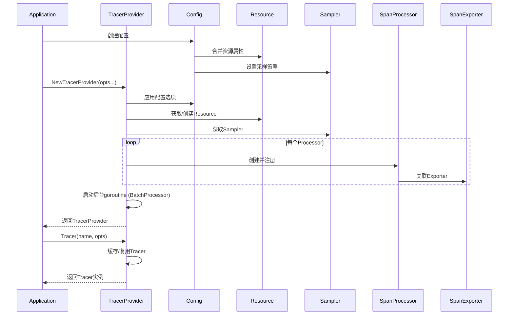

# OpenTelemetry Go SDK: TracerProvider启动流程分析

> **目标**: 深入分析TracerProvider初始化过程  
> **源码版本**: `go.opentelemetry.io/otel/sdk v1.42.0`  
> **分析日期**: 2026-04-06

---

## 1. 整体架构概览

### 1.1 TracerProvider核心组件

```
TracerProvider (sdk/trace/tracer_provider.go)
├── Config (配置)
│   ├── IDGenerator           // Span/Trace ID生成器
│   ├── SpanProcessors        // Span处理器链
│   ├── Resource              // 资源属性
│   ├── Sampler               // 采样器
│   └── AttributeLimits       // 属性限制
├── Processors ([]SpanProcessor)
│   ├── SimpleSpanProcessor   // 同步处理
│   └── BatchSpanProcessor    // 批量处理 (默认)
├── Exporters ([]SpanExporter)
│   ├── OTLP/gRPC
│   ├── OTLP/HTTP
│   └── Console (调试)
└── Tracers (map[instrumentation]*tracer)
```

### 1.2 启动流程时序图



---

## 2. 核心源码分析

### 2.1 TracerProvider结构体

```go
// sdk/trace/tracer_provider.go

type TracerProvider struct {
    // 配置信息
    cfg Config
    
    // Span处理器列表
    spanProcessors []SpanProcessor
    
    // 已创建的tracer缓存 (instrumentation -> *tracer)
    tracers sync.Map
    
    // 确保Shutdown只执行一次
    shutdownOnce sync.Once
    
    // 是否已关闭
    isShutdown atomic.Bool
}

// Config 配置结构体
type Config struct {
    // ID生成器 (默认RandomIDGenerator)
    idGenerator IDGenerator
    
    // Span处理器列表
    spanProcessors []SpanProcessor
    
    // 资源属性
    resource *resource.Resource
    
    // 采样器 (默认AlwaysSample)
    sampler Sampler
    
    // Span属性限制
    spanLimits SpanLimits
}
```

### 2.2 NewTracerProvider 创建流程

```go
// sdk/trace/tracer_provider.go

func NewTracerProvider(opts ...TracerProviderOption) *TracerProvider {
    // 1. 创建默认配置
    cfg := Config{
        idGenerator:    &randomIDGenerator{},
        resource:       resource.Default(),
        sampler:        AlwaysSample(),
        spanLimits:     makeSpanLimits(),
        spanProcessors: []SpanProcessor{},
    }
    
    // 2. 应用配置选项
    for _, opt := range opts {
        opt.apply(&cfg)
    }
    
    // 3. 验证配置
    cfg = cfg.Validate()
    
    // 4. 创建TracerProvider
    tp := &TracerProvider{
        cfg:            cfg,
        spanProcessors: cfg.spanProcessors,
    }
    
    // 5. 启动所有processor的后台任务
    for _, sp := range tp.spanProcessors {
        sp.OnStart(tp)
    }
    
    // 6. 注册到全局 (如果配置了)
    if cfg.autoSDKConfig {
        global.SetTracerProvider(tp)
    }
    
    return tp
}
```

### 2.3 关键配置选项分析

#### WithSpanProcessor

```go
// 添加SpanProcessor
func WithSpanProcessor(sp SpanProcessor) TracerProviderOption {
    return tracerProviderOptionFunc(func(cfg *Config) {
        cfg.spanProcessors = append(cfg.spanProcessors, sp)
    })
}

// 使用示例
tp := trace.NewTracerProvider(
    trace.WithSpanProcessor(
        trace.NewBatchSpanProcessor(exporter),
    ),
)
```

#### WithResource

```go
// 设置资源属性
func WithResource(r *resource.Resource) TracerProviderOption {
    return tracerProviderOptionFunc(func(cfg *Config) {
        // 合并资源属性 (新值覆盖旧值)
        cfg.resource = resource.Merge(cfg.resource, r)
    })
}
```

#### WithSampler

```go
// 设置采样器
func WithSampler(s Sampler) TracerProviderOption {
    return tracerProviderOptionFunc(func(cfg *Config) {
        cfg.sampler = s
    })
}
```

### 2.4 Tracer创建流程

```go
// sdk/trace/tracer_provider.go

func (tp *TracerProvider) Tracer(
    name string,
    opts ...TracerOption,
) trace.Tracer {
    // 1. 参数校验
    if name == "" {
        name = defaultTracerName
    }
    
    // 2. 创建instrumentation scope
    c := tracerConfig{}
    for _, opt := range opts {
        opt.apply(&c)
    }
    
    // 3. 构建缓存key
    is := instrumentation.Scope{
        Name:    name,
        Version: c.instrumentationVersion,
    }
    
    // 4. 检查缓存
    if val, ok := tp.tracers.Load(is); ok {
        return val.(trace.Tracer)
    }
    
    // 5. 创建新的tracer
    t := &tracer{
        provider:          tp,
        instrumentation:   is,
        spanLimits:        tp.cfg.spanLimits,
        resource:          tp.cfg.resource,
        idGenerator:       tp.cfg.idGenerator,
        sampler:           tp.cfg.sampler,
        spanStartOptions:  c.defaultSpanStartOptions,
    }
    
    // 6. 缓存并返回 (使用LoadOrStore保证并发安全)
    val, _ := tp.tracers.LoadOrStore(is, t)
    return val.(trace.Tracer)
}
```

---

## 3. SpanProcessor启动机制

### 3.1 BatchSpanProcessor启动

```go
// sdk/trace/batch_span_processor.go

type BatchSpanProcessor struct {
    // 导出器
    e SpanExporter
    
    // 队列
    queue chan ReadOnlySpan
    
    // 批量大小
    batchSize int
    
    // 导出间隔
    exportTimeout time.Duration
    batchTimeout  time.Duration
    
    // 停止信号
    stopCh chan struct{}
    stopOnce sync.Once
    
    // 后台goroutine等待
    wg sync.WaitGroup
}

func NewBatchSpanProcessor(
    exporter SpanExporter,
    opts ...BatchSpanProcessorOption,
) *BatchSpanProcessor {
    // 1. 创建processor
    bsp := &BatchSpanProcessor{
        e:             exporter,
        queue:         make(chan ReadOnlySpan, defaultMaxQueueSize),
        batchSize:     defaultMaxExportBatchSize,
        exportTimeout: defaultExportTimeout,
        batchTimeout:  defaultScheduleDelay,
        stopCh:        make(chan struct{}),
    }
    
    // 2. 应用选项
    for _, opt := range opts {
        opt.apply(bsp)
    }
    
    return bsp
}

// OnStart 由TracerProvider调用，启动后台goroutine
func (bsp *BatchSpanProcessor) OnStart(parent TracerProvider) {
    // 启动两个后台goroutine:
    // 1. 批量导出循环
    bsp.wg.Add(1)
    go bsp.batchExportLoop()
    
    // 2. 强制导出定时器
    bsp.wg.Add(1)
    go bsp.exportTimer()
}

// batchExportLoop 批量导出循环
func (bsp *BatchSpanProcessor) batchExportLoop() {
    defer bsp.wg.Done()
    
    var batch []ReadOnlySpan
    
    for {
        select {
        case <-bsp.stopCh:
            // 关闭时导出剩余span
            if len(batch) > 0 {
                bsp.export(context.Background(), batch)
            }
            return
            
        case span := <-bsp.queue:
            batch = append(batch, span)
            
            // 达到批量大小时导出
            if len(batch) >= bsp.batchSize {
                bsp.export(context.Background(), batch)
                batch = batch[:0] // 清空batch
            }
        }
    }
}

// exportTimer 定时强制导出
func (bsp *BatchSpanProcessor) exportTimer() {
    defer bsp.wg.Done()
    
    ticker := time.NewTicker(bsp.batchTimeout)
    defer ticker.Stop()
    
    for {
        select {
        case <-bsp.stopCh:
            return
        case <-ticker.C:
            // 触发强制导出 (通过channel通知batchExportLoop)
        }
    }
}
```

---

## 4. 资源(Resource)初始化

### 4.1 资源检测流程

```go
// sdk/resource/resource.go

func New(
    ctx context.Context,
    opts ...Option,
) (*Resource, error) {
    // 1. 创建空资源
    r := &Resource{}
    
    // 2. 应用默认检测器
    cfg := config{}
    for _, opt := range opts {
        opt.apply(&cfg)
    }
    
    // 3. 执行资源检测
    var attrs []attribute.KeyValue
    for _, detector := range cfg.detectors {
        res, err := detector.Detect(ctx)
        if err != nil {
            // 部分失败时继续
            continue
        }
        attrs = append(attrs, res.Attributes()...)
    }
    
    // 4. 去重并排序
    r.attrs = distinct(attrs)
    
    return r, nil
}

// 内置检测器
var DefaultDetectors = []Detector{
    // 从环境变量检测
    fromEnvDetector{},
    // 进程信息
    processDetector{},
    // 操作系统信息
    osDetector{},
    // 容器信息
    containerDetector{},
    // 主机信息
    hostDetector{},
}
```

### 4.2 环境变量检测

```go
// sdk/resource/env.go

const (
    // OTEL_RESOURCE_ATTRIBUTES=key1=value1,key2=value2
    envResourceAttributes = "OTEL_RESOURCE_ATTRIBUTES"
    
    // OTEL_SERVICE_NAME=my-service
    envServiceName = "OTEL_SERVICE_NAME"
)

type fromEnvDetector struct{}

func (fromEnvDetector) Detect(ctx context.Context) (*Resource, error) {
    attrs := []attribute.KeyValue{}
    
    // 解析OTEL_RESOURCE_ATTRIBUTES
    if v := os.Getenv(envResourceAttributes); v != "" {
        pairs := strings.Split(v, ",")
        for _, pair := range pairs {
            kv := strings.SplitN(pair, "=", 2)
            if len(kv) == 2 {
                attrs = append(attrs, attribute.String(kv[0], kv[1]))
            }
        }
    }
    
    // OTEL_SERVICE_NAME特殊处理
    if v := os.Getenv(envServiceName); v != "" {
        attrs = append(attrs, semconv.ServiceNameKey.String(v))
    }
    
    return NewWithAttributes(attrs...), nil
}
```

---

## 5. 采样器(Sampler)配置

### 5.1 采样决策流程

```go
// sdk/trace/sampling.go

type SamplingResult struct {
    Decision   SamplingDecision
    Attributes []attribute.KeyValue
    Tracestate trace.Tracestate
}

type SamplingDecision int

const (
    Drop SamplingDecision = iota    // 不采样
    RecordOnly                      // 记录但不导出
    RecordAndSample                 // 记录并导出
)

// ParentBased采样器 (默认)
func ParentBased(
    root Sampler,                    // root span采样器
    samplers ...ParentBasedSampler,  // 其他情况
) Sampler {
    return &parentBasedSampler{
        root:   root,
        remoteParentSampled:     TraceIDRatioBased(1.0),
        remoteParentNotSampled:  TraceIDRatioBased(0.0),
        localParentSampled:      TraceIDRatioBased(1.0),
        localParentNotSampled:   TraceIDRatioBased(0.0),
    }
}

// 采样决策逻辑
func (pb *parentBasedSampler) ShouldSample(
    p SamplingParameters,
) SamplingResult {
    // 1. 检查parent span
    parent := p.ParentContext
    if parent.IsValid() {
        // 根据parent是否采样决定
        if parent.IsRemote() {
            if parent.IsSampled() {
                return pb.remoteParentSampled.ShouldSample(p)
            }
            return pb.remoteParentNotSampled.ShouldSample(p)
        }
        // local parent...
    }
    
    // 2. root span使用root采样器
    return pb.root.ShouldSample(p)
}
```

### 5.2 TraceIDRatioBased采样器

```go
// sdk/trace/sampling.go

type traceIDRatioBased struct {
    fraction float64  // 采样率 0.0 ~ 1.0
    // 预计算的阈值
    upperBound uint64
}

func TraceIDRatioBased(fraction float64) Sampler {
    if fraction >= 1.0 {
        return AlwaysSample()
    }
    if fraction <= 0.0 {
        return NeverSample()
    }
    
    return &traceIDRatioBased{
        fraction:   fraction,
        upperBound: uint64(fraction * math.MaxUint64),
    }
}

func (t *traceIDRatioBased) ShouldSample(
    p SamplingParameters,
) SamplingResult {
    // 使用TraceID的最后8字节作为随机数
    // 如果小于upperBound则采样
    x := binary.BigEndian.Uint64(
        p.TraceID[8:16],
    )
    
    if x < t.upperBound {
        return SamplingResult{
            Decision: RecordAndSample,
        }
    }
    return SamplingResult{
        Decision: Drop,
    }
}
```

---

## 6. 关键设计决策分析

### 6.1 为什么使用sync.Map缓存Tracer?

```go
// 问题: 可能创建大量tracer (每个instrumentation一个)
// 解决: sync.Map提供高并发读性能

tracers sync.Map  // key: instrumentation.Scope, value: *tracer

// 优势:
// 1. 无锁读取 (当key存在时)
// 2. 适合读多写少场景 (tracer创建后不变)
// 3. 避免手动锁管理
```

### 6.2 BatchSpanProcessor的队列设计

```go
queue chan ReadOnlySpan  // 有界队列

// 设计考虑:
// 1. 有界队列防止内存无限增长
// 2. channel天然线程安全
// 3. 阻塞vs丢弃策略可配置
```

### 6.3 资源合并策略

```go
// 合并两个Resource时，新值覆盖旧值
func Merge(r1, r2 *Resource) *Resource {
    // 实现使用attribute.Deduplicate
    // 相同key时保留r2的值
}
```

---

## 7. 性能优化点

### 7.1 已实现的优化

| 优化点 | 实现方式 | 效果 |
|--------|----------|------|
| Tracer缓存 | sync.Map | 避免重复创建 |
| Batch导出 | 后台goroutine | 减少延迟 |
| ID生成 | 随机数池 | 减少锁竞争 |
| 资源检测 | 并行执行 | 加速启动 |

### 7.2 可改进点

1. **SpanProcessor链**: 当前顺序执行，可考虑并行
2. **队列满策略**: 当前丢弃，可考虑背压
3. **资源检测**: 可添加超时控制

---

## 8. 总结

### 8.1 启动流程关键步骤

1. **配置组装**: 应用所有选项，合并资源
2. **组件初始化**: 创建ID生成器、采样器
3. **Processor启动**: 每个processor启动后台任务
4. **全局注册**: 可选设置为全局provider
5. **Tracer创建**: 按需创建并缓存

### 8.2 核心数据流

```
Application
    ↓ (调用Tracer())
TracerProvider (缓存Tracer)
    ↓ (返回tracer)
tracer (包含provider引用)
    ↓ (调用Start())
Span + SpanContext
    ↓ (End())
SpanProcessor队列
    ↓ (批量)
SpanExporter
    ↓ (OTLP)
Collector
```

### 8.3 相关文档

- [Span生命周期分析](./otel-sdk-span-lifecycle.md)
- [Metrics SDK分析](./otel-sdk-metrics-deep-dive.md)
- [传播机制分析](./otel-sdk-propagation-mechanism.md)

---

**文档状态**: ✅ Phase 1.3 完成  
**分析深度**: 源码级  
**更新日期**: 2026-04-06
