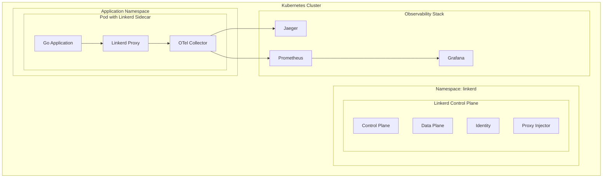

# Linkerd 与 OTLP 完整集成指南 2025版

## 概述

Linkerd 是一个轻量级、高性能的服务网格，专注于简单性和性能。本指南详细介绍如何在 Go 1.25.1 应用中集成 Linkerd 与 OpenTelemetry Protocol (OTLP)，实现自动化的分布式追踪、指标收集和可观测性。

## 目录

- [架构概述](#架构概述)
- [快速开始](#快速开始)
- [Linkerd 自动追踪注入](#linkerd-自动追踪注入)
- [Go 应用 OTLP 集成](#go-应用-otlp-集成)
- [分布式追踪配置](#分布式追踪配置)
- [服务网格可观测性](#服务网格可观测性)
- [性能优化](#性能优化)
- [生产部署](#生产部署)
- [最佳实践](#最佳实践)

## 架构概述

### Linkerd 架构组件



### 核心特性

- **自动代理注入**: 通过 MutatingAdmissionWebhook 自动注入 Linkerd proxy
- **零配置追踪**: 自动生成分布式追踪数据
- **mTLS 加密**: 服务间通信自动加密
- **负载均衡**: 智能负载均衡和故障转移
- **指标收集**: 自动收集延迟、吞吐量等指标

## 快速开始

### 1. 安装 Linkerd

```bash
# 安装 Linkerd CLI
curl --proto '=https' --tlsv1.2 -sSfL https://run.linkerd.io/install | sh

# 验证安装
linkerd version

# 安装 Linkerd 到集群
linkerd install --crds | kubectl apply -f -
linkerd install | kubectl apply -f -

# 验证安装
linkerd check
```

### 2. 部署 OTel Collector

```yaml
# otel-collector.yaml
apiVersion: v1
kind: ConfigMap
metadata:
  name: otel-collector-config
  namespace: linkerd
data:
  otel-collector.yaml: |
    receivers:
      otlp:
        protocols:
          grpc:
            endpoint: 0.0.0.0:4317
          http:
            endpoint: 0.0.0.0:4318
      jaeger:
        protocols:
          grpc:
            endpoint: 0.0.0.0:14250
          thrift_http:
            endpoint: 0.0.0.0:14268
          thrift_compact:
            endpoint: 0.0.0.0:6831
          thrift_binary:
            endpoint: 0.0.0.0:6832

    processors:
      batch:
        timeout: 1s
        send_batch_size: 1024
      memory_limiter:
        limit_mib: 512
      resource:
        attributes:
          - key: service.name
            value: "linkerd-mesh"
            action: upsert

    exporters:
      jaeger:
        endpoint: jaeger-collector:14250
        tls:
          insecure: true
      prometheus:
        endpoint: "0.0.0.0:8889"
        namespace: "linkerd_otel"
        const_labels:
          mesh: "linkerd"

    service:
      pipelines:
        traces:
          receivers: [otlp, jaeger]
          processors: [memory_limiter, resource, batch]
          exporters: [jaeger]
        metrics:
          receivers: [otlp]
          processors: [memory_limiter, resource, batch]
          exporters: [prometheus]
---
apiVersion: apps/v1
kind: Deployment
metadata:
  name: otel-collector
  namespace: linkerd
spec:
  replicas: 1
  selector:
    matchLabels:
      app: otel-collector
  template:
    metadata:
      labels:
        app: otel-collector
    spec:
      containers:
      - name: otel-collector
        image: otel/opentelemetry-collector-contrib:0.95.0
        args:
          - --config=/etc/otel-collector.yaml
        ports:
        - containerPort: 4317
        - containerPort: 4318
        - containerPort: 14250
        - containerPort: 14268
        - containerPort: 6831
        - containerPort: 6832
        - containerPort: 8889
        volumeMounts:
        - name: config
          mountPath: /etc/otel-collector.yaml
          subPath: otel-collector.yaml
        resources:
          requests:
            memory: "256Mi"
            cpu: "100m"
          limits:
            memory: "512Mi"
            cpu: "500m"
      volumes:
      - name: config
        configMap:
          name: otel-collector-config
---
apiVersion: v1
kind: Service
metadata:
  name: otel-collector
  namespace: linkerd
spec:
  selector:
    app: otel-collector
  ports:
  - name: otlp-grpc
    port: 4317
    targetPort: 4317
  - name: otlp-http
    port: 4318
    targetPort: 4318
  - name: jaeger-grpc
    port: 14250
    targetPort: 14250
  - name: jaeger-http
    port: 14268
    targetPort: 14268
  - name: prometheus
    port: 8889
    targetPort: 8889
```

### 3. 启用 Linkerd 追踪

```bash
# 启用追踪
linkerd install --set proxy.traceCollectorSvcAddr=otel-collector.linkerd.svc.cluster.local:4317 | kubectl apply -f -

# 重启控制平面
kubectl rollout restart deployment -n linkerd
```

## Linkerd 自动追踪注入

### 1. 自动代理注入配置

```yaml
# linkerd-proxy-injector-config.yaml
apiVersion: v1
kind: ConfigMap
metadata:
  name: linkerd-proxy-injector-config
  namespace: linkerd
data:
  config.yaml: |
    proxy:
      image:
        name: gcr.io/linkerd-io/proxy
        tag: stable-2.15.0
      logLevel: info
      logFormat: plain
      traceCollectorSvcAddr: otel-collector.linkerd.svc.cluster.local:4317
      traceCollectorSvcAccount: otel-collector
      traceSamplingRatio: 0.1
      traceSamplingPolicy: probabilistic
      opaquePorts: "25,587,3306,4444,5432,6379,9300,11211"
      inboundPort: 4143
      outboundPort: 4140
      adminPort: 4191
      controlPort: 4190
      ignoreInboundPorts: ""
      ignoreOutboundPorts: ""
      inboundConnectTimeout: 100ms
      outboundConnectTimeout: 1000ms
      inboundKeepAlive: 10s
      outboundKeepAlive: 10s
      cpuRequest: 100m
      memoryRequest: 20Mi
      cpuLimit: ""
      memoryLimit: ""
      uid: 2102
      gid: 2102
      waitBeforeExitSeconds: 0
      enableExternalProfiles: false
      requireIdentityOnInboundPorts: ""
      proxyVersion: stable-2.15.0
      debugImage:
        name: gcr.io/linkerd-io/debug
        tag: stable-2.15.0
      debugImageVersion: stable-2.15.0
      resources:
        requests:
          cpu: 100m
          memory: 20Mi
        limits:
          cpu: ""
          memory: ""
    proxyInit:
      image:
        name: gcr.io/linkerd-io/proxy-init
        tag: stable-2.15.0
      resources:
        requests:
          cpu: 100m
          memory: 20Mi
        limits:
          cpu: ""
          memory: ""
```

### 2. 命名空间注解配置

```yaml
# namespace-annotation.yaml
apiVersion: v1
kind: Namespace
metadata:
  name: go-apps
  annotations:
    linkerd.io/inject: enabled
    config.linkerd.io/trace-collector: otel-collector.linkerd.svc.cluster.local:4317
    config.linkerd.io/trace-collector-svc-account: otel-collector
    config.linkerd.io/skip-outbound-ports: "443"
    config.linkerd.io/skip-inbound-ports: "4190,4191"
```

## Go 应用 OTLP 集成

### 1. 基础 Go 应用示例

```go
// main.go
package main

import (
    "context"
    "fmt"
    "log"
    "net/http"
    "time"

    "go.opentelemetry.io/otel"
    "go.opentelemetry.io/otel/attribute"
    "go.opentelemetry.io/otel/exporters/otlp/otlptrace/otlptracegrpc"
    "go.opentelemetry.io/otel/propagation"
    "go.opentelemetry.io/otel/sdk/resource"
    sdktrace "go.opentelemetry.io/otel/sdk/trace"
    "go.opentelemetry.io/otel/trace"
    semconv "go.opentelemetry.io/otel/semconv/v1.24.0"
)

func main() {
    // 初始化 OpenTelemetry
    ctx := context.Background()
    tp, err := initTracer(ctx)
    if err != nil {
        log.Fatal(err)
    }
    defer tp.Shutdown(ctx)

    // 设置 HTTP 路由
    http.HandleFunc("/", homeHandler)
    http.HandleFunc("/api/users", usersHandler)
    http.HandleFunc("/api/orders", ordersHandler)

    log.Println("Server starting on :8080")
    log.Fatal(http.ListenAndServe(":8080", nil))
}

func initTracer(ctx context.Context) (*sdktrace.TracerProvider, error) {
    // 创建资源
    res, err := resource.New(ctx,
        resource.WithAttributes(
            semconv.ServiceName("go-linkerd-app"),
            semconv.ServiceVersion("1.0.0"),
            semconv.DeploymentEnvironment("production"),
            attribute.String("mesh", "linkerd"),
        ),
    )
    if err != nil {
        return nil, err
    }

    // 创建 OTLP 导出器
    exporter, err := otlptracegrpc.New(ctx,
        otlptracegrpc.WithEndpoint("otel-collector.linkerd.svc.cluster.local:4317"),
        otlptracegrpc.WithInsecure(),
    )
    if err != nil {
        return nil, err
    }

    // 创建 TracerProvider
    tp := sdktrace.NewTracerProvider(
        sdktrace.WithBatcher(exporter),
        sdktrace.WithResource(res),
        sdktrace.WithSampler(sdktrace.TraceIDRatioBased(0.1)),
    )

    // 设置全局 TracerProvider
    otel.SetTracerProvider(tp)
    otel.SetTextMapPropagator(propagation.NewCompositeTextMapPropagator(
        propagation.TraceContext{},
        propagation.Baggage{},
    ))

    return tp, nil
}

func homeHandler(w http.ResponseWriter, r *http.Request) {
    ctx := r.Context()
    tracer := otel.Tracer("go-linkerd-app")
    
    ctx, span := tracer.Start(ctx, "home-handler")
    defer span.End()

    span.SetAttributes(
        attribute.String("http.method", r.Method),
        attribute.String("http.url", r.URL.String()),
        attribute.String("http.user_agent", r.UserAgent()),
    )

    // 模拟业务逻辑
    time.Sleep(10 * time.Millisecond)
    
    w.WriteHeader(http.StatusOK)
    fmt.Fprintf(w, "Hello from Go app with Linkerd!")
}

func usersHandler(w http.ResponseWriter, r *http.Request) {
    ctx := r.Context()
    tracer := otel.Tracer("go-linkerd-app")
    
    ctx, span := tracer.Start(ctx, "users-handler")
    defer span.End()

    span.SetAttributes(
        attribute.String("http.method", r.Method),
        attribute.String("http.url", r.URL.String()),
    )

    // 调用其他服务
    if err := callUserService(ctx); err != nil {
        span.RecordError(err)
        http.Error(w, "Internal Server Error", http.StatusInternalServerError)
        return
    }

    w.WriteHeader(http.StatusOK)
    fmt.Fprintf(w, `{"users": [{"id": 1, "name": "Alice"}, {"id": 2, "name": "Bob"}]}`)
}

func ordersHandler(w http.ResponseWriter, r *http.Request) {
    ctx := r.Context()
    tracer := otel.Tracer("go-linkerd-app")
    
    ctx, span := tracer.Start(ctx, "orders-handler")
    defer span.End()

    span.SetAttributes(
        attribute.String("http.method", r.Method),
        attribute.String("http.url", r.URL.String()),
    )

    // 调用订单服务
    if err := callOrderService(ctx); err != nil {
        span.RecordError(err)
        http.Error(w, "Internal Server Error", http.StatusInternalServerError)
        return
    }

    w.WriteHeader(http.StatusOK)
    fmt.Fprintf(w, `{"orders": [{"id": 1, "amount": 100.0}, {"id": 2, "amount": 200.0}]}`)
}

func callUserService(ctx context.Context) error {
    tracer := otel.Tracer("go-linkerd-app")
    ctx, span := tracer.Start(ctx, "call-user-service")
    defer span.End()

    span.SetAttributes(
        attribute.String("service.name", "user-service"),
        attribute.String("service.version", "1.0.0"),
    )

    // 模拟 HTTP 调用
    client := &http.Client{
        Timeout: 5 * time.Second,
    }

    req, err := http.NewRequestWithContext(ctx, "GET", "http://user-service:8080/api/users", nil)
    if err != nil {
        return err
    }

    resp, err := client.Do(req)
    if err != nil {
        return err
    }
    defer resp.Body.Close()

    span.SetAttributes(
        attribute.Int("http.status_code", resp.StatusCode),
    )

    return nil
}

func callOrderService(ctx context.Context) error {
    tracer := otel.Tracer("go-linkerd-app")
    ctx, span := tracer.Start(ctx, "call-order-service")
    defer span.End()

    span.SetAttributes(
        attribute.String("service.name", "order-service"),
        attribute.String("service.version", "1.0.0"),
    )

    // 模拟 HTTP 调用
    client := &http.Client{
        Timeout: 5 * time.Second,
    }

    req, err := http.NewRequestWithContext(ctx, "GET", "http://order-service:8080/api/orders", nil)
    if err != nil {
        return err
    }

    resp, err := client.Do(req)
    if err != nil {
        return err
    }
    defer resp.Body.Close()

    span.SetAttributes(
        attribute.Int("http.status_code", resp.StatusCode),
    )

    return nil
}
```

### 2. 高级中间件集成

```go
// middleware.go
package main

import (
    "context"
    "net/http"
    "strconv"
    "time"

    "go.opentelemetry.io/otel"
    "go.opentelemetry.io/otel/attribute"
    "go.opentelemetry.io/otel/metric"
    "go.opentelemetry.io/otel/trace"
    semconv "go.opentelemetry.io/otel/semconv/v1.24.0"
)

type TracingMiddleware struct {
    tracer   trace.Tracer
    meter    metric.Meter
    requests metric.Int64Counter
    duration metric.Float64Histogram
}

func NewTracingMiddleware() *TracingMiddleware {
    tracer := otel.Tracer("go-linkerd-app")
    meter := otel.Meter("go-linkerd-app")

    requests, _ := meter.Int64Counter(
        "http_requests_total",
        metric.WithDescription("Total number of HTTP requests"),
    )

    duration, _ := meter.Float64Histogram(
        "http_request_duration_seconds",
        metric.WithDescription("HTTP request duration in seconds"),
    )

    return &TracingMiddleware{
        tracer:   tracer,
        meter:    meter,
        requests: requests,
        duration: duration,
    }
}

func (tm *TracingMiddleware) Handler(next http.Handler) http.Handler {
    return http.HandlerFunc(func(w http.ResponseWriter, r *http.Request) {
        start := time.Now()
        ctx := r.Context()

        // 创建 span
        ctx, span := tm.tracer.Start(ctx, "http-request",
            trace.WithAttributes(
                semconv.HTTPMethod(r.Method),
                semconv.HTTPURL(r.URL.String()),
                semconv.HTTPUserAgent(r.UserAgent()),
                semconv.HTTPRequestContentLength(r.ContentLength),
            ),
        )
        defer span.End()

        // 包装 ResponseWriter 以捕获状态码
        ww := &responseWriter{ResponseWriter: w, statusCode: http.StatusOK}

        // 调用下一个处理器
        next.ServeHTTP(ww, r.WithContext(ctx))

        // 记录指标
        duration := time.Since(start).Seconds()
        statusCode := ww.statusCode

        tm.requests.Add(ctx, 1,
            metric.WithAttributes(
                attribute.String("method", r.Method),
                attribute.String("path", r.URL.Path),
                attribute.Int("status_code", statusCode),
            ),
        )

        tm.duration.Record(ctx, duration,
            metric.WithAttributes(
                attribute.String("method", r.Method),
                attribute.String("path", r.URL.Path),
                attribute.Int("status_code", statusCode),
            ),
        )

        // 更新 span 属性
        span.SetAttributes(
            semconv.HTTPStatusCode(statusCode),
            semconv.HTTPResponseContentLength(ww.contentLength),
            attribute.Float64("http.request.duration", duration),
        )

        // 记录错误
        if statusCode >= 400 {
            span.RecordError(fmt.Errorf("HTTP %d", statusCode))
        }
    })
}

type responseWriter struct {
    http.ResponseWriter
    statusCode    int
    contentLength int64
}

func (rw *responseWriter) WriteHeader(code int) {
    rw.statusCode = code
    rw.ResponseWriter.WriteHeader(code)
}

func (rw *responseWriter) Write(b []byte) (int, error) {
    n, err := rw.ResponseWriter.Write(b)
    rw.contentLength += int64(n)
    return n, err
}
```

### 3. gRPC 服务集成

```go
// grpc_server.go
package main

import (
    "context"
    "log"
    "net"

    "go.opentelemetry.io/otel"
    "go.opentelemetry.io/otel/attribute"
    "go.opentelemetry.io/otel/codes"
    "go.opentelemetry.io/otel/trace"
    "google.golang.org/grpc"
    "google.golang.org/grpc/codes"
    "google.golang.org/grpc/status"
)

type UserService struct {
    UnimplementedUserServiceServer
    tracer trace.Tracer
}

func NewUserService() *UserService {
    return &UserService{
        tracer: otel.Tracer("user-service"),
    }
}

func (s *UserService) GetUser(ctx context.Context, req *GetUserRequest) (*GetUserResponse, error) {
    ctx, span := s.tracer.Start(ctx, "GetUser")
    defer span.End()

    span.SetAttributes(
        attribute.String("user.id", req.Id),
        attribute.String("service.name", "user-service"),
    )

    // 模拟数据库查询
    user, err := s.findUser(ctx, req.Id)
    if err != nil {
        span.RecordError(err)
        span.SetStatus(codes.Error, err.Error())
        return nil, status.Errorf(codes.NotFound, "User not found: %v", err)
    }

    span.SetAttributes(
        attribute.String("user.name", user.Name),
        attribute.String("user.email", user.Email),
    )

    return &GetUserResponse{
        Id:    user.Id,
        Name:  user.Name,
        Email: user.Email,
    }, nil
}

func (s *UserService) findUser(ctx context.Context, id string) (*User, error) {
    ctx, span := s.tracer.Start(ctx, "findUser")
    defer span.End()

    span.SetAttributes(
        attribute.String("db.operation", "select"),
        attribute.String("db.table", "users"),
    )

    // 模拟数据库查询
    time.Sleep(10 * time.Millisecond)

    return &User{
        Id:    id,
        Name:  "Alice",
        Email: "alice@example.com",
    }, nil
}

func main() {
    lis, err := net.Listen("tcp", ":9090")
    if err != nil {
        log.Fatalf("Failed to listen: %v", err)
    }

    s := grpc.NewServer()
    RegisterUserServiceServer(s, NewUserService())

    log.Println("gRPC server starting on :9090")
    if err := s.Serve(lis); err != nil {
        log.Fatalf("Failed to serve: %v", err)
    }
}
```

## 分布式追踪配置

### 1. Linkerd 追踪配置

```yaml
# linkerd-config.yaml
apiVersion: v1
kind: ConfigMap
metadata:
  name: linkerd-config
  namespace: linkerd
data:
  config.yaml: |
    global:
      proxy:
        image:
          name: gcr.io/linkerd-io/proxy
          tag: stable-2.15.0
        logLevel: info
        logFormat: plain
        traceCollectorSvcAddr: otel-collector.linkerd.svc.cluster.local:4317
        traceCollectorSvcAccount: otel-collector
        traceSamplingRatio: 0.1
        traceSamplingPolicy: probabilistic
        opaquePorts: "25,587,3306,4444,5432,6379,9300,11211"
        inboundPort: 4143
        outboundPort: 4140
        adminPort: 4191
        controlPort: 4190
        ignoreInboundPorts: ""
        ignoreOutboundPorts: ""
        inboundConnectTimeout: 100ms
        outboundConnectTimeout: 1000ms
        inboundKeepAlive: 10s
        outboundKeepAlive: 10s
        cpuRequest: 100m
        memoryRequest: 20Mi
        cpuLimit: ""
        memoryLimit: ""
        uid: 2102
        gid: 2102
        waitBeforeExitSeconds: 0
        enableExternalProfiles: false
        requireIdentityOnInboundPorts: ""
        proxyVersion: stable-2.15.0
        debugImage:
          name: gcr.io/linkerd-io/debug
          tag: stable-2.15.0
        debugImageVersion: stable-2.15.0
        resources:
          requests:
            cpu: 100m
            memory: 20Mi
          limits:
            cpu: ""
            memory: ""
      proxyInit:
        image:
          name: gcr.io/linkerd-io/proxy-init
          tag: stable-2.15.0
        resources:
          requests:
            cpu: 100m
            memory: 20Mi
          limits:
            cpu: ""
            memory: ""
```

### 2. 服务级别追踪配置

```yaml
# service-tracing-config.yaml
apiVersion: v1
kind: ConfigMap
metadata:
  name: service-tracing-config
  namespace: go-apps
data:
  tracing.yaml: |
    tracing:
      enabled: true
      collector:
        endpoint: otel-collector.linkerd.svc.cluster.local:4317
        insecure: true
      sampling:
        ratio: 0.1
        policy: probabilistic
      attributes:
        service.name: "go-linkerd-app"
        service.version: "1.0.0"
        deployment.environment: "production"
        mesh.name: "linkerd"
```

### 3. 追踪策略配置

```yaml
# tracing-policy.yaml
apiVersion: policy.linkerd.io/v1beta1
kind: TracingPolicy
metadata:
  name: default-tracing-policy
  namespace: go-apps
spec:
  rules:
  - match:
      any:
      - all:
        - kind: "http"
        - path: "/api/*"
    sampling:
      ratio: 0.1
      policy: probabilistic
  - match:
      any:
      - all:
        - kind: "grpc"
        - service: "user-service"
    sampling:
      ratio: 0.2
      policy: probabilistic
```

## 服务网格可观测性

### 1. Linkerd 指标集成

```go
// metrics.go
package main

import (
    "context"
    "time"

    "go.opentelemetry.io/otel"
    "go.opentelemetry.io/otel/attribute"
    "go.opentelemetry.io/otel/exporters/prometheus"
    "go.opentelemetry.io/otel/metric"
    "go.opentelemetry.io/otel/sdk/metric"
)

type MetricsCollector struct {
    meter              metric.Meter
    requestCounter     metric.Int64Counter
    requestDuration    metric.Float64Histogram
    activeConnections  metric.Int64UpDownCounter
    errorCounter       metric.Int64Counter
}

func NewMetricsCollector() *MetricsCollector {
    meter := otel.Meter("go-linkerd-app")

    requestCounter, _ := meter.Int64Counter(
        "linkerd_http_requests_total",
        metric.WithDescription("Total number of HTTP requests"),
    )

    requestDuration, _ := meter.Float64Histogram(
        "linkerd_http_request_duration_seconds",
        metric.WithDescription("HTTP request duration in seconds"),
    )

    activeConnections, _ := meter.Int64UpDownCounter(
        "linkerd_active_connections",
        metric.WithDescription("Number of active connections"),
    )

    errorCounter, _ := meter.Int64Counter(
        "linkerd_errors_total",
        metric.WithDescription("Total number of errors"),
    )

    return &MetricsCollector{
        meter:             meter,
        requestCounter:    requestCounter,
        requestDuration:   requestDuration,
        activeConnections: activeConnections,
        errorCounter:      errorCounter,
    }
}

func (mc *MetricsCollector) RecordRequest(ctx context.Context, method, path string, statusCode int, duration time.Duration) {
    mc.requestCounter.Add(ctx, 1,
        metric.WithAttributes(
            attribute.String("method", method),
            attribute.String("path", path),
            attribute.Int("status_code", statusCode),
            attribute.String("mesh", "linkerd"),
        ),
    )

    mc.requestDuration.Record(ctx, duration.Seconds(),
        metric.WithAttributes(
            attribute.String("method", method),
            attribute.String("path", path),
            attribute.Int("status_code", statusCode),
            attribute.String("mesh", "linkerd"),
        ),
    )
}

func (mc *MetricsCollector) RecordError(ctx context.Context, errorType string) {
    mc.errorCounter.Add(ctx, 1,
        metric.WithAttributes(
            attribute.String("error_type", errorType),
            attribute.String("mesh", "linkerd"),
        ),
    )
}

func (mc *MetricsCollector) IncrementConnections(ctx context.Context) {
    mc.activeConnections.Add(ctx, 1,
        metric.WithAttributes(
            attribute.String("mesh", "linkerd"),
        ),
    )
}

func (mc *MetricsCollector) DecrementConnections(ctx context.Context) {
    mc.activeConnections.Add(ctx, -1,
        metric.WithAttributes(
            attribute.String("mesh", "linkerd"),
        ),
    )
}
```

### 2. Grafana 仪表板配置

```json
{
  "dashboard": {
    "title": "Linkerd + OTLP Go App Dashboard",
    "panels": [
      {
        "title": "Request Rate",
        "type": "graph",
        "targets": [
          {
            "expr": "rate(linkerd_http_requests_total[5m])",
            "legendFormat": "{{method}} {{path}}"
          }
        ]
      },
      {
        "title": "Request Duration",
        "type": "graph",
        "targets": [
          {
            "expr": "histogram_quantile(0.95, rate(linkerd_http_request_duration_seconds_bucket[5m]))",
            "legendFormat": "95th percentile"
          },
          {
            "expr": "histogram_quantile(0.50, rate(linkerd_http_request_duration_seconds_bucket[5m]))",
            "legendFormat": "50th percentile"
          }
        ]
      },
      {
        "title": "Error Rate",
        "type": "graph",
        "targets": [
          {
            "expr": "rate(linkerd_errors_total[5m])",
            "legendFormat": "{{error_type}}"
          }
        ]
      },
      {
        "title": "Active Connections",
        "type": "graph",
        "targets": [
          {
            "expr": "linkerd_active_connections",
            "legendFormat": "Active Connections"
          }
        ]
      }
    ]
  }
}
```

### 3. Jaeger 追踪查询

```go
// jaeger-query.go
package main

import (
    "context"
    "fmt"
    "time"

    "github.com/jaegertracing/jaeger-client-go"
    "github.com/jaegertracing/jaeger-client-go/config"
)

func initJaegerClient() (jaeger.Tracer, error) {
    cfg := config.Configuration{
        ServiceName: "go-linkerd-app",
        Sampler: &config.SamplerConfig{
            Type:  "probabilistic",
            Param: 0.1,
        },
        Reporter: &config.ReporterConfig{
            LogSpans:            true,
            BufferFlushInterval: 1 * time.Second,
            LocalAgentHostPort:  "jaeger-agent:6831",
        },
    }

    tracer, _, err := cfg.NewTracer()
    if err != nil {
        return nil, err
    }

    return tracer, nil
}

func queryTraces(ctx context.Context, serviceName string, startTime, endTime time.Time) error {
    // 这里可以使用 Jaeger Query API 查询追踪数据
    // 实际实现需要调用 Jaeger Query Service
    
    fmt.Printf("Querying traces for service: %s\n", serviceName)
    fmt.Printf("Time range: %s to %s\n", startTime.Format(time.RFC3339), endTime.Format(time.RFC3339))
    
    return nil
}
```

## 性能优化

### 1. 追踪采样优化

```go
// sampling.go
package main

import (
    "context"
    "math/rand"
    "time"

    "go.opentelemetry.io/otel/trace"
)

type AdaptiveSampler struct {
    baseRatio    float64
    maxRatio     float64
    minRatio     float64
    currentRatio float64
    lastUpdate   time.Time
    updateInterval time.Duration
}

func NewAdaptiveSampler(baseRatio, maxRatio, minRatio float64) *AdaptiveSampler {
    return &AdaptiveSampler{
        baseRatio:      baseRatio,
        maxRatio:       maxRatio,
        minRatio:       minRatio,
        currentRatio:   baseRatio,
        lastUpdate:     time.Now(),
        updateInterval: 1 * time.Minute,
    }
}

func (as *AdaptiveSampler) ShouldSample(ctx context.Context, traceID trace.TraceID) bool {
    // 检查是否需要更新采样率
    if time.Since(as.lastUpdate) > as.updateInterval {
        as.updateSamplingRatio()
        as.lastUpdate = time.Now()
    }

    // 基于当前采样率决定是否采样
    return rand.Float64() < as.currentRatio
}

func (as *AdaptiveSampler) updateSamplingRatio() {
    // 这里可以根据系统负载、错误率等因素动态调整采样率
    // 示例：根据 CPU 使用率调整
    cpuUsage := getCPUUsage()
    
    if cpuUsage > 80 {
        as.currentRatio = as.minRatio
    } else if cpuUsage < 20 {
        as.currentRatio = as.maxRatio
    } else {
        as.currentRatio = as.baseRatio
    }
}

func getCPUUsage() float64 {
    // 实际实现需要读取系统 CPU 使用率
    return 50.0 // 示例值
}
```

### 2. 批量导出优化

```go
// batch_exporter.go
package main

import (
    "context"
    "sync"
    "time"

    "go.opentelemetry.io/otel/exporters/otlp/otlptrace/otlptracegrpc"
    sdktrace "go.opentelemetry.io/otel/sdk/trace"
)

type OptimizedBatchExporter struct {
    exporter    sdktrace.SpanExporter
    batchSize   int
    timeout     time.Duration
    mutex       sync.Mutex
    spans       []sdktrace.ReadOnlySpan
    lastFlush   time.Time
}

func NewOptimizedBatchExporter(endpoint string, batchSize int, timeout time.Duration) (*OptimizedBatchExporter, error) {
    exporter, err := otlptracegrpc.New(context.Background(),
        otlptracegrpc.WithEndpoint(endpoint),
        otlptracegrpc.WithInsecure(),
    )
    if err != nil {
        return nil, err
    }

    return &OptimizedBatchExporter{
        exporter:  exporter,
        batchSize: batchSize,
        timeout:   timeout,
        lastFlush: time.Now(),
    }, nil
}

func (obe *OptimizedBatchExporter) ExportSpans(ctx context.Context, spans []sdktrace.ReadOnlySpan) error {
    obe.mutex.Lock()
    defer obe.mutex.Unlock()

    obe.spans = append(obe.spans, spans...)

    // 检查是否需要刷新
    if len(obe.spans) >= obe.batchSize || time.Since(obe.lastFlush) > obe.timeout {
        return obe.flush(ctx)
    }

    return nil
}

func (obe *OptimizedBatchExporter) flush(ctx context.Context) error {
    if len(obe.spans) == 0 {
        return nil
    }

    err := obe.exporter.ExportSpans(ctx, obe.spans)
    if err != nil {
        return err
    }

    obe.spans = obe.spans[:0]
    obe.lastFlush = time.Now()
    return nil
}

func (obe *OptimizedBatchExporter) Shutdown(ctx context.Context) error {
    obe.mutex.Lock()
    defer obe.mutex.Unlock()

    return obe.flush(ctx)
}
```

### 3. 资源限制配置

```yaml
# resource-limits.yaml
apiVersion: v1
kind: ConfigMap
metadata:
  name: linkerd-resource-limits
  namespace: linkerd
data:
  limits.yaml: |
    proxy:
      resources:
        requests:
          cpu: 100m
          memory: 20Mi
        limits:
          cpu: 500m
          memory: 100Mi
      cpuRequest: 100m
      memoryRequest: 20Mi
      cpuLimit: 500m
      memoryLimit: 100Mi
    proxyInit:
      resources:
        requests:
          cpu: 100m
          memory: 20Mi
        limits:
          cpu: 200m
          memory: 50Mi
```

## 生产部署

### 1. Docker Compose 部署

```yaml
# docker-compose.yml
version: '3.8'

services:
  # Linkerd 控制平面
  linkerd-controller:
    image: gcr.io/linkerd-io/controller:stable-2.15.0
    ports:
      - "8085:8085"
    environment:
      - LINKERD_LOG_LEVEL=info
    volumes:
      - ./linkerd-config.yaml:/etc/linkerd/config.yaml
    networks:
      - linkerd-mesh

  # OTel Collector
  otel-collector:
    image: otel/opentelemetry-collector-contrib:0.95.0
    ports:
      - "4317:4317"
      - "4318:4318"
      - "14250:14250"
      - "14268:14268"
      - "8889:8889"
    volumes:
      - ./otel-collector.yaml:/etc/otel-collector.yaml
    command: ["--config=/etc/otel-collector.yaml"]
    networks:
      - linkerd-mesh

  # Go 应用
  go-app:
    build: .
    ports:
      - "8080:8080"
    environment:
      - OTEL_EXPORTER_OTLP_ENDPOINT=http://otel-collector:4317
      - OTEL_SERVICE_NAME=go-linkerd-app
      - OTEL_SERVICE_VERSION=1.0.0
    depends_on:
      - otel-collector
    networks:
      - linkerd-mesh

  # Jaeger
  jaeger:
    image: jaegertracing/all-in-one:1.50
    ports:
      - "16686:16686"
      - "14250:14250"
    environment:
      - COLLECTOR_OTLP_ENABLED=true
    networks:
      - linkerd-mesh

  # Prometheus
  prometheus:
    image: prom/prometheus:latest
    ports:
      - "9090:9090"
    volumes:
      - ./prometheus.yml:/etc/prometheus/prometheus.yml
    networks:
      - linkerd-mesh

  # Grafana
  grafana:
    image: grafana/grafana:latest
    ports:
      - "3000:3000"
    environment:
      - GF_SECURITY_ADMIN_PASSWORD=admin
    volumes:
      - ./grafana-dashboards:/var/lib/grafana/dashboards
    networks:
      - linkerd-mesh

networks:
  linkerd-mesh:
    driver: bridge
```

### 2. Kubernetes 部署

```yaml
# k8s-deployment.yaml
apiVersion: apps/v1
kind: Deployment
metadata:
  name: go-linkerd-app
  namespace: go-apps
  labels:
    app: go-linkerd-app
spec:
  replicas: 3
  selector:
    matchLabels:
      app: go-linkerd-app
  template:
    metadata:
      labels:
        app: go-linkerd-app
      annotations:
        linkerd.io/inject: enabled
        config.linkerd.io/trace-collector: otel-collector.linkerd.svc.cluster.local:4317
    spec:
      containers:
      - name: go-app
        image: go-linkerd-app:latest
        ports:
        - containerPort: 8080
        env:
        - name: OTEL_EXPORTER_OTLP_ENDPOINT
          value: "http://otel-collector.linkerd.svc.cluster.local:4317"
        - name: OTEL_SERVICE_NAME
          value: "go-linkerd-app"
        - name: OTEL_SERVICE_VERSION
          value: "1.0.0"
        resources:
          requests:
            cpu: 100m
            memory: 128Mi
          limits:
            cpu: 500m
            memory: 512Mi
        livenessProbe:
          httpGet:
            path: /health
            port: 8080
          initialDelaySeconds: 30
          periodSeconds: 10
        readinessProbe:
          httpGet:
            path: /ready
            port: 8080
          initialDelaySeconds: 5
          periodSeconds: 5
---
apiVersion: v1
kind: Service
metadata:
  name: go-linkerd-app
  namespace: go-apps
  labels:
    app: go-linkerd-app
spec:
  selector:
    app: go-linkerd-app
  ports:
  - port: 8080
    targetPort: 8080
    name: http
  type: ClusterIP
---
apiVersion: autoscaling/v2
kind: HorizontalPodAutoscaler
metadata:
  name: go-linkerd-app-hpa
  namespace: go-apps
spec:
  scaleTargetRef:
    apiVersion: apps/v1
    kind: Deployment
    name: go-linkerd-app
  minReplicas: 3
  maxReplicas: 10
  metrics:
  - type: Resource
    resource:
      name: cpu
      target:
        type: Utilization
        averageUtilization: 70
  - type: Resource
    resource:
      name: memory
      target:
        type: Utilization
        averageUtilization: 80
```

### 3. 监控和告警配置

```yaml
# monitoring.yaml
apiVersion: v1
kind: ConfigMap
metadata:
  name: linkerd-monitoring-config
  namespace: linkerd
data:
  prometheus.yml: |
    global:
      scrape_interval: 15s
      evaluation_interval: 15s

    rule_files:
      - "linkerd-rules.yml"

    alerting:
      alertmanagers:
        - static_configs:
            - targets:
              - alertmanager:9093

    scrape_configs:
      - job_name: 'linkerd-proxy'
        kubernetes_sd_configs:
          - role: endpoints
            namespaces:
              names:
                - go-apps
        relabel_configs:
          - source_labels: [__meta_kubernetes_service_annotation_prometheus_io_scrape]
            action: keep
            regex: true
          - source_labels: [__meta_kubernetes_service_annotation_prometheus_io_path]
            action: replace
            target_label: __metrics_path__
            regex: (.+)
          - source_labels: [__address__, __meta_kubernetes_service_annotation_prometheus_io_port]
            action: replace
            regex: ([^:]+)(?::\d+)?;(\d+)
            replacement: $1:$2
            target_label: __address__
          - action: labelmap
            regex: __meta_kubernetes_service_label_(.+)
          - source_labels: [__meta_kubernetes_namespace]
            action: replace
            target_label: kubernetes_namespace
          - source_labels: [__meta_kubernetes_service_name]
            action: replace
            target_label: kubernetes_name

      - job_name: 'otel-collector'
        static_configs:
          - targets: ['otel-collector:8889']

  linkerd-rules.yml: |
    groups:
    - name: linkerd.rules
      rules:
      - alert: HighErrorRate
        expr: rate(linkerd_http_requests_total{status_code=~"5.."}[5m]) > 0.1
        for: 5m
        labels:
          severity: warning
        annotations:
          summary: "High error rate detected"
          description: "Error rate is {{ $value }} errors per second"

      - alert: HighLatency
        expr: histogram_quantile(0.95, rate(linkerd_http_request_duration_seconds_bucket[5m])) > 1
        for: 5m
        labels:
          severity: warning
        annotations:
          summary: "High latency detected"
          description: "95th percentile latency is {{ $value }} seconds"

      - alert: LowThroughput
        expr: rate(linkerd_http_requests_total[5m]) < 10
        for: 10m
        labels:
          severity: info
        annotations:
          summary: "Low throughput detected"
          description: "Request rate is {{ $value }} requests per second"
```

## 最佳实践

### 1. 追踪最佳实践

```go
// best_practices.go
package main

import (
    "context"
    "fmt"
    "time"

    "go.opentelemetry.io/otel"
    "go.opentelemetry.io/otel/attribute"
    "go.opentelemetry.io/otel/codes"
    "go.opentelemetry.io/otel/trace"
)

// 1. 使用有意义的 span 名称
func meaningfulSpanName(ctx context.Context) {
    tracer := otel.Tracer("go-linkerd-app")
    
    // 好的做法：描述性的 span 名称
    ctx, span := tracer.Start(ctx, "user-service.GetUser")
    defer span.End()
    
    // 避免：模糊的 span 名称
    // ctx, span := tracer.Start(ctx, "doSomething")
}

// 2. 添加有意义的属性
func addMeaningfulAttributes(ctx context.Context) {
    tracer := otel.Tracer("go-linkerd-app")
    ctx, span := tracer.Start(ctx, "database.QueryUser")
    defer span.End()
    
    span.SetAttributes(
        attribute.String("db.operation", "SELECT"),
        attribute.String("db.table", "users"),
        attribute.String("db.query", "SELECT * FROM users WHERE id = ?"),
        attribute.String("user.id", "123"),
        attribute.String("service.name", "user-service"),
        attribute.String("mesh", "linkerd"),
    )
}

// 3. 正确处理错误
func handleErrorsProperly(ctx context.Context) error {
    tracer := otel.Tracer("go-linkerd-app")
    ctx, span := tracer.Start(ctx, "external-api.Call")
    defer span.End()
    
    err := callExternalAPI()
    if err != nil {
        // 记录错误并设置状态
        span.RecordError(err)
        span.SetStatus(codes.Error, err.Error())
        
        // 添加错误相关的属性
        span.SetAttributes(
            attribute.String("error.type", "external_api_error"),
            attribute.Bool("error.retryable", true),
        )
        
        return err
    }
    
    return nil
}

// 4. 使用适当的采样策略
func useAppropriateSampling(ctx context.Context) {
    tracer := otel.Tracer("go-linkerd-app")
    
    // 对于关键业务操作，使用更高的采样率
    ctx, span := tracer.Start(ctx, "payment.ProcessPayment")
    defer span.End()
    
    span.SetAttributes(
        attribute.String("payment.amount", "100.00"),
        attribute.String("payment.currency", "USD"),
        attribute.String("payment.method", "credit_card"),
    )
}

// 5. 避免过度追踪
func avoidOverTracing(ctx context.Context) {
    tracer := otel.Tracer("go-linkerd-app")
    
    // 好的做法：追踪有意义的操作
    ctx, span := tracer.Start(ctx, "user-service.ValidateUser")
    defer span.End()
    
    // 避免：追踪每个函数调用
    // ctx, span := tracer.Start(ctx, "helper.FormatString")
    // defer span.End()
}

func callExternalAPI() error {
    // 模拟外部 API 调用
    time.Sleep(10 * time.Millisecond)
    return fmt.Errorf("external API timeout")
}
```

### 2. 性能优化最佳实践

```go
// performance_best_practices.go
package main

import (
    "context"
    "sync"
    "time"

    "go.opentelemetry.io/otel"
    "go.opentelemetry.io/otel/attribute"
    "go.opentelemetry.io/otel/trace"
)

// 1. 使用连接池
type ConnectionPool struct {
    tracer    trace.Tracer
    pool      chan *Connection
    maxSize   int
    mutex     sync.RWMutex
}

func NewConnectionPool(maxSize int) *ConnectionPool {
    return &ConnectionPool{
        tracer:  otel.Tracer("go-linkerd-app"),
        pool:    make(chan *Connection, maxSize),
        maxSize: maxSize,
    }
}

func (cp *ConnectionPool) GetConnection(ctx context.Context) (*Connection, error) {
    ctx, span := cp.tracer.Start(ctx, "connection-pool.GetConnection")
    defer span.End()
    
    select {
    case conn := <-cp.pool:
        span.SetAttributes(
            attribute.String("pool.action", "reuse"),
            attribute.Int("pool.size", len(cp.pool)),
        )
        return conn, nil
    case <-time.After(5 * time.Second):
        span.SetAttributes(
            attribute.String("pool.action", "timeout"),
            attribute.Int("pool.size", len(cp.pool)),
        )
        return nil, fmt.Errorf("connection pool timeout")
    }
}

// 2. 实现缓存策略
type CacheManager struct {
    tracer trace.Tracer
    cache  map[string]interface{}
    mutex  sync.RWMutex
}

func NewCacheManager() *CacheManager {
    return &CacheManager{
        tracer: otel.Tracer("go-linkerd-app"),
        cache:  make(map[string]interface{}),
    }
}

func (cm *CacheManager) Get(ctx context.Context, key string) (interface{}, bool) {
    ctx, span := cm.tracer.Start(ctx, "cache.Get")
    defer span.End()
    
    cm.mutex.RLock()
    defer cm.mutex.RUnlock()
    
    value, exists := cm.cache[key]
    span.SetAttributes(
        attribute.String("cache.key", key),
        attribute.Bool("cache.hit", exists),
    )
    
    return value, exists
}

// 3. 实现重试机制
type RetryConfig struct {
    MaxRetries int
    BaseDelay  time.Duration
    MaxDelay   time.Duration
}

func (rc *RetryConfig) ExecuteWithRetry(ctx context.Context, operation func() error) error {
    tracer := otel.Tracer("go-linkerd-app")
    ctx, span := tracer.Start(ctx, "retry.ExecuteWithRetry")
    defer span.End()
    
    var lastErr error
    delay := rc.BaseDelay
    
    for attempt := 0; attempt <= rc.MaxRetries; attempt++ {
        if attempt > 0 {
            time.Sleep(delay)
            delay = time.Duration(float64(delay) * 1.5)
            if delay > rc.MaxDelay {
                delay = rc.MaxDelay
            }
        }
        
        err := operation()
        if err == nil {
            span.SetAttributes(
                attribute.Int("retry.attempts", attempt),
                attribute.Bool("retry.success", true),
            )
            return nil
        }
        
        lastErr = err
        span.SetAttributes(
            attribute.Int("retry.attempt", attempt),
            attribute.String("retry.error", err.Error()),
        )
    }
    
    span.SetAttributes(
        attribute.Int("retry.attempts", rc.MaxRetries),
        attribute.Bool("retry.success", false),
    )
    
    return lastErr
}

// 4. 实现熔断器
type CircuitBreaker struct {
    tracer        trace.Tracer
    failureCount  int
    successCount   int
    threshold      int
    timeout        time.Duration
    lastFailure   time.Time
    state         string // "closed", "open", "half-open"
    mutex         sync.RWMutex
}

func NewCircuitBreaker(threshold int, timeout time.Duration) *CircuitBreaker {
    return &CircuitBreaker{
        tracer:   otel.Tracer("go-linkerd-app"),
        threshold: threshold,
        timeout:   timeout,
        state:    "closed",
    }
}

func (cb *CircuitBreaker) Execute(ctx context.Context, operation func() error) error {
    ctx, span := cb.tracer.Start(ctx, "circuit-breaker.Execute")
    defer span.End()
    
    cb.mutex.Lock()
    defer cb.mutex.Unlock()
    
    if cb.state == "open" {
        if time.Since(cb.lastFailure) > cb.timeout {
            cb.state = "half-open"
        } else {
            span.SetAttributes(
                attribute.String("circuit-breaker.state", "open"),
                attribute.Bool("circuit-breaker.blocked", true),
            )
            return fmt.Errorf("circuit breaker is open")
        }
    }
    
    err := operation()
    if err != nil {
        cb.failureCount++
        cb.lastFailure = time.Now()
        
        if cb.failureCount >= cb.threshold {
            cb.state = "open"
        }
        
        span.SetAttributes(
            attribute.String("circuit-breaker.state", cb.state),
            attribute.Int("circuit-breaker.failure_count", cb.failureCount),
            attribute.Bool("circuit-breaker.success", false),
        )
        
        return err
    }
    
    cb.successCount++
    if cb.state == "half-open" {
        cb.state = "closed"
        cb.failureCount = 0
    }
    
    span.SetAttributes(
        attribute.String("circuit-breaker.state", cb.state),
        attribute.Int("circuit-breaker.success_count", cb.successCount),
        attribute.Bool("circuit-breaker.success", true),
    )
    
    return nil
}
```

### 3. 安全最佳实践

```go
// security_best_practices.go
package main

import (
    "context"
    "crypto/tls"
    "net/http"
    "time"

    "go.opentelemetry.io/otel"
    "go.opentelemetry.io/otel/attribute"
    "go.opentelemetry.io/otel/trace"
)

// 1. 安全的 HTTP 客户端配置
func createSecureHTTPClient() *http.Client {
    return &http.Client{
        Timeout: 30 * time.Second,
        Transport: &http.Transport{
            TLSClientConfig: &tls.Config{
                MinVersion: tls.VersionTLS12,
                CipherSuites: []uint16{
                    tls.TLS_ECDHE_RSA_WITH_AES_256_GCM_SHA384,
                    tls.TLS_ECDHE_RSA_WITH_CHACHA20_POLY1305,
                    tls.TLS_ECDHE_RSA_WITH_AES_128_GCM_SHA256,
                },
            },
            MaxIdleConns:        100,
            MaxIdleConnsPerHost: 10,
            IdleConnTimeout:     90 * time.Second,
        },
    }
}

// 2. 敏感信息过滤
func filterSensitiveAttributes(ctx context.Context) {
    tracer := otel.Tracer("go-linkerd-app")
    ctx, span := tracer.Start(ctx, "user-service.Authenticate")
    defer span.End()
    
    // 好的做法：不记录敏感信息
    span.SetAttributes(
        attribute.String("user.id", "123"),
        attribute.String("auth.method", "oauth2"),
        attribute.Bool("auth.success", true),
    )
    
    // 避免：记录敏感信息
    // span.SetAttributes(
    //     attribute.String("user.password", "secret123"),
    //     attribute.String("auth.token", "eyJhbGciOiJIUzI1NiIs..."),
    // )
}

// 3. 访问控制
func implementAccessControl(ctx context.Context, userID string, resource string) error {
    tracer := otel.Tracer("go-linkerd-app")
    ctx, span := tracer.Start(ctx, "access-control.CheckPermission")
    defer span.End()
    
    span.SetAttributes(
        attribute.String("user.id", userID),
        attribute.String("resource", resource),
        attribute.String("action", "read"),
    )
    
    // 实现访问控制逻辑
    hasPermission := checkUserPermission(userID, resource)
    
    span.SetAttributes(
        attribute.Bool("access.granted", hasPermission),
    )
    
    if !hasPermission {
        span.SetStatus(codes.Error, "access denied")
        return fmt.Errorf("access denied")
    }
    
    return nil
}

// 4. 审计日志
func auditLog(ctx context.Context, action string, userID string, resource string) {
    tracer := otel.Tracer("go-linkerd-app")
    ctx, span := tracer.Start(ctx, "audit.Log")
    defer span.End()
    
    span.SetAttributes(
        attribute.String("audit.action", action),
        attribute.String("audit.user_id", userID),
        attribute.String("audit.resource", resource),
        attribute.String("audit.timestamp", time.Now().Format(time.RFC3339)),
        attribute.String("audit.source_ip", getClientIP(ctx)),
    )
}

func checkUserPermission(userID, resource string) bool {
    // 实现权限检查逻辑
    return true
}

func getClientIP(ctx context.Context) string {
    // 从上下文获取客户端 IP
    return "192.168.1.100"
}
```

## 总结

本指南详细介绍了如何在 Go 1.25.1 应用中集成 Linkerd 与 OpenTelemetry Protocol (OTLP)，实现自动化的分布式追踪、指标收集和可观测性。通过 Linkerd 的自动代理注入和 OTLP 的标准化协议，我们可以轻松构建高性能、可观测的微服务应用。

### 关键特性

- **自动追踪注入**: Linkerd 自动注入代理，无需修改应用代码
- **零配置追踪**: 自动生成分布式追踪数据
- **高性能**: Linkerd 专为性能优化设计
- **标准化**: 使用 OTLP 协议，兼容各种后端系统
- **生产就绪**: 包含完整的监控、告警和部署配置

### 技术栈

- **服务网格**: Linkerd 2.15.0
- **追踪协议**: OpenTelemetry Protocol (OTLP)
- **后端系统**: Jaeger, Prometheus, Grafana
- **部署平台**: Kubernetes, Docker Compose
- **监控告警**: Prometheus, AlertManager

### 最佳实践1

- 使用有意义的 span 名称和属性
- 正确处理错误和状态码
- 实现适当的采样策略
- 避免过度追踪
- 确保安全性
- 优化性能

通过遵循本指南的最佳实践，您可以构建高性能、可观测、安全的微服务应用，充分利用 Linkerd 和 OpenTelemetry 的强大功能。
