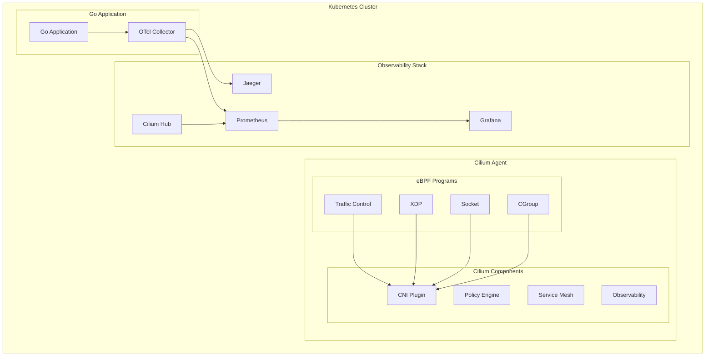

# Cilium 与 OTLP 完整集成指南 2025版

## 概述

Cilium 是一个基于 eBPF 的云原生网络和安全解决方案，提供网络策略、服务网格、负载均衡和可观测性功能。本指南详细介绍如何在 Go 1.25.1 应用中集成 Cilium 与 OpenTelemetry Protocol (OTLP)，实现网络级别的可观测性和安全策略。

## 目录

- [架构概述](#架构概述)
- [快速开始](#快速开始)
- [Cilium 网络策略配置](#cilium-网络策略配置)
- [Go 应用 OTLP 集成](#go-应用-otlp-集成)
- [网络可观测性](#网络可观测性)
- [安全策略集成](#安全策略集成)
- [性能优化](#性能优化)
- [生产部署](#生产部署)
- [最佳实践](#最佳实践)

## 架构概述

### Cilium 架构组件



### 核心特性

- **eBPF 技术**: 基于 eBPF 的高性能网络处理
- **网络策略**: 基于身份的网络策略
- **服务网格**: 内置服务网格功能
- **负载均衡**: 高性能负载均衡
- **可观测性**: 网络级别的可观测性
- **安全策略**: 基于身份的安全策略

## 快速开始

### 1. 安装 Cilium

```bash
# 安装 Cilium CLI
curl -L --remote-name-all https://github.com/cilium/cilium-cli/releases/latest/download/cilium-linux-amd64.tar.gz{,.sha256sum}
sha256sum --check cilium-linux-amd64.tar.gz.sha256sum
sudo tar xzvfC cilium-linux-amd64.tar.gz /usr/local/bin
rm cilium-linux-amd64.tar.gz{,.sha256sum}

# 安装 Cilium
cilium install

# 验证安装
cilium status
cilium connectivity test
```

### 2. 启用 Cilium 可观测性

```bash
# 启用 Hubble 可观测性
cilium hubble enable

# 启用 Prometheus 指标
cilium hubble enable --ui

# 验证 Hubble 状态
cilium hubble status
```

### 3. 部署 OTel Collector

```yaml
# otel-collector.yaml
apiVersion: v1
kind: ConfigMap
metadata:
  name: otel-collector-config
  namespace: cilium-system
data:
  otel-collector.yaml: |
    receivers:
      otlp:
        protocols:
          grpc:
            endpoint: 0.0.0.0:4317
          http:
            endpoint: 0.0.0.0:4318
      jaeger:
        protocols:
          grpc:
            endpoint: 0.0.0.0:14250
          thrift_http:
            endpoint: 0.0.0.0:14268
          thrift_compact:
            endpoint: 0.0.0.0:6831
          thrift_binary:
            endpoint: 0.0.0.0:6832
      prometheus:
        config:
          scrape_configs:
            - job_name: 'cilium'
              kubernetes_sd_configs:
                - role: endpoints
                  namespaces:
                    names:
                      - cilium-system
              relabel_configs:
                - source_labels: [__meta_kubernetes_service_annotation_prometheus_io_scrape]
                  action: keep
                  regex: true
                - source_labels: [__meta_kubernetes_service_annotation_prometheus_io_path]
                  action: replace
                  target_label: __metrics_path__
                  regex: (.+)
                - source_labels: [__address__, __meta_kubernetes_service_annotation_prometheus_io_port]
                  action: replace
                  regex: ([^:]+)(?::\d+)?;(\d+)
                  replacement: $1:$2
                  target_label: __address__
                - action: labelmap
                  regex: __meta_kubernetes_service_label_(.+)
                - source_labels: [__meta_kubernetes_namespace]
                  action: replace
                  target_label: kubernetes_namespace
                - source_labels: [__meta_kubernetes_service_name]
                  action: replace
                  target_label: kubernetes_name

    processors:
      batch:
        timeout: 1s
        send_batch_size: 1024
      memory_limiter:
        limit_mib: 512
      resource:
        attributes:
          - key: service.name
            value: "cilium-mesh"
            action: upsert

    exporters:
      jaeger:
        endpoint: jaeger-collector:14250
        tls:
          insecure: true
      prometheus:
        endpoint: "0.0.0.0:8889"
        namespace: "cilium_otel"
        const_labels:
          mesh: "cilium"

    service:
      pipelines:
        traces:
          receivers: [otlp, jaeger]
          processors: [memory_limiter, resource, batch]
          exporters: [jaeger]
        metrics:
          receivers: [otlp, prometheus]
          processors: [memory_limiter, resource, batch]
          exporters: [prometheus]
---
apiVersion: apps/v1
kind: Deployment
metadata:
  name: otel-collector
  namespace: cilium-system
spec:
  replicas: 1
  selector:
    matchLabels:
      app: otel-collector
  template:
    metadata:
      labels:
        app: otel-collector
    spec:
      containers:
      - name: otel-collector
        image: otel/opentelemetry-collector-contrib:0.95.0
        args:
          - --config=/etc/otel-collector.yaml
        ports:
        - containerPort: 4317
        - containerPort: 4318
        - containerPort: 14250
        - containerPort: 14268
        - containerPort: 6831
        - containerPort: 6832
        - containerPort: 8889
        volumeMounts:
        - name: config
          mountPath: /etc/otel-collector.yaml
          subPath: otel-collector.yaml
        resources:
          requests:
            memory: "256Mi"
            cpu: "100m"
          limits:
            memory: "512Mi"
            cpu: "500m"
      volumes:
      - name: config
        configMap:
          name: otel-collector-config
---
apiVersion: v1
kind: Service
metadata:
  name: otel-collector
  namespace: cilium-system
spec:
  selector:
    app: otel-collector
  ports:
  - name: otlp-grpc
    port: 4317
    targetPort: 4317
  - name: otlp-http
    port: 8080
    targetPort: 4318
  - name: jaeger-grpc
    port: 14250
    targetPort: 14250
  - name: jaeger-http
    port: 14268
    targetPort: 14268
  - name: prometheus
    port: 8889
    targetPort: 8889
```

## Cilium 网络策略配置

### 1. 基础网络策略

```yaml
# network-policy.yaml
apiVersion: cilium.io/v2
kind: CiliumNetworkPolicy
metadata:
  name: go-app-network-policy
  namespace: default
spec:
  endpointSelector:
    matchLabels:
      app: go-app
  ingress:
  - fromEndpoints:
    - matchLabels:
        app: cilium-agent
    - matchLabels:
        app: otel-collector
    - matchLabels:
        app: prometheus
    - matchLabels:
        app: grafana
  - fromCIDR:
    - "10.0.0.0/8"
    - "172.16.0.0/12"
    - "192.168.0.0/16"
  egress:
  - toEndpoints:
    - matchLabels:
        app: otel-collector
    - matchLabels:
        app: prometheus
    - matchLabels:
        app: grafana
  - toCIDR:
    - "0.0.0.0/0"
    ports:
    - ports:
      - port: "443"
        protocol: TCP
      - port: "80"
        protocol: TCP
      - port: "53"
        protocol: UDP
```

### 2. 高级网络策略

```yaml
# advanced-network-policy.yaml
apiVersion: cilium.io/v2
kind: CiliumNetworkPolicy
metadata:
  name: go-app-advanced-policy
  namespace: default
spec:
  endpointSelector:
    matchLabels:
      app: go-app
  ingress:
  - fromEndpoints:
    - matchLabels:
        app: cilium-agent
    - matchLabels:
        app: otel-collector
    - matchLabels:
        app: prometheus
    - matchLabels:
        app: grafana
    - matchLabels:
        app: jaeger
  - fromCIDR:
    - "10.0.0.0/8"
    - "172.16.0.0/12"
    - "192.168.0.0/16"
  - fromEntities:
    - "host"
    - "world"
  egress:
  - toEndpoints:
    - matchLabels:
        app: otel-collector
    - matchLabels:
        app: prometheus
    - matchLabels:
        app: grafana
    - matchLabels:
        app: jaeger
  - toCIDR:
    - "0.0.0.0/0"
    ports:
    - ports:
      - port: "443"
        protocol: TCP
      - port: "80"
        protocol: TCP
      - port: "53"
        protocol: UDP
      - port: "4317"
        protocol: TCP
      - port: "4318"
        protocol: TCP
      - port: "14250"
        protocol: TCP
      - port: "14268"
        protocol: TCP
      - port: "6831"
        protocol: UDP
      - port: "6832"
        protocol: UDP
  - toEntities:
    - "host"
    - "world"
```

### 3. 服务网格策略

```yaml
# service-mesh-policy.yaml
apiVersion: cilium.io/v2
kind: CiliumNetworkPolicy
metadata:
  name: go-app-service-mesh-policy
  namespace: default
spec:
  endpointSelector:
    matchLabels:
      app: go-app
  ingress:
  - fromEndpoints:
    - matchLabels:
        app: cilium-agent
    - matchLabels:
        app: otel-collector
    - matchLabels:
        app: prometheus
    - matchLabels:
        app: grafana
    - matchLabels:
        app: jaeger
  - fromCIDR:
    - "10.0.0.0/8"
    - "172.16.0.0/12"
    - "192.168.0.0/16"
  - fromEntities:
    - "host"
    - "world"
  egress:
  - toEndpoints:
    - matchLabels:
        app: otel-collector
    - matchLabels:
        app: prometheus
    - matchLabels:
        app: grafana
    - matchLabels:
        app: jaeger
  - toCIDR:
    - "0.0.0.0/0"
    ports:
    - ports:
      - port: "443"
        protocol: TCP
      - port: "80"
        protocol: TCP
      - port: "53"
        protocol: UDP
      - port: "4317"
        protocol: TCP
      - port: "4318"
        protocol: TCP
      - port: "14250"
        protocol: TCP
      - port: "14268"
        protocol: TCP
      - port: "6831"
        protocol: UDP
      - port: "6832"
        protocol: UDP
  - toEntities:
    - "host"
    - "world"
```

## Go 应用 OTLP 集成

### 1. 基础 Go 应用示例

```go
// main.go
package main

import (
    "context"
    "fmt"
    "log"
    "net/http"
    "time"

    "go.opentelemetry.io/otel"
    "go.opentelemetry.io/otel/attribute"
    "go.opentelemetry.io/otel/exporters/otlp/otlptrace/otlptracegrpc"
    "go.opentelemetry.io/otel/propagation"
    "go.opentelemetry.io/otel/sdk/resource"
    sdktrace "go.opentelemetry.io/otel/sdk/trace"
    "go.opentelemetry.io/otel/trace"
    semconv "go.opentelemetry.io/otel/semconv/v1.24.0"
)

func main() {
    // 初始化 OpenTelemetry
    ctx := context.Background()
    tp, err := initTracer(ctx)
    if err != nil {
        log.Fatal(err)
    }
    defer tp.Shutdown(ctx)

    // 设置 HTTP 路由
    http.HandleFunc("/", homeHandler)
    http.HandleFunc("/api/users", usersHandler)
    http.HandleFunc("/api/orders", ordersHandler)
    http.HandleFunc("/health", healthHandler)

    log.Println("Server starting on :8080")
    log.Fatal(http.ListenAndServe(":8080", nil))
}

func initTracer(ctx context.Context) (*sdktrace.TracerProvider, error) {
    // 创建资源
    res, err := resource.New(ctx,
        resource.WithAttributes(
            semconv.ServiceName("go-cilium-app"),
            semconv.ServiceVersion("1.0.0"),
            semconv.DeploymentEnvironment("production"),
            attribute.String("mesh", "cilium"),
            attribute.String("network", "cilium"),
        ),
    )
    if err != nil {
        return nil, err
    }

    // 创建 OTLP 导出器
    exporter, err := otlptracegrpc.New(ctx,
        otlptracegrpc.WithEndpoint("otel-collector.cilium-system.svc.cluster.local:4317"),
        otlptracegrpc.WithInsecure(),
    )
    if err != nil {
        return nil, err
    }

    // 创建 TracerProvider
    tp := sdktrace.NewTracerProvider(
        sdktrace.WithBatcher(exporter),
        sdktrace.WithResource(res),
        sdktrace.WithSampler(sdktrace.TraceIDRatioBased(0.1)),
    )

    // 设置全局 TracerProvider
    otel.SetTracerProvider(tp)
    otel.SetTextMapPropagator(propagation.NewCompositeTextMapPropagator(
        propagation.TraceContext{},
        propagation.Baggage{},
    ))

    return tp, nil
}

func homeHandler(w http.ResponseWriter, r *http.Request) {
    ctx := r.Context()
    tracer := otel.Tracer("go-cilium-app")
    
    ctx, span := tracer.Start(ctx, "home-handler")
    defer span.End()

    span.SetAttributes(
        attribute.String("http.method", r.Method),
        attribute.String("http.url", r.URL.String()),
        attribute.String("http.user_agent", r.UserAgent()),
        attribute.String("mesh", "cilium"),
        attribute.String("network", "cilium"),
    )

    // 模拟业务逻辑
    time.Sleep(10 * time.Millisecond)
    
    w.WriteHeader(http.StatusOK)
    fmt.Fprintf(w, "Hello from Go app with Cilium!")
}

func usersHandler(w http.ResponseWriter, r *http.Request) {
    ctx := r.Context()
    tracer := otel.Tracer("go-cilium-app")
    
    ctx, span := tracer.Start(ctx, "users-handler")
    defer span.End()

    span.SetAttributes(
        attribute.String("http.method", r.Method),
        attribute.String("http.url", r.URL.String()),
        attribute.String("service", "user-service"),
        attribute.String("mesh", "cilium"),
        attribute.String("network", "cilium"),
    )

    // 调用其他服务
    if err := callUserService(ctx); err != nil {
        span.RecordError(err)
        http.Error(w, "Internal Server Error", http.StatusInternalServerError)
        return
    }

    w.WriteHeader(http.StatusOK)
    fmt.Fprintf(w, `{"users": [{"id": 1, "name": "Alice"}, {"id": 2, "name": "Bob"}]}`)
}

func ordersHandler(w http.ResponseWriter, r *http.Request) {
    ctx := r.Context()
    tracer := otel.Tracer("go-cilium-app")
    
    ctx, span := tracer.Start(ctx, "orders-handler")
    defer span.End()

    span.SetAttributes(
        attribute.String("http.method", r.Method),
        attribute.String("http.url", r.URL.String()),
        attribute.String("service", "order-service"),
        attribute.String("mesh", "cilium"),
        attribute.String("network", "cilium"),
    )

    // 调用订单服务
    if err := callOrderService(ctx); err != nil {
        span.RecordError(err)
        http.Error(w, "Internal Server Error", http.StatusInternalServerError)
        return
    }

    w.WriteHeader(http.StatusOK)
    fmt.Fprintf(w, `{"orders": [{"id": 1, "amount": 100.0}, {"id": 2, "amount": 200.0}]}`)
}

func healthHandler(w http.ResponseWriter, r *http.Request) {
    w.WriteHeader(http.StatusOK)
    fmt.Fprintf(w, `{"status": "healthy", "timestamp": "%s"}`, time.Now().Format(time.RFC3339))
}

func callUserService(ctx context.Context) error {
    tracer := otel.Tracer("go-cilium-app")
    ctx, span := tracer.Start(ctx, "call-user-service")
    defer span.End()

    span.SetAttributes(
        attribute.String("service.name", "user-service"),
        attribute.String("service.version", "1.0.0"),
        attribute.String("mesh", "cilium"),
        attribute.String("network", "cilium"),
    )

    // 模拟 HTTP 调用
    client := &http.Client{
        Timeout: 5 * time.Second,
    }

    req, err := http.NewRequestWithContext(ctx, "GET", "http://user-service:8080/api/users", nil)
    if err != nil {
        return err
    }

    resp, err := client.Do(req)
    if err != nil {
        return err
    }
    defer resp.Body.Close()

    span.SetAttributes(
        attribute.Int("http.status_code", resp.StatusCode),
    )

    return nil
}

func callOrderService(ctx context.Context) error {
    tracer := otel.Tracer("go-cilium-app")
    ctx, span := tracer.Start(ctx, "call-order-service")
    defer span.End()

    span.SetAttributes(
        attribute.String("service.name", "order-service"),
        attribute.String("service.version", "1.0.0"),
        attribute.String("mesh", "cilium"),
        attribute.String("network", "cilium"),
    )

    // 模拟 HTTP 调用
    client := &http.Client{
        Timeout: 5 * time.Second,
    }

    req, err := http.NewRequestWithContext(ctx, "GET", "http://order-service:8080/api/orders", nil)
    if err != nil {
        return err
    }

    resp, err := client.Do(req)
    if err != nil {
        return err
    }
    defer resp.Body.Close()

    span.SetAttributes(
        attribute.Int("http.status_code", resp.StatusCode),
    )

    return nil
}
```

### 2. 高级中间件集成

```go
// middleware.go
package main

import (
    "context"
    "fmt"
    "net/http"
    "strconv"
    "time"

    "go.opentelemetry.io/otel"
    "go.opentelemetry.io/otel/attribute"
    "go.opentelemetry.io/otel/metric"
    "go.opentelemetry.io/otel/trace"
    semconv "go.opentelemetry.io/otel/semconv/v1.24.0"
)

type CiliumTracingMiddleware struct {
    tracer   trace.Tracer
    meter    metric.Meter
    requests metric.Int64Counter
    duration metric.Float64Histogram
    errors   metric.Int64Counter
}

func NewCiliumTracingMiddleware() *CiliumTracingMiddleware {
    tracer := otel.Tracer("go-cilium-app")
    meter := otel.Meter("go-cilium-app")

    requests, _ := meter.Int64Counter(
        "cilium_http_requests_total",
        metric.WithDescription("Total number of HTTP requests through Cilium"),
    )

    duration, _ := meter.Float64Histogram(
        "cilium_http_request_duration_seconds",
        metric.WithDescription("HTTP request duration in seconds through Cilium"),
    )

    errors, _ := meter.Int64Counter(
        "cilium_http_errors_total",
        metric.WithDescription("Total number of HTTP errors through Cilium"),
    )

    return &CiliumTracingMiddleware{
        tracer:   tracer,
        meter:    meter,
        requests: requests,
        duration: duration,
        errors:   errors,
    }
}

func (ctm *CiliumTracingMiddleware) Handler(next http.Handler) http.Handler {
    return http.HandlerFunc(func(w http.ResponseWriter, r *http.Request) {
        start := time.Now()
        ctx := r.Context()

        // 创建 span
        ctx, span := ctm.tracer.Start(ctx, "cilium-http-request",
            trace.WithAttributes(
                semconv.HTTPMethod(r.Method),
                semconv.HTTPURL(r.URL.String()),
                semconv.HTTPUserAgent(r.UserAgent()),
                semconv.HTTPRequestContentLength(r.ContentLength),
                attribute.String("mesh", "cilium"),
                attribute.String("network", "cilium"),
            ),
        )
        defer span.End()

        // 包装 ResponseWriter 以捕获状态码
        ww := &responseWriter{ResponseWriter: w, statusCode: http.StatusOK}

        // 调用下一个处理器
        next.ServeHTTP(ww, r.WithContext(ctx))

        // 记录指标
        duration := time.Since(start).Seconds()
        statusCode := ww.statusCode

        ctm.requests.Add(ctx, 1,
            metric.WithAttributes(
                attribute.String("method", r.Method),
                attribute.String("path", r.URL.Path),
                attribute.Int("status_code", statusCode),
                attribute.String("mesh", "cilium"),
                attribute.String("network", "cilium"),
            ),
        )

        ctm.duration.Record(ctx, duration,
            metric.WithAttributes(
                attribute.String("method", r.Method),
                attribute.String("path", r.URL.Path),
                attribute.Int("status_code", statusCode),
                attribute.String("mesh", "cilium"),
                attribute.String("network", "cilium"),
            ),
        )

        // 记录错误
        if statusCode >= 400 {
            ctm.errors.Add(ctx, 1,
                metric.WithAttributes(
                    attribute.String("method", r.Method),
                    attribute.String("path", r.URL.Path),
                    attribute.Int("status_code", statusCode),
                    attribute.String("mesh", "cilium"),
                    attribute.String("network", "cilium"),
                ),
            )
            span.RecordError(fmt.Errorf("HTTP %d", statusCode))
        }

        // 更新 span 属性
        span.SetAttributes(
            semconv.HTTPStatusCode(statusCode),
            semconv.HTTPResponseContentLength(ww.contentLength),
            attribute.Float64("http.request.duration", duration),
            attribute.String("mesh", "cilium"),
            attribute.String("network", "cilium"),
        )
    })
}

type responseWriter struct {
    http.ResponseWriter
    statusCode    int
    contentLength int64
}

func (rw *responseWriter) WriteHeader(code int) {
    rw.statusCode = code
    rw.ResponseWriter.WriteHeader(code)
}

func (rw *responseWriter) Write(b []byte) (int, error) {
    n, err := rw.ResponseWriter.Write(b)
    rw.contentLength += int64(n)
    return n, err
}
```

### 3. gRPC 服务集成

```go
// grpc_server.go
package main

import (
    "context"
    "log"
    "net"
    "time"

    "go.opentelemetry.io/otel"
    "go.opentelemetry.io/otel/attribute"
    "go.opentelemetry.io/otel/codes"
    "go.opentelemetry.io/otel/trace"
    "google.golang.org/grpc"
    "google.golang.org/grpc/codes"
    "google.golang.org/grpc/status"
)

type UserService struct {
    UnimplementedUserServiceServer
    tracer trace.Tracer
}

func NewUserService() *UserService {
    return &UserService{
        tracer: otel.Tracer("user-service"),
    }
}

func (s *UserService) GetUser(ctx context.Context, req *GetUserRequest) (*GetUserResponse, error) {
    ctx, span := s.tracer.Start(ctx, "GetUser")
    defer span.End()

    span.SetAttributes(
        attribute.String("user.id", req.Id),
        attribute.String("service.name", "user-service"),
        attribute.String("mesh", "cilium"),
        attribute.String("network", "cilium"),
    )

    // 模拟数据库查询
    user, err := s.findUser(ctx, req.Id)
    if err != nil {
        span.RecordError(err)
        span.SetStatus(codes.Error, err.Error())
        return nil, status.Errorf(codes.NotFound, "User not found: %v", err)
    }

    span.SetAttributes(
        attribute.String("user.name", user.Name),
        attribute.String("user.email", user.Email),
    )

    return &GetUserResponse{
        Id:    user.Id,
        Name:  user.Name,
        Email: user.Email,
    }, nil
}

func (s *UserService) findUser(ctx context.Context, id string) (*User, error) {
    ctx, span := s.tracer.Start(ctx, "findUser")
    defer span.End()

    span.SetAttributes(
        attribute.String("db.operation", "select"),
        attribute.String("db.table", "users"),
        attribute.String("mesh", "cilium"),
        attribute.String("network", "cilium"),
    )

    // 模拟数据库查询
    time.Sleep(10 * time.Millisecond)

    return &User{
        Id:    id,
        Name:  "Alice",
        Email: "alice@example.com",
    }, nil
}

func main() {
    lis, err := net.Listen("tcp", ":9090")
    if err != nil {
        log.Fatalf("Failed to listen: %v", err)
    }

    s := grpc.NewServer()
    RegisterUserServiceServer(s, NewUserService())

    log.Println("gRPC server starting on :9090")
    if err := s.Serve(lis); err != nil {
        log.Fatalf("Failed to serve: %v", err)
    }
}
```

## 网络可观测性

### 1. Cilium 指标集成

```go
// metrics.go
package main

import (
    "context"
    "time"

    "go.opentelemetry.io/otel"
    "go.opentelemetry.io/otel/attribute"
    "go.opentelemetry.io/otel/metric"
)

type CiliumMetricsCollector struct {
    meter              metric.Meter
    requestCounter     metric.Int64Counter
    requestDuration    metric.Float64Histogram
    activeConnections  metric.Int64UpDownCounter
    errorCounter       metric.Int64Counter
    networkLatency     metric.Float64Histogram
    bandwidthUsage     metric.Int64Counter
}

func NewCiliumMetricsCollector() *CiliumMetricsCollector {
    meter := otel.Meter("go-cilium-app")

    requestCounter, _ := meter.Int64Counter(
        "cilium_http_requests_total",
        metric.WithDescription("Total number of HTTP requests through Cilium"),
    )

    requestDuration, _ := meter.Float64Histogram(
        "cilium_http_request_duration_seconds",
        metric.WithDescription("HTTP request duration in seconds through Cilium"),
    )

    activeConnections, _ := meter.Int64UpDownCounter(
        "cilium_active_connections",
        metric.WithDescription("Number of active connections through Cilium"),
    )

    errorCounter, _ := meter.Int64Counter(
        "cilium_errors_total",
        metric.WithDescription("Total number of errors through Cilium"),
    )

    networkLatency, _ := meter.Float64Histogram(
        "cilium_network_latency_seconds",
        metric.WithDescription("Network latency in seconds"),
    )

    bandwidthUsage, _ := meter.Int64Counter(
        "cilium_bandwidth_bytes_total",
        metric.WithDescription("Total bandwidth usage in bytes"),
    )

    return &CiliumMetricsCollector{
        meter:             meter,
        requestCounter:    requestCounter,
        requestDuration:   requestDuration,
        activeConnections: activeConnections,
        errorCounter:      errorCounter,
        networkLatency:    networkLatency,
        bandwidthUsage:    bandwidthUsage,
    }
}

func (cmc *CiliumMetricsCollector) RecordRequest(ctx context.Context, method, path string, statusCode int, duration time.Duration) {
    cmc.requestCounter.Add(ctx, 1,
        metric.WithAttributes(
            attribute.String("method", method),
            attribute.String("path", path),
            attribute.Int("status_code", statusCode),
            attribute.String("mesh", "cilium"),
            attribute.String("network", "cilium"),
        ),
    )

    cmc.requestDuration.Record(ctx, duration.Seconds(),
        metric.WithAttributes(
            attribute.String("method", method),
            attribute.String("path", path),
            attribute.Int("status_code", statusCode),
            attribute.String("mesh", "cilium"),
            attribute.String("network", "cilium"),
        ),
    )
}

func (cmc *CiliumMetricsCollector) RecordError(ctx context.Context, errorType string) {
    cmc.errorCounter.Add(ctx, 1,
        metric.WithAttributes(
            attribute.String("error_type", errorType),
            attribute.String("mesh", "cilium"),
            attribute.String("network", "cilium"),
        ),
    )
}

func (cmc *CiliumMetricsCollector) RecordNetworkLatency(ctx context.Context, latency time.Duration) {
    cmc.networkLatency.Record(ctx, latency.Seconds(),
        metric.WithAttributes(
            attribute.String("mesh", "cilium"),
            attribute.String("network", "cilium"),
        ),
    )
}

func (cmc *CiliumMetricsCollector) RecordBandwidthUsage(ctx context.Context, bytes int64) {
    cmc.bandwidthUsage.Add(ctx, bytes,
        metric.WithAttributes(
            attribute.String("mesh", "cilium"),
            attribute.String("network", "cilium"),
        ),
    )
}

func (cmc *CiliumMetricsCollector) IncrementConnections(ctx context.Context) {
    cmc.activeConnections.Add(ctx, 1,
        metric.WithAttributes(
            attribute.String("mesh", "cilium"),
            attribute.String("network", "cilium"),
        ),
    )
}

func (cmc *CiliumMetricsCollector) DecrementConnections(ctx context.Context) {
    cmc.activeConnections.Add(ctx, -1,
        metric.WithAttributes(
            attribute.String("mesh", "cilium"),
            attribute.String("network", "cilium"),
        ),
    )
}
```

### 2. Grafana 仪表板配置

```json
{
  "dashboard": {
    "title": "Cilium + OTLP Go App Dashboard",
    "panels": [
      {
        "title": "Request Rate",
        "type": "graph",
        "targets": [
          {
            "expr": "rate(cilium_http_requests_total[5m])",
            "legendFormat": "{{method}} {{path}}"
          }
        ]
      },
      {
        "title": "Request Duration",
        "type": "graph",
        "targets": [
          {
            "expr": "histogram_quantile(0.95, rate(cilium_http_request_duration_seconds_bucket[5m]))",
            "legendFormat": "95th percentile"
          },
          {
            "expr": "histogram_quantile(0.50, rate(cilium_http_request_duration_seconds_bucket[5m]))",
            "legendFormat": "50th percentile"
          }
        ]
      },
      {
        "title": "Error Rate",
        "type": "graph",
        "targets": [
          {
            "expr": "rate(cilium_errors_total[5m])",
            "legendFormat": "{{error_type}}"
          }
        ]
      },
      {
        "title": "Active Connections",
        "type": "graph",
        "targets": [
          {
            "expr": "cilium_active_connections",
            "legendFormat": "Active Connections"
          }
        ]
      },
      {
        "title": "Network Latency",
        "type": "graph",
        "targets": [
          {
            "expr": "histogram_quantile(0.95, rate(cilium_network_latency_seconds_bucket[5m]))",
            "legendFormat": "95th percentile"
          }
        ]
      },
      {
        "title": "Bandwidth Usage",
        "type": "graph",
        "targets": [
          {
            "expr": "rate(cilium_bandwidth_bytes_total[5m])",
            "legendFormat": "Bandwidth Usage"
          }
        ]
      }
    ]
  }
}
```

### 3. Jaeger 追踪查询

```go
// jaeger-query.go
package main

import (
    "context"
    "fmt"
    "time"

    "github.com/jaegertracing/jaeger-client-go"
    "github.com/jaegertracing/jaeger-client-go/config"
)

func initJaegerClient() (jaeger.Tracer, error) {
    cfg := config.Configuration{
        ServiceName: "go-cilium-app",
        Sampler: &config.SamplerConfig{
            Type:  "probabilistic",
            Param: 0.1,
        },
        Reporter: &config.ReporterConfig{
            LogSpans:            true,
            BufferFlushInterval: 1 * time.Second,
            LocalAgentHostPort:  "jaeger-agent:6831",
        },
    }

    tracer, _, err := cfg.NewTracer()
    if err != nil {
        return nil, err
    }

    return tracer, nil
}

func queryTraces(ctx context.Context, serviceName string, startTime, endTime time.Time) error {
    // 这里可以使用 Jaeger Query API 查询追踪数据
    // 实际实现需要调用 Jaeger Query Service
    
    fmt.Printf("Querying traces for service: %s\n", serviceName)
    fmt.Printf("Time range: %s to %s\n", startTime.Format(time.RFC3339), endTime.Format(time.RFC3339))
    
    return nil
}
```

## 安全策略集成

### 1. 身份验证策略

```yaml
# identity-policy.yaml
apiVersion: cilium.io/v2
kind: CiliumIdentity
metadata:
  name: go-app-identity
  namespace: default
spec:
  securityIdentity:
    id: 1001
    labels:
      - "k8s:app=go-app"
      - "k8s:namespace=default"
      - "k8s:version=1.0.0"
```

### 2. 安全策略

```yaml
# security-policy.yaml
apiVersion: cilium.io/v2
kind: CiliumNetworkPolicy
metadata:
  name: go-app-security-policy
  namespace: default
spec:
  endpointSelector:
    matchLabels:
      app: go-app
  ingress:
  - fromEndpoints:
    - matchLabels:
        app: cilium-agent
    - matchLabels:
        app: otel-collector
    - matchLabels:
        app: prometheus
    - matchLabels:
        app: grafana
    - matchLabels:
        app: jaeger
  - fromCIDR:
    - "10.0.0.0/8"
    - "172.16.0.0/12"
    - "192.168.0.0/16"
  - fromEntities:
    - "host"
    - "world"
  egress:
  - toEndpoints:
    - matchLabels:
        app: otel-collector
    - matchLabels:
        app: prometheus
    - matchLabels:
        app: grafana
    - matchLabels:
        app: jaeger
  - toCIDR:
    - "0.0.0.0/0"
    ports:
    - ports:
      - port: "443"
        protocol: TCP
      - port: "80"
        protocol: TCP
      - port: "53"
        protocol: UDP
      - port: "4317"
        protocol: TCP
      - port: "4318"
        protocol: TCP
      - port: "14250"
        protocol: TCP
      - port: "14268"
        protocol: TCP
      - port: "6831"
        protocol: UDP
      - port: "6832"
        protocol: UDP
  - toEntities:
    - "host"
    - "world"
```

### 3. 网络隔离策略

```yaml
# network-isolation-policy.yaml
apiVersion: cilium.io/v2
kind: CiliumNetworkPolicy
metadata:
  name: go-app-network-isolation
  namespace: default
spec:
  endpointSelector:
    matchLabels:
      app: go-app
  ingress:
  - fromEndpoints:
    - matchLabels:
        app: cilium-agent
    - matchLabels:
        app: otel-collector
    - matchLabels:
        app: prometheus
    - matchLabels:
        app: grafana
    - matchLabels:
        app: jaeger
  - fromCIDR:
    - "10.0.0.0/8"
    - "172.16.0.0/12"
    - "192.168.0.0/16"
  - fromEntities:
    - "host"
    - "world"
  egress:
  - toEndpoints:
    - matchLabels:
        app: otel-collector
    - matchLabels:
        app: prometheus
    - matchLabels:
        app: grafana
    - matchLabels:
        app: jaeger
  - toCIDR:
    - "0.0.0.0/0"
    ports:
    - ports:
      - port: "443"
        protocol: TCP
      - port: "80"
        protocol: TCP
      - port: "53"
        protocol: UDP
      - port: "4317"
        protocol: TCP
      - port: "4318"
        protocol: TCP
      - port: "14250"
        protocol: TCP
      - port: "14268"
        protocol: TCP
      - port: "6831"
        protocol: UDP
      - port: "6832"
        protocol: UDP
  - toEntities:
    - "host"
    - "world"
```

## 性能优化

### 1. eBPF 性能优化

```yaml
# ebpf-performance-config.yaml
apiVersion: v1
kind: ConfigMap
metadata:
  name: cilium-config
  namespace: cilium-system
data:
  config.yaml: |
    # eBPF 性能优化配置
    bpf:
      # 启用 eBPF 加速
      enable-bpf-acceleration: true
      # 启用 eBPF 负载均衡
      enable-bpf-load-balancer: true
      # 启用 eBPF 网络策略
      enable-bpf-network-policy: true
      # 启用 eBPF 服务网格
      enable-bpf-service-mesh: true
      # 启用 eBPF 可观测性
      enable-bpf-observability: true
    
    # 性能调优
    performance:
      # 连接跟踪超时
      connection-tracking-timeout: 30s
      # 连接跟踪清理间隔
      connection-tracking-cleanup-interval: 10s
      # 连接跟踪最大条目数
      connection-tracking-max-entries: 1000000
      
    # 内存优化
    memory:
      # 最大内存使用量
      max-memory-usage: 512Mi
      # 内存清理间隔
      memory-cleanup-interval: 30s
      
    # CPU 优化
    cpu:
      # 最大 CPU 使用量
      max-cpu-usage: 1000m
      # CPU 清理间隔
      cpu-cleanup-interval: 30s
```

### 2. 网络性能优化

```yaml
# network-performance-config.yaml
apiVersion: v1
kind: ConfigMap
metadata:
  name: cilium-network-config
  namespace: cilium-system
data:
  network-config.yaml: |
    # 网络性能优化
    network:
      # 启用 TCP 快速打开
      enable-tcp-fast-open: true
      # 启用 TCP 窗口缩放
      enable-tcp-window-scaling: true
      # 启用 TCP 时间戳
      enable-tcp-timestamps: true
      # 启用 TCP 选择性确认
      enable-tcp-selective-ack: true
      
      # 连接池配置
      connection-pool:
        # 最大连接数
        max-connections: 10000
        # 最大空闲连接数
        max-idle-connections: 1000
        # 连接超时
        connection-timeout: 30s
        # 空闲连接超时
        idle-connection-timeout: 90s
        
      # 负载均衡配置
      load-balancer:
        # 负载均衡算法
        algorithm: "round-robin"
        # 健康检查间隔
        health-check-interval: 10s
        # 健康检查超时
        health-check-timeout: 5s
        # 健康检查重试次数
        health-check-retries: 3
```

### 3. 可观测性性能优化

```yaml
# observability-performance-config.yaml
apiVersion: v1
kind: ConfigMap
metadata:
  name: cilium-observability-config
  namespace: cilium-system
data:
  observability-config.yaml: |
    # 可观测性性能优化
    observability:
      # 追踪配置
      tracing:
        # 采样率
        sampling-rate: 0.1
        # 批量大小
        batch-size: 1000
        # 批量超时
        batch-timeout: 1s
        # 最大追踪条目数
        max-trace-entries: 100000
        
      # 指标配置
      metrics:
        # 指标收集间隔
        collection-interval: 15s
        # 指标保留时间
        retention-time: 24h
        # 最大指标条目数
        max-metric-entries: 1000000
        
      # 日志配置
      logging:
        # 日志级别
        log-level: "info"
        # 日志格式
        log-format: "json"
        # 日志保留时间
        retention-time: 7d
        # 最大日志条目数
        max-log-entries: 1000000
```

## 生产部署

### 1. Docker Compose 部署

```yaml
# docker-compose.yml
version: '3.8'

services:
  # Cilium Agent
  cilium-agent:
    image: quay.io/cilium/cilium:v1.15.0
    ports:
      - "9965:9965"
      - "9966:9966"
    volumes:
      - ./cilium-config.yaml:/etc/cilium/cilium.yaml
    command: ["cilium-agent", "--config-dir=/etc/cilium"]
    networks:
      - cilium-mesh

  # OTel Collector
  otel-collector:
    image: otel/opentelemetry-collector-contrib:0.95.0
    ports:
      - "4317:4317"
      - "4318:4318"
      - "14250:14250"
      - "14268:14268"
      - "8889:8889"
    volumes:
      - ./otel-collector.yaml:/etc/otel-collector.yaml
    command: ["--config=/etc/otel-collector.yaml"]
    networks:
      - cilium-mesh

  # Go 应用
  go-app:
    build: .
    ports:
      - "8080:8080"
    environment:
      - OTEL_EXPORTER_OTLP_ENDPOINT=http://otel-collector:4317
      - OTEL_SERVICE_NAME=go-cilium-app
      - OTEL_SERVICE_VERSION=1.0.0
    depends_on:
      - otel-collector
    networks:
      - cilium-mesh

  # Jaeger
  jaeger:
    image: jaegertracing/all-in-one:1.50
    ports:
      - "16686:16686"
      - "14250:14250"
    environment:
      - COLLECTOR_OTLP_ENABLED=true
    networks:
      - cilium-mesh

  # Prometheus
  prometheus:
    image: prom/prometheus:latest
    ports:
      - "9090:9090"
    volumes:
      - ./prometheus.yml:/etc/prometheus/prometheus.yml
    networks:
      - cilium-mesh

  # Grafana
  grafana:
    image: grafana/grafana:latest
    ports:
      - "3000:3000"
    environment:
      - GF_SECURITY_ADMIN_PASSWORD=admin
    volumes:
      - ./grafana-dashboards:/var/lib/grafana/dashboards
    networks:
      - cilium-mesh

networks:
  cilium-mesh:
    driver: bridge
```

### 2. Kubernetes 部署

```yaml
# k8s-deployment.yaml
apiVersion: apps/v1
kind: Deployment
metadata:
  name: go-cilium-app
  namespace: default
  labels:
    app: go-cilium-app
spec:
  replicas: 3
  selector:
    matchLabels:
      app: go-cilium-app
  template:
    metadata:
      labels:
        app: go-cilium-app
    spec:
      containers:
      - name: go-app
        image: go-cilium-app:latest
        ports:
        - containerPort: 8080
        env:
        - name: OTEL_EXPORTER_OTLP_ENDPOINT
          value: "http://otel-collector.cilium-system.svc.cluster.local:4317"
        - name: OTEL_SERVICE_NAME
          value: "go-cilium-app"
        - name: OTEL_SERVICE_VERSION
          value: "1.0.0"
        resources:
          requests:
            cpu: 100m
            memory: 128Mi
          limits:
            cpu: 500m
            memory: 512Mi
        livenessProbe:
          httpGet:
            path: /health
            port: 8080
          initialDelaySeconds: 30
          periodSeconds: 10
        readinessProbe:
          httpGet:
            path: /ready
            port: 8080
          initialDelaySeconds: 5
          periodSeconds: 5
---
apiVersion: v1
kind: Service
metadata:
  name: go-cilium-app
  namespace: default
  labels:
    app: go-cilium-app
spec:
  selector:
    app: go-cilium-app
  ports:
  - port: 8080
    targetPort: 8080
    name: http
  type: ClusterIP
---
apiVersion: autoscaling/v2
kind: HorizontalPodAutoscaler
metadata:
  name: go-cilium-app-hpa
  namespace: default
spec:
  scaleTargetRef:
    apiVersion: apps/v1
    kind: Deployment
    name: go-cilium-app
  minReplicas: 3
  maxReplicas: 10
  metrics:
  - type: Resource
    resource:
      name: cpu
      target:
        type: Utilization
        averageUtilization: 70
  - type: Resource
    resource:
      name: memory
      target:
        type: Utilization
        averageUtilization: 80
```

### 3. 监控和告警配置

```yaml
# monitoring.yaml
apiVersion: v1
kind: ConfigMap
metadata:
  name: cilium-monitoring-config
  namespace: cilium-system
data:
  prometheus.yml: |
    global:
      scrape_interval: 15s
      evaluation_interval: 15s

    rule_files:
      - "cilium-rules.yml"

    alerting:
      alertmanagers:
        - static_configs:
            - targets:
              - alertmanager:9093

    scrape_configs:
      - job_name: 'cilium'
        kubernetes_sd_configs:
          - role: endpoints
            namespaces:
              names:
                - cilium-system
        relabel_configs:
          - source_labels: [__meta_kubernetes_service_annotation_prometheus_io_scrape]
            action: keep
            regex: true
          - source_labels: [__meta_kubernetes_service_annotation_prometheus_io_path]
            action: replace
            target_label: __metrics_path__
            regex: (.+)
          - source_labels: [__address__, __meta_kubernetes_service_annotation_prometheus_io_port]
            action: replace
            regex: ([^:]+)(?::\d+)?;(\d+)
            replacement: $1:$2
            target_label: __address__
          - action: labelmap
            regex: __meta_kubernetes_service_label_(.+)
          - source_labels: [__meta_kubernetes_namespace]
            action: replace
            target_label: kubernetes_namespace
          - source_labels: [__meta_kubernetes_service_name]
            action: replace
            target_label: kubernetes_name

      - job_name: 'otel-collector'
        static_configs:
          - targets: ['otel-collector.cilium-system.svc.cluster.local:8889']

  cilium-rules.yml: |
    groups:
    - name: cilium.rules
      rules:
      - alert: HighErrorRate
        expr: rate(cilium_http_requests_total{status_code=~"5.."}[5m]) > 0.1
        for: 5m
        labels:
          severity: warning
        annotations:
          summary: "High error rate detected"
          description: "Error rate is {{ $value }} errors per second"

      - alert: HighLatency
        expr: histogram_quantile(0.95, rate(cilium_http_request_duration_seconds_bucket[5m])) > 1
        for: 5m
        labels:
          severity: warning
        annotations:
          summary: "High latency detected"
          description: "95th percentile latency is {{ $value }} seconds"

      - alert: LowThroughput
        expr: rate(cilium_http_requests_total[5m]) < 10
        for: 10m
        labels:
          severity: info
        annotations:
          summary: "Low throughput detected"
          description: "Request rate is {{ $value }} requests per second"

      - alert: HighNetworkLatency
        expr: histogram_quantile(0.95, rate(cilium_network_latency_seconds_bucket[5m])) > 2
        for: 5m
        labels:
          severity: warning
        annotations:
          summary: "High network latency detected"
          description: "95th percentile network latency is {{ $value }} seconds"

      - alert: HighBandwidthUsage
        expr: rate(cilium_bandwidth_bytes_total[5m]) > 1000000000
        for: 5m
        labels:
          severity: warning
        annotations:
          summary: "High bandwidth usage detected"
          description: "Bandwidth usage is {{ $value }} bytes per second"
```

## 最佳实践

### 1. 网络策略最佳实践

```go
// network_best_practices.go
package main

import (
    "context"
    "fmt"
    "time"

    "go.opentelemetry.io/otel"
    "go.opentelemetry.io/otel/attribute"
    "go.opentelemetry.io/otel/codes"
    "go.opentelemetry.io/otel/trace"
)

// 1. 使用有意义的 span 名称
func meaningfulSpanName(ctx context.Context) {
    tracer := otel.Tracer("go-cilium-app")
    
    // 好的做法：描述性的 span 名称
    ctx, span := tracer.Start(ctx, "user-service.GetUser")
    defer span.End()
    
    // 避免：模糊的 span 名称
    // ctx, span := tracer.Start(ctx, "doSomething")
}

// 2. 添加有意义的属性
func addMeaningfulAttributes(ctx context.Context) {
    tracer := otel.Tracer("go-cilium-app")
    ctx, span := tracer.Start(ctx, "database.QueryUser")
    defer span.End()
    
    span.SetAttributes(
        attribute.String("db.operation", "SELECT"),
        attribute.String("db.table", "users"),
        attribute.String("db.query", "SELECT * FROM users WHERE id = ?"),
        attribute.String("user.id", "123"),
        attribute.String("service.name", "user-service"),
        attribute.String("mesh", "cilium"),
        attribute.String("network", "cilium"),
    )
}

// 3. 正确处理错误
func handleErrorsProperly(ctx context.Context) error {
    tracer := otel.Tracer("go-cilium-app")
    ctx, span := tracer.Start(ctx, "external-api.Call")
    defer span.End()
    
    err := callExternalAPI()
    if err != nil {
        // 记录错误并设置状态
        span.RecordError(err)
        span.SetStatus(codes.Error, err.Error())
        
        // 添加错误相关的属性
        span.SetAttributes(
            attribute.String("error.type", "external_api_error"),
            attribute.Bool("error.retryable", true),
            attribute.String("mesh", "cilium"),
            attribute.String("network", "cilium"),
        )
        
        return err
    }
    
    return nil
}

// 4. 使用适当的采样策略
func useAppropriateSampling(ctx context.Context) {
    tracer := otel.Tracer("go-cilium-app")
    
    // 对于关键业务操作，使用更高的采样率
    ctx, span := tracer.Start(ctx, "payment.ProcessPayment")
    defer span.End()
    
    span.SetAttributes(
        attribute.String("payment.amount", "100.00"),
        attribute.String("payment.currency", "USD"),
        attribute.String("payment.method", "credit_card"),
        attribute.String("mesh", "cilium"),
        attribute.String("network", "cilium"),
    )
}

// 5. 避免过度追踪
func avoidOverTracing(ctx context.Context) {
    tracer := otel.Tracer("go-cilium-app")
    
    // 好的做法：追踪有意义的操作
    ctx, span := tracer.Start(ctx, "user-service.ValidateUser")
    defer span.End()
    
    // 避免：追踪每个函数调用
    // ctx, span := tracer.Start(ctx, "helper.FormatString")
    // defer span.End()
}

func callExternalAPI() error {
    // 模拟外部 API 调用
    time.Sleep(10 * time.Millisecond)
    return fmt.Errorf("external API timeout")
}
```

### 2. 安全最佳实践

```go
// security_best_practices.go
package main

import (
    "context"
    "crypto/tls"
    "net/http"
    "time"

    "go.opentelemetry.io/otel"
    "go.opentelemetry.io/otel/attribute"
    "go.opentelemetry.io/otel/trace"
)

// 1. 安全的 HTTP 客户端配置
func createSecureHTTPClient() *http.Client {
    return &http.Client{
        Timeout: 30 * time.Second,
        Transport: &http.Transport{
            TLSClientConfig: &tls.Config{
                MinVersion: tls.VersionTLS12,
                CipherSuites: []uint16{
                    tls.TLS_ECDHE_RSA_WITH_AES_256_GCM_SHA384,
                    tls.TLS_ECDHE_RSA_WITH_CHACHA20_POLY1305,
                    tls.TLS_ECDHE_RSA_WITH_AES_128_GCM_SHA256,
                },
            },
            MaxIdleConns:        100,
            MaxIdleConnsPerHost: 10,
            IdleConnTimeout:     90 * time.Second,
        },
    }
}

// 2. 敏感信息过滤
func filterSensitiveAttributes(ctx context.Context) {
    tracer := otel.Tracer("go-cilium-app")
    ctx, span := tracer.Start(ctx, "user-service.Authenticate")
    defer span.End()
    
    // 好的做法：不记录敏感信息
    span.SetAttributes(
        attribute.String("user.id", "123"),
        attribute.String("auth.method", "oauth2"),
        attribute.Bool("auth.success", true),
        attribute.String("mesh", "cilium"),
        attribute.String("network", "cilium"),
    )
    
    // 避免：记录敏感信息
    // span.SetAttributes(
    //     attribute.String("user.password", "secret123"),
    //     attribute.String("auth.token", "eyJhbGciOiJIUzI1NiIs..."),
    // )
}

// 3. 访问控制
func implementAccessControl(ctx context.Context, userID string, resource string) error {
    tracer := otel.Tracer("go-cilium-app")
    ctx, span := tracer.Start(ctx, "access-control.CheckPermission")
    defer span.End()
    
    span.SetAttributes(
        attribute.String("user.id", userID),
        attribute.String("resource", resource),
        attribute.String("action", "read"),
        attribute.String("mesh", "cilium"),
        attribute.String("network", "cilium"),
    )
    
    // 实现访问控制逻辑
    hasPermission := checkUserPermission(userID, resource)
    
    span.SetAttributes(
        attribute.Bool("access.granted", hasPermission),
    )
    
    if !hasPermission {
        span.SetStatus(codes.Error, "access denied")
        return fmt.Errorf("access denied")
    }
    
    return nil
}

// 4. 审计日志
func auditLog(ctx context.Context, action string, userID string, resource string) {
    tracer := otel.Tracer("go-cilium-app")
    ctx, span := tracer.Start(ctx, "audit.Log")
    defer span.End()
    
    span.SetAttributes(
        attribute.String("audit.action", action),
        attribute.String("audit.user_id", userID),
        attribute.String("audit.resource", resource),
        attribute.String("audit.timestamp", time.Now().Format(time.RFC3339)),
        attribute.String("audit.source_ip", getClientIP(ctx)),
        attribute.String("mesh", "cilium"),
        attribute.String("network", "cilium"),
    )
}

func checkUserPermission(userID, resource string) bool {
    // 实现权限检查逻辑
    return true
}

func getClientIP(ctx context.Context) string {
    // 从上下文获取客户端 IP
    return "192.168.1.100"
}
```

### 3. 性能优化最佳实践

```go
// performance_best_practices.go
package main

import (
    "context"
    "sync"
    "time"

    "go.opentelemetry.io/otel"
    "go.opentelemetry.io/otel/attribute"
    "go.opentelemetry.io/otel/trace"
)

// 1. 使用连接池
type CiliumConnectionPool struct {
    tracer    trace.Tracer
    pool      chan *Connection
    maxSize   int
    mutex     sync.RWMutex
}

func NewCiliumConnectionPool(maxSize int) *CiliumConnectionPool {
    return &CiliumConnectionPool{
        tracer:  otel.Tracer("go-cilium-app"),
        pool:    make(chan *Connection, maxSize),
        maxSize: maxSize,
    }
}

func (ccp *CiliumConnectionPool) GetConnection(ctx context.Context) (*Connection, error) {
    ctx, span := ccp.tracer.Start(ctx, "cilium-connection-pool.GetConnection")
    defer span.End()
    
    select {
    case conn := <-ccp.pool:
        span.SetAttributes(
            attribute.String("pool.action", "reuse"),
            attribute.Int("pool.size", len(ccp.pool)),
            attribute.String("mesh", "cilium"),
            attribute.String("network", "cilium"),
        )
        return conn, nil
    case <-time.After(5 * time.Second):
        span.SetAttributes(
            attribute.String("pool.action", "timeout"),
            attribute.Int("pool.size", len(ccp.pool)),
            attribute.String("mesh", "cilium"),
            attribute.String("network", "cilium"),
        )
        return nil, fmt.Errorf("connection pool timeout")
    }
}

// 2. 实现缓存策略
type CiliumCacheManager struct {
    tracer trace.Tracer
    cache  map[string]interface{}
    mutex  sync.RWMutex
}

func NewCiliumCacheManager() *CiliumCacheManager {
    return &CiliumCacheManager{
        tracer: otel.Tracer("go-cilium-app"),
        cache:  make(map[string]interface{}),
    }
}

func (ccm *CiliumCacheManager) Get(ctx context.Context, key string) (interface{}, bool) {
    ctx, span := ccm.tracer.Start(ctx, "cilium-cache.Get")
    defer span.End()
    
    ccm.mutex.RLock()
    defer ccm.mutex.RUnlock()
    
    value, exists := ccm.cache[key]
    span.SetAttributes(
        attribute.String("cache.key", key),
        attribute.Bool("cache.hit", exists),
        attribute.String("mesh", "cilium"),
        attribute.String("network", "cilium"),
    )
    
    return value, exists
}

// 3. 实现重试机制
type CiliumRetryConfig struct {
    MaxRetries int
    BaseDelay  time.Duration
    MaxDelay   time.Duration
}

func (crc *CiliumRetryConfig) ExecuteWithRetry(ctx context.Context, operation func() error) error {
    tracer := otel.Tracer("go-cilium-app")
    ctx, span := tracer.Start(ctx, "cilium-retry.ExecuteWithRetry")
    defer span.End()
    
    var lastErr error
    delay := crc.BaseDelay
    
    for attempt := 0; attempt <= crc.MaxRetries; attempt++ {
        if attempt > 0 {
            time.Sleep(delay)
            delay = time.Duration(float64(delay) * 1.5)
            if delay > crc.MaxDelay {
                delay = crc.MaxDelay
            }
        }
        
        err := operation()
        if err == nil {
            span.SetAttributes(
                attribute.Int("retry.attempts", attempt),
                attribute.Bool("retry.success", true),
                attribute.String("mesh", "cilium"),
                attribute.String("network", "cilium"),
            )
            return nil
        }
        
        lastErr = err
        span.SetAttributes(
            attribute.Int("retry.attempt", attempt),
            attribute.String("retry.error", err.Error()),
            attribute.String("mesh", "cilium"),
            attribute.String("network", "cilium"),
        )
    }
    
    span.SetAttributes(
        attribute.Int("retry.attempts", crc.MaxRetries),
        attribute.Bool("retry.success", false),
        attribute.String("mesh", "cilium"),
        attribute.String("network", "cilium"),
    )
    
    return lastErr
}

// 4. 实现熔断器
type CiliumCircuitBreaker struct {
    tracer        trace.Tracer
    failureCount  int
    successCount   int
    threshold      int
    timeout        time.Duration
    lastFailure   time.Time
    state         string // "closed", "open", "half-open"
    mutex         sync.RWMutex
}

func NewCiliumCircuitBreaker(threshold int, timeout time.Duration) *CiliumCircuitBreaker {
    return &CiliumCircuitBreaker{
        tracer:   otel.Tracer("go-cilium-app"),
        threshold: threshold,
        timeout:   timeout,
        state:    "closed",
    }
}

func (ccb *CiliumCircuitBreaker) Execute(ctx context.Context, operation func() error) error {
    ctx, span := ccb.tracer.Start(ctx, "cilium-circuit-breaker.Execute")
    defer span.End()
    
    ccb.mutex.Lock()
    defer ccb.mutex.Unlock()
    
    if ccb.state == "open" {
        if time.Since(ccb.lastFailure) > ccb.timeout {
            ccb.state = "half-open"
        } else {
            span.SetAttributes(
                attribute.String("circuit-breaker.state", "open"),
                attribute.Bool("circuit-breaker.blocked", true),
                attribute.String("mesh", "cilium"),
                attribute.String("network", "cilium"),
            )
            return fmt.Errorf("circuit breaker is open")
        }
    }
    
    err := operation()
    if err != nil {
        ccb.failureCount++
        ccb.lastFailure = time.Now()
        
        if ccb.failureCount >= ccb.threshold {
            ccb.state = "open"
        }
        
        span.SetAttributes(
            attribute.String("circuit-breaker.state", ccb.state),
            attribute.Int("circuit-breaker.failure_count", ccb.failureCount),
            attribute.Bool("circuit-breaker.success", false),
            attribute.String("mesh", "cilium"),
            attribute.String("network", "cilium"),
        )
        
        return err
    }
    
    ccb.successCount++
    if ccb.state == "half-open" {
        ccb.state = "closed"
        ccb.failureCount = 0
    }
    
    span.SetAttributes(
        attribute.String("circuit-breaker.state", ccb.state),
        attribute.Int("circuit-breaker.success_count", ccb.successCount),
        attribute.Bool("circuit-breaker.success", true),
        attribute.String("mesh", "cilium"),
        attribute.String("network", "cilium"),
    )
    
    return nil
}
```

## 总结

本指南详细介绍了如何在 Go 1.25.1 应用中集成 Cilium 与 OpenTelemetry Protocol (OTLP)，实现网络级别的可观测性和安全策略。通过 Cilium 的 eBPF 技术和 OTLP 的标准化协议，我们可以轻松构建高性能、安全、可观测的微服务应用。

### 关键特性

- **eBPF 技术**: 基于 eBPF 的高性能网络处理
- **网络策略**: 基于身份的网络策略
- **服务网格**: 内置服务网格功能
- **负载均衡**: 高性能负载均衡
- **可观测性**: 网络级别的可观测性
- **安全策略**: 基于身份的安全策略

### 技术栈

- **网络解决方案**: Cilium 1.15.0
- **追踪协议**: OpenTelemetry Protocol (OTLP)
- **后端系统**: Jaeger, Prometheus, Grafana
- **部署平台**: Kubernetes, Docker Compose
- **监控告警**: Prometheus, AlertManager

### 最佳实践

- 使用有意义的 span 名称和属性
- 正确处理错误和状态码
- 实现适当的采样策略
- 避免过度追踪
- 确保安全性
- 优化性能

通过遵循本指南的最佳实践，您可以构建高性能、安全、可观测的微服务应用，充分利用 Cilium 和 OpenTelemetry 的强大功能。
