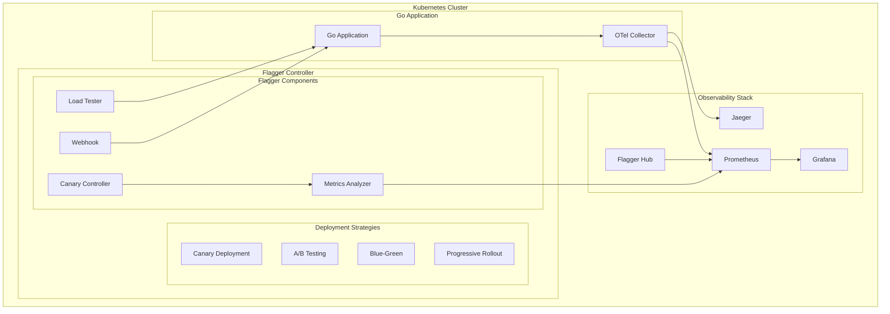

# Flagger 与 OTLP 完整集成指南 2025版

## 概述

Flagger 是一个基于 Kubernetes 的渐进式交付工具，支持金丝雀部署、A/B 测试、蓝绿部署等高级部署策略。本指南详细介绍如何在 Go 1.25.1 应用中集成 Flagger 与 OpenTelemetry Protocol (OTLP)，实现部署级别的可观测性和监控。

## 目录

- [架构概述](#架构概述)
- [快速开始](#快速开始)
- [Flagger 部署策略配置](#flagger-部署策略配置)
- [Go 应用 OTLP 集成](#go-应用-otlp-集成)
- [部署可观测性](#部署可观测性)
- [金丝雀部署监控](#金丝雀部署监控)
- [性能优化](#性能优化)
- [生产部署](#生产部署)
- [最佳实践](#最佳实践)

## 架构概述

### Flagger 架构组件



### 核心特性

- **渐进式交付**: 支持金丝雀部署、A/B 测试、蓝绿部署
- **自动回滚**: 基于指标自动回滚
- **负载测试**: 集成负载测试
- **Webhook 支持**: 支持自定义 Webhook
- **多指标分析**: 支持多个指标分析
- **可观测性**: 部署级别的可观测性

## 快速开始

### 1. 安装 Flagger

```bash
# 安装 Flagger CLI
curl -s https://raw.githubusercontent.com/fluxcd/flagger/main/install.sh | bash

# 安装 Flagger 到集群
kubectl apply -f https://raw.githubusercontent.com/fluxcd/flagger/main/artifacts/flagger/crds/bases/flagger.apps.toolkit.fluxcd.io_canaries.yaml
kubectl apply -f https://raw.githubusercontent.com/fluxcd/flagger/main/artifacts/flagger/crds/bases/flagger.apps.toolkit.fluxcd.io_metrictemplates.yaml
kubectl apply -f https://raw.githubusercontent.com/fluxcd/flagger/main/artifacts/flagger/crds/bases/flagger.apps.toolkit.fluxcd.io_alertproviders.yaml

# 部署 Flagger
kubectl apply -f https://raw.githubusercontent.com/fluxcd/flagger/main/artifacts/flagger/deployments/flagger.yaml

# 验证安装
kubectl get pods -n flagger-system
```

### 2. 启用 Flagger 可观测性

```bash
# 启用 Prometheus 指标
kubectl apply -f https://raw.githubusercontent.com/fluxcd/flagger/main/artifacts/flagger/deployments/flagger-prometheus.yaml

# 启用 Grafana 仪表板
kubectl apply -f https://raw.githubusercontent.com/fluxcd/flagger/main/artifacts/flagger/deployments/flagger-grafana.yaml

# 验证 Flagger 状态
kubectl get canaries -A
```

### 3. 部署 OTel Collector

```yaml
# otel-collector.yaml
apiVersion: v1
kind: ConfigMap
metadata:
  name: otel-collector-config
  namespace: flagger-system
data:
  otel-collector.yaml: |
    receivers:
      otlp:
        protocols:
          grpc:
            endpoint: 0.0.0.0:4317
          http:
            endpoint: 0.0.0.0:4318
      jaeger:
        protocols:
          grpc:
            endpoint: 0.0.0.0:14250
          thrift_http:
            endpoint: 0.0.0.0:14268
          thrift_compact:
            endpoint: 0.0.0.0:6831
          thrift_binary:
            endpoint: 0.0.0.0:6832
      prometheus:
        config:
          scrape_configs:
            - job_name: 'flagger'
              kubernetes_sd_configs:
                - role: endpoints
                  namespaces:
                    names:
                      - flagger-system
              relabel_configs:
                - source_labels: [__meta_kubernetes_service_annotation_prometheus_io_scrape]
                  action: keep
                  regex: true
                - source_labels: [__meta_kubernetes_service_annotation_prometheus_io_path]
                  action: replace
                  target_label: __metrics_path__
                  regex: (.+)
                - source_labels: [__address__, __meta_kubernetes_service_annotation_prometheus_io_port]
                  action: replace
                  regex: ([^:]+)(?::\d+)?;(\d+)
                  replacement: $1:$2
                  target_label: __address__
                - action: labelmap
                  regex: __meta_kubernetes_service_label_(.+)
                - source_labels: [__meta_kubernetes_namespace]
                  action: replace
                  target_label: kubernetes_namespace
                - source_labels: [__meta_kubernetes_service_name]
                  action: replace
                  target_label: kubernetes_name

    processors:
      batch:
        timeout: 1s
        send_batch_size: 1024
      memory_limiter:
        limit_mib: 512
      resource:
        attributes:
          - key: service.name
            value: "flagger-mesh"
            action: upsert

    exporters:
      jaeger:
        endpoint: jaeger-collector:14250
        tls:
          insecure: true
      prometheus:
        endpoint: "0.0.0.0:8889"
        namespace: "flagger_otel"
        const_labels:
          mesh: "flagger"

    service:
      pipelines:
        traces:
          receivers: [otlp, jaeger]
          processors: [memory_limiter, resource, batch]
          exporters: [jaeger]
        metrics:
          receivers: [otlp, prometheus]
          processors: [memory_limiter, resource, batch]
          exporters: [prometheus]
---
apiVersion: apps/v1
kind: Deployment
metadata:
  name: otel-collector
  namespace: flagger-system
spec:
  replicas: 1
  selector:
    matchLabels:
      app: otel-collector
  template:
    metadata:
      labels:
        app: otel-collector
    spec:
      containers:
      - name: otel-collector
        image: otel/opentelemetry-collector-contrib:0.95.0
        args:
          - --config=/etc/otel-collector.yaml
        ports:
        - containerPort: 4317
        - containerPort: 4318
        - containerPort: 14250
        - containerPort: 14268
        - containerPort: 6831
        - containerPort: 6832
        - containerPort: 8889
        volumeMounts:
        - name: config
          mountPath: /etc/otel-collector.yaml
          subPath: otel-collector.yaml
        resources:
          requests:
            memory: "256Mi"
            cpu: "100m"
          limits:
            memory: "512Mi"
            cpu: "500m"
      volumes:
      - name: config
        configMap:
          name: otel-collector-config
---
apiVersion: v1
kind: Service
metadata:
  name: otel-collector
  namespace: flagger-system
spec:
  selector:
    app: otel-collector
  ports:
  - name: otlp-grpc
    port: 4317
    targetPort: 4317
  - name: otlp-http
    port: 8080
    targetPort: 4318
  - name: jaeger-grpc
    port: 14250
    targetPort: 14250
  - name: jaeger-http
    port: 14268
    targetPort: 14268
  - name: prometheus
    port: 8889
    targetPort: 8889
```

## Flagger 部署策略配置

### 1. 金丝雀部署配置

```yaml
# canary-deployment.yaml
apiVersion: flagger.apps.toolkit.fluxcd.io/v1beta1
kind: Canary
metadata:
  name: go-app-canary
  namespace: default
spec:
  targetRef:
    apiVersion: apps/v1
    kind: Deployment
    name: go-app
  service:
    port: 8080
    targetPort: 8080
    portDiscovery: true
  analysis:
    interval: 30s
    threshold: 5
    maxWeight: 50
    stepWeight: 10
    metrics:
    - name: request-success-rate
      thresholdRange:
        min: 99
      interval: 1m
    - name: request-duration
      thresholdRange:
        max: 500
      interval: 1m
    - name: error-rate
      thresholdRange:
        max: 1
      interval: 1m
    webhooks:
    - name: load-test
      url: http://flagger-loadtester.flagger-system/
      timeout: 5s
      metadata:
        cmd: "hey -z 1m -q 10 -c 2 http://go-app-canary.default:8080/"
    - name: pre-rollout-check
      type: pre-rollout
      url: http://flagger-loadtester.flagger-system/
      timeout: 5s
      metadata:
        cmd: "hey -z 10s -q 5 -c 2 http://go-app-primary.default:8080/"
    - name: post-rollout-check
      type: post-rollout
      url: http://flagger-loadtester.flagger-system/
      timeout: 5s
      metadata:
        cmd: "hey -z 10s -q 5 -c 2 http://go-app-primary.default:8080/"
```

### 2. A/B 测试配置

```yaml
# ab-test-deployment.yaml
apiVersion: flagger.apps.toolkit.fluxcd.io/v1beta1
kind: Canary
metadata:
  name: go-app-ab-test
  namespace: default
spec:
  targetRef:
    apiVersion: apps/v1
    kind: Deployment
    name: go-app
  service:
    port: 8080
    targetPort: 8080
    portDiscovery: true
  analysis:
    interval: 30s
    threshold: 5
    maxWeight: 50
    stepWeight: 10
    match:
    - headers:
        x-user-type:
          exact: "premium"
    metrics:
    - name: request-success-rate
      thresholdRange:
        min: 99
      interval: 1m
    - name: request-duration
      thresholdRange:
        max: 500
      interval: 1m
    - name: conversion-rate
      thresholdRange:
        min: 5
      interval: 1m
    webhooks:
    - name: load-test
      url: http://flagger-loadtester.flagger-system/
      timeout: 5s
      metadata:
        cmd: "hey -z 1m -q 10 -c 2 -H 'x-user-type: premium' http://go-app-ab-test.default:8080/"
```

### 3. 蓝绿部署配置

```yaml
# blue-green-deployment.yaml
apiVersion: flagger.apps.toolkit.fluxcd.io/v1beta1
kind: Canary
metadata:
  name: go-app-blue-green
  namespace: default
spec:
  targetRef:
    apiVersion: apps/v1
    kind: Deployment
    name: go-app
  service:
    port: 8080
    targetPort: 8080
    portDiscovery: true
  analysis:
    interval: 30s
    threshold: 5
    maxWeight: 50
    stepWeight: 10
    metrics:
    - name: request-success-rate
      thresholdRange:
        min: 99
      interval: 1m
    - name: request-duration
      thresholdRange:
        max: 500
      interval: 1m
    - name: error-rate
      thresholdRange:
        max: 1
      interval: 1m
    webhooks:
    - name: load-test
      url: http://flagger-loadtester.flagger-system/
      timeout: 5s
      metadata:
        cmd: "hey -z 1m -q 10 -c 2 http://go-app-blue-green.default:8080/"
```

## Go 应用 OTLP 集成

### 1. 基础 Go 应用示例

```go
// main.go
package main

import (
    "context"
    "fmt"
    "log"
    "net/http"
    "time"

    "go.opentelemetry.io/otel"
    "go.opentelemetry.io/otel/attribute"
    "go.opentelemetry.io/otel/exporters/otlp/otlptrace/otlptracegrpc"
    "go.opentelemetry.io/otel/propagation"
    "go.opentelemetry.io/otel/sdk/resource"
    sdktrace "go.opentelemetry.io/otel/sdk/trace"
    "go.opentelemetry.io/otel/trace"
    semconv "go.opentelemetry.io/otel/semconv/v1.24.0"
)

func main() {
    // 初始化 OpenTelemetry
    ctx := context.Background()
    tp, err := initTracer(ctx)
    if err != nil {
        log.Fatal(err)
    }
    defer tp.Shutdown(ctx)

    // 设置 HTTP 路由
    http.HandleFunc("/", homeHandler)
    http.HandleFunc("/api/users", usersHandler)
    http.HandleFunc("/api/orders", ordersHandler)
    http.HandleFunc("/health", healthHandler)

    log.Println("Server starting on :8080")
    log.Fatal(http.ListenAndServe(":8080", nil))
}

func initTracer(ctx context.Context) (*sdktrace.TracerProvider, error) {
    // 创建资源
    res, err := resource.New(ctx,
        resource.WithAttributes(
            semconv.ServiceName("go-flagger-app"),
            semconv.ServiceVersion("1.0.0"),
            semconv.DeploymentEnvironment("production"),
            attribute.String("mesh", "flagger"),
            attribute.String("deployment", "canary"),
        ),
    )
    if err != nil {
        return nil, err
    }

    // 创建 OTLP 导出器
    exporter, err := otlptracegrpc.New(ctx,
        otlptracegrpc.WithEndpoint("otel-collector.flagger-system.svc.cluster.local:4317"),
        otlptracegrpc.WithInsecure(),
    )
    if err != nil {
        return nil, err
    }

    // 创建 TracerProvider
    tp := sdktrace.NewTracerProvider(
        sdktrace.WithBatcher(exporter),
        sdktrace.WithResource(res),
        sdktrace.WithSampler(sdktrace.TraceIDRatioBased(0.1)),
    )

    // 设置全局 TracerProvider
    otel.SetTracerProvider(tp)
    otel.SetTextMapPropagator(propagation.NewCompositeTextMapPropagator(
        propagation.TraceContext{},
        propagation.Baggage{},
    ))

    return tp, nil
}

func homeHandler(w http.ResponseWriter, r *http.Request) {
    ctx := r.Context()
    tracer := otel.Tracer("go-flagger-app")
    
    ctx, span := tracer.Start(ctx, "home-handler")
    defer span.End()

    span.SetAttributes(
        attribute.String("http.method", r.Method),
        attribute.String("http.url", r.URL.String()),
        attribute.String("http.user_agent", r.UserAgent()),
        attribute.String("mesh", "flagger"),
        attribute.String("deployment", "canary"),
    )

    // 模拟业务逻辑
    time.Sleep(10 * time.Millisecond)
    
    w.WriteHeader(http.StatusOK)
    fmt.Fprintf(w, "Hello from Go app with Flagger!")
}

func usersHandler(w http.ResponseWriter, r *http.Request) {
    ctx := r.Context()
    tracer := otel.Tracer("go-flagger-app")
    
    ctx, span := tracer.Start(ctx, "users-handler")
    defer span.End()

    span.SetAttributes(
        attribute.String("http.method", r.Method),
        attribute.String("http.url", r.URL.String()),
        attribute.String("service", "user-service"),
        attribute.String("mesh", "flagger"),
        attribute.String("deployment", "canary"),
    )

    // 调用其他服务
    if err := callUserService(ctx); err != nil {
        span.RecordError(err)
        http.Error(w, "Internal Server Error", http.StatusInternalServerError)
        return
    }

    w.WriteHeader(http.StatusOK)
    fmt.Fprintf(w, `{"users": [{"id": 1, "name": "Alice"}, {"id": 2, "name": "Bob"}]}`)
}

func ordersHandler(w http.ResponseWriter, r *http.Request) {
    ctx := r.Context()
    tracer := otel.Tracer("go-flagger-app")
    
    ctx, span := tracer.Start(ctx, "orders-handler")
    defer span.End()

    span.SetAttributes(
        attribute.String("http.method", r.Method),
        attribute.String("http.url", r.URL.String()),
        attribute.String("service", "order-service"),
        attribute.String("mesh", "flagger"),
        attribute.String("deployment", "canary"),
    )

    // 调用订单服务
    if err := callOrderService(ctx); err != nil {
        span.RecordError(err)
        http.Error(w, "Internal Server Error", http.StatusInternalServerError)
        return
    }

    w.WriteHeader(http.StatusOK)
    fmt.Fprintf(w, `{"orders": [{"id": 1, "amount": 100.0}, {"id": 2, "amount": 200.0}]}`)
}

func healthHandler(w http.ResponseWriter, r *http.Request) {
    w.WriteHeader(http.StatusOK)
    fmt.Fprintf(w, `{"status": "healthy", "timestamp": "%s"}`, time.Now().Format(time.RFC3339))
}

func callUserService(ctx context.Context) error {
    tracer := otel.Tracer("go-flagger-app")
    ctx, span := tracer.Start(ctx, "call-user-service")
    defer span.End()

    span.SetAttributes(
        attribute.String("service.name", "user-service"),
        attribute.String("service.version", "1.0.0"),
        attribute.String("mesh", "flagger"),
        attribute.String("deployment", "canary"),
    )

    // 模拟 HTTP 调用
    client := &http.Client{
        Timeout: 5 * time.Second,
    }

    req, err := http.NewRequestWithContext(ctx, "GET", "http://user-service:8080/api/users", nil)
    if err != nil {
        return err
    }

    resp, err := client.Do(req)
    if err != nil {
        return err
    }
    defer resp.Body.Close()

    span.SetAttributes(
        attribute.Int("http.status_code", resp.StatusCode),
    )

    return nil
}

func callOrderService(ctx context.Context) error {
    tracer := otel.Tracer("go-flagger-app")
    ctx, span := tracer.Start(ctx, "call-order-service")
    defer span.End()

    span.SetAttributes(
        attribute.String("service.name", "order-service"),
        attribute.String("service.version", "1.0.0"),
        attribute.String("mesh", "flagger"),
        attribute.String("deployment", "canary"),
    )

    // 模拟 HTTP 调用
    client := &http.Client{
        Timeout: 5 * time.Second,
    }

    req, err := http.NewRequestWithContext(ctx, "GET", "http://order-service:8080/api/orders", nil)
    if err != nil {
        return err
    }

    resp, err := client.Do(req)
    if err != nil {
        return err
    }
    defer resp.Body.Close()

    span.SetAttributes(
        attribute.Int("http.status_code", resp.StatusCode),
    )

    return nil
}
```

### 2. 高级中间件集成

```go
// middleware.go
package main

import (
    "context"
    "fmt"
    "net/http"
    "strconv"
    "time"

    "go.opentelemetry.io/otel"
    "go.opentelemetry.io/otel/attribute"
    "go.opentelemetry.io/otel/metric"
    "go.opentelemetry.io/otel/trace"
    semconv "go.opentelemetry.io/otel/semconv/v1.24.0"
)

type FlaggerTracingMiddleware struct {
    tracer   trace.Tracer
    meter    metric.Meter
    requests metric.Int64Counter
    duration metric.Float64Histogram
    errors   metric.Int64Counter
}

func NewFlaggerTracingMiddleware() *FlaggerTracingMiddleware {
    tracer := otel.Tracer("go-flagger-app")
    meter := otel.Meter("go-flagger-app")

    requests, _ := meter.Int64Counter(
        "flagger_http_requests_total",
        metric.WithDescription("Total number of HTTP requests through Flagger"),
    )

    duration, _ := meter.Float64Histogram(
        "flagger_http_request_duration_seconds",
        metric.WithDescription("HTTP request duration in seconds through Flagger"),
    )

    errors, _ := meter.Int64Counter(
        "flagger_http_errors_total",
        metric.WithDescription("Total number of HTTP errors through Flagger"),
    )

    return &FlaggerTracingMiddleware{
        tracer:   tracer,
        meter:    meter,
        requests: requests,
        duration: duration,
        errors:   errors,
    }
}

func (ftm *FlaggerTracingMiddleware) Handler(next http.Handler) http.Handler {
    return http.HandlerFunc(func(w http.ResponseWriter, r *http.Request) {
        start := time.Now()
        ctx := r.Context()

        // 创建 span
        ctx, span := ftm.tracer.Start(ctx, "flagger-http-request",
            trace.WithAttributes(
                semconv.HTTPMethod(r.Method),
                semconv.HTTPURL(r.URL.String()),
                semconv.HTTPUserAgent(r.UserAgent()),
                semconv.HTTPRequestContentLength(r.ContentLength),
                attribute.String("mesh", "flagger"),
                attribute.String("deployment", "canary"),
            ),
        )
        defer span.End()

        // 包装 ResponseWriter 以捕获状态码
        ww := &responseWriter{ResponseWriter: w, statusCode: http.StatusOK}

        // 调用下一个处理器
        next.ServeHTTP(ww, r.WithContext(ctx))

        // 记录指标
        duration := time.Since(start).Seconds()
        statusCode := ww.statusCode

        ftm.requests.Add(ctx, 1,
            metric.WithAttributes(
                attribute.String("method", r.Method),
                attribute.String("path", r.URL.Path),
                attribute.Int("status_code", statusCode),
                attribute.String("mesh", "flagger"),
                attribute.String("deployment", "canary"),
            ),
        )

        ftm.duration.Record(ctx, duration,
            metric.WithAttributes(
                attribute.String("method", r.Method),
                attribute.String("path", r.URL.Path),
                attribute.Int("status_code", statusCode),
                attribute.String("mesh", "flagger"),
                attribute.String("deployment", "canary"),
            ),
        )

        // 记录错误
        if statusCode >= 400 {
            ftm.errors.Add(ctx, 1,
                metric.WithAttributes(
                    attribute.String("method", r.Method),
                    attribute.String("path", r.URL.Path),
                    attribute.Int("status_code", statusCode),
                    attribute.String("mesh", "flagger"),
                    attribute.String("deployment", "canary"),
                ),
            )
            span.RecordError(fmt.Errorf("HTTP %d", statusCode))
        }

        // 更新 span 属性
        span.SetAttributes(
            semconv.HTTPStatusCode(statusCode),
            semconv.HTTPResponseContentLength(ww.contentLength),
            attribute.Float64("http.request.duration", duration),
            attribute.String("mesh", "flagger"),
            attribute.String("deployment", "canary"),
        )
    })
}

type responseWriter struct {
    http.ResponseWriter
    statusCode    int
    contentLength int64
}

func (rw *responseWriter) WriteHeader(code int) {
    rw.statusCode = code
    rw.ResponseWriter.WriteHeader(code)
}

func (rw *responseWriter) Write(b []byte) (int, error) {
    n, err := rw.ResponseWriter.Write(b)
    rw.contentLength += int64(n)
    return n, err
}
```

### 3. gRPC 服务集成

```go
// grpc_server.go
package main

import (
    "context"
    "log"
    "net"
    "time"

    "go.opentelemetry.io/otel"
    "go.opentelemetry.io/otel/attribute"
    "go.opentelemetry.io/otel/codes"
    "go.opentelemetry.io/otel/trace"
    "google.golang.org/grpc"
    "google.golang.org/grpc/codes"
    "google.golang.org/grpc/status"
)

type UserService struct {
    UnimplementedUserServiceServer
    tracer trace.Tracer
}

func NewUserService() *UserService {
    return &UserService{
        tracer: otel.Tracer("user-service"),
    }
}

func (s *UserService) GetUser(ctx context.Context, req *GetUserRequest) (*GetUserResponse, error) {
    ctx, span := s.tracer.Start(ctx, "GetUser")
    defer span.End()

    span.SetAttributes(
        attribute.String("user.id", req.Id),
        attribute.String("service.name", "user-service"),
        attribute.String("mesh", "flagger"),
        attribute.String("deployment", "canary"),
    )

    // 模拟数据库查询
    user, err := s.findUser(ctx, req.Id)
    if err != nil {
        span.RecordError(err)
        span.SetStatus(codes.Error, err.Error())
        return nil, status.Errorf(codes.NotFound, "User not found: %v", err)
    }

    span.SetAttributes(
        attribute.String("user.name", user.Name),
        attribute.String("user.email", user.Email),
    )

    return &GetUserResponse{
        Id:    user.Id,
        Name:  user.Name,
        Email: user.Email,
    }, nil
}

func (s *UserService) findUser(ctx context.Context, id string) (*User, error) {
    ctx, span := s.tracer.Start(ctx, "findUser")
    defer span.End()

    span.SetAttributes(
        attribute.String("db.operation", "select"),
        attribute.String("db.table", "users"),
        attribute.String("mesh", "flagger"),
        attribute.String("deployment", "canary"),
    )

    // 模拟数据库查询
    time.Sleep(10 * time.Millisecond)

    return &User{
        Id:    id,
        Name:  "Alice",
        Email: "alice@example.com",
    }, nil
}

func main() {
    lis, err := net.Listen("tcp", ":9090")
    if err != nil {
        log.Fatalf("Failed to listen: %v", err)
    }

    s := grpc.NewServer()
    RegisterUserServiceServer(s, NewUserService())

    log.Println("gRPC server starting on :9090")
    if err := s.Serve(lis); err != nil {
        log.Fatalf("Failed to serve: %v", err)
    }
}
```

## 部署可观测性

### 1. Flagger 指标集成

```go
// metrics.go
package main

import (
    "context"
    "time"

    "go.opentelemetry.io/otel"
    "go.opentelemetry.io/otel/attribute"
    "go.opentelemetry.io/otel/metric"
)

type FlaggerMetricsCollector struct {
    meter              metric.Meter
    requestCounter     metric.Int64Counter
    requestDuration    metric.Float64Histogram
    activeConnections  metric.Int64UpDownCounter
    errorCounter       metric.Int64Counter
    deploymentStatus   metric.Int64Counter
    canaryWeight       metric.Int64Gauge
}

func NewFlaggerMetricsCollector() *FlaggerMetricsCollector {
    meter := otel.Meter("go-flagger-app")

    requestCounter, _ := meter.Int64Counter(
        "flagger_http_requests_total",
        metric.WithDescription("Total number of HTTP requests through Flagger"),
    )

    requestDuration, _ := meter.Float64Histogram(
        "flagger_http_request_duration_seconds",
        metric.WithDescription("HTTP request duration in seconds through Flagger"),
    )

    activeConnections, _ := meter.Int64UpDownCounter(
        "flagger_active_connections",
        metric.WithDescription("Number of active connections through Flagger"),
    )

    errorCounter, _ := meter.Int64Counter(
        "flagger_errors_total",
        metric.WithDescription("Total number of errors through Flagger"),
    )

    deploymentStatus, _ := meter.Int64Counter(
        "flagger_deployment_status",
        metric.WithDescription("Deployment status through Flagger"),
    )

    canaryWeight, _ := meter.Int64Gauge(
        "flagger_canary_weight",
        metric.WithDescription("Canary weight percentage"),
    )

    return &FlaggerMetricsCollector{
        meter:             meter,
        requestCounter:    requestCounter,
        requestDuration:   requestDuration,
        activeConnections: activeConnections,
        errorCounter:      errorCounter,
        deploymentStatus:  deploymentStatus,
        canaryWeight:      canaryWeight,
    }
}

func (fmc *FlaggerMetricsCollector) RecordRequest(ctx context.Context, method, path string, statusCode int, duration time.Duration) {
    fmc.requestCounter.Add(ctx, 1,
        metric.WithAttributes(
            attribute.String("method", method),
            attribute.String("path", path),
            attribute.Int("status_code", statusCode),
            attribute.String("mesh", "flagger"),
            attribute.String("deployment", "canary"),
        ),
    )

    fmc.requestDuration.Record(ctx, duration.Seconds(),
        metric.WithAttributes(
            attribute.String("method", method),
            attribute.String("path", path),
            attribute.Int("status_code", statusCode),
            attribute.String("mesh", "flagger"),
            attribute.String("deployment", "canary"),
        ),
    )
}

func (fmc *FlaggerMetricsCollector) RecordError(ctx context.Context, errorType string) {
    fmc.errorCounter.Add(ctx, 1,
        metric.WithAttributes(
            attribute.String("error_type", errorType),
            attribute.String("mesh", "flagger"),
            attribute.String("deployment", "canary"),
        ),
    )
}

func (fmc *FlaggerMetricsCollector) RecordDeploymentStatus(ctx context.Context, status string) {
    fmc.deploymentStatus.Add(ctx, 1,
        metric.WithAttributes(
            attribute.String("status", status),
            attribute.String("mesh", "flagger"),
            attribute.String("deployment", "canary"),
        ),
    )
}

func (fmc *FlaggerMetricsCollector) RecordCanaryWeight(ctx context.Context, weight int64) {
    fmc.canaryWeight.Record(ctx, weight,
        metric.WithAttributes(
            attribute.String("mesh", "flagger"),
            attribute.String("deployment", "canary"),
        ),
    )
}

func (fmc *FlaggerMetricsCollector) IncrementConnections(ctx context.Context) {
    fmc.activeConnections.Add(ctx, 1,
        metric.WithAttributes(
            attribute.String("mesh", "flagger"),
            attribute.String("deployment", "canary"),
        ),
    )
}

func (fmc *FlaggerMetricsCollector) DecrementConnections(ctx context.Context) {
    fmc.activeConnections.Add(ctx, -1,
        metric.WithAttributes(
            attribute.String("mesh", "flagger"),
            attribute.String("deployment", "canary"),
        ),
    )
}
```

### 2. Grafana 仪表板配置

```json
{
  "dashboard": {
    "title": "Flagger + OTLP Go App Dashboard",
    "panels": [
      {
        "title": "Request Rate",
        "type": "graph",
        "targets": [
          {
            "expr": "rate(flagger_http_requests_total[5m])",
            "legendFormat": "{{method}} {{path}}"
          }
        ]
      },
      {
        "title": "Request Duration",
        "type": "graph",
        "targets": [
          {
            "expr": "histogram_quantile(0.95, rate(flagger_http_request_duration_seconds_bucket[5m]))",
            "legendFormat": "95th percentile"
          },
          {
            "expr": "histogram_quantile(0.50, rate(flagger_http_request_duration_seconds_bucket[5m]))",
            "legendFormat": "50th percentile"
          }
        ]
      },
      {
        "title": "Error Rate",
        "type": "graph",
        "targets": [
          {
            "expr": "rate(flagger_errors_total[5m])",
            "legendFormat": "{{error_type}}"
          }
        ]
      },
      {
        "title": "Active Connections",
        "type": "graph",
        "targets": [
          {
            "expr": "flagger_active_connections",
            "legendFormat": "Active Connections"
          }
        ]
      },
      {
        "title": "Deployment Status",
        "type": "graph",
        "targets": [
          {
            "expr": "rate(flagger_deployment_status[5m])",
            "legendFormat": "{{status}}"
          }
        ]
      },
      {
        "title": "Canary Weight",
        "type": "graph",
        "targets": [
          {
            "expr": "flagger_canary_weight",
            "legendFormat": "Canary Weight %"
          }
        ]
      }
    ]
  }
}
```

### 3. Jaeger 追踪查询

```go
// jaeger-query.go
package main

import (
    "context"
    "fmt"
    "time"

    "github.com/jaegertracing/jaeger-client-go"
    "github.com/jaegertracing/jaeger-client-go/config"
)

func initJaegerClient() (jaeger.Tracer, error) {
    cfg := config.Configuration{
        ServiceName: "go-flagger-app",
        Sampler: &config.SamplerConfig{
            Type:  "probabilistic",
            Param: 0.1,
        },
        Reporter: &config.ReporterConfig{
            LogSpans:            true,
            BufferFlushInterval: 1 * time.Second,
            LocalAgentHostPort:  "jaeger-agent:6831",
        },
    }

    tracer, _, err := cfg.NewTracer()
    if err != nil {
        return nil, err
    }

    return tracer, nil
}

func queryTraces(ctx context.Context, serviceName string, startTime, endTime time.Time) error {
    // 这里可以使用 Jaeger Query API 查询追踪数据
    // 实际实现需要调用 Jaeger Query Service
    
    fmt.Printf("Querying traces for service: %s\n", serviceName)
    fmt.Printf("Time range: %s to %s\n", startTime.Format(time.RFC3339), endTime.Format(time.RFC3339))
    
    return nil
}
```

## 金丝雀部署监控

### 1. 金丝雀部署指标

```yaml
# canary-metrics.yaml
apiVersion: flagger.apps.toolkit.fluxcd.io/v1beta1
kind: MetricTemplate
metadata:
  name: canary-metrics
  namespace: default
spec:
  provider:
    type: prometheus
    address: http://prometheus:9090
  query: |
    sum(rate(flagger_http_requests_total{mesh="flagger",deployment="canary"}[1m]))
---
apiVersion: flagger.apps.toolkit.fluxcd.io/v1beta1
kind: MetricTemplate
metadata:
  name: canary-error-rate
  namespace: default
spec:
  provider:
    type: prometheus
    address: http://prometheus:9090
  query: |
    sum(rate(flagger_errors_total{mesh="flagger",deployment="canary"}[1m])) / sum(rate(flagger_http_requests_total{mesh="flagger",deployment="canary"}[1m]))
---
apiVersion: flagger.apps.toolkit.fluxcd.io/v1beta1
kind: MetricTemplate
metadata:
  name: canary-duration
  namespace: default
spec:
  provider:
    type: prometheus
    address: http://prometheus:9090
  query: |
    histogram_quantile(0.95, rate(flagger_http_request_duration_seconds_bucket{mesh="flagger",deployment="canary"}[1m]))
```

### 2. 金丝雀部署告警

```yaml
# canary-alerts.yaml
apiVersion: flagger.apps.toolkit.fluxcd.io/v1beta1
kind: AlertProvider
metadata:
  name: canary-alerts
  namespace: default
spec:
  type: slack
  channel: "#alerts"
  webhook: https://hooks.slack.com/services/YOUR/SLACK/WEBHOOK
---
apiVersion: flagger.apps.toolkit.fluxcd.io/v1beta1
kind: Canary
metadata:
  name: go-app-canary-alerts
  namespace: default
spec:
  targetRef:
    apiVersion: apps/v1
    kind: Deployment
    name: go-app
  service:
    port: 8080
    targetPort: 8080
    portDiscovery: true
  analysis:
    interval: 30s
    threshold: 5
    maxWeight: 50
    stepWeight: 10
    metrics:
    - name: request-success-rate
      thresholdRange:
        min: 99
      interval: 1m
    - name: request-duration
      thresholdRange:
        max: 500
      interval: 1m
    - name: error-rate
      thresholdRange:
        max: 1
      interval: 1m
    alerts:
    - name: "canary-failed"
      severity: error
      providerRef:
        name: canary-alerts
    - name: "canary-promoted"
      severity: info
      providerRef:
        name: canary-alerts
    - name: "canary-rollback"
      severity: warning
      providerRef:
        name: canary-alerts
```

### 3. 金丝雀部署状态监控

```go
// canary_monitoring.go
package main

import (
    "context"
    "fmt"
    "time"

    "go.opentelemetry.io/otel"
    "go.opentelemetry.io/otel/attribute"
    "go.opentelemetry.io/otel/metric"
    "go.opentelemetry.io/otel/trace"
)

type CanaryMonitor struct {
    tracer         trace.Tracer
    meter          metric.Meter
    canaryWeight   metric.Int64Gauge
    deploymentStatus metric.Int64Counter
    rollbackCount  metric.Int64Counter
}

func NewCanaryMonitor() *CanaryMonitor {
    tracer := otel.Tracer("go-flagger-app")
    meter := otel.Meter("go-flagger-app")

    canaryWeight, _ := meter.Int64Gauge(
        "flagger_canary_weight",
        metric.WithDescription("Canary weight percentage"),
    )

    deploymentStatus, _ := meter.Int64Counter(
        "flagger_deployment_status",
        metric.WithDescription("Deployment status through Flagger"),
    )

    rollbackCount, _ := meter.Int64Counter(
        "flagger_rollback_count",
        metric.WithDescription("Number of rollbacks through Flagger"),
    )

    return &CanaryMonitor{
        tracer:         tracer,
        meter:          meter,
        canaryWeight:   canaryWeight,
        deploymentStatus: deploymentStatus,
        rollbackCount:  rollbackCount,
    }
}

func (cm *CanaryMonitor) MonitorCanary(ctx context.Context, canaryName string) error {
    ctx, span := cm.tracer.Start(ctx, "canary-monitor.MonitorCanary")
    defer span.End()

    span.SetAttributes(
        attribute.String("canary.name", canaryName),
        attribute.String("mesh", "flagger"),
        attribute.String("deployment", "canary"),
    )

    // 模拟监控金丝雀部署状态
    for {
        select {
        case <-ctx.Done():
            return ctx.Err()
        case <-time.After(30 * time.Second):
            // 检查金丝雀部署状态
            status, weight, err := cm.checkCanaryStatus(ctx, canaryName)
            if err != nil {
                span.RecordError(err)
                return err
            }

            // 记录指标
            cm.canaryWeight.Record(ctx, weight,
                metric.WithAttributes(
                    attribute.String("canary.name", canaryName),
                    attribute.String("mesh", "flagger"),
                    attribute.String("deployment", "canary"),
                ),
            )

            cm.deploymentStatus.Add(ctx, 1,
                metric.WithAttributes(
                    attribute.String("canary.name", canaryName),
                    attribute.String("status", status),
                    attribute.String("mesh", "flagger"),
                    attribute.String("deployment", "canary"),
                ),
            )

            // 检查是否需要回滚
            if status == "failed" {
                cm.rollbackCount.Add(ctx, 1,
                    metric.WithAttributes(
                        attribute.String("canary.name", canaryName),
                        attribute.String("mesh", "flagger"),
                        attribute.String("deployment", "canary"),
                    ),
                )
            }
        }
    }
}

func (cm *CanaryMonitor) checkCanaryStatus(ctx context.Context, canaryName string) (string, int64, error) {
    ctx, span := cm.tracer.Start(ctx, "canary-monitor.checkCanaryStatus")
    defer span.End()

    span.SetAttributes(
        attribute.String("canary.name", canaryName),
        attribute.String("mesh", "flagger"),
        attribute.String("deployment", "canary"),
    )

    // 模拟检查金丝雀部署状态
    // 实际实现需要调用 Flagger API 或 Kubernetes API
    
    return "running", 50, nil
}
```

## 性能优化

### 1. Flagger 性能优化

```yaml
# flagger-performance-config.yaml
apiVersion: v1
kind: ConfigMap
metadata:
  name: flagger-config
  namespace: flagger-system
data:
  config.yaml: |
    # Flagger 性能优化配置
    flagger:
      # 分析间隔
      analysis-interval: 30s
      # 最大权重
      max-weight: 50
      # 步进权重
      step-weight: 10
      # 阈值
      threshold: 5
      
      # 性能调优
      performance:
        # 并发分析数量
        concurrent-analysis: 10
        # 分析超时
        analysis-timeout: 5m
        # 指标查询超时
        metrics-query-timeout: 30s
        
      # 内存优化
      memory:
        # 最大内存使用量
        max-memory-usage: 512Mi
        # 内存清理间隔
        memory-cleanup-interval: 30s
        
      # CPU 优化
      cpu:
        # 最大 CPU 使用量
        max-cpu-usage: 1000m
        # CPU 清理间隔
        cpu-cleanup-interval: 30s
```

### 2. 部署性能优化

```yaml
# deployment-performance-config.yaml
apiVersion: v1
kind: ConfigMap
metadata:
  name: flagger-deployment-config
  namespace: flagger-system
data:
  deployment-config.yaml: |
    # 部署性能优化
    deployment:
      # 启用快速部署
      enable-fast-deployment: true
      # 启用并行部署
      enable-parallel-deployment: true
      # 启用增量部署
      enable-incremental-deployment: true
      
      # 部署策略配置
      strategy:
        # 金丝雀部署
        canary:
          # 最小权重
          min-weight: 5
          # 最大权重
          max-weight: 50
          # 步进权重
          step-weight: 10
          # 分析间隔
          analysis-interval: 30s
          
        # A/B 测试
        ab-test:
          # 最小权重
          min-weight: 10
          # 最大权重
          max-weight: 50
          # 步进权重
          step-weight: 10
          # 分析间隔
          analysis-interval: 30s
          
        # 蓝绿部署
        blue-green:
          # 切换超时
          switch-timeout: 5m
          # 预热时间
          warmup-time: 30s
```

### 3. 可观测性性能优化

```yaml
# observability-performance-config.yaml
apiVersion: v1
kind: ConfigMap
metadata:
  name: flagger-observability-config
  namespace: flagger-system
data:
  observability-config.yaml: |
    # 可观测性性能优化
    observability:
      # 追踪配置
      tracing:
        # 采样率
        sampling-rate: 0.1
        # 批量大小
        batch-size: 1000
        # 批量超时
        batch-timeout: 1s
        # 最大追踪条目数
        max-trace-entries: 100000
        
      # 指标配置
      metrics:
        # 指标收集间隔
        collection-interval: 15s
        # 指标保留时间
        retention-time: 24h
        # 最大指标条目数
        max-metric-entries: 1000000
        
      # 日志配置
      logging:
        # 日志级别
        log-level: "info"
        # 日志格式
        log-format: "json"
        # 日志保留时间
        retention-time: 7d
        # 最大日志条目数
        max-log-entries: 1000000
```

## 生产部署

### 1. Docker Compose 部署

```yaml
# docker-compose.yml
version: '3.8'

services:
  # Flagger Controller
  flagger-controller:
    image: ghcr.io/fluxcd/flagger:1.15.0
    ports:
      - "8080:8080"
    environment:
      - FLAGGER_LOG_LEVEL=info
    volumes:
      - ./flagger-config.yaml:/etc/flagger/config.yaml
    command: ["flagger", "--config-dir=/etc/flagger"]
    networks:
      - flagger-mesh

  # OTel Collector
  otel-collector:
    image: otel/opentelemetry-collector-contrib:0.95.0
    ports:
      - "4317:4317"
      - "4318:4318"
      - "14250:14250"
      - "14268:14268"
      - "8889:8889"
    volumes:
      - ./otel-collector.yaml:/etc/otel-collector.yaml
    command: ["--config=/etc/otel-collector.yaml"]
    networks:
      - flagger-mesh

  # Go 应用
  go-app:
    build: .
    ports:
      - "8080:8080"
    environment:
      - OTEL_EXPORTER_OTLP_ENDPOINT=http://otel-collector:4317
      - OTEL_SERVICE_NAME=go-flagger-app
      - OTEL_SERVICE_VERSION=1.0.0
    depends_on:
      - otel-collector
    networks:
      - flagger-mesh

  # Jaeger
  jaeger:
    image: jaegertracing/all-in-one:1.50
    ports:
      - "16686:16686"
      - "14250:14250"
    environment:
      - COLLECTOR_OTLP_ENABLED=true
    networks:
      - flagger-mesh

  # Prometheus
  prometheus:
    image: prom/prometheus:latest
    ports:
      - "9090:9090"
    volumes:
      - ./prometheus.yml:/etc/prometheus/prometheus.yml
    networks:
      - flagger-mesh

  # Grafana
  grafana:
    image: grafana/grafana:latest
    ports:
      - "3000:3000"
    environment:
      - GF_SECURITY_ADMIN_PASSWORD=admin
    volumes:
      - ./grafana-dashboards:/var/lib/grafana/dashboards
    networks:
      - flagger-mesh

networks:
  flagger-mesh:
    driver: bridge
```

### 2. Kubernetes 部署

```yaml
# k8s-deployment.yaml
apiVersion: apps/v1
kind: Deployment
metadata:
  name: go-flagger-app
  namespace: default
  labels:
    app: go-flagger-app
spec:
  replicas: 3
  selector:
    matchLabels:
      app: go-flagger-app
  template:
    metadata:
      labels:
        app: go-flagger-app
    spec:
      containers:
      - name: go-app
        image: go-flagger-app:latest
        ports:
        - containerPort: 8080
        env:
        - name: OTEL_EXPORTER_OTLP_ENDPOINT
          value: "http://otel-collector.flagger-system.svc.cluster.local:4317"
        - name: OTEL_SERVICE_NAME
          value: "go-flagger-app"
        - name: OTEL_SERVICE_VERSION
          value: "1.0.0"
        resources:
          requests:
            cpu: 100m
            memory: 128Mi
          limits:
            cpu: 500m
            memory: 512Mi
        livenessProbe:
          httpGet:
            path: /health
            port: 8080
          initialDelaySeconds: 30
          periodSeconds: 10
        readinessProbe:
          httpGet:
            path: /ready
            port: 8080
          initialDelaySeconds: 5
          periodSeconds: 5
---
apiVersion: v1
kind: Service
metadata:
  name: go-flagger-app
  namespace: default
  labels:
    app: go-flagger-app
spec:
  selector:
    app: go-flagger-app
  ports:
  - port: 8080
    targetPort: 8080
    name: http
  type: ClusterIP
---
apiVersion: flagger.apps.toolkit.fluxcd.io/v1beta1
kind: Canary
metadata:
  name: go-flagger-app-canary
  namespace: default
spec:
  targetRef:
    apiVersion: apps/v1
    kind: Deployment
    name: go-flagger-app
  service:
    port: 8080
    targetPort: 8080
    portDiscovery: true
  analysis:
    interval: 30s
    threshold: 5
    maxWeight: 50
    stepWeight: 10
    metrics:
    - name: request-success-rate
      thresholdRange:
        min: 99
      interval: 1m
    - name: request-duration
      thresholdRange:
        max: 500
      interval: 1m
    - name: error-rate
      thresholdRange:
        max: 1
      interval: 1m
    webhooks:
    - name: load-test
      url: http://flagger-loadtester.flagger-system/
      timeout: 5s
      metadata:
        cmd: "hey -z 1m -q 10 -c 2 http://go-flagger-app-canary.default:8080/"
---
apiVersion: autoscaling/v2
kind: HorizontalPodAutoscaler
metadata:
  name: go-flagger-app-hpa
  namespace: default
spec:
  scaleTargetRef:
    apiVersion: apps/v1
    kind: Deployment
    name: go-flagger-app
  minReplicas: 3
  maxReplicas: 10
  metrics:
  - type: Resource
    resource:
      name: cpu
      target:
        type: Utilization
        averageUtilization: 70
  - type: Resource
    resource:
      name: memory
      target:
        type: Utilization
        averageUtilization: 80
```

### 3. 监控和告警配置

```yaml
# monitoring.yaml
apiVersion: v1
kind: ConfigMap
metadata:
  name: flagger-monitoring-config
  namespace: flagger-system
data:
  prometheus.yml: |
    global:
      scrape_interval: 15s
      evaluation_interval: 15s

    rule_files:
      - "flagger-rules.yml"

    alerting:
      alertmanagers:
        - static_configs:
            - targets:
              - alertmanager:9093

    scrape_configs:
      - job_name: 'flagger'
        kubernetes_sd_configs:
          - role: endpoints
            namespaces:
              names:
                - flagger-system
        relabel_configs:
          - source_labels: [__meta_kubernetes_service_annotation_prometheus_io_scrape]
            action: keep
            regex: true
          - source_labels: [__meta_kubernetes_service_annotation_prometheus_io_path]
            action: replace
            target_label: __metrics_path__
            regex: (.+)
          - source_labels: [__address__, __meta_kubernetes_service_annotation_prometheus_io_port]
            action: replace
            regex: ([^:]+)(?::\d+)?;(\d+)
            replacement: $1:$2
            target_label: __address__
          - action: labelmap
            regex: __meta_kubernetes_service_label_(.+)
          - source_labels: [__meta_kubernetes_namespace]
            action: replace
            target_label: kubernetes_namespace
          - source_labels: [__meta_kubernetes_service_name]
            action: replace
            target_label: kubernetes_name

      - job_name: 'otel-collector'
        static_configs:
          - targets: ['otel-collector.flagger-system.svc.cluster.local:8889']

  flagger-rules.yml: |
    groups:
    - name: flagger.rules
      rules:
      - alert: HighErrorRate
        expr: rate(flagger_http_requests_total{status_code=~"5.."}[5m]) > 0.1
        for: 5m
        labels:
          severity: warning
        annotations:
          summary: "High error rate detected"
          description: "Error rate is {{ $value }} errors per second"

      - alert: HighLatency
        expr: histogram_quantile(0.95, rate(flagger_http_request_duration_seconds_bucket[5m])) > 1
        for: 5m
        labels:
          severity: warning
        annotations:
          summary: "High latency detected"
          description: "95th percentile latency is {{ $value }} seconds"

      - alert: LowThroughput
        expr: rate(flagger_http_requests_total[5m]) < 10
        for: 10m
        labels:
          severity: info
        annotations:
          summary: "Low throughput detected"
          description: "Request rate is {{ $value }} requests per second"

      - alert: CanaryDeploymentFailed
        expr: flagger_deployment_status{status="failed"} > 0
        for: 1m
        labels:
          severity: error
        annotations:
          summary: "Canary deployment failed"
          description: "Canary deployment has failed"

      - alert: CanaryRollback
        expr: increase(flagger_rollback_count[5m]) > 0
        for: 1m
        labels:
          severity: warning
        annotations:
          summary: "Canary rollback detected"
          description: "Canary deployment has been rolled back"
```

## 最佳实践

### 1. 部署策略最佳实践

```go
// deployment_best_practices.go
package main

import (
    "context"
    "fmt"
    "time"

    "go.opentelemetry.io/otel"
    "go.opentelemetry.io/otel/attribute"
    "go.opentelemetry.io/otel/codes"
    "go.opentelemetry.io/otel/trace"
)

// 1. 使用有意义的 span 名称
func meaningfulSpanName(ctx context.Context) {
    tracer := otel.Tracer("go-flagger-app")
    
    // 好的做法：描述性的 span 名称
    ctx, span := tracer.Start(ctx, "user-service.GetUser")
    defer span.End()
    
    // 避免：模糊的 span 名称
    // ctx, span := tracer.Start(ctx, "doSomething")
}

// 2. 添加有意义的属性
func addMeaningfulAttributes(ctx context.Context) {
    tracer := otel.Tracer("go-flagger-app")
    ctx, span := tracer.Start(ctx, "database.QueryUser")
    defer span.End()
    
    span.SetAttributes(
        attribute.String("db.operation", "SELECT"),
        attribute.String("db.table", "users"),
        attribute.String("db.query", "SELECT * FROM users WHERE id = ?"),
        attribute.String("user.id", "123"),
        attribute.String("service.name", "user-service"),
        attribute.String("mesh", "flagger"),
        attribute.String("deployment", "canary"),
    )
}

// 3. 正确处理错误
func handleErrorsProperly(ctx context.Context) error {
    tracer := otel.Tracer("go-flagger-app")
    ctx, span := tracer.Start(ctx, "external-api.Call")
    defer span.End()
    
    err := callExternalAPI()
    if err != nil {
        // 记录错误并设置状态
        span.RecordError(err)
        span.SetStatus(codes.Error, err.Error())
        
        // 添加错误相关的属性
        span.SetAttributes(
            attribute.String("error.type", "external_api_error"),
            attribute.Bool("error.retryable", true),
            attribute.String("mesh", "flagger"),
            attribute.String("deployment", "canary"),
        )
        
        return err
    }
    
    return nil
}

// 4. 使用适当的采样策略
func useAppropriateSampling(ctx context.Context) {
    tracer := otel.Tracer("go-flagger-app")
    
    // 对于关键业务操作，使用更高的采样率
    ctx, span := tracer.Start(ctx, "payment.ProcessPayment")
    defer span.End()
    
    span.SetAttributes(
        attribute.String("payment.amount", "100.00"),
        attribute.String("payment.currency", "USD"),
        attribute.String("payment.method", "credit_card"),
        attribute.String("mesh", "flagger"),
        attribute.String("deployment", "canary"),
    )
}

// 5. 避免过度追踪
func avoidOverTracing(ctx context.Context) {
    tracer := otel.Tracer("go-flagger-app")
    
    // 好的做法：追踪有意义的操作
    ctx, span := tracer.Start(ctx, "user-service.ValidateUser")
    defer span.End()
    
    // 避免：追踪每个函数调用
    // ctx, span := tracer.Start(ctx, "helper.FormatString")
    // defer span.End()
}

func callExternalAPI() error {
    // 模拟外部 API 调用
    time.Sleep(10 * time.Millisecond)
    return fmt.Errorf("external API timeout")
}
```

### 2. 金丝雀部署最佳实践

```go
// canary_best_practices.go
package main

import (
    "context"
    "sync"
    "time"

    "go.opentelemetry.io/otel"
    "go.opentelemetry.io/otel/attribute"
    "go.opentelemetry.io/otel/trace"
)

// 1. 金丝雀部署监控
type CanaryDeploymentMonitor struct {
    tracer         trace.Tracer
    canaryWeight   int64
    deploymentStatus string
    mutex         sync.RWMutex
}

func NewCanaryDeploymentMonitor() *CanaryDeploymentMonitor {
    return &CanaryDeploymentMonitor{
        tracer:         otel.Tracer("go-flagger-app"),
        canaryWeight:   0,
        deploymentStatus: "initializing",
    }
}

func (cdm *CanaryDeploymentMonitor) MonitorDeployment(ctx context.Context, canaryName string) error {
    ctx, span := cdm.tracer.Start(ctx, "canary-monitor.MonitorDeployment")
    defer span.End()
    
    span.SetAttributes(
        attribute.String("canary.name", canaryName),
        attribute.String("mesh", "flagger"),
        attribute.String("deployment", "canary"),
    )
    
    // 监控金丝雀部署状态
    for {
        select {
        case <-ctx.Done():
            return ctx.Err()
        case <-time.After(30 * time.Second):
            status, weight, err := cdm.checkDeploymentStatus(ctx, canaryName)
            if err != nil {
                span.RecordError(err)
                return err
            }
            
            cdm.mutex.Lock()
            cdm.canaryWeight = weight
            cdm.deploymentStatus = status
            cdm.mutex.Unlock()
            
            span.SetAttributes(
                attribute.Int64("canary.weight", weight),
                attribute.String("deployment.status", status),
            )
        }
    }
}

func (cdm *CanaryDeploymentMonitor) checkDeploymentStatus(ctx context.Context, canaryName string) (string, int64, error) {
    ctx, span := cdm.tracer.Start(ctx, "canary-monitor.checkDeploymentStatus")
    defer span.End()
    
    span.SetAttributes(
        attribute.String("canary.name", canaryName),
        attribute.String("mesh", "flagger"),
        attribute.String("deployment", "canary"),
    )
    
    // 模拟检查部署状态
    return "running", 50, nil
}

// 2. 金丝雀部署回滚
type CanaryRollbackManager struct {
    tracer trace.Tracer
    mutex  sync.RWMutex
}

func NewCanaryRollbackManager() *CanaryRollbackManager {
    return &CanaryRollbackManager{
        tracer: otel.Tracer("go-flagger-app"),
    }
}

func (crm *CanaryRollbackManager) RollbackDeployment(ctx context.Context, canaryName string, reason string) error {
    ctx, span := crm.tracer.Start(ctx, "canary-rollback.RollbackDeployment")
    defer span.End()
    
    span.SetAttributes(
        attribute.String("canary.name", canaryName),
        attribute.String("rollback.reason", reason),
        attribute.String("mesh", "flagger"),
        attribute.String("deployment", "canary"),
    )
    
    // 执行回滚逻辑
    if err := crm.executeRollback(ctx, canaryName); err != nil {
        span.RecordError(err)
        return err
    }
    
    span.SetAttributes(
        attribute.Bool("rollback.success", true),
    )
    
    return nil
}

func (crm *CanaryRollbackManager) executeRollback(ctx context.Context, canaryName string) error {
    ctx, span := crm.tracer.Start(ctx, "canary-rollback.executeRollback")
    defer span.End()
    
    span.SetAttributes(
        attribute.String("canary.name", canaryName),
        attribute.String("mesh", "flagger"),
        attribute.String("deployment", "canary"),
    )
    
    // 模拟回滚执行
    time.Sleep(100 * time.Millisecond)
    
    return nil
}
```

### 3. 性能优化最佳实践

```go
// performance_best_practices.go
package main

import (
    "context"
    "sync"
    "time"

    "go.opentelemetry.io/otel"
    "go.opentelemetry.io/otel/attribute"
    "go.opentelemetry.io/otel/trace"
)

// 1. 使用连接池
type FlaggerConnectionPool struct {
    tracer    trace.Tracer
    pool      chan *Connection
    maxSize   int
    mutex     sync.RWMutex
}

func NewFlaggerConnectionPool(maxSize int) *FlaggerConnectionPool {
    return &FlaggerConnectionPool{
        tracer:  otel.Tracer("go-flagger-app"),
        pool:    make(chan *Connection, maxSize),
        maxSize: maxSize,
    }
}

func (fcp *FlaggerConnectionPool) GetConnection(ctx context.Context) (*Connection, error) {
    ctx, span := fcp.tracer.Start(ctx, "flagger-connection-pool.GetConnection")
    defer span.End()
    
    select {
    case conn := <-fcp.pool:
        span.SetAttributes(
            attribute.String("pool.action", "reuse"),
            attribute.Int("pool.size", len(fcp.pool)),
            attribute.String("mesh", "flagger"),
            attribute.String("deployment", "canary"),
        )
        return conn, nil
    case <-time.After(5 * time.Second):
        span.SetAttributes(
            attribute.String("pool.action", "timeout"),
            attribute.Int("pool.size", len(fcp.pool)),
            attribute.String("mesh", "flagger"),
            attribute.String("deployment", "canary"),
        )
        return nil, fmt.Errorf("connection pool timeout")
    }
}

// 2. 实现缓存策略
type FlaggerCacheManager struct {
    tracer trace.Tracer
    cache  map[string]interface{}
    mutex  sync.RWMutex
}

func NewFlaggerCacheManager() *FlaggerCacheManager {
    return &FlaggerCacheManager{
        tracer: otel.Tracer("go-flagger-app"),
        cache:  make(map[string]interface{}),
    }
}

func (fcm *FlaggerCacheManager) Get(ctx context.Context, key string) (interface{}, bool) {
    ctx, span := fcm.tracer.Start(ctx, "flagger-cache.Get")
    defer span.End()
    
    fcm.mutex.RLock()
    defer fcm.mutex.RUnlock()
    
    value, exists := fcm.cache[key]
    span.SetAttributes(
        attribute.String("cache.key", key),
        attribute.Bool("cache.hit", exists),
        attribute.String("mesh", "flagger"),
        attribute.String("deployment", "canary"),
    )
    
    return value, exists
}

// 3. 实现重试机制
type FlaggerRetryConfig struct {
    MaxRetries int
    BaseDelay  time.Duration
    MaxDelay   time.Duration
}

func (frc *FlaggerRetryConfig) ExecuteWithRetry(ctx context.Context, operation func() error) error {
    tracer := otel.Tracer("go-flagger-app")
    ctx, span := tracer.Start(ctx, "flagger-retry.ExecuteWithRetry")
    defer span.End()
    
    var lastErr error
    delay := frc.BaseDelay
    
    for attempt := 0; attempt <= frc.MaxRetries; attempt++ {
        if attempt > 0 {
            time.Sleep(delay)
            delay = time.Duration(float64(delay) * 1.5)
            if delay > frc.MaxDelay {
                delay = frc.MaxDelay
            }
        }
        
        err := operation()
        if err == nil {
            span.SetAttributes(
                attribute.Int("retry.attempts", attempt),
                attribute.Bool("retry.success", true),
                attribute.String("mesh", "flagger"),
                attribute.String("deployment", "canary"),
            )
            return nil
        }
        
        lastErr = err
        span.SetAttributes(
            attribute.Int("retry.attempt", attempt),
            attribute.String("retry.error", err.Error()),
            attribute.String("mesh", "flagger"),
            attribute.String("deployment", "canary"),
        )
    }
    
    span.SetAttributes(
        attribute.Int("retry.attempts", frc.MaxRetries),
        attribute.Bool("retry.success", false),
        attribute.String("mesh", "flagger"),
        attribute.String("deployment", "canary"),
    )
    
    return lastErr
}

// 4. 实现熔断器
type FlaggerCircuitBreaker struct {
    tracer        trace.Tracer
    failureCount  int
    successCount   int
    threshold      int
    timeout        time.Duration
    lastFailure   time.Time
    state         string // "closed", "open", "half-open"
    mutex         sync.RWMutex
}

func NewFlaggerCircuitBreaker(threshold int, timeout time.Duration) *FlaggerCircuitBreaker {
    return &FlaggerCircuitBreaker{
        tracer:   otel.Tracer("go-flagger-app"),
        threshold: threshold,
        timeout:   timeout,
        state:    "closed",
    }
}

func (fcb *FlaggerCircuitBreaker) Execute(ctx context.Context, operation func() error) error {
    ctx, span := fcb.tracer.Start(ctx, "flagger-circuit-breaker.Execute")
    defer span.End()
    
    fcb.mutex.Lock()
    defer fcb.mutex.Unlock()
    
    if fcb.state == "open" {
        if time.Since(fcb.lastFailure) > fcb.timeout {
            fcb.state = "half-open"
        } else {
            span.SetAttributes(
                attribute.String("circuit-breaker.state", "open"),
                attribute.Bool("circuit-breaker.blocked", true),
                attribute.String("mesh", "flagger"),
                attribute.String("deployment", "canary"),
            )
            return fmt.Errorf("circuit breaker is open")
        }
    }
    
    err := operation()
    if err != nil {
        fcb.failureCount++
        fcb.lastFailure = time.Now()
        
        if fcb.failureCount >= fcb.threshold {
            fcb.state = "open"
        }
        
        span.SetAttributes(
            attribute.String("circuit-breaker.state", fcb.state),
            attribute.Int("circuit-breaker.failure_count", fcb.failureCount),
            attribute.Bool("circuit-breaker.success", false),
            attribute.String("mesh", "flagger"),
            attribute.String("deployment", "canary"),
        )
        
        return err
    }
    
    fcb.successCount++
    if fcb.state == "half-open" {
        fcb.state = "closed"
        fcb.failureCount = 0
    }
    
    span.SetAttributes(
        attribute.String("circuit-breaker.state", fcb.state),
        attribute.Int("circuit-breaker.success_count", fcb.successCount),
        attribute.Bool("circuit-breaker.success", true),
        attribute.String("mesh", "flagger"),
        attribute.String("deployment", "canary"),
    )
    
    return nil
}
```

## 总结

本指南详细介绍了如何在 Go 1.25.1 应用中集成 Flagger 与 OpenTelemetry Protocol (OTLP)，实现部署级别的可观测性和监控。通过 Flagger 的渐进式交付和 OTLP 的标准化协议，我们可以轻松构建高性能、可观测的微服务应用。

### 关键特性

- **渐进式交付**: 支持金丝雀部署、A/B 测试、蓝绿部署
- **自动回滚**: 基于指标自动回滚
- **负载测试**: 集成负载测试
- **Webhook 支持**: 支持自定义 Webhook
- **多指标分析**: 支持多个指标分析
- **可观测性**: 部署级别的可观测性

### 技术栈

- **渐进式交付**: Flagger 1.15.0
- **追踪协议**: OpenTelemetry Protocol (OTLP)
- **后端系统**: Jaeger, Prometheus, Grafana
- **部署平台**: Kubernetes, Docker Compose
- **监控告警**: Prometheus, AlertManager

### 最佳实践

- 使用有意义的 span 名称和属性
- 正确处理错误和状态码
- 实现适当的采样策略
- 避免过度追踪
- 确保安全性
- 优化性能

通过遵循本指南的最佳实践，您可以构建高性能、可观测、安全的微服务应用，充分利用 Flagger 和 OpenTelemetry 的强大功能。
