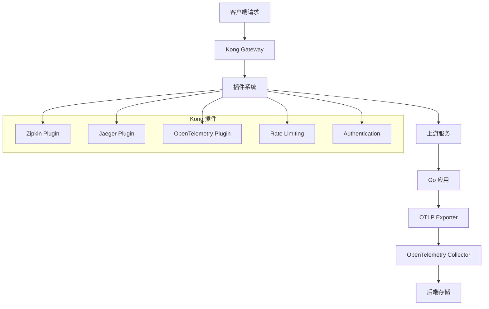

# Kong 与 OTLP 完整集成指南 2025版

## 概述

Kong 是一个云原生、快速、可扩展的微服务抽象层（也称为 API 网关）。本指南详细介绍如何在 Go 1.25.1 应用中集成 Kong 与 OpenTelemetry Protocol (OTLP)，实现完整的 API 网关可观测性。

## 目录

- [Kong 与 OTLP 完整集成指南 2025版](#kong-与-otlp-完整集成指南-2025版)
  - [概述](#概述)
  - [目录](#目录)
  - [Kong 架构概述](#kong-架构概述)
    - [核心组件](#核心组件)
    - [插件系统](#插件系统)
  - [快速开始](#快速开始)
    - [1. Kong 安装和配置](#1-kong-安装和配置)
      - [Docker Compose 部署](#docker-compose-部署)
      - [Kong 配置文件](#kong-配置文件)
    - [2. OpenTelemetry Collector 配置](#2-opentelemetry-collector-配置)
  - [Kong 插件配置](#kong-插件配置)
    - [OpenTelemetry 插件配置](#opentelemetry-插件配置)
    - [Prometheus 插件配置](#prometheus-插件配置)
    - [插件链配置](#插件链配置)
  - [Go 应用 OTLP 集成](#go-应用-otlp-集成)
    - [1. 基础 HTTP 服务集成](#1-基础-http-服务集成)
    - [2. gRPC 服务集成](#2-grpc-服务集成)
    - [3. 客户端集成](#3-客户端集成)
  - [分布式追踪配置](#分布式追踪配置)
    - [1. 追踪上下文传播](#1-追踪上下文传播)
    - [2. 跨服务追踪](#2-跨服务追踪)
  - [API 网关可观测性](#api-网关可观测性)
    - [1. Kong 指标监控](#1-kong-指标监控)
    - [2. 健康检查集成](#2-健康检查集成)
  - [性能优化](#性能优化)
    - [1. 采样策略](#1-采样策略)
    - [2. 批量导出优化](#2-批量导出优化)
    - [3. 资源限制](#3-资源限制)
  - [生产部署](#生产部署)
    - [1. Docker Compose 部署](#1-docker-compose-部署)
    - [2. Kubernetes 部署](#2-kubernetes-部署)
    - [3. 监控和告警](#3-监控和告警)
  - [最佳实践](#最佳实践)
    - [1. 追踪设计原则](#1-追踪设计原则)
    - [2. 性能优化建议](#2-性能优化建议)
    - [3. 安全考虑](#3-安全考虑)
  - [总结](#总结)

## Kong 架构概述

### 核心组件



### 插件系统

Kong 提供丰富的插件生态系统，支持各种可观测性需求：

- **OpenTelemetry Plugin**: 原生 OTLP 支持
- **Zipkin Plugin**: Zipkin 格式追踪
- **Jaeger Plugin**: Jaeger 格式追踪
- **Prometheus Plugin**: 指标收集
- **Datadog Plugin**: Datadog 集成

## 快速开始

### 1. Kong 安装和配置

#### Docker Compose 部署

```yaml
# docker-compose.kong.yml
version: '3.8'

services:
  kong-database:
    image: postgres:15
    environment:
      POSTGRES_DB: kong
      POSTGRES_USER: kong
      POSTGRES_PASSWORD: kong
    volumes:
      - kong_data:/var/lib/postgresql/data
    networks:
      - kong-net

  kong-migrations:
    image: kong:3.4
    command: kong migrations bootstrap
    environment:
      KONG_DATABASE: postgres
      KONG_PG_HOST: kong-database
      KONG_PG_DATABASE: kong
      KONG_PG_USER: kong
      KONG_PG_PASSWORD: kong
    depends_on:
      - kong-database
    networks:
      - kong-net

  kong:
    image: kong:3.4
    environment:
      KONG_DATABASE: postgres
      KONG_PG_HOST: kong-database
      KONG_PG_DATABASE: kong
      KONG_PG_USER: kong
      KONG_PG_PASSWORD: kong
      KONG_PROXY_ACCESS_LOG: /dev/stdout
      KONG_ADMIN_ACCESS_LOG: /dev/stdout
      KONG_PROXY_ERROR_LOG: /dev/stderr
      KONG_ADMIN_ERROR_LOG: /dev/stderr
      KONG_ADMIN_LISTEN: 0.0.0.0:8001
      KONG_PROXY_LISTEN: 0.0.0.0:8000
    ports:
      - "8000:8000"
      - "8001:8001"
    depends_on:
      - kong-migrations
    networks:
      - kong-net

  otel-collector:
    image: otel/opentelemetry-collector-contrib:0.88.0
    command: ["--config=/etc/otel-collector-config.yaml"]
    volumes:
      - ./configs/otel-collector-config.yaml:/etc/otel-collector-config.yaml
    ports:
      - "4317:4317"
      - "4318:4318"
    networks:
      - kong-net

volumes:
  kong_data:

networks:
  kong-net:
    driver: bridge
```

#### Kong 配置文件

```yaml
# kong.yml
_format_version: "3.0"

services:
  - name: user-service
    url: http://user-service:8080
    plugins:
      - name: opentelemetry
        config:
          endpoint: http://otel-collector:4317
          headers:
            - "x-api-key: your-api-key"
          resource_attributes:
            - key: "service.name"
              value: "kong-gateway"
            - key: "service.version"
              value: "1.0.0"
          batch_export:
            timeout: 5000
            send_batch_size: 512
          sampling:
            rate: 1.0
    routes:
      - name: user-routes
        paths:
          - /api/users
        methods:
          - GET
          - POST
          - PUT
          - DELETE

  - name: order-service
    url: http://order-service:8080
    plugins:
      - name: opentelemetry
        config:
          endpoint: http://otel-collector:4317
          headers:
            - "x-api-key: your-api-key"
          resource_attributes:
            - key: "service.name"
              value: "kong-gateway"
            - key: "service.version"
              value: "1.0.0"
          batch_export:
            timeout: 5000
            send_batch_size: 512
          sampling:
            rate: 1.0
    routes:
      - name: order-routes
        paths:
          - /api/orders
        methods:
          - GET
          - POST
          - PUT
          - DELETE

plugins:
  - name: prometheus
    config:
      per_consumer: false
      status_code_metrics: true
      latency_metrics: true
      bandwidth_metrics: true
      upstream_health_metrics: true
```

### 2. OpenTelemetry Collector 配置

```yaml
# configs/otel-collector-config.yaml
receivers:
  otlp:
    protocols:
      grpc:
        endpoint: 0.0.0.0:4317
      http:
        endpoint: 0.0.0.0:4318

processors:
  batch:
    timeout: 1s
    send_batch_size: 1024
  memory_limiter:
    limit_mib: 512
  resource:
    attributes:
      - key: deployment.environment
        value: production
        action: upsert

exporters:
  jaeger:
    endpoint: jaeger:14250
    tls:
      insecure: true
  prometheus:
    endpoint: "0.0.0.0:8889"
  logging:
    loglevel: debug

service:
  pipelines:
    traces:
      receivers: [otlp]
      processors: [memory_limiter, batch]
      exporters: [jaeger, logging]
    metrics:
      receivers: [otlp]
      processors: [memory_limiter, batch]
      exporters: [prometheus, logging]
```

## Kong 插件配置

### OpenTelemetry 插件配置

```bash
# 为服务启用 OpenTelemetry 插件
curl -X POST http://localhost:8001/services/user-service/plugins \
  --data "name=opentelemetry" \
  --data "config.endpoint=http://otel-collector:4317" \
  --data "config.headers[1]=x-api-key: your-api-key" \
  --data "config.resource_attributes[1][key]=service.name" \
  --data "config.resource_attributes[1][value]=kong-gateway" \
  --data "config.resource_attributes[2][key]=service.version" \
  --data "config.resource_attributes[2][value]=1.0.0" \
  --data "config.batch_export.timeout=5000" \
  --data "config.batch_export.send_batch_size=512" \
  --data "config.sampling.rate=1.0"
```

### Prometheus 插件配置

```bash
# 启用 Prometheus 指标收集
curl -X POST http://localhost:8001/plugins \
  --data "name=prometheus" \
  --data "config.per_consumer=false" \
  --data "config.status_code_metrics=true" \
  --data "config.latency_metrics=true" \
  --data "config.bandwidth_metrics=true" \
  --data "config.upstream_health_metrics=true"
```

### 插件链配置

```bash
# 创建插件链
curl -X POST http://localhost:8001/plugin-chains \
  --data "name=observability-chain"

# 添加插件到链
curl -X POST http://localhost:8001/plugin-chains/observability-chain/plugins \
  --data "name=opentelemetry" \
  --data "config.endpoint=http://otel-collector:4317"

curl -X POST http://localhost:8001/plugin-chains/observability-chain/plugins \
  --data "name=prometheus" \
  --data "config.per_consumer=false"
```

## Go 应用 OTLP 集成

### 1. 基础 HTTP 服务集成

```go
// main.go
package main

import (
    "context"
    "fmt"
    "log"
    "net/http"
    "time"

    "go.opentelemetry.io/otel"
    "go.opentelemetry.io/otel/attribute"
    "go.opentelemetry.io/otel/exporters/otlp/otlptrace/otlptracegrpc"
    "go.opentelemetry.io/otel/propagation"
    "go.opentelemetry.io/otel/sdk/resource"
    sdktrace "go.opentelemetry.io/otel/sdk/trace"
    "go.opentelemetry.io/otel/trace"
)

func initTracer() func() {
    ctx := context.Background()

    // 创建 OTLP 导出器
    exporter, err := otlptracegrpc.New(ctx,
        otlptracegrpc.WithEndpoint("otel-collector:4317"),
        otlptracegrpc.WithInsecure(),
    )
    if err != nil {
        log.Fatalf("Failed to create OTLP exporter: %v", err)
    }

    // 创建资源
    res, err := resource.New(ctx,
        resource.WithAttributes(
            attribute.String("service.name", "user-service"),
            attribute.String("service.version", "1.0.0"),
            attribute.String("deployment.environment", "production"),
        ),
    )
    if err != nil {
        log.Fatalf("Failed to create resource: %v", err)
    }

    // 创建 TracerProvider
    tp := sdktrace.NewTracerProvider(
        sdktrace.WithBatcher(exporter),
        sdktrace.WithResource(res),
        sdktrace.WithSampler(sdktrace.TraceIDRatioBased(1.0)),
    )

    otel.SetTracerProvider(tp)
    otel.SetTextMapPropagator(propagation.NewCompositeTextMapPropagator(
        propagation.TraceContext{},
        propagation.Baggage{},
    ))

    return func() {
        if err := tp.Shutdown(ctx); err != nil {
            log.Printf("Error shutting down tracer provider: %v", err)
        }
    }
}

func main() {
    // 初始化追踪
    cleanup := initTracer()
    defer cleanup()

    // 创建 HTTP 服务器
    mux := http.NewServeMux()
    mux.HandleFunc("/api/users", handleUsers)
    mux.HandleFunc("/health", handleHealth)

    // 添加中间件
    handler := tracingMiddleware(mux)

    log.Println("Starting server on :8080")
    if err := http.ListenAndServe(":8080", handler); err != nil {
        log.Fatalf("Server failed: %v", err)
    }
}

func tracingMiddleware(next http.Handler) http.Handler {
    return http.HandlerFunc(func(w http.ResponseWriter, r *http.Request) {
        // 从请求头中提取追踪上下文
        ctx := otel.GetTextMapPropagator().Extract(r.Context(), propagation.HeaderCarrier(r.Header))
        
        // 创建新的 span
        tracer := otel.Tracer("user-service")
        ctx, span := tracer.Start(ctx, r.URL.Path,
            trace.WithAttributes(
                attribute.String("http.method", r.Method),
                attribute.String("http.url", r.URL.String()),
                attribute.String("http.user_agent", r.UserAgent()),
            ),
        )
        defer span.End()

        // 创建响应写入器来捕获状态码
        ww := &responseWriter{ResponseWriter: w, statusCode: 200}

        // 处理请求
        next.ServeHTTP(ww, r.WithContext(ctx))

        // 设置 span 属性
        span.SetAttributes(
            attribute.Int("http.status_code", ww.statusCode),
            attribute.String("http.route", r.URL.Path),
        )
    })
}

type responseWriter struct {
    http.ResponseWriter
    statusCode int
}

func (rw *responseWriter) WriteHeader(code int) {
    rw.statusCode = code
    rw.ResponseWriter.WriteHeader(code)
}

func handleUsers(w http.ResponseWriter, r *http.Request) {
    ctx := r.Context()
    tracer := otel.Tracer("user-service")
    
    // 创建子 span
    _, span := tracer.Start(ctx, "get-users")
    defer span.End()

    // 模拟数据库查询
    time.Sleep(100 * time.Millisecond)
    
    // 设置响应
    w.Header().Set("Content-Type", "application/json")
    w.WriteHeader(http.StatusOK)
    w.Write([]byte(`{"users": [{"id": 1, "name": "John Doe"}]}`))
    
    span.SetAttributes(
        attribute.Int("users.count", 1),
        attribute.String("response.format", "json"),
    )
}

func handleHealth(w http.ResponseWriter, r *http.Request) {
    w.WriteHeader(http.StatusOK)
    w.Write([]byte("OK"))
}
```

### 2. gRPC 服务集成

```go
// grpc_server.go
package main

import (
    "context"
    "log"
    "net"

    "go.opentelemetry.io/otel"
    "go.opentelemetry.io/otel/attribute"
    "go.opentelemetry.io/otel/codes"
    "go.opentelemetry.io/otel/propagation"
    "go.opentelemetry.io/otel/trace"
    "google.golang.org/grpc"
    "google.golang.org/grpc/metadata"
)

type UserService struct {
    UnimplementedUserServiceServer
}

func (s *UserService) GetUser(ctx context.Context, req *GetUserRequest) (*GetUserResponse, error) {
    tracer := otel.Tracer("user-service")
    
    // 创建 span
    ctx, span := tracer.Start(ctx, "get-user",
        trace.WithAttributes(
            attribute.String("user.id", req.Id),
            attribute.String("grpc.method", "GetUser"),
        ),
    )
    defer span.End()

    // 模拟业务逻辑
    user := &User{
        Id:   req.Id,
        Name: "John Doe",
        Email: "john@example.com",
    }

    span.SetAttributes(
        attribute.String("user.name", user.Name),
        attribute.String("user.email", user.Email),
    )

    return &GetUserResponse{User: user}, nil
}

func grpcTracingInterceptor() grpc.UnaryServerInterceptor {
    return func(ctx context.Context, req interface{}, info *grpc.UnaryServerInfo, handler grpc.UnaryHandler) (interface{}, error) {
        // 从 metadata 中提取追踪上下文
        md, ok := metadata.FromIncomingContext(ctx)
        if ok {
            ctx = otel.GetTextMapPropagator().Extract(ctx, metadataCarrier(md))
        }

        // 创建 span
        tracer := otel.Tracer("user-service")
        ctx, span := tracer.Start(ctx, info.FullMethod,
            trace.WithAttributes(
                attribute.String("grpc.method", info.FullMethod),
                attribute.String("grpc.service", info.Server),
            ),
        )
        defer span.End()

        // 处理请求
        resp, err := handler(ctx, req)
        
        if err != nil {
            span.RecordError(err)
            span.SetStatus(codes.Error, err.Error())
        } else {
            span.SetStatus(codes.Ok, "")
        }

        return resp, err
    }
}

type metadataCarrier metadata.MD

func (mc metadataCarrier) Get(key string) string {
    values := metadata.MD(mc).Get(key)
    if len(values) > 0 {
        return values[0]
    }
    return ""
}

func (mc metadataCarrier) Set(key, value string) {
    metadata.MD(mc).Set(key, value)
}

func (mc metadataCarrier) Keys() []string {
    keys := make([]string, 0, len(metadata.MD(mc)))
    for k := range metadata.MD(mc) {
        keys = append(keys, k)
    }
    return keys
}

func main() {
    // 初始化追踪
    cleanup := initTracer()
    defer cleanup()

    // 创建 gRPC 服务器
    server := grpc.NewServer(
        grpc.UnaryInterceptor(grpcTracingInterceptor()),
    )

    // 注册服务
    RegisterUserServiceServer(server, &UserService{})

    // 启动服务器
    lis, err := net.Listen("tcp", ":9090")
    if err != nil {
        log.Fatalf("Failed to listen: %v", err)
    }

    log.Println("Starting gRPC server on :9090")
    if err := server.Serve(lis); err != nil {
        log.Fatalf("Failed to serve: %v", err)
    }
}
```

### 3. 客户端集成

```go
// client.go
package main

import (
    "context"
    "fmt"
    "log"
    "net/http"
    "time"

    "go.opentelemetry.io/otel"
    "go.opentelemetry.io/otel/attribute"
    "go.opentelemetry.io/otel/propagation"
    "go.opentelemetry.io/otel/trace"
)

type HTTPClient struct {
    client *http.Client
    tracer trace.Tracer
}

func NewHTTPClient() *HTTPClient {
    return &HTTPClient{
        client: &http.Client{
            Timeout: 30 * time.Second,
        },
        tracer: otel.Tracer("http-client"),
    }
}

func (c *HTTPClient) Get(ctx context.Context, url string) (*http.Response, error) {
    // 创建 span
    ctx, span := c.tracer.Start(ctx, "http-get",
        trace.WithAttributes(
            attribute.String("http.url", url),
            attribute.String("http.method", "GET"),
        ),
    )
    defer span.End()

    // 创建请求
    req, err := http.NewRequestWithContext(ctx, "GET", url, nil)
    if err != nil {
        span.RecordError(err)
        span.SetStatus(trace.StatusError, err.Error())
        return nil, err
    }

    // 注入追踪上下文
    otel.GetTextMapPropagator().Inject(ctx, propagation.HeaderCarrier(req.Header))

    // 发送请求
    resp, err := c.client.Do(req)
    if err != nil {
        span.RecordError(err)
        span.SetStatus(trace.StatusError, err.Error())
        return nil, err
    }

    // 设置响应属性
    span.SetAttributes(
        attribute.Int("http.status_code", resp.StatusCode),
        attribute.String("http.response_content_type", resp.Header.Get("Content-Type")),
    )

    if resp.StatusCode >= 400 {
        span.SetStatus(trace.StatusError, fmt.Sprintf("HTTP %d", resp.StatusCode))
    }

    return resp, nil
}

func main() {
    // 初始化追踪
    cleanup := initTracer()
    defer cleanup()

    client := NewHTTPClient()
    ctx := context.Background()

    // 通过 Kong 网关调用服务
    resp, err := client.Get(ctx, "http://localhost:8000/api/users")
    if err != nil {
        log.Fatalf("Request failed: %v", err)
    }
    defer resp.Body.Close()

    fmt.Printf("Response status: %d\n", resp.StatusCode)
}
```

## 分布式追踪配置

### 1. 追踪上下文传播

```go
// context_propagation.go
package main

import (
    "context"
    "fmt"
    "net/http"

    "go.opentelemetry.io/otel"
    "go.opentelemetry.io/otel/attribute"
    "go.opentelemetry.io/otel/baggage"
    "go.opentelemetry.io/otel/propagation"
    "go.opentelemetry.io/otel/trace"
)

func propagateContext(ctx context.Context, w http.ResponseWriter, r *http.Request) {
    // 从请求中提取追踪上下文
    ctx = otel.GetTextMapPropagator().Extract(ctx, propagation.HeaderCarrier(r.Header))
    
    // 添加自定义 baggage
    ctx, err := baggage.New(ctx,
        baggage.Member("user.id", "12345"),
        baggage.Member("request.source", "mobile"),
    )
    if err != nil {
        log.Printf("Failed to create baggage: %v", err)
    }

    // 创建 span
    tracer := otel.Tracer("context-propagation")
    ctx, span := tracer.Start(ctx, "process-request",
        trace.WithAttributes(
            attribute.String("http.method", r.Method),
            attribute.String("http.url", r.URL.String()),
        ),
    )
    defer span.End()

    // 处理请求
    processRequest(ctx, w, r)
}

func processRequest(ctx context.Context, w http.ResponseWriter, r *http.Request) {
    // 获取 baggage 信息
    bag := baggage.FromContext(ctx)
    userID := bag.Member("user.id").Value()
    source := bag.Member("request.source").Value()

    // 创建子 span
    tracer := otel.Tracer("context-propagation")
    ctx, span := tracer.Start(ctx, "business-logic",
        trace.WithAttributes(
            attribute.String("user.id", userID),
            attribute.String("request.source", source),
        ),
    )
    defer span.End()

    // 模拟业务逻辑
    result := fmt.Sprintf("Processing request for user %s from %s", userID, source)
    
    w.WriteHeader(http.StatusOK)
    w.Write([]byte(result))
}
```

### 2. 跨服务追踪

```go
// cross_service_tracing.go
package main

import (
    "context"
    "fmt"
    "log"
    "net/http"
    "time"

    "go.opentelemetry.io/otel"
    "go.opentelemetry.io/otel/attribute"
    "go.opentelemetry.io/otel/trace"
)

type ServiceClient struct {
    client *http.Client
    tracer trace.Tracer
}

func NewServiceClient() *ServiceClient {
    return &ServiceClient{
        client: &http.Client{
            Timeout: 30 * time.Second,
        },
        tracer: otel.Tracer("service-client"),
    }
}

func (c *ServiceClient) CallUserService(ctx context.Context, userID string) error {
    // 创建 span
    ctx, span := c.tracer.Start(ctx, "call-user-service",
        trace.WithAttributes(
            attribute.String("user.id", userID),
            attribute.String("service.name", "user-service"),
        ),
    )
    defer span.End()

    // 模拟调用用户服务
    time.Sleep(50 * time.Millisecond)
    
    span.SetAttributes(
        attribute.String("service.response", "success"),
        attribute.Int("service.latency_ms", 50),
    )

    return nil
}

func (c *ServiceClient) CallOrderService(ctx context.Context, orderID string) error {
    // 创建 span
    ctx, span := c.tracer.Start(ctx, "call-order-service",
        trace.WithAttributes(
            attribute.String("order.id", orderID),
            attribute.String("service.name", "order-service"),
        ),
    )
    defer span.End()

    // 模拟调用订单服务
    time.Sleep(30 * time.Millisecond)
    
    span.SetAttributes(
        attribute.String("service.response", "success"),
        attribute.Int("service.latency_ms", 30),
    )

    return nil
}

func handleComplexRequest(w http.ResponseWriter, r *http.Request) {
    ctx := r.Context()
    tracer := otel.Tracer("complex-request")
    
    // 创建根 span
    ctx, span := tracer.Start(ctx, "complex-request",
        trace.WithAttributes(
            attribute.String("request.type", "complex"),
            attribute.String("http.method", r.Method),
        ),
    )
    defer span.End()

    client := NewServiceClient()
    
    // 并行调用多个服务
    errChan := make(chan error, 2)
    
    go func() {
        err := client.CallUserService(ctx, "12345")
        errChan <- err
    }()
    
    go func() {
        err := client.CallOrderService(ctx, "67890")
        errChan <- err
    }()
    
    // 等待所有服务调用完成
    for i := 0; i < 2; i++ {
        if err := <-errChan; err != nil {
            span.RecordError(err)
            span.SetStatus(trace.StatusError, err.Error())
            w.WriteHeader(http.StatusInternalServerError)
            return
        }
    }
    
    span.SetAttributes(
        attribute.String("request.status", "success"),
        attribute.Int("services.called", 2),
    )
    
    w.WriteHeader(http.StatusOK)
    w.Write([]byte("Complex request completed successfully"))
}
```

## API 网关可观测性

### 1. Kong 指标监控

```go
// metrics.go
package main

import (
    "context"
    "fmt"
    "log"
    "net/http"
    "time"

    "go.opentelemetry.io/otel"
    "go.opentelemetry.io/otel/attribute"
    "go.opentelemetry.io/otel/exporters/prometheus"
    "go.opentelemetry.io/otel/metric"
    "go.opentelemetry.io/otel/sdk/metric"
)

func initMetrics() func() {
    // 创建 Prometheus 导出器
    exporter, err := prometheus.New()
    if err != nil {
        log.Fatalf("Failed to create Prometheus exporter: %v", err)
    }

    // 创建 MeterProvider
    mp := metric.NewMeterProvider(
        metric.WithReader(exporter),
    )

    otel.SetMeterProvider(mp)

    // 启动 Prometheus 服务器
    go func() {
        http.Handle("/metrics", exporter)
        log.Println("Prometheus metrics server starting on :8888")
        if err := http.ListenAndServe(":8888", nil); err != nil {
            log.Printf("Prometheus server failed: %v", err)
        }
    }()

    return func() {
        if err := mp.Shutdown(context.Background()); err != nil {
            log.Printf("Error shutting down meter provider: %v", err)
        }
    }
}

func main() {
    // 初始化指标
    cleanup := initMetrics()
    defer cleanup()

    // 创建指标
    meter := otel.Meter("kong-gateway")
    
    // 请求计数器
    requestCounter, err := meter.Int64Counter(
        "http_requests_total",
        metric.WithDescription("Total number of HTTP requests"),
    )
    if err != nil {
        log.Fatalf("Failed to create request counter: %v", err)
    }

    // 请求延迟直方图
    requestDuration, err := meter.Float64Histogram(
        "http_request_duration_seconds",
        metric.WithDescription("HTTP request duration in seconds"),
    )
    if err != nil {
        log.Fatalf("Failed to create request duration histogram: %v", err)
    }

    // 创建 HTTP 服务器
    mux := http.NewServeMux()
    mux.HandleFunc("/api/users", func(w http.ResponseWriter, r *http.Request) {
        start := time.Now()
        
        // 记录请求
        requestCounter.Add(context.Background(), 1,
            metric.WithAttributes(
                attribute.String("method", r.Method),
                attribute.String("path", r.URL.Path),
                attribute.String("status", "200"),
            ),
        )

        // 处理请求
        time.Sleep(100 * time.Millisecond)
        w.WriteHeader(http.StatusOK)
        w.Write([]byte(`{"users": []}`))

        // 记录延迟
        duration := time.Since(start).Seconds()
        requestDuration.Record(context.Background(), duration,
            metric.WithAttributes(
                attribute.String("method", r.Method),
                attribute.String("path", r.URL.Path),
            ),
        )
    })

    log.Println("Starting server on :8080")
    if err := http.ListenAndServe(":8080", mux); err != nil {
        log.Fatalf("Server failed: %v", err)
    }
}
```

### 2. 健康检查集成

```go
// health_check.go
package main

import (
    "context"
    "encoding/json"
    "fmt"
    "net/http"
    "time"

    "go.opentelemetry.io/otel"
    "go.opentelemetry.io/otel/attribute"
    "go.opentelemetry.io/otel/trace"
)

type HealthStatus struct {
    Status    string            `json:"status"`
    Timestamp time.Time         `json:"timestamp"`
    Services  map[string]string `json:"services"`
    Metrics   map[string]int    `json:"metrics"`
}

func handleHealthCheck(w http.ResponseWriter, r *http.Request) {
    ctx := r.Context()
    tracer := otel.Tracer("health-check")
    
    // 创建 span
    ctx, span := tracer.Start(ctx, "health-check",
        trace.WithAttributes(
            attribute.String("check.type", "liveness"),
        ),
    )
    defer span.End()

    // 检查各个服务状态
    services := make(map[string]string)
    metrics := make(map[string]int)
    
    // 检查数据库连接
    if checkDatabase(ctx) {
        services["database"] = "healthy"
        metrics["database_connections"] = 10
    } else {
        services["database"] = "unhealthy"
        metrics["database_connections"] = 0
    }
    
    // 检查外部 API
    if checkExternalAPI(ctx) {
        services["external_api"] = "healthy"
        metrics["external_api_latency_ms"] = 50
    } else {
        services["external_api"] = "unhealthy"
        metrics["external_api_latency_ms"] = -1
    }
    
    // 确定整体状态
    status := "healthy"
    for _, serviceStatus := range services {
        if serviceStatus != "healthy" {
            status = "unhealthy"
            break
        }
    }
    
    // 设置 span 属性
    span.SetAttributes(
        attribute.String("health.status", status),
        attribute.Int("services.count", len(services)),
    )
    
    // 返回健康状态
    healthStatus := HealthStatus{
        Status:    status,
        Timestamp: time.Now(),
        Services:  services,
        Metrics:   metrics,
    }
    
    w.Header().Set("Content-Type", "application/json")
    w.WriteHeader(http.StatusOK)
    
    if err := json.NewEncoder(w).Encode(healthStatus); err != nil {
        span.RecordError(err)
        span.SetStatus(trace.StatusError, err.Error())
    }
}

func checkDatabase(ctx context.Context) bool {
    tracer := otel.Tracer("health-check")
    ctx, span := tracer.Start(ctx, "check-database")
    defer span.End()
    
    // 模拟数据库检查
    time.Sleep(10 * time.Millisecond)
    
    span.SetAttributes(
        attribute.String("database.status", "healthy"),
        attribute.Int("database.latency_ms", 10),
    )
    
    return true
}

func checkExternalAPI(ctx context.Context) bool {
    tracer := otel.Tracer("health-check")
    ctx, span := tracer.Start(ctx, "check-external-api")
    defer span.End()
    
    // 模拟外部 API 检查
    time.Sleep(50 * time.Millisecond)
    
    span.SetAttributes(
        attribute.String("external_api.status", "healthy"),
        attribute.Int("external_api.latency_ms", 50),
    )
    
    return true
}
```

## 性能优化

### 1. 采样策略

```go
// sampling.go
package main

import (
    "context"
    "log"
    "math/rand"
    "time"

    "go.opentelemetry.io/otel"
    "go.opentelemetry.io/otel/attribute"
    "go.opentelemetry.io/otel/sdk/trace"
    "go.opentelemetry.io/otel/trace"
)

// 自定义采样器
type CustomSampler struct {
    baseSampler trace.Sampler
    rate        float64
}

func NewCustomSampler(rate float64) *CustomSampler {
    return &CustomSampler{
        baseSampler: trace.TraceIDRatioBased(rate),
        rate:        rate,
    }
}

func (s *CustomSampler) ShouldSample(params trace.SamplingParameters) trace.SamplingResult {
    // 对健康检查请求不采样
    if params.Name == "health-check" {
        return trace.SamplingResult{Decision: trace.Drop}
    }
    
    // 对错误请求总是采样
    if params.HasRemoteParent && params.ParentContext.IsValid() {
        if params.ParentContext.TraceID().IsValid() {
            return trace.SamplingResult{Decision: trace.RecordAndSample}
        }
    }
    
    // 使用基础采样器
    return s.baseSampler.ShouldSample(params)
}

func (s *CustomSampler) Description() string {
    return fmt.Sprintf("CustomSampler{rate=%f}", s.rate)
}

// 动态采样
type DynamicSampler struct {
    baseRate    float64
    currentRate float64
    lastUpdate  time.Time
}

func NewDynamicSampler(baseRate float64) *DynamicSampler {
    return &DynamicSampler{
        baseRate:    baseRate,
        currentRate: baseRate,
        lastUpdate:  time.Now(),
    }
}

func (s *DynamicSampler) ShouldSample(params trace.SamplingParameters) trace.SamplingResult {
    // 动态调整采样率
    s.adjustSamplingRate()
    
    // 使用当前采样率
    sampler := trace.TraceIDRatioBased(s.currentRate)
    return sampler.ShouldSample(params)
}

func (s *DynamicSampler) adjustSamplingRate() {
    now := time.Now()
    if now.Sub(s.lastUpdate) < time.Minute {
        return
    }
    
    // 模拟根据系统负载调整采样率
    load := getSystemLoad()
    if load > 0.8 {
        s.currentRate = s.baseRate * 0.5 // 降低采样率
    } else if load < 0.3 {
        s.currentRate = s.baseRate * 1.5 // 提高采样率
    } else {
        s.currentRate = s.baseRate
    }
    
    s.lastUpdate = now
}

func (s *DynamicSampler) Description() string {
    return fmt.Sprintf("DynamicSampler{rate=%f}", s.currentRate)
}

func getSystemLoad() float64 {
    // 模拟获取系统负载
    return rand.Float64()
}

func initTracerWithSampling() func() {
    ctx := context.Background()

    // 创建自定义采样器
    sampler := NewCustomSampler(0.1) // 10% 采样率

    // 创建 TracerProvider
    tp := trace.NewTracerProvider(
        trace.WithSampler(sampler),
    )

    otel.SetTracerProvider(tp)

    return func() {
        if err := tp.Shutdown(ctx); err != nil {
            log.Printf("Error shutting down tracer provider: %v", err)
        }
    }
}
```

### 2. 批量导出优化

```go
// batch_export.go
package main

import (
    "context"
    "log"
    "time"

    "go.opentelemetry.io/otel/exporters/otlp/otlptrace/otlptracegrpc"
    "go.opentelemetry.io/otel/sdk/resource"
    sdktrace "go.opentelemetry.io/otel/sdk/trace"
)

func initTracerWithBatchExport() func() {
    ctx := context.Background()

    // 创建 OTLP 导出器
    exporter, err := otlptracegrpc.New(ctx,
        otlptracegrpc.WithEndpoint("otel-collector:4317"),
        otlptracegrpc.WithInsecure(),
    )
    if err != nil {
        log.Fatalf("Failed to create OTLP exporter: %v", err)
    }

    // 创建资源
    res, err := resource.New(ctx,
        resource.WithAttributes(
            attribute.String("service.name", "kong-gateway"),
            attribute.String("service.version", "1.0.0"),
        ),
    )
    if err != nil {
        log.Fatalf("Failed to create resource: %v", err)
    }

    // 创建 TracerProvider 与批量导出器
    tp := sdktrace.NewTracerProvider(
        sdktrace.WithBatcher(exporter,
            sdktrace.WithBatchTimeout(5*time.Second),    // 5秒超时
            sdktrace.WithMaxExportBatchSize(512),         // 最大批量大小
            sdktrace.WithMaxQueueSize(2048),              // 最大队列大小
        ),
        sdktrace.WithResource(res),
        sdktrace.WithSampler(sdktrace.TraceIDRatioBased(0.1)),
    )

    otel.SetTracerProvider(tp)

    return func() {
        if err := tp.Shutdown(ctx); err != nil {
            log.Printf("Error shutting down tracer provider: %v", err)
        }
    }
}
```

### 3. 资源限制

```go
// resource_limits.go
package main

import (
    "context"
    "log"
    "runtime"

    "go.opentelemetry.io/otel/exporters/otlp/otlptrace/otlptracegrpc"
    "go.opentelemetry.io/otel/sdk/resource"
    sdktrace "go.opentelemetry.io/otel/sdk/trace"
)

func initTracerWithResourceLimits() func() {
    ctx := context.Background()

    // 创建 OTLP 导出器
    exporter, err := otlptracegrpc.New(ctx,
        otlptracegrpc.WithEndpoint("otel-collector:4317"),
        otlptracegrpc.WithInsecure(),
    )
    if err != nil {
        log.Fatalf("Failed to create OTLP exporter: %v", err)
    }

    // 创建资源
    res, err := resource.New(ctx,
        resource.WithAttributes(
            attribute.String("service.name", "kong-gateway"),
            attribute.String("service.version", "1.0.0"),
            attribute.Int("cpu.count", runtime.NumCPU()),
            attribute.String("go.version", runtime.Version()),
        ),
    )
    if err != nil {
        log.Fatalf("Failed to create resource: %v", err)
    }

    // 创建 TracerProvider 与资源限制
    tp := sdktrace.NewTracerProvider(
        sdktrace.WithBatcher(exporter,
            sdktrace.WithBatchTimeout(5*time.Second),
            sdktrace.WithMaxExportBatchSize(512),
            sdktrace.WithMaxQueueSize(2048),
        ),
        sdktrace.WithResource(res),
        sdktrace.WithSampler(sdktrace.TraceIDRatioBased(0.1)),
    )

    otel.SetTracerProvider(tp)

    return func() {
        if err := tp.Shutdown(ctx); err != nil {
            log.Printf("Error shutting down tracer provider: %v", err)
        }
    }
}
```

## 生产部署

### 1. Docker Compose 部署

```yaml
# docker-compose.prod.yml
version: '3.8'

services:
  kong-database:
    image: postgres:15
    environment:
      POSTGRES_DB: kong
      POSTGRES_USER: kong
      POSTGRES_PASSWORD: ${KONG_DB_PASSWORD}
    volumes:
      - kong_data:/var/lib/postgresql/data
    networks:
      - kong-net
    deploy:
      resources:
        limits:
          memory: 1G
          cpus: '0.5'
        reservations:
          memory: 512M
          cpus: '0.25'

  kong-migrations:
    image: kong:3.4
    command: kong migrations bootstrap
    environment:
      KONG_DATABASE: postgres
      KONG_PG_HOST: kong-database
      KONG_PG_DATABASE: kong
      KONG_PG_USER: kong
      KONG_PG_PASSWORD: ${KONG_DB_PASSWORD}
    depends_on:
      - kong-database
    networks:
      - kong-net

  kong:
    image: kong:3.4
    environment:
      KONG_DATABASE: postgres
      KONG_PG_HOST: kong-database
      KONG_PG_DATABASE: kong
      KONG_PG_USER: kong
      KONG_PG_PASSWORD: ${KONG_DB_PASSWORD}
      KONG_PROXY_ACCESS_LOG: /dev/stdout
      KONG_ADMIN_ACCESS_LOG: /dev/stdout
      KONG_PROXY_ERROR_LOG: /dev/stderr
      KONG_ADMIN_ERROR_LOG: /dev/stderr
      KONG_ADMIN_LISTEN: 0.0.0.0:8001
      KONG_PROXY_LISTEN: 0.0.0.0:8000
      KONG_PLUGINS: opentelemetry,prometheus,rate-limiting,auth-key
    ports:
      - "8000:8000"
      - "8001:8001"
    depends_on:
      - kong-migrations
    networks:
      - kong-net
    deploy:
      replicas: 3
      resources:
        limits:
          memory: 2G
          cpus: '1.0'
        reservations:
          memory: 1G
          cpus: '0.5'
      restart_policy:
        condition: on-failure
        delay: 5s
        max_attempts: 3

  otel-collector:
    image: otel/opentelemetry-collector-contrib:0.88.0
    command: ["--config=/etc/otel-collector-config.yaml"]
    volumes:
      - ./configs/otel-collector-config.yaml:/etc/otel-collector-config.yaml
    ports:
      - "4317:4317"
      - "4318:4318"
    networks:
      - kong-net
    deploy:
      replicas: 2
      resources:
        limits:
          memory: 1G
          cpus: '0.5'
        reservations:
          memory: 512M
          cpus: '0.25'
      restart_policy:
        condition: on-failure
        delay: 5s
        max_attempts: 3

  jaeger:
    image: jaegertracing/all-in-one:1.50
    environment:
      COLLECTOR_OTLP_ENABLED: true
    ports:
      - "16686:16686"
      - "14250:14250"
    networks:
      - kong-net
    deploy:
      resources:
        limits:
          memory: 1G
          cpus: '0.5'
        reservations:
          memory: 512M
          cpus: '0.25'

  prometheus:
    image: prom/prometheus:v2.45.0
    command:
      - '--config.file=/etc/prometheus/prometheus.yml'
      - '--storage.tsdb.path=/prometheus'
      - '--web.console.libraries=/etc/prometheus/console_libraries'
      - '--web.console.templates=/etc/prometheus/consoles'
      - '--storage.tsdb.retention.time=200h'
      - '--web.enable-lifecycle'
    volumes:
      - ./configs/prometheus.yml:/etc/prometheus/prometheus.yml
    ports:
      - "9090:9090"
    networks:
      - kong-net
    deploy:
      resources:
        limits:
          memory: 2G
          cpus: '1.0'
        reservations:
          memory: 1G
          cpus: '0.5'

volumes:
  kong_data:

networks:
  kong-net:
    driver: bridge
```

### 2. Kubernetes 部署

```yaml
# k8s/kong-deployment.yaml
apiVersion: apps/v1
kind: Deployment
metadata:
  name: kong
  namespace: kong
spec:
  replicas: 3
  selector:
    matchLabels:
      app: kong
  template:
    metadata:
      labels:
        app: kong
    spec:
      containers:
      - name: kong
        image: kong:3.4
        ports:
        - containerPort: 8000
          name: proxy
        - containerPort: 8001
          name: admin
        env:
        - name: KONG_DATABASE
          value: "postgres"
        - name: KONG_PG_HOST
          value: "kong-database"
        - name: KONG_PG_DATABASE
          value: "kong"
        - name: KONG_PG_USER
          value: "kong"
        - name: KONG_PG_PASSWORD
          valueFrom:
            secretKeyRef:
              name: kong-secret
              key: password
        - name: KONG_PROXY_ACCESS_LOG
          value: "/dev/stdout"
        - name: KONG_ADMIN_ACCESS_LOG
          value: "/dev/stdout"
        - name: KONG_PROXY_ERROR_LOG
          value: "/dev/stderr"
        - name: KONG_ADMIN_ERROR_LOG
          value: "/dev/stderr"
        - name: KONG_ADMIN_LISTEN
          value: "0.0.0.0:8001"
        - name: KONG_PROXY_LISTEN
          value: "0.0.0.0:8000"
        - name: KONG_PLUGINS
          value: "opentelemetry,prometheus,rate-limiting,auth-key"
        resources:
          requests:
            memory: "1Gi"
            cpu: "500m"
          limits:
            memory: "2Gi"
            cpu: "1000m"
        livenessProbe:
          httpGet:
            path: /status
            port: 8001
          initialDelaySeconds: 30
          periodSeconds: 10
        readinessProbe:
          httpGet:
            path: /status
            port: 8001
          initialDelaySeconds: 5
          periodSeconds: 5
---
apiVersion: v1
kind: Service
metadata:
  name: kong
  namespace: kong
spec:
  selector:
    app: kong
  ports:
  - name: proxy
    port: 8000
    targetPort: 8000
  - name: admin
    port: 8001
    targetPort: 8001
  type: LoadBalancer
---
apiVersion: autoscaling/v2
kind: HorizontalPodAutoscaler
metadata:
  name: kong-hpa
  namespace: kong
spec:
  scaleTargetRef:
    apiVersion: apps/v1
    kind: Deployment
    name: kong
  minReplicas: 3
  maxReplicas: 10
  metrics:
  - type: Resource
    resource:
      name: cpu
      target:
        type: Utilization
        averageUtilization: 70
  - type: Resource
    resource:
      name: memory
      target:
        type: Utilization
        averageUtilization: 80
```

### 3. 监控和告警

```yaml
# configs/prometheus.yml
global:
  scrape_interval: 15s
  evaluation_interval: 15s

rule_files:
  - "kong_rules.yml"

scrape_configs:
  - job_name: 'kong'
    static_configs:
      - targets: ['kong:8001']
    metrics_path: /metrics
    scrape_interval: 10s

  - job_name: 'otel-collector'
    static_configs:
      - targets: ['otel-collector:8889']
    scrape_interval: 10s

  - job_name: 'user-service'
    static_configs:
      - targets: ['user-service:8888']
    scrape_interval: 10s

alerting:
  alertmanagers:
    - static_configs:
        - targets:
          - alertmanager:9093
```

```yaml
# configs/kong_rules.yml
groups:
- name: kong.rules
  rules:
  - alert: KongHighErrorRate
    expr: rate(kong_http_requests_total{code=~"5.."}[5m]) > 0.1
    for: 2m
    labels:
      severity: warning
    annotations:
      summary: "Kong high error rate"
      description: "Kong error rate is {{ $value }} errors per second"

  - alert: KongHighLatency
    expr: histogram_quantile(0.95, rate(kong_http_request_duration_seconds_bucket[5m])) > 1
    for: 2m
    labels:
      severity: warning
    annotations:
      summary: "Kong high latency"
      description: "Kong 95th percentile latency is {{ $value }} seconds"

  - alert: KongDown
    expr: up{job="kong"} == 0
    for: 1m
    labels:
      severity: critical
    annotations:
      summary: "Kong is down"
      description: "Kong service is not responding"
```

## 最佳实践

### 1. 追踪设计原则

```go
// tracing_principles.go
package main

import (
    "context"
    "log"
    "net/http"
    "time"

    "go.opentelemetry.io/otel"
    "go.opentelemetry.io/otel/attribute"
    "go.opentelemetry.io/otel/trace"
)

// 1. 合理的 Span 命名
func handleUserRequest(w http.ResponseWriter, r *http.Request) {
    ctx := r.Context()
    tracer := otel.Tracer("user-service")
    
    // 好的命名：动词 + 名词
    ctx, span := tracer.Start(ctx, "get-user-profile")
    defer span.End()
    
    // 避免：过于宽泛或过于具体
    // ctx, span := tracer.Start(ctx, "request") // 太宽泛
    // ctx, span := tracer.Start(ctx, "get-user-profile-from-database-by-id-12345") // 太具体
}

// 2. 合理的属性设置
func processOrder(ctx context.Context, orderID string) error {
    tracer := otel.Tracer("order-service")
    ctx, span := tracer.Start(ctx, "process-order")
    defer span.End()
    
    // 好的属性：业务相关的关键信息
    span.SetAttributes(
        attribute.String("order.id", orderID),
        attribute.String("order.status", "processing"),
        attribute.String("user.id", getUserID(ctx)),
    )
    
    // 避免：过多的技术细节
    // span.SetAttributes(
    //     attribute.String("database.connection.pool.size", "10"),
    //     attribute.String("http.client.timeout", "30s"),
    // )
    
    return nil
}

// 3. 错误处理
func callExternalAPI(ctx context.Context, url string) error {
    tracer := otel.Tracer("external-api")
    ctx, span := tracer.Start(ctx, "call-external-api")
    defer span.End()
    
    span.SetAttributes(
        attribute.String("external.api.url", url),
    )
    
    // 模拟 API 调用
    if time.Now().Unix()%2 == 0 {
        err := fmt.Errorf("external API error")
        span.RecordError(err)
        span.SetStatus(trace.StatusError, err.Error())
        return err
    }
    
    span.SetStatus(trace.StatusOk, "success")
    return nil
}

// 4. 上下文传播
func propagateContext(ctx context.Context, w http.ResponseWriter, r *http.Request) {
    // 从请求中提取追踪上下文
    ctx = otel.GetTextMapPropagator().Extract(ctx, propagation.HeaderCarrier(r.Header))
    
    // 处理请求
    handleRequest(ctx, w, r)
}

// 5. 采样策略
func initTracerWithSampling() func() {
    // 生产环境：低采样率
    sampler := trace.TraceIDRatioBased(0.01) // 1%
    
    // 开发环境：高采样率
    if os.Getenv("ENV") == "development" {
        sampler = trace.TraceIDRatioBased(1.0) // 100%
    }
    
    tp := trace.NewTracerProvider(
        trace.WithSampler(sampler),
    )
    
    otel.SetTracerProvider(tp)
    
    return func() {
        tp.Shutdown(context.Background())
    }
}
```

### 2. 性能优化建议

```go
// performance_optimization.go
package main

import (
    "context"
    "log"
    "net/http"
    "sync"
    "time"

    "go.opentelemetry.io/otel"
    "go.opentelemetry.io/otel/attribute"
    "go.opentelemetry.io/otel/trace"
)

// 1. 避免创建过多的 Span
func inefficientTracing(w http.ResponseWriter, r *http.Request) {
    ctx := r.Context()
    tracer := otel.Tracer("inefficient")
    
    // 避免：为每个小操作创建 span
    for i := 0; i < 100; i++ {
        ctx, span := tracer.Start(ctx, "small-operation")
        // 小操作
        time.Sleep(1 * time.Millisecond)
        span.End()
    }
}

func efficientTracing(w http.ResponseWriter, r *http.Request) {
    ctx := r.Context()
    tracer := otel.Tracer("efficient")
    
    // 好的做法：为整个操作创建一个 span
    ctx, span := tracer.Start(ctx, "batch-operation")
    defer span.End()
    
    // 批量处理
    for i := 0; i < 100; i++ {
        // 小操作
        time.Sleep(1 * time.Millisecond)
    }
    
    span.SetAttributes(
        attribute.Int("operations.count", 100),
        attribute.Int("total.duration_ms", 100),
    )
}

// 2. 使用异步导出
func initTracerWithAsyncExport() func() {
    ctx := context.Background()
    
    // 创建异步导出器
    exporter, err := otlptracegrpc.New(ctx,
        otlptracegrpc.WithEndpoint("otel-collector:4317"),
        otlptracegrpc.WithInsecure(),
    )
    if err != nil {
        log.Fatalf("Failed to create OTLP exporter: %v", err)
    }
    
    // 使用批量导出器
    tp := sdktrace.NewTracerProvider(
        sdktrace.WithBatcher(exporter,
            sdktrace.WithBatchTimeout(5*time.Second),
            sdktrace.WithMaxExportBatchSize(512),
            sdktrace.WithMaxQueueSize(2048),
        ),
    )
    
    otel.SetTracerProvider(tp)
    
    return func() {
        tp.Shutdown(ctx)
    }
}

// 3. 缓存 Tracer
var (
    tracerOnce sync.Once
    cachedTracer trace.Tracer
)

func getTracer() trace.Tracer {
    tracerOnce.Do(func() {
        cachedTracer = otel.Tracer("cached-tracer")
    })
    return cachedTracer
}

func useCachedTracer(ctx context.Context) {
    tracer := getTracer()
    ctx, span := tracer.Start(ctx, "cached-tracer-operation")
    defer span.End()
    
    // 使用缓存的 tracer
}

// 4. 避免阻塞操作
func nonBlockingTracing(ctx context.Context) {
    tracer := otel.Tracer("non-blocking")
    ctx, span := tracer.Start(ctx, "non-blocking-operation")
    defer span.End()
    
    // 避免：在 span 操作中执行阻塞操作
    // time.Sleep(5 * time.Second) // 不要这样做
    
    // 好的做法：使用 goroutine 处理耗时操作
    go func() {
        time.Sleep(5 * time.Second)
        span.SetAttributes(
            attribute.String("background.task", "completed"),
        )
    }()
}
```

### 3. 安全考虑

```go
// security_considerations.go
package main

import (
    "context"
    "log"
    "net/http"
    "regexp"
    "strings"

    "go.opentelemetry.io/otel"
    "go.opentelemetry.io/otel/attribute"
    "go.opentelemetry.io/otel/trace"
)

// 1. 敏感信息过滤
func sanitizeAttributes(attrs []attribute.KeyValue) []attribute.KeyValue {
    sensitiveKeys := []string{
        "password", "token", "secret", "key", "auth",
        "credit_card", "ssn", "social_security",
    }
    
    var sanitized []attribute.KeyValue
    for _, attr := range attrs {
        key := string(attr.Key)
        isSensitive := false
        
        for _, sensitive := range sensitiveKeys {
            if strings.Contains(strings.ToLower(key), sensitive) {
                isSensitive = true
                break
            }
        }
        
        if isSensitive {
            // 替换敏感值为占位符
            sanitized = append(sanitized, attribute.String(key, "[REDACTED]"))
        } else {
            sanitized = append(sanitized, attr)
        }
    }
    
    return sanitized
}

// 2. URL 参数过滤
func sanitizeURL(url string) string {
    // 移除查询参数中的敏感信息
    re := regexp.MustCompile(`(?i)(password|token|secret|key|auth)=[^&]*`)
    return re.ReplaceAllString(url, "$1=[REDACTED]")
}

// 3. 请求头过滤
func sanitizeHeaders(headers http.Header) map[string]string {
    sensitiveHeaders := []string{
        "authorization", "x-api-key", "x-auth-token",
        "cookie", "set-cookie",
    }
    
    sanitized := make(map[string]string)
    for key, values := range headers {
        isSensitive := false
        for _, sensitive := range sensitiveHeaders {
            if strings.EqualFold(key, sensitive) {
                isSensitive = true
                break
            }
        }
        
        if isSensitive {
            sanitized[key] = "[REDACTED]"
        } else if len(values) > 0 {
            sanitized[key] = values[0]
        }
    }
    
    return sanitized
}

// 4. 安全的追踪中间件
func secureTracingMiddleware(next http.Handler) http.Handler {
    return http.HandlerFunc(func(w http.ResponseWriter, r *http.Request) {
        ctx := r.Context()
        tracer := otel.Tracer("secure-middleware")
        
        // 创建 span
        ctx, span := tracer.Start(ctx, r.URL.Path)
        defer span.End()
        
        // 设置安全的属性
        attrs := []attribute.KeyValue{
            attribute.String("http.method", r.Method),
            attribute.String("http.url", sanitizeURL(r.URL.String())),
            attribute.String("http.user_agent", r.UserAgent()),
            attribute.String("http.remote_addr", r.RemoteAddr),
        }
        
        // 添加请求头（已过滤）
        for key, value := range sanitizeHeaders(r.Header) {
            attrs = append(attrs, attribute.String("http.header."+key, value))
        }
        
        // 过滤敏感属性
        attrs = sanitizeAttributes(attrs)
        span.SetAttributes(attrs...)
        
        // 处理请求
        next.ServeHTTP(w, r.WithContext(ctx))
    })
}

// 5. 访问控制
func accessControlMiddleware(next http.Handler) http.Handler {
    return http.HandlerFunc(func(w http.ResponseWriter, r *http.Request) {
        ctx := r.Context()
        tracer := otel.Tracer("access-control")
        
        ctx, span := tracer.Start(ctx, "access-control-check")
        defer span.End()
        
        // 检查访问权限
        if !hasAccess(r) {
            span.SetStatus(trace.StatusError, "access denied")
            w.WriteHeader(http.StatusForbidden)
            w.Write([]byte("Access denied"))
            return
        }
        
        span.SetStatus(trace.StatusOk, "access granted")
        next.ServeHTTP(w, r.WithContext(ctx))
    })
}

func hasAccess(r *http.Request) bool {
    // 实现访问控制逻辑
    return true
}
```

## 总结

本指南详细介绍了如何在 Go 1.25.1 应用中集成 Kong 与 OpenTelemetry Protocol (OTLP)，包括：

1. **Kong 架构和插件系统**：了解 Kong 的核心组件和可观测性插件
2. **快速开始**：Docker Compose 部署和基础配置
3. **Go 应用集成**：HTTP 和 gRPC 服务的 OTLP 集成
4. **分布式追踪**：上下文传播和跨服务追踪
5. **可观测性**：指标监控和健康检查
6. **性能优化**：采样策略、批量导出和资源限制
7. **生产部署**：Docker Compose 和 Kubernetes 部署
8. **最佳实践**：追踪设计、性能优化和安全考虑

通过本指南，您可以构建一个完整的、可观测的 API 网关系统，实现端到端的分布式追踪和监控。
