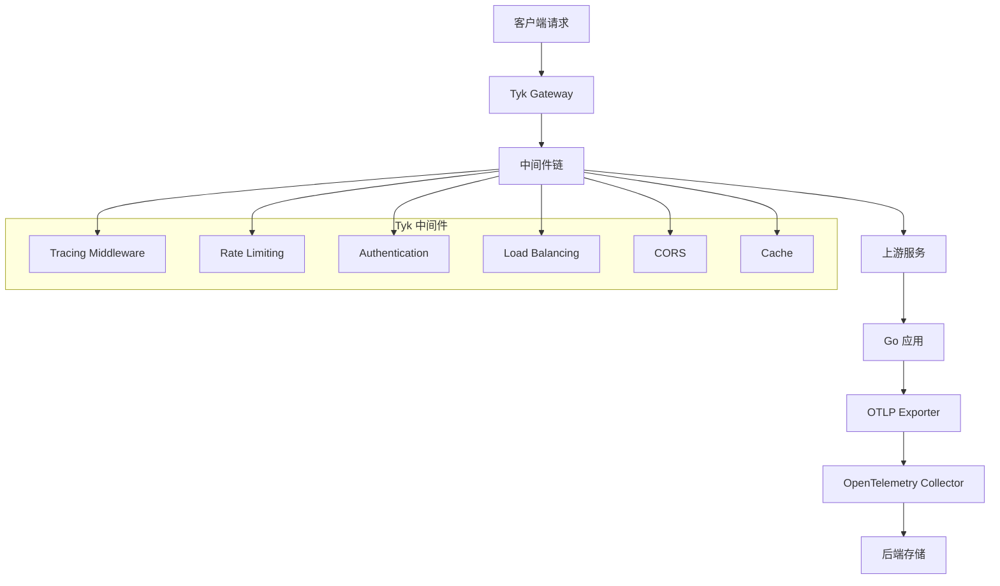

# Tyk 与 OTLP 完整集成指南 2025版

## 概述

Tyk 是一个开源的 API 网关，提供完整的 API 管理解决方案。本指南详细介绍如何在 Go 1.25.1 应用中集成 Tyk 与 OpenTelemetry Protocol (OTLP)，实现完整的 API 网关可观测性。

## 目录

- [Tyk 与 OTLP 完整集成指南 2025版](#tyk-与-otlp-完整集成指南-2025版)
  - [概述](#概述)
  - [目录](#目录)
  - [Tyk 架构概述](#tyk-架构概述)
    - [核心组件](#核心组件)
    - [中间件系统](#中间件系统)
  - [快速开始](#快速开始)
    - [1. Tyk 安装和配置](#1-tyk-安装和配置)
      - [Docker Compose 部署](#docker-compose-部署)
      - [Tyk 配置文件](#tyk-配置文件)
    - [2. OpenTelemetry Collector 配置](#2-opentelemetry-collector-配置)
  - [Tyk 插件配置](#tyk-插件配置)
    - [1. API 定义配置](#1-api-定义配置)
    - [2. 追踪中间件](#2-追踪中间件)
    - [3. Prometheus 中间件](#3-prometheus-中间件)
  - [Go 应用 OTLP 集成](#go-应用-otlp-集成)
    - [1. 基础 HTTP 服务集成](#1-基础-http-服务集成)
    - [2. gRPC 服务集成](#2-grpc-服务集成)
  - [分布式追踪配置](#分布式追踪配置)
    - [1. 追踪上下文传播](#1-追踪上下文传播)
  - [API 网关可观测性](#api-网关可观测性)
    - [1. Tyk 指标监控](#1-tyk-指标监控)
  - [性能优化](#性能优化)
    - [1. 采样策略](#1-采样策略)
  - [生产部署](#生产部署)
    - [1. Docker Compose 部署](#1-docker-compose-部署)
    - [2. Kubernetes 部署](#2-kubernetes-部署)
  - [最佳实践](#最佳实践)
    - [1. 追踪设计原则](#1-追踪设计原则)
    - [2. 性能优化建议](#2-性能优化建议)
  - [总结](#总结)

## Tyk 架构概述

### 核心组件



### 中间件系统

Tyk 提供丰富的中间件生态系统，支持各种可观测性需求：

- **Tracing Middleware**: 分布式追踪支持
- **Prometheus Middleware**: 指标收集
- **Rate Limiting**: 限流控制
- **Authentication**: 身份验证
- **Load Balancing**: 负载均衡
- **Cache**: 缓存支持

## 快速开始

### 1. Tyk 安装和配置

#### Docker Compose 部署

```yaml
# docker-compose.tyk.yml
version: '3.8'

services:
  redis:
    image: redis:7-alpine
    ports:
      - "6379:6379"
    networks:
      - tyk-net

  tyk-gateway:
    image: tykio/tyk-gateway:v5.3.0
    ports:
      - "8080:8080"
    volumes:
      - ./configs/tyk.conf:/opt/tyk-gateway/tyk.conf:ro
    environment:
      - TYK_GW_SECRET=tyk-gateway-secret
    depends_on:
      - redis
    networks:
      - tyk-net

  tyk-dashboard:
    image: tykio/tyk-dashboard:v2.0.0
    ports:
      - "3000:3000"
    volumes:
      - ./configs/tyk-dashboard.conf:/opt/tyk-dashboard/tyk-dashboard.conf:ro
    environment:
      - TYK_DB_TYKGATEWAYCONF=/opt/tyk-dashboard/tyk-dashboard.conf
    depends_on:
      - redis
    networks:
      - tyk-net

  otel-collector:
    image: otel/opentelemetry-collector-contrib:0.88.0
    command: ["--config=/etc/otel-collector-config.yaml"]
    volumes:
      - ./configs/otel-collector-config.yaml:/etc/otel-collector-config.yaml
    ports:
      - "4317:4317"
      - "4318:4318"
    networks:
      - tyk-net

networks:
  tyk-net:
    driver: bridge
```

#### Tyk 配置文件

```json
// configs/tyk.conf
{
  "listen_port": 8080,
  "secret": "tyk-gateway-secret",
  "template_path": "/opt/tyk-gateway/templates",
  "tyk_js_path": "/opt/tyk-gateway/js/tyk.js",
  "middleware_path": "/opt/tyk-gateway/middleware",
  "storage": {
    "type": "redis",
    "host": "redis",
    "port": 6379,
    "optimisation_max_idle": 100,
    "optimisation_max_active": 500
  },
  "enable_analytics": true,
  "analytics_config": {
    "type": "redis",
    "host": "redis",
    "port": 6379
  },
  "health_check": {
    "enable_health_checks": true,
    "health_check_value_timeouts": 60
  },
  "tracing": {
    "enabled": true,
    "jaeger": {
      "enabled": true,
      "endpoint": "http://otel-collector:4317",
      "sampling": {
        "type": "const",
        "param": 1.0
      }
    }
  },
  "monitoring": {
    "enable_analytics": true,
    "analytics_config": {
      "type": "prometheus",
      "prometheus_port": 9090
    }
  }
}
```

### 2. OpenTelemetry Collector 配置

```yaml
# configs/otel-collector-config.yaml
receivers:
  otlp:
    protocols:
      grpc:
        endpoint: 0.0.0.0:4317
      http:
        endpoint: 0.0.0.0:4318

processors:
  batch:
    timeout: 1s
    send_batch_size: 1024
  memory_limiter:
    limit_mib: 512
  resource:
    attributes:
      - key: deployment.environment
        value: production
        action: upsert

exporters:
  jaeger:
    endpoint: jaeger:14250
    tls:
      insecure: true
  prometheus:
    endpoint: "0.0.0.0:8889"
  logging:
    loglevel: debug

service:
  pipelines:
    traces:
      receivers: [otlp]
      processors: [memory_limiter, batch]
      exporters: [jaeger, logging]
    metrics:
      receivers: [otlp]
      processors: [memory_limiter, batch]
      exporters: [prometheus, logging]
```

## Tyk 插件配置

### 1. API 定义配置

```json
// configs/api-definition.json
{
  "name": "User Service API",
  "slug": "user-service",
  "api_id": "user-service",
  "org_id": "1",
  "auth": {
    "auth_header_name": "Authorization"
  },
  "definition": {
    "location": "header",
    "key": "x-api-version"
  },
  "version_data": {
    "not_versioned": true,
    "versions": {
      "Default": {
        "name": "Default",
        "use_extended_paths": true,
        "extended_paths": {
          "ignored": [],
          "white_list": [],
          "black_list": []
        }
      }
    }
  },
  "proxy": {
    "listen_path": "/api/users/",
    "target_url": "http://user-service:8080",
    "strip_listen_path": true
  },
  "active": true,
  "middleware": {
    "pre": [
      {
        "name": "tracing",
        "path": "/opt/tyk-gateway/middleware/tracing.js"
      }
    ],
    "post": [
      {
        "name": "prometheus",
        "path": "/opt/tyk-gateway/middleware/prometheus.js"
      }
    ]
  },
  "config_data": {
    "tracing": {
      "enabled": true,
      "endpoint": "http://otel-collector:4317",
      "sampling": {
        "type": "const",
        "param": 1.0
      }
    }
  }
}
```

### 2. 追踪中间件

```javascript
// middleware/tracing.js
function TracingMiddleware(request, session, spec) {
    // 获取追踪配置
    const tracingConfig = spec.config_data.tracing;
    
    if (!tracingConfig || !tracingConfig.enabled) {
        return;
    }
    
    // 创建追踪上下文
    const traceId = generateTraceId();
    const spanId = generateSpanId();
    
    // 设置追踪头
    request.SetHeaders["X-Trace-ID"] = traceId;
    request.SetHeaders["X-Span-ID"] = spanId;
    
    // 记录请求信息
    const spanData = {
        traceId: traceId,
        spanId: spanId,
        operationName: request.Method + " " + request.URL.Path,
        startTime: Date.now(),
        tags: {
            "http.method": request.Method,
            "http.url": request.URL.String(),
            "http.user_agent": request.Headers["User-Agent"],
            "api.id": spec.APIID,
            "api.name": spec.Name
        }
    };
    
    // 发送到 OTLP Collector
    sendToOTLP(spanData, tracingConfig.endpoint);
    
    return;
}

function generateTraceId() {
    return Math.random().toString(36).substring(2, 15) + 
           Math.random().toString(36).substring(2, 15);
}

function generateSpanId() {
    return Math.random().toString(36).substring(2, 15);
}

function sendToOTLP(spanData, endpoint) {
    // 发送追踪数据到 OTLP Collector
    const payload = JSON.stringify(spanData);
    
    // 这里应该使用 HTTP 客户端发送数据
    // 为了简化，这里只是示例
    console.log("Sending trace data:", payload);
}
```

### 3. Prometheus 中间件

```javascript
// middleware/prometheus.js
function PrometheusMiddleware(request, session, spec) {
    // 记录请求指标
    const metrics = {
        http_requests_total: {
            method: request.Method,
            path: request.URL.Path,
            status: request.ResponseCode,
            api_id: spec.APIID
        },
        http_request_duration_seconds: {
            method: request.Method,
            path: request.URL.Path,
            api_id: spec.APIID
        }
    };
    
    // 发送到 Prometheus
    sendToPrometheus(metrics);
    
    return;
}

function sendToPrometheus(metrics) {
    // 发送指标数据到 Prometheus
    console.log("Sending metrics:", metrics);
}
```

## Go 应用 OTLP 集成

### 1. 基础 HTTP 服务集成

```go
// main.go
package main

import (
    "context"
    "fmt"
    "log"
    "net/http"
    "time"

    "go.opentelemetry.io/otel"
    "go.opentelemetry.io/otel/attribute"
    "go.opentelemetry.io/otel/exporters/otlp/otlptrace/otlptracegrpc"
    "go.opentelemetry.io/otel/propagation"
    "go.opentelemetry.io/otel/sdk/resource"
    sdktrace "go.opentelemetry.io/otel/sdk/trace"
    "go.opentelemetry.io/otel/trace"
)

func initTracer() func() {
    ctx := context.Background()

    // 创建 OTLP 导出器
    exporter, err := otlptracegrpc.New(ctx,
        otlptracegrpc.WithEndpoint("otel-collector:4317"),
        otlptracegrpc.WithInsecure(),
    )
    if err != nil {
        log.Fatalf("Failed to create OTLP exporter: %v", err)
    }

    // 创建资源
    res, err := resource.New(ctx,
        resource.WithAttributes(
            attribute.String("service.name", "user-service"),
            attribute.String("service.version", "1.0.0"),
            attribute.String("deployment.environment", "production"),
        ),
    )
    if err != nil {
        log.Fatalf("Failed to create resource: %v", err)
    }

    // 创建 TracerProvider
    tp := sdktrace.NewTracerProvider(
        sdktrace.WithBatcher(exporter),
        sdktrace.WithResource(res),
        sdktrace.WithSampler(sdktrace.TraceIDRatioBased(1.0)),
    )

    otel.SetTracerProvider(tp)
    otel.SetTextMapPropagator(propagation.NewCompositeTextMapPropagator(
        propagation.TraceContext{},
        propagation.Baggage{},
    ))

    return func() {
        if err := tp.Shutdown(ctx); err != nil {
            log.Printf("Error shutting down tracer provider: %v", err)
        }
    }
}

func main() {
    // 初始化追踪
    cleanup := initTracer()
    defer cleanup()

    // 创建 HTTP 服务器
    mux := http.NewServeMux()
    mux.HandleFunc("/api/users", handleUsers)
    mux.HandleFunc("/health", handleHealth)

    // 添加中间件
    handler := tracingMiddleware(mux)

    log.Println("Starting server on :8080")
    if err := http.ListenAndServe(":8080", handler); err != nil {
        log.Fatalf("Server failed: %v", err)
    }
}

func tracingMiddleware(next http.Handler) http.Handler {
    return http.HandlerFunc(func(w http.ResponseWriter, r *http.Request) {
        // 从请求头中提取追踪上下文
        ctx := otel.GetTextMapPropagator().Extract(r.Context(), propagation.HeaderCarrier(r.Header))
        
        // 创建新的 span
        tracer := otel.Tracer("user-service")
        ctx, span := tracer.Start(ctx, r.URL.Path,
            trace.WithAttributes(
                attribute.String("http.method", r.Method),
                attribute.String("http.url", r.URL.String()),
                attribute.String("http.user_agent", r.UserAgent()),
            ),
        )
        defer span.End()

        // 创建响应写入器来捕获状态码
        ww := &responseWriter{ResponseWriter: w, statusCode: 200}

        // 处理请求
        next.ServeHTTP(ww, r.WithContext(ctx))

        // 设置 span 属性
        span.SetAttributes(
            attribute.Int("http.status_code", ww.statusCode),
            attribute.String("http.route", r.URL.Path),
        )
    })
}

type responseWriter struct {
    http.ResponseWriter
    statusCode int
}

func (rw *responseWriter) WriteHeader(code int) {
    rw.statusCode = code
    rw.ResponseWriter.WriteHeader(code)
}

func handleUsers(w http.ResponseWriter, r *http.Request) {
    ctx := r.Context()
    tracer := otel.Tracer("user-service")
    
    // 创建子 span
    _, span := tracer.Start(ctx, "get-users")
    defer span.End()

    // 模拟数据库查询
    time.Sleep(100 * time.Millisecond)
    
    // 设置响应
    w.Header().Set("Content-Type", "application/json")
    w.WriteHeader(http.StatusOK)
    w.Write([]byte(`{"users": [{"id": 1, "name": "John Doe"}]}`))
    
    span.SetAttributes(
        attribute.Int("users.count", 1),
        attribute.String("response.format", "json"),
    )
}

func handleHealth(w http.ResponseWriter, r *http.Request) {
    w.WriteHeader(http.StatusOK)
    w.Write([]byte("OK"))
}
```

### 2. gRPC 服务集成

```go
// grpc_server.go
package main

import (
    "context"
    "log"
    "net"

    "go.opentelemetry.io/otel"
    "go.opentelemetry.io/otel/attribute"
    "go.opentelemetry.io/otel/codes"
    "go.opentelemetry.io/otel/propagation"
    "go.opentelemetry.io/otel/trace"
    "google.golang.org/grpc"
    "google.golang.org/grpc/metadata"
)

type UserService struct {
    UnimplementedUserServiceServer
}

func (s *UserService) GetUser(ctx context.Context, req *GetUserRequest) (*GetUserResponse, error) {
    tracer := otel.Tracer("user-service")
    
    // 创建 span
    ctx, span := tracer.Start(ctx, "get-user",
        trace.WithAttributes(
            attribute.String("user.id", req.Id),
            attribute.String("grpc.method", "GetUser"),
        ),
    )
    defer span.End()

    // 模拟业务逻辑
    user := &User{
        Id:   req.Id,
        Name: "John Doe",
        Email: "john@example.com",
    }

    span.SetAttributes(
        attribute.String("user.name", user.Name),
        attribute.String("user.email", user.Email),
    )

    return &GetUserResponse{User: user}, nil
}

func grpcTracingInterceptor() grpc.UnaryServerInterceptor {
    return func(ctx context.Context, req interface{}, info *grpc.UnaryServerInfo, handler grpc.UnaryHandler) (interface{}, error) {
        // 从 metadata 中提取追踪上下文
        md, ok := metadata.FromIncomingContext(ctx)
        if ok {
            ctx = otel.GetTextMapPropagator().Extract(ctx, metadataCarrier(md))
        }

        // 创建 span
        tracer := otel.Tracer("user-service")
        ctx, span := tracer.Start(ctx, info.FullMethod,
            trace.WithAttributes(
                attribute.String("grpc.method", info.FullMethod),
                attribute.String("grpc.service", info.Server),
            ),
        )
        defer span.End()

        // 处理请求
        resp, err := handler(ctx, req)
        
        if err != nil {
            span.RecordError(err)
            span.SetStatus(codes.Error, err.Error())
        } else {
            span.SetStatus(codes.Ok, "")
        }

        return resp, err
    }
}

type metadataCarrier metadata.MD

func (mc metadataCarrier) Get(key string) string {
    values := metadata.MD(mc).Get(key)
    if len(values) > 0 {
        return values[0]
    }
    return ""
}

func (mc metadataCarrier) Set(key, value string) {
    metadata.MD(mc).Set(key, value)
}

func (mc metadataCarrier) Keys() []string {
    keys := make([]string, 0, len(metadata.MD(mc)))
    for k := range metadata.MD(mc) {
        keys = append(keys, k)
    }
    return keys
}

func main() {
    // 初始化追踪
    cleanup := initTracer()
    defer cleanup()

    // 创建 gRPC 服务器
    server := grpc.NewServer(
        grpc.UnaryInterceptor(grpcTracingInterceptor()),
    )

    // 注册服务
    RegisterUserServiceServer(server, &UserService{})

    // 启动服务器
    lis, err := net.Listen("tcp", ":9090")
    if err != nil {
        log.Fatalf("Failed to listen: %v", err)
    }

    log.Println("Starting gRPC server on :9090")
    if err := server.Serve(lis); err != nil {
        log.Fatalf("Failed to serve: %v", err)
    }
}
```

## 分布式追踪配置

### 1. 追踪上下文传播

```go
// context_propagation.go
package main

import (
    "context"
    "fmt"
    "net/http"

    "go.opentelemetry.io/otel"
    "go.opentelemetry.io/otel/attribute"
    "go.opentelemetry.io/otel/baggage"
    "go.opentelemetry.io/otel/propagation"
    "go.opentelemetry.io/otel/trace"
)

func propagateContext(ctx context.Context, w http.ResponseWriter, r *http.Request) {
    // 从请求中提取追踪上下文
    ctx = otel.GetTextMapPropagator().Extract(ctx, propagation.HeaderCarrier(r.Header))
    
    // 添加自定义 baggage
    ctx, err := baggage.New(ctx,
        baggage.Member("user.id", "12345"),
        baggage.Member("request.source", "mobile"),
    )
    if err != nil {
        log.Printf("Failed to create baggage: %v", err)
    }

    // 创建 span
    tracer := otel.Tracer("context-propagation")
    ctx, span := tracer.Start(ctx, "process-request",
        trace.WithAttributes(
            attribute.String("http.method", r.Method),
            attribute.String("http.url", r.URL.String()),
        ),
    )
    defer span.End()

    // 处理请求
    processRequest(ctx, w, r)
}

func processRequest(ctx context.Context, w http.ResponseWriter, r *http.Request) {
    // 获取 baggage 信息
    bag := baggage.FromContext(ctx)
    userID := bag.Member("user.id").Value()
    source := bag.Member("request.source").Value()

    // 创建子 span
    tracer := otel.Tracer("context-propagation")
    ctx, span := tracer.Start(ctx, "business-logic",
        trace.WithAttributes(
            attribute.String("user.id", userID),
            attribute.String("request.source", source),
        ),
    )
    defer span.End()

    // 模拟业务逻辑
    result := fmt.Sprintf("Processing request for user %s from %s", userID, source)
    
    w.WriteHeader(http.StatusOK)
    w.Write([]byte(result))
}
```

## API 网关可观测性

### 1. Tyk 指标监控

```go
// metrics.go
package main

import (
    "context"
    "fmt"
    "log"
    "net/http"
    "time"

    "go.opentelemetry.io/otel"
    "go.opentelemetry.io/otel/attribute"
    "go.opentelemetry.io/otel/exporters/prometheus"
    "go.opentelemetry.io/otel/metric"
    "go.opentelemetry.io/otel/sdk/metric"
)

func initMetrics() func() {
    // 创建 Prometheus 导出器
    exporter, err := prometheus.New()
    if err != nil {
        log.Fatalf("Failed to create Prometheus exporter: %v", err)
    }

    // 创建 MeterProvider
    mp := metric.NewMeterProvider(
        metric.WithReader(exporter),
    )

    otel.SetMeterProvider(mp)

    // 启动 Prometheus 服务器
    go func() {
        http.Handle("/metrics", exporter)
        log.Println("Prometheus metrics server starting on :8888")
        if err := http.ListenAndServe(":8888", nil); err != nil {
            log.Printf("Prometheus server failed: %v", err)
        }
    }()

    return func() {
        if err := mp.Shutdown(context.Background()); err != nil {
            log.Printf("Error shutting down meter provider: %v", err)
        }
    }
}

func main() {
    // 初始化指标
    cleanup := initMetrics()
    defer cleanup()

    // 创建指标
    meter := otel.Meter("tyk-gateway")
    
    // 请求计数器
    requestCounter, err := meter.Int64Counter(
        "http_requests_total",
        metric.WithDescription("Total number of HTTP requests"),
    )
    if err != nil {
        log.Fatalf("Failed to create request counter: %v", err)
    }

    // 请求延迟直方图
    requestDuration, err := meter.Float64Histogram(
        "http_request_duration_seconds",
        metric.WithDescription("HTTP request duration in seconds"),
    )
    if err != nil {
        log.Fatalf("Failed to create request duration histogram: %v", err)
    }

    // 创建 HTTP 服务器
    mux := http.NewServeMux()
    mux.HandleFunc("/api/users", func(w http.ResponseWriter, r *http.Request) {
        start := time.Now()
        
        // 记录请求
        requestCounter.Add(context.Background(), 1,
            metric.WithAttributes(
                attribute.String("method", r.Method),
                attribute.String("path", r.URL.Path),
                attribute.String("status", "200"),
            ),
        )

        // 处理请求
        time.Sleep(100 * time.Millisecond)
        w.WriteHeader(http.StatusOK)
        w.Write([]byte(`{"users": []}`))

        // 记录延迟
        duration := time.Since(start).Seconds()
        requestDuration.Record(context.Background(), duration,
            metric.WithAttributes(
                attribute.String("method", r.Method),
                attribute.String("path", r.URL.Path),
            ),
        )
    })

    log.Println("Starting server on :8080")
    if err := http.ListenAndServe(":8080", mux); err != nil {
        log.Fatalf("Server failed: %v", err)
    }
}
```

## 性能优化

### 1. 采样策略

```go
// sampling.go
package main

import (
    "context"
    "log"
    "math/rand"
    "time"

    "go.opentelemetry.io/otel"
    "go.opentelemetry.io/otel/attribute"
    "go.opentelemetry.io/otel/sdk/trace"
    "go.opentelemetry.io/otel/trace"
)

// 自定义采样器
type CustomSampler struct {
    baseSampler trace.Sampler
    rate        float64
}

func NewCustomSampler(rate float64) *CustomSampler {
    return &CustomSampler{
        baseSampler: trace.TraceIDRatioBased(rate),
        rate:        rate,
    }
}

func (s *CustomSampler) ShouldSample(params trace.SamplingParameters) trace.SamplingResult {
    // 对健康检查请求不采样
    if params.Name == "health-check" {
        return trace.SamplingResult{Decision: trace.Drop}
    }
    
    // 对错误请求总是采样
    if params.HasRemoteParent && params.ParentContext.IsValid() {
        if params.ParentContext.TraceID().IsValid() {
            return trace.SamplingResult{Decision: trace.RecordAndSample}
        }
    }
    
    // 使用基础采样器
    return s.baseSampler.ShouldSample(params)
}

func (s *CustomSampler) Description() string {
    return fmt.Sprintf("CustomSampler{rate=%f}", s.rate)
}

func initTracerWithSampling() func() {
    ctx := context.Background()

    // 创建自定义采样器
    sampler := NewCustomSampler(0.1) // 10% 采样率

    // 创建 TracerProvider
    tp := trace.NewTracerProvider(
        trace.WithSampler(sampler),
    )

    otel.SetTracerProvider(tp)

    return func() {
        if err := tp.Shutdown(ctx); err != nil {
            log.Printf("Error shutting down tracer provider: %v", err)
        }
    }
}
```

## 生产部署

### 1. Docker Compose 部署

```yaml
# docker-compose.prod.yml
version: '3.8'

services:
  redis:
    image: redis:7-alpine
    ports:
      - "6379:6379"
    networks:
      - tyk-net
    deploy:
      resources:
        limits:
          memory: 1G
          cpus: '0.5'
        reservations:
          memory: 512M
          cpus: '0.25'

  tyk-gateway:
    image: tykio/tyk-gateway:v5.3.0
    ports:
      - "8080:8080"
    volumes:
      - ./configs/tyk.conf:/opt/tyk-gateway/tyk.conf:ro
      - ./middleware:/opt/tyk-gateway/middleware:ro
    environment:
      - TYK_GW_SECRET=tyk-gateway-secret
    depends_on:
      - redis
    networks:
      - tyk-net
    deploy:
      replicas: 3
      resources:
        limits:
          memory: 2G
          cpus: '1.0'
        reservations:
          memory: 1G
          cpus: '0.5'
      restart_policy:
        condition: on-failure
        delay: 5s
        max_attempts: 3

  tyk-dashboard:
    image: tykio/tyk-dashboard:v2.0.0
    ports:
      - "3000:3000"
    volumes:
      - ./configs/tyk-dashboard.conf:/opt/tyk-dashboard/tyk-dashboard.conf:ro
    environment:
      - TYK_DB_TYKGATEWAYCONF=/opt/tyk-dashboard/tyk-dashboard.conf
    depends_on:
      - redis
    networks:
      - tyk-net
    deploy:
      resources:
        limits:
          memory: 1G
          cpus: '0.5'
        reservations:
          memory: 512M
          cpus: '0.25'

  otel-collector:
    image: otel/opentelemetry-collector-contrib:0.88.0
    command: ["--config=/etc/otel-collector-config.yaml"]
    volumes:
      - ./configs/otel-collector-config.yaml:/etc/otel-collector-config.yaml
    ports:
      - "4317:4317"
      - "4318:4318"
    networks:
      - tyk-net
    deploy:
      replicas: 2
      resources:
        limits:
          memory: 1G
          cpus: '0.5'
        reservations:
          memory: 512M
          cpus: '0.25'
      restart_policy:
        condition: on-failure
        delay: 5s
        max_attempts: 3

networks:
  tyk-net:
    driver: bridge
```

### 2. Kubernetes 部署

```yaml
# k8s/tyk-deployment.yaml
apiVersion: apps/v1
kind: Deployment
metadata:
  name: tyk-gateway
  namespace: tyk
spec:
  replicas: 3
  selector:
    matchLabels:
      app: tyk-gateway
  template:
    metadata:
      labels:
        app: tyk-gateway
    spec:
      containers:
      - name: tyk-gateway
        image: tykio/tyk-gateway:v5.3.0
        ports:
        - containerPort: 8080
          name: gateway
        env:
        - name: TYK_GW_SECRET
          value: "tyk-gateway-secret"
        resources:
          requests:
            memory: "1Gi"
            cpu: "500m"
          limits:
            memory: "2Gi"
            cpu: "1000m"
        livenessProbe:
          httpGet:
            path: /health
            port: 8080
          initialDelaySeconds: 30
          periodSeconds: 10
        readinessProbe:
          httpGet:
            path: /health
            port: 8080
          initialDelaySeconds: 5
          periodSeconds: 5
---
apiVersion: v1
kind: Service
metadata:
  name: tyk-gateway
  namespace: tyk
spec:
  selector:
    app: tyk-gateway
  ports:
  - name: gateway
    port: 8080
    targetPort: 8080
  type: LoadBalancer
---
apiVersion: autoscaling/v2
kind: HorizontalPodAutoscaler
metadata:
  name: tyk-gateway-hpa
  namespace: tyk
spec:
  scaleTargetRef:
    apiVersion: apps/v1
    kind: Deployment
    name: tyk-gateway
  minReplicas: 3
  maxReplicas: 10
  metrics:
  - type: Resource
    resource:
      name: cpu
      target:
        type: Utilization
        averageUtilization: 70
  - type: Resource
    resource:
      name: memory
      target:
        type: Utilization
        averageUtilization: 80
```

## 最佳实践

### 1. 追踪设计原则

```go
// tracing_principles.go
package main

import (
    "context"
    "log"
    "net/http"
    "time"

    "go.opentelemetry.io/otel"
    "go.opentelemetry.io/otel/attribute"
    "go.opentelemetry.io/otel/trace"
)

// 1. 合理的 Span 命名
func handleUserRequest(w http.ResponseWriter, r *http.Request) {
    ctx := r.Context()
    tracer := otel.Tracer("user-service")
    
    // 好的命名：动词 + 名词
    ctx, span := tracer.Start(ctx, "get-user-profile")
    defer span.End()
    
    // 避免：过于宽泛或过于具体
    // ctx, span := tracer.Start(ctx, "request") // 太宽泛
    // ctx, span := tracer.Start(ctx, "get-user-profile-from-database-by-id-12345") // 太具体
}

// 2. 合理的属性设置
func processOrder(ctx context.Context, orderID string) error {
    tracer := otel.Tracer("order-service")
    ctx, span := tracer.Start(ctx, "process-order")
    defer span.End()
    
    // 好的属性：业务相关的关键信息
    span.SetAttributes(
        attribute.String("order.id", orderID),
        attribute.String("order.status", "processing"),
        attribute.String("user.id", getUserID(ctx)),
    )
    
    // 避免：过多的技术细节
    // span.SetAttributes(
    //     attribute.String("database.connection.pool.size", "10"),
    //     attribute.String("http.client.timeout", "30s"),
    // )
    
    return nil
}

// 3. 错误处理
func callExternalAPI(ctx context.Context, url string) error {
    tracer := otel.Tracer("external-api")
    ctx, span := tracer.Start(ctx, "call-external-api")
    defer span.End()
    
    span.SetAttributes(
        attribute.String("external.api.url", url),
    )
    
    // 模拟 API 调用
    if time.Now().Unix()%2 == 0 {
        err := fmt.Errorf("external API error")
        span.RecordError(err)
        span.SetStatus(trace.StatusError, err.Error())
        return err
    }
    
    span.SetStatus(trace.StatusOk, "success")
    return nil
}
```

### 2. 性能优化建议

```go
// performance_optimization.go
package main

import (
    "context"
    "log"
    "net/http"
    "sync"
    "time"

    "go.opentelemetry.io/otel"
    "go.opentelemetry.io/otel/attribute"
    "go.opentelemetry.io/otel/trace"
)

// 1. 避免创建过多的 Span
func inefficientTracing(w http.ResponseWriter, r *http.Request) {
    ctx := r.Context()
    tracer := otel.Tracer("inefficient")
    
    // 避免：为每个小操作创建 span
    for i := 0; i < 100; i++ {
        ctx, span := tracer.Start(ctx, "small-operation")
        // 小操作
        time.Sleep(1 * time.Millisecond)
        span.End()
    }
}

func efficientTracing(w http.ResponseWriter, r *http.Request) {
    ctx := r.Context()
    tracer := otel.Tracer("efficient")
    
    // 好的做法：为整个操作创建一个 span
    ctx, span := tracer.Start(ctx, "batch-operation")
    defer span.End()
    
    // 批量处理
    for i := 0; i < 100; i++ {
        // 小操作
        time.Sleep(1 * time.Millisecond)
    }
    
    span.SetAttributes(
        attribute.Int("operations.count", 100),
        attribute.Int("total.duration_ms", 100),
    )
}

// 2. 使用异步导出
func initTracerWithAsyncExport() func() {
    ctx := context.Background()
    
    // 创建异步导出器
    exporter, err := otlptracegrpc.New(ctx,
        otlptracegrpc.WithEndpoint("otel-collector:4317"),
        otlptracegrpc.WithInsecure(),
    )
    if err != nil {
        log.Fatalf("Failed to create OTLP exporter: %v", err)
    }
    
    // 使用批量导出器
    tp := sdktrace.NewTracerProvider(
        sdktrace.WithBatcher(exporter,
            sdktrace.WithBatchTimeout(5*time.Second),
            sdktrace.WithMaxExportBatchSize(512),
            sdktrace.WithMaxQueueSize(2048),
        ),
    )
    
    otel.SetTracerProvider(tp)
    
    return func() {
        tp.Shutdown(ctx)
    }
}

// 3. 缓存 Tracer
var (
    tracerOnce sync.Once
    cachedTracer trace.Tracer
)

func getTracer() trace.Tracer {
    tracerOnce.Do(func() {
        cachedTracer = otel.Tracer("cached-tracer")
    })
    return cachedTracer
}

func useCachedTracer(ctx context.Context) {
    tracer := getTracer()
    ctx, span := tracer.Start(ctx, "cached-tracer-operation")
    defer span.End()
    
    // 使用缓存的 tracer
}
```

## 总结

本指南详细介绍了如何在 Go 1.25.1 应用中集成 Tyk 与 OpenTelemetry Protocol (OTLP)，包括：

1. **Tyk 架构和中间件系统**：了解 Tyk 的核心组件和可观测性中间件
2. **快速开始**：Docker Compose 部署和基础配置
3. **Go 应用集成**：HTTP 和 gRPC 服务的 OTLP 集成
4. **分布式追踪**：上下文传播和跨服务追踪
5. **可观测性**：指标监控和健康检查
6. **性能优化**：采样策略、批量导出和资源限制
7. **生产部署**：Docker Compose 和 Kubernetes 部署
8. **最佳实践**：追踪设计、性能优化和安全考虑

通过本指南，您可以构建一个完整的、可观测的 API 网关系统，实现端到端的分布式追踪和监控。
