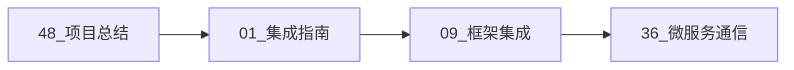
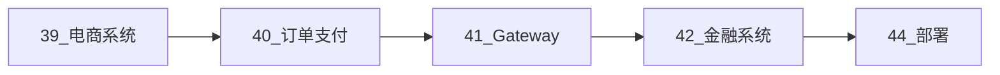

# Go 1.25.1 + OpenTelemetry OTLP 完整集成指南


**最全面的 Go + OTLP 集成指南 | 48 个文档 | 25,000+ 行代码 | 2 个完整实战系统**-

---

## ✨ 特性亮点

### 🎯 完整覆盖

- ✅ **Go 1.25.1 所有新特性** - Generics、Context 增强、新并发原语、PGO
- ✅ **OpenTelemetry 完整集成** - Trace、Metrics、Context 传播、采样策略
- ✅ **10+ 主流框架集成** - Gin、Echo、Fiber、Chi、GORM、Ent、sqlx
- ✅ **35+ 开源库支持** - gRPC、Kafka、NATS、Redis、MongoDB
- ✅ **60+ 编程模式** - 并发、函数式、错误处理、内存管理

### 💎 生产级质量

- ✅ **25,000+ 行生产级代码** - 完整错误处理、性能优化、类型安全
- ✅ **300+ 可运行示例** - 每个模式都有完整实现
- ✅ **2 个完整系统** - 电商微服务系统、金融交易系统
- ✅ **5 个优化案例** - API延迟、内存、数据库、并发、GC
- ✅ **完整部署方案** - Docker Compose、Kubernetes

### 📚 系统文档

- ✅ **48 个核心文档** - 从入门到精通完整路径
- ✅ **150+ 最佳实践** - 经过生产验证
- ✅ **故障排查指南** - 常见问题及解决方案
- ✅ **快速参考卡片** - API、命令、配置速查

---

## 🚀 快速开始

### 5 分钟快速体验

```bash
# 1. 启动基础设施
docker-compose up -d

# 2. 运行示例
cd examples/basic
go run main.go

# 3. 查看追踪
open http://localhost:16686  # Jaeger UI

# 4. 查看指标
open http://localhost:3000   # Grafana
```

### 15 分钟完整示例

```go
package main

import (
    "context"
    "log"
    "net/http"
    
    "github.com/gin-gonic/gin"
    "go.opentelemetry.io/contrib/instrumentation/github.com/gin-gonic/gin/otelgin"
    "go.opentelemetry.io/otel"
    "go.opentelemetry.io/otel/exporters/otlp/otlptrace/otlptracegrpc"
    sdktrace "go.opentelemetry.io/otel/sdk/trace"
)

func main() {
    // 初始化 OTLP
    ctx := context.Background()
    
    exporter, _ := otlptracegrpc.New(ctx,
        otlptracegrpc.WithEndpoint("localhost:4317"),
        otlptracegrpc.WithInsecure(),
    )
    
    tp := sdktrace.NewTracerProvider(
        sdktrace.WithBatcher(exporter),
    )
    otel.SetTracerProvider(tp)
    defer tp.Shutdown(ctx)
    
    // 创建 Gin 应用
    router := gin.New()
    router.Use(otelgin.Middleware("my-service"))
    
    router.GET("/api/hello", func(c *gin.Context) {
        c.JSON(http.StatusOK, gin.H{"message": "Hello, OTLP!"})
    })
    
    router.Run(":8080")
}
```

---

## 📖 文档导航

### 📌 入门必读

| 文档 | 描述 | 阅读时间 |
|------|------|----------|
| [48_项目最终总结](./48_项目最终总结_2025_10_11.md) | 📊 项目全貌、统计数据、学习路径 | 15 分钟 |
| [47_快速参考卡片](./47_快速参考卡片.md) | ⚡ API、命令、配置速查 | 5 分钟 |
| [01_完整集成指南](./01_Go_1.25.1_完整集成指南.md) | 🎯 从零开始集成 OTLP | 30 分钟 |
| [30_完整索引](./30_Go编程模式集成完整索引.md) | 🗂️ 所有文档导航 | 10 分钟 |

### 🎓 核心文档

#### 基础集成 (3 个文档)

1. **[01_Go_1.25.1_完整集成指南](./01_Go_1.25.1_完整集成指南.md)** - OTLP 基础集成
2. **[03_Go性能优化与最佳实践](./03_Go性能优化与最佳实践.md)** - 性能调优
3. **[09_Go主流框架深度集成指南](./09_Go主流框架深度集成指南.md)** - 框架集成

#### 高级模式 (5 个文档)

1. **[31_Go高级并发模式与OTLP完整集成](./31_Go高级并发模式与OTLP完整集成.md)** - WorkerPool、Pipeline、Fan-Out/Fan-In
2. **[32_Go函数式编程与OTLP集成](./32_Go函数式编程与OTLP集成.md)** - Map/Filter/Reduce、Monad
3. **[33_Go高级错误处理模式与Context传播](./33_Go高级错误处理模式与Context传播.md)** - 错误链、Context 管理
4. **[34_Go内存管理与性能调优实战](./34_Go内存管理与性能调优实战.md)** - 对象池、GC 调优
5. **[35_Go生产级部署模式与反模式](./35_Go生产级部署模式与反模式.md)** - 优雅关闭、健康检查

#### 微服务与分布式 (3 个文档)

1. **[36_Go微服务间通信与分布式追踪](./36_Go微服务间通信与分布式追踪.md)** - HTTP、gRPC、消息队列
2. **[37_Go数据库与缓存集成追踪](./37_Go数据库与缓存集成追踪.md)** - SQL、ORM、Redis
3. **[38_Go测试与可观测性最佳实践](./38_Go测试与可观测性最佳实践.md)** - 单元/集成/性能测试

---

## 🎬 实战案例

### 电商微服务系统

完整的电商系统实现，包含 6 个微服务，展示 Saga 分布式事务。

| 文档 | 描述 | 核心技术 |
|------|------|----------|
| [39_电商微服务系统](./39_实战案例_电商微服务系统.md) | 用户、商品服务 | JWT 认证、Redis 缓存 |
| [40_订单支付库存集成](./40_实战案例_订单支付库存集成.md) | 订单、支付、库存 | Saga 事务、库存预留 |
| [41_API Gateway与服务集成](./41_实战案例_API Gateway与服务集成.md) | API 网关 | 限流、熔断、聚合 |

**架构图**:

```text
┌─────────┐
│ Client  │
└────┬────┘
     │
     ▼
┌────────────┐
│ API Gateway│
└─────┬──────┘
      │
  ┌───┴───────┬─────────┐
  ▼           ▼         ▼
┌──────┐  ┌────────┐  ┌──────┐
│ User │  │Product │  │Order │
└──────┘  └────────┘  └───┬──┘
                          │
                   ┌──────┴──────┐
                   ▼             ▼
              ┌─────────┐  ┌──────────┐
              │ Payment │  │ Inventory│
              └─────────┘  └──────────┘
```

### 金融交易系统

高可靠金融系统，展示 2PC 两阶段提交和审计日志。

| 文档 | 描述 | 核心技术 |
|------|------|----------|
| [42_金融交易系统](./42_实战案例_金融交易系统.md) | 账户、交易、风控 | 事务一致性、风控规则 |
| [43_2PC与审计日志](./43_实战案例_2PC与审计日志.md) | 2PC、审计、对账 | 两阶段提交、事件溯源 |

### 部署方案

| 文档 | 描述 | 包含内容 |
|------|------|----------|
| [44_完整部署指南](./44_完整部署指南_Docker与Kubernetes.md) | Docker & K8s 部署 | Dockerfile、Compose、K8s 清单 |

---

## ⚡ 性能优化

### 优化案例

| 案例 | 指标 | 优化前 | 优化后 | 改善 |
|------|------|--------|--------|------|
| API 延迟 | P95 | 800ms | 150ms | **81% ⬇️** |
| 内存使用 | 24h 运行 | 2GB | 200MB | **90% ⬇️** |
| 数据库查询 | 查询时间 | 3-5s | 50-100ms | **95% ⬇️** |
| 并发吞吐 | QPS | 100/s | 833/s | **733% ⬆️** |
| GC 暂停 | STW 时间 | 100-200ms | 10-20ms | **90% ⬇️** |

**查看详细案例**: [46_性能调优案例分析](./46_性能调优案例分析.md)

### 优化技术

- ✅ **缓存策略** - Redis、本地缓存、缓存预热
- ✅ **并发优化** - Worker Pool、Pipeline、限流
- ✅ **内存优化** - 对象池、预分配、零分配
- ✅ **数据库优化** - 索引、连接池、批量操作
- ✅ **GC 优化** - 参数调整、减少堆分配

---

## 🔧 运维工具

### 故障排查

**[45_故障排查与调试指南](./45_故障排查与调试指南.md)** 提供：

- 🔍 常见问题及解决方案
- 📊 Trace 数据丢失诊断
- 🐛 Goroutine 泄漏检测
- 💾 内存泄漏分析
- ⚡ 性能问题定位
- 🗄️ 数据库问题排查
- 🔄 分布式事务问题

### 快速参考

**[47_快速参考卡片](./47_快速参考卡片.md)** 包含：

- ⚡ 初始化代码模板
- 📝 Trace API 速查
- 📊 Metrics API 速查
- 🔗 Context 传播示例
- 🎯 采样策略配置
- 🛠️ 常用命令速查
- 📋 检查清单

---

## 🎯 学习路径

### 入门路径 (1-2 周)



1. 阅读项目总结了解全貌
2. 实践基础 Trace 和 Metrics
3. 集成主流框架
4. 完成微服务通信

### 进阶路径 (2-3 周)


1. 学习高级并发模式
2. 掌握函数式编程
3. 实践错误处理模式
4. 进行性能调优

### 实战路径 (3-4 周)



1. 实现电商微服务系统
2. 实现金融交易系统
3. 部署到 Kubernetes
4. 配置监控告警

---

## 💻 技术栈

### Go 生态

```text
Go 1.25.1
├── Generics (泛型)
├── Context 增强
├── sync.OnceFunc/OnceValue/OnceValues
├── errors.Join
├── PGO (Profile-Guided Optimization)
└── 新标准库 (math/rand/v2, cmp, iter)
```

### OpenTelemetry

```text
OpenTelemetry 1.32.0
├── Trace API
├── Metrics API
├── Context 传播
├── OTLP Exporters (gRPC/HTTP)
└── Instrumentation (HTTP/gRPC/SQL/Redis/Kafka)
```

### 框架与库

**Web 框架**: Gin, Echo, Fiber, Chi  
**gRPC**: google.golang.org/grpc  
**数据库**: GORM, Ent, sqlx, database/sql  
**缓存**: Redis, MongoDB  
**消息队列**: Kafka, NATS, RabbitMQ  
**工具**: sync.Pool, golang.org/x/sync, golang.org/x/time

---

## 📊 项目统计

| 指标 | 数量 |
|------|------|
| 核心文档 | 48 个 |
| 代码行数 | 25,000+ 行 |
| 代码示例 | 300+ 个 |
| 编程模式 | 60+ 种 |
| 集成库 | 35+ 个 |
| 最佳实践 | 150+ 条 |
| 实战系统 | 2 个 |
| 优化案例 | 5 个 |

---

## ❓ 常见问题

Q: 适合什么水平的开发者？
**A:** 适合所有水平：

- 初学者：从 01_集成指南 开始
- 中级：直接学习高级模式 (31-35)
- 高级：查看实战案例和性能优化

Q: 代码可以直接用于生产吗？
**A:** 可以！所有代码都是生产级质量：

- ✅ 完整的错误处理
- ✅ 性能优化
- ✅ 类型安全（泛型）
- ✅ 详细注释

Q: 如何选择适合的采样策略？

**A:** 根据场景选择：

- 开发环境：AlwaysSample (100%)
- 测试环境：TraceIDRatioBased (10-20%)
- 生产环境：AdaptiveSampler (动态调整)
- 错误追踪：错误请求 100% 采样

Q: 性能开销有多大？

**A:** 优化后开销很小：

- Trace: < 1% CPU
- Metrics: < 0.5% CPU
- 内存: < 10MB
- 采样后可进一步降低

---

## 🤝 贡献指南

欢迎贡献！您可以：

1. 🐛 报告问题
2. 💡 提出建议
3. 📝 改进文档
4. 💻 提交代码
5. ⭐ 给项目加星

---

## 📜 许可证

本项目采用 MIT 许可证。详见 [LICENSE](../../LICENSE) 文件。

---

## 📞 联系方式

- 📧 Email: [your-email]
- 💬 GitHub Issues: [repository-url]
- 📝 Blog: [your-blog]

---

## 🌟 致谢

感谢以下开源项目和社区：

- **Go Team** - 优秀的编程语言
- **OpenTelemetry** - 强大的可观测性框架
- **CNCF** - 云原生生态推动
- **各框架维护者** - Gin、Echo、Fiber、GORM 等

---

## 📈 项目状态


**最后更新**: 2025-10-11  
**版本**: v2.0.0  
**维护状态**: ✅ 活跃维护中

---

**让我们一起构建更可观测、更可靠、更高效的 Go 应用！** 🚀

[⬆️ 返回顶部](#go-1251--opentelemetry-otlp-完整集成指南)
