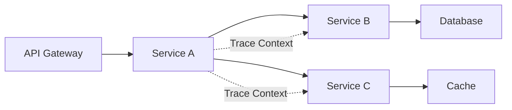
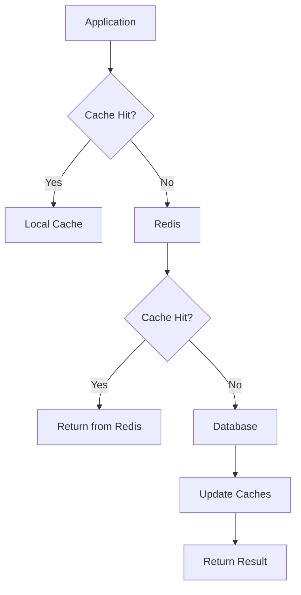
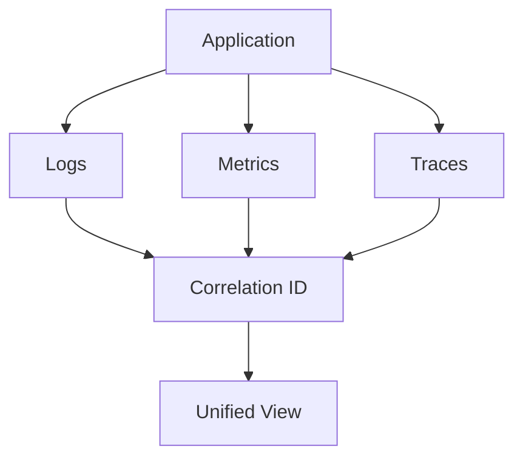

# Go 编程模式与 OTLP 集成完整指南

## 📋 目录

- [Go 编程模式与 OTLP 集成完整指南](#go-编程模式与-otlp-集成完整指南)
  - [📋 目录](#-目录)
  - [📖 简介](#-简介)
  - [🎯 目标读者](#-目标读者)
  - [📚 文档结构](#-文档结构)
    - [入口文档](#入口文档)
    - [基础集成（3 个文档）](#基础集成3-个文档)
    - [高级编程模式（5 个文档）](#高级编程模式5-个文档)
    - [微服务与分布式（1 个文档）](#微服务与分布式1-个文档)
    - [数据层集成（1 个文档）](#数据层集成1-个文档)
    - [测试与可观测性（1 个文档）](#测试与可观测性1-个文档)
    - [框架集成（2 个文档）](#框架集成2-个文档)
  - [🚀 快速开始](#-快速开始)
    - [1. 安装依赖](#1-安装依赖)
    - [2. 基础初始化](#2-基础初始化)
    - [3. 运行示例](#3-运行示例)
  - [📖 学习路径](#-学习路径)
    - [🎯 初学者路径（3 周）](#-初学者路径3-周)
      - [第一周：基础集成](#第一周基础集成)
      - [第二周：框架集成](#第二周框架集成)
      - [第三周：性能优化](#第三周性能优化)
    - [🚀 中级开发者路径（3 周）](#-中级开发者路径3-周)
      - [第四周：高级并发](#第四周高级并发)
      - [第五周：函数式编程](#第五周函数式编程)
      - [第六周：错误处理](#第六周错误处理)
    - [💎 高级开发者路径（3 周）](#-高级开发者路径3-周)
      - [第七周：内存管理](#第七周内存管理)
      - [第八周：生产部署](#第八周生产部署)
      - [第九周：微服务与数据层](#第九周微服务与数据层)
  - [🔑 核心概念](#-核心概念)
    - [1. Trace（追踪）](#1-trace追踪)
    - [2. Metric（指标）](#2-metric指标)
    - [3. Context 传播](#3-context-传播)
  - [🛠️ 核心模式](#️-核心模式)
    - [1. 并发模式](#1-并发模式)
    - [2. 函数式模式](#2-函数式模式)
    - [3. 错误处理模式](#3-错误处理模式)
  - [📊 性能优化](#-性能优化)
    - [1. 采样策略](#1-采样策略)
    - [2. 内存优化](#2-内存优化)
    - [3. 批处理优化](#3-批处理优化)
  - [🏗️ 架构模式](#️-架构模式)
    - [1. 微服务追踪](#1-微服务追踪)
    - [2. 数据层追踪](#2-数据层追踪)
    - [3. 可观测性三支柱](#3-可观测性三支柱)
  - [📈 监控指标](#-监控指标)
    - [关键指标](#关键指标)
  - [🔧 工具链](#-工具链)
    - [开发工具](#开发工具)
    - [测试工具](#测试工具)
  - [📋 最佳实践清单](#-最佳实践清单)
    - [✅ DO（推荐做法）](#-do推荐做法)
    - [❌ DON'T（不推荐做法）](#-dont不推荐做法)
  - [📚 参考资源](#-参考资源)
    - [官方文档](#官方文档)
    - [社区资源](#社区资源)
  - [🤝 贡献指南](#-贡献指南)
  - [📝 许可证](#-许可证)
  - [📞 联系方式](#-联系方式)
  - [🎉 致谢](#-致谢)

## 📖 简介

本指南提供了 Go 编程模式与 OpenTelemetry OTLP 集成的完整解决方案，涵盖从基础到高级的所有内容。
基于 Go 1.25.1 和最新的 OpenTelemetry 库（v1.32.0），包含 200+ 个生产级代码示例和 100+ 条最佳实践建议。

## 🎯 目标读者

- **初学者** - 刚接触 OpenTelemetry 和可观测性的 Go 开发者
- **中级开发者** - 需要深入理解高级模式和性能优化的开发者
- **高级开发者** - 寻求生产级部署和架构设计最佳实践的架构师

## 📚 文档结构

### 入口文档

📌 **[30_Go编程模式集成完整索引](./30_Go编程模式集成完整索引.md)** - 所有文档的总索引和导航

### 基础集成（3 个文档）

| 文档 | 描述 | 难度 |
|------|------|------|
| [00_Go编程模式集成总结](./00_Go编程模式集成总结_2025_10_09.md) | 总体概览、依赖版本、快速开始 | ⭐ |
| [01_Go_1.25.1_完整集成指南](./01_Go_1.25.1_完整集成指南.md) | 初始化配置、Trace、Metric、Context | ⭐ |
| [03_Go性能优化与最佳实践](./03_Go性能优化与最佳实践.md) | 内存优化、GC 调优、采样策略 | ⭐⭐ |

### 高级编程模式（5 个文档）

| 文档 | 描述 | 难度 |
|------|------|------|
| [31_Go高级并发模式与OTLP完整集成](./31_Go高级并发模式与OTLP完整集成.md) | TracedChannel、WorkerPool、Pipeline、Fan-Out/Fan-In | ⭐⭐⭐ |
| [32_Go函数式编程与OTLP集成](./32_Go函数式编程与OTLP集成.md) | Map/Filter/Reduce、高阶函数、Monad、函数组合 | ⭐⭐⭐ |
| [33_Go高级错误处理模式与Context传播](./33_Go高级错误处理模式与Context传播.md) | TracedError、Context 取消、超时管理、恢复策略 | ⭐⭐⭐ |
| [34_Go内存管理与性能调优实战](./34_Go内存管理与性能调优实战.md) | 对象池、GC 调优、零分配技术 | ⭐⭐⭐⭐ |
| [35_Go生产级部署模式与反模式](./35_Go生产级部署模式与反模式.md) | 优雅关闭、健康检查、Kubernetes 部署 | ⭐⭐⭐ |

### 微服务与分布式（1 个文档）

| 文档 | 描述 | 难度 |
|------|------|------|
| [36_Go微服务间通信与分布式追踪](./36_Go微服务间通信与分布式追踪.md) | HTTP、gRPC、Kafka、NATS、Saga、2PC | ⭐⭐⭐⭐ |

### 数据层集成（1 个文档）

| 文档 | 描述 | 难度 |
|------|------|------|
| [37_Go数据库与缓存集成追踪](./37_Go数据库与缓存集成追踪.md) | SQL、NoSQL、ORM、Redis、连接池监控 | ⭐⭐⭐ |

### 测试与可观测性（1 个文档）

| 文档 | 描述 | 难度 |
|------|------|------|
| [38_Go测试与可观测性最佳实践](./38_Go测试与可观测性最佳实践.md) | 单元测试、集成测试、性能测试、混沌工程 | ⭐⭐⭐⭐ |

### 框架集成（2 个文档）

| 文档 | 描述 | 难度 |
|------|------|------|
| [09_Go主流框架深度集成指南](./09_Go主流框架深度集成指南.md) | Gin、Echo、Fiber、Chi | ⭐⭐ |
| [04_Go_HTTP_2_3完整集成方案](./04_Go_HTTP_2_3完整集成方案.md) | HTTP/2、HTTP/3、QUIC | ⭐⭐⭐ |

## 🚀 快速开始

### 1. 安装依赖

```bash
# 核心依赖
go get go.opentelemetry.io/otel@v1.32.0
go get go.opentelemetry.io/otel/sdk@v1.32.0
go get go.opentelemetry.io/otel/exporters/otlp/otlptrace/otlptracegrpc@v1.32.0
go get go.opentelemetry.io/otel/exporters/otlp/otlpmetric/otlpmetricgrpc@v1.32.0

# Instrumentation 库
go get go.opentelemetry.io/contrib/instrumentation/net/http/otelhttp@v0.57.0
go get go.opentelemetry.io/contrib/instrumentation/google.golang.org/grpc/otelgrpc@v0.57.0
```

### 2. 基础初始化

```go
package main

import (
    "context"
    "log"

    "go.opentelemetry.io/otel"
    "go.opentelemetry.io/otel/exporters/otlp/otlptrace/otlptracegrpc"
    "go.opentelemetry.io/otel/propagation"
    "go.opentelemetry.io/otel/sdk/resource"
    sdktrace "go.opentelemetry.io/otel/sdk/trace"
    semconv "go.opentelemetry.io/otel/semconv/v1.26.0"
)

func initTracing(ctx context.Context) (*sdktrace.TracerProvider, error) {
    // 1. 创建 Exporter
    exporter, err := otlptracegrpc.New(ctx,
        otlptracegrpc.WithEndpoint("localhost:4317"),
        otlptracegrpc.WithInsecure(),
    )
    if err != nil {
        return nil, err
    }

    // 2. 创建 Resource
    res, err := resource.New(ctx,
        resource.WithAttributes(
            semconv.ServiceName("my-service"),
            semconv.ServiceVersion("1.0.0"),
        ),
    )
    if err != nil {
        return nil, err
    }

    // 3. 创建 TracerProvider
    tp := sdktrace.NewTracerProvider(
        sdktrace.WithBatcher(exporter),
        sdktrace.WithResource(res),
        sdktrace.WithSampler(sdktrace.AlwaysSample()),
    )

    // 4. 设置全局 TracerProvider
    otel.SetTracerProvider(tp)

    // 5. 设置 Propagator
    otel.SetTextMapPropagator(propagation.TraceContext{})

    return tp, nil
}

func main() {
    ctx := context.Background()

    // 初始化追踪
    tp, err := initTracing(ctx)
    if err != nil {
        log.Fatal(err)
    }
    defer tp.Shutdown(ctx)

    // 使用追踪
    tracer := otel.Tracer("my-service")
    ctx, span := tracer.Start(ctx, "main")
    defer span.End()

    // 业务逻辑
    log.Println("Hello, OTLP!")
}
```

### 3. 运行示例

```bash
# 启动 OTLP Collector
docker run -d --name otel-collector \
  -p 4317:4317 \
  -p 4318:4318 \
  otel/opentelemetry-collector:latest

# 运行应用
go run main.go
```

## 📖 学习路径

### 🎯 初学者路径（3 周）

#### 第一周：基础集成

- ✅ 阅读 [01_Go_1.25.1_完整集成指南](./01_Go_1.25.1_完整集成指南.md)
- ✅ 运行基础示例
- ✅ 理解 Trace 和 Metric 概念
- ✅ 实现简单的 HTTP 服务追踪

#### 第二周：框架集成

- ✅ 阅读 [09_Go主流框架深度集成指南](./09_Go主流框架深度集成指南.md)
- ✅ 选择一个框架（Gin/Echo/Fiber）深入实践
- ✅ 实现完整的 Web 服务
- ✅ 添加中间件和错误处理

#### 第三周：性能优化

- ✅ 阅读 [03_Go性能优化与最佳实践](./03_Go性能优化与最佳实践.md)
- ✅ 学习采样策略
- ✅ 进行性能测试
- ✅ 优化内存和 GC

### 🚀 中级开发者路径（3 周）

#### 第四周：高级并发

- ✅ 阅读 [31_Go高级并发模式与OTLP完整集成](./31_Go高级并发模式与OTLP完整集成.md)
- ✅ 实现 TracedChannel
- ✅ 实现 WorkerPool
- ✅ 实现 Pipeline

#### 第五周：函数式编程

- ✅ 阅读 [32_Go函数式编程与OTLP集成](./32_Go函数式编程与OTLP集成.md)
- ✅ 实现 Map/Filter/Reduce
- ✅ 实现 Middleware Chain
- ✅ 实现 Monad 模式

#### 第六周：错误处理

- ✅ 阅读 [33_Go高级错误处理模式与Context传播](./33_Go高级错误处理模式与Context传播.md)
- ✅ 实现 TracedError
- ✅ 实现 Context 管理
- ✅ 实现恢复策略

### 💎 高级开发者路径（3 周）

#### 第七周：内存管理

- ✅ 阅读 [34_Go内存管理与性能调优实战](./34_Go内存管理与性能调优实战.md)
- ✅ 实现对象池
- ✅ 进行 GC 调优
- ✅ 应用零分配技术

#### 第八周：生产部署

- ✅ 阅读 [35_Go生产级部署模式与反模式](./35_Go生产级部署模式与反模式.md)
- ✅ 实现优雅关闭
- ✅ 实现健康检查
- ✅ 配置 Kubernetes 部署

#### 第九周：微服务与数据层

- ✅ 阅读 [36_Go微服务间通信与分布式追踪](./36_Go微服务间通信与分布式追踪.md)
- ✅ 阅读 [37_Go数据库与缓存集成追踪](./37_Go数据库与缓存集成追踪.md)
- ✅ 实现分布式追踪
- ✅ 集成数据库和缓存

## 🔑 核心概念

### 1. Trace（追踪）

追踪记录请求在系统中的完整路径，包含多个 Span。

```go
tracer := otel.Tracer("my-service")
ctx, span := tracer.Start(ctx, "operation-name")
defer span.End()

span.SetAttributes(
    attribute.String("user.id", "123"),
    attribute.Int("items.count", 5),
)
```

### 2. Metric（指标）

指标记录数值型数据，如计数器、直方图、Gauge。

```go
meter := otel.Meter("my-service")

counter, _ := meter.Int64Counter(
    "requests.total",
    metric.WithDescription("Total requests"),
)

counter.Add(ctx, 1,
    metric.WithAttributes(
        attribute.String("method", "GET"),
        attribute.String("status", "200"),
    ),
)
```

### 3. Context 传播

Context 在服务间传播追踪信息。

```go
// HTTP Client: 注入
otel.GetTextMapPropagator().Inject(ctx, propagation.HeaderCarrier(req.Header))

// HTTP Server: 提取
ctx = otel.GetTextMapPropagator().Extract(ctx, propagation.HeaderCarrier(r.Header))
```

## 🛠️ 核心模式

### 1. 并发模式

```go
// TracedChannel - 带追踪的 Channel
tc, _ := NewTracedChannel[int]("orders", 100)
tc.Send(ctx, order)
order, _ := tc.Receive(ctx)

// WorkerPool - 工作池
pool := NewWorkerPool[Job, Result](ctx, 10, processJob)
future := pool.Submit(ctx, job)
result, _ := future.Get(ctx)

// Pipeline - 流水线
pipeline := NewPipeline[int, string](ctx, "data-pipeline")
pipeline.AddStage("validate", validateStage)
pipeline.AddStage("transform", transformStage)
result := pipeline.Execute(ctx, input)
```

### 2. 函数式模式

```go
// Map/Filter/Reduce
result := Map(ctx, numbers, func(ctx context.Context, n int) (int, error) {
    return n * 2, nil
})

filtered := Filter(ctx, numbers, func(ctx context.Context, n int) (bool, error) {
    return n > 0, nil
})

sum := Reduce(ctx, numbers, 0, func(ctx context.Context, acc, n int) (int, error) {
    return acc + n, nil
})

// Middleware Chain
handler := Chain(
    WithTracing[Request, Response]("handler"),
    WithRetry[Request, Response](3, time.Second),
    WithTimeout[Request, Response](5*time.Second),
)(processFunc)
```

### 3. 错误处理模式

```go
// TracedError
err := NewTracedError(
    CategoryDatabase,
    "query",
    "failed to fetch user",
    originalErr,
    span,
)

// Context 超时管理
result, err := WithTimeout(ctx, 5*time.Second, func(ctx context.Context) (Result, error) {
    return processRequest(ctx)
})

// 恢复策略
strategy := ExponentialBackoff{
    InitialDelay: time.Second,
    MaxDelay:     30 * time.Second,
    MaxRetries:   5,
    Factor:       2.0,
}
result, err := ExecuteWithRecovery(ctx, strategy, operation)
```

## 📊 性能优化

### 1. 采样策略

```go
// 基于 Trace ID 的采样（10%）
sampler := sdktrace.TraceIDRatioBased(0.1)

// 自适应采样
sampler := NewAdaptiveSampler(
    0.01,  // 基准采样率
    0.5,   // 最大采样率
    100,   // 错误阈值
)

// 优先级采样
sampler := NewPrioritySampler(
    0.1,   // 默认采样率
    map[string]float64{
        "critical": 1.0,
        "high":     0.5,
        "normal":   0.1,
        "low":      0.01,
    },
)
```

### 2. 内存优化

```go
// 对象池
pool, _ := NewObjectPool(
    func() *Buffer { return &Buffer{} },
    func(b *Buffer) { b.Reset() },
)

buf := pool.Get(ctx)
defer pool.Put(ctx, buf)

// GC 调优
debug.SetGCPercent(200)  // 降低 GC 频率
debug.SetMemoryLimit(8 * 1024 * 1024 * 1024)  // 8GB 限制
```

### 3. 批处理优化

```go
// 批量处理器配置
tp := sdktrace.NewTracerProvider(
    sdktrace.WithBatcher(exporter,
        sdktrace.WithMaxQueueSize(2048),
        sdktrace.WithMaxExportBatchSize(512),
        sdktrace.WithBatchTimeout(5 * time.Second),
    ),
)
```

## 🏗️ 架构模式

### 1. 微服务追踪



### 2. 数据层追踪



### 3. 可观测性三支柱



## 📈 监控指标

### 关键指标

| 指标类别 | 指标名称 | 描述 | 阈值 |
|---------|---------|------|------|
| **延迟** | P50 Latency | 中位数延迟 | < 100ms |
| | P95 Latency | 95分位延迟 | < 500ms |
| | P99 Latency | 99分位延迟 | < 1000ms |
| **错误率** | Error Rate | 错误请求百分比 | < 1% |
| **吞吐量** | Requests/sec | 每秒请求数 | > 1000 |
| **连接池** | Pool Utilization | 连接池使用率 | < 80% |
| **缓存** | Cache Hit Rate | 缓存命中率 | > 80% |
| **GC** | GC Pause | GC 暂停时间 | < 10ms |

## 🔧 工具链

### 开发工具

```bash
# OTLP Collector
docker run -d --name otel-collector \
  -p 4317:4317 \
  otel/opentelemetry-collector:latest

# Jaeger (Tracing Backend)
docker run -d --name jaeger \
  -p 16686:16686 \
  -p 4317:4317 \
  jaegertracing/all-in-one:latest

# Prometheus (Metrics Backend)
docker run -d --name prometheus \
  -p 9090:9090 \
  prom/prometheus:latest

# Grafana (Visualization)
docker run -d --name grafana \
  -p 3000:3000 \
  grafana/grafana:latest
```

### 测试工具

```bash
# 运行测试
go test ./...

# 运行基准测试
go test -bench=. -benchmem ./benchmarks/...

# 性能分析
go test -cpuprofile=cpu.prof -memprofile=mem.prof
go tool pprof cpu.prof
```

## 📋 最佳实践清单

### ✅ DO（推荐做法）

- ✅ 始终传播 Context
- ✅ 使用有意义的 Span 名称
- ✅ 记录错误和状态
- ✅ 添加有用的属性
- ✅ 合理配置连接池
- ✅ 使用采样策略
- ✅ 实现优雅关闭
- ✅ 配置健康检查
- ✅ 监控关键指标
- ✅ 关联日志、指标和追踪

### ❌ DON'T（不推荐做法）

- ❌ 不传播 Context
- ❌ 使用模糊的 Span 名称
- ❌ 忽略错误处理
- ❌ 过度采样
- ❌ 阻塞式 Exporter
- ❌ 忽略 Goroutine 泄漏
- ❌ 不处理关闭信号
- ❌ 硬编码配置
- ❌ 忽略性能监控
- ❌ 过度追踪

## 📚 参考资源

### 官方文档

- [OpenTelemetry Go SDK](https://opentelemetry.io/docs/languages/go/)
- [Go 1.25.1 Release Notes](https://go.dev/doc/go1.25)
- [OTLP Protocol](https://opentelemetry.io/docs/specs/otlp/)

### 社区资源

- [OpenTelemetry GitHub](https://github.com/open-telemetry/opentelemetry-go)
- [OpenTelemetry Slack](https://cloud-native.slack.com/archives/C01NPAXACKT)
- [CNCF Observatory](https://www.cncf.io/projects/opentelemetry/)

## 🤝 贡献指南

欢迎贡献代码、文档和建议！请遵循以下步骤：

1. Fork 仓库
2. 创建特性分支 (`git checkout -b feature/AmazingFeature`)
3. 提交更改 (`git commit -m 'Add some AmazingFeature'`)
4. 推送到分支 (`git push origin feature/AmazingFeature`)
5. 开启 Pull Request

## 📝 许可证

本项目采用 MIT 许可证。详见 [LICENSE](../../LICENSE) 文件。

## 📞 联系方式

- **项目维护者：** OTLP Go Integration Team
- **问题反馈：** 请在 GitHub Issues 中提交
- **讨论交流：** 欢迎加入我们的 Slack 频道

---

## 🎉 致谢

感谢以下项目和社区的支持：

- [OpenTelemetry](https://opentelemetry.io/)
- [CNCF](https://www.cncf.io/)
- [Go Team](https://go.dev/)
- 所有贡献者和使用者

---

**最后更新：** 2025-10-09  
**版本：** v1.0.0  
**状态：** 生产就绪 ✅

---

**开始你的可观测性之旅吧！** 🚀

从 [30_Go编程模式集成完整索引](./30_Go编程模式集成完整索引.md) 开始浏览所有文档。
