# 部署指南

## 📋 概述

本文档详细描述了OTLP Go项目的部署方案，包括开发环境、测试环境、生产环境的部署配置和最佳实践。

## 🏗️ 部署架构

### 整体部署架构

```mermaid
graph TB
    subgraph "负载均衡层"
        A[Nginx Load Balancer]
        B[API Gateway]
    end
    
    subgraph "应用服务层"
        C[Order Service]
        D[Payment Service]
        E[User Service]
        F[Notification Service]
    end
    
    subgraph "数据存储层"
        G[PostgreSQL]
        H[Redis Cache]
        I[Message Queue]
    end
    
    subgraph "可观测性层"
        J[OpenTelemetry Collector]
        K[Jaeger]
        L[Prometheus]
        M[Grafana]
    end
    
    subgraph "基础设施层"
        N[Kubernetes Cluster]
        O[Docker Registry]
        P[CI/CD Pipeline]
    end
    
    A --> B
    B --> C
    B --> D
    B --> E
    B --> F
    C --> G
    D --> G
    E --> G
    F --> I
    C --> H
    D --> H
    E --> H
    C --> J
    D --> J
    E --> J
    F --> J
    J --> K
    J --> L
    L --> M
    N --> C
    N --> D
    N --> E
    N --> F
    P --> N
```



## 🔧 环境配置

### 开发环境

#### 1. 本地开发环境

**系统要求**:

- Go 1.25.1+
- Docker 24+
- Docker Compose 2.0+
- OpenTelemetry Collector

**快速启动**:

```bash
# 1. 克隆项目
git clone <repository-url>
cd OTLP_go

# 2. 启动依赖服务
docker-compose -f docker-compose.dev.yml up -d

# 3. 安装Go依赖
go mod tidy

# 4. 启动应用
go run src/microservices/main_demo.go

# 5. 启动监控
go run src/pkg/monitoring/manager.go
```

**开发环境配置**:

```yaml
# docker-compose.dev.yml
version: '3.8'
services:
  postgres:
    image: postgres:15
    environment:
      POSTGRES_DB: otlp_go_dev
      POSTGRES_USER: dev
      POSTGRES_PASSWORD: dev123
    ports:
      - "5432:5432"
    volumes:
      - postgres_data:/var/lib/postgresql/data

  redis:
    image: redis:7-alpine
    ports:
      - "6379:6379"
    volumes:
      - redis_data:/data

  otel-collector:
    image: otel/opentelemetry-collector-contrib:latest
    command: ["--config=/etc/otel-collector-config.yaml"]
    volumes:
      - ./configs/otel-collector-dev.yaml:/etc/otel-collector-config.yaml
    ports:
      - "4317:4317"
      - "4318:4318"
      - "8888:8888"

  jaeger:
    image: jaegertracing/all-in-one:latest
    ports:
      - "16686:16686"
      - "14268:14268"

  prometheus:
    image: prom/prometheus:latest
    ports:
      - "9090:9090"
    volumes:
      - ./configs/prometheus.yml:/etc/prometheus/prometheus.yml

  grafana:
    image: grafana/grafana:latest
    ports:
      - "3000:3000"
    environment:
      GF_SECURITY_ADMIN_PASSWORD: admin
    volumes:
      - grafana_data:/var/lib/grafana

volumes:
  postgres_data:
  redis_data:
  grafana_data:
```

#### 2. 开发环境变量

```bash
# .env.dev
# 应用配置
APP_ENV=development
APP_PORT=8080
APP_DEBUG=true

# 数据库配置
DB_HOST=localhost
DB_PORT=5432
DB_NAME=otlp_go_dev
DB_USER=dev
DB_PASSWORD=dev123
DB_SSL_MODE=disable

# Redis配置
REDIS_HOST=localhost
REDIS_PORT=6379
REDIS_PASSWORD=

# OpenTelemetry配置
OTEL_EXPORTER_OTLP_ENDPOINT=http://localhost:4317
OTEL_SERVICE_NAME=otlp-go-dev
OTEL_SERVICE_VERSION=1.0.0-dev
OTEL_RESOURCE_ATTRIBUTES="service.name=otlp-go-dev,service.version=1.0.0-dev,environment=development"

# 监控配置
MONITORING_ENABLED=true
DASHBOARD_PORT=8081
MONITORING_INTERVAL=30s

# 安全配置
SECURITY_ENABLED=false
AUDIT_LOG_ENABLED=true
```

### 测试环境

#### 1. 测试环境部署

**系统要求**:

- Kubernetes 1.28+
- Helm 3.0+
- 测试数据库
- 测试监控系统

**Helm Chart部署**:

```bash
# 1. 添加Helm仓库
helm repo add otlp-go https://charts.otlp-go.com
helm repo update

# 2. 安装测试环境
helm install otlp-go-test otlp-go/otlp-go \
  --namespace otlp-go-test \
  --create-namespace \
  --values values-test.yaml

# 3. 验证部署
kubectl get pods -n otlp-go-test
kubectl get services -n otlp-go-test
```

**测试环境配置**:

```yaml
# values-test.yaml
replicaCount: 2

image:
  repository: otlp-go
  tag: "1.0.0-test"
  pullPolicy: IfNotPresent

service:
  type: ClusterIP
  port: 8080

ingress:
  enabled: true
  className: "nginx"
  annotations:
    nginx.ingress.kubernetes.io/rewrite-target: /
  hosts:
    - host: otlp-go-test.example.com
      paths:
        - path: /
          pathType: Prefix
  tls: []

resources:
  limits:
    cpu: 500m
    memory: 512Mi
  requests:
    cpu: 250m
    memory: 256Mi

autoscaling:
  enabled: true
  minReplicas: 2
  maxReplicas: 10
  targetCPUUtilizationPercentage: 70
  targetMemoryUtilizationPercentage: 80

nodeSelector: {}

tolerations: []

affinity: {}

config:
  environment: "test"
  database:
    host: "postgres-test"
    port: 5432
    name: "otlp_go_test"
    user: "test"
    password: "test123"
  redis:
    host: "redis-test"
    port: 6379
    password: "test123"
  otel:
    endpoint: "http://otel-collector-test:4317"
    serviceName: "otlp-go-test"
    serviceVersion: "1.0.0-test"
  monitoring:
    enabled: true
    dashboard:
      port: 8081
      enabled: true
  security:
    enabled: true
    auditLog:
      enabled: true
```

#### 2. 测试环境验证

```bash
# 健康检查
curl http://otlp-go-test.example.com/health

# 功能测试
curl -X POST http://otlp-go-test.example.com/api/v1/orders \
  -H "Content-Type: application/json" \
  -d '{"user_id":"test-user","items":[],"total":0,"currency":"USD"}'

# 性能测试
kubectl run -i --tty load-test --image=busybox --rm --restart=Never -- \
  wget -qO- http://otlp-go-test.example.com/api/v1/health
```

### 生产环境

#### 1. 生产环境部署

**系统要求**:

- Kubernetes 1.28+
- Helm 3.0+
- 高可用数据库集群
- 生产级监控系统
- 安全加固配置

**生产环境部署**:

```bash
# 1. 创建命名空间
kubectl create namespace otlp-go-prod

# 2. 创建密钥
kubectl create secret generic otlp-go-secrets \
  --from-literal=db-password=<db-password> \
  --from-literal=redis-password=<redis-password> \
  --from-literal=jwt-secret=<jwt-secret> \
  --namespace otlp-go-prod

# 3. 部署应用
helm install otlp-go-prod otlp-go/otlp-go \
  --namespace otlp-go-prod \
  --values values-prod.yaml

# 4. 验证部署
kubectl get pods -n otlp-go-prod
kubectl get services -n otlp-go-prod
kubectl get ingress -n otlp-go-prod
```

**生产环境配置**:

```yaml
# values-prod.yaml
replicaCount: 5

image:
  repository: otlp-go
  tag: "1.0.0"
  pullPolicy: Always

service:
  type: ClusterIP
  port: 8080

ingress:
  enabled: true
  className: "nginx"
  annotations:
    nginx.ingress.kubernetes.io/rewrite-target: /
    nginx.ingress.kubernetes.io/ssl-redirect: "true"
    cert-manager.io/cluster-issuer: "letsencrypt-prod"
  hosts:
    - host: api.otlp-go.com
      paths:
        - path: /
          pathType: Prefix
  tls:
    - secretName: otlp-go-tls
      hosts:
        - api.otlp-go.com

resources:
  limits:
    cpu: 1000m
    memory: 1Gi
  requests:
    cpu: 500m
    memory: 512Mi

autoscaling:
  enabled: true
  minReplicas: 5
  maxReplicas: 50
  targetCPUUtilizationPercentage: 60
  targetMemoryUtilizationPercentage: 70

nodeSelector:
  node-type: "production"

tolerations:
  - key: "production"
    operator: "Equal"
    value: "true"
    effect: "NoSchedule"

affinity:
  podAntiAffinity:
    preferredDuringSchedulingIgnoredDuringExecution:
    - weight: 100
      podAffinityTerm:
        labelSelector:
          matchExpressions:
          - key: app
            operator: In
            values:
            - otlp-go
        topologyKey: kubernetes.io/hostname

config:
  environment: "production"
  database:
    host: "postgres-prod-cluster"
    port: 5432
    name: "otlp_go_prod"
    user: "prod"
    passwordSecret: "otlp-go-secrets"
    passwordKey: "db-password"
    sslMode: "require"
    maxConnections: 100
    maxIdleConnections: 10
    connectionTimeout: 30s
  redis:
    host: "redis-prod-cluster"
    port: 6379
    passwordSecret: "otlp-go-secrets"
    passwordKey: "redis-password"
    db: 0
    maxRetries: 3
    poolSize: 100
  otel:
    endpoint: "http://otel-collector-prod:4317"
    serviceName: "otlp-go-prod"
    serviceVersion: "1.0.0"
    resourceAttributes:
      service.name: "otlp-go-prod"
      service.version: "1.0.0"
      environment: "production"
      deployment: "prod"
  monitoring:
    enabled: true
    dashboard:
      port: 8081
      enabled: true
    interval: 30s
    alertRules:
      - id: "high-cpu-usage"
        name: "High CPU Usage"
        metric: "cpu_usage_percent"
        condition: "gt"
        threshold: 80.0
        severity: "warning"
        enabled: true
      - id: "high-memory-usage"
        name: "High Memory Usage"
        metric: "memory_usage_percent"
        condition: "gt"
        threshold: 90.0
        severity: "critical"
        enabled: true
  security:
    enabled: true
    auditLog:
      enabled: true
    sensitiveDataFilter:
      patterns:
        - "password"
        - "token"
        - "secret"
        - "key"
    inputValidation:
      enabled: true
    authorization:
      enabled: true
      jwtSecret: "otlp-go-secrets"
      jwtSecretKey: "jwt-secret"
      tokenExpiry: "24h"
```

#### 2. 生产环境监控

**监控配置**:

```yaml
# monitoring-config.yaml
apiVersion: v1
kind: ConfigMap
metadata:
  name: monitoring-config
  namespace: otlp-go-prod
data:
  prometheus.yml: |
    global:
      scrape_interval: 15s
      evaluation_interval: 15s
    
    rule_files:
      - "alert_rules.yml"
    
    alerting:
      alertmanagers:
        - static_configs:
            - targets:
              - alertmanager:9093
    
    scrape_configs:
      - job_name: 'otlp-go-prod'
        static_configs:
          - targets: ['otlp-go-prod:8080']
        metrics_path: '/metrics'
        scrape_interval: 30s
        scrape_timeout: 10s
  
  alert_rules.yml: |
    groups:
      - name: otlp-go-prod
        rules:
          - alert: HighCPUUsage
            expr: cpu_usage_percent > 80
            for: 5m
            labels:
              severity: warning
            annotations:
              summary: "High CPU usage detected"
              description: "CPU usage is above 80% for more than 5 minutes"
          
          - alert: HighMemoryUsage
            expr: memory_usage_percent > 90
            for: 2m
            labels:
              severity: critical
            annotations:
              summary: "High memory usage detected"
              description: "Memory usage is above 90% for more than 2 minutes"
          
          - alert: ServiceDown
            expr: up == 0
            for: 1m
            labels:
              severity: critical
            annotations:
              summary: "Service is down"
              description: "Service has been down for more than 1 minute"
```

## 🐳 Docker部署

### 1. Dockerfile

```dockerfile
# 多阶段构建
FROM golang:1.25.1-alpine AS builder

# 设置工作目录
WORKDIR /app

# 安装依赖
RUN apk add --no-cache git ca-certificates tzdata

# 复制go mod文件
COPY go.mod go.sum ./

# 下载依赖
RUN go mod download

# 复制源代码
COPY . .

# 构建应用
RUN CGO_ENABLED=0 GOOS=linux go build -a -installsuffix cgo -o main src/microservices/main_demo.go

# 运行阶段
FROM alpine:latest

# 安装ca证书
RUN apk --no-cache add ca-certificates tzdata

# 创建非root用户
RUN addgroup -g 1001 -S appgroup && \
    adduser -u 1001 -S appuser -G appgroup

# 设置工作目录
WORKDIR /root/

# 从构建阶段复制二进制文件
COPY --from=builder /app/main .

# 复制配置文件
COPY --from=builder /app/configs ./configs

# 设置权限
RUN chown -R appuser:appgroup /root/

# 切换到非root用户
USER appuser

# 暴露端口
EXPOSE 8080

# 健康检查
HEALTHCHECK --interval=30s --timeout=3s --start-period=5s --retries=3 \
  CMD wget --no-verbose --tries=1 --spider http://localhost:8080/health || exit 1

# 启动应用
CMD ["./main"]
```

### 2. Docker Compose

```yaml
# docker-compose.yml
version: '3.8'

services:
  otlp-go-app:
    build: .
    ports:
      - "8080:8080"
    environment:
      - APP_ENV=production
      - DB_HOST=postgres
      - DB_PORT=5432
      - DB_NAME=otlp_go_prod
      - DB_USER=prod
      - DB_PASSWORD=prod123
      - REDIS_HOST=redis
      - REDIS_PORT=6379
      - OTEL_EXPORTER_OTLP_ENDPOINT=http://otel-collector:4317
      - OTEL_SERVICE_NAME=otlp-go-prod
    depends_on:
      - postgres
      - redis
      - otel-collector
    restart: unless-stopped
    healthcheck:
      test: ["CMD", "wget", "--no-verbose", "--tries=1", "--spider", "http://localhost:8080/health"]
      interval: 30s
      timeout: 10s
      retries: 3
      start_period: 40s

  postgres:
    image: postgres:15
    environment:
      POSTGRES_DB: otlp_go_prod
      POSTGRES_USER: prod
      POSTGRES_PASSWORD: prod123
    ports:
      - "5432:5432"
    volumes:
      - postgres_data:/var/lib/postgresql/data
      - ./configs/postgresql.conf:/etc/postgresql/postgresql.conf
    command: postgres -c config_file=/etc/postgresql/postgresql.conf
    restart: unless-stopped

  redis:
    image: redis:7-alpine
    ports:
      - "6379:6379"
    volumes:
      - redis_data:/data
      - ./configs/redis.conf:/usr/local/etc/redis/redis.conf
    command: redis-server /usr/local/etc/redis/redis.conf
    restart: unless-stopped

  otel-collector:
    image: otel/opentelemetry-collector-contrib:latest
    command: ["--config=/etc/otel-collector-config.yaml"]
    volumes:
      - ./configs/otel-collector-prod.yaml:/etc/otel-collector-config.yaml
    ports:
      - "4317:4317"
      - "4318:4318"
      - "8888:8888"
    restart: unless-stopped

  jaeger:
    image: jaegertracing/all-in-one:latest
    ports:
      - "16686:16686"
      - "14268:14268"
    environment:
      - COLLECTOR_OTLP_ENABLED=true
    restart: unless-stopped

  prometheus:
    image: prom/prometheus:latest
    ports:
      - "9090:9090"
    volumes:
      - ./configs/prometheus.yml:/etc/prometheus/prometheus.yml
      - prometheus_data:/prometheus
    command:
      - '--config.file=/etc/prometheus/prometheus.yml'
      - '--storage.tsdb.path=/prometheus'
      - '--web.console.libraries=/etc/prometheus/console_libraries'
      - '--web.console.templates=/etc/prometheus/consoles'
      - '--storage.tsdb.retention.time=200h'
      - '--web.enable-lifecycle'
    restart: unless-stopped

  grafana:
    image: grafana/grafana:latest
    ports:
      - "3000:3000"
    environment:
      GF_SECURITY_ADMIN_PASSWORD: admin123
      GF_USERS_ALLOW_SIGN_UP: false
    volumes:
      - grafana_data:/var/lib/grafana
      - ./configs/grafana/datasources:/etc/grafana/provisioning/datasources
      - ./configs/grafana/dashboards:/etc/grafana/provisioning/dashboards
    restart: unless-stopped

volumes:
  postgres_data:
  redis_data:
  prometheus_data:
  grafana_data:

networks:
  default:
    driver: bridge
```

## ☸️ Kubernetes部署

### 1. 命名空间

```yaml
# namespace.yaml
apiVersion: v1
kind: Namespace
metadata:
  name: otlp-go-prod
  labels:
    name: otlp-go-prod
    environment: production
```

### 2. 配置映射

```yaml
# configmap.yaml
apiVersion: v1
kind: ConfigMap
metadata:
  name: otlp-go-config
  namespace: otlp-go-prod
data:
  app.env: "production"
  app.port: "8080"
  app.debug: "false"
  db.host: "postgres-prod-cluster"
  db.port: "5432"
  db.name: "otlp_go_prod"
  db.user: "prod"
  db.ssl_mode: "require"
  redis.host: "redis-prod-cluster"
  redis.port: "6379"
  redis.db: "0"
  otel.endpoint: "http://otel-collector-prod:4317"
  otel.service_name: "otlp-go-prod"
  otel.service_version: "1.0.0"
  monitoring.enabled: "true"
  monitoring.dashboard.port: "8081"
  monitoring.interval: "30s"
  security.enabled: "true"
  security.audit_log.enabled: "true"
```

### 3. 密钥

```yaml
# secrets.yaml
apiVersion: v1
kind: Secret
metadata:
  name: otlp-go-secrets
  namespace: otlp-go-prod
type: Opaque
data:
  db-password: <base64-encoded-password>
  redis-password: <base64-encoded-password>
  jwt-secret: <base64-encoded-jwt-secret>
  api-key: <base64-encoded-api-key>
```

### 4. 部署

```yaml
# deployment.yaml
apiVersion: apps/v1
kind: Deployment
metadata:
  name: otlp-go-prod
  namespace: otlp-go-prod
  labels:
    app: otlp-go-prod
    version: "1.0.0"
    environment: production
spec:
  replicas: 5
  selector:
    matchLabels:
      app: otlp-go-prod
  template:
    metadata:
      labels:
        app: otlp-go-prod
        version: "1.0.0"
        environment: production
      annotations:
        prometheus.io/scrape: "true"
        prometheus.io/port: "8080"
        prometheus.io/path: "/metrics"
    spec:
      serviceAccountName: otlp-go-prod
      securityContext:
        runAsNonRoot: true
        runAsUser: 1001
        runAsGroup: 1001
        fsGroup: 1001
      containers:
      - name: otlp-go-prod
        image: otlp-go:1.0.0
        imagePullPolicy: Always
        ports:
        - containerPort: 8080
          name: http
          protocol: TCP
        - containerPort: 8081
          name: metrics
          protocol: TCP
        env:
        - name: APP_ENV
          valueFrom:
            configMapKeyRef:
              name: otlp-go-config
              key: app.env
        - name: APP_PORT
          valueFrom:
            configMapKeyRef:
              name: otlp-go-config
              key: app.port
        - name: DB_PASSWORD
          valueFrom:
            secretKeyRef:
              name: otlp-go-secrets
              key: db-password
        - name: REDIS_PASSWORD
          valueFrom:
            secretKeyRef:
              name: otlp-go-secrets
              key: redis-password
        - name: JWT_SECRET
          valueFrom:
            secretKeyRef:
              name: otlp-go-secrets
              key: jwt-secret
        resources:
          limits:
            cpu: 1000m
            memory: 1Gi
          requests:
            cpu: 500m
            memory: 512Mi
        livenessProbe:
          httpGet:
            path: /health
            port: 8080
          initialDelaySeconds: 30
          periodSeconds: 10
          timeoutSeconds: 5
          failureThreshold: 3
        readinessProbe:
          httpGet:
            path: /ready
            port: 8080
          initialDelaySeconds: 5
          periodSeconds: 5
          timeoutSeconds: 3
          failureThreshold: 3
        securityContext:
          allowPrivilegeEscalation: false
          readOnlyRootFilesystem: true
          capabilities:
            drop:
            - ALL
        volumeMounts:
        - name: tmp
          mountPath: /tmp
        - name: config
          mountPath: /app/configs
          readOnly: true
      volumes:
      - name: tmp
        emptyDir: {}
      - name: config
        configMap:
          name: otlp-go-config
      nodeSelector:
        node-type: "production"
      tolerations:
      - key: "production"
        operator: "Equal"
        value: "true"
        effect: "NoSchedule"
      affinity:
        podAntiAffinity:
          preferredDuringSchedulingIgnoredDuringExecution:
          - weight: 100
            podAffinityTerm:
              labelSelector:
                matchExpressions:
                - key: app
                  operator: In
                  values:
                  - otlp-go-prod
              topologyKey: kubernetes.io/hostname
```

### 5. 服务

```yaml
# service.yaml
apiVersion: v1
kind: Service
metadata:
  name: otlp-go-prod-service
  namespace: otlp-go-prod
  labels:
    app: otlp-go-prod
  annotations:
    prometheus.io/scrape: "true"
    prometheus.io/port: "8080"
    prometheus.io/path: "/metrics"
spec:
  type: ClusterIP
  ports:
  - port: 8080
    targetPort: 8080
    protocol: TCP
    name: http
  - port: 8081
    targetPort: 8081
    protocol: TCP
    name: metrics
  selector:
    app: otlp-go-prod
```

### 6. 入口

```yaml
# ingress.yaml
apiVersion: networking.k8s.io/v1
kind: Ingress
metadata:
  name: otlp-go-prod-ingress
  namespace: otlp-go-prod
  annotations:
    nginx.ingress.kubernetes.io/rewrite-target: /
    nginx.ingress.kubernetes.io/ssl-redirect: "true"
    nginx.ingress.kubernetes.io/force-ssl-redirect: "true"
    cert-manager.io/cluster-issuer: "letsencrypt-prod"
    nginx.ingress.kubernetes.io/rate-limit: "100"
    nginx.ingress.kubernetes.io/rate-limit-window: "1m"
spec:
  ingressClassName: nginx
  tls:
  - hosts:
    - api.otlp-go.com
    secretName: otlp-go-tls
  rules:
  - host: api.otlp-go.com
    http:
      paths:
      - path: /
        pathType: Prefix
        backend:
          service:
            name: otlp-go-prod-service
            port:
              number: 8080
```

### 7. 水平Pod自动扩缩器

```yaml
# hpa.yaml
apiVersion: autoscaling/v2
kind: HorizontalPodAutoscaler
metadata:
  name: otlp-go-prod-hpa
  namespace: otlp-go-prod
spec:
  scaleTargetRef:
    apiVersion: apps/v1
    kind: Deployment
    name: otlp-go-prod
  minReplicas: 5
  maxReplicas: 50
  metrics:
  - type: Resource
    resource:
      name: cpu
      target:
        type: Utilization
        averageUtilization: 60
  - type: Resource
    resource:
      name: memory
      target:
        type: Utilization
        averageUtilization: 70
  behavior:
    scaleDown:
      stabilizationWindowSeconds: 300
      policies:
      - type: Percent
        value: 10
        periodSeconds: 60
    scaleUp:
      stabilizationWindowSeconds: 60
      policies:
      - type: Percent
        value: 50
        periodSeconds: 60
      - type: Pods
        value: 5
        periodSeconds: 60
      selectPolicy: Max
```

## 🔄 CI/CD流水线

### 1. GitHub Actions

```yaml
# .github/workflows/deploy.yml
name: Deploy to Production

on:
  push:
    branches: [main]
    tags: ['v*']

env:
  REGISTRY: ghcr.io
  IMAGE_NAME: ${{ github.repository }}

jobs:
  test:
    runs-on: ubuntu-latest
    steps:
    - uses: actions/checkout@v4
    
    - name: Set up Go
      uses: actions/setup-go@v4
      with:
        go-version: '1.25.1'
    
    - name: Install dependencies
      run: go mod tidy
    
    - name: Run tests
      run: go test ./...
    
    - name: Run security scan
      run: |
        go install github.com/securecodewarrior/gosec/v2/cmd/gosec@latest
        gosec ./...
    
    - name: Run benchmark tests
      run: go test -bench=. ./...

  build:
    needs: test
    runs-on: ubuntu-latest
    steps:
    - uses: actions/checkout@v4
    
    - name: Set up Docker Buildx
      uses: docker/setup-buildx-action@v3
    
    - name: Log in to Container Registry
      uses: docker/login-action@v3
      with:
        registry: ${{ env.REGISTRY }}
        username: ${{ github.actor }}
        password: ${{ secrets.GITHUB_TOKEN }}
    
    - name: Extract metadata
      id: meta
      uses: docker/metadata-action@v5
      with:
        images: ${{ env.REGISTRY }}/${{ env.IMAGE_NAME }}
        tags: |
          type=ref,event=branch
          type=ref,event=pr
          type=semver,pattern={{version}}
          type=semver,pattern={{major}}.{{minor}}
          type=raw,value=latest,enable={{is_default_branch}}
    
    - name: Build and push Docker image
      uses: docker/build-push-action@v5
      with:
        context: .
        push: true
        tags: ${{ steps.meta.outputs.tags }}
        labels: ${{ steps.meta.outputs.labels }}
        cache-from: type=gha
        cache-to: type=gha,mode=max

  deploy:
    needs: build
    runs-on: ubuntu-latest
    if: github.ref == 'refs/heads/main'
    steps:
    - uses: actions/checkout@v4
    
    - name: Configure kubectl
      uses: azure/k8s-set-context@v3
      with:
        method: kubeconfig
        kubeconfig: ${{ secrets.KUBE_CONFIG }}
    
    - name: Deploy to Kubernetes
      run: |
        kubectl set image deployment/otlp-go-prod otlp-go-prod=${{ env.REGISTRY }}/${{ env.IMAGE_NAME }}:latest -n otlp-go-prod
        kubectl rollout status deployment/otlp-go-prod -n otlp-go-prod
    
    - name: Verify deployment
      run: |
        kubectl get pods -n otlp-go-prod
        kubectl get services -n otlp-go-prod
```

### 2. GitLab CI

```yaml
# .gitlab-ci.yml
stages:
  - test
  - build
  - deploy

variables:
  DOCKER_DRIVER: overlay2
  DOCKER_TLS_CERTDIR: "/certs"

test:
  stage: test
  image: golang:1.25.1-alpine
  before_script:
    - apk add --no-cache git
    - go mod tidy
  script:
    - go test ./...
    - go test -bench=. ./...
    - go install github.com/securecodewarrior/gosec/v2/cmd/gosec@latest
    - gosec ./...
  coverage: '/coverage: \d+\.\d+%/'

build:
  stage: build
  image: docker:latest
  services:
    - docker:dind
  before_script:
    - docker login -u $CI_REGISTRY_USER -p $CI_REGISTRY_PASSWORD $CI_REGISTRY
  script:
    - docker build -t $CI_REGISTRY_IMAGE:$CI_COMMIT_SHA .
    - docker push $CI_REGISTRY_IMAGE:$CI_COMMIT_SHA
    - docker tag $CI_REGISTRY_IMAGE:$CI_COMMIT_SHA $CI_REGISTRY_IMAGE:latest
    - docker push $CI_REGISTRY_IMAGE:latest
  only:
    - main

deploy:
  stage: deploy
  image: bitnami/kubectl:latest
  script:
    - kubectl set image deployment/otlp-go-prod otlp-go-prod=$CI_REGISTRY_IMAGE:$CI_COMMIT_SHA -n otlp-go-prod
    - kubectl rollout status deployment/otlp-go-prod -n otlp-go-prod
  only:
    - main
  when: manual
```

## 📊 监控和告警

### 1. Prometheus配置

```yaml
# prometheus.yml
global:
  scrape_interval: 15s
  evaluation_interval: 15s

rule_files:
  - "alert_rules.yml"

alerting:
  alertmanagers:
    - static_configs:
        - targets:
          - alertmanager:9093

scrape_configs:
  - job_name: 'otlp-go-prod'
    static_configs:
      - targets: ['otlp-go-prod-service:8080']
    metrics_path: '/metrics'
    scrape_interval: 30s
    scrape_timeout: 10s
    honor_labels: true

  - job_name: 'kubernetes-pods'
    kubernetes_sd_configs:
      - role: pod
    relabel_configs:
      - source_labels: [__meta_kubernetes_pod_annotation_prometheus_io_scrape]
        action: keep
        regex: true
      - source_labels: [__meta_kubernetes_pod_annotation_prometheus_io_path]
        action: replace
        target_label: __metrics_path__
        regex: (.+)
      - source_labels: [__address__, __meta_kubernetes_pod_annotation_prometheus_io_port]
        action: replace
        regex: ([^:]+)(?::\d+)?;(\d+)
        replacement: $1:$2
        target_label: __address__
      - action: labelmap
        regex: __meta_kubernetes_pod_label_(.+)
      - source_labels: [__meta_kubernetes_namespace]
        action: replace
        target_label: kubernetes_namespace
      - source_labels: [__meta_kubernetes_pod_name]
        action: replace
        target_label: kubernetes_pod_name
```

### 2. 告警规则

```yaml
# alert_rules.yml
groups:
  - name: otlp-go-prod
    rules:
      - alert: HighCPUUsage
        expr: rate(process_cpu_seconds_total[5m]) * 100 > 80
        for: 5m
        labels:
          severity: warning
          service: otlp-go-prod
        annotations:
          summary: "High CPU usage detected"
          description: "CPU usage is above 80% for more than 5 minutes"
          runbook_url: "https://wiki.example.com/runbooks/high-cpu-usage"

      - alert: HighMemoryUsage
        expr: (process_resident_memory_bytes / 1024 / 1024) > 900
        for: 2m
        labels:
          severity: critical
          service: otlp-go-prod
        annotations:
          summary: "High memory usage detected"
          description: "Memory usage is above 900MB for more than 2 minutes"
          runbook_url: "https://wiki.example.com/runbooks/high-memory-usage"

      - alert: ServiceDown
        expr: up == 0
        for: 1m
        labels:
          severity: critical
          service: otlp-go-prod
        annotations:
          summary: "Service is down"
          description: "Service has been down for more than 1 minute"
          runbook_url: "https://wiki.example.com/runbooks/service-down"

      - alert: HighErrorRate
        expr: rate(http_requests_total{status=~"5.."}[5m]) / rate(http_requests_total[5m]) > 0.05
        for: 3m
        labels:
          severity: warning
          service: otlp-go-prod
        annotations:
          summary: "High error rate detected"
          description: "Error rate is above 5% for more than 3 minutes"
          runbook_url: "https://wiki.example.com/runbooks/high-error-rate"

      - alert: HighLatency
        expr: histogram_quantile(0.95, rate(http_request_duration_seconds_bucket[5m])) > 1
        for: 5m
        labels:
          severity: warning
          service: otlp-go-prod
        annotations:
          summary: "High latency detected"
          description: "95th percentile latency is above 1 second for more than 5 minutes"
          runbook_url: "https://wiki.example.com/runbooks/high-latency"
```

### 3. Grafana仪表板

```json
{
  "dashboard": {
    "id": null,
    "title": "OTLP Go Production Dashboard",
    "tags": ["otlp-go", "production"],
    "style": "dark",
    "timezone": "browser",
    "panels": [
      {
        "id": 1,
        "title": "Request Rate",
        "type": "graph",
        "targets": [
          {
            "expr": "rate(http_requests_total[5m])",
            "legendFormat": "{{method}} {{endpoint}}"
          }
        ],
        "yAxes": [
          {
            "label": "Requests/sec",
            "min": 0
          }
        ],
        "xAxis": {
          "mode": "time"
        }
      },
      {
        "id": 2,
        "title": "Response Time",
        "type": "graph",
        "targets": [
          {
            "expr": "histogram_quantile(0.95, rate(http_request_duration_seconds_bucket[5m]))",
            "legendFormat": "95th percentile"
          },
          {
            "expr": "histogram_quantile(0.50, rate(http_request_duration_seconds_bucket[5m]))",
            "legendFormat": "50th percentile"
          }
        ],
        "yAxes": [
          {
            "label": "Seconds",
            "min": 0
          }
        ]
      },
      {
        "id": 3,
        "title": "Error Rate",
        "type": "graph",
        "targets": [
          {
            "expr": "rate(http_requests_total{status=~\"5..\"}[5m]) / rate(http_requests_total[5m])",
            "legendFormat": "Error Rate"
          }
        ],
        "yAxes": [
          {
            "label": "Error Rate",
            "min": 0,
            "max": 1
          }
        ]
      },
      {
        "id": 4,
        "title": "CPU Usage",
        "type": "graph",
        "targets": [
          {
            "expr": "rate(process_cpu_seconds_total[5m]) * 100",
            "legendFormat": "CPU Usage %"
          }
        ],
        "yAxes": [
          {
            "label": "Percentage",
            "min": 0,
            "max": 100
          }
        ]
      },
      {
        "id": 5,
        "title": "Memory Usage",
        "type": "graph",
        "targets": [
          {
            "expr": "process_resident_memory_bytes / 1024 / 1024",
            "legendFormat": "Memory Usage MB"
          }
        ],
        "yAxes": [
          {
            "label": "MB",
            "min": 0
          }
        ]
      }
    ],
    "time": {
      "from": "now-1h",
      "to": "now"
    },
    "refresh": "30s"
  }
}
```

## 🔒 安全配置

### 1. 网络安全

```yaml
# network-policy.yaml
apiVersion: networking.k8s.io/v1
kind: NetworkPolicy
metadata:
  name: otlp-go-prod-network-policy
  namespace: otlp-go-prod
spec:
  podSelector:
    matchLabels:
      app: otlp-go-prod
  policyTypes:
  - Ingress
  - Egress
  ingress:
  - from:
    - namespaceSelector:
        matchLabels:
          name: ingress-nginx
    ports:
    - protocol: TCP
      port: 8080
  egress:
  - to:
    - namespaceSelector:
        matchLabels:
          name: postgres
    ports:
    - protocol: TCP
      port: 5432
  - to:
    - namespaceSelector:
        matchLabels:
          name: redis
    ports:
    - protocol: TCP
      port: 6379
  - to:
    - namespaceSelector:
        matchLabels:
          name: otel-collector
    ports:
    - protocol: TCP
      port: 4317
```

### 2. Pod安全策略

```yaml
# pod-security-policy.yaml
apiVersion: policy/v1beta1
kind: PodSecurityPolicy
metadata:
  name: otlp-go-prod-psp
  namespace: otlp-go-prod
spec:
  privileged: false
  allowPrivilegeEscalation: false
  requiredDropCapabilities:
    - ALL
  volumes:
    - 'configMap'
    - 'emptyDir'
    - 'projected'
    - 'secret'
    - 'downwardAPI'
    - 'persistentVolumeClaim'
  runAsUser:
    rule: 'MustRunAsNonRoot'
  seLinux:
    rule: 'RunAsAny'
  fsGroup:
    rule: 'RunAsAny'
```

### 3. 服务账户

```yaml
# service-account.yaml
apiVersion: v1
kind: ServiceAccount
metadata:
  name: otlp-go-prod
  namespace: otlp-go-prod
  annotations:
    iam.gke.io/gcp-service-account: otlp-go-prod@project.iam.gserviceaccount.com
```

## 📝 部署检查清单

### 部署前检查

- [ ] 代码审查完成
- [ ] 单元测试通过
- [ ] 集成测试通过
- [ ] 性能测试通过
- [ ] 安全扫描通过
- [ ] 依赖更新完成
- [ ] 配置文件验证
- [ ] 环境变量设置
- [ ] 密钥管理配置
- [ ] 监控配置验证
- [ ] 告警规则测试
- [ ] 备份策略确认
- [ ] 回滚计划准备
- [ ] 部署文档更新
- [ ] 团队通知发送

### 部署后验证

- [ ] 服务健康检查
- [ ] 功能测试验证
- [ ] 性能指标检查
- [ ] 错误日志检查
- [ ] 监控数据验证
- [ ] 告警规则验证
- [ ] 安全扫描验证
- [ ] 用户访问测试
- [ ] API接口测试
- [ ] 数据库连接测试
- [ ] 缓存服务测试
- [ ] 消息队列测试
- [ ] 追踪数据验证
- [ ] 指标数据验证
- [ ] 日志数据验证

## 🚨 故障排除

### 常见问题

1. **服务启动失败**
   - 检查配置文件
   - 验证环境变量
   - 检查依赖服务
   - 查看启动日志

2. **数据库连接失败**
   - 检查网络连接
   - 验证凭据
   - 检查防火墙规则
   - 验证SSL配置

3. **性能问题**
   - 检查资源使用
   - 分析性能指标
   - 优化数据库查询
   - 调整缓存策略

4. **监控数据缺失**
   - 检查OpenTelemetry配置
   - 验证收集器状态
   - 检查网络连接
   - 验证指标导出

### 调试工具

```bash
# 查看Pod日志
kubectl logs -f deployment/otlp-go-prod -n otlp-go-prod

# 查看服务状态
kubectl get pods,services,ingress -n otlp-go-prod

# 进入Pod调试
kubectl exec -it deployment/otlp-go-prod -n otlp-go-prod -- /bin/sh

# 查看配置
kubectl describe configmap otlp-go-config -n otlp-go-prod

# 查看密钥
kubectl describe secret otlp-go-secrets -n otlp-go-prod

# 查看事件
kubectl get events -n otlp-go-prod --sort-by='.lastTimestamp'

# 查看资源使用
kubectl top pods -n otlp-go-prod
kubectl top nodes
```

## 📚 总结

本部署指南详细描述了OTLP Go项目的完整部署方案，包括：

1. **环境配置**: 开发、测试、生产环境配置
2. **Docker部署**: 容器化部署方案
3. **Kubernetes部署**: 云原生部署方案
4. **CI/CD流水线**: 自动化部署流程
5. **监控告警**: 完整的监控和告警配置
6. **安全配置**: 多层次安全防护
7. **故障排除**: 常见问题和解决方案

该部署方案为OTLP Go项目提供了生产级的部署能力，确保系统的高可用、高性能和安全性。

---

**文档版本**: v1.0.0  
**最后更新**: 2025年10月13日  
**维护者**: OTLP Go Team
